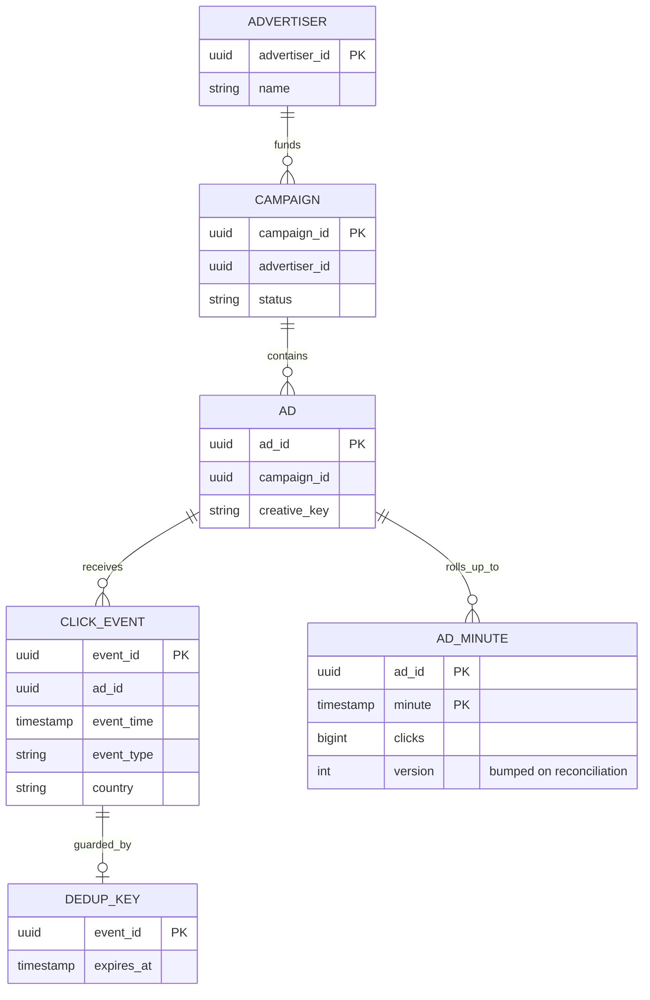
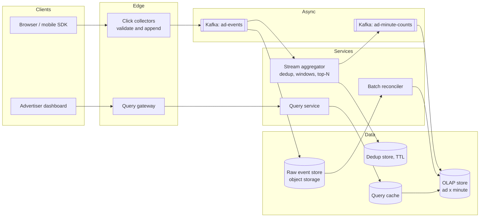
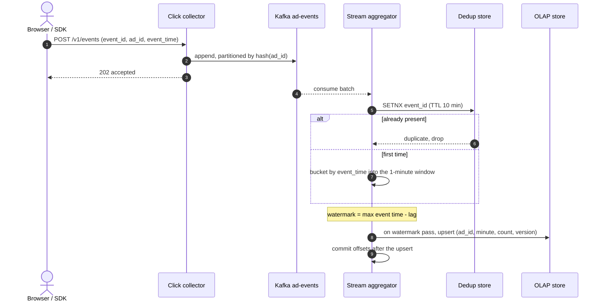
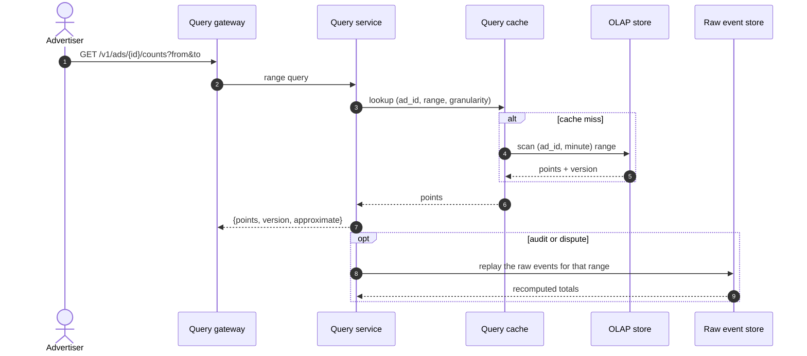
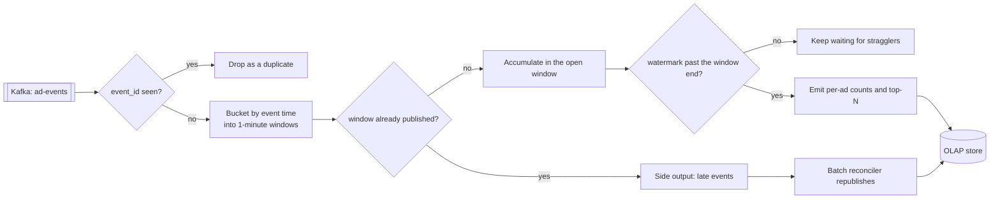

# Design an ad click aggregation system

## TL;DR

- Ad click aggregation is a **write-dominated counting pipeline**: ~30k events/s in at peak, ~60 dashboard queries/s out, so the design is a stream job, not a database schema.
- The cruxes: (1) **event-time windows and watermarks**, (2) **dedup** to turn at-least-once delivery into effectively-once counts, (3) **two stores** — an immutable raw log and a small aggregated OLAP table, (4) **batch reconciliation** that republishes a window when late data arrives, (5) **hot-key skew** when one campaign is 30% of traffic.
- Money is attached to these numbers, so "approximately right, quickly" and "exactly right, eventually" are both requirements, which is what forces the two-path design.

## Problem statement and clarifying questions

"Design a system that ingests ad impressions and clicks and lets advertisers see per-ad counts by minute, plus the top-N ads by click volume." Billing depends on the output, so the interesting requirement is not throughput — it is what "correct" means when events arrive twice, out of order, or an hour late.

| Question | Assumption taken |
|---|---|
| Volume? | 1B ad events/day, ~10k/s average, ~30k/s peak. |
| Aggregation granularity? | Per ad, per minute; rolled up to hour and day for dashboards. |
| Query volume and latency? | ~60 queries/s peak; a dashboard query in under 1 s. |
| How fresh must counts be? | Under a minute for dashboards; billing runs on the reconciled numbers. |
| Delivery guarantee from the client? | At-least-once. Events carry a unique `event_id` minted at the edge. |
| How late can an event be? | Seconds normally; up to hours from an offline mobile device. |
| Is approximate counting acceptable? | For dashboards yes, for billing no — hence a fast path and a slow path. |
| Retention? | Raw events 90 days for audit and replay; aggregates for years. |
| Are ad ids uniformly distributed? | No. A handful of campaigns dominate; assume severe skew. |

## Requirements

### Functional

- Ingest click and impression events, deduplicate them, and count them per ad per minute.
- Serve per-ad counts over an arbitrary time range, plus top-N ads by clicks in a window.
- Handle events that arrive out of order or after their window was published.
- Support recomputation: replaying a day of raw events must reproduce the aggregates exactly.

### Non-functional

- Scale: 1B events/day, 30k events/s at peak, 100k active ads.
- Latency: end-to-end ingest to a visible count under 60 s; query p99 under 1 s.
- Correctness: effectively-once counting. Billing numbers must be reproducible from the raw log.
- Availability: 99.9% for queries; ingestion must never reject an event — buffer instead.
- Durability: raw events are the system of record and are never lost.

### Out of scope

Ad serving and auctions, targeting, fraud and bot detection (assume a filter upstream), billing and invoicing, and the advertiser UI itself.

## Estimation

Using the [latency and estimation tables](../../cheatsheets/latency-and-estimation.md): a day is ~10^5 s, peak is 3x average, an event is ~1 KB (the upper end of a log line, with placement, geo and user agent), and an aggregated point is 16 B (timestamp plus value).

| Quantity | Arithmetic | Result |
|---|---|---|
| Ingest write QPS | 1B events/day / 10^5 | ~10k/s average, ~30k/s peak |
| Ingest bandwidth | 30k/s x 1 KB | ~30 MB/s — under one Kafka broker's ~100 MB/s in, so 3 brokers for replication |
| Raw storage | 1B/day x 1 KB | 1 TB/day, ~365 TB/year, ~1.1 PB at replication factor 3 |
| Aggregate storage | 100k ads x 1,440 minutes x 16 B | ~2.3 GB/day, ~840 GB/year — **400x smaller than raw** |
| Query read QPS | 100k advertisers x 20 queries/day / 10^5 | ~20/s average, ~60/s peak |
| Write/read ratio | 10k / 20 | **500:1** — inverted from a typical web service |
| Dedup store | 10k/s x 600 s TTL x 16 B key | ~100 MB of keys, comfortably one Redis shard |
| Query cache | 20% of 2M daily queries x 10 KB | ~4 GB of hot dashboard responses |
| Aggregator nodes | 30k/s peak / ~10k events/s per node, x2 | ~6 nodes, one consumer group over the partitions |

The ratio to say out loud is **500 writes per read**. Every instinct from a read-heavy design — cache aggressively, denormalise for reads — is the wrong instinct here. The right one is: make the write path cheap, sequential and replayable, and let the tiny read path query a tiny table.

## API design

| Endpoint | Request | Response | Notes |
|---|---|---|---|
| `POST /v1/events` | `{event_id, ad_id, type, event_time, ctx}` (batched, up to 500) | `202 {accepted}` | The collector only validates and appends. `event_id` makes retries free. |
| `GET /v1/ads/{id}/counts` | `?from&to&granularity=minute\|hour\|day` | `200 {points[], version}` | `version` increments when a window is reconciled, so clients can detect a correction. |
| `GET /v1/reports/top` | `?from&to&n=10&metric=clicks` | `200 {ads[], window, approximate}` | `approximate: true` while the window is still served by the fast path. |
| `GET /v1/ads/{id}/counts?cursor=...` | — | `200 {points[], next_cursor}` | Cursor over `(minute, ad_id)`; long ranges are paginated rather than truncated. |
| `POST /v1/admin/backfill` | `{from, to, reason}` | `202 {job_id}` | Replays raw events for a range; idempotent by `(from, to)`. |

The `202` on ingest matters: the collector's contract is "durably queued", not "counted". Returning `200 OK` only after aggregation would couple every device on the internet to your stream job's health.

## Data model

**Raw events are immutable and huge; aggregates are mutable and small.**



- **Raw events**: append-only files in object storage, partitioned by `date/hour/partition`, written by a sink consumer straight from the log. Columnar (Parquet) so a replay reads only the columns it needs.
- **Aggregates**: a columnar OLAP store keyed by `(ad_id, minute)`, clustered by `minute` so range scans are sequential. Hour and day rollups are materialised from it, not recomputed per query.
- **Dedup keys**: a key-value store with TTL, partitioned by `event_id` hash. It holds minutes of data, not days.
- **Ad metadata**: a small relational store, cached in the aggregator so a count never needs a join.

Partitioning is the decision to defend: the log is partitioned by `hash(ad_id)` so all events for an ad reach one aggregator instance and the per-ad counter is local, never distributed. That choice is also what creates hot-key skew, which the last deep dive fixes.

## High-level design

**v1: a collector that only appends, a stream aggregator that owns correctness, and two stores.**



**Write path: append, dedup, accumulate, and publish only when the window is complete.**



**Read path: a small table, a cache, and a flag that says whether the number is final.**



Ingest never blocks on aggregation, aggregation never blocks on the OLAP store (it batches upserts), and queries never touch the raw log except for an audit. Each stage can fail without corrupting the next, because the log holds the truth.

## Deep dive: event-time windows and watermarks

The probing question is "a click happened at 10:00:59 and arrives at 10:01:05 — which minute does it belong to?" If your answer is 10:01, you are counting by *processing* time and your billing numbers change depending on network weather.

**One event's path through the aggregator.**



The **watermark** is the mechanism that makes "complete" decidable: it is the highest event time seen minus a fixed lag, and a window is published when the watermark passes its end. The lag is the entire trade-off — raise it and you catch more stragglers but publish later; lower it and dashboards are fresher but more events land in the side output.

```python title="code/hld/windowed_aggregator.py — windows, watermark, dedup and top-N"
--8<-- "code/hld/windowed_aggregator.py:aggregator"
```

The demo runs a stream containing a retry, an out-of-order event and a straggler, and shows each one taking a different path:

```text
tumbling windows of 60 s, watermark lag 30 s
  e2 (ad_shoes at t+5s) -> duplicate
  closed window 0: ad_car=1 ad_phone=2 ad_shoes=3 (total 6)
  e11 (ad_shoes at t+20s) -> late
outcomes: {'accepted': 11, 'duplicate': 1, 'late': 1}
watermark is t+110s, so window 1 is still open
top-2 in the newest closed window: [('ad_shoes', 3), ('ad_phone', 2)]
  one t+200s event lifts the watermark to t+170s and closes window 1: ad_phone=2 ad_shoes=1
  reconciled window 0: ad_car=1 ad_phone=2 ad_shoes=4 (+1 late folded in)
stats: 12 accepted, 1 duplicates, 1 late, 2 windows closed, 13 dedup keys held
```

Note what the watermark does *not* do: it never rewrites history and it never guesses. Late events are visible, counted separately, and folded back by an explicit step.

## Deep dive: dedup and effectively-once counting

The probing question is "the collector times out and the SDK retries — do you bill the advertiser twice?" Exactly-once delivery does not exist across a network; what exists is at-least-once delivery plus an idempotent consumer, and here the consumer is a dedup set.

| Approach | Memory | Correctness | Notes |
|---|---|---|---|
| No dedup | 0 | Overcounts on every retry | Unbillable |
| Set of every `event_id` seen | 1B keys/day and growing | Exact | Unbounded: an outage away from failure |
| TTL set sized to the retry horizon (chosen) | ~100 MB for 10 minutes | Exact within the horizon | Beyond the TTL, the batch path catches it |
| Bloom filter | ~2 GB for 1B keys | May *drop* real events | False positives lose money; never for billing |
| Kafka transactions + idempotent producer | Broker-side | Exact within the pipeline | Does not help with a client that retries |

Take the TTL set and be precise about why the TTL is enough: SDK retries happen within seconds to minutes, so a 10-minute horizon covers the entire realistic duplicate window at 1/144th of the memory a day-long set would need. Anything older is caught by the batch path, which deduplicates over the whole raw file and is not memory-bound because it sorts on disk.

Two details worth stating. Kafka's idempotent producer and transactional writes remove *pipeline* duplicates (a retry after a broker acknowledgement is lost), and you should turn them on, but they cannot see the client's retry — that is what `event_id` is for. And the aggregator must commit offsets **after** the OLAP upsert, so a crash replays a batch rather than skipping it; replay is safe precisely because of the dedup set and the versioned upsert.

!!! warning "Common mistake"
    Reaching for a Bloom filter because the dedup set "does not fit in memory". A false positive here silently discards a real, billable click, and you will never find out. Bloom filters are for membership questions where a false positive costs a wasted lookup, not money. Bound the set with a TTL instead.

## Deep dive: two stores, raw and aggregated

The probing question is "can you prove this number?" Only if you kept the events. The pipeline therefore writes twice from the same log: a sink consumer lands raw events in object storage, and the aggregator writes counts to an OLAP store.

| Property | Raw event store | Aggregated store |
|---|---|---|
| Size | 1 TB/day | 2.3 GB/day |
| Shape | Append-only Parquet, partitioned by hour | `(ad_id, minute)` columnar rows |
| Mutability | Immutable | Upserted, with a version per row |
| Read pattern | Full-partition scans by batch jobs | Narrow range scans by dashboards |
| Purpose | Truth, audit, replay, new metrics | Serving |

The reason to insist on both is that they answer different questions. The aggregate answers "how many clicks did ad X get at 10:03" in milliseconds. The raw store answers "you changed the fraud filter last Tuesday — recompute the whole week" and "an advertiser disputes an invoice", neither of which an aggregate can ever answer. It is also the only way to add a dimension later: wanting counts broken down by country next quarter is a replay, not a data-loss incident.

Retention follows the cost: raw for 90 days (~90 TB, or ~270 TB replicated) on cheap object storage with lifecycle rules to colder tiers, aggregates for years because they are small. Keep the raw partitions immutable and named deterministically, so a replay of `2026-08-20/14` produces byte-identical output every time — determinism is what makes reconciliation trustworthy.

## Deep dive: reconciliation and hot-key skew

Two problems, one shape: the fast path is fast because it is approximate, and the slow path is slow because it is right.

**Reconciliation** is the batch half of a lambda architecture. Each hour, a job reads the raw partitions for a completed hour, recomputes every `(ad_id, minute)` from scratch — including events that arrived long after their window closed — and upserts the result with a higher `version`. The serving layer always reads the newest version, so a corrected number simply appears; the API exposes `approximate: true` until the reconciled version lands, which is what lets a dashboard be fast and an invoice be right. The `reconcile()` step in the module is this idea in miniature: drain the side output, fold it into the published window, bump the version.

**Hot-key skew** is what breaks the partitioning choice. Partitioning the log by `hash(ad_id)` makes per-ad counting local, but if one campaign is 30% of all traffic, one partition gets 30% of the load and one aggregator instance falls behind while five idle.

| Fix | How it works | Cost |
|---|---|---|
| More partitions | Spreads keys further | Does nothing for a single hot key |
| Key salting | Partition on `hash(ad_id, salt)` for known hot ads, sum the shards at query time | A second aggregation step for those ads |
| Two-stage aggregation | Pre-aggregate per partition, then combine | Extra hop for every key, not just hot ones |
| Local pre-aggregation at the collector | Collectors emit per-minute partials instead of raw counts | Adds latency and a second dedup problem |

Salt the known hot keys and detect new ones automatically — a heavy-hitter sketch over the ad id stream tells you which keys to salt before a campaign launch melts a partition, which is exactly the service described in [Design a Top-K heavy hitters service](top-k-heavy-hitters.md).

!!! tip "Interview tip"
    Volunteer the skew problem before the interviewer raises it. Saying "partitioning by ad id gives me local counters, and the price is that one big campaign becomes a hot partition, so I salt those keys" shows you understand the consequence of your own partitioning choice, which is the difference between a mid-level and a senior answer.

## Scaling, bottlenecks and failure modes

**v2: partitioned consumers with checkpoints, salted hot keys, tiered raw storage and a reconciler that owns the truth.**

```mermaid
flowchart LR
    subgraph clients["Clients"]
        c_dev["SDKs worldwide"]
    end
    subgraph edge["Edge (multi-region)"]
        e_col["Collectors, autoscaled<br/>local disk buffer"]
    end
    subgraph stream["Stream tier"]
        s_kafka[["Kafka: ad-events<br/>partitioned by hash(ad_id, salt)"]]
        s_agg["Aggregator group<br/>one instance per partition"]
        s_ckpt[("Checkpoint store")]
    end
    subgraph batch["Batch tier"]
        b_sink["Raw sink consumer"]
        b_recon["Hourly reconciler"]
    end
    subgraph data["Data"]
        d_hot[("Raw: hot object storage, 7 days")]
        d_cold[("Raw: cold tier, 90 days")]
        d_olap[("OLAP: ad x minute, versioned")]
        d_cache[("Query cache + rollups")]
    end
    c_dev --> e_col --> s_kafka
    s_kafka --> s_agg --> d_olap
    s_agg --> s_ckpt
    s_kafka --> b_sink --> d_hot --> d_cold
    d_hot --> b_recon --> d_olap
    d_olap --> d_cache
```



- **Consumer lag** is the first symptom of everything. Alert on lag per partition, not in aggregate, because skew hides in the average.
- **A slow OLAP store** back-pressures the aggregator, which back-pressures Kafka, which is fine — the log is the buffer. What is not fine is the aggregator dropping events to keep up; it must slow down instead.
- **Aggregator crash**: restart from the last checkpoint, replay the partition, and rely on the dedup set plus versioned upserts to make the replay harmless. Checkpoint the open-window state, not just the offset, or every restart loses a minute of counts.
- **A partition without traffic** never advances its watermark, so its windows never close. Emit periodic idle markers so a quiet ad's minute still publishes a zero.
- **Clock skew on devices** puts events in the wrong window or absurdly far in the future. Clamp `event_time` to a sane range at the collector, and record both the device time and the receipt time so the batch path can re-decide later.
- **A whole-region outage**: collectors buffer to local disk and replay; the raw store is cross-region; reconciliation repairs any window whose stream aggregation was incomplete.

## Trade-offs summary

| Decision | Chosen | Alternatives | Why |
|---|---|---|---|
| Time semantics | Event time with a watermark | Processing time | Counts must not depend on network weather |
| Window type | 1-minute tumbling | Sliding, session | Non-overlapping windows roll up cleanly to hour and day |
| Late data | Side output, then reconcile | Drop, or update forever | Published numbers stay stable; corrections are explicit and versioned |
| Dedup | TTL set on `event_id` | Bloom filter, unbounded set | Exact within the retry horizon, bounded memory, no lost clicks |
| Delivery | At-least-once + idempotent consumer | Chasing exactly-once | The only thing that actually exists across a network |
| Storage | Raw log **and** aggregates | Aggregates only | Audit, replay and new dimensions all need the events |
| Partitioning | `hash(ad_id)`, salted for hot keys | Round robin | Local counters, at the price of skew you then manage |
| Serving | Small OLAP table + cache | Query the raw log | 2.3 GB/day versus 1 TB/day |
| Correction model | Lambda: fast stream, slow batch | Kappa: stream only | Billing needs a recomputable path from immutable input |

## Interviewer follow-ups

??? question "Why not kappa — one stream job, no batch layer?"
    Kappa is attractive and it works when reprocessing means replaying the same log through a new job version. It is weaker here for two reasons: the correction has to survive changes to *upstream* logic (a new fraud filter), and an auditor wants a recomputation from immutable files, not from a topic with finite retention. A middle ground worth mentioning: keep one stream implementation and run it in batch mode over the raw store, so there is one piece of counting logic, not two.

??? question "How do you compute top-N across all ads if each aggregator only sees its partition?"
    Each instance emits its local top-N per window; a merger takes the union of those lists and re-ranks. That is exact when N is small relative to the per-partition tail, and approximate at the boundary, which is acceptable for a leaderboard and never used for billing.

??? question "How much does the watermark lag cost you?"
    It is a direct latency-for-completeness trade. At a 30-second lag, a minute's counts publish ~90 seconds after the minute starts. Measure the fraction of events arriving in the side output; if it is under a fraction of a percent, the lag is right, and if it is climbing, something upstream is slow.

??? question "What if an advertiser disputes a number?"
    Replay the raw partitions for the disputed range with the version of the pipeline that ran at the time, and compare. This is why raw files are immutable and named deterministically, and why the aggregate carries a version — you can say exactly which computation produced the invoice.

??? question "Do you count impressions the same way as clicks?"
    Same pipeline, different volume: impressions can be 100x clicks, which changes the estimation but not the design. Where they differ is tolerance — impressions can be sampled or sketched for dashboards, clicks cannot, because clicks are what gets billed.

??? question "How do you handle a schema change to the event?"
    Version the payload and register the schema; the collector accepts both versions and the aggregator reads by field name, not position. Raw files record the schema version so a replay of old partitions uses the old reader. This is the boring answer, and it is the one that keeps three years of raw data readable.

## 45-minute pacing

| Minutes | What to say and draw |
|---|---|
| 0-5 | Clarify: 1B events/day, per-ad per-minute, at-least-once with `event_id`, billing needs exactness. |
| 5-9 | Estimation: 30k events/s, 1 TB/day raw against 2.3 GB/day aggregated, 500:1 write-to-read. |
| 9-14 | API (batched ingest returning 202, range and top-N queries with a version) and the two stores. |
| 14-24 | v1 diagram; narrate the write path (append, dedup, window, publish) and the read path (small table plus cache). |
| 24-38 | Deep dives: event-time windows and the watermark, dedup and effectively-once, raw beside aggregated. |
| 38-43 | Reconciliation and hot-key skew; then failure modes — consumer lag, crash replay, idle partitions. |
| 43-45 | Trade-offs table, and the one-line kappa-versus-lambda answer. |

## Related

- [Batch and stream processing](../fundamentals/batch-and-stream-processing.md) — windows, watermarks and the lambda/kappa choice in general
- [Messaging, queues and Kafka internals](../fundamentals/messaging-and-event-streaming.md) — partitions, consumer groups, offsets and idempotent producers
- [Design a Top-K heavy hitters service](top-k-heavy-hitters.md) — the sketch that detects the hot keys this pipeline has to salt
- [Design a metrics monitoring and alerting system](metrics-monitoring.md) — the same ingest shape with different retention and query patterns
- Primary source: Akidau et al., "The Dataflow Model" (VLDB 2015), on event time, windows and watermarks
