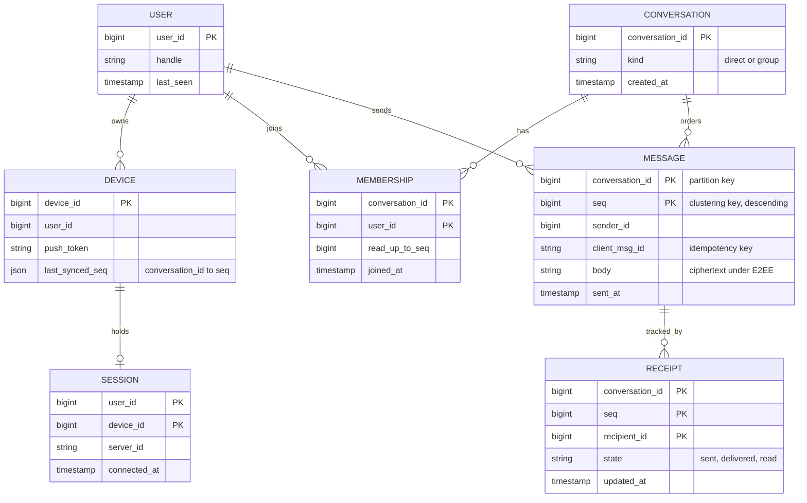
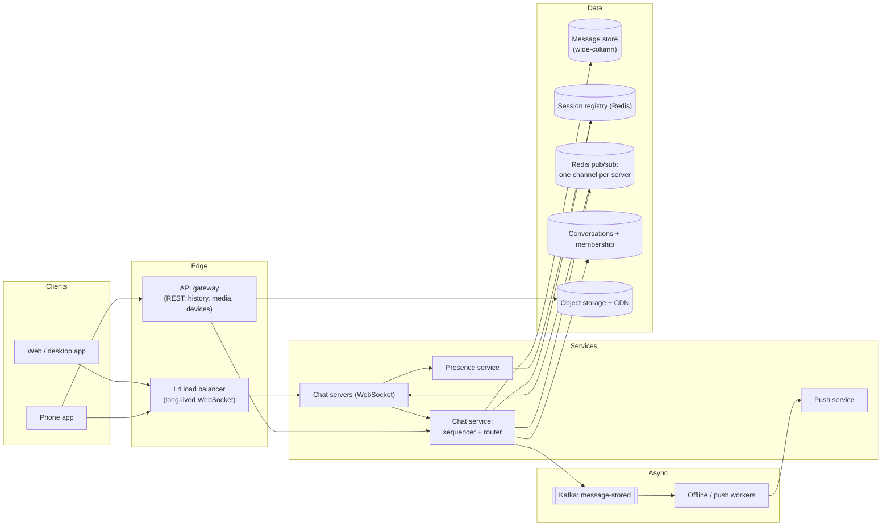
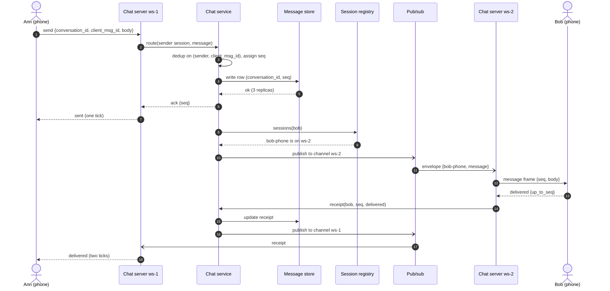
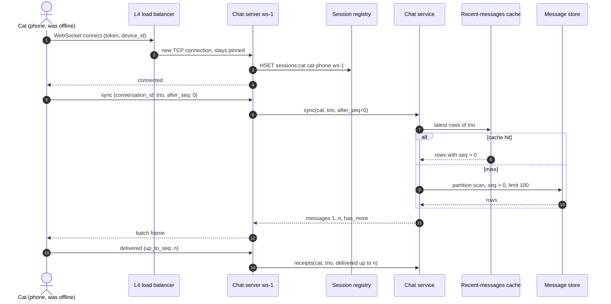
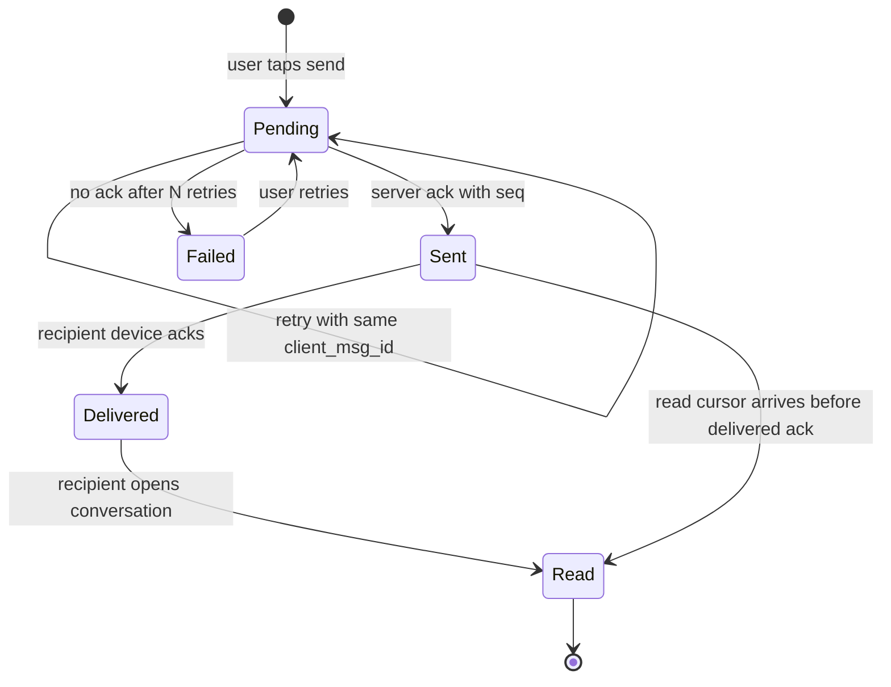
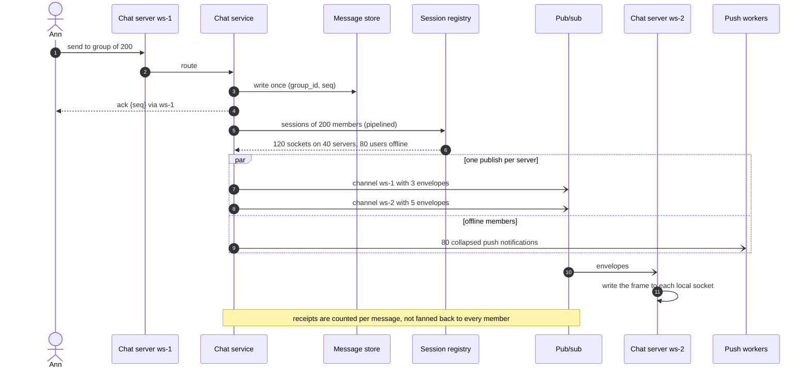
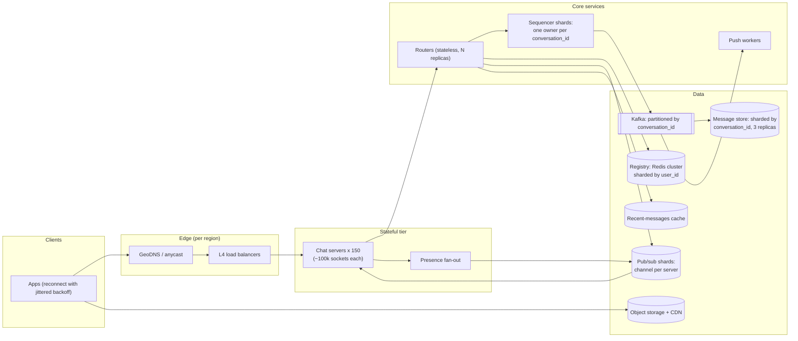

# Design a chat system

## TL;DR

- A chat system is a **stateful real-time problem**: millions of long-lived WebSockets, each pinned to one server, and a write path that must find the right server for every recipient in under a round trip.
- The cruxes an interviewer probes: (1) **connection management and the session registry** (which server holds a user), (2) **per-conversation ordering** with sequence numbers and idempotent message ids, (3) **storage by conversation** plus multi-device sync, (4) **delivery states** (sent, delivered, read) with an offline path through push, (5) **group fan-out and presence** without melting the pub/sub tier.
- The design below handles 50M DAU and 70k messages/s at peak with ~150 chat servers, a Redis session registry, a per-server pub/sub channel, and a wide-column message store partitioned by `conversation_id`.

## Problem statement and clarifying questions

"Design a messaging service like WhatsApp: one-to-one and group chats, messages delivered in real time when the recipient is online and on reconnect when they are not, with sent/delivered/read indicators." Pin down the shape of the traffic before drawing: group sizes and multi-device decide how much fan-out you sign up for.

| Question | Assumption taken |
|---|---|
| One-to-one only, or groups too? | Both; groups capped at 500 members. Broadcast channels with millions of readers are a follow-up. |
| Scale? | 50M DAU, 40 messages sent per user per day, 20% of DAU online at peak. |
| Multi-device? | Yes: a user has up to 5 devices and every device must converge on the same history. |
| Delivery guarantees? | A message is never lost once the sender sees "sent"; duplicates must be invisible to users. |
| Ordering? | Total order within a conversation; no ordering promise across conversations. |
| Latency target? | Online recipient sees the message in < 500 ms p99 end to end. |
| Message size and media? | Text up to 4 KB; images and files via object storage, referenced by id. |
| End-to-end encryption? | Yes for bodies; the server routes ciphertext and still tracks delivery state. |
| Retention? | Server keeps history for sync; the client is the primary store (WhatsApp model). |

## Requirements

### Functional

- Send a text message to a one-to-one or group conversation; attach media by id.
- Deliver in real time to every online device of every member, including the sender's other devices.
- Deliver on reconnect to devices that were offline; notify offline users through push.
- Show per-message state to the sender: sent, delivered, read (group: when all members reach it).
- Presence: online/offline indicator and "last seen" for contacts; typing indicators.

### Non-functional

- Scale: 50M DAU, 2B messages/day, ~23k messages/s average and ~70k/s at peak; 10M concurrent connections.
- Latency: < 500 ms p99 from sender's tap to recipient's screen when both are online; < 200 ms p99 for the sender's "sent" ack.
- Consistency: strong ordering inside a conversation (a single sequencer per conversation); eventual everywhere else (presence, read receipts).
- Durability: a message acknowledged as "sent" is replicated to 3 nodes before the ack.
- Availability: 99.99% for send and receive; a chat server crash must cost its users one reconnect, not lost messages.

### Out of scope

Voice and video calls, spam and abuse detection, search over message history, the key-exchange protocol itself (we mention where E2EE changes the design), media processing.

## Estimation

Using the [latency and estimation tables](../../cheatsheets/latency-and-estimation.md) (a day is ~10^5 s, peak is 3x average):

| Quantity | Arithmetic | Result |
|---|---|---|
| Messages per day | 50M DAU x 40 | 2B/day |
| Write QPS | 2B / 86,400 | ~23k/s average, ~70k/s peak |
| Socket writes (deliveries) | each message reaches ~2 sockets (recipient plus the sender's other device; groups more) | ~50k/s average, ~150k/s peak |
| Read QPS (history and sync) | 50M DAU x 10 conversation opens/day = 500M/day / 10^5 | ~5k/s average: the read path is small, the push path is the problem |
| Storage | 2B x 100 B = 200 GB/day x 365 | ~73 TB/year, ~220 TB/year with 3 replicas |
| Media | 5% of messages x 200 KB = 100M x 200 KB | 20 TB/day into object storage, served by CDN |
| Bandwidth | 70k/s x 1 KB (frame with headers) in, x2 out | ~70 MB/s in, ~140 MB/s out: ~1 Gbps, never the bottleneck |
| Concurrent sockets | 50M x 20% online at peak | 10M long-lived connections |
| Chat servers | assume 100k sockets per server (state it as an assumption): 10M / 100k = 100, x1.5 headroom | ~150 servers |
| Session registry | 10M sessions x ~100 B (user, device, server, timestamp) | ~1 GB in Redis; 70k peak sends x ~3 lookups = ~200k lookups/s, so 4 shards at ~100k ops/s |
| Message store | 70k writes/s peak x 3 replicas = 210k node-writes/s at ~5k-10k per node | ~25-40 wide-column nodes |
| Recent-messages cache | 20% of 50M conversations touched per day x 50 messages x 100 B | ~50 GB |

Say two things out loud: the read/write ratio is close to **1:1** (every message is read about as often as it is written), so there is no feed to precompute; and the hard resource is **10M open sockets**, which forces a stateful server tier and therefore a registry that maps users to servers.

## API design

Messaging rides on one WebSocket per device; REST covers everything that is not latency-critical.

| Endpoint or frame | Request | Response | Notes |
|---|---|---|---|
| `WS /v1/connect` | upgrade with bearer token, `device_id`, `last_synced` map | `connected {server_id, resume_token}` | The server registers the session. Frames below flow over this socket. |
| frame `send` | `{conversation_id, client_msg_id, body, media_id?}` | `ack {client_msg_id, seq, sent_at}` | `client_msg_id` is the idempotency key: a retry returns the same `seq`. |
| frame `delivered` / `read` | `{conversation_id, up_to_seq}` | none | Cursors, not per-message: one frame acks everything up to `seq`. Idempotent. |
| `GET /v1/conversations/{id}/messages?after_seq=100&limit=100` | — | `200 {messages[], has_more}` | Sync and scroll-back paginate by `seq` (`before_seq` for history); no offsets. |
| `POST /v1/conversations` | `{kind, member_ids[]}` + `Idempotency-Key` | `201 {conversation_id}` | Direct chats are deduplicated on the sorted member pair. |
| `POST /v1/devices` | `{device_id, push_token, platform}` | `204` | Push tokens live with the device, not the user. |
| `POST /v1/media/uploads` | `{content_type, size}` | `200 {upload_url, media_id}` | Presigned upload straight to object storage. |

The user id always comes from the token. Every server-to-client frame carries `seq`, so a client can detect a gap (it holds 41, receives 43) and issue a sync for 42 instead of trusting the socket.

## Data model

**Messages are partitioned by conversation and clustered by sequence number; sessions are a cache, not a table.**



Store choices, with the sentence to say for each:

- **Messages**: a wide-column store (Cassandra, ScyllaDB, HBase) with partition key `conversation_id` and clustering key `seq` descending. Every query the product needs — "latest 50", "everything after seq N", "everything before seq N" — is one partition scan. Bucket very long conversations as `(conversation_id, seq // 10_000)` so no partition grows without bound.
- **Receipts**: same store, keyed by `(conversation_id, seq, recipient_id)`; for groups store a counter of delivered/read members instead of one row per recipient.
- **Membership and conversations**: a key-value store keyed by `conversation_id`, plus a reverse index `user_id -> conversation_ids` for the conversation list.
- **Sessions**: Redis hash per user (`sessions:{user_id}`) and a liveness key per server. Rebuildable: if Redis loses it, clients reconnect and rewrite it.
- **Media**: object storage behind a CDN; the message row stores `media_id` and the ciphertext key.

## High-level design

**v1: sticky WebSockets on a stateful tier, a chat service that sequences and routes, and a registry plus pub/sub to cross servers.**



**Write path: sequence, persist, ack the sender, then find the recipient's server and publish to it.**



**Read path: a device reconnects, re-registers, and pulls everything after the last seq it holds.**



Walk-through: the sender's ack depends on exactly one durable write, so "sent" arrives in about one store round trip. Finding Bob costs one registry lookup and one publish; the chat server never talks to another chat server directly. A device that was offline does not need a separate queue: the message store *is* the queue, indexed by `seq`, and push exists only to wake the device up.

## Deep dive: connection management and the session registry

The probing question is "Ann is connected to server 17 and Bob to server 203 — how does Ann's message reach Bob?" First the transport:

| Transport | Server push | Cost per idle client | Breaks when |
|---|---|---|---|
| Short polling | Emulated | One request per interval: 10M clients at 5 s = 2M QPS of mostly empty responses | Any real scale |
| Long polling | Yes, one message per request | A held request plus reconnect per message | High message rates; proxies time out |
| SSE | Yes, server to client only | One HTTP connection | Client-to-server needs a second channel |
| WebSocket | Yes, both directions, framed | One TCP connection, ~one heartbeat per 30 s | Stateful servers: you now need a registry |

WebSocket wins for chat because traffic is bidirectional and bursty; the price is that a user is *somewhere*, and every sender must find out where. The background is on the [networking page](../fundamentals/networking-essentials.md).

The mechanism has three parts. An **L4 load balancer** assigns a new connection to a server and keeps it pinned (it is one TCP stream, so stickiness is free). The server writes `HSET sessions:{user_id} {device_id} {server_id}` to the **registry** and deletes it on a clean close. Every server **subscribes to its own pub/sub channel**; a router publishes an envelope to `channel:{server_id}` and the server writes the frame to the local socket. Heartbeats run at two levels: a ping/pong per socket every 30 s so the server notices half-open TCP connections (the phone went through a tunnel), and one liveness key per server in the registry refreshed every 5 s. The second level is what makes crashes cheap: when a server dies with 100k sockets, no one deletes 100k hash fields — readers see a stale server id, treat the user as offline and clean up lazily, while the clients reconnect elsewhere with jittered backoff and re-register.

```python title="code/hld/chat_router.py — registry, bus and chat server"
--8<-- "code/hld/chat_router.py:registry"
```

```python title="code/hld/chat_router.py — cross-server pub/sub"
--8<-- "code/hld/chat_router.py:bus"
```

Two details that distinguish a strong answer: the registry is per *device*, not per user, because multi-device means fan-out to every session; and the registry is a **rebuildable cache** — losing it costs one reconnect storm, which you absorb with backoff and connection-rate limits at the load balancer, not with a replicated database.

## Deep dive: ordering, message ids and storage

"Bob's phone shows my messages in a different order than my laptop" is the bug this deep dive prevents. The options for ordering a conversation:

| Order by | Total order? | Gap detection | Cost | Fails when |
|---|---|---|---|---|
| Client timestamp | No: clocks skew and go backwards | None | Free | Two phones disagree by seconds |
| Server arrival time | Only per server | None | Free | Two servers sequence the same conversation |
| Global Snowflake id | Yes, roughly by time | None (ids are sparse) | An id service | Clients cannot tell "I missed one" |
| Per-conversation sequence number | Yes, exact | Yes: 41 then 43 means 42 is missing | A single sequencer per conversation | The sequencer is a hot spot for a giant channel |

Choose the **per-conversation `seq`** assigned by a single owner: the chat-service shard that owns `conversation_id` (or a Redis `INCR` on a key per conversation in v1). Because ids are dense, every cursor in the API (`after_seq`, `read_up_to_seq`, `last_synced_seq`) is an integer, and a device that holds 41 and receives 43 knows to sync 42 without any server help. Keep a time-sortable global id as a secondary attribute when you need cross-conversation features (search, export), but never use it for ordering. The chapter on [time and ordering](../fundamentals/time-and-ordering.md) covers why wall clocks cannot do this job.

Storage follows the access pattern. Every product query is "messages of one conversation around one seq", so partition by `conversation_id` and cluster by `seq` descending in a wide-column store; a 70k writes/s peak is ~25-40 nodes at 3 replicas. **Multi-device sync** falls out of the same key: each device keeps `last_synced_seq` per conversation and asks for `after_seq` on connect; the server never tracks "which device has what", it just answers range queries. Idempotency is part of the write: the `(sender_id, client_msg_id)` pair maps to the `seq` it got, so a retry after a lost ack returns the same message instead of a duplicate.

```python title="code/hld/chat_router.py — sequencing, routing, receipts and sync"
--8<-- "code/hld/chat_router.py:service"
```

Note where the lock sits: sequencing and storing happen under it; routing (registry lookups, publishes) happens outside it, so one slow socket never delays the next message's `seq`.

## Deep dive: delivery states, offline queue and push

The sender's ticks are a per-recipient state machine, and the rule that keeps it honest is **forward only**: a late "delivered" ack after a "read" cursor must not regress the state.

**Message status as the sender's client and the server see it.**



Delivered and read are **cursors, not per-message events**: the device sends `delivered {up_to_seq}` once per batch, and "read" is the conversation's `read_up_to_seq`. That turns 2B potential receipt writes per day into a fraction of that, and it makes the server logic a comparison (`seq <= up_to_seq`) instead of a lookup per message. For groups, the sender's state is the weakest state across members (one member who has not received keeps the message at "sent"), and you store a delivered/read counter per message rather than 500 rows.

Offline handling needs no separate queue. The store already holds every message by `seq`, so a returning device syncs; the only extra work is a **push notification** so the device wakes up, sent by workers that consume the `message-stored` topic, check the registry, and call the [notification system](notification-system.md) for users with no live session. Collapse pushes per conversation (one notification saying "3 new messages"), and never include the body if the body is end-to-end encrypted. On E2EE generally: the server routes ciphertext and still sees the metadata it needs — conversation id, seq, sender, receipts — so nothing on this page changes except that search and server-side previews become impossible and the key directory becomes part of the design.

What the module prints for the trio scenario (Cat offline, Ann on two devices):

```text
trio:1 sent from ann-phone; retry returned seq 1 (idempotent)
ann-laptop outbox: ['lunch?'] (multi-device)
bob-phone outbox:  ['lunch?'] (via ws-2 channel)
push notifications: [('cat', 'trio:1')] | cat online: False
status: sent
after bob's delivered ack: sent (cat has not received it)
cat connects, sync(after_seq=0) -> [(1, 'lunch?')]
after cat's delivered ack: delivered
after both read: read
trio:2: the order inside a conversation is a counter, never a clock
ws-2 gone: bob's session dropped -> ('bob', 'trio:3') | bob online: False
```

## Deep dive: group fan-out and presence

"What changes for a group of 500?" The message is still written **once**; the fan-out happens at delivery, and the unit of work is the *server*, not the socket.

**Group send: one durable write, one registry batch, one publish per server that holds members.**



Sizing the fan-out: 70k messages/s at peak, most of them one-to-one, with groups averaging tens of online members, lands around 150k socket writes/s across the fleet and a few tens of thousands of pub/sub publishes per second once you group envelopes by server. That is within one Redis pub/sub shard's ~100k ops/s, with room for a second shard keyed by server id. Cap group size (500 here) so that the per-message cost stays bounded; beyond that you switch to **fan-out on read** — a channel stores the message once and clients pull by `seq` on open or on a lightweight "new seq available" ping — which is how broadcast channels with millions of subscribers work.

**Presence** is the same pub/sub problem with a worse ratio: an online/offline flip for a user with 300 contacts is 300 deliveries, and a phone in a lift flips several times a minute. Three tactics: derive online state from the registry rather than a separate heartbeat (a live session means online), **debounce** transitions with a 30 s grace period before publishing "offline", and fan out only to contacts who currently have the app open (their servers are known from the same registry). "Last seen" is written lazily on disconnect. The [Nearby Friends](nearby-friends.md) page scales this exact pattern to location updates every 30 s.

## Scaling, bottlenecks and failure modes

**v2: regional stateful tiers, a sharded registry and pub/sub, a partitioned log as the sequencer's durability, and a sharded message store.**



What changes from v1: the sequencer becomes a sharded service that owns conversations by consistent hashing, appends each message to a Kafka partition keyed by `conversation_id` with all replicas acknowledging, and acks the sender from the log; the message store and the push workers are consumers. The log gives ordering and durability in one hop, and a sequencer shard that dies recovers its counters by reading the tail of its partitions.

What breaks first, and what you do about it:

- **Reconnect storms**: a server crash or a deploy drops 100k sockets at once; clients back off with jitter, the load balancer caps new connections per second, and the registry absorbs 100k `HSET`s spread over a minute instead of a second.
- **Registry staleness**: a router publishes to a server that is gone. The publish has no subscriber (or the liveness key expired), so the router treats the user as offline, drops the session and sends a push; the client reconnects and syncs. Nothing is lost because the store, not the socket, is the source of truth.
- **Hot conversations**: a 500-member group at 10 messages/s is 5k deliveries/s on one sequencer and one partition. Sequencers are cheap (one counter), so the fix is capping group size and grouping publishes per server; for larger audiences use fan-out on read.
- **Hot partitions in the store**: bucketing by `seq // 10_000` keeps any single partition bounded; time-bucketing is the alternative when messages are sparse.
- **Kafka lag**: messages are already acked, so lag delays push notifications and store writes, not delivery to online users — say that the sender's ack comes from the replicated log, not from the consumer.
- **Multi-region**: pin a conversation to a home region (its sequencer lives there); users elsewhere pay one cross-region round trip (~70-150 ms) on send, which stays inside the 500 ms budget. Replicate the store asynchronously for reads and disaster recovery.
- **Degradation order**: drop typing indicators first, then presence fan-out, then read receipts; never the message path.

## Trade-offs summary

| Decision | Chosen | Alternatives | Why |
|---|---|---|---|
| Transport | WebSocket with sticky L4 | Long polling, SSE, HTTP/2 push | Bidirectional, one socket per device, cheapest idle cost |
| Finding a user | Registry (Redis hash per user) + channel per server | Broadcast to all servers, consistent hashing of users to servers | One lookup per recipient; no rebalancing on scale-out |
| Ordering | Per-conversation `seq` from one owner | Client time, global Snowflake | Exact total order and gap detection; cheap cursors |
| Message store | Wide-column by `conversation_id`, clustered by `seq` | Relational sharded by user, document store | Every query is a partition range scan |
| Delivery receipts | Cursors (`up_to_seq`), forward-only | Per-message events | Orders of magnitude fewer writes; no regressions |
| Offline delivery | Store is the queue + push wake-up | Separate per-user queue | One source of truth; sync is a range read |
| Group fan-out | Write once, publish per server, cap size | Write per member (inbox model) | Bounded cost; inbox model multiplies storage by members |
| Ack point | After replicated write (log or quorum) | After recipient delivery | "Sent" means durable, not seen; recipient may be offline for days |

## Interviewer follow-ups

??? question "How does end-to-end encryption change the design?"
    Bodies become ciphertext the server cannot read, keys are per device (so a message to a user is encrypted once per device, which is why the registry is per device), and the server keeps exactly the metadata it needs: conversation id, seq, sender, receipts. Server-side search, link previews and content moderation disappear; a key directory and key-change notifications appear. Push notifications carry no content.

??? question "Why not a global Snowflake id for every message?"
    Keep one as a secondary id if you like, but do not order by it: ids from different sequencers interleave by wall clock, and sparse ids give the client no way to detect a missing message. A dense per-conversation counter gives both ordering and gap detection for free.

??? question "A chat server dies with 100k sockets. Walk me through the next 60 seconds."
    Clients detect the dead socket (failed ping or TCP reset) and reconnect with jittered exponential backoff; the load balancer spreads them across the remaining servers; each reconnect rewrites its registry entry and syncs by `after_seq`. Meanwhile routers that hit the stale server id find no subscriber, mark those users offline and send pushes; nothing is lost because every message is in the store before it is acked.

??? question "How would you support a 100k-member channel?"
    Switch from fan-out on delivery to fan-out on read: store the message once, publish a tiny "new seq" signal to online members (or nothing and rely on periodic pulls), and let clients fetch by `seq` on open. Receipts become aggregate counters or are disabled. Slack and Telegram channels behave this way.

??? question "Can you guarantee exactly-once delivery?"
    No system does; you get at-least-once plus idempotency. The client's `client_msg_id` makes resends safe on the write side; `seq` makes the read side idempotent (a device drops a frame whose seq it already holds). Say "effectively once" and explain both halves.

??? question "Typing indicators and presence seem to generate more traffic than messages. How do you keep them cheap?"
    They do. Typing indicators are fire-and-forget, sent at most every 3 s, only to members with the conversation open, and never stored. Presence transitions are debounced with a 30 s grace period and fanned out only to contacts who are online. If the pub/sub tier is under pressure, these are the first things you shed.

??? question "Where does a conversation live in a multi-region deployment?"
    Pin it to a home region chosen at creation (the sequencer and the partition live there); members in other regions pay one cross-region hop on send. Replicate the store asynchronously for local history reads and for failover. Moving a conversation's home is a rare, explicit migration, not an automatic one.

!!! tip "Interview tip"
    Lead with the state: "10M open sockets means users are pinned to servers, so the first component I need is a registry that says where a user is, and the second is a way to publish to that server." That sentence shows you understand why chat differs from the stateless services in every other case study.

!!! warning "Common mistake"
    Ordering messages by client or server timestamp. Two devices, two servers and one clock-skew incident later the conversation reads differently on each phone. Assign a per-conversation sequence number from a single owner and make every cursor in the API that number.

## 45-minute pacing

| Minutes | What to say and draw |
|---|---|
| 0–5 | Clarify: groups up to 500, multi-device, E2EE bodies, 50M DAU, < 500 ms online delivery, never lose a "sent" message. |
| 5–9 | Estimation: 23k msg/s average and 70k/s peak, 10M concurrent sockets, ~150 servers, 200 GB/day; state that the socket count, not QPS, drives the design. |
| 9–14 | API over one WebSocket (send, delivered, read cursors) and the data model: messages by `conversation_id` clustered by `seq`. |
| 14–24 | v1 diagram; narrate the write path (seq, durable write, ack, registry lookup, publish to the owner server) and the reconnect sync path. |
| 24–40 | Deep dives in order: registry and heartbeats, per-conversation sequencing and idempotency, delivery states as cursors with push for offline users, group fan-out per server and presence debouncing. |
| 40–45 | v2: sharded registry and pub/sub, log-backed sequencers, reconnect storms and stale sessions, degradation order; close with the trade-offs table. |

## Related

- [Networking for system design](../fundamentals/networking-essentials.md) — WebSocket vs long polling vs SSE, L4 vs L7 balancing, keepalives
- [Design Nearby Friends](nearby-friends.md) — the same registry and pub/sub pattern under 333k updates/s
- [Design a notification system](notification-system.md) — the push path for offline recipients
- [Mock HLD interview: chat system](../../mocks/mock-hld-chat.md) — this design as a 45-minute transcript
- [Messaging, queues and Kafka internals](../fundamentals/messaging-and-event-streaming.md) — partitioning by conversation id and acks=all as the durability hop
- [Time, clocks and ordering](../fundamentals/time-and-ordering.md) — why a counter beats a timestamp
- Primary sources: RFC 6455 (The WebSocket Protocol); the Signal Protocol documentation (Double Ratchet and Sesame for multi-device); Discord Engineering, "How Discord Stores Trillions of Messages" (2023)
