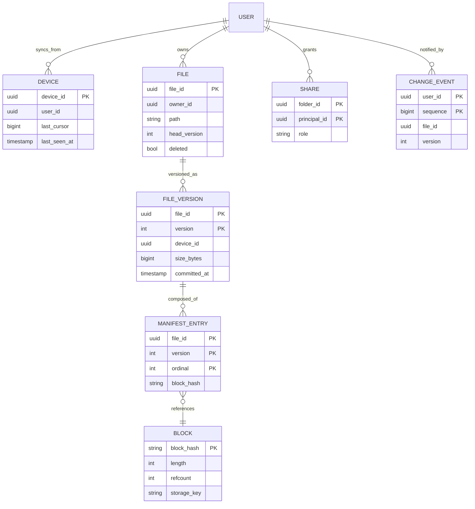
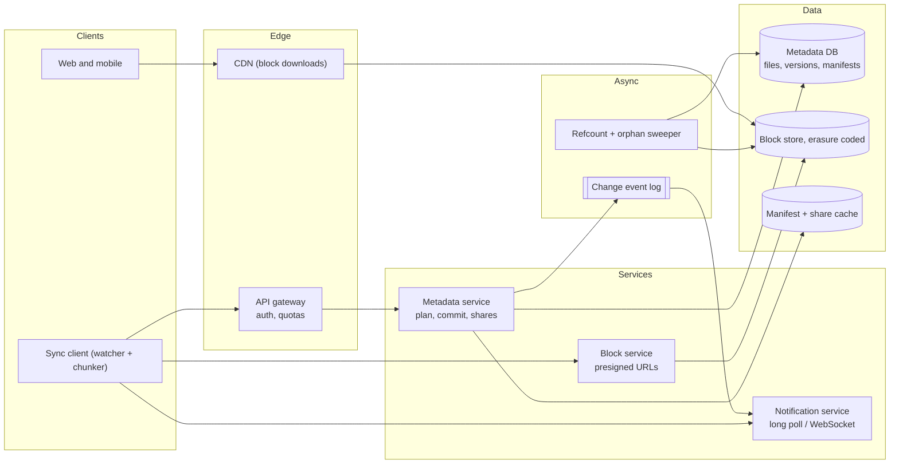
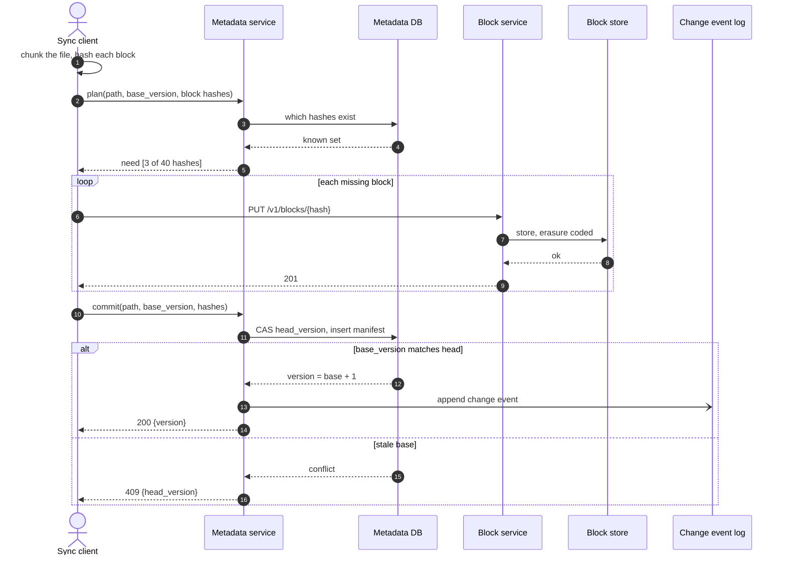
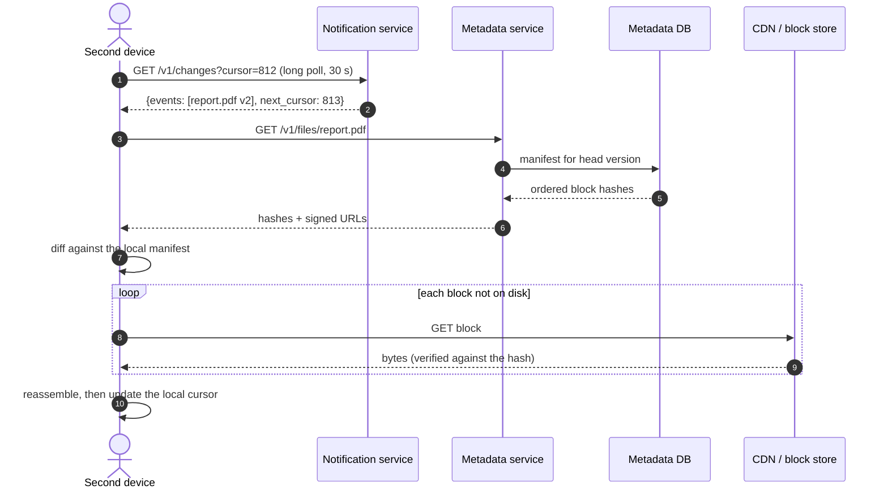
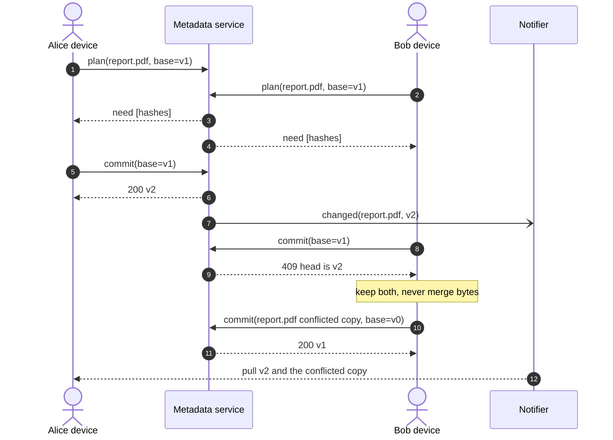
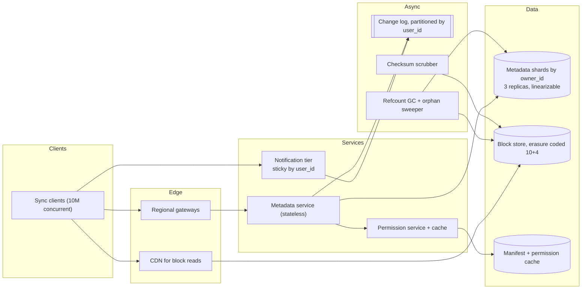

# Design Dropbox or Google Drive

## TL;DR

- File sync is **two systems glued by a manifest**: an immutable, content-addressed block store that scales like object storage, and a small strongly consistent metadata store that says which blocks are the current version of a file.
- The cruxes an interviewer probes: (1) **chunking** — fixed versus content-defined, and the dedup that follows, (2) **delta sync**, (3) the **manifest store** and why it alone needs strong consistency, (4) **change notification and conflict resolution**.
- The number that justifies the whole design: delta sync turns 500 TB/day of naive uploads into ~120 TB/day, and content-defined boundaries are what keep a one-byte insert from re-sending the entire file.

## Problem statement and clarifying questions

"Design a service that keeps a folder identical across a user's devices, and lets them share it." The interviewer wants the sync client's problem, not a file upload API. Everything interesting happens when two devices disagree.

| Question | Assumption taken |
|---|---|
| Scale? | 100M registered users, 50M DAU, ~10 file changes per active user per day. |
| Typical file size and mix? | ~1 MB average changed file; 20% of changes are new files, 80% are edits to existing ones. |
| Block size in production? | 1-8 MB. The code below uses ~1.7 KB chunks so a demo fits on a page. |
| Offline editing? | Yes, which is where conflicts come from. |
| Do we merge concurrent edits? | No. Files are opaque bytes; the loser gets a conflicted copy. |
| Sharing model? | Folder-level roles (viewer, editor, owner) with inheritance; per-file grants are a follow-up. |
| Consistency requirement? | The manifest must be strongly consistent per file; blocks may be eventually consistent. |
| How fast must a change reach another device? | Under 5 s p99 while both are online. |
| Connections per notification node? | ~100k idle long-lived connections, so 10M concurrent devices need ~100 nodes. |
| Versioning and undelete? | 30 days of versions and a 30-day trash. |

## Requirements

### Functional

- Upload, download, move, rename and delete files, keeping every device in a shared folder identical.
- Transfer only what changed on an edit, and never store the same bytes twice.
- Keep 30 days of versions and support restoring one.
- Share a folder with roles; revoking access takes effect immediately.
- Detect concurrent edits and keep both sides as a conflicted copy.

### Non-functional

- Scale: 5k file changes/s average, 15k/s peak; ~10 Gbps of upload bandwidth average.
- Consistency: linearizable commit per file (compare-and-set on a version); blocks are immutable and eventually consistent.
- Durability: 11 nines for stored blocks via erasure coding plus end-to-end checksums; an acknowledged commit is never lost.
- Availability: 99.99% for metadata reads, 99.9% for uploads, which are retryable.
- Sync latency: a committed change is visible to another online device within 5 s p99.

### Out of scope

Real-time collaborative editing, document preview and rendering, full-text search over file contents, mobile offline-selection policy, enterprise data-residency controls.

## Estimation

Using the [latency and estimation tables](../../cheatsheets/latency-and-estimation.md) (a day is ~10^5 s, peak is 3x average, a compressed photo is 200 KB-2 MB):

| Quantity | Arithmetic | Result |
|---|---|---|
| File changes/day | 50M DAU x 10 | 500M/day = ~5k/s, ~15k/s peak |
| Naive upload bytes | 500M x 1 MB | 500 TB/day |
| With delta sync | 100M new x 1 MB + 400M edits x 50 KB | ~120 TB/day: a 4x cut |
| Upload bandwidth | 120 TB / 10^5 s | ~1.2 GB/s = ~10 Gbps, ~30 Gbps peak |
| Stored/year | 100 TB/day of new content x 365, x0.7 after cross-user dedup | ~25 PB/year (x1.4 erasure coded: ~35 PB) |
| File metadata | 100M users x 200 files x 500 B | 20B rows, ~10 TB |
| Manifest rows | 20B files x ~1.3 blocks x 32 B | ~830 GB, cacheable per user |
| Change events | 500M changes x 2.5 devices | 1.25B/day = ~12.5k/s, ~38k/s peak |
| Notification nodes | 10M concurrent devices / 100k per node | ~100 nodes plus headroom |

Two things to say out loud. **Delta sync is worth 4x on bandwidth and dedup is worth ~30% on storage**, and those are different mechanisms solving different bills. And **the metadata store is small** — 10 TB against 25 PB of blocks — which is exactly why you can afford to make it strongly consistent while the block store stays a cheap eventually consistent object store.

## API design

| Endpoint | Request | Response | Notes |
|---|---|---|---|
| `POST /v1/files/{path}:plan` | `{base_version, chunks: [{hash, length}]}` | `200 {need: [hash]}` | One round trip of hashes decides the transfer. 16-32 B per block, not megabytes. |
| `PUT /v1/blocks/{hash}` | raw bytes | `201` | Content-addressed and idempotent: re-uploading the same hash is a no-op. Large files use a presigned URL instead. |
| `POST /v1/files/{path}:commit` | `{base_version, chunks: [hash], mtime}` + `Idempotency-Key` | `200 {version}` or `409 {head_version}` | Compare-and-set. The 409 is the conflict signal, not an error to hide. |
| `GET /v1/files/{path}?version=` | — | `200 {version, chunks: [{hash, length, url}]}` | Block URLs are short-lived and signed; downloads bypass the API tier. |
| `GET /v1/changes?cursor=` | — | `200 {events: [...], next_cursor}` | Long poll, up to 30 s. The cursor is a per-user monotonic sequence, so a device never misses an event. |
| `POST /v1/shares` | `{path, principal, role}` | `201` | Grants are on the folder; children inherit unless overridden. |

The `plan` then `commit` shape is the whole protocol. A client never uploads before asking, and never commits before uploading, so a crash between the two costs nothing but orphaned blocks that a sweeper collects.

## Data model

**Blocks are immutable and shared by everyone; a version is an ordered list of block hashes.**



Store choices, with the one sentence to say for each:

- **File, version and manifest**: a relational or NewSQL store sharded by `owner_id` (or by the shared folder's root id), because a commit is a transaction over three rows and must be linearizable. Partition key `owner_id`, index on `(file_id, version desc)`.
- **Block**: object storage keyed by the content hash, with an erasure-coded backend. The database keeps only `(hash, length, refcount, storage_key)`.
- **Change events**: an append-only per-user table with a monotonic `sequence`, which is what makes the long-poll cursor exact rather than time-based.
- **Share**: a small table read on every metadata call and therefore cached; folder-level grants with inheritance keep the row count tiny compared with per-file grants.
- **Device**: keeps `last_cursor` server-side too, so a client that loses its local state can resume rather than re-scan everything.

## High-level design

**v1: metadata and blocks are separate services with separate consistency models.**



**Write path: plan, upload only the missing blocks, then commit with a version check.**



**Read path: a device is told what changed, then pulls only the blocks it lacks.**



Walk-through: bytes never pass through the metadata service, and manifests never pass through the block service. The metadata service handles a few thousand small transactions a second; the block service handles gigabits of immutable content-addressed blobs that a CDN is happy to cache forever. Long polling with a monotonic cursor means a device that was offline for a week catches up by paging the event log rather than by re-scanning its folder.

## Deep dive: content-defined chunking and deduplication

The probing question is "a user adds one line to the top of a 200 MB log file — how much do you upload?" With fixed-size blocks, all of it: every boundary shifts by one byte, so every block hashes differently.

| Strategy | Insert at the front | Boundary cost | Dedup reach |
|---|---|---|---|
| Whole-file hash | Re-upload the file | None | Identical files only |
| Fixed 4 MB blocks | Re-upload the file | Trivial | Identical aligned regions |
| Content-defined chunking | One chunk | A rolling hash over the whole file | Any shared region, in any file |
| Fixed blocks + rsync rolling diff | One block | Server must hold the old copy | Same file only |

Content-defined chunking cuts where a **rolling hash of the last few dozen bytes** matches a mask. Because the boundary depends only on nearby content, an insert re-synchronises within one chunk instead of shifting everything after it. A `min_size` floor stops runs of tiny chunks and a `max_size` ceiling bounds incompressible data; the realised mean lands near `min_size + avg_size`, which is a detail worth knowing before you size the mask.

```python title="code/hld/chunker_delta_sync.py — rolling hash and chunking"
--8<-- "code/hld/chunker_delta_sync.py:chunking"
```

The demo makes the difference concrete on 64 KB of random data, and shows why the insert case is the one that matters:

```text
report.pdf v1: 65536 bytes -> 38 chunks (avg 1724 B)
insert 1 byte at offset 0:
  fixed 1 KB blocks:  65/ 65 chunks resent,  65537 B (0% saved)
  content-defined:     1/ 38 chunks resent,   1193 B (98% saved)
edit 100 bytes in the middle:
  fixed 1 KB blocks:   1/ 64 chunks resent,   1024 B (98% saved)
  content-defined:     1/ 38 chunks resent,   1488 B (98% saved)
append 4 KB at the end:
  fixed 1 KB blocks:   4/ 68 chunks resent,   4096 B (94% saved)
  content-defined:     3/ 40 chunks resent,   6971 B (90% saved)
chunk store: 38 unique blocks, 3 duplicate puts deduplicated, 65536 B stored
conflict: report.pdf moved to v2 while bob edited v1
  resolved by keeping both: 'report.pdf (bob's conflicted copy)' v1 (65536 B)
```

Deduplication then falls out of addressing: the store's key *is* the block's hash, so the same attachment in a thousand mailboxes is stored once. Two caveats to volunteer. **Cross-user dedup leaks information** — an attacker who can time an upload learns whether a block already existed, which is a known side channel; scoping dedup per user or per team removes it at the cost of storage. And **deletion needs reference counts**, because you cannot free a block another manifest still points at.

## Deep dive: delta sync and the upload path

The probing question is "walk me through exactly what crosses the wire when a 1 GB video's metadata tag changes." The answer is a list of hashes and one block.

The client chunks locally, hashes each chunk, and sends only the hashes to `plan`. The server answers with the subset it does not already hold — which, thanks to cross-user dedup, is often fewer blocks than the file changed, because someone else already uploaded those bytes. The client uploads exactly those and commits the full ordered hash list. For a 1 GB file at 4 MB blocks that is 256 hashes, about 8 KB of request, to avoid transferring a gigabyte.

Two choices worth defending. **Where the bytes go**: small blocks through a block service (which can batch, compress and verify), large ones straight to object storage through a presigned URL. Proxying bytes through a service is a bandwidth bill with no benefit once the payload is large. **Where the chunking happens**: on the client, always. Server-side chunking means uploading the whole file first, which defeats the point, and client-side chunking gives resumability for free — an interrupted upload resumes at the first missing hash.

Two failure cases the interviewer will reach for. A **crash between upload and commit** leaves orphaned blocks; a sweeper collects blocks whose refcount has been zero for longer than a safety window. And **a client that commits a hash it never uploaded**: the server checks every hash in the commit exists and is readable before advancing the version, and verifies bytes against their hash on write, because a content-addressed store that does not verify addresses is one an attacker can poison.

!!! tip "Interview tip"
    Lead with "the client chunks and hashes, then asks the server which hashes it needs." That single sentence contains delta sync, deduplication, resumability and the reason the API has a `plan` call — and it lands in fifteen seconds.

## Deep dive: the manifest store and why it is the strongly consistent part

The probing question is "which part of this needs a transaction?" Exactly one: advancing a file to a new version.

Blocks are immutable and content-addressed, so they need no coordination at all — two clients uploading the same bytes race harmlessly, and a replica that has not caught up is a retry, not a correctness bug. The manifest is the opposite. "Which ordered list of hashes is the current version of `report.pdf`" is a single mutable value that two devices actively compete for, and a lost update there means lost work.

Use **optimistic concurrency on an integer version**: `commit` supplies `base_version` and the store advances only if it still equals the head. No lock is held while a user edits, which matters because that can be hours; the conflict surfaces at commit, which is the only moment anyone can act on it.

```python title="code/hld/chunker_delta_sync.py — versioned manifests with compare-and-set"
--8<-- "code/hld/chunker_delta_sync.py:metadata"
```

Three practical notes. **Shard by owner** (or by the root of a shared folder) so a commit is a single-shard transaction; a move across shared folders becomes a two-shard operation and is the one place a saga or a two-phase commit is justified. **Cache manifests aggressively** but never the head version — read the version from the primary on commit, or you will happily compare-and-set against a stale value. And **keep versions cheap**: a version is a row plus manifest entries pointing at blocks that mostly already exist, so 30 days of history costs metadata rows, not petabytes.

## Deep dive: change notification and conflict resolution

The probing question is "two people edit the same file offline — what do you do?" Never merge opaque bytes and never silently pick a winner. **Keep both.**

Notification comes first, because conflicts are what happen when it fails. Options are polling (simple, wasteful, slow), long polling (one held request per device, up to 30 s, cheap enough at 10M devices) and WebSockets (lowest latency, most connection state). Long polling with a monotonic per-user cursor is the pragmatic default: a device sends its cursor, the server holds the request until there is an event or the timeout expires, and no event can be missed because the cursor is a sequence number rather than a timestamp.

**The conflict, end to end.**



Bob's client renames its version to `report (Bob's conflicted copy).pdf` and commits it as a new file, so both edits survive and a human decides. Last-writer-wins would be simpler and would silently destroy Bob's afternoon, which is why no sync product does it for file contents. The alternatives are worth naming: three-way merge works for text and is what version control does, but requires a common ancestor and structured content; CRDTs work for structured documents and are the collaborative-editor answer, not this one.

!!! warning "Common mistake"
    Answering "last write wins" for conflicting file edits. It is the one answer that guarantees data loss, and it signals that you have not thought about the offline case at all. Say "conflicted copy", then explain when a real merge is possible instead.

## Scaling, bottlenecks and failure modes

**v2: sharded metadata, regional block storage, a dedicated notification tier and a sweeper.**



What breaks first, and what you do about it:

- **A shared folder with 10,000 members.** One commit fans out 10,000 change events and every client asks for the manifest at once. Coalesce events per user, cache the manifest, and jitter the clients' back-off so the herd spreads.
- **A hot metadata shard**, usually a huge team folder. Shard shared content by folder root rather than by user, and cap the members per folder.
- **The notification tier.** 10M long-lived connections is the stateful part of an otherwise stateless system: route by `user_id` so a user's devices land on one node, and make reconnection cheap, because mobile networks drop connections constantly.
- **A client stuck in a sync loop** (a file another program keeps rewriting) burns bandwidth and version numbers. Debounce local changes, coalesce rapid edits, rate-limit commits per file.
- **Block-store failure.** Erasure coding survives node loss; a scrubber re-reads and verifies checksums so bit rot is repaired before a read finds it.
- **Permissions.** Revocation must be immediate, so checks sit on the metadata path with a short TTL and explicit invalidation, and block URLs are signed and short-lived — a leaked URL that works for a week is a revocation that never happened.
- **Cost.** Deduplication and 30-day versions fight each other; the sweeper keeps that bounded, and cold single-reference blocks are the tier-to-archive candidates.

## Trade-offs summary

| Decision | Chosen | Alternatives | Why |
|---|---|---|---|
| Chunking | Content-defined, rolling hash | Fixed blocks, whole file | An insert costs one chunk instead of the whole file |
| Dedup scope | Global content-addressed blocks | Per user, none | ~30% storage saving; note the timing side channel |
| Transfer protocol | Plan by hash, then upload the missing blocks | Upload then diff server-side | The client never sends bytes the server already has |
| Large uploads | Presigned URL straight to object storage | Proxy through a block service | Keeps ~10 Gbps out of your services |
| Manifest commit | Compare-and-set on an integer version | Locks, last-writer-wins | No lock held across an editing session; no silent data loss |
| Consistency split | Strong for manifests, eventual for blocks | Strong everywhere | 10 TB of metadata can afford it; 25 PB of blocks cannot |
| Change notification | Long poll with a monotonic cursor | Polling, WebSockets | Cheap at 10M devices and cannot miss an event |
| Conflicts | Conflicted copy | Last-writer-wins, auto-merge | Opaque bytes cannot be merged; losing work is unacceptable |

## Interviewer follow-ups

??? question "Why not just use rsync's rolling checksum?"
    Rsync computes a delta against a copy the *server already has*, which means server CPU per transfer and no benefit across users. Content-defined chunking produces stable, globally addressable blocks: the same chunk deduplicates against every other file in the system, and the server does no diffing at all.

??? question "How do you handle a 50 GB file?"
    The same way, with bigger blocks and a presigned upload URL per block, uploaded in parallel and resumable at block granularity. The manifest gets large (12k hashes at 4 MB blocks), so page the `plan` call and store the manifest in chunks of its own.

??? question "What does the client do on first sync of a huge folder?"
    Page the metadata by cursor and download blocks in the background with priority given to recently modified files, so the user sees something useful within seconds. Also mention selective sync: placeholder files that materialise on open, which is how the product avoids downloading a terabyte onto a laptop.

??? question "How do you make sure a user cannot read a block they do not own?"
    Blocks are addressed by hash, so guessing an address is guessing a SHA-256 — but that is not an access control model. Authorisation happens at the metadata layer: you only ever learn a block hash by reading a manifest you are allowed to read, and block URLs are short-lived signatures scoped to that request.

??? question "How does deletion actually free space?"
    A delete is a tombstone on the file plus a decrement of every referenced block's refcount, applied asynchronously. Blocks at zero references for longer than the trash window are collected. Never free synchronously: a delete of a 50 GB file would otherwise be a 12,000-block transaction.

??? question "Where would you accept eventual consistency?"
    Block reads, share caches, the change event fan-out, and version history listings. Not the head version of a file, not permission revocation, and not the refcount used to decide a deletion.

??? question "How do you support 'restore to yesterday'?"
    Versions are just manifests, so restoring is a new commit whose block list is an old version's. That is why version history costs metadata rather than storage, and why the operation is instant regardless of file size.

## 45-minute pacing

| Minutes | What to say and draw |
|---|---|
| 0-5 | Clarify: 50M DAU, offline edits, no content merge, folder sharing, 5 s sync latency. |
| 5-9 | Estimation: 500M changes/day, 500 TB naive versus ~120 TB with delta sync, 10 TB metadata against 25 PB blocks. |
| 9-14 | API (plan, put block, commit, changes) and the data model; say "a version is an ordered list of block hashes". |
| 14-24 | v1 diagram; narrate plan-upload-commit and the notify-then-pull read path. |
| 24-40 | Deep dives: content-defined chunking with the insert example, delta sync and the upload path, the compare-and-set manifest commit, conflicted copies. |
| 40-45 | Bottlenecks (huge shared folders, hot shards, the notification tier, GC) and the trade-offs table. |

## Related

- [Design S3 (with a GFS/HDFS variant)](object-storage.md) — the erasure-coded block store underneath this design
- [Design an in-memory file system](../../lld/problems/in-memory-file-system.md) — the same tree modelled as objects
- [Security essentials](../fundamentals/security-essentials.md) — signed URLs, permission models and the dedup side channel
- [Design Google Docs](collaborative-editor.md) — what to do when the bytes *can* be merged
- [Design YouTube or Netflix](video-streaming.md) — the same presigned, resumable upload path at video scale
- Primary sources: Muthitacharoen, Chen and Mazieres, "A Low-bandwidth Network File System" (2001); Tridgell and Mackerras, "The rsync algorithm" (1996)
