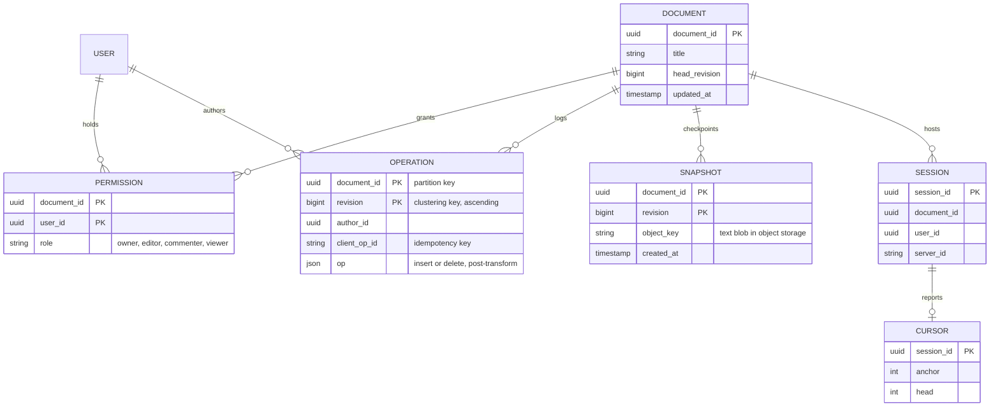
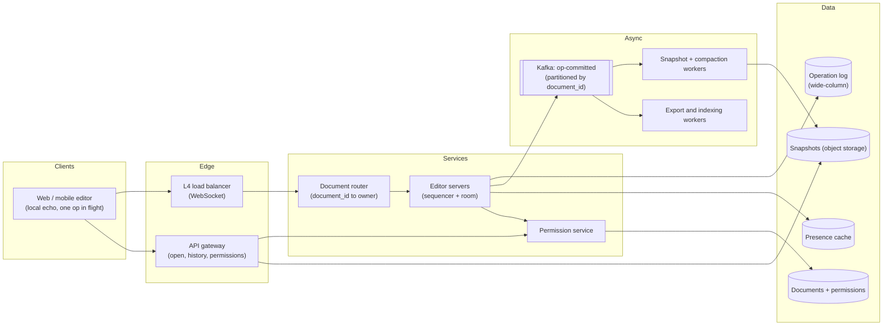
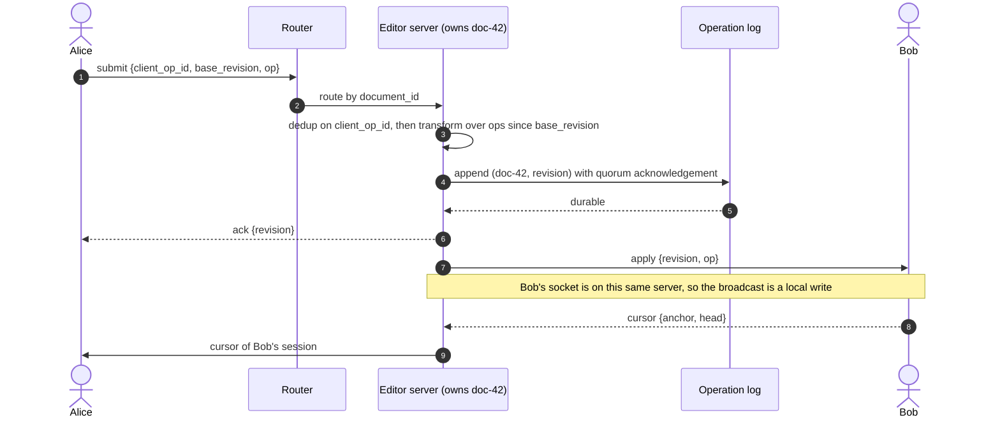
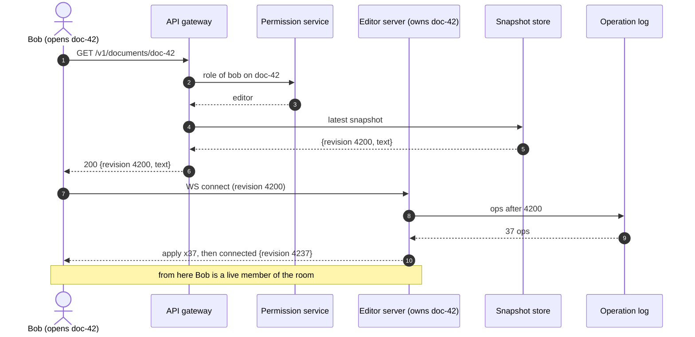
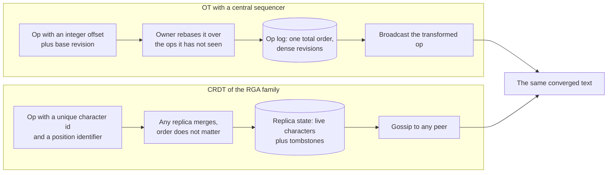
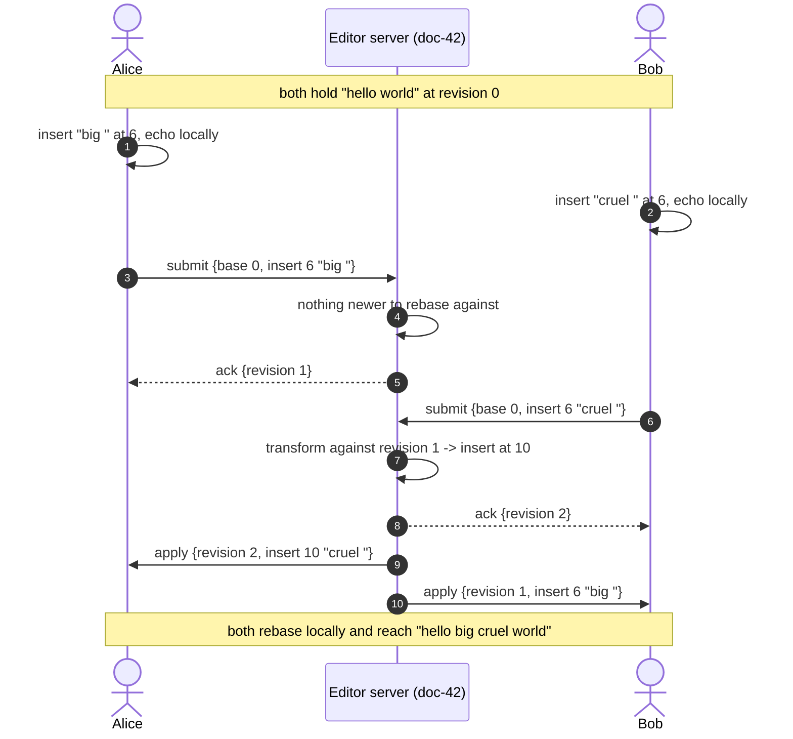
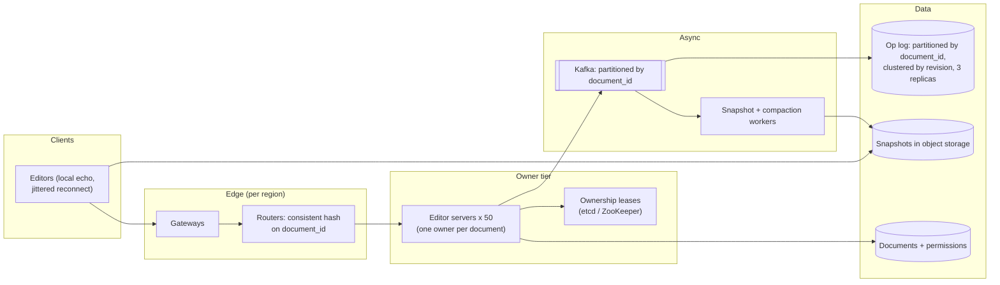

# Design Google Docs

## TL;DR

- Collaborative editing is a **convergence problem**: replicas apply the same operations in different orders and must still end up with the same characters. Everything else — transport, storage, presence — is ordinary.
- The cruxes: (1) **OT with a central sequencer versus a CRDT**, (2) the **four transform cases** and the tie-break, (3) the **op log plus snapshots**, (4) **offline edits and reconnect**, (5) **per-document routing**, which is what makes the sequencer possible.
- The design handles ~350k concurrent editors and ~350k ops/s with sticky routing, a partitioned op log, and a snapshot every few hundred ops.

## Problem statement and clarifying questions

"Several people type into the same document at once and everyone sees the same text within a fraction of a second." Everything hinges on one clarification: is the editable unit plain text with offsets, or a rich tree? Offsets are transformable in a page of code; a tree is a research project.

| Question | Assumption taken |
|---|---|
| What is being edited? | A linear character sequence. Rich text is attribute ranges over the same offsets, which transform the same way. |
| How many people edit one document at once? | Typically 1–3, capped at 50 editors; viewers are unlimited. |
| Scale? | 50M DAU, ~10 minutes of editing each per day, so ~350k concurrent editing sessions. |
| Latency target? | Local echo is instant; a collaborator sees the keystroke in < 200 ms p99 in-region. |
| Must an edit ever be lost? | No. Once the client shows it as saved, it survives a server crash. |
| Offline editing? | Yes, bounded: edit disconnected, reconnect, rebase. Days of divergence is a different product. |
| Version history and undo? | Yes: named versions and per-user undo, which is an inverse op re-transformed like any other. |
| Permissions, cursors, presence? | Four roles checked on connect and on revocation; cursors and the participant list are ephemeral. |

## Requirements

### Functional

- Open a document and receive its text plus the matching revision.
- Apply local edits at once, without a round trip.
- Broadcast every accepted edit to the other sessions on that document, in order.
- Converge: every replica shows the same characters once the ops stop.
- Edit offline and reconnect, rebasing local work onto whatever happened meanwhile.
- Show collaborators' cursors; enforce read and write permissions.

### Non-functional

- Scale: ~350k concurrent editors, ~350k ops/s average and ~1M/s peak, 50 editors per document.
- Latency: local echo 0 ms; remote apply < 200 ms p99 in-region; open < 500 ms p99.
- Consistency: **strong per document**. One sequencer decides the order, so every document has one authoritative revision at every moment.
- Durability: an acknowledged op is in the replicated log. Losing it is losing user text.
- Availability: 99.95%. A document whose owning server is being replaced is briefly read-only rather than divergent.

### Out of scope

Rich-text schema design beyond attribute ranges, comments and suggestions, spreadsheet recalculation, embedded images (that is [Drive's job](cloud-file-storage.md)), search, and folder-level sync.

## Estimation

Using the [latency and estimation tables](../../cheatsheets/latency-and-estimation.md) (a day is ~10^5 s, peak is 3x average, ~100 B per small message):

| Quantity | Arithmetic | Result |
|---|---|---|
| Concurrent editing sessions | 50M DAU x 10 min / 1,440 min per day | ~350k sockets |
| Write QPS (ops) | keystrokes batched per 200 ms at a ~20% duty cycle: ~1 op/s per session | ~350k ops/s, ~1M/s peak |
| Broadcast socket writes | ~2 collaborators per active document | ~700k/s |
| Document opens (read QPS) | 50M x 3/day = 150M / 10^5 | ~1.5k/s, ~4.5k/s peak |
| Op log growth | 350k/s x 86,400 x 100 B | ~3 TB/day, ~1.1 PB/year (x3 replicas: ~3.3 PB) |
| Document text storage | 100M documents x ~50 KB | ~5 TB — trivial beside the log; hence snapshots |
| Bandwidth | 350k x 100 B in, 700k x 100 B out, opens 1.5k x 50 KB | ~35 MB/s in, ~70 MB/s out, ~75 MB/s snapshots |
| Hot cache | ~175k active documents x (50 KB snapshot + tail) | ~10 GB in the editor tier |
| Editor servers | 350k / 100k sockets = 4, sized for blast radius | ~50, each owning a slice of documents |

Two things to say out loud. The op log grows **a thousand times faster than the documents themselves**, so snapshots and compaction are the storage design, not an optimisation. And the per-document rate is tiny — 50 editors at 5 ops/s is 250 ops/s — which is why a *single sequencer per document* is affordable and a global one would not be.

## API design

One WebSocket per open document; REST covers opening, permissions and history.

| Endpoint or frame | Request | Response | Notes |
|---|---|---|---|
| `GET /v1/documents/{id}` | — | `200 {revision, text, permissions}` | The snapshot the client starts from; everything after `revision` arrives over the socket. |
| `WS /v1/documents/{id}/connect` | token, `revision` held | `connected {session_id, revision, participants}` | Routed by `document_id` to the owning server, which replays the ops the client is missing first. |
| frame `submit` | `{client_op_id, base_revision, op}` | `ack {client_op_id, revision}` | `client_op_id` is the idempotency key: a resend returns the same revision, never a second insert. |
| frame `apply` (server to client) | — | `{revision, author_session, op}` | One per accepted op, in revision order. A gap means "resync", like the `seq` gaps in the [chat system](chat-messenger.md). |
| frame `cursor` | `{anchor, head}` | broadcast to the room | Ephemeral, coalesced to one per 100 ms, never logged. |
| `GET /v1/documents/{id}/history?from=&to=` | — | `200 {versions[]}` | Named versions and their snapshot revisions; diffs are replayed from the log. |

Two invariants: `base_revision` is mandatory on every submit, because it is what the server rebases against; and the server never trusts a client offset against its own text — it transforms first.

## Data model

**The document is the log; the text is a cache of it, materialised as snapshots.**



- **Operations**: a wide-column store partitioned by `document_id`, clustered by `revision` ascending, so every query the product needs — "everything after revision N", "the range between two versions" — is one partition scan. Bucket long-lived documents by `revision // 100_000`.
- **Snapshots**: the text blob in object storage, the pointer row beside the log, written every few hundred ops by a log consumer.
- **Documents and permissions**: a relational store; permissions are read on connect and cached in the session, and a revocation event kills it.
- **Sessions and cursors**: memory on the owning server, mirrored into a short-TTL cache so the participant list survives a reconnect.

## High-level design

**v1: editor servers that each own a set of documents outright, an op log behind them, and snapshot workers off to the side.**



**Write path: rebase, append, acknowledge, broadcast — all inside the one server that owns the document.**



**Read path: a client opens a document and catches up from a snapshot plus the log tail.**



Walk-through: because every session on a document lands on the same server, the sequencer, the room and the broadcast are one process — no distributed lock, no cross-server pub/sub on the hot path. The ack is one durable append, and the open is a snapshot read plus a short tail, which is why snapshot cadence and open latency are one decision.

## Deep dive: OT with a central sequencer versus a CRDT

The question the whole round turns on, and "a CRDT, because they are conflict-free" is not an answer. Both converge; they differ in what they cost.

| | OT with a central sequencer | CRDT (RGA / Logoot family) |
|---|---|---|
| Op payload | Integer offset plus text: ~100 B | A position identifier per character, growing as the document is edited |
| Converges via | A server that orders ops and transforms | Commutative merge on any replica |
| Needs a server? | Yes, one per document | No — peer to peer works |
| Deleted text | Dropped at compaction | **Tombstones stay forever** without garbage collection |
| Undo and history | Inverse op, re-transformed; dense revisions | Harder: history is a partial order, "revision 4237" means nothing |
| Failure mode | Owner failover: briefly read-only | Silent memory growth, interleaving anomalies |
| Correctness risk | The transform table must be right | Identifier allocation must be right, and is harder to test |

**Pick OT with a central sequencer**, justified from this product's constraints rather than from taste. You already need a server: permissions must be enforced, edits must be durable, and version history must be a linear thing a user can name and restore. Once a server is in the path the central-order assumption is free, and it buys dense integer revisions — cursors, gap detection, "restore to version 4237", a log you can compact. A CRDT's advantage is the thing you do not have: no trusted coordinator. That is why CRDTs win in local-first editors and lose in a hosted product.

**Both converge; the difference is what they carry and who has to be online.**



## Deep dive: the transform functions and the rebase loop

The transform is four cases. An interviewer will ask you to write two on the board, and the tie-break is where most candidates fall over.

An insert shifts a later insert right and leaves an earlier one alone; when both insert at the *same* offset one must be declared first, consistently, by both sides, or Alice sees `bigcruel` and Bob sees `cruelbig`. The rule here is "the op already in the log wins", mirrored by the client when it rebases an incoming op against its own in-flight op. An insert inside a deleted range, and a delete overlapping another delete, can transform an op **away entirely** — which is why the function returns `None`:

```python title="code/hld/ot_transform.py — the four transform cases"
--8<-- "code/hld/ot_transform.py:transform"
```

The server side is a loop over the ops the client had not seen, short because the hard part is above:

```python title="code/hld/ot_transform.py — the central sequencer"
--8<-- "code/hld/ot_transform.py:server"
```

What the module prints for the concurrent-insert case and an overlapping delete:

```text
revision 0: "hello world"
alice types at offset 6 -> "hello big world"
bob types at offset 6   -> "hello cruel world"
server rebased bob's op to Insert(pos=10, text='cruel ')
server: "hello big cruel world"
alice:  "hello big cruel world"
bob:    "hello big cruel world"
converged: True at revision 2
after the overlapping delete: server "hello world", dave "hello world"
dave's 'very ' was swallowed by the delete: one op in, zero ops out
log: [(3, 'carol', Delete(pos=6, length=10)), (4, 'dave', None)]
```

**Two people type at the same offset; the server rebases the second one.**



Say the honest part out loud: this transform lets a delete swallow text typed inside the deleted range. Preserving it means splitting the delete into two ops, which turns every transform into a *list* and forces a sequence-transform in the server loop. Naming that trade-off deliberately reads far better than pretending the edge case is not there.

## Deep dive: the operation log, snapshots and storage

The log grows ~3 TB/day while the documents total ~5 TB. Left alone it is the whole system's cost, so the storage design is really a compaction design.

**Snapshots.** A worker consuming the log writes a text blob to object storage every few hundred ops, with a pointer row at that revision. Opening a document becomes "newest snapshot, then replay what follows" — bounded work whatever the document's age. Cadence trades open latency against snapshot volume; a few hundred ops keeps replay under 10 ms.

**Compaction.** Once a snapshot at revision N is durable, ops below N serve version history, not correctness. Keep a coarse ladder — every op for a day, one snapshot per hour for a month, one per day forever — and delete the rest, which converts ~1.1 PB/year into something proportional to the history the product promises.

**Idempotency.** The `client_op_id` maps to the revision it produced, so a resend after a lost ack returns that revision rather than a duplicated character — the same mechanism as `client_msg_id` in the [chat system](chat-messenger.md), and it matters more here because a duplicated insert is visible corruption.

**Why revisions, not timestamps.** Dense integers from one owner mean a client holding 4,236 that receives 4,238 knows it missed one, and "restore to revision 4237" is well defined. Wall clocks give neither, for the reasons [time and ordering](../fundamentals/time-and-ordering.md) sets out.

## Deep dive: offline edits, reconnect, presence and routing

**Reconnect.** The client stores its last revision and its unacknowledged ops, then sends the revision, receives every op after it, and rebases its pending work over them — the same `transform` the server calls, mirrored. The transform table is the *only* reconciliation logic in the system.

**Offline.** The same mechanism with a longer queue. The honest limit: a queue rebased over thousands of remote ops drifts semantically and costs O(local x remote) transforms. An hour rebases cleanly; a week is a conflicted copy, the answer [Drive](cloud-file-storage.md) gives. A **version vector** per client — last revision seen plus the ops it authored — tells the server whether a returning client can be rebased or must be forked.

**Presence and cursors.** A cursor is a pair of offsets, so every accepted op transforms every other participant's cursor — two lines using the same function, and forgetting it is why cursors drift.

**Routing.** Every session on a document must reach one server, so the router hashes `document_id` onto an owner and leases it in a coordination service. That is the price of the central sequencer; what it buys is a broadcast that is a local write rather than a pub/sub hop. A permission revocation publishes an event the owner turns into a session kill.

!!! warning "Common mistake"
    Sending offsets without the base revision they were computed against. An offset is meaningless on its own: by the time it reaches the server the document has moved. Every submit carries `base_revision`, and the server transforms before it applies — never the other way round.

## Scaling, bottlenecks and failure modes

**v2: documents hashed onto owner servers with leases, a partitioned log as the durability hop, snapshot workers, and regional homes.**



What changes from v1: the router becomes a consistent-hash ring with explicit ownership leases, so exactly one server sequences a document even during a rebalance; and the ack comes from a Kafka partition keyed by `document_id` with all replicas acknowledging, giving ordering and durability in one hop while the wide-column store becomes a consumer.

What breaks first:

- **Owner failover.** The lease expires, a new owner replays the log tail to rebuild the counter, clients retry, editing pauses for seconds. Never let two servers hold one document: a fencing token on every append makes a stale owner's writes rejected rather than interleaved.
- **A very popular document.** 50 editors at 5 ops/s is 250 ops/s on one owner. Thousands of *viewers* is the real risk: demote them to read replicas fed by the broadcast.
- **Log growth.** Compaction lag costs money silently: alert on snapshot lag and bytes per document, not total volume.
- **Hot partitions.** Bucketing by `revision // 100_000` means a document edited for five years is many partitions rather than one enormous row.
- **Cross-region editing.** Pin a document's owner to a home region; collaborators elsewhere pay a ~70 ms round trip per op, which local echo hides. Migrating a home is explicit.
- **Degradation order.** Drop cursors, then the participant list, then coalesce ops into longer batches. Never drop an acknowledged op.

## Trade-offs summary

| Decision | Chosen | Alternatives | Why |
|---|---|---|---|
| Convergence | OT with a central sequencer | CRDT (RGA), locking, last-write-wins | The server is mandatory anyway; dense revisions give history, cursors and compaction |
| Op granularity | Offset plus text, batched per 200 ms | Per keystroke, character ids | ~100 B per op and a transform table small enough to test exhaustively |
| Ordering | Dense per-document revision | Timestamps, Lamport clocks | Gap detection, cursors and "restore to revision N" need dense integers |
| Overlap rule | Delete wins over an insert inside it | Split the delete into two ops | One op in, one op out; the alternative makes every transform return a list |
| Routing | One leased owner per document | Any server plus a distributed lock | Sequencer, room and broadcast collapse into one local process |
| Storage | Op log plus snapshots | Text on every edit; log only | Text-per-edit is 50 KB per keystroke; log-only makes opening unbounded |
| Ack point | After the replicated log append | After broadcast, or optimistically | "Saved" must mean durable |
| Offline | Bounded queue, rebase, then fork | Unbounded merge | Rebasing over thousands of ops drifts and costs O(local x remote) |

## Interviewer follow-ups

??? question "Walk me through insert versus insert at the same offset."
    Both clients apply locally, so Alice sees `big ` and Bob sees `cruel ` at offset 6. The server appends whichever arrives first at revision 1 and rebases the second — same offset, so the tie-break shifts it to offset 10. Each client then transforms the incoming op against its own in-flight op with the mirrored tie-break, and both land on `hello big cruel world`.

??? question "Why not just lock the document, or lock a paragraph?"
    Locking makes the common case worse to fix the rare one. Two people rarely edit the same word, but a paragraph lock stops them editing the same paragraph — and a lock needs a lease, a timeout and a recovery story for whoever closed their laptop.

??? question "When would you actually choose a CRDT?"
    When there is no trusted coordinator: peer-to-peer or local-first editors, long offline sessions, an editor that must work without your servers. Say the cost too — tombstones needing garbage collection, identifiers that grow, and a history that is a partial order rather than a numbered sequence.

??? question "How does undo work with other people editing?"
    Undo is the inverse of your op, transformed over everything accepted since, so it deletes exactly the characters you typed wherever they drifted to. The stack is per session: undo must never revert somebody else's work.

??? question "A client sends the same op twice after a timeout."
    The `client_op_id` maps to the revision it produced, so the second submit returns the same ack and appends nothing. Without it a retry inserts the characters twice — visible corruption, which is why idempotency matters more here than in messaging.

??? question "What happens when the owning server dies mid-edit?"
    Its lease expires, the router assigns a new owner, and that owner replays the log tail to rebuild the revision counter. Clients retry with their last revision and pending ops. Editing pauses for a second or two; nothing acknowledged is lost, because the ack came from the replicated log, not from server memory.

??? question "How would you add rich text?"
    Model formatting as attribute ranges over the same offsets, with a third op type that sets attributes on a range. It transforms against inserts and deletes as a delete does — ranges shift and clip — and two concurrent attribute ops on one range need a deterministic tie-break, usually last-writer-wins per attribute.

!!! tip "Interview tip"
    Do not spend your minutes describing OT and CRDT in the abstract. Choose in one sentence — "the server is mandatory for permissions, durability and version history, so central sequencing is free and gives me dense revisions" — and spend the time you save writing the four transform cases and the tie-break. That is what actually separates candidates here.

## 45-minute pacing

| Minutes | What to say and draw |
|---|---|
| 0–5 | Clarify: linear text, 1–3 editors typical, bounded offline, history and cursors in scope. Name convergence as the core problem. |
| 5–9 | Estimation: ~350k concurrent editors, ~350k ops/s, ~3 TB/day of log against ~5 TB of documents. Point at that ratio. |
| 9–13 | API: `base_revision` on every submit, `apply` frames in revision order. Data model: the log is the document. |
| 13–20 | v1 diagram; narrate the write path (rebase, append, ack, local broadcast) and the open path. |
| 20–26 | OT versus CRDT: choose, and justify from the product's constraints rather than from theory. |
| 26–36 | The four transform cases on the board, the tie-break, and the concurrent-insert walk-through. |
| 36–42 | Op log, snapshots, compaction; offline reconnect; per-document ownership and failover. |
| 42–45 | Bottlenecks and trade-offs. |

## Related

- [Time, clocks and ordering](../fundamentals/time-and-ordering.md) — why a dense revision counter beats any clock, and where version vectors fit
- [Design a chat system](chat-messenger.md) — the same rooms, sequencing and idempotency, without the transform
- [Design a text editor with undo and redo](../../lld/problems/text-editor.md) — the single-user command model this extends
- [Design Dropbox or Google Drive](cloud-file-storage.md) — file-granular sync and conflicted copies, the coarse-grained sibling
- [Messaging, queues and Kafka internals](../fundamentals/messaging-and-event-streaming.md) — the partitioned log behind the append
- Primary sources: Ellis and Gibbs, "Concurrency Control in Groupware Systems" (1989); Nichols et al., "High-Latency, Low-Bandwidth Windowing in the Jupiter Collaboration System" (1995); Shapiro et al., "A Comprehensive Study of Convergent and Commutative Replicated Data Types" (2011)
