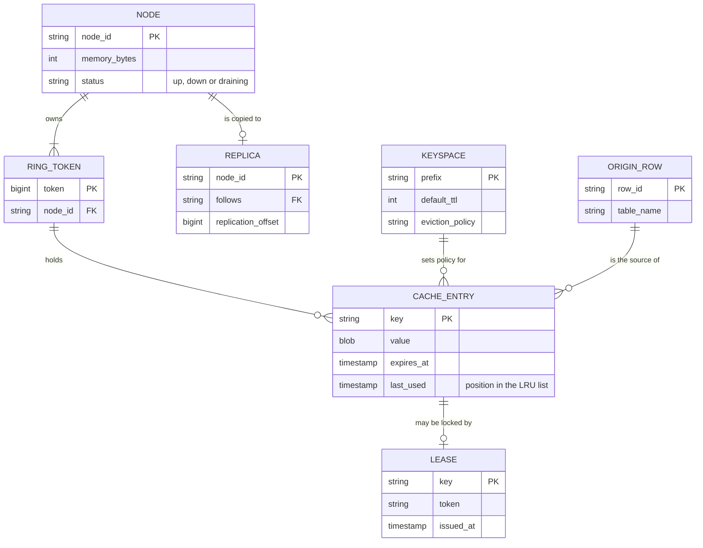
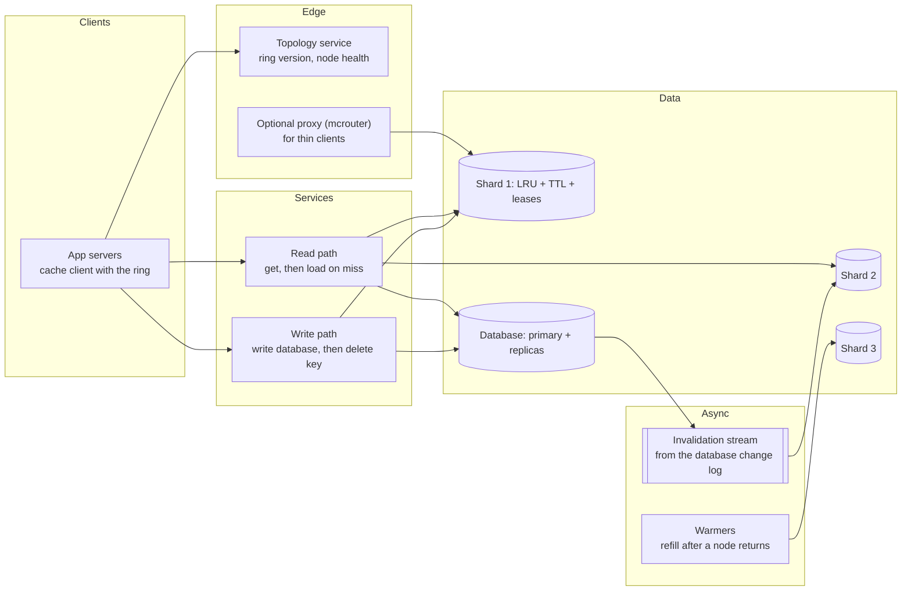
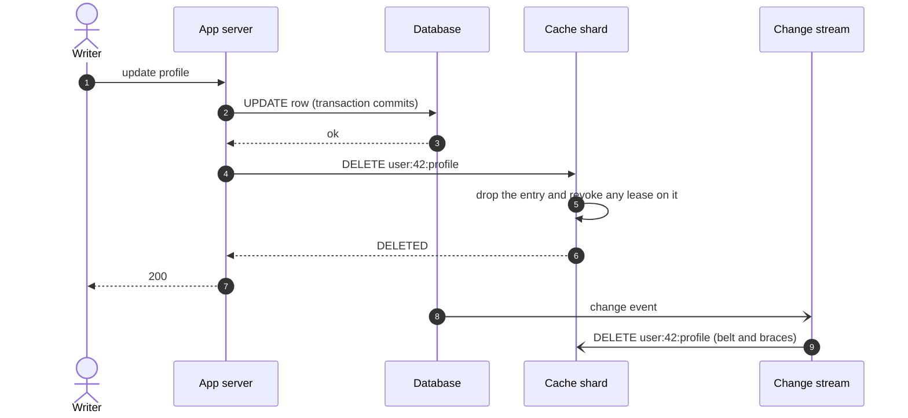
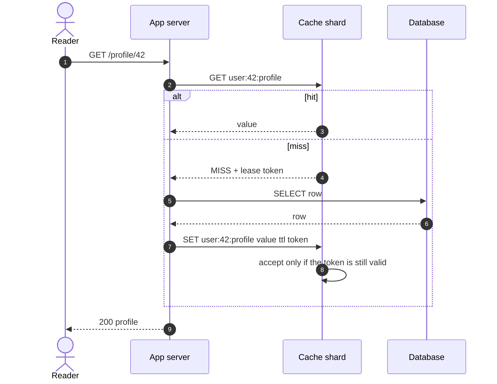
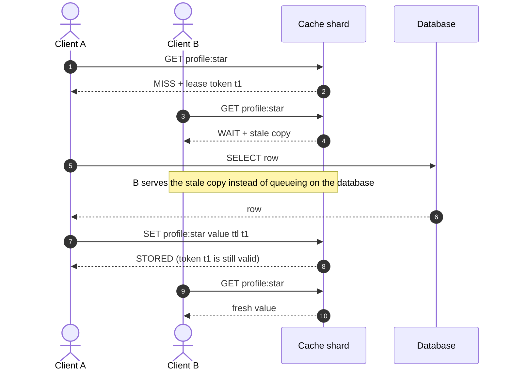
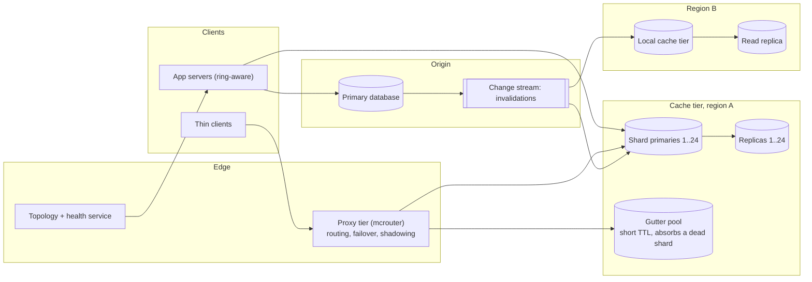

# Design a distributed cache

## TL;DR

- A distributed cache is a **partitioned hash table in RAM with no durability promise**: keys hash to one shard, entries expire or are evicted, misses go to the database. Its job is keeping the database inside its capacity, so the **hit ratio is a capacity number**.
- The cruxes an interviewer probes: (1) **sharding and routing**, (2) **eviction and expiry**, (3) **one thread per shard versus locks**, (4) **hot keys, stampedes and leases**, (5) **replication and the cache-database race**.
- The design serves 300k reads/s peak from ~1 TB of hot data on 24 nodes plus replicas, at a 90% hit ratio.

## Problem statement and clarifying questions

"Put a cache in front of a database that cannot take the read load." The questions decide two forks: whether the cache is a **look-aside** store the application manages or a **read-through** layer that owns loading, and whether a stale read is acceptable — if it is not, the cheap designs are gone.

| Question | Assumption taken |
|---|---|
| Look-aside or read-through? | Look-aside: the application reads the cache, then the database on a miss, then fills. |
| What is cached? | Serialized rows and small computed objects, ~1 KB, under keys like `user:42:profile`. |
| Scale? | 10B reads/day, 1B writes/day; a 5 TB working set whose hot 20% must be resident. |
| Staleness tolerance? | Seconds: a read may miss a write from milliseconds ago, but never return a value from before the last invalidation. |
| Durability and latency? | No durability, so a cold cache is a load event; p99 < 1 ms for a hit. |
| Eviction policy? | LRU with per-key TTL; the TTL is the safety net for invalidations that go missing. |
| Keyspaces and regions? | Several keyspaces on one tier; one cache per region, no cross-region replication. |

## Requirements

### Functional

- `get`, `set` with a TTL, `delete`, and a batched multi-get for the "hydrate 20 ids" pattern.
- Per-keyspace TTL and eviction policy; keys expire without anyone asking.
- Add and remove nodes without a full remap or an outage.
- Report hit ratio, evictions, expirations and per-key traffic.

### Non-functional

- Throughput: 300k gets/s peak, 30k sets and deletes/s peak, 1 KB values.
- Latency: p99 < 1 ms for a hit. A round trip is ~500 µs and a memory reference is 100 ns, so the network dominates and batching beats anything inside the node.
- Hit ratio: >= 90%, leaving the database 30k reads/s of the 50k+ indexed reads/s one primary sustains.
- Availability: 99.99%; losing a node costs hit ratio, never correctness.
- Consistency: eventual, bounded by the TTL, and never a value resurrected after an invalidation.

### Out of scope

Persistence and snapshots, transactions and scripting, cross-region coherence, in-process caches, and CDN caching of static assets.

## Estimation

Using the [latency and estimation tables](../../cheatsheets/latency-and-estimation.md) (a day is ~10^5 s, peak is 3x average):

| Quantity | Arithmetic | Result |
|---|---|---|
| Read QPS | 10B reads/day / 10^5 s | 100k/s average, 300k/s peak |
| Write QPS (each invalidates a key) | 1B writes/day / 10^5 s | 10k/s average, 30k/s peak |
| Cache size (80/20 rule) | 20% of a 5 TB working set of 1 KB objects | ~1 TB resident |
| Nodes by memory | 1 TB / 64 GB per node = 16, x1.5 headroom | 24 primaries plus a replica each = 48 instances |
| Nodes by throughput | 300k/s peak / ~100k ops/s per Redis node | 3 would do: **memory sizes this tier, not QPS** |
| Bandwidth | 300k/s x 1 KB | 300 MB/s, ~12 MB/s per node against a 1.25 GB/s NIC |
| Database load at 90% then 80% hit ratio | 300k/s x 10%, x 20% | 30k reads/s, inside one primary's 50k+ indexed reads/s; 60k/s is not |
| Data behind the cache per year | 1B new objects/day x 1 KB x 365 | ~365 TB/year in the database; the cache holds the hot 1 TB |

Say this out loud: the tier is sized by **memory**, not request rate — three nodes could serve the QPS but not hold the working set — and losing ten points of hit ratio doubles the database's read load.

## API design

The wire protocol is binary; these are the calls the client library makes.

| Operation | Request | Response | Notes |
|---|---|---|---|
| `GET key` | key | `{value, flags}` or `MISS` with a lease token | On a miss the first caller gets a token and owns the refill; later callers retry (deep dive 4). |
| `MGET keys[]` | up to 100 keys | `{key: value}` for the hits | Grouped by shard, so hydrating 20 ids is one round trip per node. |
| `SET key value ttl [token]` | value, TTL, optional token | `STORED` or `REJECTED` | Last writer wins, except that a fill with a revoked token is rejected instead of resurrecting a stale value. |
| `DELETE key` | key | `DELETED` | The invalidation primitive, preferred over an update because a delete cannot be stale. |

There is no pagination: a cache has no scans, and `KEYS *` in production takes the tier down.

## Data model

**The cache's own bookkeeping: a ring of tokens over nodes, entries inside them, and the lease that guards a refill.**



Store choices, one sentence each:

- **Partition key** is `hash(key)`: no sort key and no secondary index, because the only operation is a point lookup.
- **Inside a node** an entry is a hash-table slot plus a node in an LRU list, so `get` and `put` are O(1) — the structure on the [in-memory cache page](../../lld/problems/in-memory-cache.md).
- **Expiry deadlines** live in a second dictionary that a sampling sweep walks, because the LRU list is ordered by recency, not by deadline (deep dive 2).
- **Leases** are a small table of token plus issue time, neither replicated nor durable; **topology** is a tiny record in a configuration service that every client caches.

## High-level design

**v1: application servers route with a cached ring, cache nodes hold shards, and writes invalidate rather than update.**



**Write path: change the database first, then delete the key; never write the value into the cache from the write path.**



**Read path: hit, or a lease that makes exactly one client visit the database.**



Walk-through: the cache is never on the write path's critical route — the database commits first and the cache is told to forget, so a failed delete degrades to "stale until the TTL", not "wrong forever". A read is a hash, a hop and a dictionary lookup, so a hit costs the ~500 µs round trip and little else.

## Deep dive: sharding and routing

The probing question is "who decides which node holds `user:42:profile`, and what happens when you add a node?"

| Scheme | Lookup cost | Keys moved when a node joins | Operational cost |
|---|---|---|---|
| `hash(key) mod N` | O(1) | ~N/(N+1): almost the whole cache | One capacity change empties the tier |
| Consistent-hash ring, virtual nodes | O(log V) in the client | ~1/N, spread over every node | Clients must agree on the ring |
| Fixed hash slots mapped to nodes | O(1) | Only the moved slots | A slot map to distribute and keep current |

Take the ring with virtual nodes (Ketama) for a look-aside cache, or fixed slots when the server can redirect, as Redis Cluster does with `MOVED`. Both give the property that matters: adding a 25th node to 24 moves ~1/25 of the keys, a dip in hit ratio rather than a cold start. Say the number, because modulo moves ~96% of the keys and turns a routine capacity change into an outage of the database behind it.

Where the ring lives is the second half of the answer:

- **Client-side routing** (Ketama clients, this design): one hop and no extra tier, but every application must run a client that agrees on the hash and the node list.
- **Proxy routing** (mcrouter, Twemproxy): thin clients and one place to change topology, for a second hop (~500 µs) and a tier to run.
- **Server-side redirects** (Redis Cluster): clients cache the slot map and follow `MOVED`, so the cluster owns the truth and clients self-correct.

The module routes in the client with the `HashRing` from the [partitioning page](../fundamentals/partitioning-and-consistent-hashing.md), walking the preference list on failure:

```python title="code/hld/cache_cluster.py — the router"
--8<-- "code/hld/cache_cluster.py:cluster"
```

## Deep dive: eviction, TTL and reclaiming memory

The probing question is "your nodes are at 100% memory — what gets thrown out?"

| Policy | Keeps | Cost | Use when |
|---|---|---|---|
| LRU (approximate, sampled) | Recently used keys | A few pointers per entry | The default: recency predicts reuse |
| LFU | Frequently used keys | A counter per entry, with decay | Long-lived popularity, scan-heavy workloads |
| Random, or no eviction | Nothing in particular | Free, or out-of-memory errors | Uniform access, or an exactly sized keyspace |

Choose sampled LRU with a per-key TTL, and separate two ideas candidates conflate. **Eviction** is memory pressure: the store is full, something must go. **Expiry** is correctness: a value may only be believed for N seconds. A key can be evicted long before it expires, and can expire while still holding memory.

That last case is why expiry runs two ways. **Lazy expiry** checks the deadline on read: correct and free, but a key nobody reads again is never noticed and its memory never returned. **Active expiry** samples the expiry dictionary (Redis takes 20 keys, drops the expired ones, and repeats while over a quarter of the sample was expired), reclaiming with bounded work instead of scanning millions of keys. The demo shows the gap:

```text
600 puts into a 500-entry node: 500 entries held, 100 evicted
+60 s, TTL 30 s               : 500 entries still held, 0 live (lazy expiry frees nothing until a read)
active expiry, 100 samples    : 83 entries reclaimed, 417 held
```

Set TTLs even when you invalidate explicitly: the TTL bounds the damage of a dropped invalidation, which is why a cache bug is a five-minute problem rather than a permanent one.

## Deep dive: one thread per shard, or locks

The probing question is "how many cores does a cache node use, and why is Redis fast if it is single-threaded?"

| Model | Concurrency | Strengths | Weakness |
|---|---|---|---|
| Single-threaded event loop (Redis) | One command at a time | No locks, no races, atomic multi-key commands, predictable latency | One slow command blocks everything; one core per instance |
| Lock per shard, many threads (Memcached) | Many commands in parallel | Uses every core in one process | Contention on hot shards; no cross-shard atomicity |

Both answers are defensible for the same reason: a cache operation is a hash lookup and a memory copy, ~100 ns of work, so syscalls and the network dominate. One thread with epoll and pipelining reaches ~100k ops/s per instance; a locked multi-threaded design reaches ~200k+.

Volunteer the consequences: a single-threaded instance uses one core, so you run several per machine and let the ring treat them as separate nodes; every command must be short, because one slow command stalls every other client on that instance; and atomicity is free within an instance, which is why check-and-set exists there and not across shards.

## Deep dive: hot keys, stampedes and leases

The probing question is "a celebrity's profile expires at peak — describe the next 200 ms." Unprotected, every miss reaches the database at once: 300k reads/s on one row is a thundering herd, and the recompute slows under load, so the herd grows.

| Protection | Mechanism | Cost |
|---|---|---|
| Lease per key | The first miss gets a token, others wait or take a stale copy | One table entry per in-flight miss |
| Single-flight in the process | One thread per key per process loads | Deduplicates in one process, not across 500 |
| Replicate the hot key | N suffixed keys across shards, read a random one | N times the invalidation work |

Leases are the distributed answer, because the herd spans hundreds of application servers and no in-process lock sees them all. They also fix a sneakier bug, the **stale set**: A misses, reads the database and stalls; a writer updates the row and deletes the key; A writes back what it read before the update, and no TTL will correct it, because A just refreshed the key. Revoking leases on delete makes A's fill fail.

**A hot key expires: one client refills while the rest are served the stale copy.**



The node implements the token, the wait, the stale copy and the rejected fill:

```python title="code/hld/cache_cluster.py — leases and per-node storage"
--8<-- "code/hld/cache_cluster.py:lease"
```

With 32 threads on one cold key the database is touched once, and a fill whose lease was revoked is refused:

```text
32 clients on one cold key    : 1 database load, all 32 got 'row:hot:1'
invalidate then a late fill   : accepted=False, rejected sets 1
invalidate, keep a stale copy : lease, serve '101' while one client refills
```

!!! tip "Interview tip"
    Separate the two hot-key problems out loud: *load* (many misses on one key) is solved by leases, while *capacity* (one shard taking 50k QPS for one key) is solved by replicating the key across shards or by a tiny local cache in each application server. The interviewer asks one question to see whether you know it is two.

## Deep dive: replication, failover and the cache-database race

The probing question is "a cache node dies at peak; what breaks?" Its share of the hit ratio disappears: with 24 nodes, losing one sends ~4% of 300k reads/s — 12k/s — to the database on top of the existing 30k. Survivable; losing a third of the tier is not, which is the argument for replicas.

| Topology | On node loss | Cost | Use when |
|---|---|---|---|
| No replicas, rehash to the next node | A cold shard and a burst of misses | Cheapest | The database absorbs one shard's misses |
| Replica per primary, failover | A warm replica promoted in seconds | 2x the memory | Losing a shard would overload the database |
| Rehash into a gutter pool | Misses land in a small spare pool, short TTL | A few spare nodes | Transient failures (Facebook's answer) |

A cache replica is not a database replica: it protects the *hit ratio* through a failure, not the data. Failover is a health check plus a promotion (Redis Sentinel, or the cluster's own voting), and split brain is cheap — two nodes claiming a slot serve duplicate copies, and the worst case is a stale read.

The race that causes incidents is between a reader filling the cache and a writer changing the database: R misses and reads `v1`, W commits `v2` and deletes the key, then R writes `v1` into the empty cache. Three rules fix it — **delete after the commit**, **delete rather than update**, and **revoke leases on delete**, so R's late fill is rejected. Belt and braces is a second invalidation from the change stream, catching the delete dropped when a server died mid-request.

!!! warning "Common mistake"
    Writing to the cache from the write path ("update the row, then update the cache"). Two concurrent writers can apply their database updates in one order and their cache updates in the other, so the cache disagrees with the database until the TTL expires, with no error anywhere. Delete instead: the next reader refills from committed state.

## Scaling, bottlenecks and failure modes

**v2: sharded primaries with replicas, a proxy tier for thin clients, per-region caches and a warm-up path.**



What breaks first, and what you do about it:

- **A hot key.** Consistent hashing spreads keys, never popularity: one key at 50k QPS lands on one node whatever the cluster size. Replicate it under suffixed keys (`profile:star#0..7`), or give every application server a one-second local cache, which turns 500 servers into 500 requests per second.
- **A cold start.** A restarted or newly added node misses on everything it owns. Warm it before it takes traffic, or promote a warm replica, and add nodes one at a time.
- **TTL cliffs and eviction storms.** A batch job writing a million keys with one TTL creates a synchronised expiry, so jitter TTLs. Slab allocators also waste memory when value sizes drift, so a node at "80% memory" can evict live keys: watch evictions per second and keep 25% headroom.
- **Failure of the whole tier.** The database sees 300k reads/s and falls over, and retries make it worse. Protect the origin with a per-key limiter, a circuit breaker and load shedding.
- **Cross-region.** Do not replicate the cache between regions: each caches what its own users read from a local database replica, and invalidations travel through the change stream. A cross-region round trip is ~70 ms, 140x a local hit.

## Trade-offs summary

| Decision | Chosen | Alternatives | Why |
|---|---|---|---|
| Caching strategy | Cache-aside | Read-through, write-through, write-back | The application shapes what it caches, and a cache failure is a slower read |
| Invalidation | Delete after commit | Update the cache from the write path | A delete cannot be stale; concurrent updates can reorder |
| Routing | Consistent-hash ring in the client | Modulo, proxy, directory | ~1/N keys move on a topology change, with no extra hop |
| Stampede control | Leases with stale serving | Single-flight per process | The herd spans hundreds of processes; only the server sees it |
| Replication | Replica per primary with failover | No replicas | Losing a shard at peak would push the database past its read budget |
| Consistency | Eventual, TTL-bounded | Strong, with write-through locks | Strong consistency costs the latency that made you add a cache |

## Interviewer follow-ups

??? question "Cache-aside or read-through, and when does write-back make sense?"
    Cache-aside keeps the loading logic in the application, so a cache outage is a slow request rather than an error; read-through hides the loader and is tidier when one team owns both. Write-back acknowledges in the cache and flushes later, losing acknowledged writes when a node dies — fine for counters, never for money.

??? question "How do you pick TTLs?"
    From tolerance for staleness, not from a feeling: ask how wrong a value may be if an invalidation is lost — minutes for a profile, seconds for inventory, no cache at all for authorization. Then jitter them, and keep them low enough that an invalidation bug self-heals.

??? question "How do you cache negative results?"
    Cache the "not found" with a short TTL, or every lookup for a nonexistent key reaches the database — the classic way a scraper melts an origin. A Bloom filter is cheaper when the key space is huge and mostly absent.

??? question "How would you measure whether the cache is worth it?"
    Hit ratio, database load with and without it, and p99 latency of a hit versus a miss. At a 90% hit ratio the database sees 30k reads/s and each point lost adds 3k. If a bigger tier cannot move the hit ratio, the workload is not cacheable.

??? question "What if a value is bigger than a few kilobytes?"
    Large values wreck latency for every other client on that node, because one command holds the thread or the lock for the whole copy. Keep big objects in object storage and cache a reference, and cap the value size rather than silently degrade.

??? question "How do you handle a multi-get that spans every shard?"
    The client groups keys by node and pipelines one request per node, so 100 keys are at most 24 parallel round trips. Tail latency is the slowest node, so set a per-node timeout and treat a late shard as a miss.

## 45-minute pacing

| Minutes | What to say and draw |
|---|---|
| 0-5 | Clarify: cache-aside, 1 KB objects, 10B reads/day, seconds of staleness allowed, no durability. |
| 5-9 | Estimation: 300k reads/s peak, 1 TB hot data, 24 nodes sized by memory, and the 90% versus 80% hit-ratio argument. |
| 9-13 | API (get, multi-get, set with TTL, delete) and the node internals: hash table, LRU list, expiry dictionary. |
| 13-22 | v1 diagram; narrate the read path (hit, miss, fill) and the write path (commit, then delete). |
| 22-38 | Deep dives in order: routing, eviction versus expiry, hot keys and leases, replication and the write race. |
| 38-45 | Bottlenecks (hot keys, cold starts, TTL cliffs, whole-tier failure), then the trade-offs table. |

## Related

- [Caching and CDNs](../fundamentals/caching-and-cdn.md) — strategies, invalidation races and the `LRUCache` this cluster is built on
- [Partitioning, sharding and consistent hashing](../fundamentals/partitioning-and-consistent-hashing.md) — the `HashRing` behind the router
- [Design an in-memory cache (LRU, LFU, TTL)](../../lld/problems/in-memory-cache.md) — the single-node structure as an OOD exercise
- [Replication](../fundamentals/replication.md) — leader-follower replication and failover, of which cache replicas are the cheap case
- [Design a Dynamo-style key-value store](key-value-store.md) — the same ring, with durability and quorums added
- Primary source: Nishtala et al., "Scaling Memcache at Facebook" (NSDI 2013), the origin of leases, stale serving and the gutter pool
