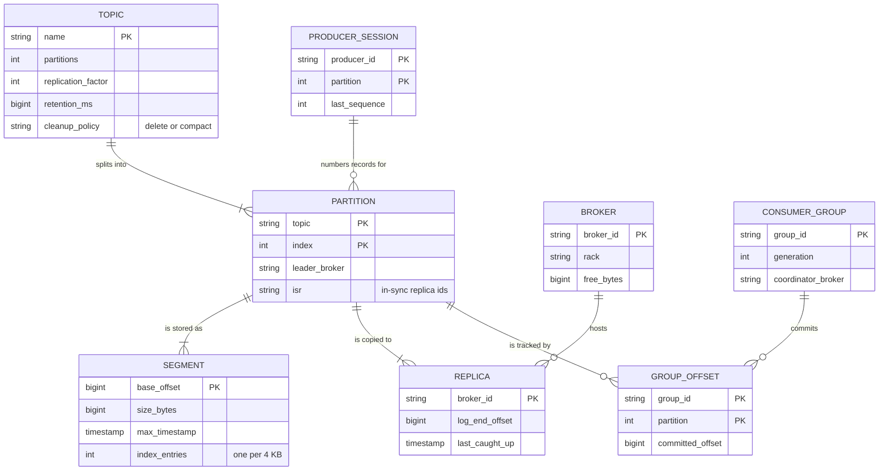
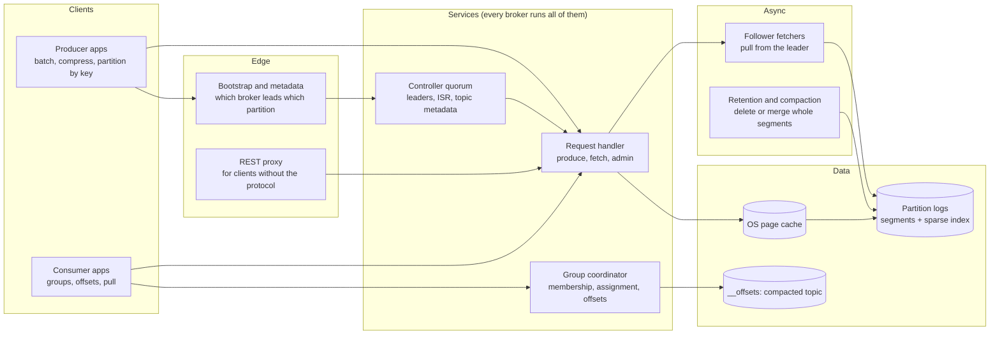
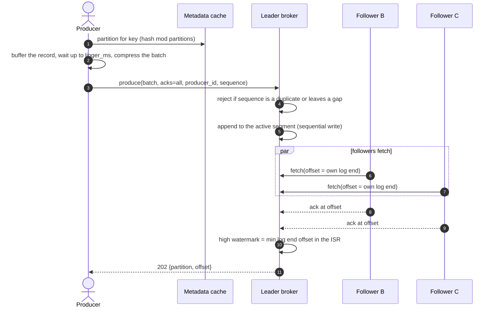
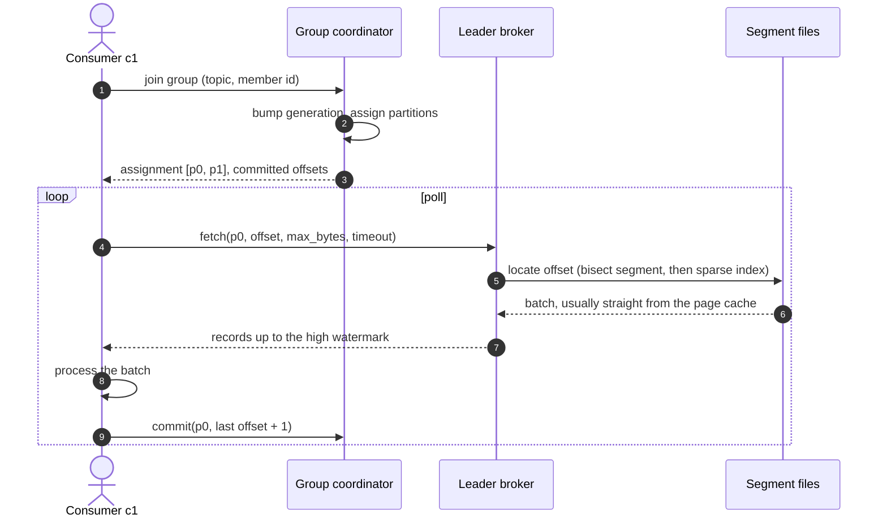
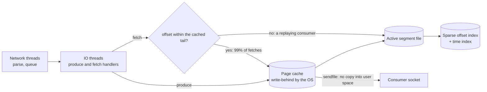
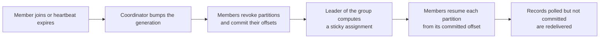
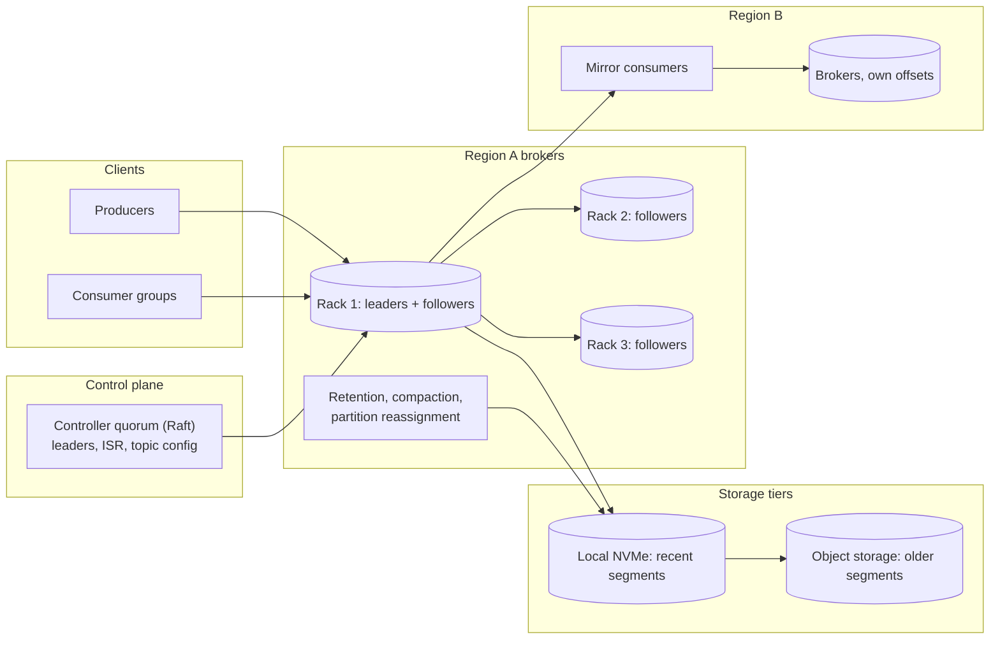

# Design a distributed message queue

## TL;DR

- A distributed message queue is a **replicated append-only log cut into partitions**: producers append, consumers track their own offset, nothing is deleted when read. Throughput comes from sequential writes and the OS page cache.
- The cruxes an interviewer probes: (1) the **segmented log** and why disks are fast once you stop seeking, (2) **partitions, keys and consumer groups**, (3) **ISR replication, acks and the high watermark**, (4) **delivery semantics**, (5) **retention and back-pressure**.
- The design carries 100k messages/s to three consumer groups on ~30 brokers, replication factor 3, a week of retention.

## Problem statement and clarifying questions

"Design the message bus every service publishes to and consumes from: order events, clickstream, change data capture." The answers below decide the biggest fork — a **queue** that deletes on acknowledgement (SQS, RabbitMQ) or a **log** that keeps records for a window and lets groups replay them.

| Question | Assumption taken |
|---|---|
| Queue or log semantics? | Log: records survive consumption, groups read independently, and a group can rewind. |
| Ordering guarantee? | Total order per partition, not per topic; records sharing a key share a partition. |
| Scale? | 10B messages/day at ~1 KB, three consumer groups per topic. |
| Delivery semantics? | At-least-once by default; effectively-once via an idempotent producer and consumer. |
| Latency and durability? | p99 produce < 100 ms with `acks=all`, and an acknowledged record is on three brokers across three racks. |
| Retention and delivery style? | Seven days by time plus compaction for state topics; consumers pull, so the broker tracks no per-message state. |
| Multi-region and message size? | One region first, mirroring later; 1 MB cap, bigger payloads travel as an object-storage reference. |

## Requirements

### Functional

- Publish a record `(key, value, headers)`; the broker returns its partition and offset.
- Consume with a group: partitions split among members, each reading sequentially and committing offsets.
- Replay from any retained offset or timestamp without disturbing other groups.
- Create topics with partitions, replication factor, retention and cleanup policy.
- Report consumer lag per partition.

### Non-functional

- Throughput: 100k records/s average, 300k/s peak at 1 KB — 100 MB/s in, 300 MB/s out to three groups.
- Durability: replication factor 3, `min.insync.replicas` 2, `acks=all`; an acknowledged record survives one broker and one rack failure.
- Availability: 99.99% for produce; a partition is down only while its leader is replaced (seconds).
- Latency: p99 produce < 100 ms. A same-datacenter round trip is ~500 µs, so the budget is batching and fsync.
- Ordering: total per partition. Consistency: a consumer never sees a record an election could erase.

### Out of scope

Stream processing, schema evolution, exactly-once sinks into external databases, authorization, and the client library's threading model.

## Estimation

Using the [latency and estimation tables](../../cheatsheets/latency-and-estimation.md) (a day is ~10^5 s, peak is 3x average):

| Quantity | Arithmetic | Result |
|---|---|---|
| Write QPS | 10B/day / 10^5 s | 100k/s average, 300k/s peak |
| Ingress bandwidth | 100k/s x 1 KB | 100 MB/s average, 300 MB/s peak |
| Read QPS | 3 groups x 100k/s | 300k/s average, 900k/s peak (900 MB/s egress) |
| Replication traffic | 300 MB/s peak x (3 copies - 1) | 600 MB/s between brokers; a 10 Gbps NIC carries 1.25 GB/s |
| Storage, 7-day retention | 10 TB/day x 7 | 70 TB logical, x3 replicas = 210 TB raw |
| Storage per year, if kept | 10 TB/day x 365 x 3 | ~11 PB raw: retention, not disk, is the knob |
| Brokers | 210 TB / 10 TB usable per node = 21, x1.5 headroom | ~30 brokers, each writing 30 MB/s of the ~100 MB/s one sustains |
| Cache size (page cache) | ~100 GB of 128 GB RAM / 30 MB/s written | ~3,300 s: consumers within ~55 min of the tail read from RAM |
| Partitions per busy topic | 300k/s peak / ~1k QPS per consumer | >=300, so a group can scale to 300 members |

Say this out loud: the cluster is sized by **disk and retention**, not request rate — 30 brokers each ingest 30 MB/s of the ~100 MB/s they sustain, but they need 210 TB between them — and reads are 3x writes yet nearly all come from the page cache, so **fan-out is close to free**.

## API design

The wire protocol is binary and batched; this is the equivalent REST surface.

| Endpoint | Request | Response | Notes |
|---|---|---|---|
| `POST /v1/topics/{topic}/records?acks=all` | `{key, value, headers}` + headers `X-Producer-Id`, `X-Sequence` | `202 {partition, offset}` | Idempotent: the broker remembers the last sequence per `(producer, partition)` and returns the original offset for a retry, so a lost acknowledgement never duplicates a record. |
| `POST /v1/topics` | `{name, partitions, replication_factor, retention_ms, cleanup_policy}` | `201 {topic}` | Partition counts only grow, and growing one breaks key-to-partition affinity from then on. |
| `GET /v1/groups/{group}/records?topic=t&max=500` | — | `200 {records[], positions}` | Long-poll fetch. Pagination is the offset itself: "from offset X" is stable under appends. |
| `POST /v1/groups/{group}/offsets` | `{topic, offsets: {partition: offset}}` | `204` | After processing gives at-least-once, before gives at-most-once; committing twice is a no-op. |
| `GET /v1/groups/{group}/lag?topic=t` | — | `200 {partition: lag}` | End offset minus committed offset: the number your alerts watch. |

## Data model

**The broker's own bookkeeping: partitions stored as segments, copied to replicas, read by groups that commit offsets.**



Store choices, one sentence each:

- **Partition logs** are plain files on local disks, one directory per partition, one file per segment plus its index. There is no database inside a broker: the filesystem is the database.
- **Partition key** is `hash(key) % partitions`, computed by the *producer* with a stable hash — never Python's per-process salted `hash()`, or two producers would disagree about where a key belongs.
- **Committed offsets** live in a compacted internal topic keyed by `(group, topic, partition)`, so the broker's own log is the only durable store it needs.
- **Cluster metadata** (topics, leaders, ISR) is a small Raft-replicated state machine cached by every broker, and each segment carries a sparse offset index plus a time index.

## High-level design

**v1: producers and consumers talk directly to partition leaders; the controller owns metadata, and everything else is background work.**



**Write path: append to the leader, wait for the in-sync followers, then acknowledge.**



**Read path: join a group, get an assignment, fetch below the high watermark, commit after processing.**



Walk-through: nothing in the write path is random. The producer batches, so one round trip carries hundreds of records; the leader appends to the end of one file; followers stream the same bytes. The read path is equally boring — "everything from offset X" is a contiguous byte range, usually already cached. The broker keeps no per-message state: the only consumer state anywhere is one integer per partition per group.

## Deep dive: the append-only segmented log

The probing question is "why is a broker fast if it writes every message to disk?"

| Store | Write cost | Fan-out to 3 groups |
|---|---|---|
| Table with a status column | Random insert, index upkeep, an update per delivery | 3x rows, and delete churn kills it past a few thousand QPS |
| In-memory broker, a queue per consumer | Cheap until memory runs out | A copy per consumer; a slow one leaks memory |
| Append-only log, offsets per consumer | One sequential append | One copy, three cursors: the design |

Sequential access is the whole trick. A seek is ~2 ms and an HDD manages ~100 random IOPS, but the same disk streams ~150 MB/s sequentially and an NVMe SSD 2-7 GB/s. Appending to one file per partition turns "100k messages a second" into a few large sequential writes: hence ~100 MB/s in and ~1 GB/s out per broker.

Cutting the log into **segments** makes maintenance a file operation: retention deletes whole files, and a replica rolling back after an election truncates the tail. Each has a **sparse index**, one `(offset, byte position)` pair per 4 KB rather than per record, so a 1 GB segment indexes in a few hundred KB and a lookup is a bisect plus a short scan.

**Inside a broker: the common request path never leaves the page cache.**



Two details worth volunteering: the broker keeps no cache of its own, so a restart keeps the OS page cache warm and no heap holds gigabytes of messages; and a cached fetch is a `sendfile` from page cache to socket. The module builds exactly that:

```python title="code/hld/partitioned_log.py — the segmented log"
--8<-- "code/hld/partitioned_log.py:log"
```

The demo uses 4 KB segments so the behaviour is visible:

```text
500 records of 48 B into 4 KB segments: 6 segments, bases [0, 84, 168, 251]...
lookup offset 321        : segment 251 (8 index entries for 83 records), byte 3411, 4 records scanned after the bisect
retention, keep 300 s    : deleted 2 whole segments, log start offset 0 -> 168, 4 segments left
```

## Deep dive: partitions, ordering keys and consumer groups

The probing question is "how do you get both ordering and parallelism?" Not globally: you buy ordering *per key* and parallelism *across keys*. The producer hashes the key to a partition, a partition is a totally ordered log, and a group gives each partition to one member — so parallelism is capped by the partition count, which is where ">=300 partitions" came from.

| Decision | Options | Chosen | Why |
|---|---|---|---|
| Ordering scope | Global, per key, none | Per key | Global order means one partition and one consumer |
| Assignment | Range, round-robin, sticky | Sticky | Partitions keep their owner across rebalances |
| Delivery | Push, pull | Pull | No per-consumer state; back-pressure is not asking for more |
| Offset storage | Broker-side, client-side | Broker-side compacted topic | Survives restarts, makes lag observable |


**A rebalance: membership changes stop the group briefly and restart every partition from its committed offset.**



That last box is the honest part of at-least-once: whatever a crashed member polled but never committed is handed to its replacement and processed twice. The group machinery — join, assignment, commit, redelivery, lag — is the `ConsumerGroup` on the [messaging fundamentals page](../fundamentals/messaging-and-event-streaming.md), which this module imports:

```python
group = ConsumerGroup(broker, "billing", "payments")
group.join("c1")                 # generation 1: c1 gets every partition
group.join("c2")                 # generation 2: partitions split, positions reset
group.poll("c1")                 # reads from the committed offset, not from a queue
group.commit("c1")               # {partition: offset}; lag() is end offset minus this
```

## Deep dive: replication with the ISR, acks and the high watermark

The probing question is "what exactly does `acks=all` promise, and what does a leader failure cost?"

| Setting | Producer waits for | Loses data when |
|---|---|---|
| `acks=0` | Nothing | Anything goes wrong, including a full socket buffer |
| `acks=1` | The leader's log | The leader dies before a follower has fetched the record |
| `acks=all`, `min.insync.replicas=1` | Every replica in the ISR | The ISR shrank to the leader alone: the setting is a false promise |
| `acks=all`, `min.insync.replicas=2` | At least two logs | Only if two of three brokers fail at once; a lone leader refuses the write |

The **ISR** is the set of replicas that caught up to the leader recently. The **high watermark** is the lowest log end offset in the ISR, and consumers may not read above it, because anything above it lives only on the leader and vanishes with it. A follower that stops fetching for longer than `replica.lag.time.max.ms` is evicted so it cannot hold the watermark — and the producer's guarantee — hostage.

`min.insync.replicas=2` with `acks=all` is the pairing that matters: when the ISR shrinks to one the broker **rejects the produce** instead of acknowledging a write one disk failure would erase. Saying "I use `acks=all`" and stopping leaves that hole open.

```python title="code/hld/partitioned_log.py — leader, ISR, acks and the high watermark"
--8<-- "code/hld/partitioned_log.py:isr"
```

The demo plays the failure sequence on a three-replica partition:

```text
produce x3 acks=all      : leader=n1 isr=['n1', 'n2', 'n3'] hw=3 leo: n1=3 n2=3 n3=3
n3 stalls 15 s > max_lag : evicted ['n3'] -> leader=n1 isr=['n1', 'n2'] hw=3 leo: n1=3 n2=3 n3=3
produce acks=all, isr=2  : accepted, hw=4 (min.insync.replicas=2)
produce x2 acks=1        : leader leo=6, hw=4, consumers see 4 records
leader n1 fails          : n1 -> n2, 2 acknowledged records lost (they were above the high watermark)
produce acks=all, isr=1  : refused: isr ['n2'] is below min.insync.replicas=2
n1 returns               : truncated 2 records -> leader=n2 isr=['n1', 'n2'] hw=4 leo: n1=4 n2=4 n3=3
```

Read the fifth line twice: the two records `acks=1` confirmed to the producer were never on a follower, so electing `n2` discards them and the returning `n1` truncates them, because every replica's log must be identical. Consumers never saw them: the high watermark kept them invisible. The [replication page](../fundamentals/replication.md) has the general quorum arithmetic; the ISR adapts N to whoever is healthy.

## Deep dive: delivery semantics and the idempotent producer

The probing question is "you said at-least-once: show me where the duplicate comes from and how you kill it."

| Semantics | How | Duplicates | Losses | Cost |
|---|---|---|---|---|
| At-most-once | Commit the offset before processing | No | Yes, on any crash | Free |
| At-least-once | Commit after processing | Yes, on crash or rebalance | No | Free |
| Effectively-once | At-least-once plus an idempotent consumer | Absorbed by the consumer | No | A dedup key and a store for it |
| Transactional | Producer transactions, `read_committed` consumers | None inside the bus | No | Coordination, latency, and only inside the system |

There are two independent duplicate sources. The **producer** duplicates when its acknowledgement is lost and it retries a batch the broker already wrote; the fix is broker-side deduplication on `(producer id, partition, sequence)`, returning the original offset for a repeated sequence and rejecting a gap, so the log gets neither duplicates nor holes. That is the `Producer`/`Broker` pair on the [messaging fundamentals page](../fundamentals/messaging-and-event-streaming.md).

The **consumer** duplicates when it processes a batch and dies before committing, and no broker feature fixes that, because the side effect is in your database. Write with the record's `(topic, partition, offset)` or a business idempotency key as a unique constraint and let the retry be a no-op. Kafka transactions cover consume-process-produce chains inside the bus, but an external store needs that key again.

!!! tip "Interview tip"
    Say "effectively-once is at-least-once plus an idempotent consumer" before the interviewer asks about exactly-once. It shows you know the guarantee lives where the side effect happens, not inside the queue.

## Deep dive: retention, compaction and back-pressure

The probing question is "your consumer group has been down for six hours — what happened to its data, and what happens when it returns?"

| Cleanup policy | Keeps | Use for | Watch out for |
|---|---|---|---|
| `delete` by time or size | Everything within the window | Events, clickstream, logs | A consumer down longer than the window loses records |
| `compact` | Newest record per key, tombstones for a grace period | Change data capture, state topics, offsets | Readers needing every version, not the latest |
| Tiered storage | Recent segments local, older ones in object storage | Long retention on small disks | Cold replay is far slower than tail reads |

Nothing was lost in six hours of a seven-day window: the committed offsets are still valid and the group resumes where it stopped, reading old segments from disk rather than the page cache — the one case where fetches really touch the platter. Had the outage outlived the window, the committed offset would sit below the log start offset and `auto.offset.reset` would choose between reprocessing what survives and skipping the gap. Neither is good, which is why lag alerting exists.

Catching up is then a back-pressure problem — the group pulls as fast as brokers serve and competes with live traffic, so bound it with per-group fetch quotas. Compaction is retention's other half: on a topic modelling current state, keeping the newest record per key lets a new consumer rebuild everything from offset 0, and the topic stays proportional to keys rather than updates.

!!! warning "Common mistake"
    Treating retention as a database and lag as a detail. A queue is a buffer with a deadline: when a group's lag in time approaches the retention window you are hours from silent data loss, and no replication factor helps. Alert on lag in *seconds behind the tail*, not in records.

## Scaling, bottlenecks and failure modes

**v2: rack-aware replicas, a controller quorum, tiered storage and a mirrored second region.**



What breaks first, and what you do about it:

- **A hot partition.** One large tenant can take a whole partition while its neighbours idle, and extra partitions do not help because the key hashes to one of them. Use a composite key (`tenant#bucket`), giving up per-tenant ordering.
- **Consumer lag.** The first symptom of almost every problem. Separate a slow consumer (scale the group to the partition count, then re-partition) from a stuck one: a poison record blocks its partition, so route it to a dead-letter topic after N attempts rather than stalling everything behind it.
- **Rebalance storms.** A consumer whose processing exceeds `max.poll.interval.ms` is presumed dead and evicted, triggering a rebalance that does the same to its replacement. Fix the batch size or the timeout and prefer sticky, incremental rebalancing.
- **Broker loss and full disks.** Followers on other racks take over the partitions a dead broker led, leaving the cluster degraded but available; the real cost is replacement traffic, since streaming 10 TB onto a new broker saturates links, so throttle it. A broker out of disk stops accepting writes for every partition it leads, so alert on free bytes.
- **Cross-region.** Mirror asynchronously with its own group: a cross-region round trip is ~70 ms and a synchronous replica would ruin produce latency. Offsets do not match across clusters, so mirroring tools translate them.

## Trade-offs summary

| Decision | Chosen | Alternatives | Why |
|---|---|---|---|
| Storage model | Append-only log with retention | Delete-on-ack queue | Independent groups, replay, sequential IO |
| Delivery | Consumers pull | Broker pushes | No per-message broker state, and back-pressure comes for free |
| Durability | `acks=all` with `min.insync.replicas=2` | `acks=1` | A lone in-sync leader refuses the write instead of accepting a losable one |
| Consumer visibility | High watermark | The leader's log end | Consumers never act on records an election could erase |
| Offsets | Broker-side, compacted topic | Client-side files | Survives restarts and makes lag observable |
| Duplicate handling | Idempotent producer and consumer | Broker-side exactly-once | The side effect is in your database, not the bus |
| Cleanup | Time retention plus compaction | Keep everything | Retention is the sizing knob: a year is ~11 PB raw |

## Interviewer follow-ups

??? question "How many partitions should a topic have, and what breaks when you add more?"
    Enough for peak consumer parallelism plus headroom, since you can add partitions but never remove them: 300k/s over ~1k records/s per consumer gives 300-500 here. Adding partitions re-maps keys, so a key's older records stay in the old partition and can be seen out of order. Over-provision at creation.

??? question "Why not let a follower serve reads?"
    A follower may be behind, so reads from it could move a consumer backwards after an election. Kafka allows rack-local follower fetching to save cross-rack bandwidth, but only up to the high watermark the leader published — the same rule again.

??? question "What is the controller for, and what if it dies?"
    It owns cluster metadata: partition leaders, ISR membership, topic configuration. It is a small Raft quorum, so losing a member costs an election of seconds while brokers keep serving from cached metadata; only operations needing a metadata change block.

??? question "How would you support priority messages or delayed delivery?"
    Not inside a partition, which you cannot reorder. Use one topic per priority and poll the high-priority one first; implement delays with a delay topic whose consumer re-publishes when the timestamp arrives. Arbitrary scheduling means you want a job scheduler.

??? question "A consumer must reprocess last month, but retention is a week."
    An archive question: sink the topic to object storage continuously, or enable tiered storage, and replay from there. Raising retention to a month for one occasional need multiplies the disk bill for every topic.

??? question "When would you pick SQS or RabbitMQ over this?"
    When you want per-message acknowledgement, arbitrary redelivery, priorities or TTL at modest throughput — a task queue, not an event log. The log wins on throughput, replay and fan-out; the managed queue wins on per-message control.

## 45-minute pacing

| Minutes | What to say and draw |
|---|---|
| 0-5 | Clarify: log not queue, per-key ordering, 10B messages/day at 1 KB, three groups, seven-day retention. |
| 5-9 | Estimation: 100k/s average, 300k/s peak, 210 TB raw for a week, ~30 brokers, ~300 partitions. Say "sized by retention, not by QPS". |
| 9-13 | API (produce with a sequence, fetch from an offset, commit, lag) and the data model. |
| 13-22 | v1 diagram; narrate the write path (batch, append, ISR, watermark, ack) and the read path (assignment, fetch below the watermark, commit). |
| 22-38 | Deep dives in order: segmented log, partitions and consumer groups, ISR with `acks=all` and `min.insync.replicas`, delivery semantics; retention if time allows. |
| 38-45 | Bottlenecks (hot partitions, lag, rebalance storms), cross-region mirroring, trade-offs. |

## Related

- [Messaging, queues and Kafka internals](../fundamentals/messaging-and-event-streaming.md) — the `mini_kafka` broker, producer and consumer groups this page builds on
- [Replication](../fundamentals/replication.md) — quorums, failover and the general form of the ISR argument
- [Design an in-memory pub/sub message queue](../../lld/problems/pub-sub-system.md) — the same ideas as an object-oriented exercise
- [Queue and stream selection](../../cheatsheets/messaging-selection.md) — Kafka, RabbitMQ, SQS, Pulsar and Kinesis side by side
- [Classic papers digest](../fundamentals/classic-papers-digest.md) — the Kafka paper in one page
- Primary sources: Kreps, Narkhede and Rao, "Kafka: a Distributed Messaging System for Log Processing" (NetDB 2011); the Apache Kafka documentation on replication
