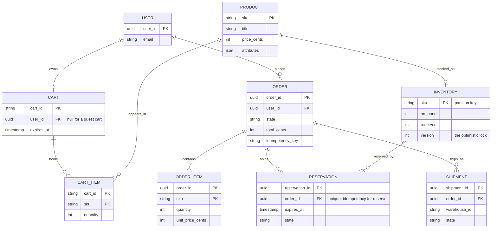
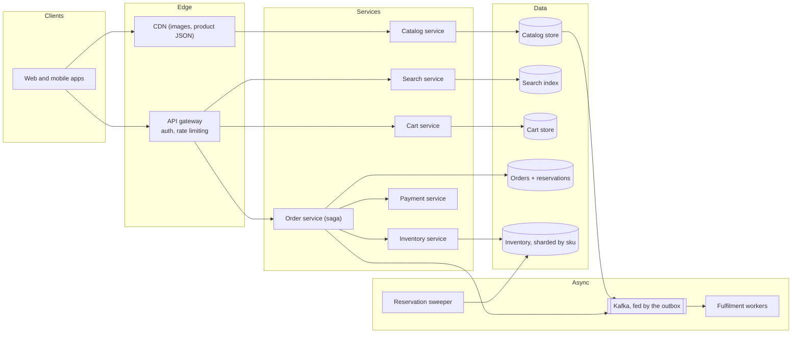
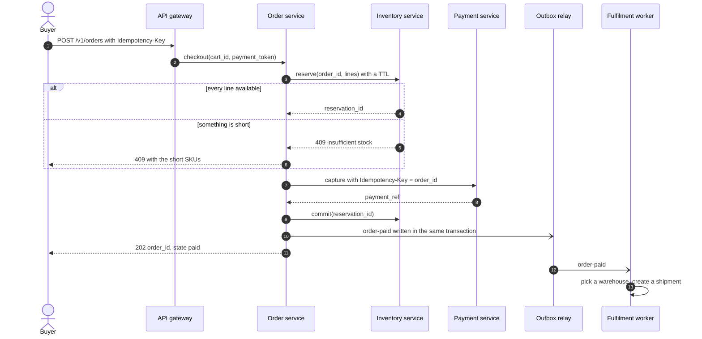
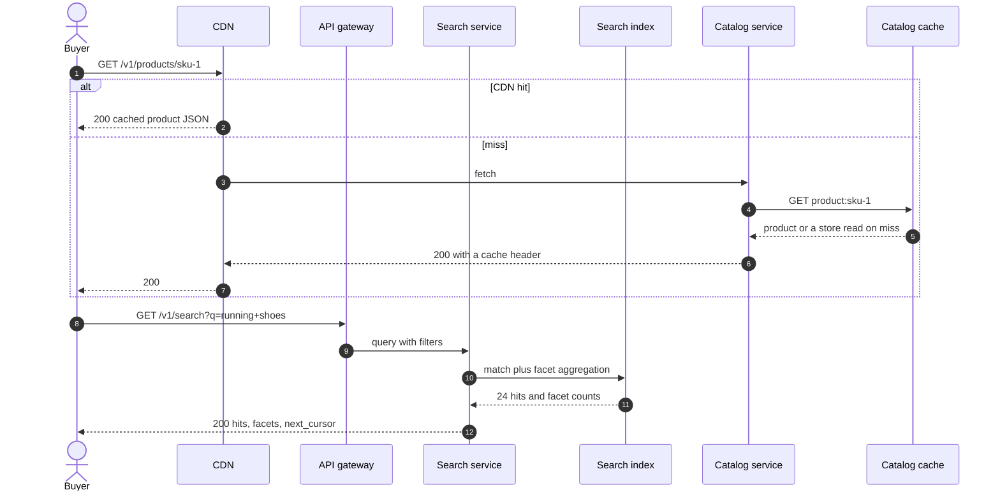
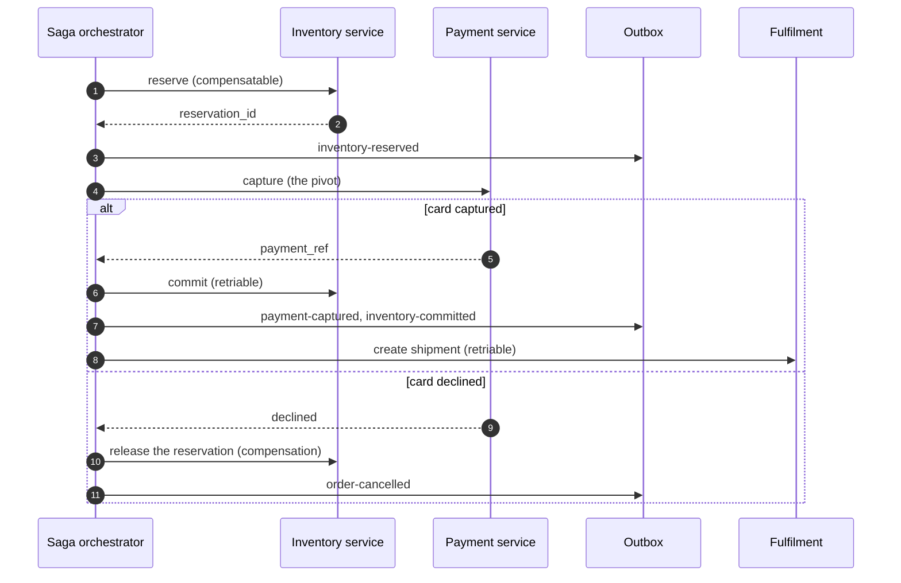
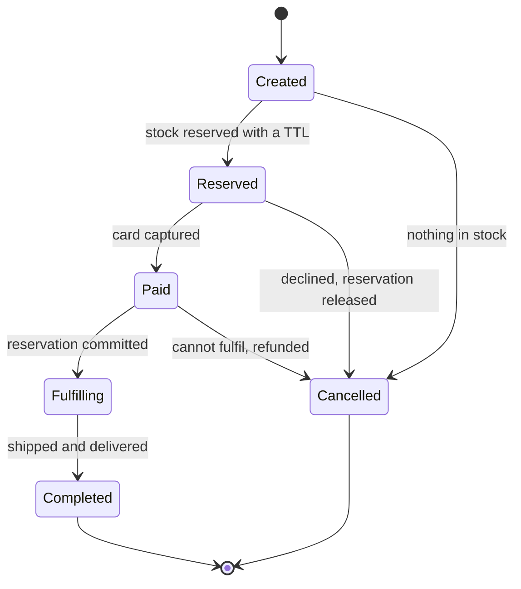
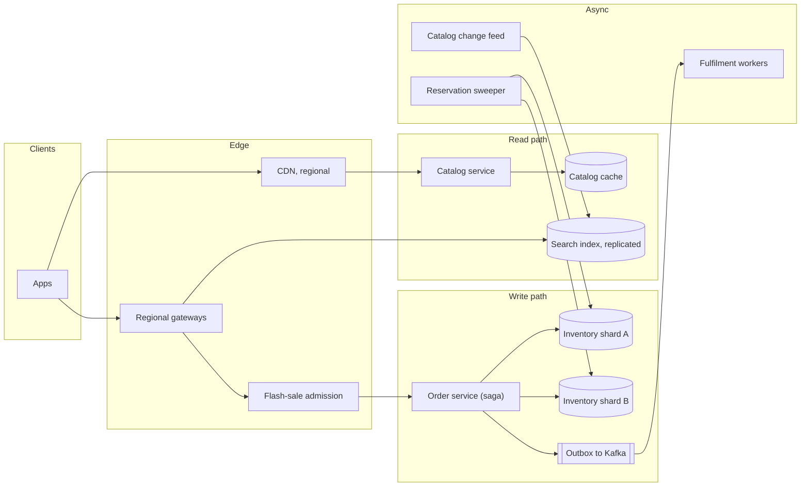

# Design Amazon (e-commerce with inventory and flash sales)

## TL;DR

- E-commerce is **three systems with three consistency needs** bolted together: a read-dominated catalog (20k reads/s, eventually consistent), a cheap mergeable cart, and a strongly consistent inventory row that must never oversell.
- The cruxes an interviewer probes: (1) the **catalog and search read path**, (2) the **cart** and its guest-to-user merge, (3) **inventory reservation** with a TTL and oversell prevention, plus the **flash-sale** variant, (4) the **checkout saga** across order, payment, inventory and fulfilment, published through an **outbox**.
- Reads are 200x writes, so nearly everything is cached; the tiny write path holds all the correctness.

## Problem statement and clarifying questions

"Design a storefront: browse and search a catalog, add to a cart, check out, receive the goods — with inventory that never oversells, including during a flash sale." The scale is in the reads and the difficulty is in the writes, so separate them early.

| Question | Assumption taken |
|---|---|
| How many products and orders? | 500M SKUs, 300M users, 10M orders/day, 2B product views/day. |
| Can we ever oversell? | No, except a bounded buffer if the business asks for one. |
| May the displayed stock count be stale? | Yes, by seconds. The reserve call is the only truth. |
| Do guests have carts? | Yes, and they merge into the user's cart on login. |
| Are flash sales in scope? | Yes: 1M buyers for 10k units inside ten seconds. |
| Who takes payment? | A separate payment service; checkout calls it and compensates on failure. |
| Multi-warehouse? | Model it, but route each order to one fulfilment centre. |
| Search relevance? | Keyword search with filters and facets; ranking models are out of scope. |

## Requirements

### Functional

- Browse the catalog, search with filters and facets, view a product and its stock status.
- Add, update and remove cart items; merge a guest cart into a user cart on login.
- Check out: reserve stock, take payment, create an order, hand off to fulfilment.
- Cancel an order before shipment; run a flash sale with a hard unit cap.

### Non-functional

- **Never oversell**: reserved units are decremented atomically or not at all.
- **Scale**: 20k product reads/s average and 60k peak, ~100 orders/s average and ~300 peak, 100k reserve attempts/s during a flash sale.
- **Latency**: product page p99 < 300 ms, search p99 < 500 ms, checkout p99 < 2 s, dominated by the payment provider.
- **Availability**: 99.99% for browsing (52.6 minutes/year); checkout may fail closed rather than sell stock twice.
- **Durability**: orders, reservations and payments replicated three ways before the acknowledgement.
- **Consistency per component**: catalog within minutes, cart within a second, inventory strongly consistent per SKU.

### Out of scope

Recommendations, pricing and promotion engines, seller onboarding and payouts, returns logistics, warehouse robotics, tax calculation.

## Estimation

Using the [latency and estimation tables](../../cheatsheets/latency-and-estimation.md) (a day is ~10^5 s, peak is 3x average):

| Quantity | Arithmetic | Result |
|---|---|---|
| Product page reads | 2B views/day / 10^5 | ~20k/s average, ~60k/s peak |
| Search queries | 200M/day / 10^5 | ~2k/s average, ~6k/s peak |
| Order writes | 10M/day / 10^5 | ~100/s average, ~300/s peak |
| Cart writes | 50M updates/day / 10^5 | ~500/s average, ~1.5k/s peak |
| Read/write ratio | 20k reads versus 100 order writes | ~200:1, so cache hard |
| Catalog size | 500M SKUs x 5 KB of JSON | ~2.5 TB, too big for memory, fine for key-value |
| Hot catalog cache | 20% of daily reads on ~1M SKUs x 5 KB | ~5 GB, one Redis node plus the CDN |
| Product bandwidth | 20k/s x 5 KB | 100 MB/s = 0.8 Gbps before the CDN absorbs it |
| Order storage | 10M/day x 2 KB x 365 | ~7.3 TB/year, ~22 TB at 3x |
| Flash-sale contention | 100k reserve/s versus ~2k/s per row (500 µs hold) | ~50 counters needed, use 64 |

Two things to say out loud. **The read and write paths share nothing but a SKU id**: 20k reads a second come from a CDN and a cache that never touch the inventory row, while 300 order writes a second are the only place correctness is at stake. And **a flash sale is a contention problem, not a throughput problem**: 100k/s against one row is fifty times what a row sustains, so shard the counter rather than the service.

## API design

| Endpoint | Request | Response | Notes |
|---|---|---|---|
| `GET /v1/products/{sku}` | — | `200 {sku, title, price_cents, stock_status}` + `ETag` | Cacheable for minutes; `stock_status` is a coarse band, not a live count. |
| `GET /v1/search?q=&filter=&limit=24&cursor=...` | — | `200 {hits: [], facets: {}, next_cursor}` | Cursor over `(score, sku)`; never an offset past page 10. |
| `PUT /v1/carts/{cart_id}/items/{sku}` | `{quantity}` | `200 {cart}` | A **set**, not an increment, so a retry is naturally idempotent. |
| `POST /v1/carts/{cart_id}/merge` | `{guest_cart_id}` | `200 {cart}` | Union of lines, quantity capped at available stock. |
| `POST /v1/orders` | `{cart_id, address_id, payment_token}` + `Idempotency-Key` | `202 {order_id, state}` | The saga runs asynchronously after the reservation and capture. |
| `GET /v1/orders/{order_id}` | — | `200 {order_id, state, items, shipments}` | The client polls; state comes from the saga. |

Two API decisions worth defending: cart updates are idempotent **by shape** — setting a quantity, not adding one — which removes a class of double-add bugs; and `POST /v1/orders` returns `202` with a state to poll, because binding the client's connection to a multi-service saga makes every downstream hiccup user-visible.

## Data model

**Catalog, cart and inventory live in different stores because they need different consistency.**



Store choices, each with its consistency stance:

- **Catalog**: key-value by `sku`, fronted by a CDN and a cache. Eventually consistent — a price change taking a minute to propagate is fine — with a change feed into the search index.
- **Search**: an inverted index fed by change data capture at ~5k–10k docs/s per data node. Never the source of truth for price or stock.
- **Cart**: key-value with a TTL — Redis for speed, DynamoDB when carts must survive a flush. Keyed by `cart_id` and never joined against anything.
- **Inventory**: relational, partitioned by `sku`, so a reservation over co-located SKUs is one transaction and the rest is a bounded multi-partition write.
- **Orders**: relational, partitioned by `user_id` so history is one partition scan, `idempotency_key` unique.
- **Indexes**: `(user_id, created_at desc)` for order history, `(state, expires_at)` for the reservation sweeper, `(order_id)` unique on reservations.

## High-level design

**v1: a heavily cached read path, a thin cart service, and a checkout saga that is the only writer of inventory and orders.**



**Write path: reserve, capture, commit, ship — accepted early and completed asynchronously.**



**Read path: the CDN answers most product views, and search never reads the inventory row.**



The structural claim: the read path never touches the inventory row and the write path never scans the catalog. They meet at the SKU id, which is what lets one side be a CDN problem and the other a transaction problem.

## Deep dive: the catalog and search read path

The probing question is "20,000 product page views a second — where does that traffic go?" Nowhere near the database, if the design is right.

The catalog is **read-mostly and eventually consistent**, so it stacks caches. The CDN holds product JSON and images with a short TTL and an `ETag`, absorbing most traffic. Behind it a cache holds the SKU record — 1M hot SKUs at 5 KB is ~5 GB — and behind that a key-value store handles the long tail of 500M products. A price change writes the store and publishes an event that invalidates the cache and the CDN key; at thousands of writes a day, invalidation is cheap.

**Search is a derived store, never the source of truth.** Change data capture from the catalog feeds an inverted index at ~5k–10k docs/s per data node; queries return hits plus facet counts. Two rules keep it honest. Search results carry **ids and cached display fields only**, so hydration comes from the catalog cache and a stale index cannot show a stale price. And search shows a **coarse stock band** — "in stock", "only a few left", "out of stock" — not a live count, because publishing an exact number both leaks business data and creates a promise the reserve call may break a second later.

Pagination is cursor-based over `(score, sku)` and deep pagination is capped: nobody legitimately reads page 500, and allowing it turns one request into a full index scan.

State the consistency stance: the catalog lags by minutes at the CDN and seconds at the cache, and the index lags the catalog by seconds. All acceptable — a customer seeing a product that just sold out is normal shopping, and the reserve call enforces the truth.

## Deep dive: the cart

The probing question is "where does the cart live, and what happens when a guest logs in?" The cart is the cheapest part of the system and the easiest to over-engineer.

| Store | Pros | Cons | Suits |
|---|---|---|---|
| Redis with a TTL | Sub-millisecond, ~100k ops/s per node | Lost on flush unless persisted | Session-scoped carts |
| DynamoDB or Cassandra | Durable, TTL support, linear scale | Slower, costs more per operation | Carts that live for weeks |
| Relational rows | Joins to products and orders are free | Wastes transactional capacity | Small catalogs only |

Choose a **key-value store keyed by `cart_id` with a TTL** — Redis for session carts, DynamoDB when they must live for weeks across devices. The cart holds `(sku, quantity)` and nothing else: no prices, no availability, both re-read at render and at checkout, because a price cached in the cart is a customer-service incident waiting to happen.

**The guest merge** is the part interviewers actually probe. A guest gets a `cart_id` in a cookie; on login you union it into the user cart rather than replacing it, because someone who added items before logging in expects both sets. Take the maximum quantity per SKU, cap each line at available stock, and drop dead SKUs. Do it server-side, where a union is naturally idempotent and the endpoint is safe to call twice.

Two more decisions. **A cart never reserves stock** — reserving at add-to-cart looks friendly and destroys availability, because most carts are abandoned. And **cart writes are a set, not an increment**, so a retried request cannot silently double a quantity, which is also why `PUT` is the right verb.

!!! warning "Common mistake"
    Reserving inventory when an item enters the cart. Roughly seven in ten carts are abandoned, so you would hold most of your stock for people who never buy, watch conversion collapse, and then bolt on a sweeper to undo it. Reserve at checkout, with a TTL measured in minutes.

## Deep dive: inventory reservation, overselling and flash sales

The probing question is "two buyers take the last unit at the same instant." Availability is never *read then written*: it is decremented conditionally in one statement that either touches a row or does not.

| Mechanism | How it works | Breaks when |
|---|---|---|
| Conditional decrement | `UPDATE inventory SET reserved = reserved + ? WHERE sku = ? AND on_hand - reserved >= ?` | Never for correctness, but one row serialises writers |
| Optimistic lock on a version | Read version, compute, write conditionally, retry on mismatch | Contention is high: retries multiply |
| Pessimistic row lock | `SELECT ... FOR UPDATE` for the checkout's duration | The transaction spans a payment call: pool exhaustion |
| Sharded counters | Split one SKU into N counters, take from any | Sell-out is only visible when every shard is empty |

The base design uses the **conditional decrement plus a reservation with a TTL**: all-or-nothing across an order's lines, idempotent per `order_id`, version-checked when the caller acted on an earlier read. An expired reservation is reclaimed lazily by the next reserve as well as by a sweeper, so stuck stock cannot outlive its TTL:

```python title="code/hld/inventory_reservation.py — reserve, commit, release"
--8<-- "code/hld/inventory_reservation.py:inventory"
```

Two details inside `reserve` decide whether that idempotency key helps or hurts. The lazy sweep runs **before** the key is consulted, so a hold whose TTL lapsed but which no sweeper has reached yet is expired rather than mistaken for a live one. And only a **held or committed** reservation counts as a retry: a saga that compensated leaves its reservation `released`, and handing that dead hold back to a retried checkout would give the caller units it no longer owns and a commit that can only fail. A retry after a compensation must take a fresh hold, or fail honestly because the stock has gone.

The reservation also records the stock `versions` it was taken against. That is an **audit record**, carried on the reserve event and deliberately never re-read at commit time: a held reservation's units are already out of `available`, so nobody else could have taken them and there is nothing to compare against. A [seat hold](ticketing-and-reservations.md) does re-check its versions, because its seats become takeable the moment its TTL lapses — the difference is worth naming out loud, since an interviewer will ask why one checks and the other does not.

**Flash sales** break the base design, and the arithmetic says why: a row held for a ~500 µs round trip sustains roughly 2k updates/s, while a drop brings 100k attempts/s. Application scaling cannot help, because the contention is one row. Shard the counter into 64 buckets, each its own key or row, and route buyers by hashing their id. The only cost is that "sold out" needs a walk over the shards instead of one read:

```python title="code/hld/inventory_reservation.py — sharded flash-sale counter"
--8<-- "code/hld/inventory_reservation.py:flash_sale"
```

Put the rest of the toolkit in front of it: admission tokens so the fleet sees a rate you chose, per-user caps checked before the counter, and a pre-warmed cache so the product page never falls back to the store. And say the honest trade: **a bounded oversell buffer is sometimes correct** — retailers routinely sell 1–2% over stock because cancellations exceed that — but as a deliberate policy in the allotment, never as an accident of a race.

## Deep dive: the checkout saga and the outbox

The probing question is "the payment succeeded and the inventory commit failed. Who owns the mess?" Checkout spans four services, so there is no distributed transaction to lean on. Use a **saga**: an ordered list of steps, each with a compensation, and one **pivot** — the last step allowed to fail for a business reason.

**Checkout as a saga. Everything before the pivot is undoable; everything after must eventually succeed.**



The step kinds carry the whole design. `reserve_inventory` is **compensatable**: it may fail harmlessly, and its compensation gives the units back. `charge_payment` is the **pivot**: after it, money has moved, so nothing downstream may fail permanently. `commit_inventory` and `create_shipment` are **retriable**: they are retried until they succeed, and a run that exhausts its attempts is parked for a human rather than silently reversed.

```python title="code/hld/inventory_reservation.py — the checkout saga"
--8<-- "code/hld/inventory_reservation.py:checkout"
```

Every step publishes through an **outbox**: the event row is written in the same transaction as the state change, and a relay tails the table and pushes to Kafka. That removes the dual-write problem — a crash between "order updated" and "event published" is impossible, because they are one commit. Consumers deduplicate by event id, since the relay is at-least-once. The orchestrator's own log is durable too, so a crash mid-saga resumes at the step that was in flight rather than restarting it, which is exactly why every step has to be idempotent.

**An order's lifecycle.** Only the transitions before the pivot lead to `Cancelled` without money moving.



Running the module walks the whole flow: an all-or-nothing reservation, an idempotent retry, a stale-version rejection, a lazily reclaimed expiry, a retry after a compensation that takes a fresh hold rather than the released one, a completed saga, a compensated one, and a sharded flash sale.

```text
ord-1 reserves 2 tshirt + 1 mug   -> rsv-1, available {'tshirt': (3, 2), 'mug': (1, 1), 'poster': (10, 0)}
ord-1 retried (client timeout)    -> rsv-1 again, not a second hold
ord-2 wants 2 mugs, 1 is free     -> rejected: insufficient stock for ['mug'] (all or nothing)
ord-2 reserves on a stale read    -> rejected: stale stock version for ['poster']; re-read and retry
900 s pass, ord-3 takes the units -> rsv-2; ord-1 expired lazily
ord-1 pays late, commit           -> rejected: reservation rsv-1 is expired: refund and re-offer
saga compensated ord-3, retried   -> rsv-3, a fresh hold, not the released rsv-2
checkout ord-4 (3 posters)        -> saga completed, posters left 12
  outbox relayed                  -> ['inventory-reserved', 'payment-captured', 'inventory-committed', 'shipment-created']
checkout ord-9, card declined     -> saga compensated, posters back to 12
  outbox relayed                  -> ['inventory-reserved', 'order-cancelled']
flash sale: 100 units, 8 shards   -> 100 claimed across shards [0, 1, 2, 3, 4, 5, 6, 7]
the 101st buyer                   -> take() returns None, remaining 0
```

## Scaling, bottlenecks and failure modes

**v2: the read path served entirely from edge and cache, inventory sharded by SKU with flash-sale buckets, and everything asynchronous behind the outbox.**



What breaks first, and what you do about it:

- **The hot SKU row**, always. Sharded counters for planned drops; for organic hot items, detect the contention and promote the SKU to a sharded counter automatically.
- **Cache stampede** when a popular SKU expires: single-flight per key plus a soft TTL that serves stale content while one request refreshes.
- **Search index lag** behind a bulk catalog import. Throttle the change feed, and never let the index become the source of price or stock.
- **Multi-SKU orders across shards.** An order touching three partitions cannot be one transaction, so reserve per shard and compensate on partial failure; the reservation TTL bounds the damage.
- **Payment provider outage.** The pivot fails, the saga compensates, the reservation is released, and the customer sees a clean failure rather than a charge with no stock.
- **Fulfilment backlog.** Orders sit in `Paid` while workers drain the queue — the degradation you want: money taken, stock committed, shipping late.
- **Consistency summary**: inventory strongly consistent per SKU; orders strongly consistent per partition; cart within a second; catalog and search eventually consistent within minutes.

## Trade-offs summary

| Decision | Chosen | Alternatives | Why |
|---|---|---|---|
| Catalog reads | CDN + cache + key-value store | Read replicas of the write store | 200:1 read ratio; the store should never see the traffic |
| Search | Derived index from a change feed | Query the catalog directly | Facets and text matching are not a key-value workload |
| Cart | Key-value with a TTL | Relational rows | Cheap, mergeable, disposable |
| Reserve timing | At checkout, with a TTL | At add-to-cart | Most carts are abandoned |
| Oversell prevention | Conditional decrement + version check | Read-then-write, distributed lock | One statement, no lock across a payment |
| Flash sales | Sharded counters + admission control | Scale the service | The bottleneck is one row, not CPU |
| Cross-service checkout | Saga with a pivot | Two-phase commit | No 2PC across a third-party payment provider |
| Event publication | Outbox in the same transaction | Publish after commit | Removes the dual-write failure |

## Interviewer follow-ups

??? question "Why not show the exact stock count on the product page?"
    It leaks business information, it is stale the moment it renders, and it turns a normal race into a perceived bug when the number says 3 and the reserve fails. A coarse band plus an honest error at checkout is cheaper and more truthful.

??? question "How do you handle multi-warehouse inventory?"
    Inventory becomes `(sku, warehouse)` rows and the reserve step picks a fulfilment centre first — nearest with stock for the whole order, or split shipments. The reservation simply names the warehouse.

??? question "What if the fulfilment step fails permanently after payment?"
    It is past the pivot, so nothing undoes the charge automatically. Park the order for an operator, refund explicitly through the payment service with its own idempotency key, and return the units with a compensating release.

??? question "How do you prevent bots from taking a whole flash-sale drop?"
    Admission tokens issued before any inventory code runs, per-user and per-instrument caps checked before the counter decrements, fingerprinting at the edge, and post-purchase cancellation of mass buys.

??? question "Where do idempotency keys actually matter here?"
    Three places: `POST /v1/orders`, so a retried checkout makes one order; the reservation keyed by `order_id`, so a retried step does not reserve twice while its hold is live — a retry after a compensation takes a fresh hold; and the capture keyed by `order_id`, so a retry does not charge twice. Cart writes need no key: they are idempotent by shape.

??? question "How would you add price and promotion changes safely?"
    Price is resolved at checkout from the catalog, never from the cart, and copied into the order line. The order then holds immutable evidence of what was agreed, and a promotion expiring mid-checkout produces a repricing prompt rather than a silent difference.

??? question "How do you test that you never oversell?"
    A concurrency test that fires hundreds of reservations at ten units and asserts exactly ten succeed and availability lands on zero — which is what the module's tests do, along with the same assertion against the sharded counter.

!!! tip "Interview tip"
    Open by splitting the problem: "this is a 200:1 read-heavy catalog, a disposable cart, and a strongly consistent inventory row — three different consistency models, so I will design them separately." Interviewers are listening for whether you can tell which 1% of the system actually needs transactions.

## 45-minute pacing

| Minutes | What to say and draw |
|---|---|
| 0–5 | Clarify: 500M SKUs, 10M orders/day, never oversell, guest carts merge, flash sales in scope. |
| 5–9 | Estimation: 20k product reads/s versus 100 order writes/s, the 200:1 ratio, and 100k/s against one row in a drop. |
| 9–15 | Data model and the per-component consistency table; API with `202` on checkout. |
| 15–22 | v1 diagram; narrate the read path (CDN, cache, index) and the write path (reserve, capture, commit, ship). |
| 22–34 | Deep dives: catalog and search caching, the cart and its merge, reservation with a TTL. |
| 34–40 | Flash sales with sharded counters, then the checkout saga and the outbox. |
| 40–45 | Failure modes (hot SKU, stampede, provider outage, fulfilment backlog) and the trade-offs table. |

## Related

- [Transactions, 2PC, sagas and idempotency](../fundamentals/transactions-and-distributed-transactions.md) — the saga, pivot and outbox machinery behind checkout
- [Design a payment system and digital wallet](payment-system.md) — the service the pivot step calls, and its idempotency contract
- [Design a search engine (with Twitter real-time search)](search-engine.md) — the inverted index behind the search read path
- [Design Amazon (cart, order, inventory, payment)](../../lld/problems/ecommerce-order-inventory.md) — the same domain in LLD
- Primary source: Amazon's Dynamo paper (2007) on the shopping-cart availability model
