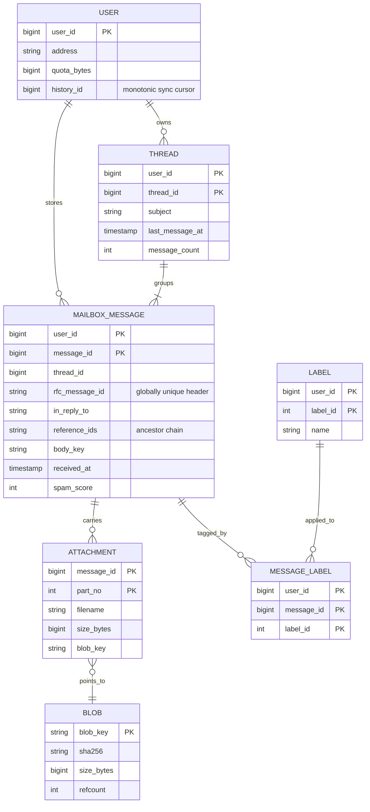
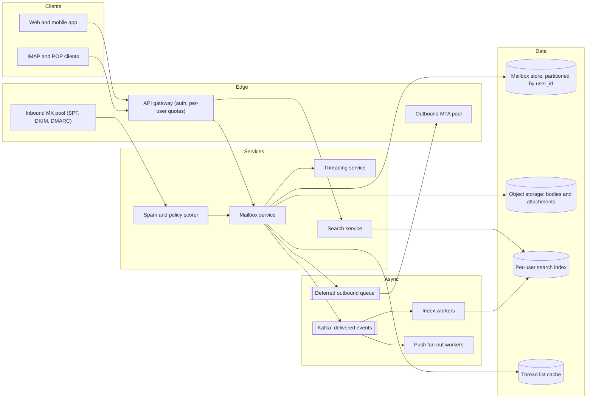
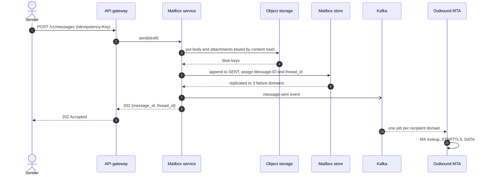
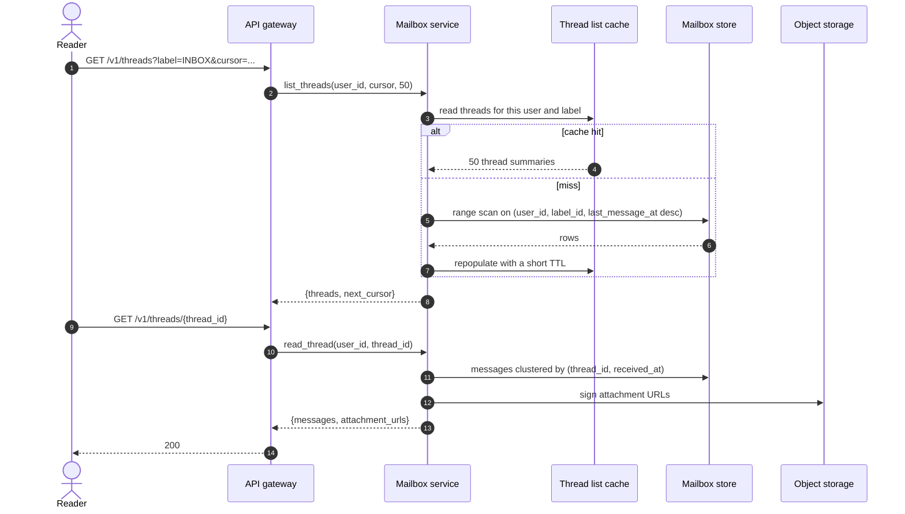
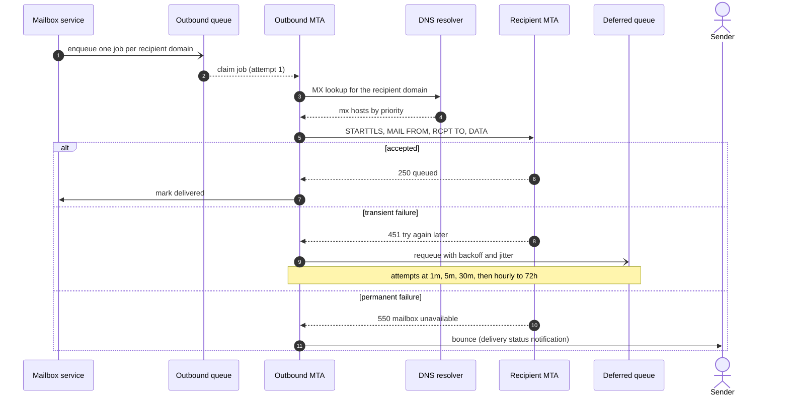
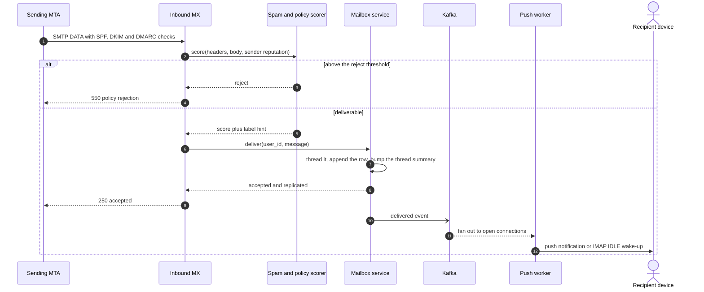
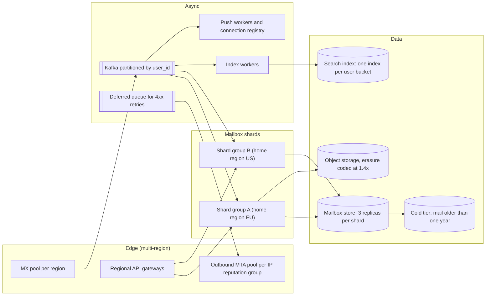

# Design Gmail

## TL;DR

- Email is **federated, at-least-once and write-heavy**: ~60k deliveries/s land in mailboxes partitioned by `user_id`, content lives in object storage, and every read touches one partition.
- The cruxes an interviewer probes: (1) **mailbox storage partitioned by user**, (2) **SMTP send and receive** with MTA retries and bounce semantics, (3) the **per-user search index**, (4) **threading** via `Message-ID`, `In-Reply-To` and `References`.
- Spam is scored *before* the `250`, attachments are deduplicated blobs, and new mail is pushed over the event log that feeds indexing.

## Problem statement and clarifying questions

"Design an email service: users receive mail from anywhere on the internet, read it in threads, search it, and send mail back out." Email differs from every social system on this site in one respect — you do not own the other end. Half the write path is a protocol from 1982 talking to servers you do not control, so retries, bounces and reputation dominate the design.

| Question | Assumption taken |
|---|---|
| Scale? | 1B registered users, 300M DAU, 20 messages received and 3 sent per active user per day. |
| Do we speak SMTP to the outside world? | Yes, full federation: inbound MX servers and an outbound MTA pool. |
| Do IMAP and POP clients have to work? | Yes, as a thin adapter over the mailbox API; the web client is the primary surface. |
| Is search full-text? | Yes: free text plus structured operators (`from:`, `label:`, `has:attachment`, date ranges). |
| Conversation view or flat list? | Conversation view — threading is a first-class requirement. |
| How fresh must search be? | Seconds. The inbox list must be immediate; search may lag. |
| Instant notification of new mail? | Yes: push and IMAP IDLE wake-ups within a few seconds. |

## Requirements

### Functional

- Receive mail over SMTP, apply spam and policy filtering, deliver into the mailbox.
- Compose and send with attachments; replies and forwards keep conversation headers correct.
- List by label (`INBOX`, `SENT`, custom), open a conversation, mark read, star, archive, delete.
- Search with free text and structured operators, ranked by recency.
- Notify connected devices when new mail arrives.

### Non-functional

- Scale: 6B deliveries/day (~60k/s average, ~180k/s peak) and ~900M user sends/day.
- Latency: list and thread open p99 < 300 ms, search p99 < 500 ms, delivery to inbox p95 < 5 s.
- Durability is the hard requirement: **a message accepted with a `250` is never lost**, so replicate synchronously across three failure domains before answering.
- Consistency: mailbox list and thread view are strongly consistent per user (single-partition reads); search and unread counters are eventually consistent within seconds.
- Availability: 99.99% for reads and inbound MX. A refused connection is not data loss — senders retry for days — but it is reputation damage.

### Out of scope

Calendar and contacts, end-to-end encryption, the spam model itself (we place it, we do not train it), e-discovery, mailing-list management.

## Estimation

Using the [latency and estimation tables](../../cheatsheets/latency-and-estimation.md) (a day is ~10^5 s, peak is 3x average). A message plus MIME headers is a 10 KB JSON-sized object; the mailbox row pointing at it is ~500 B.

| Quantity | Arithmetic | Result |
|---|---|---|
| Delivery write QPS | 300M x 20 = 6B/day / 10^5 | ~60k/s average, ~180k/s peak |
| User send QPS | 300M x 3 = 900M/day / 10^5 | ~9k/s average, ~27k/s peak |
| Mailbox read QPS | 300M x 25 list + thread opens = 7.5B/day | ~75k/s average, ~225k/s peak |
| Mailbox store (metadata) | 6B x 500 B x 365 | ~1.1 PB/year, x3 replicas = ~3.3 PB |
| Content in object storage | bodies 6B x 10 KB + attachments 5% x 500 KB | 210 TB/day = ~77 PB/year, erasure-coded at 1.4x |
| Search index | 300 terms x 8 B = 2.4 KB/message x 6B | ~14 TB/day, ~24% of the body corpus |
| Read bandwidth | 75k/s x 10 KB | 750 MB/s = ~6 Gbps across the API tier |
| Thread-list cache | 20% of 7.5B daily reads x 1 KB summary | ~1.5 TB of Redis |

Two things to say out loud. **Attachments outweigh every body combined by 2.5x even at a 5% attach rate**, so they are deduplicated blobs, never rows. And the read/write ratio is only **1.25:1** — nothing like a news feed — so the budget goes on cheap durable writes, not read caches.

## API design

| Endpoint | Request | Response | Notes |
|---|---|---|---|
| `POST /v1/messages` | `{to[], cc[], subject, body, attachment_ids[], in_reply_to}` + header `Idempotency-Key` | `202 {message_id, thread_id}` | Accepted once durable in `SENT` and enqueued; SMTP delivery is async. A retry with the same key returns the same ids instead of sending twice. |
| `GET /v1/threads?label=INBOX&limit=50&cursor=...` | — | `200 {threads: [...], next_cursor}` | Opaque cursor `base64(last_message_at|thread_id)`; never an offset, because mail arrives between pages. |
| `GET /v1/threads/{thread_id}` | — | `200 {messages: [...], attachments: [{url, expires_at}]}` | Short-lived signed object-storage URLs; bytes never pass through the API tier. |
| `POST /v1/messages/{id}/labels` | `{add: [...], remove: [...]}` | `204` | Idempotent by construction (set semantics), so a mobile client can replay its offline queue. |
| `GET /v1/search?q=from:ana has:attachment invoice&cursor=...` | — | `200 {results, next_cursor}` | Scoped to the caller's mailbox; the partition *is* the access-control boundary. |

Every endpoint takes `user_id` from the token, never the body. Clients also poll `GET /v1/sync?since=<history_id>`, a monotonic per-mailbox change cursor (the same idea as an IMAP `UIDNEXT`), which is what lets a client resync after a week offline without redownloading the mailbox.

## Data model

**Mailbox rows are metadata; every byte of content lives in object storage behind a content hash.**



Store choices, with the sentence to say for each:

- **Mailbox store**: a wide-column store (Cassandra/Bigtable-style), partition key `user_id`, clustering key `(thread_id, received_at)`, plus a `THREAD` table clustered by `(last_message_at DESC, thread_id)` so the inbox list is a single-partition range scan with no sort.
- **Label index**: `MESSAGE_LABEL` clustered by `(label_id, last_message_at DESC)` in the same partition and written in the same batch; the message row denormalizes its label ids so the thread view needs no join.
- **Blobs**: object storage keyed by `sha256`; `refcount` stores the 20 MB deck sent to 200 colleagues once and garbage-collects it when the last reference dies.
- **Sync log**: a per-user append-only change log keyed by `history_id`, consumed by clients.

## High-level design

**v1: an SMTP edge on one side, an API edge on the other, and one event log connecting delivery to indexing and push.**



**Write path: durable in `SENT` first, acknowledged second, delivered to the internet third.**



**Read path: one partition scan for the list, one partition scan for the thread, signed URLs for the bytes.**



Walk-through: the sender's request never waits for SMTP, because a remote server may be down for two days — the contract is "durably yours", not "delivered". The read side has no fan-out and no merge, so both reads are single-partition scans and a 500 µs round trip plus a 16 µs SSD read fits the 300 ms budget many times over.

## Deep dive: mailbox storage partitioned by user

The probing question is "where does a message physically live, and what does the inbox query look like?" Three layouts:

| Layout | Inbox list | Delivery write | Breaks when |
|---|---|---|---|
| Relational table sharded by `message_id` | Scatter-gather, then a global sort | 1 row | Any mailbox listing; the sort has no home |
| Per-user mailbox file (Maildir style) | Sequential file read | Append | No label queries, no partial sync, no concurrent writers |
| Wide-column partitioned by `user_id` | One range scan, already ordered | 1 row per recipient | A mailbox outgrows the partition budget |

Take the third. Partitioning by `user_id` makes every question a user asks about their own mail a **single-partition** question: list by label, open a thread, count unread, page backwards. No cross-shard join appears on the read path, and the partition doubles as the authorization boundary.

Delivery is fan-out on write with a twist: a message to 50 internal recipients writes 50 mailbox rows but stores **one** body blob, referenced by content hash. There is no celebrity problem, because a mailing list is not a recipient — it expands asynchronously, so `all-staff@` is a queue-paced fan-out.

Two things bound partition size. The row is metadata only (~500 B: headers, blob keys, label ids, flags), so a 5M-message mailbox is ~2.5 GB of rows, not 50 TB of bodies. And the partition key is bucketed as `(user_id, year_month)`, so a scan reads recent buckets and stops; older buckets move to a cold tier.

Counters are the subtle part. Per-label unread counts are read-modify-writes on every delivery and every read: keep them in the same partition so the update is one batch, treat them as advisory, and recompute them nightly from the label index. A wrong badge is cosmetic; a lost message is an outage.

## Deep dive: send and receive over SMTP

The probing question is "what happens between clicking Send and the message landing at another provider?" The answer is a queue with a retry policy, because the far end is a machine you do not control.

| Peer response | Meaning | Action |
|---|---|---|
| `250` | Accepted and now the peer's responsibility | Mark delivered, keep the peer's queue id for tracing |
| `4xx` | Transient: greylisting, rate limit, temporary DNS failure | Requeue with backoff and jitter (1 min, 5 min, 30 min, then hourly); give up at 72 h with a bounce |
| `5xx` | Permanent: no such user, policy rejection | Bounce immediately with a DSN; never retry |
| Timeout or TLS failure | Unknown | Treat as `4xx`, cap concurrency per destination, open a circuit breaker on that peer |

**Outbound: one job per recipient domain, retried out of a delayed queue.**



Grouping by domain matters: one connection to a large provider carries many `RCPT TO` lines for one `DATA` — the difference between 200 connections and 2. Outbound IPs are pooled by reputation, and a per-destination concurrency cap plus a circuit breaker stops one slow peer consuming the pool.

Inbound is the mirror image, and one decision dominates it: **score spam before you answer `250`, and reject at SMTP time.** Accept first and bounce later and you send bounce mail to forged senders, which makes you a spam amplifier. Anything you accept, you must deliver.

**Inbound: authenticate, score, deliver, then push.**



SMTP is at-least-once — a peer that times out after your `250` will resend — so the receiving side deduplicates by `Message-ID` within a window. That is the same idempotency argument as an `Idempotency-Key`, arriving from 1982.

## Deep dive: the per-user search index

The probing question is "how does `from:ana has:attachment invoice` return in under 500 ms over a 5M-message mailbox?" The insight that separates a good answer from a generic one: **email search is always scoped to one user**, so partition the index the way you partitioned mailboxes.

| Index layout | Query cost | Notes |
|---|---|---|
| Global index sharded by term | Scatter-gather, then filter by owner | Every query touches every node, and access control happens after ranking |
| Sharded by document, random buckets | Fan out to the buckets holding this user's mail | Better, but a mailbox is spread over many shards |
| One index per user, co-located with the mailbox shard | Single-node query over a tiny postings list | Access control *is* the partition; millions of tiny indexes to operate |

Take the third, with the operational fix: group users into buckets so you run thousands of physical indexes, not a billion. A query resolves `user_id` to a bucket, hits one node, and scores a postings list small by construction — the largest mailbox is a rounding error next to a web corpus, which is why ranking here is recency plus a few signals rather than BM25 over the internet.

Structured operators never touch the free-text index: `from:`, `label:`, `has:attachment` and date ranges get their own posting lists, so the common query intersects two short lists. Sizing follows the estimation table — ~2.4 KB of postings per message is ~14 TB/day, and at 5k–10k docs/s per data node, 60k deliveries/s needs ~12 nodes, ~24 with headroom.

State the consistency story explicitly, because the interviewer will test it: the index is built by a Kafka consumer, so **search lags by a second or two while the inbox list never does**. The fix for "the mail I just got is not searchable" is the real-time trick from the [search engine](search-engine.md) design — merge an in-memory segment of the last few minutes, read from the mailbox partition, with results from the durable index.

## Deep dive: threading with Message-ID, In-Reply-To and References

The probing question is "two of your users are on the same conversation, but one was only copied on a reply — do their threads look the same?" They should not, and understanding why is the whole answer: **threads are per-mailbox**, computed from the subset of messages that mailbox received.

RFC 5322 gives you three headers: every message carries a globally unique `Message-ID`, and a reply carries `In-Reply-To` (its parent) plus `References` (the ancestor chain). Threading is therefore not a tree walk but a **connected-components problem** over ids, which makes union-find the natural structure.

| Approach | Correct when | Cost |
|---|---|---|
| Group by normalized subject | Almost never — every "Re: hi" collapses into one thread | O(1) |
| Walk `In-Reply-To` up to a root | Headers are complete *and* the parent already arrived | O(depth) reads, breaks on out-of-order delivery |
| Union-find over `Message-ID` + `References` | Headers are partly missing and mail arrives out of order | Near O(1) amortised per message |

Two realities force the union-find. **Out-of-order arrival**: you are copied on Cara's reply before you receive Bob's original, so the reply names ids you have never seen. Create them as *ghost* nodes and union against them; when the real message lands, the halves merge. **Broken clients**: some mailers strip `In-Reply-To`, so an orphan needs a fallback — normalize the subject and merge only if the message really looks like a reply, or two unrelated "Lunch" messages become one conversation.

```python title="code/hld/email_threading.py — union-find over message ids"
--8<-- "code/hld/email_threading.py:union_find"
```

Union by size is not a micro-optimization here; it is the storage plan. When two half-threads merge, the surviving root is the larger side, so the mailbox service rewrites `thread_id` on the **smaller** half — bounding the write amplification of a merge at O(n log n) over the mailbox.

```python title="code/hld/email_threading.py — the per-mailbox threading index"
--8<-- "code/hld/email_threading.py:threader"
```

`add()` is idempotent because SMTP redelivers. The demo shows a ghost appearing and being resolved, a header-stripped reply rescued by subject, and a redelivery deduplicated:

```text
deliver <a1@corp>   -> thread <a1@corp>   ghosts=[]
deliver <c1@corp>   -> thread <a1@corp>   ghosts=['<b1@corp>']
deliver <b1@corp>   -> thread <a1@corp>   ghosts=[]
deliver <d1@corp>   -> thread <a1@corp>   ghosts=[]
deliver <e1@corp>   -> thread <e1@corp>   ghosts=[]
redeliver <b1@corp> -> thread <a1@corp>   (SMTP retry, deduped)
thread <e1@corp>   1 msgs 'Q3 budget' <- eve@corp.example
thread <a1@corp>   4 msgs 'Ship the release' <- ana@corp.example, cara@corp.example, bob@corp.example, dan@corp.example
```

## Scaling, bottlenecks and failure modes

**v2: home-region mailbox shards, an event log partitioned by user, and a cold tier for old mail.**



What breaks first, and what you do about it:

- **A mailing-list blast or a hot alias**: `all-staff@` with 50,000 members is email's closest thing to a celebrity. Expand it in rate-limited fan-out workers, never inline at SMTP time, and bucket the alias mailbox by month. The degradation you want is delivery lag, not a rejected `RCPT TO`.
- **Index lag** during a spike: Kafka buffers and workers autoscale, so search falls seconds behind while the inbox list does not.
- **A slow peer domain**: per-destination concurrency caps and a circuit breaker, with the deferred queue absorbing the backlog. Without them one unresponsive provider drains the outbound pool.
- **Region failure**: mailboxes have a home region for data residency and failover promotes replicas in the paired region. Because peers retry for days, the correct degraded behaviour is to **stop answering `250`** rather than accept mail you cannot store.

## Trade-offs summary

| Decision | Chosen | Alternatives | Why |
|---|---|---|---|
| Mailbox partitioning | Wide-column by `user_id`, bucketed by month | Shard by `message_id`; per-user files | Every user query is a single-partition read and an access-control boundary |
| Send acknowledgement | `202` after the durable `SENT` write | Wait for remote SMTP | A peer can be down for days; the user contract is durability, not delivery |
| Outbound retries | Delayed queue, backoff with jitter, DSN at 72 h | Tight retry loop; give up at once | Matches internet convention and protects sending reputation |
| Spam decision point | Before answering `250`, reject at SMTP | Accept then bounce | Accept-then-bounce turns you into a backscatter source |
| Search index | One logical index per user, bucketed physically | Global index sharded by term | No scatter-gather, no post-ranking access-control filter |
| Threading | Union-find over headers plus a guarded subject fallback | Subject grouping; parent walk | Survives out-of-order delivery and header-stripping clients |

## Interviewer follow-ups

??? question "Two of my users are on the same thread. Is the thread shared?"
    No. Each mailbox threads what it received, so the conversations legitimately differ in size. A shared `thread_id` would need a global threading service, cross-mailbox reads and a new access-control story — all cost, no benefit. A delegated mailbox is the exception: one partition, several readers.

??? question "How do you avoid sending the same mail twice when the outbound MTA crashes mid-delivery?"
    You cannot: a crash after `DATA` but before reading `250` is ambiguous, so SMTP is at-least-once. Make the *receiving* side idempotent by deduping on `Message-ID`, and keep per-recipient state in the job so a resumed job retries only unconfirmed domains.

??? question "Where does spam filtering run, and what does it cost you?"
    Inline in the inbound MX path before the `250`, on a budget of tens of milliseconds because the peer holds the connection open. The model therefore runs on precomputed features: sender reputation, DKIM alignment, content hashes. Anything slower runs after acceptance and may only *move* mail to spam, never reject it.

??? question "A user has 5M messages and searches for a common word. What happens?"
    The postings list is bounded by the mailbox, so this is a single-node query over a few million postings. Rank recency-first, terminate early once you have a page, and paginate with a cursor over `(received_at, message_id)` rather than an offset.

??? question "How does a mobile client that was offline for a week resync?"
    It replays the per-mailbox change log from its last `history_id`: message-added, label-changed and message-deleted records. A client older than the log's retention falls back to a headers-only full resync — the same trade-off as an expired replication slot.

??? question "Why not use a relational database for mailboxes?"
    You can, and small providers do; sharded by `user_id` it is the same idea. It stops working where a mailbox needs range scans over millions of rows in per-label order while the fleet sustains 180k writes/s.

!!! tip "Interview tip"
    Open with "email is federated, so half my write path talks to servers I do not control." That one sentence puts retries, bounce codes, reputation and at-least-once delivery on the whiteboard — exactly what separates an email design from a generic CRUD design.

!!! warning "Common mistake"
    Designing the read path like a news feed. There is no fan-out problem: a mailbox is private, reads are single-partition, and reads barely outnumber writes. Ten minutes on feed caches signals that you pattern-matched instead of listening.

## 45-minute pacing

| Minutes | What to say and draw |
|---|---|
| 0–5 | Clarify: full SMTP federation, conversation view, per-user search, 300M DAU, 20 in and 3 out per day. |
| 5–9 | Estimation: 60k deliveries/s, 180k peak, 3 TB/day of metadata, 210 TB/day of content. Call out that attachments dominate and reads barely exceed writes. |
| 9–14 | API (send, list, open thread, search, sync cursor) and the data model; say "rows are metadata, bytes are blobs". |
| 14–24 | v1 diagram; narrate the write path (durable in `SENT`, then `202`, then SMTP) and the read path (two partition scans plus signed URLs). |
| 24–40 | Deep dives: mailbox partitioning, SMTP reply codes, union-find threading, per-user search. |
| 40–45 | Failure modes (list blast, slow peer, index lag, failover) and the trade-offs table. |

## Related

- [Design S3 (with a GFS/HDFS variant)](object-storage.md) — where bodies and attachments live, and why erasure coding beats replication
- [Design a search engine (with Twitter real-time search)](search-engine.md) — the inverted index and the in-memory recent segment reused by mailbox search
- [Design a notification system](notification-system.md) — the push channel that wakes devices when mail arrives
- [Object, file, search, time-series and graph storage](../fundamentals/storage-systems-zoo.md) — store selection behind the mailbox and blob tiers
- [Messaging, queues and Kafka internals](../fundamentals/messaging-and-event-streaming.md) — the delivered-event log feeding indexing, push and retries
- Primary sources: RFC 5321 (SMTP), RFC 5322 (Internet Message Format, section 3.6.4), Jamie Zawinski's message threading algorithm (1997)
