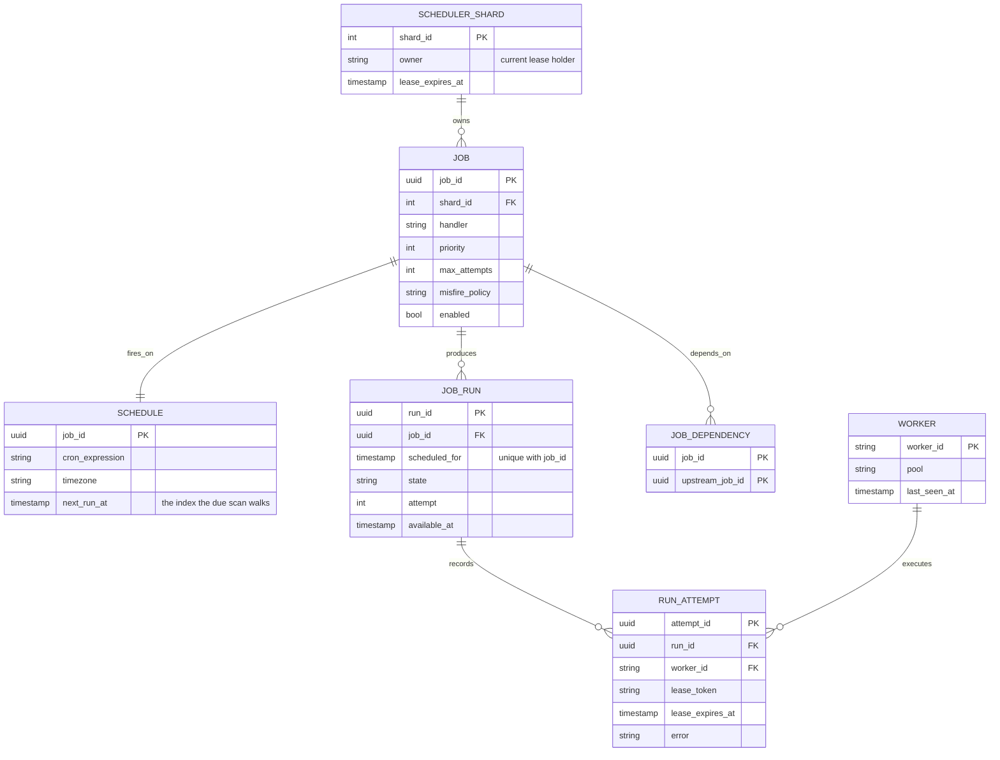
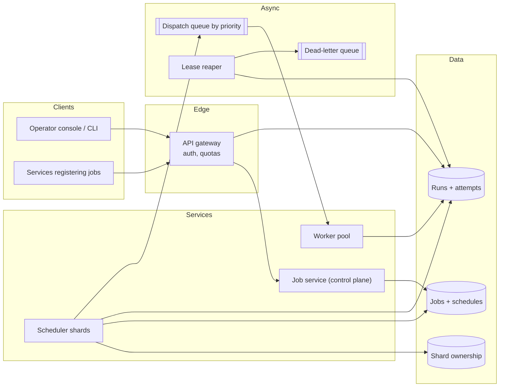
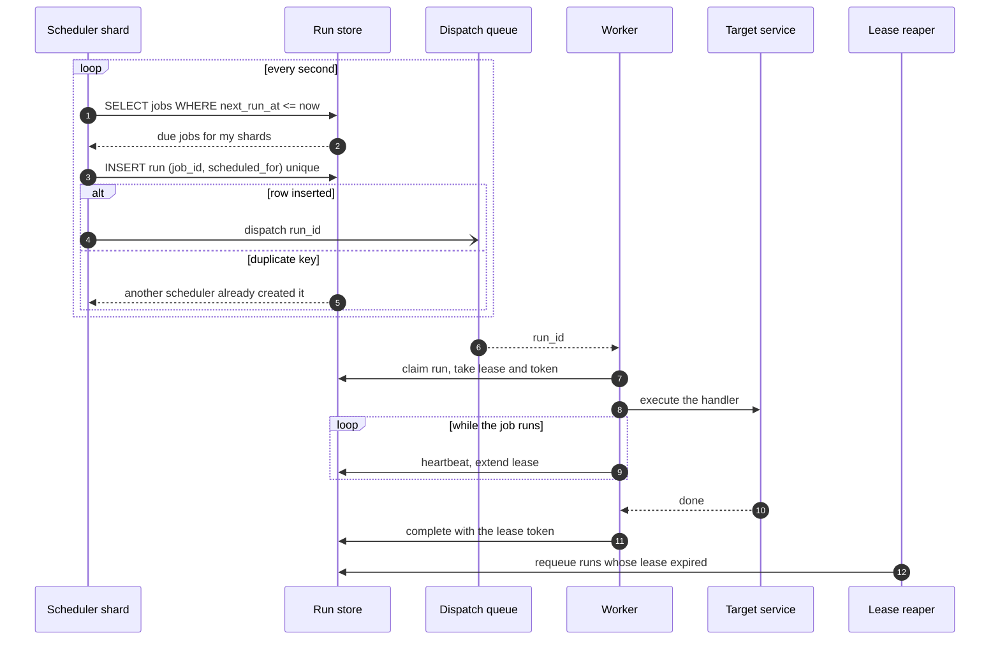
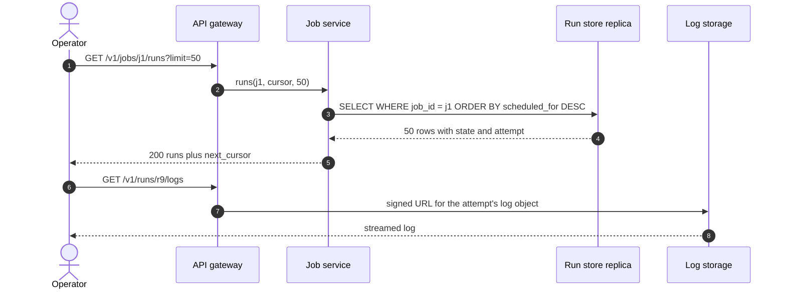
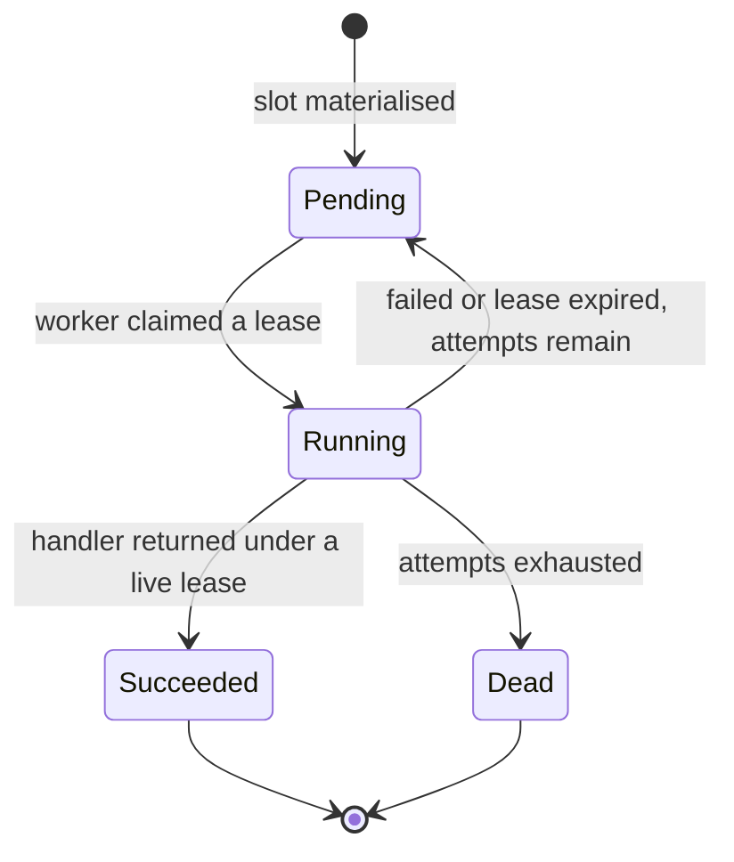
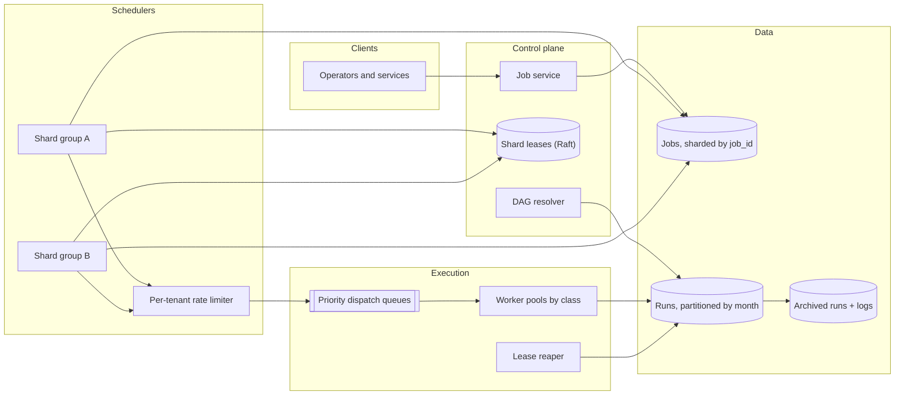

# Design a distributed job scheduler

## TL;DR

- A scheduler is a **timer plus a queue plus a lock**: find what is due, hand each unit of work to exactly one worker, and survive the death of any component without running a job twice or dropping it.
- The cruxes an interviewer probes: (1) how you **find due jobs** (indexed polling versus a time wheel), (2) how you avoid **double execution** (partitioned schedulers and leases, not a lock), (3) **at-least-once plus idempotent handlers**, with retries, backoff and a dead-letter queue, (4) **priorities, rate limits and misfire policies** when the scheduler falls behind.
- The design partitions jobs across scheduler shards, materialises one run record per `(job, slot)`, and leases every run rather than assigning it.

## Problem statement and clarifying questions

"Design the system that runs a million recurring jobs — nightly billing, five-minute metric rollups, per-customer reports — on time and once each, across a fleet that is always partly broken." The interesting part is not the timer; it is what happens when a scheduler restarts mid-tick or a worker freezes with a job half-done.

| Question | Assumption taken |
|---|---|
| Cron-style recurring jobs, one-shot jobs, or both? | Both. A one-shot job is a schedule that fires once. |
| Exactly-once or at-least-once? | At-least-once with idempotent handlers; exactly-once is not achievable across a network. |
| How precise must firing be? | Within a second of the slot; a job may start late, never early. |
| Scale? | 1M job definitions, 10M runs/day, up to 10k runs executing concurrently. |
| How long can a job run? | Seconds to hours, so leases must be renewable. |
| Do jobs have dependencies? | A DAG mode exists, but the core is independent recurring jobs. |
| Scheduler down for an hour? | A per-job misfire policy decides: skip, fire once, or backfill. |
| Who runs the work? | A worker fleet that pulls; the scheduler never calls a handler itself. |

## Requirements

### Functional

- Register, update, pause and delete jobs with a schedule, priority and retry policy.
- Fire each due job by creating a run record and dispatching it to one worker.
- Retry failed runs with backoff, then park them in a dead-letter queue.
- Renew leases for long jobs and reclaim the runs of workers that die.
- Expose run history, current state and the dead-letter list.

### Non-functional

- **No double execution** in the normal case, and a detectable, idempotent duplicate in the abnormal one.
- **No lost runs**: a materialised run is executed or explicitly dead-lettered.
- **Scale**: ~100 runs/s average, ~300/s peak, ~2k writes/s across runs and heartbeats.
- **Timeliness**: p99 start within 1 s of the slot. A same-datacenter round trip is ~500 µs, so the poll interval, not the network, sets precision.
- **Availability**: 99.9% for the control plane (8.76 hours/year); the data plane degrades to "late", not "failed".
- **Durability**: definitions and run records replicated three ways; no state transition is ever lost.

### Out of scope

The execution sandbox (containers, resource isolation), log storage and search, the authoring UI, cost attribution, and cross-cluster federation.

## Estimation

Using the [latency and estimation tables](../../cheatsheets/latency-and-estimation.md) (a day is ~10^5 s, peak is 3x average):

| Quantity | Arithmetic | Result |
|---|---|---|
| Run creations | 10M runs/day / 10^5 | ~100/s average, ~300/s peak |
| Writes per run | insert + claim + complete | ~300/s average, ~900/s peak |
| Heartbeat writes | 10k concurrent runs / 10 s renewal | ~1k/s — the largest single write source |
| Total write load | 900 + 1k at peak | ~2k/s, inside one primary's 5k–20k writes/s |
| Due scan | 16 partitions x 1 poll/s, `next_run_at <= now` | 16 indexed range scans/s, each a few ms |
| Scheduling jitter | 1 s poll versus a 500 µs round trip | the poll sets precision, so poll faster or use a wheel |
| Run storage | 10M/day x 500 B x 365 | ~1.8 TB/year, ~5.5 TB at 3x replication |
| Dispatch bandwidth | 300/s x 1 KB | 300 KB/s, nowhere near a Kafka broker's 100 MB/s |
| History reads | 1M dashboard and API reads/day | ~10/s, served from replicas |

The sentence to say out loud: **heartbeats, not runs, dominate the write load**. Ten thousand concurrent jobs renewing every ten seconds is 1k writes/s, three times the run-creation rate, which is why renewal must be one indexed `UPDATE` and why lease duration costs on both sides — too short and you pay in heartbeats, too long and a dead worker's job stalls for that long.

## API design

| Endpoint | Request | Response | Notes |
|---|---|---|---|
| `PUT /v1/jobs/{job_id}` | `{schedule, handler, priority, max_attempts, misfire}` | `200 {job_id, next_run_at}` | Upsert, so registration from a deploy pipeline is naturally idempotent. |
| `POST /v1/jobs/{job_id}/runs` | `{scheduled_for}` + `Idempotency-Key` | `201 {run_id, state}` | Ad-hoc or backfill trigger; the key plus the slot prevents duplicates. |
| `GET /v1/jobs/{job_id}/runs?limit=50&cursor=...` | — | `200 {runs: [], next_cursor}` | Opaque cursor over `(scheduled_for, run_id)`, newest first. |
| `POST /v1/runs/{run_id}/heartbeat` | `{lease_token}` | `200 {lease_expires_at}` or `409` | A 409 means the lease was reclaimed: the worker must abandon its work. |
| `POST /v1/runs/{run_id}/complete` | `{lease_token, status, error}` | `200 {state}` or `409` | Only the live lease owner may finish a run. |
| `GET /v1/runs?state=dead&limit=50` | — | `200 {runs: [], next_cursor}` | The dead-letter view, with a `POST .../replay` to requeue. |

The lease token is the fencing element: it changes on every claim, so a worker that was reclaimed and then woke up cannot complete a run that now belongs to somebody else.

## Data model

**A job is a definition, a run is one slot of it, and an attempt is one worker's try at that run.**



Store choices:

- **Jobs and schedules**: relational, partitioned by `shard_id`, with the critical index on `(shard_id, next_run_at)`. Every tick is one range scan over it, and the shard column is what lets sixteen schedulers run without coordinating per row.
- **Runs**: the same store, partitioned by `job_id`, with a **unique index on `(job_id, scheduled_for)`** — the whole double-scheduling defence in one constraint.
- **Leases**: columns on the attempt row, not a lock service. A lease is a timestamp plus a token, so reclaiming is an `UPDATE`.
- **Shard ownership**: a coordination service (etcd, ZooKeeper, or a table using the same conditional update) hands each scheduler a set of shards for a bounded lease.
- **Indexes**: `(shard_id, next_run_at)` for the tick, `(state, available_at)` for the ready scan, `(lease_expires_at)` for the reaper, `(job_id, scheduled_for desc)` for history.

## High-level design

**v1: a control plane for definitions, partitioned schedulers that materialise runs, and a worker fleet that pulls leases.**



**Write path: a slot becomes due, one run row appears, one worker leases it, and only that worker may finish it.**



**Read path: run history and status straight off the run index, with logs in object storage.**



The division of labour to state explicitly: the scheduler only decides *that* something should run and records it; the worker decides *how* and reports back. Keeping execution out of the scheduler is what lets a slow job be slow without delaying every other job on the same shard.

## Deep dive: finding what is due

The probing question is "how do you know a job is due, at a million jobs?" Two families of answer, and the honest one is that most production schedulers use the first.

| Approach | How it works | Cost | Breaks when |
|---|---|---|---|
| Indexed polling | `SELECT ... WHERE shard_id = ? AND next_run_at <= now ORDER BY next_run_at LIMIT n`, every second | One index range scan per shard per tick | Precision below the poll interval; a huge simultaneous batch (everything at midnight) |
| Hierarchical time wheel | Buckets of ticks in memory; a job is placed in the bucket for its slot | O(1) insert and expiry, microsecond precision | It is in memory, so it needs its own durable log and a rebuild path after restart |
| Delay queue | Push the run onto a queue with a visibility delay | The broker does the timing | Long delays are awkward, edits and cancellations are hard, and durability is the broker's |

Choose **indexed polling as the base**, with an optional per-shard in-memory wheel in front for sub-second precision. Say why: the database is already the durable record, so polling adds no failure mode; a job edited between ticks is respected automatically, which a pre-queued delay message is not; and one range scan per second per shard is nothing beside the 2k writes/s the same database absorbs.

Two details make polling behave. **Bound the batch**: `LIMIT 1000` per tick, so a midnight herd of a hundred thousand jobs drains over several ticks instead of one enormous transaction. And **jitter the slots**: a thousand jobs saying "0 0 * * *" all fire in the same second, so spread them deterministically by hashing the job id into the minute.

```python title="code/hld/cron_scheduler.py — the scheduling tick"
--8<-- "code/hld/cron_scheduler.py:scheduler"
```

## Deep dive: never running a job twice

The probing question is "two schedulers both think they own the job — what stops two executions?" The naive answer is a distributed lock, and it is wrong on its own: a holder that pauses for a garbage-collection cycle still believes it holds the lock while somebody else takes over. Use three layers instead.

1. **Partition the work.** Hash `job_id` into N shards and give each scheduler a set of them under a bounded, renewable lease. Two schedulers rarely scan the same job, which turns a correctness problem into a rare race.
2. **Make the run record unique.** A run's identity is `(job_id, scheduled_for)` under a unique index. In the overlap after a failover both schedulers insert the same row and exactly one succeeds: the database is the arbiter, not the lock.
3. **Lease the execution, do not assign it.** A worker claims a run with a conditional update that stamps a **lease token** and an expiry, and only the live token holder may heartbeat or complete. If it stalls, the reaper requeues the run and the next claim mints a new token, so the stalled worker's late `complete` is rejected rather than overwriting.

That is the whole answer to "what if the worker was paused, not dead?" It may finish its work — which is why handlers must be idempotent — but it cannot record the result.

The coordination service (Raft-backed, see [Consensus and coordination](../fundamentals/consensus-and-coordination.md)) provides the shard lease. Note the trap: a lease is not mutual exclusion across arbitrary pauses, only a bound on how long a partitioned owner keeps believing it owns the shard. The unique index and the fencing token do the real work.

!!! warning "Common mistake"
    Reaching for a distributed lock as the primary defence against double execution. Locks expire while their holder is still running, so a lock alone gives you two workers convinced they are the only one. Uniqueness at the data layer plus a fencing token on every state change is what actually holds.

## Deep dive: at-least-once, retries and the dead-letter queue

The probing question is "the job succeeded but the worker crashed before reporting. What now?" It runs again — and that is fine, provided handlers are idempotent, which is a contract the scheduler must state and help enforce.

**A run's lifecycle. A slot the misfire policy drops never becomes a run at all, so the only interesting transitions are the ones out of `Running`.**



The scheduler helps idempotency by giving every execution a **stable identity**: the handler receives `(job_id, scheduled_for, attempt)`, so it can write results keyed by the slot rather than by the attempt. A nightly aggregation that writes `rollup[2026-08-20]` is naturally idempotent; one that appends a row is not, and the fix is to key the write by the slot.

Retries use exponential backoff with jitter — `base ** attempt` seconds — pushed onto a delayed queue rather than retried in a tight loop, so a failing downstream is not hammered. After `max_attempts` the run goes to a **dead-letter queue**: parked, alerted on, inspectable, and replayable by an operator once the cause is fixed. The important property is that a dead run is never handed out again automatically, so a permanently broken job stops consuming worker capacity instead of pinning it forever.

Two more distinctions worth making. A **transient** failure (a timeout, a 503) is retried; a **permanent** one (bad arguments, a missing table) should dead-letter immediately, so let handlers signal which they hit. And a run that is still executing when its next slot arrives needs a policy: allow concurrent runs, skip the new slot, or queue it — say which, because "the job takes longer than its interval" is a certainty, not a hypothetical. The patterns behind backoff, jitter and bulkheads are in [Resilience patterns](../fundamentals/resilience-patterns.md).

## Deep dive: priorities, rate limits and misfires

The probing question is "the scheduler was down for an hour — what happens at 09:00?" Without a policy the backlog detonates: every job fires at once, workers saturate, downstream services fall over.

**Misfire policy** is per job and has exactly three sensible answers. `SKIP` forgets the missed window — right for metric rollups, where a stale slot is worthless. `FIRE_ONCE` runs the most recent missed slot and resumes — the right default. `CATCH_UP` backfills every missed slot up to a bounded limit — right for billing jobs where each slot produces distinct output. The bound matters: unbounded catch-up after a day-long outage is a self-inflicted denial of service.

**Priority** decides who goes first when several runs are ready at once. The ready queue is ordered by `(priority desc, scheduled_for asc)`, which is exactly the heap in the snippet, and starvation is prevented by ageing: add the run's waiting time to its effective priority so a low-priority job cannot wait forever behind a busy high-priority one.

**Rate limits** are the other half of backlog control, on two axes: per tenant, so one customer's ten thousand jobs cannot consume the fleet, and per downstream, so a backfill of a thousand runs does not knock over an API that tolerates fifty calls a second. Add a concurrency cap per job and the backlog drains at a rate you chose.

Running the module walks the flow — a tick, an idempotent replay, priority ordering, a lease expiring under a dead worker, a run that exhausts its attempts, and two misfire policies after a 350-second outage:

```text
tick at t=0: 3 jobs due            -> runs ['billing', 'metrics', 'report']
the same tick replayed             -> 0 new runs (unique on job_id + slot)
w-1 claims twice                   -> executed ['report', 'billing'] (priority 9 before 5)
w-2 claims metrics then dies        -> lease held until t=1030
31 s later, the reaper runs        -> requeued ['metrics'], attempt 2
w-2 wakes up and completes late    -> rejected: w-2 no longer holds the lease on run-2
w-3 picks up the requeued run      -> executed metrics#2, states {'succeeded': 3}
flaky fails twice (max_attempts 2) -> dead letters [('flaky', 'upstream 500')]
scheduler down 350 s, catch_up 3   -> report backfilled 3 slots at ['1100', '1200', '1300']
metrics uses fire_once             -> 1 run, not 35
```

## Scaling, bottlenecks and failure modes

**v2: schedulers own shards under coordination leases, the run store is partitioned, and dispatch is rate-limited per tenant.**



What breaks first, and what you do about it:

- **The due-scan index** on one shard, when a tenant registers a hundred thousand jobs on the same cron expression. Jitter slots by hashing the job id, and cap the per-tick batch.
- **Heartbeat write amplification**, the largest write source. Lengthen the lease for known-long jobs and batch renewals per worker into one request rather than one per run.
- **Scheduler failover.** Shard leases expire, another scheduler takes over, and the overlap produces duplicate inserts that the unique index absorbs. The symptom is late runs, not double runs.
- **Worker fleet saturation.** Queues grow, old low-priority runs age up, and the tenant limiter sheds the noisiest workload first. Publish queue depth per priority class: it predicts every incident here.
- **A poison job** that kills its worker on every attempt. The dead-letter queue is the circuit breaker; alert on dead-letter rate, not just on failures.
- **Run-table growth** at 10M rows/day. Partition by month, archive to object storage after 90 days, and keep only aggregate counts online for old jobs.
- **DAG mode.** With dependencies a run becomes ready only when every upstream run for the same logical date succeeded, so the resolver watches completions. That is the Airflow model: it changes readiness, not leasing.
- **Consistency**: definitions and run state are strongly consistent per partition; the operator view lags by a second because it reads replicas.

## Trade-offs summary

| Decision | Chosen | Alternatives | Why |
|---|---|---|---|
| Finding due work | Indexed polling per shard | Time wheel, delay queue | Durable, edit-aware, cheap enough at this scale |
| Avoiding duplicates | Unique `(job_id, slot)` + fencing token | Distributed lock | Locks expire while the holder still runs |
| Ownership | Shard leases from a consensus store | One global leader | A single leader is a throughput and blast-radius limit |
| Delivery | At-least-once + idempotent handlers | Exactly-once | Exactly-once across a network is a marketing term |
| Execution | Workers pull leases | Scheduler pushes and waits | A slow job must not block scheduling |
| Failure handling | Backoff, then dead-letter | Retry forever | A poison job would otherwise pin the fleet |
| Backlog after an outage | Per-job misfire policy | Always replay everything | Replaying an hour of slots is self-inflicted overload |

## Interviewer follow-ups

??? question "Why not use cron on a single box with a hot standby?"
    It works until the box does not: you get one scheduler's throughput, no per-job retry state, and a failover that either misses slots or double-fires because the standby has no shared record of what already ran. The run table is the piece cron lacks.

??? question "How do you support cron expressions with timezones and daylight saving?"
    Store the expression plus an IANA timezone and compute `next_run_at` in UTC after each run. Daylight saving creates two oddities — a slot that never happens and one that happens twice — so state the rule: skipped local times fire once at the transition, repeated ones fire once, deduplicated by the unique run key.

??? question "A job must not run concurrently with itself. How do you enforce it?"
    A concurrency cap per job checked at claim time: if an attempt for the same `job_id` holds a live lease, the new run stays pending or is skipped by policy. Enforcing it at claim rather than at dispatch is what makes it correct under retries.

??? question "How would you add DAG dependencies?"
    A dependency edge plus a readiness rule: a run becomes claimable only when all upstream runs for the same logical date succeeded. The resolver subscribes to completions and flips downstream runs from blocked to pending. Leasing, retries and misfires are unchanged.

??? question "What metrics tell you the system is healthy?"
    Scheduling delay (start minus `scheduled_for`) at p50 and p99, ready-queue depth per priority, lease-reclaim rate, retry rate and dead-letter rate. Scheduling delay catches most incidents first, because everything else shows up in it.

??? question "How do you test this without waiting for real time?"
    Inject the clock. Every test drives a `FakeClock`, so lease expiry, backoff windows and a 350-second outage are exact and instant. A scheduler that calls the system clock directly is untestable.

!!! tip "Interview tip"
    Say "at-least-once with idempotent handlers" before you are asked, and immediately name the mechanism that makes it safe: a stable run identity of `(job_id, scheduled_for)`. Candidates who claim exactly-once spend the rest of the round defending something that cannot be built.

## 45-minute pacing

| Minutes | What to say and draw |
|---|---|
| 0–5 | Clarify: recurring plus one-shot, at-least-once, second-level precision, 1M jobs, long-running jobs exist. |
| 5–9 | Estimation: 100 runs/s, ~2k writes/s, and the fact that heartbeats dominate. |
| 9–15 | Data model: job, schedule, run, attempt, plus the unique key on `(job_id, scheduled_for)`. |
| 15–22 | v1 diagram and the write path: due scan, run insert, dispatch, lease, heartbeat, complete. |
| 22–34 | Deep dives: how due work is found, why leases plus uniqueness beat a lock, at-least-once with retries and the dead-letter queue. |
| 34–40 | Priorities, per-tenant rate limits and misfire policies; mention DAG mode in one sentence. |
| 40–45 | Failure modes (failover overlap, poison jobs, backlog drain) and the trade-offs table. |

## Related

- [Consensus and coordination](../fundamentals/consensus-and-coordination.md) — the shard leases and leader election this design depends on
- [Messaging, queues and Kafka internals](../fundamentals/messaging-and-event-streaming.md) — dispatch queues, at-least-once delivery and dead-letter handling
- [Resilience patterns](../fundamentals/resilience-patterns.md) — backoff, jitter, bulkheads and circuit breakers around failing handlers
- [Design a task scheduler (cron, LLD)](../../lld/problems/task-scheduler.md) — the same problem as an object-oriented design
- Primary source: the Apache Airflow documentation on scheduler behaviour, catchup and DAG runs
