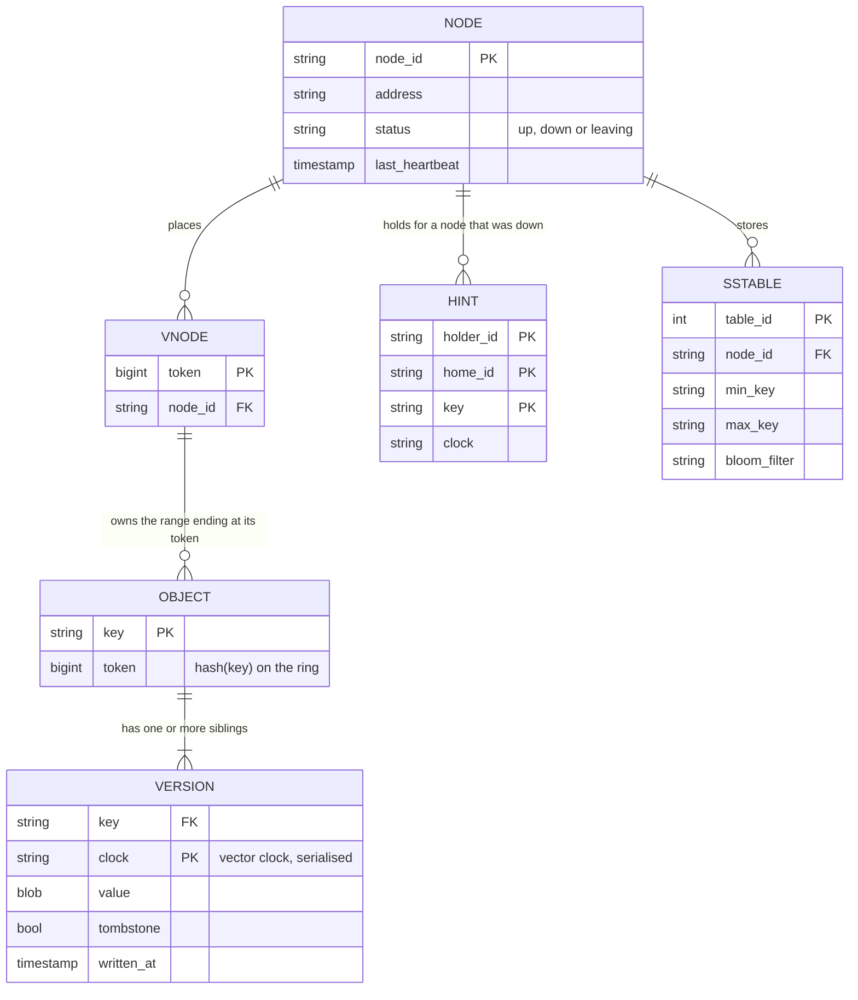
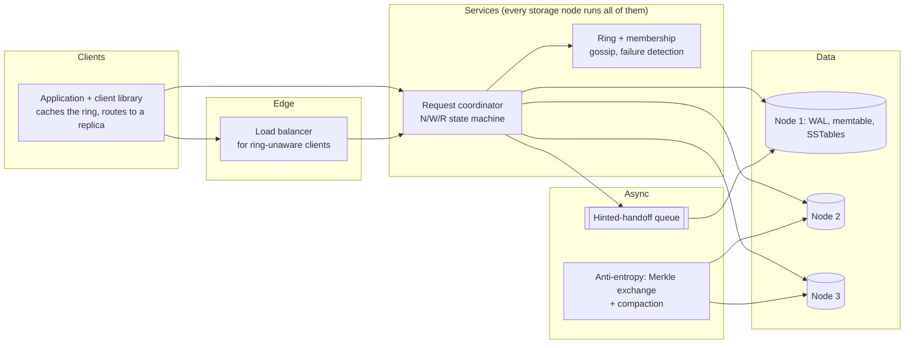
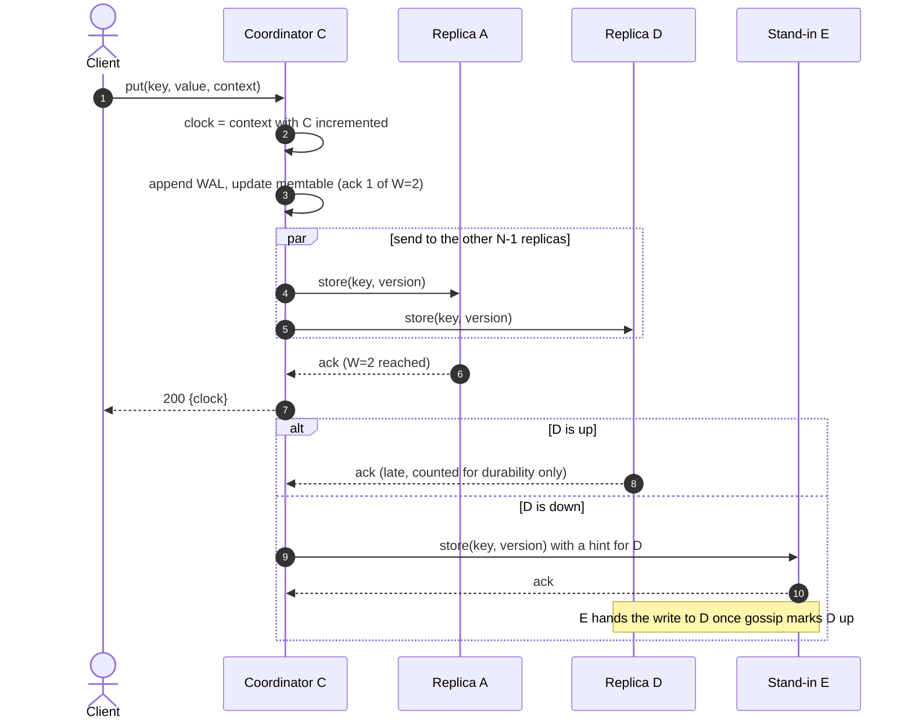
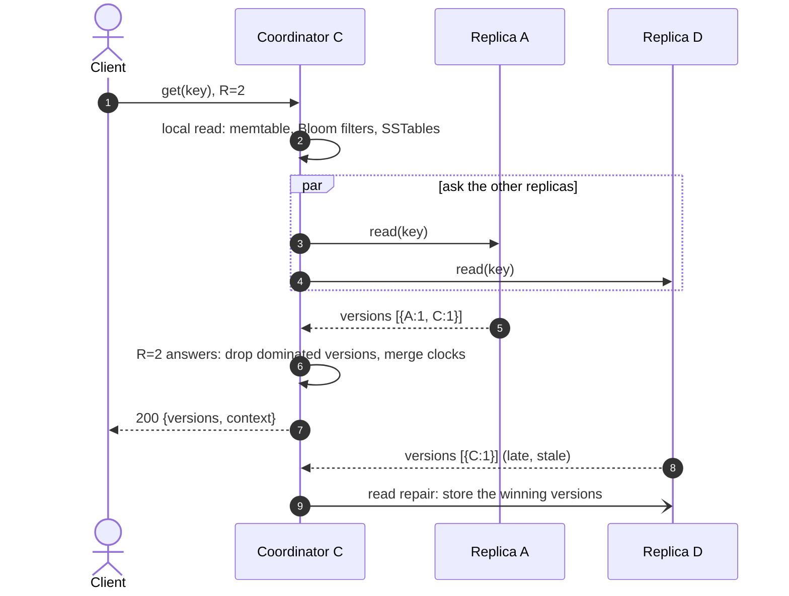
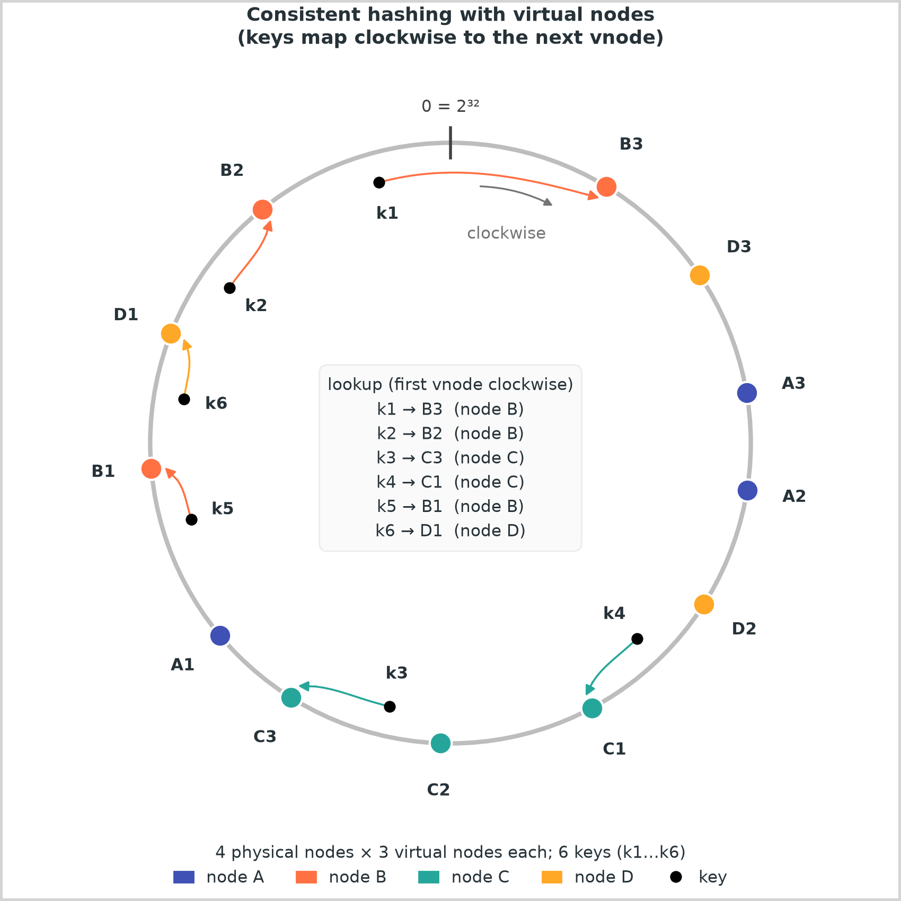
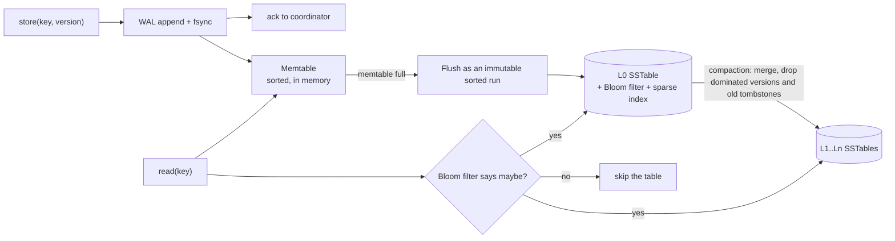
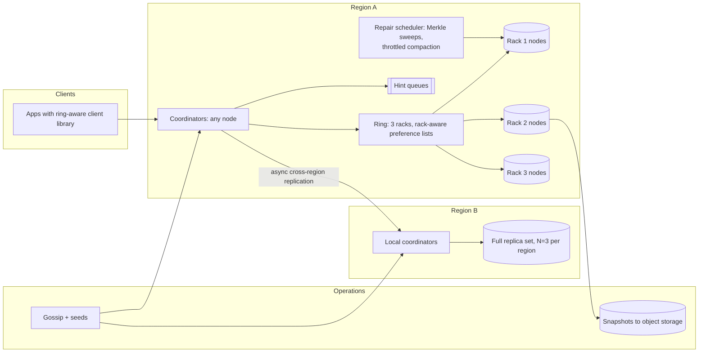

# Design a Dynamo-style key-value store

## TL;DR

- A Dynamo-style store is a **leaderless, partitioned, replicated hash table**: every key hashes to a ring position, lives on the next N distinct nodes (its preference list), and any of them can coordinate a request. Availability wins over consistency — the store stays writable through failures and partitions, and conflicts are resolved afterwards.
- The cruxes an interviewer probes: (1) **consistent hashing with virtual nodes and preference lists**, (2) **tunable N/W/R quorums**, (3) **versioning** with vector clocks or last-writer-wins plus read repair, (4) **failure handling** with gossip, sloppy quorums, hinted handoff and Merkle anti-entropy, (5) the **node write path** from WAL to memtable to SSTable.
- The design below serves 1B keys at 100k reads/s and 10k writes/s on ~30 commodity nodes, N=3, W=2, R=2, p99 read under 10 ms.

## Problem statement and clarifying questions

"Design a key-value store in the style of Amazon Dynamo, Cassandra or Riak: `put(key, value)` and `get(key)` over opaque keys, horizontally scalable, and available for writes while nodes are down." The answers decide two forks: CP or AP under a partition, and whether the server or the application resolves conflicts.

| Question | Assumption taken |
|---|---|
| Availability or consistency under a partition? | Availability: a cart must accept "add item" during an outage and reconcile later. Consistency is tunable per request via W and R. |
| Value size and shape? | Opaque blobs, ~1 KB median, 1 MB maximum; no secondary indexes, no range scans. |
| Scale? | 1B keys, 10B reads/day, 1B writes/day (a 10:1 read/write ratio). |
| Latency target? | p99 read < 10 ms, p99 write < 20 ms inside one region. |
| Durability? | An acknowledged write is on at least two nodes' write-ahead logs; N=3 copies on distinct, rack-aware nodes. |
| Who resolves conflicting writes? | The application merges concurrent versions (siblings); last-writer-wins is opt-in per keyspace. |
| Multi-datacenter? | Single region first; multi-region replication is a v2 step. |
| Membership changes? | Explicit: an operator adds or removes nodes; failures are detected automatically. |
| Transactions or multi-key operations? | No. Single-key operations only; a batch get is a convenience fan-out. |

## Requirements

### Functional

- `put(key, value, context)` writes a value; `get(key)` returns every concurrent version plus an opaque context; `delete(key)` writes a tombstone.
- Any replica of a key accepts reads and writes; there is no leader to wait for.
- Per-request tunable consistency: the client chooses W and R within N.
- Nodes join or leave without downtime; only ~1/N of the keys move.

### Non-functional

- Availability: 99.99% for writes ("always writable"), including with one node down or one rack partitioned away.
- Latency: p99 read < 10 ms and write < 20 ms in-region.
- Durability: N=3, W=2 by default; an acknowledged write has been appended and fsync-ed to two write-ahead logs.
- Scale: 1B keys x 1 KB = 1 TB logical, 3 TB raw; 100k reads/s and 10k writes/s average, 3x at peak.
- Consistency: eventual by default; W + R > N gives a reader the latest acknowledged write when every replica is reachable (sloppy quorums weaken this; deep dive 4).

### Out of scope

Multi-key transactions, secondary indexes, range queries, a query language, authentication and encryption, cross-region conflict policies beyond "same rules as in-region".

## Estimation

Using the [latency and estimation tables](../../cheatsheets/latency-and-estimation.md) (a day is ~10^5 s, peak is 3x average):

| Quantity | Arithmetic | Result |
|---|---|---|
| Read QPS | 10B reads/day / 10^5 s | 100k/s average, 300k/s peak |
| Write QPS | 1B writes/day / 10^5 s | 10k/s average, 30k/s peak |
| Replica operations at peak | 30k writes x N=3; 300k reads x R=2 | 90k replica writes/s, 600k replica reads/s |
| Dataset | 1B keys x 1 KB (key, value, clock) | 1 TB logical, x3 replicas = 3 TB raw |
| Storage growth per year | 0.1% of writes create keys: 1M/day x 1 KB x 365 | ~0.4 TB/year logical, ~1.1 TB/year raw: the 1 TB dataset grows about a third per year |
| Bandwidth | 300k reads/s x 1 KB = 300 MB/s; 30k writes/s x 1 KB x 3 = 90 MB/s internal | 2.4 Gbps, well inside a 10 Gbps NIC per node |
| Hot set (80/20 rule) | 20% of 1B keys x 1 KB | 200 GB, ~7 GB per node of 30: row cache plus page cache, no separate cache tier |
| Nodes | 90k replica writes/s at ~5k-10k per node = 9-18; x1.5-2 headroom | ~30 nodes, ~100 GB each (disk is not the constraint; write throughput is) |

Two things to say out loud. The dataset is small but the operation rate is high, so the cluster is sized by **replica operations per second**, not by disk: each client write is N replica writes and each read is R replica reads. And the latency target is a tail-behaviour target — a quorum read finishes when the second-fastest of three replicas answers, which is why coordinators send to all N and wait for R.

## API design

| Endpoint | Request | Response | Notes |
|---|---|---|---|
| `GET /v1/keys/{key}?r=2` | — | `200 {versions: [{value, clock}], context}` | Returns every sibling; `context` is an opaque base64 vector clock. `404` when only tombstones remain. |
| `PUT /v1/keys/{key}?w=2` | `{value}` + header `X-Context` | `200 {clock, acked_by}` | With a context the write supersedes what that read saw; without one it is blind and may create a sibling. Retrying with the same context supersedes the first attempt, so retries are safe. |
| `DELETE /v1/keys/{key}` | header `X-Context` | `204` | Tombstone: replicates like any version, garbage-collected after a grace period. |
| `POST /v1/keys:batch-get` | `{keys: [..]}` (up to 100) | `200 {items}` | Fan-out per key; no atomicity across keys. No pagination: there are no scans. |
| `GET /v1/admin/ring` | — | `200 {version, nodes: [{id, tokens, status}]}` | Clients cache the ring and route straight to a replica, saving a hop (~500 µs in-datacenter). |
| `POST /v1/admin/nodes` | `{node_id, address}` | `202` | Membership change, propagated by gossip; the node streams in its ranges before serving. |

`r` and `w` are bounded by N; the coordinator rejects combinations it cannot satisfy with healthy replicas (`503`) rather than silently lowering them.

## Data model

**The store is its own database; this is the metadata each node keeps about keys, replicas and repairs.**



Store choices, one sentence each:

- **Partition key** is `hash(key)`: the token decides the preference list, and nothing else is ever queried, so there is no sort key and no secondary index.
- **Per-node engine** is an LSM tree (RocksDB/LevelDB style): writes are appends, reads check the memtable, then Bloom filters, then at most one block per SSTable (deep dive 5).
- **Siblings** are stored under one key as a list of `(clock, value)` pairs; a read returns them all and the client's next write collapses them.
- **Hints** live in a separate column family keyed by `(home node, key)` so a recovered node's backlog streams without scanning the data files.
- **Membership and tokens** are a small gossip-replicated table; every node holds the full ring, which is why any node can coordinate any request.

## High-level design

**v1: symmetric nodes, a ring-aware client library, and background repair machinery.**



**Write path: the coordinator stamps a clock, writes locally, and acknowledges at W.**



**Read path: merge R answers by clock, return siblings and a context, repair the stale replica.**



Walk-through: the coordinator is whichever replica the client library picked, not a special node, so there is no leader to elect and no single point to overload. A write costs one local WAL append plus one parallel round trip, answered at the W-th acknowledgement; a read costs the same round trip plus a comparison of vector clocks, not a merge of values. Everything slower — hint handoff, Merkle comparisons, compaction — runs off the request path.

## Deep dive: consistent hashing and preference lists

The probing question is "which nodes hold a key, and what moves when you add a node?"

| Scheme | Lookup | Keys moved on +1 node | Balance | Problem |
|---|---|---|---|---|
| `hash(key) mod N` | O(1) | ~N/(N+1), almost everything | Good | Adding a node reshuffles the cluster |
| Range partitioning | O(log ranges) | Only the split range | Needs rebalancing | Hot ranges; sequential keys land on one node |
| Consistent-hash ring, one point per node | O(log N) | ~1/N | Poor: some own 2x the average arc | A removed node dumps its arc on one successor |
| Ring with virtual nodes | O(log V) | ~1/N, spread over all nodes | Good with ~100 points per node | The chosen design |

{ width="800" }

Every node takes ~100 pseudo-random tokens on a 2^32 ring; a key belongs to the first token clockwise from `hash(key)`. Virtual nodes even out load and spread a departing node's arcs over many successors, and a box with twice the disk takes twice the tokens — mechanics and measurements on the [partitioning page](../fundamentals/partitioning-and-consistent-hashing.md).

Specific to this store is the **preference list**: the walk continued to the first N *distinct physical* nodes. Skipping further tokens of a node already chosen is the detail candidates forget — without it two of three replicas sit on one machine. Production rings also skip same-rack nodes and run to N + 2, so a coordinator always has healthy fallbacks. The ring hash must be stable across processes and languages, since every client computes it; a salted `hash()` is the wrong tool.

```python
ring = HashRing(["A", "B", "C", "D", "E"], vnodes=64)
ring.get_node("cart:42")  # the owner: first token clockwise from hash(key)
ring.preference_list("cart:42", replicas=3)  # the N distinct nodes holding the replicas
```

Say the numbers: a sixth node on a five-node ring moves ~1/6 of the keys, all *onto* the new node; `mod N` would move ~5/6.

## Deep dive: tunable N/W/R quorums

The probing question is "what do W and R buy me, and what does W + R > N actually guarantee?"

| Setting | Write latency | Read latency | What you get | Typical use |
|---|---|---|---|---|
| N=3, W=1, R=1 | Fastest | Fastest | Stale reads likely; one replica holds the only copy until replication catches up | Caches, counters you can lose |
| N=3, W=2, R=2 | One round trip, second-fastest ack | Same | Every read quorum overlaps every write quorum: the latest acknowledged write is in the answer set | The default |
| N=3, W=3, R=1 | Slowest, fails if any replica is down | Fastest | Read-heavy keys; writes stall on one slow replica | Configuration data |
| N=3, W=1, R=3 | Fastest | Slowest, fails if any replica is down | Write-heavy keys | Event ingestion |

The overlap argument is the whole point: with W + R > N the write quorum and the read quorum share at least one node, so the newest version is among the R answers and the clock comparison picks it out. With W + R <= N a reader can contact only replicas that missed the write — the stale-read demo on the [replication page](../fundamentals/replication.md).

Three nuances worth volunteering:

- **The coordinator sends to all N and waits for W (or R).** Tail latency becomes a race the slowest replica loses, which is why a compaction pause rarely shows up in the p99 — at the cost of N replica operations per request, the number that sized the cluster.
- **W + R > N is not linearizability.** Two clients can write concurrently and both succeed: the store records both rather than ordering them (deep dive 3). A sloppy quorum (deep dive 4) can also acknowledge on a stand-in that a later read quorum never contacts, so under failure the guarantee degrades to "eventually".
- **Durability is W, not N.** W=2 means two WALs have the write when the client hears "ok"; the third copy arrives asynchronously, via the late acknowledgement or a hint.

Latency budget for the default: a write is one fsync-ed WAL append plus one same-datacenter round trip (~500 µs) for the second acknowledgement, well inside 20 ms; a read adds ~16 µs of SSD per SSTable consulted. The p99 goes on queueing and on the slowest of two replicas, not on disk. `KVCluster.overlapping` exposes the `quorum_overlaps` check so a test can assert that a W=1, R=1 cluster is knowingly non-overlapping.

## Deep dive: versioning with vector clocks and read repair

The probing question is "two clients update the same cart while a node is down; what does the next reader see?"

| Strategy | Concurrent writes | Clock skew | Metadata per version | Burden |
|---|---|---|---|---|
| Last-writer-wins (wall-clock timestamp) | One silently lost | A fast clock wins every conflict for hours | 8 B | None on the application, hidden data loss |
| Vector clocks (per-coordinator counters) | Both kept as siblings | Immune | A few (node, counter) pairs | Application must merge siblings |
| CRDTs (merge is a property of the type) | Merged deterministically | Immune | Type-dependent | Only for data with a natural merge (sets, counters) |

Choose vector clocks where a lost update matters (carts, profiles) and offer last-writer-wins per keyspace where it does not (metrics, session heartbeats). Cassandra chose LWW for simplicity; Dynamo and Riak chose clocks. Name the trade rather than picking a side by reflex.

How the clocks work: every version is stamped `{coordinator: counter, ...}`, and a coordinator stamps a write by incrementing its own counter in the context the client sent. If clock A has every counter of B at least as high, A *descends from* B and B is dropped; if neither descends from the other, the writes were concurrent and both survive as siblings. A read returns all siblings plus their merged clock as the context, and a write carrying that context descends from every sibling and collapses them — in the demo `{A:1, C:1}` and `{C:1, D:1}` become one version once a client writes back with `{A:1, C:1, D:1}`.

```python title="code/hld/kv_cluster.py — clocks, versions and reconciliation"
--8<-- "code/hld/kv_cluster.py:vector_clock"
```

**Read repair** is the cheap half of anti-entropy: when one of the R replicas returns a dominated version or nothing, the coordinator writes the winners back to it after answering the client. Hot keys converge on their own; only cold keys need the Merkle sweep of deep dive 4. Two details to mention: clocks are truncated (Dynamo keeps the ten newest entries, bounding metadata at the price of false siblings), and a coordinator bumps its counter past any it already holds for the key, so a blind write is never dominated by a version it stores.

## Deep dive: failure handling with gossip, sloppy quorums, hinted handoff and anti-entropy

The probing question is "a node dies mid-afternoon; walk me through the next hour."

| Mechanism | Detects or fixes | Time scale | Cost |
|---|---|---|---|
| Gossip + failure detector | Who is up, who owns which tokens | Seconds | O(log N) rounds to converge, a few messages per node per second |
| Sloppy quorum | Keeps writes flowing while a home replica is down | Immediate | Writes land on a stand-in outside the preference list |
| Hinted handoff | Returns stand-in writes to the home replica | Minutes, when the node returns | Hint storage on the stand-in; bounded by a hint TTL |
| Read repair | Stale replicas of hot keys | On the next read | One extra write per stale answer |
| Merkle anti-entropy | Cold keys whose hints were lost or expired | Hours, scheduled | Hash comparisons proportional to the differences, not to the data |

The sequence is this. **Gossip** spreads membership and liveness: each node exchanges its view with a random peer, and a silent node is marked suspect locally rather than removed from the ring, because a transient failure must not trigger a rebalance. A coordinator that finds home replica D down writes instead to the **next healthy node past the preference list** (E), which stores the version plus a **hint** naming D — the write still reaches W nodes, so the client is never refused. That **sloppy quorum** is why the deep dive 2 guarantee weakens under failure. When gossip reports D back, E streams the hinted versions to D and drops its copy (**hinted handoff**); if E dies first the hint is lost, and the scheduled **anti-entropy** job compares Merkle trees of the range A and D share, descending only into subtrees whose hashes differ. The demo finds one lost update among 200 keys with 13 hash comparisons.

The cluster class ties the pieces together: `put` resolves home replicas to healthy holders, stamps the clock, and records hints; `recover` hands them off; `anti_entropy` repairs what the hints missed:

```python title="code/hld/kv_cluster.py — the cluster"
--8<-- "code/hld/kv_cluster.py:cluster"
```

Running `python -m hld.kv_cluster` prints the whole story:

```text
5 nodes x 64 vnodes, N=3 W=2 R=2 (overlapping=True); cart:42 lives on ['C', 'A', 'D']
put 'apple', no context            -> clock {C:1}, stored on ['C', 'A', 'D']
get                                -> ['apple'] context {C:1}
two writes from {C:1} via A and D  -> clocks {A:1, C:1} and {C:1, D:1}
get                                -> siblings ['apple,bread', 'apple,milk'] context {A:1, C:1, D:1}
client merges, writes with context -> clock {A:1, C:2, D:1}; get -> ['apple,bread,milk']
C down, put                        -> acks ['E', 'A', 'D']; E keeps a hint for C
get while C is down                -> ['apple,bread,milk,eggs'] answered by ['E', 'A']
C recovers                         -> 1 hinted write handed off, copies on ['A', 'C', 'D']
strict quorum, C and A down        -> write of 'cart:42': only 1 replica(s) reachable, needed W=2
anti-entropy A vs D, lost hint     -> 1 bucket differs after 13 hash comparisons, compared ['item:164', 'item:7']; D now holds 'v7-updated'
```

Permanent removal is an operator action: the leaving node's successors stream its arcs from the remaining replicas, bounded work because virtual nodes scatter the arcs.

## Deep dive: the node write path from WAL to memtable to SSTable

The probing question is "what happens inside one replica when it receives `store(key, version)`, and why is it fast?"

| Engine | Write cost | Point read cost | Fits because |
|---|---|---|---|
| B-tree (update in place) | Random write per update, page splits | One tree descent | Read-heavy, range-heavy workloads |
| LSM tree (append, then merge) | Sequential append + deferred compaction | Memtable, then Bloom-filtered SSTables | Write-heavy, point-lookup workloads: this store |
| Hash index in memory + log | Append | One hash lookup | Dataset fits in RAM per node (Bitcask, Riak's default) |

**Inside one replica: append, buffer, flush, compact; reads skip tables via Bloom filters.**



The write is acknowledged as soon as the WAL append is durable — one sequential write, no seek — so a replica write costs microseconds of CPU plus the fsync. The memtable is sorted in memory (a skip list in RocksDB), so a flush streams entries in key order; flushed SSTables are immutable, which is why readers need no locks and why a whole table can be shipped when a node streams a range to a new member. Reads check the memtable, then each SSTable's Bloom filter — at ~10 bits per key it says "definitely absent" for ~99% of the tables that lack the key — and the sparse index turns what remains into one block read (~16 µs of SSD). Compaction merges tables in the background, keeps the newest siblings and drops tombstones past the grace period; it is also the likeliest thief of read IO, which is why coordinators wait for the fastest R replicas.

Write `WAL -> memtable -> SSTable (Bloom + index) -> compaction` on the whiteboard and say "durability from the WAL, read speed from Bloom filters, write amplification as the bill". The measured amplification numbers are on the [storage engines page](../fundamentals/storage-engines-and-indexing.md).

## Scaling, bottlenecks and failure modes

**v2: rack-aware replicas, a second region, and repair work isolated from the request path.**



What breaks first, and what you do about it:

- **Hot keys.** A single viral key lands on exactly N nodes no matter how large the cluster is. Mitigations: a read cache in front of those keys, key salting for write-hot counters (`key#0..key#9`, merged on read), and moving the key's tokens to less loaded nodes. Consistent hashing spreads keys, not popularity.
- **Tail latency.** One replica in a long compaction or GC pause slows every quorum it belongs to. Sending to all N and waiting for R hides it; speculative retries after a p99 timeout hide the rest; throttling compaction protects the foreground.
- **Sibling explosion.** A client that keeps writing without a context creates siblings faster than anyone merges them; cap siblings per key, alert on it, and fix the client. Truncated clocks can also create false siblings.
- **Tombstone and hint accumulation.** Deletes are writes; a key range with many deletes becomes slow to read until compaction purges tombstones past the grace period. Hints expire after a TTL so a node that is down for days is repaired by anti-entropy instead of by a flood on its return.
- **Membership churn.** A flapping node triggers repeated hint storms and repairs; gossip marks it suspect and leaves the ring alone until an operator decides. Split-brain between two halves of a cluster still accepts writes on both sides, which is the AP promise; the cost is more siblings to merge afterwards.
- **Cross-region.** Replicate asynchronously with N=3 per region and local quorums (`LOCAL_QUORUM` in Cassandra terms), because a cross-region round trip (~70-150 ms) inside every write would blow the 20 ms budget. Conflicts between regions are ordinary siblings.
- **Rebalancing cost.** Adding a node streams ~1/N of the data; throttle the stream and let the new node serve reads only once its ranges are complete, otherwise it answers with gaps that look like deletes.

## Trade-offs summary

| Decision | Chosen | Alternatives | Why |
|---|---|---|---|
| Topology | Leaderless, any replica coordinates | Single leader per partition (Raft, Bigtable) | Always writable; no failover pause; the price is conflict resolution |
| Partitioning | Consistent hashing with virtual nodes | Range partitioning, hash mod N | ~1/N keys move on membership change, spread across all nodes |
| Replica placement | Preference list of N distinct, rack-aware nodes | Next N tokens | Two replicas on one machine or rack is one failure, not two |
| Consistency knob | Tunable W and R per request, default 2/2 of 3 | Fixed strong or fixed eventual | Overlapping quorums where it matters, speed where it does not |
| Versioning | Vector clocks with client-side merge; LWW opt-in | LWW everywhere | LWW silently loses concurrent updates and trusts clocks |
| Availability under failure | Sloppy quorum + hinted handoff | Strict quorum (refuse writes) | Writes continue through a node outage; the hint repays the debt |
| Repair | Read repair + scheduled Merkle anti-entropy | Full replica comparison | Cost proportional to differences, not to data size |
| Storage engine | LSM tree per node | B-tree | Append-only writes, Bloom-filtered point reads |

## Interviewer follow-ups

??? question "Why not pick a leader per partition and avoid conflicts entirely?"
    A leader gives you a total order per key and no siblings, but every leader failure costs an election or failover window during which that partition refuses writes. Dynamo's requirement was that a cart write never fails, so it accepted conflicts as the price. Say which requirement you are optimising for; both designs are correct for different products.

??? question "What exactly goes wrong with last-writer-wins?"
    Two concurrent writes produce one survivor chosen by timestamp, so the other update is silently discarded. Worse, clocks drift: a node whose clock runs fast wins every conflict until it is fixed, and a write can be "older" than the version it was based on. It is acceptable for data where the latest observation is all you want (a sensor reading), and dangerous for anything accumulated (a cart, a counter).

??? question "How do you keep vector clocks from growing without bound?"
    Entries are per coordinator, so a clock has at most as many entries as nodes that ever coordinated the key; Dynamo truncates to the ten most recent entries by timestamp. Truncation can make a descended version look concurrent, which creates a spurious sibling that the next reconciling write removes. Riak's dotted version vectors also fix the case of two stale writes through the same coordinator.

??? question "Is W + R > N strong consistency?"
    No. It guarantees a reader sees the latest *acknowledged* write when the quorums are drawn from the home replicas. It does not order concurrent writes, and a sloppy quorum can acknowledge on a stand-in that a later read quorum does not contact. For linearizable operations you need a leader or consensus per key, which is a different system.

??? question "How does a new node join without downtime?"
    The operator adds it with a set of tokens; gossip spreads the new ring; for each token the new node streams the key range from the current replicas while they keep serving; once the stream completes the new node starts answering reads. Only ~1/N of the data moves, and it comes from many nodes because virtual nodes scatter the arcs.

??? question "How would you add range queries or secondary indexes?"
    Range queries need order-preserving partitioning, which trades the even spread of hashing for hot ranges; Cassandra's answer is a hashed partition key plus a clustering key that is sorted *within* the partition. Secondary indexes are either local (each node indexes its own data, queries fan out to every node) or global (an index table partitioned by the indexed value, updated asynchronously, eventually consistent).

??? question "Where do the Bloom filters live and what do they cost?"
    One filter per SSTable, held in memory. At ~10 bits per key, the ~100M key copies each of the 30 nodes stores cost ~125 MB per node, trivial next to the row cache. They let a point read skip almost every table, so the read touches one block in one table in the common case instead of one block per table.

!!! tip "Interview tip"
    Say "preference list" in your first sentence about replication and draw the ring with the N distinct nodes marked. It tells the interviewer you know the replicas are not "the next N tokens", and it sets up every later answer: sloppy quorums write to the node after the list, hints name a node in the list, anti-entropy compares nodes that share a list.

!!! warning "Common mistake"
    Claiming that W + R > N makes the store strongly consistent. It makes a read see the latest acknowledged write under normal operation, nothing more: concurrent writes still produce siblings, and sloppy quorums break the overlap during failures. Interviewers who hear "strongly consistent" will ask about two concurrent writers next, and the design has no answer unless you have already introduced versioning.

## 45-minute pacing

| Minutes | What to say and draw |
|---|---|
| 0–5 | Clarify: AP over CP, opaque ~1 KB values, 1B keys, 10:1 reads, single region first, application merges conflicts. |
| 5–9 | Estimation: 100k reads/s, 10k writes/s, 3 TB raw, 90k replica writes/s at peak, ~30 nodes. State "sized by replica ops, not by disk". |
| 9–14 | API (get returns siblings + context, put takes context, delete is a tombstone) and the per-node data model with hints and SSTables. |
| 14–24 | v1 diagram: symmetric nodes, client library, coordinator; narrate the write path (clock, WAL, W acks) and the read path (R answers, reconcile, repair). |
| 24–40 | Deep dives in this order: ring + preference lists, N/W/R overlap, vector clocks vs LWW, then the failure hour (gossip, sloppy quorum, hints, Merkle); LSM write path if asked how a node is fast. |
| 40–45 | Bottlenecks (hot keys, tail latency, sibling and tombstone growth), multi-region with local quorums, and the trade-offs table. |

## Related

- [Partitioning, sharding and consistent hashing](../fundamentals/partitioning-and-consistent-hashing.md) — the `HashRing` the cluster is built on, with key-movement measurements
- [Replication](../fundamentals/replication.md) — quorum arithmetic, the stale-read demo, Merkle trees
- [Time, clocks and ordering](../fundamentals/time-and-ordering.md) — why wall clocks cannot order concurrent writes
- [Storage engines and indexing](../fundamentals/storage-engines-and-indexing.md) — the LSM tree inside each node, with amplification numbers
- [CAP, PACELC and consistency models](../fundamentals/cap-pacelc-and-consistency-models.md) — where "always writable" sits on the map
- [Classic papers digest](../fundamentals/classic-papers-digest.md) — Dynamo and Cassandra in one page each
- Primary sources: DeCandia et al., "Dynamo: Amazon's Highly Available Key-value Store" (SOSP 2007); Lakshman and Malik, "Cassandra: A Decentralized Structured Storage System" (2010); Preguiça et al., "Dotted Version Vectors: Logical Clocks for Optimistic Replication" (2010)
