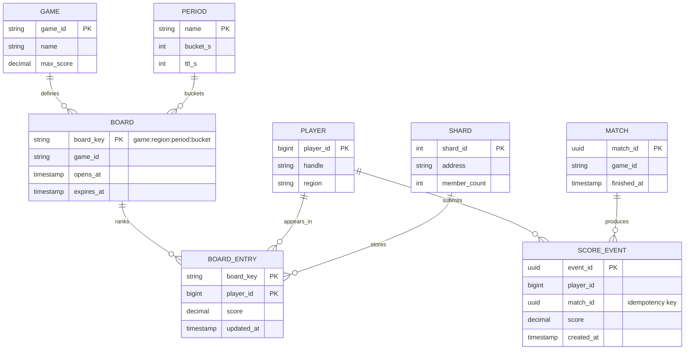
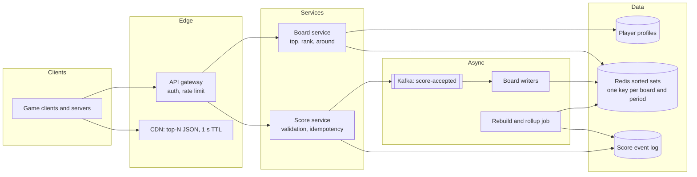
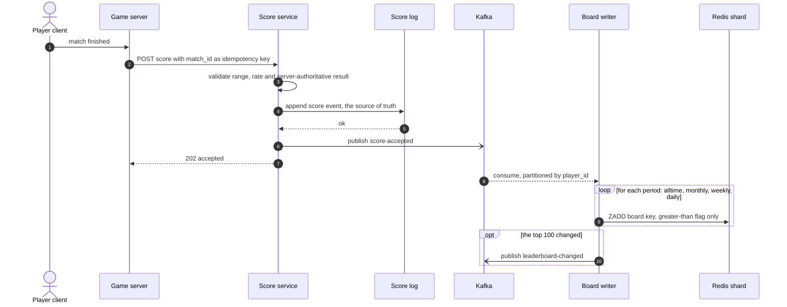
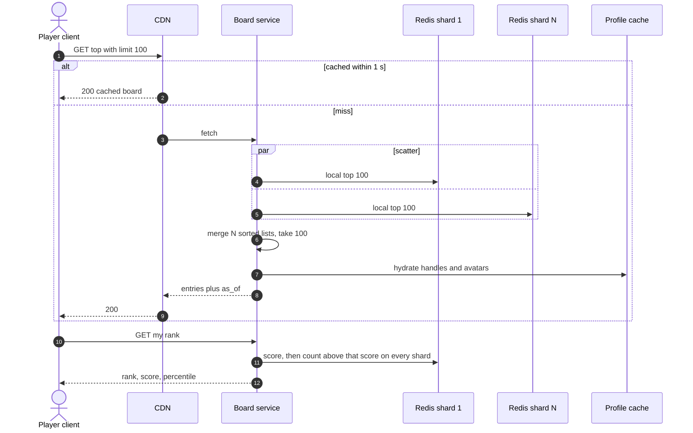
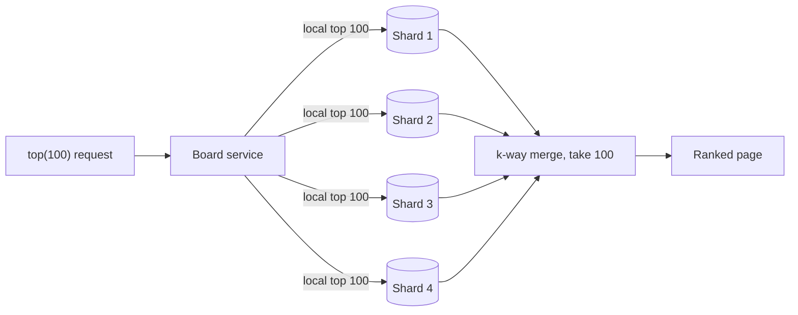
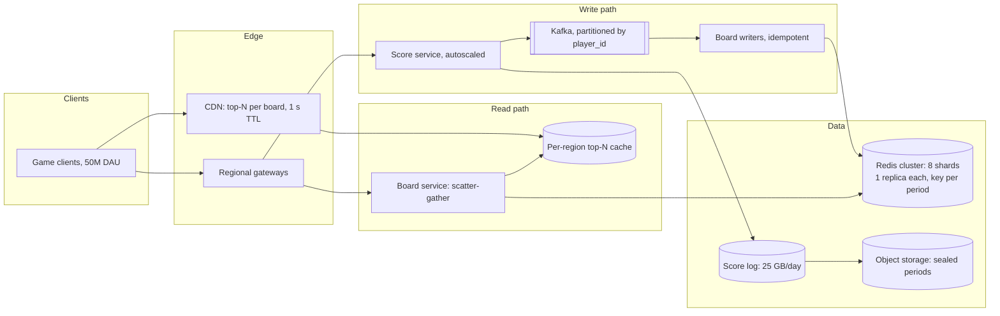

# Design a real-time gaming leaderboard

## TL;DR

- A leaderboard is a **ranking problem, not a storage problem**: 500M score submissions a day fit in ~50 GB of sorted sets, and the hard part is answering "what is my rank" in O(log n) instead of O(n).
- The cruxes: (1) the **sorted set** and the complexity of each operation, (2) **sharding beyond one node** — by member with scatter-gather, or by score range, (3) **real-time updates** without pushing per-user ranks, (4) **periodic boards** as separate keys with a TTL, plus tie-breaking, validation and rebuild.
- The global top 100 is one 5 KB object cached for a second; the per-player rank is the query that actually costs money.

## Problem statement and clarifying questions

"Design a leaderboard for a game: the global top 100, plus each player's own rank and the players around them." The interesting question is not where scores live — it is which read you must serve, because the top 100 is trivially cacheable and "my rank" is not.

| Question | Assumption taken |
|---|---|
| Scale? | 50M DAU, 10 matches per player per day, 500M registered accounts. |
| Which reads? | Global top 100, a player's own rank and score, and the 5 players either side of them. |
| Which boards? | All-time, monthly, weekly and daily, each also per region. |
| Score semantics? | A player's *best* score in the period, not a running sum. |
| How fresh must the board be? | Sub-second for the player's own rank; one second of staleness on the global top is fine. |
| Are ties possible? | Constantly — round numbers cluster. Break them deterministically by player id. |
| Can clients submit scores? | No. The game server submits, with the match id as an idempotency key. |
| Is losing the board acceptable? | Losing the *board* yes, losing the *scores* no: the score log is the system of record. |

## Requirements

### Functional

- Submit a score for a match; keep the best score per player per period.
- Return the top N (up to 1,000) for any board and period, with rank, player and score.
- Return one player's rank, score and percentile, plus the window of players around them.
- Paginate deep into the board without offset arithmetic.
- Expire closed periods automatically and rebuild any board from the score log.

### Non-functional

- Scale: ~15k submissions/s and ~30k board reads/s at peak; 500M members on the all-time board.
- Latency: p99 under 100 ms for rank and top-N; a score is reflected within 1 s.
- Consistency: read-your-writes for the submitting player; a second of staleness for everyone else.
- Durability: a score is durable before the API acknowledges. The sorted sets are a derived, rebuildable index.
- Availability: 99.9% for reads; serve the last cached top-N during a shard failure rather than an error.
- Fairness: an impossible score is rejected at write time, not curated afterwards.

### Out of scope

Matchmaking and skill rating (Elo/TrueSkill), the anti-cheat model itself, rewards, social features, and the game servers.

## Estimation

From the [latency and estimation tables](../../cheatsheets/latency-and-estimation.md): a day is ~10^5 s, peak is 3x average, a UUID is 16 B, a `long` is 8 B, and a single-threaded Redis instance sustains ~100k ops/s.

| Quantity | Arithmetic | Result |
|---|---|---|
| Write QPS | 50M DAU x 10 matches / 10^5 | ~5k/s average, ~15k/s peak |
| Read QPS | 50M DAU x 20 board views / 10^5 | ~10k/s average, ~30k/s peak |
| Entry size | 16 B member + 8 B score = 24 B payload, ~4x for skip-list pointers and the hash entry | ~100 B per member |
| All-time board | 500M members x 100 B | ~50 GB — one large node holds it |
| All boards | 50 GB + 3 shorter periods holding only the 50M who played (~5 GB each) | ~65 GB, ~130 GB with one replica |
| Redis ops | 15k writes x 4 period keys + 30k reads | ~90k ops/s against ~100k/s per instance — **8 shards for headroom** |
| Score log | 500M/day x 50 B (member, score, match id, timestamp) | 25 GB/day, ~9 TB/year, ~27 TB at replication factor 3 |
| Top-N bandwidth | 30k/s x 100 rows x ~50 B | 150 MB/s = 1.2 Gbps before caching |
| Top-N cache | One 5 KB object per board and period, 1 s TTL | ~20 KB of cache absorbs 30k reads/s down to ~1/s |

Say it out loud: **memory is not the constraint, operations are**. 500M players cost 50 GB, which fits on one machine, but 90k ops/s against a single-threaded instance leaves no headroom for a launch spike, so you shard for throughput and blast radius rather than space. And the top-N read collapses to nothing under a one-second cache, because everybody asks for the same 100 rows.

## API design

| Endpoint | Request | Response | Notes |
|---|---|---|---|
| `POST /v1/boards/{board}/scores` | `{player_id, score, match_id}`, header `Idempotency-Key: match_id` | `202 {stored_score, best}` | The game server calls it, never the client. A replay of the same match id is a no-op. |
| `GET /v1/boards/{board}/top?period=daily&limit=100` | — | `200 {entries: [{rank, player_id, score}], as_of}` | Cached 1 s at the edge; `limit` capped at 1,000. `as_of` shows staleness honestly. |
| `GET /v1/boards/{board}/players/{id}?period=daily` | — | `200 {rank, score, percentile}` | Per-player, so it is not shareable cache. This is the expensive read. |
| `GET /v1/boards/{board}/around/{id}?radius=5` | — | `200 {entries}` | The relative board: 11 rows centred on the player, which is what mid-table players look at. |
| `GET /v1/boards/{board}/page?cursor=...&limit=50` | — | `200 {entries, next_cursor}` | The cursor encodes `(score, player_id)`, never an offset: ranks shift under you between pages. |

## Data model

**Scores are events; boards are derived indexes keyed by period.**



- **`BOARD_ENTRY`** lives in Redis sorted sets: key `game:region:period:bucket`, member `player_id`, score `score`. Partition by `crc32(player_id) mod N`; the sort key is the score itself.
- **`SCORE_EVENT`** is the system of record: an append-only log partitioned by `player_id`, with `match_id` unique for idempotency.
- **`PLAYER`** is a normal profile store, read through a cache to hydrate handles and avatars after ranking.
- No relational index serves this well: `ORDER BY score DESC LIMIT 100 OFFSET 5000` scans 5,100 rows per query at 30k QPS, and a covering index still counts rows to produce a rank.

## High-level design

**v1: a score service that validates and durably logs, writers that update the sorted sets, and a board service that reads them.**



**Write path: validate, log durably, acknowledge, then update every period's board.**



**Read path: the shared top-N is a cache hit; the personal rank is a scatter-gather.**



The shape to notice: writes are cheap and single-shard, the shared read caches to almost nothing, and the only genuinely distributed operation is turning a score into a global rank.

## Deep dive: the sorted set and why rank is O(log n)

The probing question is "how do you produce a rank without counting rows?"

| Structure | Insert / update | Rank of a member | Page at offset k |
|---|---|---|---|
| Relational table with an index on score | O(log n) | O(n) — count the rows above | O(k + m) scan |
| Sorted array | O(n) shift | O(log n) binary search | O(m) |
| Balanced BST with subtree sizes | O(log n) | O(log n) | O(log n + m) |
| Skip list with span counters plus a hash map | O(log n) expected | O(log n) | O(log n + m) |

The last two match in complexity; a skip list wins on simplicity, which is why Redis sorted sets use one. The structure is really *two*: a skip list ordered by `(score, member)` and a dict from member to score, so `ZSCORE` is O(1) while `ZREVRANK` is a search.

The trick that makes rank cheap is the **span**: each forward pointer records how many level-0 steps it skips. Summing the spans you traverse during a search yields the rank at no extra cost, and following spans downward lets you jump straight to rank 5,000 rather than walking to it.

```python title="code/hld/leaderboard_sorted_set.py — the skip list"
--8<-- "code/hld/leaderboard_sorted_set.py:skiplist"
```

Two details worth raising unprompted. First, **ties must be broken deterministically**: order by `(score descending, player_id ascending)`. Without a total order, two players on 9,800 points swap places between reads, the client flickers, and a cursor built from the last row of a page can skip or repeat rows. Second, an **update is a delete plus an insert** — the member moves in the ordering — which is why a hot player re-ranking hundreds of times per second is a real write cost and why you use the "only if greater" form of `ZADD` for best-score boards.

## Deep dive: sharding beyond one node

At ~90k ops/s a single instance is at capacity, and one instance is also one failure domain for every board. Two ways to split it:

| Scheme | Write | Top-K read | Rank read | Fails when |
|---|---|---|---|---|
| Partition by member hash | Single shard, O(log n) | Scatter-gather: N local top-Ks merged | Sum of per-shard counts above the score | Every read touches every shard |
| Partition by score range | Single shard, but ranges must be rebalanced | Read the top range only | Count in higher ranges plus a local rank | Scores drift upward, so ranges become hot and need constant splitting |
| One writer, many read replicas | Single node, replicated | Cheap | Cheap | Write ceiling unchanged; replicas serve stale ranks |

**Partition by member hash.** The correctness argument for top-K is short and worth stating: the global top K is a subset of the union of the shards' local top Ks, because a member in the global top K cannot be below rank K inside its own shard. So N lists of K merge into the answer, and the cost is `N x K` entries moved plus a k-way merge. Global rank is the same idea in reverse — each shard answers "how many members do you hold above this score", and the answer is the sum.

**How the fan-out looks.**



Score-range partitioning makes the top-K read trivial but is a trap: scores only rise, so the top range grows without bound and every rebalance moves members. Hash partitioning keeps load even and pays a bounded, parallel fan-out instead.

```python title="code/hld/leaderboard_sorted_set.py — scatter-gather over shards"
--8<-- "code/hld/leaderboard_sorted_set.py:sharded"
```

```text
sharded over 4 shards, members per shard: [0, 2, 3, 5]
scatter-gather top 5:
  #1  hal  9990
  #2  ana  9800
  #3  cy   9800
  #4  eli  8850
  #5  ivy  8100
global rank('ivy') = 4 (sum of per-shard count_above)
relative board around 'ivy': #3 cy, #4 eli, #5 ivy, #6 bo, #7 fin
```

The neighbours query is the subtle one: every global neighbour of a player sits within `radius` positions of that player's split point *inside its own shard*, so one small window per shard is a superset of the answer. Merge the windows and slice around the player.

## Deep dive: real-time rank updates

"Make it live for a million spectators" is where candidates over-engineer. Do the arithmetic first: 1M viewers each receiving a 5 KB board once a second is 5 GB/s, which is a bigger problem than the leaderboard itself.

| Approach | Traffic | Freshness | Use it for |
|---|---|---|---|
| Client polls the cached top-N every second | One CDN hit per client per second, ~0 origin load | 1 s | The default for everybody |
| Server-sent events pushing the whole board on change | Only when the board changes, but full payload | Instant | Esports overlays, a few thousand viewers |
| Pub/sub of *deltas* (rank changes only) | Smallest, but stateful per connection | Instant | The finals of a tournament |
| Push per-player ranks to every player | 50M distinct messages | Instant | Never |

Take the first as the baseline and add SSE only for the small, high-value audience. The board writer publishes `leaderboard-changed` **only when the composition of the top N changes**, which at 15k writes/s is a rare event once the board settles: a submission that leaves a player at rank 40,000 changes nothing anybody is watching.

Per-player rank stays request-response. It cannot be broadcast (50M distinct answers) and it cannot be shared-cached (one value per player), but it is one `ZSCORE` plus N `ZCOUNT`-style calls at O(log n) each, which Redis serves inside the 100 ms budget. The one-second cache TTL on the shared board doubles as a rate limiter: however hard clients poll, the origin sees at most one read per board per second.

For read-your-writes, the submit response carries the new rank computed on the write path, so the player who just finished a match sees it immediately even if the cached board is a second behind.

## Deep dive: periodic boards, persistence and validation

"Where does the daily board come from?" It is not a filter over the all-time board — a sorted set is indexed by score, and no index can answer "scores submitted since midnight". So a daily board is a **different key**, `game:eu:daily:19677`, and each submission writes every period's current key. The write amplification is exactly the number of periods you offer, which is why four periods turn 15k submissions/s into 60k Redis writes/s.

Retirement is a TTL derived from the bucket, not from the last write, so a late submission cannot extend yesterday's board:

```python title="code/hld/leaderboard_sorted_set.py — one board per period, expired by bucket"
--8<-- "code/hld/leaderboard_sorted_set.py:periodic"
```

```text
submit writes keys ['alltime', 'daily:19675']
submit writes keys ['alltime', 'daily:19677']
keys held: ['alltime', 'daily:19675', 'daily:19677']
expire() drops ['daily:19675'], leaving ['alltime', 'daily:19677']
```

**Persistence.** Treat the sorted sets as a rebuildable index and the score log as the system of record. Redis snapshots plus an append-only file shorten recovery, but the guarantee comes from the log: replaying a day is 500M events at 25 GB, a few minutes with pipelined batch writes, and replaying the all-time board is a scheduled job that runs from the columnar archive. Say explicitly that you would accept losing a board and rebuilding it, because that decision is what lets you keep the fast path in memory.

**Validation.** Scores arrive from a game server, never a client, and are checked before they are logged: a finite non-negative value under the game's ceiling, a rate limit per player, and a `match_id` that must be unused. Beyond that, keep suspicious accounts on a shadow board — their scores are recorded but not published — so an investigation never requires deleting rows from a live ranking that other players have already seen.

## Scaling, bottlenecks and failure modes

**v2: a Redis cluster of 8 shards with replicas, a partitioned write path, and regional caches in front of the shared board.**



- **A hot board key.** Sharding spreads members evenly, but the *daily global* board is one logical key read by everyone. The 1 s cache protects it; without it, 30k/s of top-N reads land on the shards.
- **Fan-out amplification.** Every rank read touches all 8 shards, so Redis sees 8x the request rate. Cap `limit`, pipeline the shard calls, and use a per-request deadline so one slow shard cannot hold the fan-out open.
- **Spikes.** A tournament turns 15k writes/s into 100k. Kafka absorbs it and the board lags by seconds, which is the right degradation here.
- **Shard loss.** Promote the replica; meanwhile serve the last cached top-N and mark ranks `approximate`, since the missing shard's members are absent from the count.
- **Rebalancing.** Use consistent hashing with virtual nodes so a resize migrates one slice, and rebuild moved members from the score log rather than migrating live sorted sets.

## Trade-offs summary

| Decision | Chosen | Alternatives | Why |
|---|---|---|---|
| Structure | Skip-list sorted set plus hash map | SQL index; sorted array | O(log n) rank and O(log n + m) deep pages; O(1) score lookup |
| Ordering | Score descending, player id ascending | Score only | Ties are constant; without a total order pages repeat or skip rows |
| Sharding | Hash of the player id | Score ranges | Scores only rise, so ranges become permanently hot |
| Global reads | Scatter-gather with a k-way merge | A single global node | Bounded, parallel, and it survives one node dying |
| Shared board | Cached 1 s at the edge | Live per request | One 5 KB object absorbs 30k reads/s and rate-limits the origin |
| Live updates | Poll the cache, SSE for a small audience | Push per-player ranks | 50M distinct ranks cannot be broadcast |
| Periods | One key per period plus TTL | Filter the all-time board by time | A score-ordered index cannot answer a time predicate |
| Durability | Score log is the source of truth | Redis persistence alone | Boards are derived, so losing one costs a rebuild, not data |

## Interviewer follow-ups

??? question "How do you paginate to rank 500,000?"
    Not with `OFFSET`. Spans let the sorted set jump to a rank in O(log n), so a shard serves "50 rows from rank 500,000" directly. Across shards the cursor is the `(score, player_id)` of the last row, so the next page is "everything strictly after this key" — stable as ranks shift underneath.

??? question "Two players have the same score. Who is first?"
    Whoever the tie-break rule says, and the rule must be part of the sort key. Player id ascending is the cheapest deterministic choice; "who reached the score first" is friendlier, and is implemented by storing a composite score of `score * 2^k - timestamp` so a single float still orders correctly.

??? question "What if a player's rank must reflect their submission instantly?"
    Compute it on the write path and return it in the `202`. The submitting service already knows the new score, so one rank query against the shards gives read-your-writes for the one player who cares, while everyone else reads the cached board.

??? question "How would you support 'top 100 among my friends'?"
    Not from the global board. Fetch the friend ids (a few hundred), read their scores with one batched call per shard, and sort in the service. The board answers "score of these members", which is O(1) per member, instead of trying to rank a subset globally.

??? question "Redis restarts and the board is empty. What happens?"
    Reads degrade to the cached top-N while a rebuild job replays the score log into fresh keys. Because the board is derived, recovery is a throughput problem, not a correctness one: 25 GB replays in minutes with pipelined batches, and the all-time board is seeded from the nightly snapshot.

??? question "How is this different from a top-K heavy hitters service?"
    A leaderboard tracks an *exact, bounded* set of members with an exact score each; heavy hitters approximates counts over an unbounded key space with a sketch. Say which one you have: if a member's score must be exactly right and displayed next to their name, sketches are out.

!!! tip "Interview tip"
    Split the reads in your first sentence: "the global top 100 is one small object that caches for a second, so the design is really about serving 30k per-player rank queries." That immediately separates the easy half from the hard half and takes you straight to sorted sets and scatter-gather.

!!! warning "Common mistake"
    Reaching for `SELECT ... ORDER BY score DESC LIMIT 100 OFFSET n` and moving on. It gives you the top 100 and nothing else: a player's rank costs a count over every row above them, deep pages scan everything they skip, and at 30k QPS the database is the whole design. Name the complexity out loud before you choose the structure.

## 45-minute pacing

| Minutes | What to say and draw |
|---|---|
| 0-5 | Clarify: 50M DAU, best score per period, top 100 plus my rank plus neighbours, ties broken deterministically, server-submitted scores. |
| 5-10 | Estimation: 15k writes/s, 30k reads/s, ~100 B per entry, ~50 GB all-time, ~90k Redis ops/s. State that operations, not memory, force sharding. |
| 10-15 | API (submit with idempotency, top-N, my rank, around, cursor page) and the data model: one sorted-set key per board and period, score log as the record. |
| 15-22 | v1 diagram; narrate the write path (validate, log, ack, then update each period key) and the read path (cached top-N versus scatter-gather rank). |
| 22-35 | Deep dives: sorted set complexity and tie-breaking; sharding by member with scatter-gather versus score ranges, with the top-K correctness argument. |
| 35-41 | Real-time updates without broadcasting ranks; periodic keys with TTL; rebuild from the log; score validation. |
| 41-45 | Bottlenecks (hot board key, 8x fan-out, spikes, shard loss) and the trade-offs table. |

## Related

- [Design a distributed cache](distributed-cache.md) — the cache tier that turns 30k top-N reads/s into one
- [Partitioning, sharding and consistent hashing](../fundamentals/partitioning-and-consistent-hashing.md) — how members are placed and what a resize costs
- [Design a Top-K heavy hitters service](top-k-heavy-hitters.md) — the approximate cousin, and when to prefer it
- [Caching and CDNs](../fundamentals/caching-and-cdn.md) — short-TTL edge caching as a rate limiter
- Primary sources: William Pugh, "Skip Lists: A Probabilistic Alternative to Balanced Trees" (1990); the Redis sorted-set and cluster documentation
