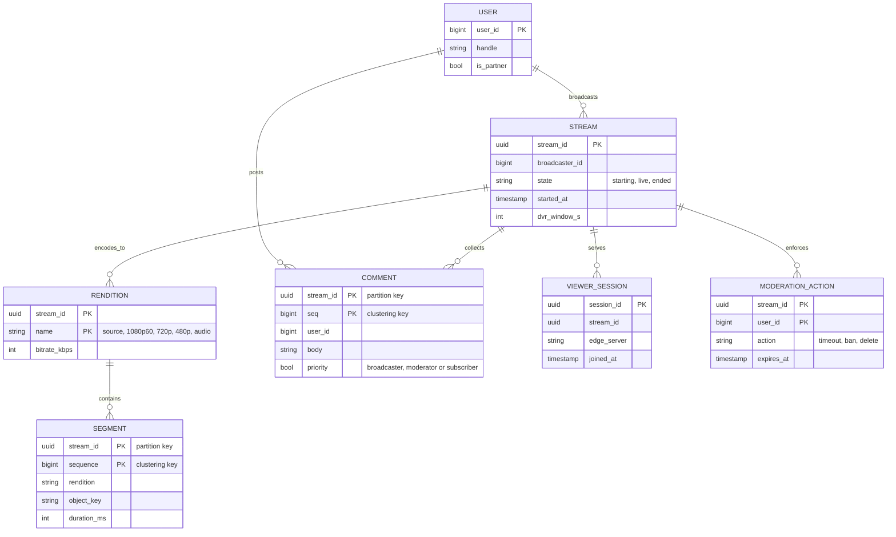
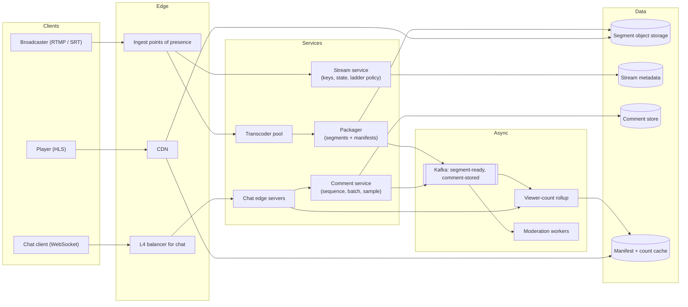
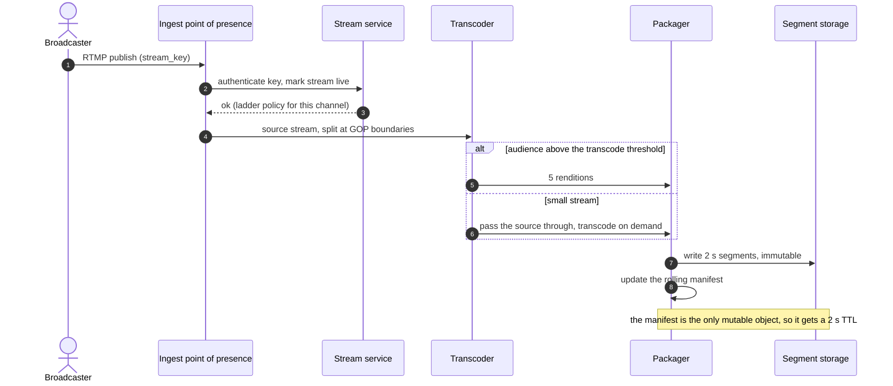
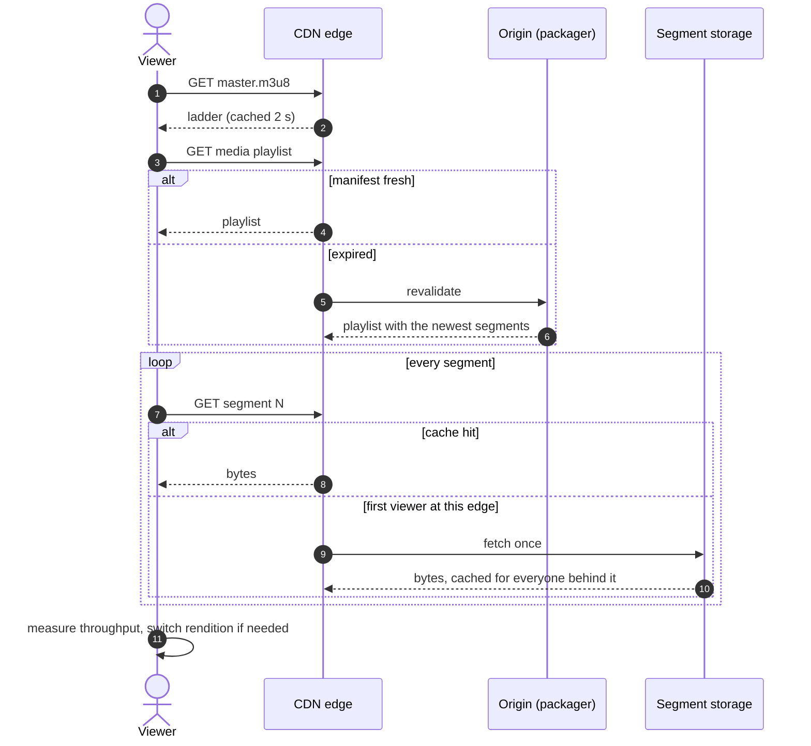
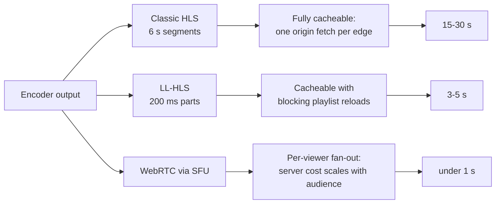
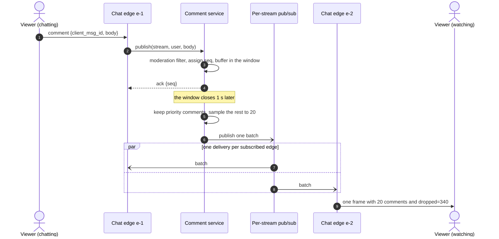
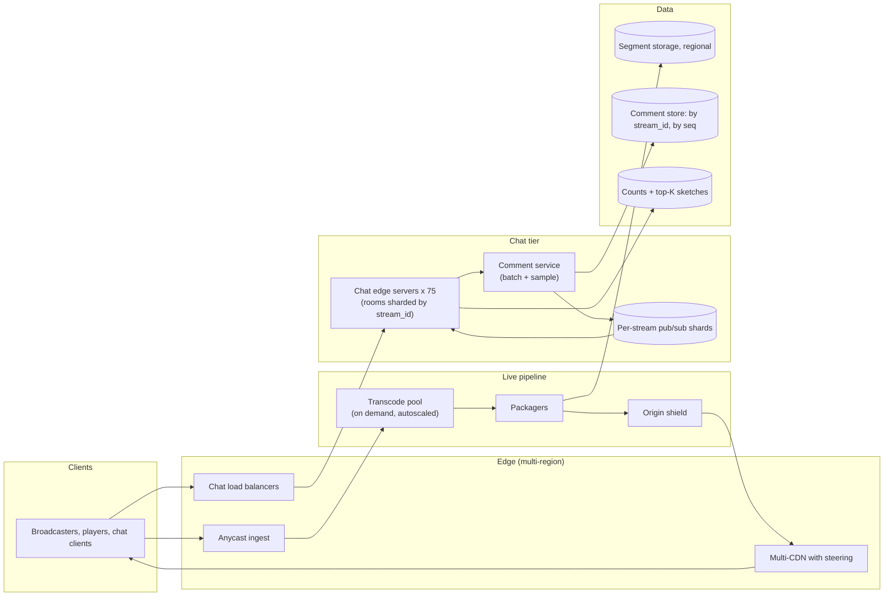

# Design Twitch (live streaming with live comments)

## TL;DR

- Live streaming is **two systems sharing a page**: video, a CDN problem where 99.9% of the bytes never touch your servers, and chat, a fan-out problem that scales with viewers times message rate.
- The cruxes: (1) **ingest, transcode and segmenting**, and why you do not transcode every stream, (2) the **latency tier** — HLS, LL-HLS or WebRTC — and what it costs at the CDN, (3) **comment fan-out** with per-stream pub/sub, batching and sampling, (4) **counts, reactions and hot-stream skew**.
- The design handles 10M concurrent viewers and ~50 Tbps of CDN egress, with ~8.3k comments/s fanned out by batch rather than by message.

## Problem statement and clarifying questions

"Anyone can broadcast, anyone can watch, and viewers chat next to the video in real time." The two halves have opposite shapes — one is bytes you must not touch, the other is small messages you must multiply — so establish early which the interviewer wants depth on.

| Question | Assumption taken |
|---|---|
| How live is live? | Interactive: 3–5 s glass-to-glass with LL-HLS, with a sub-second WebRTC tier for the few formats that need it. |
| Scale? | 10M concurrent viewers and 100k concurrent live streams at peak. |
| Viewer distribution? | Extreme skew: the top 0.1% of streams hold most viewers, the median stream has under 10. |
| Is chat ordered and complete? | Ordered per stream, and **not** complete: a 500k-viewer stream samples chat rather than delivering everything. |
| Can viewers rewind? | Yes: a 2-hour rolling DVR window. Permanent VOD only for opted-in channels. |
| Moderation? | Automated filters plus channel moderators, applied before fan-out. |
| Do we need exact viewer counts? | No. An approximate count refreshed every few seconds is what the product shows. |
| Playback devices? | Web, mobile and TV; adaptive bitrate is mandatory because the audience is mostly mobile. |
| Do we build the CDN? | No. Assume a commercial CDN with multi-CDN failover; we design the origin and the cache policy. |

## Requirements

### Functional

- Ingest over RTMP or SRT and make the stream playable within seconds.
- Transcode into an adaptive ladder and serve segments and manifests through a CDN.
- Let viewers play, switch bitrate automatically, and rewind within the DVR window.
- Post and receive live comments ordered per stream, moderated before delivery.
- Show an approximate viewer count and aggregate reactions.

### Non-functional

- Scale: 10M concurrent viewers, 100k concurrent streams, ~8.3k comments/s average and ~25k/s peak.
- Latency: 3–5 s glass-to-glass for video; a comment reaches viewers within one batching window (200 ms normally, 1 s on very large streams).
- Consistency: eventual for counts and reactions; ordered per stream for comments; segments are immutable once published.
- Durability: segments survive until the DVR window expires; comments are stored for review. A dropped ingest connection loses at most the segment in flight.
- Availability: 99.9% for playback, degrading to a lower rendition rather than an error. Chat is shed before video is.

### Out of scope

Codec and encoder internals, DRM and billing, recommendations and browse, clipping tools, the CDN's own architecture ([caching and CDNs](../fundamentals/caching-and-cdn.md)), and on-demand catalogue serving ([YouTube or Netflix](video-streaming.md)).

## Estimation

Using the [latency and estimation tables](../../cheatsheets/latency-and-estimation.md) (1080p is ~10 Mbps, or ~75 MB per minute; a 10 Gbps NIC moves 1.25 GB/s; a day is ~10^5 s):

| Quantity | Arithmetic | Result |
|---|---|---|
| Video egress (read bandwidth) | 10M viewers x ~5 Mbps over the ladder | ~50 Tbps, ~6 TB/s — entirely CDN |
| Ingest bandwidth (write) | 100k streams x 10 Mbps source | ~1 Tbps = 125 GB/s; at 1.25 GB/s per NIC, ~100 NICs, ~150 ingest servers |
| Transcode load | 100k streams x 5 renditions | 500k real-time encodes if you transcode everything; ~5k for only the ~1% with an audience |
| Comment write QPS | 10M viewers x 5% who chat x one message per 60 s | ~8.3k/s average, ~25k/s peak |
| Naive comment fan-out | one big stream: 200 comments/s x 500k viewers | ~100M socket writes/s — the number that forces batching |
| Batched fan-out, same stream | 1 flush/s x 500k viewers, ~2 KB per frame | 500k writes/s, ~1 Gbps across ~5 edge servers |
| Chat sockets | 10M x 50% with chat open / 100k per server, x1.5 | ~75 chat edge servers |
| DVR storage | 100k streams x 2 h x 4.5 GB/h (75 MB/min) | ~900 TB rolling; keeping everything would be ~11 PB/day |
| Comment storage per year | 8.3k/s x 86,400 x 100 B x 365 | ~72 GB/day, ~26 TB/year — trivial |

Two things to say out loud. Video is a **CDN and encoding-cost** problem: the 50 Tbps never reaches your origin, so the scaling worry is the transcode bill, not the egress. And chat is the only component whose cost is viewers *times* message rate, which is why the 100M writes/s line exists and why most of this page is about it.

## API design

Ingest speaks RTMP or SRT, playback is plain HTTP through the CDN, and chat rides one WebSocket.

| Endpoint or frame | Request | Response | Notes |
|---|---|---|---|
| `rtmp://ingest/live/{stream_key}` | continuous A/V | — | The key authenticates the broadcaster; rotate it like a password. Anycast picks the nearest point of presence. |
| `GET /v1/streams/{id}/master.m3u8` | — | `200` multivariant manifest | Cached ~2 s at the CDN. Lists the ladder; the player chooses. |
| `GET /v1/streams/{id}/{rendition}/{segment}.m4s` | — | `200` segment bytes | Immutable, so `Cache-Control: max-age=31536000`. This is 99.9% of the bytes. |
| `WS /v1/streams/{id}/chat` | token, `last_seq` | `connected {seq, viewer_count}` | Joins the room on one edge server; `last_seq` lets a reconnecting client see what it missed, capped. |
| frame `comment` | `{client_msg_id, body}` | `ack {seq}` | Idempotent on `client_msg_id`. Rejected if the user is timed out or the filter trips. |
| frame `batch` (server to client) | — | `{comments[], dropped, viewer_count}` | One frame per window; `dropped` is what the client renders as "+340 more". |

Note the asymmetry that defines the design: the video API has no per-viewer state, which is what lets a CDN serve it; the chat API is a stateful room whose cost grows with the audience.

## Data model

**Segments are immutable files; comments are a per-stream log; everything else is small.**



- **Segments**: bytes in object storage, one small row per segment in a wide-column store partitioned by `stream_id` and clustered by `sequence`. The manifest is generated from that partition, never stored as a file.
- **Comments**: the same shape — by `stream_id`, clustered by `seq` — which is the [chat system](chat-messenger.md)'s message table with the conversation replaced by a stream. Rows expire with the DVR window.
- **Streams and renditions**: a relational store; small, read constantly, cached at the edge.
- **Viewer sessions**: never a table. Each edge server holds its room and reports a count; the total is a sum in a cache.

## High-level design

**v1: an ingest tier, a transcode pool feeding a packager, a CDN in front of the segments, and a completely separate chat path.**



**Write path: the broadcaster's bytes become immutable segments the CDN can cache.**



**Read path: the player pulls a manifest, then segments, almost always from a CDN edge.**



Walk-through: everything on the read path is a plain HTTP GET for an immutable object, which is why one origin fetch serves an entire edge's audience and why 50 Tbps never reaches you. The only mutable object is the rolling manifest, whose 2 s TTL is the single knob trading latency against origin load.

## Deep dive: ingest, transcode and segmenting

"A broadcaster hits Go Live. What happens next?" Ingest terminates RTMP or SRT at the nearest anycast point of presence, authenticates the stream key, and hands the source to a transcoder. Prefer **SRT or WebRTC ingest** over RTMP where you can: RTMP is TCP, so a lossy uplink becomes head-of-line blocking and a stalled stream, while SRT recovers losses over UDP within a bounded latency budget.

Transcoding produces the ladder — source, 1080p60, 720p, 480p, audio-only — and it is where the money goes. The estimation says 100k streams times 5 renditions is 500k real-time encodes, which is not a fleet you can buy. Two rules make it tractable:

- **Transcode on demand.** A stream with three viewers gets source pass-through. The ladder spins up when the audience crosses a threshold, costing those first viewers a few seconds of source-only playback and cutting the encode fleet by two orders of magnitude.
- **Split by GOP.** Encoding parallelises across group-of-pictures boundaries, so any free worker can take a segment — the DAG-shaped pipeline the [YouTube design](video-streaming.md) uses for uploads, run in real time.

Segmenting is what makes the CDN work. The packager writes fixed-duration segments (2 s here) as immutable objects with a far-future `Cache-Control`, plus a rolling manifest listing the newest few. Immutability is the trick: a segment is fetched once per edge and served to everyone behind it, so an audience of a million costs the origin what ten cost. The manifest is the only thing that changes, and its short TTL is what keeps players close to live.

## Deep dive: latency tiers and CDN distribution

Glass-to-glass latency is a choice, and each tier trades latency against cacheability.

| Tier | Mechanism | Typical latency | CDN behaviour | Use when |
|---|---|---|---|---|
| Classic HLS | 6 s segments, 3 buffered | 15–30 s | Perfectly cacheable HTTP | Large passive audiences |
| Tuned HLS | 2 s segments, 3 buffered | 6–10 s | Cacheable; more requests per viewer | A safe default |
| LL-HLS | 2 s segments as ~200 ms parts, blocking playlist reloads | 3–5 s | Cacheable with origin blocking | Interactive streams where chat must match the video |
| WebRTC | Peer connection through an SFU | < 500 ms | **Not** cacheable: the SFU fans out per viewer | Auctions, betting, co-streaming |

**Latency falls as caching gets harder.**



Pick **LL-HLS as the default** and offer WebRTC only where sub-second latency is the product. The reason is the right-hand column: HLS and LL-HLS are HTTP objects, so a commercial CDN absorbs the 50 Tbps and your origin serves misses only. WebRTC has no cache — every viewer is a media connection on an SFU — so its cost grows with the audience, exactly like chat.

Two CDN details worth raising unprompted. **Multi-CDN** with real-time steering, because a provider's regional brownout is the likeliest cause of a mass playback failure and video is a commodity any of them can serve. And **pre-warming**: a scheduled event's first segments are pushed to edges before the start, so the opening minute is not a synchronised origin stampede.

## Deep dive: live comment fan-out

The crux number again: 200 comments/s on a 500k-viewer stream is 100M socket writes/s if every comment reaches every viewer. Three levers, in this order:

| Lever | Effect on the example | Cost |
|---|---|---|
| Per-stream pub/sub, subscribers are servers | 200 publishes/s reach ~5 servers, not 500k sockets | Rooms are sticky per stream and server |
| Batching window (200 ms, 1 s when hot) | 500k writes/s instead of 100M | One window of added latency |
| Sampling to a cap per batch | Frame stays ~2 KB whatever the chat rate | Viewers see a sample, not the whole chat |

Sampling is the lever candidates flinch at, so justify it from the product: nobody reads 200 messages a second, and a 500k-viewer chat is ambience rather than conversation. What matters is that the sample is *fair*, that some messages are never dropped — the broadcaster, moderators, subscribers — and that the client is told how many were hidden so it can render "+340 more". Sample randomly rather than truncating to the first N: truncation systematically silences whoever's message lands late in the window, which correlates with a slow connection.

```python title="code/hld/comment_fanout.py — sequencing, batching and sampling"
--8<-- "code/hld/comment_fanout.py:service"
```

```python title="code/hld/comment_fanout.py — per-stream pub/sub"
--8<-- "code/hld/comment_fanout.py:bus"
```

**One flush, one delivery per edge server, one write per local viewer.**



The demo shows the saving at small scale — 600 viewers on 3 edge servers, 61 comments in one window:

```text
stream hot: 600 viewers on 3 edge servers
batch window: hot=1.0 s, quiet=0.2 s
hot window held 61 comments -> batch of 8, 53 sampled out
moderator survived sampling: True
seqs delivered: [2, 8, 15, 16, 18, 41, 48, 61]
socket writes: 601 batched vs 36600 unbatched (60x cheaper)
one viewer received: 1 frame(s) in that second
everyone left: 0 subscribers, 0 viewers
```

Each comment still carries a per-stream `seq`, so a client holding 41 that receives 48 knows it was sampled rather than disconnected — the [chat system](chat-messenger.md)'s gap detection used for a different purpose.

!!! warning "Common mistake"
    Designing chat as "a message to every viewer" and only noticing the arithmetic when the interviewer asks about a big stream. Say the 100M writes/s number yourself, in the estimation, and let batching and sampling fall out of it.

## Deep dive: viewer counts, reactions and hot-stream skew

**Viewer counts** are never a query. Each chat edge server knows its own room size and reports it every few seconds; a rollup sums the reports into a cache the player polls. The count is approximate by construction and the product does not care — it is social proof, not accounting. The number that *is* accounting, concurrent-viewer minutes for payouts, comes from segment-request logs in a batch pipeline.

**Reactions** are counters, not messages, so aggregate them at the edge: each server counts reactions per stream per second and publishes one total, turning a million hearts into a few hundred integers. Anything that ranks — trending streams, top emotes — is a [top-K problem](top-k-heavy-hitters.md): a sketch per window, merged across shards.

**Skew** is the defining property. The top 0.1% of streams hold most viewers, so every per-stream resource is a potential hot key: the room, the channel, the manifest cache entry, the count. The fixes are the [caching page](../fundamentals/caching-and-cdn.md)'s — replicate a hot key across shards, and widen the batch window with the audience so cost per viewer falls as the audience grows.

**Moderation** runs before fan-out, affordable only because the check is per comment (8.3k/s) rather than per delivery. **DVR** replays the same immutable segments through the same CDN, so rewinding is free; chat replay is a range scan of the comment partition by `seq`.

## Scaling, bottlenecks and failure modes

**v2: regional ingest and transcode, multi-CDN egress, sharded chat rooms and a separate aggregation path.**



What changes from v1: an **origin shield** collapses misses from many CDN edges into one origin fetch; transcoding autoscales and runs the ladder only for streams with an audience; and chat rooms shard by `stream_id`, so one enormous stream spreads across several edge servers that each subscribe to the same channel.

What breaks first:

- **Transcode capacity** during a coordinated event. Shed the top rendition, then the ladder, leaving source pass-through: viewers on poor connections suffer before anyone loses the stream.
- **Origin stampede** when a huge stream starts and every edge misses at once. The origin shield plus pre-warming turns a million requests into one.
- **A single hot chat room.** Widen the window, lower the sampling cap, then shard the room across edge servers. The publish rate is unchanged; only delivery cost moves.
- **Ingest point of presence loss.** The encoder reconnects to the next anycast target, losing the segment in flight, so configure encoders with a reconnect and a small local buffer.
- **CDN brownout.** Steer to the second CDN within seconds. This is the likeliest mass-failure mode and the reason multi-CDN exists.
- **Degradation order.** Reactions, then the viewer count, then chat, then the top rendition. Video keeps playing to the very end.

## Trade-offs summary

| Decision | Chosen | Alternatives | Why |
|---|---|---|---|
| Delivery protocol | LL-HLS default, WebRTC where sub-second matters | Classic HLS, WebRTC everywhere | HTTP objects are cacheable; WebRTC cost grows with the audience |
| Transcoding | On demand, above an audience threshold | Full ladder for every stream | 500k concurrent encodes versus ~5k |
| Segments | Immutable, far-future cache headers | Mutable rolling files | One origin fetch serves an entire edge |
| Manifest freshness | 2 s TTL | Longer TTL, or push | The only mutable object: the latency and origin-load knob |
| Comment fan-out | Per-stream pub/sub, servers subscribe | Per-viewer subscriptions, fleet broadcast | Deliveries bounded by servers holding viewers |
| Chat delivery | Batch per window, sample to a cap | Deliver every comment | 500k writes/s instead of 100M, and nobody reads 200 messages/s |
| Sampling policy | Random, priority-exempt, dropped count | Truncate to the first N | Truncation silences slow connections systematically |
| Viewer count | Sum of per-server reports | Exact count from a session table | The product shows social proof; billing uses request logs |

## Interviewer follow-ups

??? question "Why is chat harder than video here?"
    Video is the same bytes for everyone and chat is not. A segment is fetched once per CDN edge and served to a million viewers; a comment must be written to a million sockets. Video scales with *content*, chat with content times audience — which is why the second half of this design is fan-out reduction.

??? question "Sampling loses messages. How do you defend that?"
    Point at the reader, not the server: at 200 messages a second nobody reads chat line by line. The guarantees that matter are kept — order is preserved, the broadcaster and moderators are never dropped, the client is told how many were hidden, and every comment is still stored for replay and moderation.

??? question "How do you get to sub-second latency?"
    WebRTC through an SFU, and say the price: it is no longer an HTTP object, so no CDN caches it and server cost scales with the audience. Offer it as a tier for the formats that need it — auctions, betting, co-streaming — not as the default.

??? question "A stream goes from 100 to 500k viewers in two minutes."
    Three things scale at once. Transcoding crosses the threshold and spins up the ladder. The CDN starts missing at edges that have never seen the stream, which the origin shield absorbs. The chat room widens its window and shards across more edge servers. Each is a threshold with hysteresis, not a manual action.

??? question "How do you count viewers accurately for payouts?"
    Not from this cache. Concurrent-viewer minutes come from segment-request logs run through a batch pipeline with deduplication and bot filtering. The on-screen number is approximate and cheap; the billing number is exact, late and expensive.

??? question "Where does moderation sit in the pipeline?"
    Synchronously before fan-out for the cheap checks — denylists, rate limits, the channel's timeout and ban lists — because the comment rate is only ~8.3k/s. Expensive classifiers run asynchronously and retract by publishing a delete clients apply to their buffer.

??? question "How would you support rewinding into the DVR window?"
    The same immutable segments, requested by an earlier sequence number, through the same CDN, so rewind costs nothing extra. Chat replay is a range scan by `seq` — exactly why comments are partitioned by `stream_id` and clustered by `seq`.

!!! tip "Interview tip"
    Split the whiteboard in two within the first five minutes: video on the left, chat on the right, nothing crossing but the stream id. Every question then belongs clearly to one side, and the picture itself shows you know the two halves have different scaling laws.

## 45-minute pacing

| Minutes | What to say and draw |
|---|---|
| 0–5 | Clarify: interactive latency, 10M viewers, 100k streams, extreme skew, chat sampled not complete, 2-hour DVR. |
| 5–10 | Estimation: 50 Tbps CDN egress, 1 Tbps ingest, 500k encodes if naive, ~8.3k comments/s, and the 100M writes/s chat number. |
| 10–14 | Split the board. API: RTMP in, HTTP segments out, one chat socket. Data model: immutable segments, comments by `stream_id` and `seq`. |
| 14–22 | v1 diagram; narrate ingest to transcode to packager to CDN, then the player's manifest-and-segment loop. |
| 22–28 | Latency tiers and why LL-HLS is the default; transcode-on-demand as the cost fix. |
| 28–38 | Chat fan-out: per-stream pub/sub, batching window, sampling with priority exemptions and a dropped count. |
| 38–43 | Counts and reactions as aggregates, top-K for trending, moderation before fan-out, DVR replay. |
| 43–45 | Failure modes and the degradation order. |

## Related

- [Design YouTube or Netflix](video-streaming.md) — the on-demand sibling: same ladder and packaging, batch instead of real time
- [Design a chat system](chat-messenger.md) — the room, sequencing and idempotency this reuses without per-recipient state
- [Caching and CDNs](../fundamentals/caching-and-cdn.md) — immutable objects, TTLs, origin shielding and hot keys
- [Design a Top-K heavy hitters service](top-k-heavy-hitters.md) — trending streams and emotes from sketches per window
- [Design a news feed](news-feed.md) — where "bound the fan-out before it bounds you" comes from
- Primary sources: RFC 8216 (HTTP Live Streaming) and Apple's Low-Latency HLS specification; the SRT protocol documentation; W3C WebRTC 1.0
