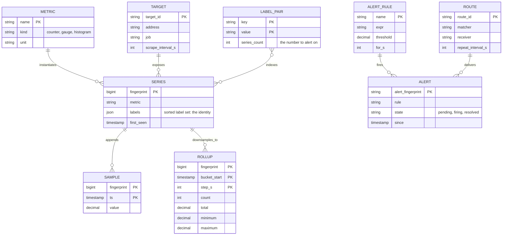
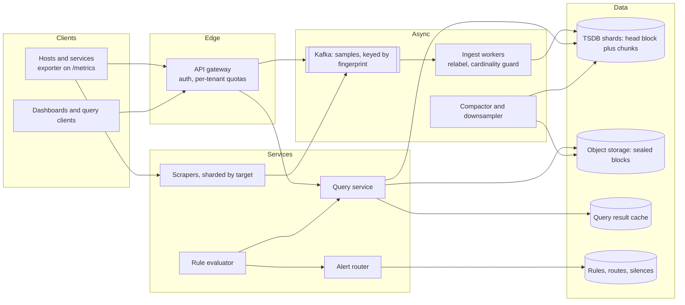
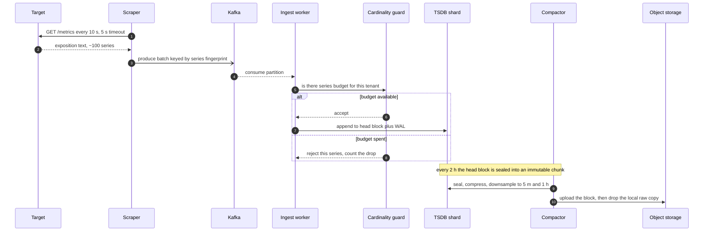
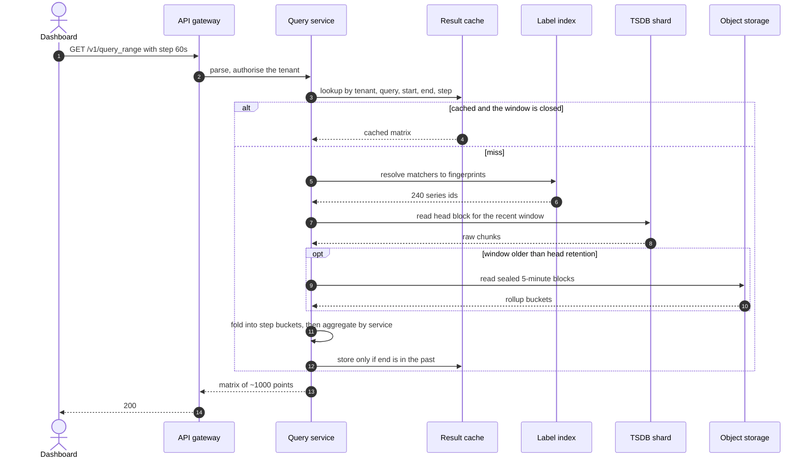
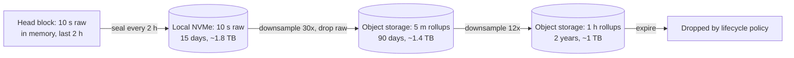
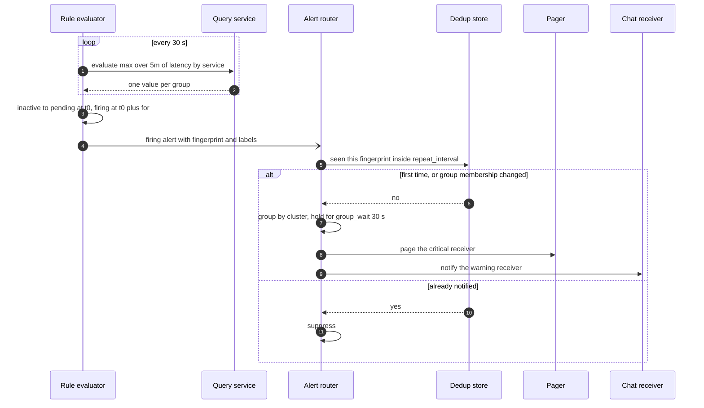
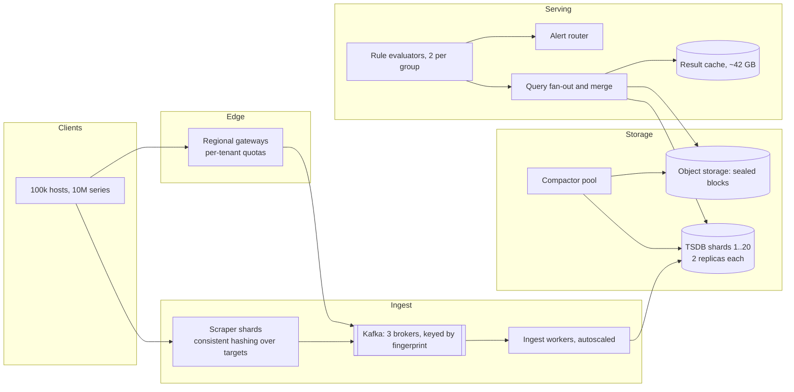

# Design a metrics monitoring and alerting system

## TL;DR

- Monitoring is **write-dominated and append-only**: 1M points/s in, a few hundred queries/s out, and everything turns on one number — the count of active time series.
- The cruxes: (1) **metric plus labels** and the **cardinality explosion** one bad label causes, (2) **pull versus push** through a **Kafka buffer**, (3) **compression, downsampling, retention tiers**, (4) **alert rules** with `for:` durations, dedup and routing, (5) the **log variant**, ~70x more expensive per host.
- Raw storage is 1.4 TB/day; compression and tiering turn that into ~4 TB in total.

## Problem statement and clarifying questions

"Design the system that collects metrics from a large fleet, powers dashboards, and pages an on-call engineer when something breaks." Most candidates start drawing a database. Ask instead what a single data point *is*: that answer decides whether you need a purpose-built store at all.

| Question | Assumption taken |
|---|---|
| Fleet size and metrics per host? | 100k hosts, ~100 metrics each, sampled every 10 s. |
| What identifies a metric? | A name plus a set of key-value labels; the label set *is* the identity. |
| Metric types? | Counters, gauges, histograms. Percentiles come from buckets, never a per-host `p99` gauge. |
| Who reads it, how often? | ~200 dashboard sessions, 20 panels each, refreshed every 30 s. |
| Freshness? | Under 30 s scrape to visible; alerting may lag one interval. |
| Retention? | 15 days raw, 90 days at 5-minute, 2 years at 1-hour resolution. |
| Multi-tenant? | Yes — one cluster, many teams; one must not hurt another. |

## Requirements

### Functional

- Collect from long-lived services (scraped) and short-lived jobs (pushed), labelling at collection time.
- Store full resolution hot and reduced resolution for longer; answer range queries over time and labels.
- Evaluate alert rules on a fixed interval, holding a condition for a configured duration before notifying.
- Deduplicate, group, route, silence and resolve notifications.
- Let an operator find which label is exploding the series count.

### Non-functional

- Scale: 10M active series, 1M samples/s, ~400 queries/s peak, 10k alert rules.
- Latency: scrape to queryable under 30 s; query p99 under 1 s hot, under 5 s for 90 days.
- Availability: 99.9% for ingest and query (8.76 hours/year); alerting targets 99.99%.
- Consistency: eventual. A dashboard one scrape stale is fine; a query that blocks is not.
- Durability: survive one replica loss (factor 2 in the TSDB, 3 in Kafka); samples are individually expendable.
- Isolation: per-tenant series and query budgets at write and read time.

### Out of scope

Tracing, profiling, log search UX, incident workflow, anomaly detection, exporter libraries.

## Estimation

From the [latency and estimation tables](../../cheatsheets/latency-and-estimation.md): a day is ~10^5 s, a raw point is 16 B, a Gorilla-compressed point ~1.4 B, peak is 3x average.

| Quantity | Arithmetic | Result |
|---|---|---|
| Active series | 100k hosts x 100 metrics | 10M series |
| Write QPS | 10M / 10 s interval | ~1M samples/s |
| Ingest bandwidth | 1M/s x 16 B | 16 MB/s = ~128 Mbps |
| Raw storage | 16 MB/s x 86,400 | ~1.4 TB/day |
| Compressed | 1M/s x 1.4 B x 86,400 | ~120 GB/day, ~44 TB/year (~130 TB at x3) |
| With tiers | 15 d raw 1.8 TB + 90 d at 5 m ~1.4 TB + 2 y at 1 h ~1 TB | **~4.2 TB per replica** |
| Read QPS | 200 sessions x 20 panels / 30 s | ~130/s average, ~400/s peak |
| Rule evaluation | 10k rules / 30 s | ~330 internal queries/s — same order as dashboards |
| Result cache | 13M queries/day x 20% x 16 KB | ~42 GB, two 64 GB nodes |
| TSDB shards | 1M/s / ~100k appends/s per node (memory write plus sequential WAL: Redis-like, not Cassandra's 5-10k/s) | 10 shards, 20 with headroom, x2 replicas |

Two sentences for the room. **Compression is the storage story**: 1.4 TB/day becomes 120 GB/day before any downsampling. **Series count, not sample rate, is the limit**: 16 MB/s is trivial, but 10M head chunks at ~2 KB each is 20 GB of RAM.

## API design

| Endpoint | Request | Response | Notes |
|---|---|---|---|
| `GET /metrics` (on the target) | — | `200 text/plain` exposition | The pull surface; the *scraper* stamps the timestamp, so 100k unsynchronised clocks cannot scatter samples. |
| `POST /v1/write` | Snappy protobuf batch of `{labels, samples[]}` | `204`, no body | Jobs and edge agents. Idempotent by `(fingerprint, timestamp)`; a `429` carries `Retry-After` so agents back off rather than amplify an outage. |
| `GET /v1/query_range?query=...&start=&end=&step=` | Range plus step | `200 {resultType: "matrix", ...}` | `step` snaps to the epoch grid so cached results stay reusable; over ~11,000 points per series is rejected. |
| `GET /v1/series?match[]=...&limit=&cursor=` | Matcher set | `200 {series, next_cursor}` | The cardinality explorer, cursor-paginated because the honest answer is a million rows. |
| `PUT /v1/rules/{group}` | `{rules: [...]}` plus `If-Match` | `200 {version}` | Idempotent by group name; the version stops two engineers clobbering each other. |

Every request carries a tenant id from the token, and every response reports samples scanned.

## Data model

**The label set is the identity; everything else hangs off the series fingerprint.**



Store choices:

- **Samples and rollups**: a purpose-built TSDB. Partition key the fingerprint, sort key the timestamp, layout one compressed chunk stream per series, sharded by `fingerprint mod N` with virtual nodes.
- **Label index**: `(key, value)` to sorted fingerprints, co-located with the data. It is the only index.
- **Sealed blocks**: object storage, one immutable block per 2-hour window per shard, making compaction, replication and dedup trivial.
- **Rules, routes, silences**: a small relational store, cached in process.
- **Query results**: Redis keyed by `(tenant, query, start, end, step)`; only *closed* windows are cached.

## High-level design

**v1: scrapers and a push endpoint feed one Kafka topic; ingest workers write sharded TSDB nodes; one query tier serves dashboards and the rule evaluator.**



**Write path: scrape, buffer, guard, append, seal in the background.**



**Read path: resolve matchers through the label index, then read whichever tier has the requested resolution.**



The scraper, not the target, sets the sample rate, so a struggling service cannot flood you. Kafka absorbs the gap between constant arrivals and a storage tier that pauses to compact. On reads the expensive step is never fetching samples — it is resolving matchers to a set of series.

## Deep dive: the data model and cardinality explosion

The probing question is always "someone adds `user_id` as a label — what happens?"

| Identity model | Query flexibility | Cardinality risk |
|---|---|---|
| Flat name per combination, as in Graphite | None: no slicing by a dimension nobody pre-named | Bounded, a human types every name |
| Name plus arbitrary indexed labels, as in Prometheus | Slice by any label | Unbounded: the product of every label's value count |
| Name plus a *declared* schema, as in Monarch | Declared labels only | Bounded, enforced at write time |

Take the middle option and add a budget. A series is `(name, sorted label set)` hashed to a 64-bit fingerprint; the store is `fingerprint -> chunk stream`, and `{service="checkout", status="500"}` is answered by intersecting two postings lists smallest-first — the merge a search engine runs for a boolean AND.

```python title="code/hld/tsdb_downsample.py — the label index"
--8<-- "code/hld/tsdb_downsample.py:index"
```

The arithmetic that makes this a crux: 10M series at ~2 KB of head block each is 20 GB of RAM held open across the shards. Add `user_id` with a million values to one metric and that metric alone becomes a million series per label combination it already had. The bill is not disk — compressed samples stay cheap — it is one open chunk per series in memory, one postings entry per label pair, and a query that merges a million postings lists before reading a sample.

Four defences:

1. **Relabel at ingest.** Drop or rewrite the label in the scrape config — free, and it fixes an id inside a URL path.
2. **A per-tenant series budget on the write path.** Reject the *new* series and keep existing ones alive; rejecting the whole batch punishes innocent series.
3. **Track `series_count` per label pair** and alert on its derivative, catching a bad deploy in minutes rather than at out-of-memory time.
4. **Histograms instead of per-request labels.** A p99 comes from a few bucket counters per service, not one series per request.

## Deep dive: push, pull and the Kafka buffer

"Do agents push, or does the server pull?" is a design question, not a religious one.

| | Pull (scrape) | Push (remote write) |
|---|---|---|
| Discovery and liveness | The scraper's job; `up == 0` is free | A silent agent looks healthy |
| Short-lived jobs | Invisible: a 10 s cron job is never scraped | Natural |
| Firewalls and NAT | The scraper must reach every target | The agent needs egress only |
| Cardinality control | In the scrape config, before the sample exists | At ingest, after paying the network cost |

Take both: **pull for long-lived services, push for jobs and edge devices**, both landing in one Kafka topic. Scrapers shard by consistent hashing over targets, so adding one moves a slice rather than reshuffling everything.

Why a log sits between collection and storage:

- **It decouples arrival from storage.** A restart, a slow compaction or a failover becomes consumer lag, not lost data; at 16 MB/s a six-hour buffer costs ~350 GB of broker disk.
- **Partition by fingerprint** so a series arrives in order on one partition. The head block rejects out-of-order writes, so a shuffled stream would drop data.
- **Replay.** A relabelling bug is fixed by reprocessing the topic, not by asking 100k hosts to re-send.
- **Multiple consumers.** The writer, an anomaly detector and an archive read the same log.

The cost is one extra hop and at-least-once delivery, both harmless: `(fingerprint, timestamp)` is the primary key, so a duplicate is an overwrite with an identical value. That is why exactly-once appears nowhere here, unlike [ad click aggregation](ad-click-aggregation.md), where counts are money.

## Deep dive: storage, compression and retention tiers

"1.4 TB a day of raw points — where does it go, and what does a 30-day dashboard read?"

**Compression.** Timestamps arrive on a fixed cadence, so the delta of deltas is almost always zero and fits in one bit. Values move slowly, so consecutive floats share sign, exponent and most mantissa bits, and their XOR leaves a short run of meaningful bits. That is the Gorilla scheme: 16 B becomes ~1.4 B.

**Layout.** Samples append to an in-memory head block per series plus a sequential write-ahead log. Every two hours the head is sealed into an immutable block — chunks, index, tombstones. Immutability makes compaction lock-free, upload a copy, and identical replica blocks trivially deduplicated.

**Tiers**, where the arithmetic pays off.

**Every tier is a downsample plus a delete; the sizes come from the estimation table.**



A rollup bucket stores `count`, `total`, `minimum`, `maximum` and `last` — never the mean. Storing the mean is the classic bug: without its weight you cannot merge twelve 5-minute buckets into an hour, and the hourly panel quietly disagrees with the raw one. The planner picks the coarsest tier whose resolution *divides* the requested step, so stored and query buckets line up:

```python title="code/hld/tsdb_downsample.py — head block, rollups and the query planner"
--8<-- "code/hld/tsdb_downsample.py:tsdb"
```

```text
series=4  distinct instance values=3  distinct user_id values=1
one more user_id label -> ValidationError: series cardinality limit 4 reached; refusing latency_seconds{service=search,user_id=u-2}
raw samples in the head block: 424
avg checkout latency per 5-minute bucket, from raw samples:
  t+    0s  0.250
  t+  300s  0.275
  t+  600s  0.300
compact(step=300s, before=t+900s): dropped 270 raw samples, wrote 9 buckets
head block now holds 154 raw samples
same query, now planned onto the 5-minute tier: identical=True
t+1200s  max=0.90  state=pending  -> nothing sent
t+1260s  max=0.90  state=pending  -> nothing sent
t+1320s  max=0.90  state=firing   -> new page to oncall-payments
t+1350s  max=0.90  state=firing   -> nothing sent
t+1410s  max=0.25  state=inactive -> resolved page to oncall-payments
```

270 raw samples collapse into 9 buckets and the answer is unchanged: downsampling loses nothing for `avg`, `min`, `max` and `count` while the bucket carries its weight. It does lose `p99`, so percentiles are downsampled as histograms, not scalars.

## Deep dive: alert rules, dedup and routing

"Ten thousand rules, a thirty-second interval, and a rack loses power. How many pages does the on-call get?" One.

A rule is a query, a threshold, a `for:` duration and a label set. The `for:` duration separates a useful pager from one everyone mutes: one scrape above the threshold means nothing, three minutes above it means something. That gives a state machine — `inactive` to `pending` on the first breach, `pending` to `firing` once it holds, back to `inactive` when it clears — held in the evaluator, which is why a restart re-arms every timer.

**Evaluation, dedup, grouping and routing, in the order they happen.**



Three things to justify:

- **Two evaluator replicas per group, not a leader.** Leader election adds a failure mode — a lost lease means no evaluation at all — to prevent what the router already handles: identical alerts share a fingerprint and deduplicate. Redundancy beats coordination when the consumer is idempotent.
- **Grouping turns 40 alerts into 1.** `group_by: [cluster]` with a `group_wait` of 30 s batches one blast radius; `group_interval` paces re-notification; `repeat_interval` stops a firing alert paging forever. Inhibition lets a cluster-down alert suppress the per-pod alerts it caused.
- **Evaluation is just queries** — ~330/s, on the dashboard tier. Shard rule groups across evaluators; when a group overruns its interval, *skip* the next run and export the delay, because queueing only grows the backlog.

```python title="code/hld/tsdb_downsample.py — rule state machine, dedup and routing"
--8<-- "code/hld/tsdb_downsample.py:rules"
```

Delivery is at-least-once with an idempotency key per `(fingerprint, notification number)`: a page sent twice is an annoyance, a page never sent is an outage.

## Deep dive: the log-aggregation variant

"Same fleet, now ship the logs." One ratio explains every difference: at 200k lines/s and ~500 B a line you move 100 MB/s, ~8.6 TB/day raw — **70x the 120 GB/day of metrics for the same hosts**.

The pipeline rhymes: an agent per host tails files, attaches the same `service`, `host` and `env` labels and ships to Kafka; a parsing stage extracts fields, drops noise and bulk-indexes into a search cluster. An Elasticsearch data node indexes ~5k-10k docs/s, so 200k/s needs ~27 nodes, ~55 with one replica.

What changes:

- **Index by time; delete by dropping an index.** One index per service per day, so retention is `DELETE /logs-checkout-2026.08.01`, never `DELETE WHERE ts < x`, which rewrites every segment. Size shards at 30-50 GB; thousands of tiny shards is the classic failure.
- **Lifecycle tiers mirror the TSDB tiers**: hot (NVMe, replicated, indexed) 3 days, warm (force-merged) 2 weeks, cold (snapshot on object storage) 90 days, then delete.
- **Index only what you filter on** — `service`, `level`, `trace_id`, `status` — and store the raw message unanalysed. Full-text-indexing every line turns 8.6 TB/day into 13 TB/day.
- **Sample aggressively.** Drop `DEBUG`, keep 1% of successes and 100% of errors — the only order-of-magnitude lever.

The closing line: metrics tell you *that* something broke and since when, logs tell you *why*, and the label that destroys a TSDB — a request id — is the right key for a log store, which indexes documents rather than a chunk stream per series.

## Scaling, bottlenecks and failure modes

**v2: sharded scrapers, a partitioned buffer, replicated shards with a compactor pool, and a query tier that fans out and merges.**



- **Cardinality, always.** One deploy adds a label, series count jumps 10x, head blocks exhaust memory. Defences: the write-path budget, an alert on `series_count` growth, and a kill switch dropping a metric name at the ingest worker without a redeploy.
- **Hot shards.** Hashing spreads series evenly, but one tenant with 5M series still owns a quarter of the load. Give large tenants dedicated shards.
- **Expensive queries.** Two years at a 10-second step asks 6M points per series. Reject it and snap `step` to what the tier serves.
- **The monitoring system itself.** A minimal watchdog in another failure domain, paging through a different provider, with a dead-man's switch that fires when the main system *stops* reporting.

## Trade-offs summary

| Decision | Chosen | Alternatives | Why |
|---|---|---|---|
| Series identity | Metric plus labels, plus a per-tenant budget | Flat names; a declared schema | Slicing is the product's value; the budget stops it killing the cluster |
| Ingestion | Pull for services, push for jobs | Pure pull; pure push | Pull gives free liveness and rate control; push covers what pull cannot see |
| Buffer | Kafka between collection and storage | Write straight to the TSDB | Turns a storage outage into lag; enables replay and extra consumers |
| Storage engine | Purpose-built TSDB | Cassandra; relational; object storage | 60 B row overhead and a 5-10k writes/s ceiling both fail at 1M points/s |
| Old data | Downsample to count, total, min, max | Keep raw; keep only the mean | 4 TB instead of 130 TB, and mergeable buckets keep the answer exact |
| Delivery | At-least-once everywhere | Exactly-once | `(fingerprint, timestamp)` makes duplicates a no-op; counts are not money |
| Alert evaluation | Two replicas, dedup downstream | Leader-elected evaluator | The router is idempotent; a lost lease would mean no evaluation |
| Logs | A separate pipeline and store | One store for both | 70x the volume and the opposite cardinality profile |

## Interviewer follow-ups

??? question "Why not store metrics in PostgreSQL or Cassandra?"
    Two ceilings. Space: a general row carries a key, column names and tombstones, so a 16 B sample becomes 60 B or more — the opposite direction from 1.4 B. Throughput: ~5-10k writes/s per node means 100-200 nodes for 1M points/s.

??? question "How do you compute a p99 across 100k hosts?"
    Not by averaging per-host p99s — the mean of 100k p99s is not the fleet p99. Export a histogram with pre-agreed buckets: summing counters across hosts is valid, and the percentile is interpolated from the sum. One series per bucket is the cost, so boundaries are a design decision.

??? question "A shard is down when a scrape lands. What happens to those samples?"
    Nothing: they are already in Kafka. That partition's worker stops committing offsets and lags; a promoted replica resumes from the last committed offset. The visible effect is a gap of seconds and a consumer-lag alert, not data loss.

??? question "Who monitors the monitoring system?"
    A minimal watchdog in a separate cluster, account and paging provider, scraping only liveness and lag. Its key rule is a dead-man's switch: a heartbeat alert that fires when the main system stops sending, so silence reads as failure.

??? question "How does a rate calculation survive a counter reset on restart?"
    The engine treats a sample lower than its predecessor as a reset, adding the pre-reset value to the delta instead of emitting a negative rate. Hence counters must be monotonic within a process lifetime, and `instance` must change when the process identity does.

??? question "How do you stop one tenant's query from taking the cluster down?"
    Three limits enforced before execution: maximum series touched (reject the matcher set before reading), maximum samples scanned, and a deadline that cancels every shard. Add a per-tenant concurrency semaphore and report the cost in the response.

!!! tip "Interview tip"
    Open with the series count, not the sample rate: "10M active series at 1M samples/s — 16 MB/s is nothing, so this is a cardinality and retention problem, not a throughput problem." That sets up the budget, the compression story and the tiering as consequences rather than bolt-ons.

!!! warning "Common mistake"
    Designing the storage engine and skipping the alerting half. Alerting is where the distributed-systems questions live: the `for:` state machine, evaluation replicas, dedup by fingerprint, grouping so a rack failure sends one page, the dead-man's switch. "We store it in a TSDB" answers half the question.

## 45-minute pacing

| Minutes | What to say and draw |
|---|---|
| 0-5 | Clarify: 100k hosts, 100 metrics, 10 s interval, labels as identity, multi-tenant, retention tiers. |
| 5-10 | Estimation: 10M series, 1M samples/s, 1.4 TB/day raw, 120 GB/day compressed, ~4 TB with tiers. Cardinality is the limit. |
| 10-15 | API and data model: fingerprint, label index, sample, rollup. |
| 15-24 | v1 diagram; narrate the write path (scrape, Kafka, guard, head block, seal) and the read path (matchers, tier, fold, cache). |
| 24-38 | Deep dives: cardinality and its defences; pull versus push and why Kafka is in the middle; compression, rollups, tiers. |
| 38-42 | Alerting: the `for:` state machine, two replicas plus dedup, grouping, routing, dead-man's switch. |
| 42-45 | Bottlenecks, trade-offs, and the log variant in two sentences if asked. |

## Related

- [Observability, SLOs and error budgets](../fundamentals/observability-and-slos.md) — what to measure, and how error budgets turn metrics into decisions
- [Batch and stream processing](../fundamentals/batch-and-stream-processing.md) — the Kafka buffer, windowing and replay on the write path
- [Object, file, search, time-series and graph storage](../fundamentals/storage-systems-zoo.md) — where a TSDB and a search cluster sit
- [Design an ad click aggregation system](ad-click-aggregation.md) — the same shape with an exactly-once bar
- Primary sources: "Gorilla" (VLDB 2015), "Monarch: Google's Planet-Scale In-Memory Time Series Database" (VLDB 2020), the Prometheus TSDB format documentation
