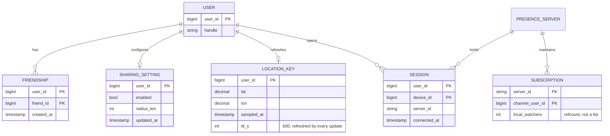
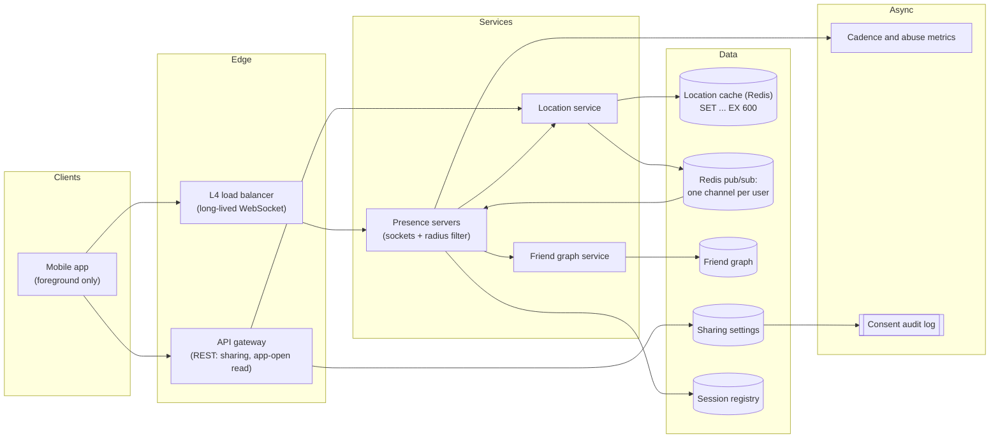
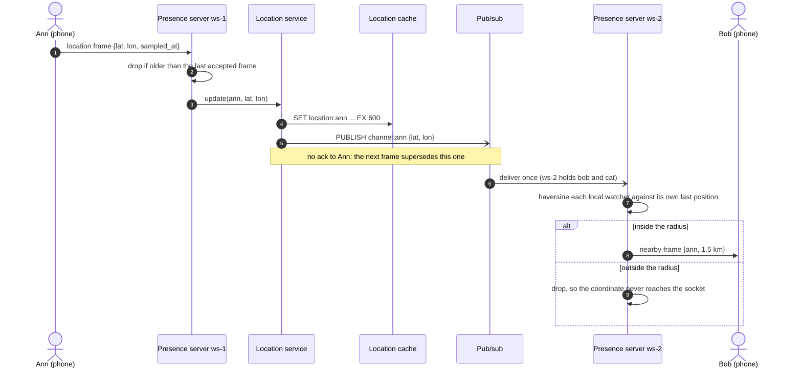
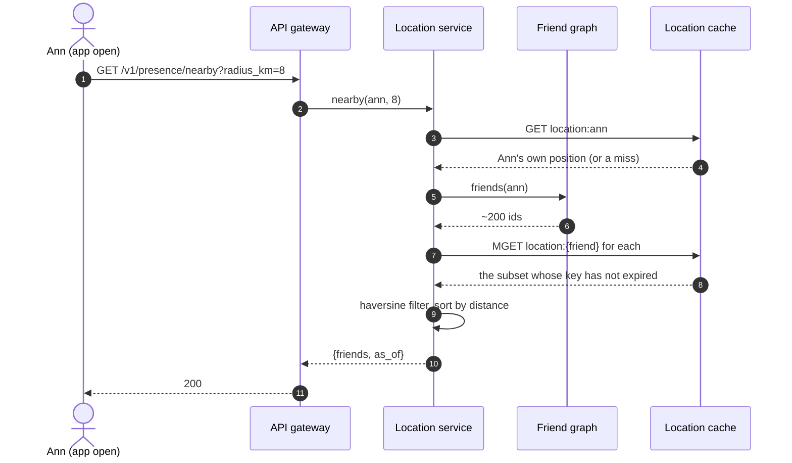
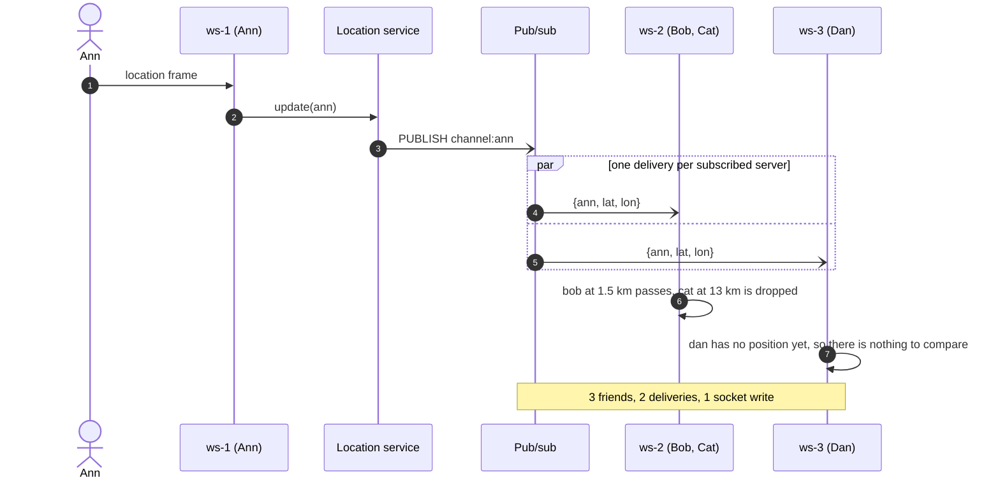
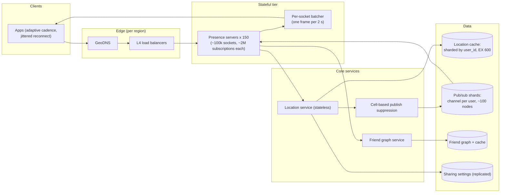

# Design Nearby Friends

## TL;DR

- Nearby Friends is a **fan-out problem, not a search problem**: the candidate set is a friend list you already have, so nothing needs a geospatial index. The work is routing 333k location updates per second to the right sockets and no others.
- The cruxes: (1) **update cadence** over a WebSocket, (2) **channel granularity** — one channel per user, subscribed once per server, (3) the **TTL cache** that makes "went offline" a non-event, (4) **opt-in privacy** and where the radius filter runs.
- The design handles 10M concurrent sharers with ~150 WebSocket servers, a ~1 GB Redis cache with a 600 s TTL, and pub/sub sized for ~6.7M deliveries/s.

## Problem statement and clarifying questions

"A user opts in and, while the app is open, sees which friends are currently within a few kilometres, updated live." The trap is to reach for a geo index in the first two minutes. Ask enough to establish that the candidate set is a friend list: that one fact changes every component downstream.

| Question | Assumption taken |
|---|---|
| Nearby *friends* or *strangers*? | Friends only: a small, known set per user. Strangers is [Yelp-shaped](proximity-service.md) and needs an index. |
| What is "nearby"? | A fixed 8 km radius, evaluated server-side: a product knob, not an architectural one. |
| Scale? | 100M DAU, 10% opted in and foregrounded at peak, ~200 friends each. |
| How fresh must a position be? | A marker may lag 30 s; anything older than 10 minutes is not shown. |
| Is the friend graph symmetric? | Yes. Mutual friendship lets a server subscribe once instead of checking permission per message. |
| Is sharing on by default? | No. Explicit opt-in, revocable in one tap, and revocation deletes the stored position. |
| Do we keep location history? | No. Current position only; history is a separate product with separate consent. |
| What happens when the app is backgrounded? | The client stops sending, the key expires, the friend disappears. |
| Precision? | Rounded to ~100 m; exact coordinates never leave the server tier. |

## Requirements

### Functional

- Opt in and out of sharing; opting out deletes the stored position at once.
- Publish the device position while the feature is in the foreground.
- Receive a live stream of friends inside the radius and the distance to each.
- On app open, get the nearby list without waiting for the next push.
- Show nothing — not a stale marker — once a friend's position goes stale.

### Non-functional

- Scale: 10M concurrent sharers at peak, ~333k updates/s, ~200 friends per user.
- Latency: a marker moves within 2 s p99 of the update being accepted; the app-open read returns in < 300 ms p99.
- Consistency: eventual. One version of a position exists — the newest — so nothing is reconciled and a lost update is corrected 30 s later.
- Durability: **none by design**. Positions live only in a cache with a 600 s TTL.
- Availability: 99.9%. It degrades to "no nearby friends right now", so it must never take the parent app down.

### Out of scope

Location history, nearby strangers or businesses, geofences and arrival alerts, indoor positioning, the parent app's friend graph and its authorisation model.

## Estimation

Using the [latency and estimation tables](../../cheatsheets/latency-and-estimation.md) (a day is ~10^5 s, peak is 3x average, ~100k ops/s per Redis node):

| Quantity | Arithmetic | Result |
|---|---|---|
| Concurrent sharers | 100M DAU x 10% opted in, foregrounded | 10M WebSockets |
| Write QPS (also cache writes) | 10M / one update per 30 s, one `SET ... EX 600` each | ~333k/s: 4 Redis nodes at ~100k ops/s, 6 with headroom |
| Pub/sub deliveries | ~200 friends x 10% online = ~20, each on a distinct server: 333k x 20 | ~6.7M/s — the real bottleneck |
| Socket writes after the filter | ~5% of online friends sit inside 8 km | ~333k frames/s fleet-wide |
| Cache size | 10M entries x ~100 B (user, lat, lon, time) | ~1 GB: sharded for throughput |
| WebSocket servers | 10M / 100k sockets per server, x1.5 headroom | ~150 servers |
| Bandwidth | 333k x ~100 B in, 333k x ~200 B out | ~33 MB/s in, ~67 MB/s out: not the constraint |
| Storage per year | positions never reach disk | 0; keeping history would cost 333k x 40 B x 86,400 = ~1.2 TB/day, ~36 TB for a 30-day window |

Two things to say out loud. 333k writes/s comes from 10M nearly-idle clients, so it is a *cadence* problem you solve on the device. And the fan-out multiplier is **20x**: the pub/sub tier does twenty times the ingest tier's work, so every optimisation that matters lives there.

## API design

One WebSocket per device carries the position stream; REST covers settings and the cold read.

| Endpoint or frame | Request | Response | Notes |
|---|---|---|---|
| `WS /v1/presence/connect` | token, `device_id` | `connected {server_id, radius_km, min_interval_s}` | The server subscribes to this user's friends' channels; `min_interval_s` tells the client how often it may talk. |
| frame `location` | `{lat, lon, sampled_at, accuracy_m}` | none | Fire and forget: the next frame supersedes this one. Frames older than the last accepted `sampled_at` are dropped. |
| frame `nearby` (server to client) | — | `{friend_id, lat, lon, distance_km, sampled_at}` | Pushed only for friends inside the radius; batched, so one frame may carry several. |
| `GET /v1/presence/nearby?radius_km=8` | — | `200 {friends, as_of}` | The app-open read. Bounded by the friend list, so no pagination; `as_of` discards late responses. |
| `PUT /v1/presence/sharing` | `{enabled}` + `Idempotency-Key` | `200 {enabled, effective_at}` | Idempotent; `enabled: false` deletes the cached position *before* it returns. |

The user id comes from the token, and no endpoint returns another user's raw coordinate: a position leaves the tier only as a rounded point plus a distance, only to a mutual friend inside the radius.

## Data model

**Nothing here is durable except the graph and the consent flag. The position is a cache entry with a TTL, and that is the whole point.**



- **Friend graph**: adjacency set per user (`friends:{id}`) in a key-value store sharded by `user_id`, read once per connect rather than once per update.
- **Sharing setting**: a small replicated row read on every connect. This is consent, so it is the one thing here with real durability and an audit trail.
- **Location key**: a Redis string per user, `EX 600`, sharded by `user_id` for throughput.
- **Sessions**: the registry the [chat system](chat-messenger.md) uses, `HSET sessions:{user_id} {device_id} {server_id}` — rebuildable, since a lost session costs one reconnect.
- **Subscriptions**: not stored centrally. They live in each server's memory as a refcount per channel, rebuilt from friend lists on restart.

## High-level design

**v1: a stateful WebSocket tier, a location service that writes the cache and publishes once, and pub/sub keyed by user.**



**Write path: one cache write, one publish, then a radius filter on each server that holds a watcher.**



**Read path: the app opens and asks once, before any push has arrived.**



Walk-through: the write path is two O(1) operations and no durable write, which is why one tier absorbs 333k updates/s. The expensive step is past the bus, where each server holding a watcher filters by distance against that watcher's own last position — which it already has, because the socket terminates there. The read path exists only so the map is not blank for the first 30 seconds.

## Deep dive: update cadence over WebSocket

"10M phones each sending a position — what stops this melting?" Cadence, set by the server and enforced on the client.

| Transport | Cost per update | Cost of idling | Fails when |
|---|---|---|---|
| `POST /location` | headers and a round trip: ~1 KB for 20 B of payload | Zero | 333k HTTPS/s of overhead; the radio wakes for each |
| Long polling | One held request per push | A held connection anyway | The push side, 20x the write side |
| SSE + HTTP writes | Clean for pushes | One connection | Two channels per feature |
| WebSocket | One frame, ~40 B of overhead | One TCP connection, a ping per 30 s | Servers become stateful, the price this design pays |

WebSocket wins for the reason it wins in the [chat system](chat-messenger.md): traffic is bidirectional and continuous, and HTTP's per-update overhead exceeds the update. The rules around it matter more than the choice:

- **A server-set floor.** `min_interval_s` comes back on connect and faster frames are dropped, so a bad client build cannot multiply your ingest rate.
- **Adaptive sampling on the device.** A stationary phone backs off from 30 s to 5 minutes; one moving at 50 km/h stays at 30 s. Most people are stationary most of the time, which is the difference between 333k/s and several times that.
- **Foreground only.** Background sampling costs battery and trust.
- **Monotonic `sampled_at`.** Mobile networks reorder, so a frame older than the last accepted one is dropped at the socket.

That last rule is why the design needs no conflict resolution. One device owns one key, so last-write-wins is *correct* rather than a compromise, and "last" is the client's own sample counter, not a wall clock two devices could disagree about.

## Deep dive: pub/sub fan-out to friends' channels

The crux: 333k updates/s times ~20 online friends is 6.7M deliveries/s, and the decision is what a *channel* is.

| Channel scheme | Deliveries per update | Subscriptions per server | Breaks when |
|---|---|---|---|
| Broadcast to every server | 150 (fleet size) | 1 | 50M deliveries/s, and every server filters traffic it never wanted |
| Per user, subscribed per socket | ~20 | 100k users x 200 friends = 20M | The same server receives the same update several times |
| **Per user, subscribed once per server** | ~20 servers | the deduplicated union, ~2M | Chosen: deliveries bounded by fleet size, not by friendship |
| Per geohash cell | 1 per cell, strangers included | the cells your users occupy | Dense cells become hot keys; you still filter by friendship on arrival |

Subscribe **once per server per channel** and keep a refcount of local watchers. A server holding three of Ann's friends receives her update once and writes three sockets; per-socket subscription receives it three times. The two differ modestly for a typical user, enormously for someone with 5,000 friends, and decisively in the thing that costs money: how many subscriptions the tier tracks.

**One update, one publish, one delivery per subscribed server, then a local filter.**



`ChannelBus` reports the fan-out width of every publish; `PresenceServer` holds the refcount and filters against positions it already owns:

```python title="code/hld/presence_pubsub.py — per-user channels"
--8<-- "code/hld/presence_pubsub.py:bus"
```

```python title="code/hld/presence_pubsub.py — one subscription per server, filter locally"
--8<-- "code/hld/presence_pubsub.py:server"
```

What the module prints: ann's three friends, two on one other server, cost one publish.

```text
ws-1 subscribes to ['bob', 'cat', 'dan']; ws-2 subscribes to ['ann']
ann's update: 1 publish -> 1 server for 3 friends
bob's socket: ['ann at 1.5 km']
cat's socket: [] -> 13 km away, filtered on the server
ann's socket: ['bob at 1.5 km']
ann on app open: [('bob', 1.5)]
after 700 s of silence, live keys = ['ann']
ann on app open: [] -> expiry is the offline signal
opt-out: cat has not opted in to location sharing
ws-2 emptied: ann's update now reaches 0 servers, so it stops at the cache
```

Note where the filter runs. Filtering on the client saves a hop and creates a privacy incident: it hands a user the exact position of friends nowhere near them.

## Deep dive: the TTL cache and the Redis GEO alternative

The location store is a cache with a 600 s TTL and no backing store, and every awkward case falls out of that decision. "Went offline" needs no event: the client stops refreshing, the key expires, the friend vanishes on the next read — no disconnect handler, no tombstone, no race between a crash and a cleanup job. A crashed server loses nothing: clients reconnect and rewrite their keys at the natural update rate. Sizing is trivial too — 10M entries at ~100 B is ~1 GB, sharded for the 333k writes/s, not for capacity.

```python title="code/hld/presence_pubsub.py — the TTL cache"
--8<-- "code/hld/presence_pubsub.py:cache"
```

The alternative an interviewer will float is **Redis GEO** (`GEOADD` plus `GEOSEARCH`), or a geohash index of the kind the [geospatial indexing](../fundamentals/geospatial-indexing.md) page builds. It answers "who is within 8 km of this point" without knowing the friends — the right tool for [proximity search](proximity-service.md), the wrong one here. A friend list of 200 is cheaper to intersect than a city cell of 50,000 strangers, a geo index adds a hot-cell problem, and it creates a query surface ("who is near me") this product must never expose.

One place the two worlds do meet, worth offering unprompted: **publish suppression**. Keep a coarse cell id beside each cached position, compare the sender's cell to the cells their friends were last seen in, and skip the publish when no friend is within a cell radius. At 6.7M deliveries/s that is the cheapest large saving available.

## Deep dive: privacy, opt-in and offline handling

Location is the most sensitive data most products handle, and a consumer-side interviewer will spend real time here.

- **Opt-in is a hard gate on the write path**, not a display filter. `update_location` refuses a coordinate from a user whose flag is off, so a client bug cannot leak a position the server would then have to remember not to show.
- **Opting out deletes.** The `DEL` happens before the API call returns; the TTL is a backstop.
- **Symmetry.** Only mutual friends can subscribe, which makes a subscription safe to grant once at connect instead of authorising 6.7M deliveries per second.
- **Server-side filtering.** Outside the radius a client learns nothing, not even that the friend is sharing.
- **Precision.** Round to ~100 m: the gap between "Bob is nearby" and "Bob is at this address" is the gap between a feature and a stalking tool.
- **Retention.** Nothing reaches disk. If history is ever wanted, price it out loud (~1.2 TB/day) as separate consent, store and deletion path.

Offline handling needs no machinery: a phone that loses signal stops refreshing and disappears 600 s later. There is no queue of missed updates, because a missed position has no value once a newer one exists. This is the mirror image of chat, where every message must survive; here **staleness is the failure mode you want**.

!!! warning "Common mistake"
    Reaching for a geohash or quadtree index in the first two minutes. Nearby Friends has no search step. Building an index here costs you a shard map, a hot-cell problem and a "who is near me" query surface — and buys nothing, because 200 candidates need no index.

## Scaling, bottlenecks and failure modes

**v2: pub/sub sharded by the publishing user, a suppression stage, per-socket batching and a regional split.**



A presence server holds 100k sockets and, more importantly, ~2M channel subscriptions derived from their friend lists, so losing one is not like losing a stateless replica. Routing stays trivial: no write has to find a particular user's server, so the balancer uses least-connections and a new server takes new sockets and builds its own subscription set.

What breaks first:

- **Pub/sub delivery rate.** 6.7M/s is ~67 Redis nodes at ~100k ops/s, ~100 with headroom. This decides the bill; if it saturates, widen the batch window before adding nodes.
- **Subscription storms.** Restarting 30 servers asks for ~60M subscribe operations in minutes. Roll a few percent of the fleet at a time, cap new connections at the balancer, and make subscribe idempotent.
- **Uneven interest.** A server holding several people with enormous friend lists takes disproportionate delivery load. Alert on deliveries per server, not sockets.
- **Hot channels.** A user with 5,000 friends publishes to the whole fleet. Cap subscribers per channel and demote the overflow to the pull path, like the celebrity split in the [news feed](news-feed.md).
- **Cache shard loss.** Positions vanish for that shard's users and return within one 30 s cycle; the recovery procedure is "wait".
- **Multi-region.** Pin a user to a home region and keep their channel there; friends elsewhere pay one ~70 ms hop, invisible against a 30 s cadence.
- **Degradation order.** Widen the batch window, then suppress publishes for distant friends, then fall back to the app-open read alone.

## Trade-offs summary

| Decision | Chosen | Alternatives | Why |
|---|---|---|---|
| Candidate set | Friend list | Geohash or quadtree index | 200 known candidates need no index; an index adds hot cells and a "who is near me" surface |
| Transport | WebSocket, foreground only | HTTP per update, long polling | Per-update HTTP overhead exceeds the payload; the push side is 20x the write side |
| Channel granularity | Per user, once per server | Broadcast, per socket, per cell | Deliveries bounded by fleet size; subscriptions deduplicated per server |
| Position store | Redis, 600 s TTL, no backing store | Durable table plus offline events | Expiry replaces the whole offline and tombstone machinery |
| Radius filter | On the watcher's server | On the client, or centrally | Client-side filtering leaks exact positions; central filtering needs every position in one place |
| Consent | Hard gate on the write path | Filter at read time | A position never accepted cannot leak; one writer per key also removes every version vector |

## Interviewer follow-ups

??? question "Why not just use Redis GEO and be done with it?"
    It answers the wrong query. `GEOSEARCH` finds everyone near a point; you want that intersected with a 200-element friend list, and the friend list is the cheaper side to start from. It also puts a whole dense city into one hot cell. Where it does earn its keep is publish suppression.

??? question "A user has 5,000 friends. What breaks?"
    Their updates fan out to every server in the fleet, so the publish cost is the fleet size rather than the friend count. Cap subscribers per channel and move the overflow to the pull path. At 150 subscribers and one update per 30 s that is 5 deliveries/s — small, but it does not improve with sharding.

??? question "How do you stop someone tracking a friend continuously?"
    Name the layers: sharing is mutual and opt-in, positions are rounded to ~100 m, nothing outside the radius is disclosed (not even that the friend is sharing), nothing is retained, and the rate a client learns anything is capped by the batch window rather than by how fast it polls.

??? question "What if the pub/sub tier goes down entirely?"
    The feature degrades to the read path: clients still write positions and still get a correct answer on app open or pull-to-refresh. Only live movement stops. That is a legitimate product state, which is why the target is 99.9% and not four nines.

??? question "How is this different from presence in a chat system?"
    Same registry, same per-server channels, different ratio. Chat presence flips a boolean a few times an hour; this pushes a coordinate every 30 s. Everything that is a nice-to-have there — debouncing, batching, subscribing once per server — is mandatory here.

??? question "Two updates from the same phone arrive out of order."
    The socket drops the older one by comparing `sampled_at` to the last accepted value. There is exactly one writer per key, so there is nothing to reconcile and no version metadata anywhere in the design.

!!! tip "Interview tip"
    Open with the sentence that reframes the problem: "the candidate set is a friend list, so this is fan-out, not search." It shows you spotted the trap and earns you the right to spend forty minutes on the pub/sub tier, where the 6.7M deliveries per second actually live.

## 45-minute pacing

| Minutes | What to say and draw |
|---|---|
| 0–5 | Clarify: friends not strangers, 8 km, opt-in, 10% of 100M DAU sharing, 30 s cadence, no history. State the reframe. |
| 5–9 | Estimation: 10M sockets, 333k updates/s, 20x fan-out to ~6.7M deliveries/s, ~1 GB cache, ~150 servers. |
| 9–13 | API over one WebSocket plus the app-open read; data model with the TTL key as the only "storage". |
| 13–22 | v1 diagram; narrate the write path (cache write, one publish, per-server filter), then the read path. |
| 22–36 | Deep dives: cadence and adaptive sampling, channel granularity, the TTL cache and why not Redis GEO. |
| 36–42 | Privacy: hard gate on write, delete on opt-out, server-side filter, rounding, no retention. Then failover. |
| 42–45 | Bottlenecks, degradation order, trade-offs. |

## Related

- [Design a chat system](chat-messenger.md) — the session registry and per-server pub/sub, here at 100x the update rate
- [Geospatial indexing](../fundamentals/geospatial-indexing.md) — geohash cells and haversine, used only for publish suppression
- [Design Yelp (proximity service)](proximity-service.md) — the opposite problem: unknown candidates, so an index is mandatory
- [Design a news feed](news-feed.md) — where "cap the fan-out, demote the rest to the pull path" comes from
- [Networking for system design](../fundamentals/networking-essentials.md) — WebSocket versus SSE and long polling
- Primary sources: RFC 6455 (The WebSocket Protocol); Redis documentation on keyspace expiry and sharded pub/sub
