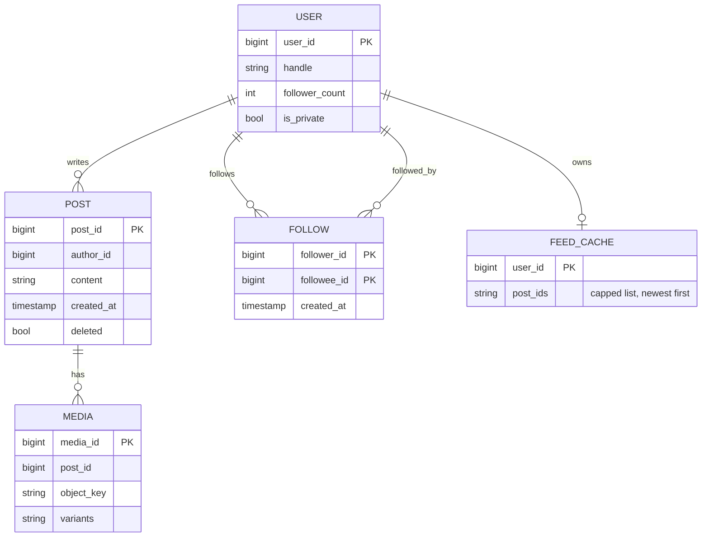
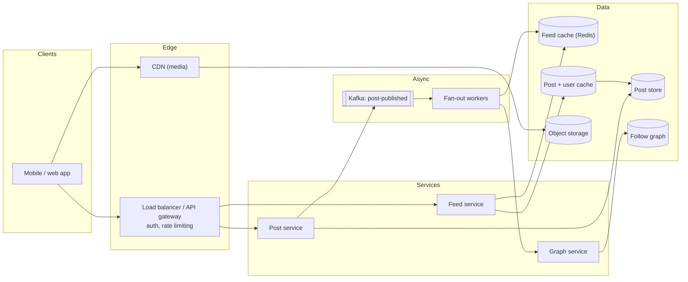
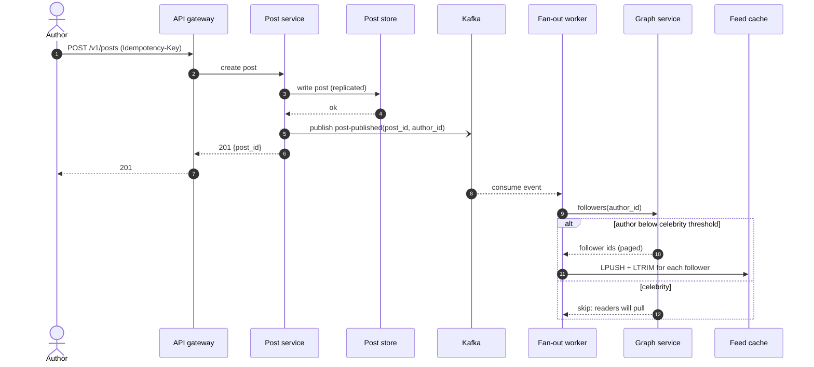
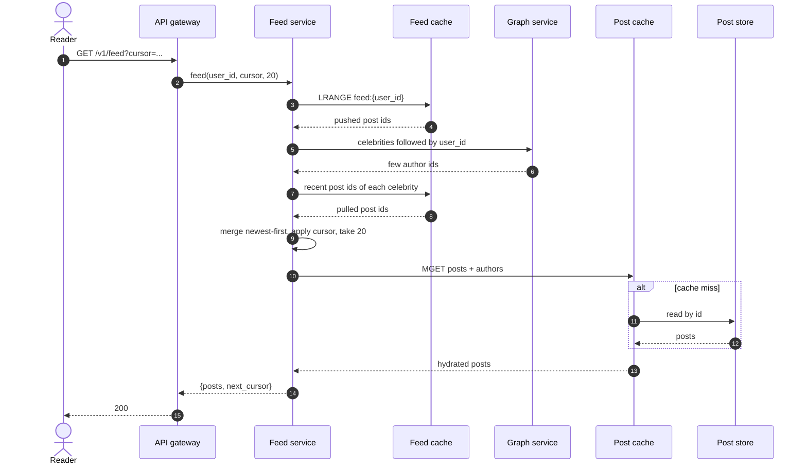
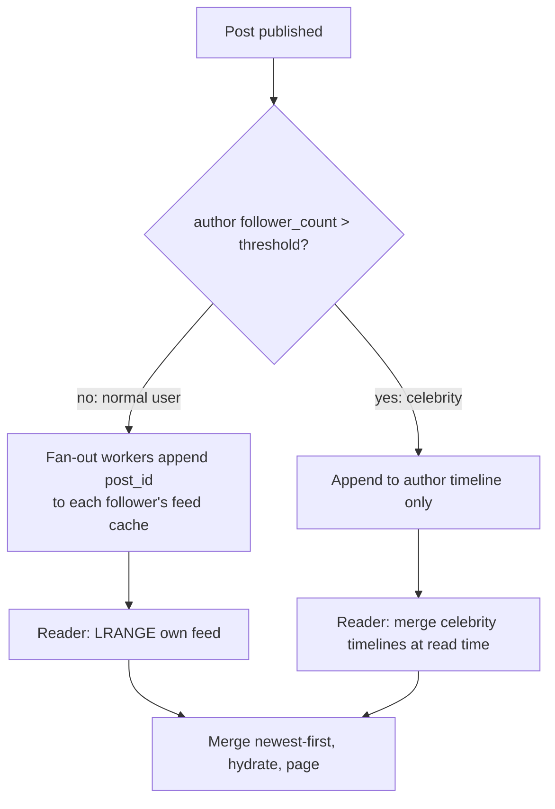
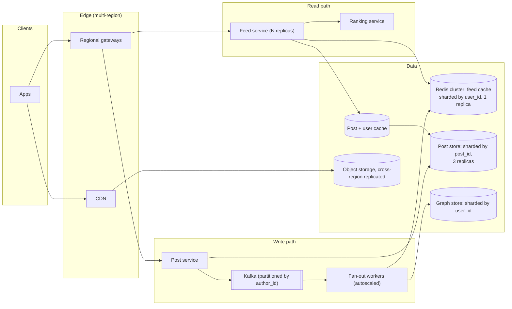

# Design a news feed

## TL;DR

- A news feed is a **write-light, read-heavy fan-out problem**: ~1.7k posts/s become ~175k feed reads/s, so you precompute feeds for most users and assemble on read for the few accounts with millions of followers.
- The cruxes an interviewer probes: (1) fan-out on write vs on read vs **hybrid**, (2) the **feed cache** (IDs, not posts; capped; rebuilt on miss), (3) **ranking and cursor pagination**, (4) the **media pipeline** for Instagram-style feeds, (5) **deletes, edits and privacy** without rewriting millions of caches.
- The design below handles 300M DAU with a Redis feed cache of a few TB, Kafka-driven fan-out workers, and a CDN in front of media.

## Problem statement and clarifying questions

"Design the home timeline for a social network: users follow other users, publish posts (text, optionally images), and see a feed of posts from the people they follow." Before drawing anything, pin the requirements down — the answers decide whether you precompute feeds at all.

| Question | Assumption taken |
|---|---|
| Chronological or ranked feed? | Start chronological; ranking is an add-on stage (deep dive 3). |
| Scale: DAU, posts per user, feed reads per user? | 300M DAU, 0.5 posts/user/day, 50 feed reads/user/day. |
| Follower distribution? | Median ~200 followers; a long tail of accounts with 1M–100M followers. |
| Is the follow graph directed? | Yes (Twitter-style "follow"); friendships are a symmetric special case. |
| Media? | Images yes (Instagram variant in deep dive 4); video out of scope. |
| Latency target for the feed? | p99 < 500 ms end to end; feed "freshness" of a few seconds is acceptable. |
| Do deleted posts have to vanish instantly? | Within seconds; we tolerate one stale read. |
| Mobile clients with pagination? | Yes: infinite scroll, 20 posts per page. |

## Requirements

### Functional

- Publish a post (text up to 500 chars, up to 4 images); delete or edit a post.
- Follow and unfollow users.
- Fetch the home feed: newest-first posts from followed users, paginated.
- Show author, timestamp, content, media, and like/comment counts (counts are served by a separate service).

### Non-functional

- Availability over consistency: a feed that is a few seconds stale is fine; a feed that fails to load is not. Target 99.99% for reads.
- Read latency p99 < 500 ms; publish acknowledged in < 200 ms (fan-out completes asynchronously).
- Durability: a published post is never lost (replicated store, async fan-out can be retried).
- Scale: 300M DAU, peak 500k feed reads/s, peak 5k posts/s.

### Out of scope

Ranking model training, ads insertion, notifications, search, comments and likes services (we only consume their counters), video.

## Estimation

Using the [latency and estimation tables](../../cheatsheets/latency-and-estimation.md) (a day is ~10^5 s, peak is 3x average):

| Quantity | Arithmetic | Result |
|---|---|---|
| Posts per day | 300M DAU x 0.5 | 150M/day |
| Post write QPS | 150M / 10^5 | ~1.7k/s average, ~5k/s peak |
| Feed read QPS | 300M x 50 / 10^5 | ~175k/s average, ~500k/s peak |
| Fan-out writes (cache appends) | 150M posts x 200 followers | 30B/day = ~350k/s average, ~1M/s peak |
| Text storage | 150M x 1 KB | 150 GB/day, ~55 TB/year (x3 replicated: ~165 TB/year) |
| Media storage | 10% of posts x 1 MB | 15 TB/day — object storage + CDN, never the database |
| Feed cache | 300M users x 800 entries x 16 B (post id + timestamp) | ~3.8 TB if every user is cached; ~1.5 TB if only the 40% active in the last week |
| Feed egress (before CDN) | 175k/s x 20 posts x 1 KB | 3.5 GB/s = 28 Gbps across the API tier |

Two things to say out loud: the read/write ratio is **100:1**, which justifies precomputing feeds; and fan-out writes are **200x** post writes, which is why fan-out must be asynchronous and why a 50M-follower account cannot be fanned out at all (50M cache appends for one post).

## API design

| Endpoint | Request | Response | Notes |
|---|---|---|---|
| `POST /v1/posts` | `{content, media_ids[]}` + header `Idempotency-Key` | `201 {post_id, created_at}` | Ack after the post is durably stored; fan-out is async. Retries with the same key return the same `post_id`. |
| `GET /v1/feed?limit=20&cursor=...` | — | `200 {posts: [...], next_cursor}` | Cursor is opaque (`base64(created_at|post_id)`); `next_cursor` is `null` on the last page. |
| `DELETE /v1/posts/{id}` | — | `204` | Tombstone; caches are filtered lazily. |
| `POST /v1/users/{id}/follow` / `DELETE ...` | — | `204` | Idempotent. |
| `POST /v1/media/uploads` | `{content_type, size}` | `200 {upload_url, media_id}` | Presigned URL for direct upload to object storage (deep dive 4). |

Every endpoint is authenticated; `user_id` comes from the token, never from the body.

## Data model

**Posts and follows are stored separately from the feed cache; the cache holds IDs only.**



Store choices, with the one sentence to say for each:

- **Posts**: a wide-column or key-value store partitioned by `post_id` (Cassandra/DynamoDB) — writes are append-only and reads are by id. `post_id` is a Snowflake-style time-sortable 64-bit id so ordering never needs a join.
- **Follow graph**: a key-value store with two adjacency lists per user (`followers:{id}`, `following:{id}`), sharded by user id; a graph database is overkill for "who follows whom".
- **Feed cache**: Redis lists (or sorted sets keyed by timestamp) per user, capped at 800 entries, sharded by `user_id` with consistent hashing.
- **Post cache and user cache**: Redis/Memcached in front of the stores, because the feed assembly step hydrates 20 ids into 20 posts on every read.
- **Media**: object storage (S3-like) + CDN; the database only stores keys.

## High-level design

**v1: a stateless API tier, a fan-out service behind a queue, and three caches in front of the stores.**



**Write path: acknowledge once the post is durable; fan out in the background.**



**Read path: IDs from the cache, celebrities merged in, then hydrate and page.**



Walk-through: the post service never waits for fan-out, so publish latency is one durable write plus one Kafka produce. Fan-out workers do the expensive part (hundreds of cache appends per post) at their own pace, and a backlog only means feeds lag by seconds. The feed service does no ranking joins: it reads a short list of ids and hydrates them from caches.

## Deep dive: fan-out on write vs read vs hybrid

The probing question is "what happens when Taylor Swift posts?" Three options:

| Strategy | Publish cost | Read cost | Freshness | Breaks when |
|---|---|---|---|---|
| Fan-out on write (push) | O(followers) cache appends per post | O(1): read your list | Seconds (queue lag) | A 50M-follower post = 50M writes; inactive users get feeds they never read |
| Fan-out on read (pull) | O(1) | O(following) reads + merge per request | Instant | 500k feed reads/s each touching hundreds of timelines |
| Hybrid | Push for normal authors, pull for celebrities | O(1) + O(celebrities followed) | Seconds / instant | Threshold tuning; a user following 500 celebrities |

The hybrid is the standard answer: push for authors under a threshold (say 10k followers), pull for the rest. Readers follow few celebrities (tens, not thousands), so the read-time merge stays cheap, and one celebrity post costs one timeline append instead of millions of cache writes.

**How a post is routed.**



The whole mechanism fits in one module. `post()` pushes or records; `get_feed()` merges both sources with `heapq.merge` and filters tombstones:

```python title="code/hld/fanout.py — the service"
--8<-- "code/hld/fanout.py:service"
```

Details worth saying: fan-out for normal users is still done by **workers consuming Kafka**, not inline, because 200 appends at 1.7k posts/s is 350k Redis writes/s; workers batch per shard and are idempotent (appending the same post id twice is filtered on read). Skip inactive followers (no login in 30 days) — their feed is rebuilt from the pull path if they return, which halves the fan-out bill.

## Deep dive: feed cache design

The cache stores **post ids, not posts**. A post is 1 KB; an id plus timestamp is 16 B. Storing ids keeps the per-user footprint at ~13 KB for 800 entries, makes edits free (the post cache is the single source of content), and makes deletes a tombstone check.

- **Structure**: Redis list per user (`LPUSH` + `LTRIM feed:{user_id} 0 799`) or a sorted set scored by timestamp when you need range queries by time. Lists are cheaper; sorted sets make "posts since cursor" a single `ZREVRANGEBYSCORE`.
- **Sizing**: ~1.5–4 TB depending on how many users you keep warm. At 64 GB per node that is 25–60 Redis nodes, sharded by `user_id` with consistent hashing and one replica each.
- **Cold users and misses**: a missing key means "rebuild from the pull path": read the following list, take the latest N posts from each, merge, and write the result back. Bound the rebuild (top 200 followees by recency) so a user following 5,000 accounts cannot take down a shard.
- **Hydration**: 20 ids become 20 `MGET`s against the post cache (Memcached/Redis, 95%+ hit rate because recent posts are hot), then user cache for author handles and avatars.
- **Why not cache full feeds as rendered JSON?** Because every like count, edit and privacy change would invalidate it; ids are stable, content is not.

## Deep dive: ranking and pagination

Chronological order is just `sort by (created_at, post_id) desc`. Ranked feeds add a stage: candidate generation (the cached ids plus pulled celebrity posts, a few hundred items) → a ranking service scores them with features (author affinity, recency, engagement predictions) → top 20 returned. The cache stays chronological; ranking happens at read time on a small candidate set, which is why the two-stage design keeps p99 under 500 ms.

Pagination must be **cursor-based**, never offset-based: with `?page=2` a new post arriving between requests shifts every item and the client sees duplicates or skips. The cursor encodes the sort key of the last item returned, so the next page is "everything strictly older than this", which is stable under inserts:

```python title="code/hld/fanout.py — opaque cursor"
--8<-- "code/hld/fanout.py:cursor"
```

For ranked feeds the cursor carries the ranking score plus the post id (or a session id for a frozen candidate set), because the order is no longer time.

## Deep dive: media (the Instagram variant)

Images never pass through the API tier. The client asks for a **presigned upload URL**, uploads the original straight to object storage, then publishes the post with the returned `media_id`. An async pipeline (triggered by an object-created event) produces thumbnails and resized variants, writes the variant keys to the `MEDIA` row, and warms the CDN for the author's followers' regions if the author is popular.

What changes in the feed: posts carry variant URLs, the client picks a size, and 95%+ of bytes are served by the CDN. What to mention: deduplicate identical uploads by content hash, strip EXIF for privacy, and serve via signed CDN URLs for private accounts.

## Deep dive: deletes, edits and privacy

- **Delete**: mark the post `deleted` (tombstone) and publish a `post-deleted` event; the feed service filters tombstones on read, and a low-priority sweeper removes ids from caches later. Nobody scrubs 50M caches synchronously.
- **Edit**: since caches store ids, an edit is one write to the post store plus a post-cache invalidation. Feeds reflect it on the next read.
- **Privacy and blocks**: evaluate at read time, after hydration — "is this author private and am I an approved follower? Has the author blocked me?" — against a cached allow/deny set. Precomputing privacy into the feed cache is a bug factory because relationships change.
- **Unfollow**: remove the edge; optionally purge that author's ids from the follower's cache lazily. A stale post from an unfollowed author for a few seconds is acceptable.

## Scaling, bottlenecks and failure modes

**v2: sharded stores, a Redis cluster for feeds, regional read paths and a separate ranking stage.**



What breaks first, and what you do about it:

- **Fan-out lag** during a posting spike: Kafka buffers it; workers autoscale; users see feeds a minute stale, which is the degradation you want. Partition the topic by `author_id` so one author's posts stay ordered.
- **Hot celebrity reads** (everyone opening the app after a big post): the pulled timeline of that author is one hot key — replicate it to several cache shards (key suffixing) and let the post cache absorb hydration.
- **Thundering herd on cache-miss rebuilds** after a Redis shard loss: a single-flight lock per user key, plus replicas so a shard failover does not cold-start millions of feeds at once.
- **Post store hot partitions**: time-sortable ids shard by id hash, not by time, so writes spread across partitions.
- **Region failure**: feeds are rebuildable caches, so a region can be served from the post store while its cache warms; media is replicated cross-region and fronted by the CDN.
- **Consistency**: eventual everywhere except "your own post appears in your own feed immediately", which the client handles by inserting it locally (read-your-writes at the edge).

## Trade-offs summary

| Decision | Chosen | Alternatives | Why |
|---|---|---|---|
| Fan-out | Hybrid push/pull | Pure push, pure pull | Push is cheap for 99.9% of authors; pull bounds the celebrity cost |
| Cache contents | Post ids | Rendered posts | Edits, deletes and counters stay cheap; 60x smaller |
| Feed order | Chronological cache + read-time ranking | Ranked cache | Ranking features change constantly; caches should store stable facts |
| Pagination | Opaque cursor | Offset | Stable under inserts; prevents forged offsets |
| Publish ack | After durable write, before fan-out | After fan-out | 200 ms ack vs seconds; fan-out is retryable |
| Post store | Wide-column by post_id | Relational sharded by user | Append-only, by-id reads; no joins needed |
| Deletes | Tombstone + lazy filter | Synchronous scrub | Cannot touch 50M caches per delete |

## Interviewer follow-ups

??? question "How do you pick the celebrity threshold?"
    Measure the fan-out cost curve: the threshold is where pushing one post costs more than the read-time merges it saves. In practice 5k–50k followers. It can be per-author and adaptive — an account that suddenly goes viral is switched to pull mode by the fan-out worker when its follower count crosses the line.

??? question "What if a user follows 1,000 celebrities?"
    The read-time merge degrades. Cap the pull side: merge only the top K celebrities by recent activity, or precompute a per-user "celebrity digest" hourly. Mention that this is rare and measurable.

??? question "How do you guarantee a user sees their own post immediately?"
    Client-side insertion (optimistic UI) plus writing the id into the author's own feed cache synchronously in the post service; the rest of the world gets it via fan-out.

??? question "Where does 'exactly once' matter here?"
    Nowhere in the feed — duplicates are filtered by id on read. Idempotency matters at publish: the `Idempotency-Key` prevents double posts when a client retries a timed-out request.

??? question "How would you make it ranked?"
    Keep the cache chronological; add candidate generation (cache + pulled + maybe recommended posts), a feature store, and a ranking service that scores a few hundred candidates per request. Ship a cursor that encodes the score.

??? question "How do you handle a Redis shard dying?"
    Replica promotion; if both die, feeds for that shard rebuild on demand via the pull path with single-flight protection. Feeds are caches: losing one is latency, not data loss.

??? question "Why Kafka instead of calling the fan-out service directly?"
    Decouples publish latency from fan-out, absorbs spikes, allows replay after a worker bug, and gives per-author ordering via partitioning.

!!! tip "Interview tip"
    Lead with the ratio: "reads are 100x writes and fan-out writes are 200x post writes, so I will precompute feeds asynchronously and special-case celebrities." That single sentence shows you have done the estimation and already know the crux.

!!! warning "Common mistake"
    Describing fan-out on write and stopping there. The interviewer is waiting for the celebrity problem. If you do not raise it yourself, you have handed them their first "what if" — and your design has a 50M-write hole in it.

## 45-minute pacing

| Minutes | What to say and draw |
|---|---|
| 0–5 | Clarify: chronological first, 300M DAU, follower skew, media yes, freshness in seconds is fine. |
| 5–9 | Estimation table: 1.7k posts/s, 175k reads/s, 350k fan-out writes/s, ~4 TB feed cache. State the 100:1 ratio. |
| 9–14 | API (post, feed with cursor, follow) and the data model; say "ids in the cache, posts in the store". |
| 14–24 | v1 diagram; narrate the write path (ack, then Kafka, then workers) and the read path (cache, merge, hydrate). |
| 24–40 | Deep dives in this order: hybrid fan-out, feed cache sizing and rebuild, cursor pagination and ranking stage; media and deletes if time allows. |
| 40–45 | Bottlenecks (fan-out lag, hot celebrity keys, thundering herd) and the trade-offs table. |

## Related

- [Caching and CDNs](../fundamentals/caching-and-cdn.md) — cache-aside, single-flight and hot keys used throughout
- [Messaging, queues and Kafka internals](../fundamentals/messaging-and-event-streaming.md) — why fan-out rides on a partitioned log
- [Partitioning, sharding and consistent hashing](../fundamentals/partitioning-and-consistent-hashing.md) — how the feed cache and post store are sharded
- [Back-of-envelope estimation](../fundamentals/estimation.md) — the method behind the numbers above
- [Design a unique ID generator](unique-id-generator.md) — time-sortable post ids
- [Mock HLD interview: news feed](../../mocks/mock-hld-news-feed.md) — the same design as a 45-minute transcript
