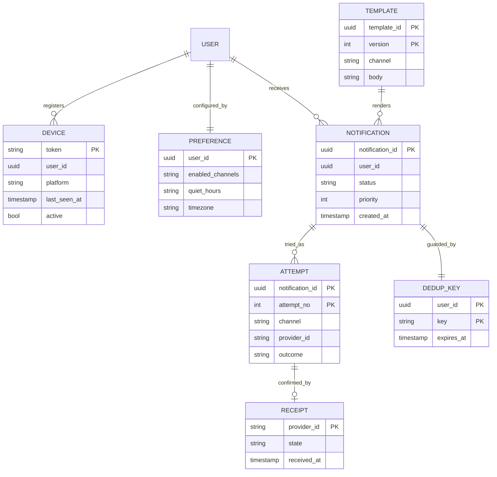
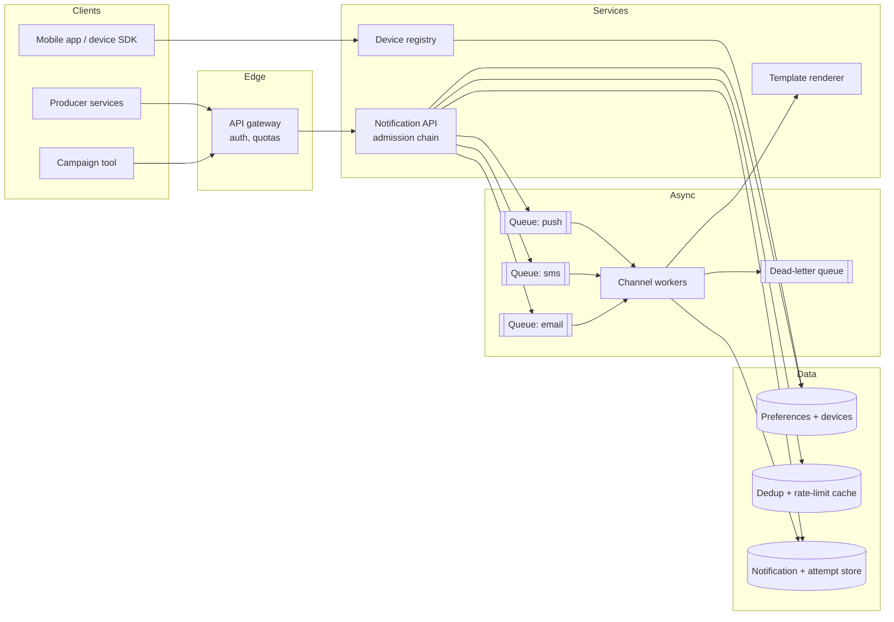
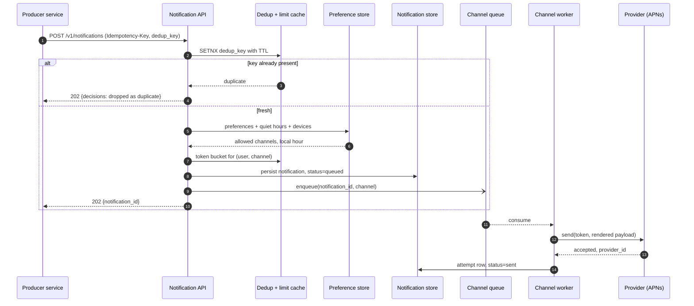
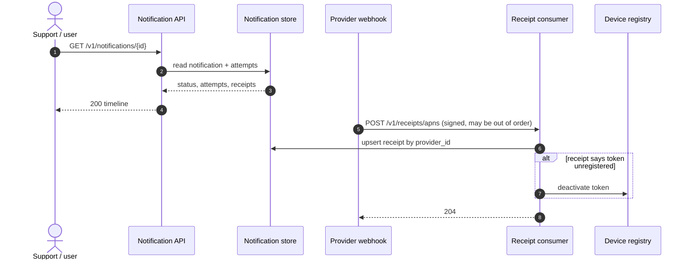
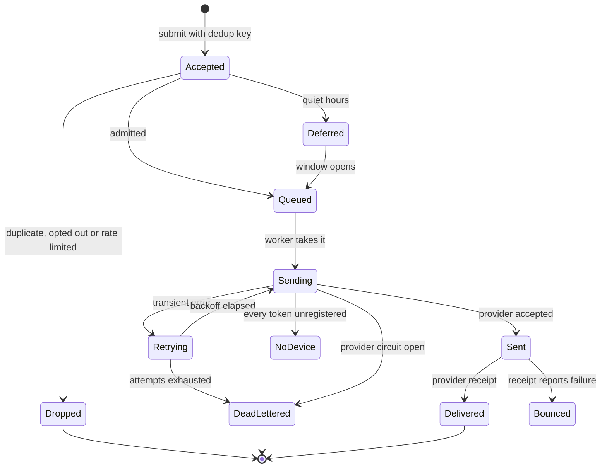
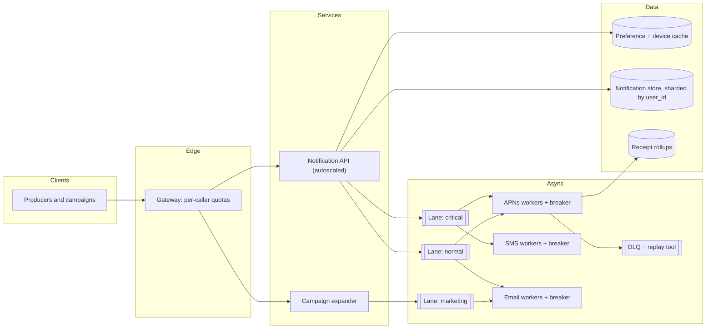

# Design a notification system

## TL;DR

- A notification system is a **fan-out pipeline wrapped in an admission chain**: taking the event is trivial, deciding whether this user should get this message on this channel right now is the design.
- The cruxes an interviewer probes: (1) the **channel abstraction** over providers you do not control, (2) **reliability** — a queue per channel, retries, a dead-letter queue, (3) **dedup, idempotency, preferences, quiet hours and rate limits**, (4) the **device-token lifecycle** and delivery tracking.
- The failure everyone forgets: your providers are third parties with their own rate limits and outages, so every design decision has to answer "what happens when APNs is down for twenty minutes?"

## Problem statement and clarifying questions

"Design the service every other team calls when they need to tell a user something: a push, an SMS, an email." The trap is to draw a queue and a worker and stop. The interesting parts are what you refuse to send, and what happens when the provider refuses to take it.

| Question | Assumption taken |
|---|---|
| Which channels? | Push (APNs, FCM), SMS (Twilio), email (SES). In-app inbox is a fourth, out of scope. |
| Scale? | 100M DAU, ~5 notifications per user per day: 500M/day, roughly 80% push, 15% email, 5% SMS. |
| Broadcasts? | Yes: campaigns up to 10M users, expected to land within 10 minutes. |
| Latency targets? | Critical (OTP, fraud alert) under 5 s p99; normal under 60 s; marketing within the hour. |
| Delivery guarantee? | At-least-once to the provider, effectively-once to the user via a dedup key. |
| Who owns content? | Templates live here; callers send a template id plus variables, never rendered text. |
| Preferences and quiet hours? | Yes, per user and per category, with a per-user timezone. |
| Do we track opens and clicks? | Delivery receipts yes, opens best-effort from client telemetry. |
| Notification size? | ~1 KB per stored record including template variables. |

## Requirements

### Functional

- Accept a notification request for one user or a batch, with a template, priority and dedup key.
- Route to the channels the user allows, honouring preferences, quiet hours and per-user limits.
- Deliver through the right provider, retrying transient failures and dead-lettering the rest.
- Register and expire device tokens; ingest provider delivery receipts.
- Expose the status of any notification: accepted, dropped and why, sent, delivered, bounced.

### Non-functional

- Throughput: ~5k notifications/s average, ~15k/s peak, plus campaign bursts of ~17k/s (10M in 10 minutes).
- Latency: critical p99 under 5 s from accept to provider hand-off; normal under 60 s.
- Durability: an accepted notification is persisted before the 202; it is never silently lost.
- Availability: 99.9% for the accept API (8.76 hours a year). A provider outage degrades delivery latency, never acceptance.
- Consistency: eventual for status and receipts; strict only for the dedup key and the token registry.

### Out of scope

In-app inbox and feed rendering, campaign targeting and segmentation, A/B testing, unsubscribe compliance workflows, WebSocket push to connected clients.

## Estimation

Using the [latency and estimation tables](../../cheatsheets/latency-and-estimation.md) (a day is ~10^5 s, peak is 3x average, a record with metadata is ~1 KB):

| Quantity | Arithmetic | Result |
|---|---|---|
| Notifications/day | 100M DAU x 5 | 500M/day |
| Accept QPS | 500M / 10^5 | ~5k/s, ~15k/s peak |
| Per channel | 80/15/5 split of 5k/s | push ~4k/s, email ~750/s, SMS ~250/s |
| Campaign burst | 10M users / 600 s | ~17k/s on top of the steady rate |
| Worker nodes | 15k/s peak at ~1k QPS per node, x2 headroom | ~30 sender nodes, mostly waiting on providers |
| Queue throughput | 5k/s x 1 KB | 5 MB/s in, far under one Kafka broker's ~100 MB/s |
| Storage | 500M x 1 KB x 365 | ~180 TB/year (x3 replicas: ~540 TB); 30 days hot is ~15 TB |
| Receipts | one per sent notification | doubles the event rate: ~10k/s combined, so aggregate, do not store raw forever |
| Device tokens | 100M users x 1.5 devices x 100 B | ~15 GB: cacheable in memory |
| Dedup keys | 5k/s x 300 s TTL x 64 B | ~1.5M live keys, ~100 MB in Redis |

Two things to say out loud. **The steady state is easy and the burst is not**: 5k/s is one modest service, but a 10M-user campaign triples peak load in an instant, so campaigns get their own low-priority lane and never share a queue with an OTP. And **receipts double your write volume** — a naive design stores two rows per notification and finds its tracking store is bigger than the notifications themselves.

## API design

| Endpoint | Request | Response | Notes |
|---|---|---|---|
| `POST /v1/notifications` | `{user_id, template_id, data, priority, dedup_key, channels?}` + `Idempotency-Key` | `202 {notification_id, decisions[]}` | `decisions` reports per channel: queued, deferred, or dropped with a reason. |
| `POST /v1/notifications/batch` | `{template_id, audience_id, priority}` | `202 {batch_id}` | Campaigns; expanded asynchronously into per-user notifications. |
| `GET /v1/notifications/{id}` | — | `200 {status, attempts[], receipts[]}` | Read model; eventually consistent within seconds. |
| `PUT /v1/users/{id}/preferences` | `{channels[], categories[], quiet_hours, timezone}` | `204` | Strongly consistent: an opt-out must take effect immediately. |
| `POST /v1/devices` / `DELETE /v1/devices/{token}` | `{user_id, platform, token}` | `201` / `204` | Idempotent by token; re-registering refreshes `last_seen_at`. |
| `POST /v1/receipts/{provider}` | provider webhook body | `204` | Signature-verified, out of order, retried by the provider: must be idempotent. |

Two contract notes. The `Idempotency-Key` protects against a caller retrying a timed-out `POST`; the `dedup_key` protects the *user* from three services independently deciding to tell them the same thing. They are different mechanisms with different owners, and the interviewer will ask.

## Data model

**The notification row is the audit trail; the attempt rows are the operational history.**



Store choices, with the one sentence to say for each:

- **Notification and attempt**: a wide-column store partitioned by `user_id`, clustered by `created_at desc`, with a 30-day TTL on attempts. The access pattern is "everything for this user, newest first", never a cross-user scan.
- **Preference and device**: a relational store, read on every notification and therefore cached with an explicit invalidation on write. Preferences must be strongly consistent — an opt-out that takes a minute to apply is a compliance problem.
- **Dedup keys**: Redis with a TTL, because the whole structure is "did I see this in the last five minutes" and it must never grow without bound.
- **Templates**: versioned rows, immutable once published, so an attempt row can point at the exact version that was rendered.
- **Queues**: one topic per channel, partitioned by `user_id` so a user's notifications stay ordered and one hot user cannot starve a partition group.

## High-level design

**v1: one accept path, an admission chain, a queue per channel, workers per provider.**



**Write path: admit, persist, enqueue, then send through the provider.**



**Read path: status, receipts and the preference lookups that gate everything.**



Walk-through: the API does everything cheap and synchronous — dedup, preferences, rate limit, persist — and everything slow and failure-prone happens behind a queue. That split is what lets the accept path hold a 99.9% SLO while APNs is having a bad afternoon. Receipts arrive on a completely separate path, out of order and duplicated, which is why they are upserted by `provider_id` and never appended blindly.

## Deep dive: the channel abstraction and provider fan-out

The probing question is "you now have to add WhatsApp — how much of the system changes?" The answer should be "one class and one queue".

Every channel implements the same tiny contract: `send(notification, address) -> provider_id`, raising either a transient error (retry) or a permanent one (do not retry). The dispatcher knows nothing else. What varies underneath is substantial and worth naming:

| Channel | Address | Provider quirks | Failure mode you must handle |
|---|---|---|---|
| Push | Device token per install | APNs and FCM differ in payload and auth; token dies silently | Unregistered token: delete it, never retry |
| SMS | Phone number | Per-country rules, sender ids, hard cost per message | Carrier rejection is permanent; throughput is capped by the provider |
| Email | Address | Reputation, bounce and complaint rates matter | A hard bounce must suppress the address permanently |

Three design consequences. **Provider failures are the normal case**, not the exception, so each provider sits behind its own circuit breaker: once its failure rate trips, the breaker rejects in microseconds instead of holding 30 workers on a socket timeout. **Provider rate limits are theirs, not yours** — a shared token bucket per provider keeps you inside the contract and turns a 429 storm into a slightly longer queue. **A secondary provider per channel** is worth a sentence: route around a dead SMS vendor by failing over, but only for channels where the address is portable (SMS and email; push tokens are provider-specific).

The abstraction also localises retry policy. Push retries are cheap and fast, so three attempts over ten seconds is fine. SMS costs real money per attempt, so retry once and dead-letter. Email can retry for hours because nobody notices a 15-minute-late newsletter.

## Deep dive: dedup, idempotency, preferences and quiet hours

The probing question is "three services all noticed the same order shipped — how many pushes does the user get?" One, and the mechanism has to be explicit. The admission chain runs in a fixed order, cheapest and most decisive first:

1. **Dedup key** — `SETNX (user_id, dedup_key)` with a TTL. The caller chooses the key (`shipped:order123`), so three services agreeing on the key means one notification. This is *user-facing* deduplication.
2. **Idempotency key** — a header on the HTTP request, protecting against a client retrying a timed-out `POST`. Same shape, different owner, different lifetime.
3. **Preferences** — is this channel and category enabled? An opt-out is a hard stop and must be read strongly consistent.
4. **Quiet hours** — if the user's local hour falls inside their window, *defer* to the end of the window rather than dropping. Only critical priority overrides it: a fraud alert wakes you up, a like does not.
5. **Rate limit** — a per-`(user, channel)` token bucket. Ten pushes an hour with a burst of three is a reasonable default; critical priority bypasses it.

Every step returns a distinct outcome, which is the part most candidates miss: "why did my user not get the notification" is the single most common support question, and a system that answers "dropped: quiet hours until 07:00" instead of "not found" is worth building. The whole chain plus the queue and retry machinery is one class:

```python title="code/hld/notification_dispatcher.py — the dispatcher"
--8<-- "code/hld/notification_dispatcher.py:dispatcher"
```

!!! tip "Interview tip"
    Say "dedup key and idempotency key are different things" before you are asked. The dedup key protects the user from three producers; the idempotency key protects the producer from its own retry. Candidates who conflate them get a follow-up they usually fail.

## Deep dive: queues, retries and the dead-letter queue

The probing question is "APNs is returning 503 for twenty minutes — what does your system look like at minute 21?" It should look like a queue that grew and then drained, with nothing lost and nothing sent twice.

**One queue per channel**, not one shared queue. Channels have wildly different throughput, latency and cost, and a shared queue means a slow SMS provider blocks pushes behind it — head-of-line blocking at the worst possible moment. Partition each topic by `user_id` so one user's notifications stay ordered.

**Retries** use exponential backoff with jitter, and the jitter is not optional: without it, every notification that failed during the outage retries at the same instant when the provider recovers and knocks it over again. Bound the attempts by channel cost, then **dead-letter**. A DLQ is not a graveyard: it needs an alert, a dashboard grouped by failure reason, and a replay tool, because most of what lands there is one bad template or one revoked API key.

**The lifecycle, with every terminal state named.**



The demo walks one user through most of that machine: a duplicate, a rate limit, a critical push that bypasses quiet hours, a transient provider timeout that retries, and a dead token that ends as `no_device` rather than an endless retry.

```text
submit n1 push  p1 -> quiet_hours
submit n2 push  p1 -> duplicate
submit n3 push  p1 -> rate_limited
submit n4 push  p2 -> queued
submit n5 email p0 -> quiet_hours
submit n6 email p1 -> opted_out
submit n7 push  p0 -> queued
pending=4
  now     n4 #1 -> retrying TimeoutError: push provider timed out
  now     n7 #1 -> retrying address unregistered
  now     n7 #2 -> no_device
  backoff n4 #2 -> sent
  morning n1 #1 -> sent
  morning n5 #1 -> sent
push sent=['n4', 'n1'] dead_letters=[]
u2 push tokens after the unregistered error: ()
```

## Deep dive: device tokens and delivery tracking

The probing question is "how many of your push sends go to phones that no longer exist?" In a system that never prunes, a large and growing fraction — users reinstall, switch devices and revoke permission, and the token you stored last year is dead.

Tokens rot in three ways and each has a different signal. A **synchronous permanent error** from APNs or FCM tells you at send time: delete the token immediately and, if the user has another, retry there. An **asynchronous feedback receipt** arrives on the webhook path minutes later: deactivate the token there too. And **silence** — a token that has not been refreshed by the app in 90 days is almost certainly dead, so sweep it. The registry keeps `(token, user_id, platform, last_seen_at, active)` and the app re-registers on every launch, which makes `last_seen_at` a free liveness signal.

```python title="code/hld/notification_dispatcher.py — the token registry"
--8<-- "code/hld/notification_dispatcher.py:registry"
```

Delivery tracking is the mirror image. The provider's synchronous response only means *accepted for delivery*; actual delivery arrives later as a webhook, out of order and possibly several times. Three rules: verify the signature (an unauthenticated receipt endpoint is an open door for forged delivery data), upsert by `provider_id` so a replay is harmless, and treat a receipt for an unknown id as a receipt that overtook its own attempt row rather than an error. Aggregate receipts into per-template and per-channel counters rather than keeping raw rows forever — that is where the delivery-rate dashboard comes from, and it is what tells you a template is bouncing before your reputation does.

!!! warning "Common mistake"
    Treating a provider's 200 as "the user got it". It means the provider queued it. Delivery, bounce and open are separate later events on a separate path, and a design that has no receipt path cannot answer "why did this user not get the SMS" — which is the question the system exists to answer.

## Scaling, bottlenecks and failure modes

**v2: priority lanes, per-provider worker pools with breakers, and a separate campaign expander.**



What breaks first, and what you do about it:

- **A campaign starves the OTPs.** Separate lanes with separate worker pools, and a hard reservation of capacity for the critical lane. Priority inside one queue is not enough: a consumer group that is behind is behind for everyone in it.
- **A provider outage.** The breaker opens, workers stop burning timeouts, and the queue absorbs the backlog. Watch queue depth, not error rate: depth is what tells you whether you will recover in minutes or hours.
- **The retry storm on recovery.** Jittered backoff plus a retry budget, so a fleet that all failed together does not all retry together.
- **Preference cache staleness.** An opt-out that is cached for five minutes is five minutes of unwanted messages. Invalidate on write and keep the TTL short; this is the one cache where you accept a lower hit rate.
- **Hot users.** A user in a notification loop (a service bug) is absorbed by the per-user rate limit, which is as much a protection for you as for them.
- **Duplicate receipts and out-of-order receipts.** Upsert by `provider_id` with a state precedence rule, so a late `sent` never overwrites a `delivered`.
- **Cost.** SMS is the expensive channel by an order of magnitude, so route to push first and fall back to SMS only when the push cannot be delivered, and cap marketing SMS at the campaign level.

## Trade-offs summary

| Decision | Chosen | Alternatives | Why |
|---|---|---|---|
| Queue topology | One per channel, plus priority lanes | One shared queue | Stops a slow provider blocking a fast one |
| Dedup | Caller-supplied key with a TTL | Content hash, no dedup | Producers know what "the same event" means; a hash does not |
| Quiet hours | Defer to the window's end | Drop the notification | The message is still wanted, just not at 03:00 |
| Provider errors | Circuit breaker per provider | Timeouts alone | Fails in microseconds instead of holding workers for the whole timeout |
| Retry limits | Per channel, by cost | One global policy | SMS costs money per attempt, push does not |
| Dead tokens | Delete on permanent error and on receipt | Retry until attempts run out | Most push waste is dead tokens; retries never fix them |
| Receipts | Upsert by provider id, roll up | Append raw rows forever | Receipts double the write volume for data you only read in aggregate |
| Preferences | Strongly consistent, cached with invalidation | Eventually consistent | An opt-out that lags is a compliance incident |

## Interviewer follow-ups

??? question "How do you send 10M notifications in ten minutes without hurting anyone else?"
    A campaign expander turns one batch request into per-user notifications on the marketing lane, at a rate the lane's own limiter controls. The critical lane keeps reserved worker capacity, so OTP latency does not move. Expansion is checkpointed so a restart resumes rather than re-sending.

??? question "Exactly-once delivery — can you do it?"
    No, and you should say so. The provider hand-off is at-least-once, and the provider itself may deliver twice. What you can give is effectively-once *from the user's point of view*: a dedup key inside a TTL window and an idempotent send keyed by `(notification_id, attempt)`.

??? question "The same user is subscribed through three services that all fire on one event."
    That is what the dedup key is for, and it only works if the producers agree on the key. Publish the convention (`{event_type}:{entity_id}`) and validate it at the API. If they cannot agree, add a short per-user, per-category collapse window that merges near-simultaneous notifications into one digest.

??? question "How do you handle a user in three timezones in one week?"
    Store the timezone on the preference row and let the client update it on launch. Quiet hours are evaluated against the stored timezone at send time, not at accept time, which matters for anything deferred: a notification queued at 22:00 in one zone must not fire at 04:00 in the next.

??? question "How would you add an in-app inbox?"
    As a fourth channel whose provider is your own store: the worker writes a row instead of calling a vendor. It changes nothing in the admission chain, which is the point of the abstraction, and the read path becomes a paginated per-user query.

??? question "What do you monitor?"
    Four numbers per channel: accept rate, queue depth, provider error rate and delivery rate from receipts. Queue depth is the leading indicator; delivery rate is the one that catches silent failure, where the provider says 200 and nothing arrives.

??? question "How do you test this without spamming real users?"
    A sandbox provider implementation behind the same `Channel` contract, selected by environment, plus a per-environment allowlist of destinations. The dispatcher does not change, which is exactly why the abstraction is worth having.

## 45-minute pacing

| Minutes | What to say and draw |
|---|---|
| 0-5 | Clarify: three channels, 500M/day, campaigns up to 10M, preferences and quiet hours, receipts wanted. |
| 5-9 | Estimation: 5k/s average, 15k/s peak, 17k/s campaign burst, receipts double the writes. |
| 9-14 | API (submit with two keys, preferences, devices, receipts webhook) and the data model. |
| 14-24 | v1 diagram; narrate the write path through the admission chain and the receipt path separately. |
| 24-40 | Deep dives: the admission chain with dedup versus idempotency, queue per channel with retries and DLQ, channel abstraction and provider breakers; token lifecycle if time allows. |
| 40-45 | Bottlenecks (campaign starving OTPs, provider outage, retry storm, stale preferences) and trade-offs. |

## Related

- [Messaging, queues and Kafka internals](../fundamentals/messaging-and-event-streaming.md) — partitioning, consumer groups, DLQs and delivery semantics
- [Resilience patterns](../fundamentals/resilience-patterns.md) — the circuit breaker and jittered backoff reused here
- [Rate limiting](../fundamentals/rate-limiting.md) — the token bucket behind per-user and per-provider limits
- [Design a notification service (LLD)](../../lld/problems/notification-service.md) — the same problem as an object model
- [Design a chat system](chat-messenger.md) — where push notifications meet an offline message queue
- Primary sources: Apple's APNs provider API documentation, Firebase Cloud Messaging documentation, Amazon SES bounce and complaint handling guidance
