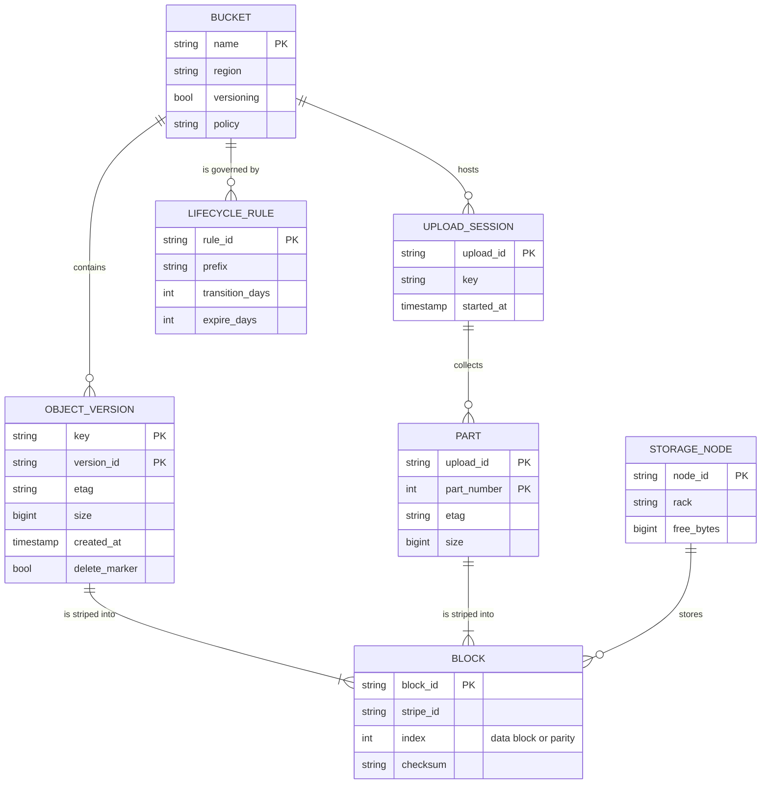
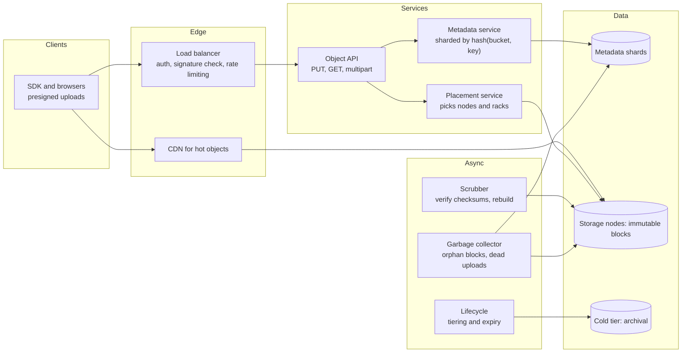
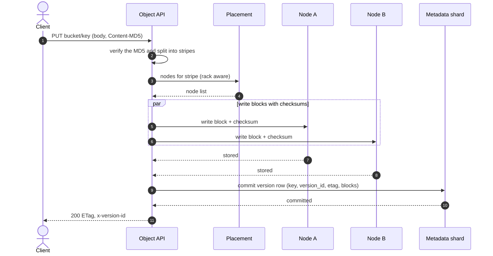
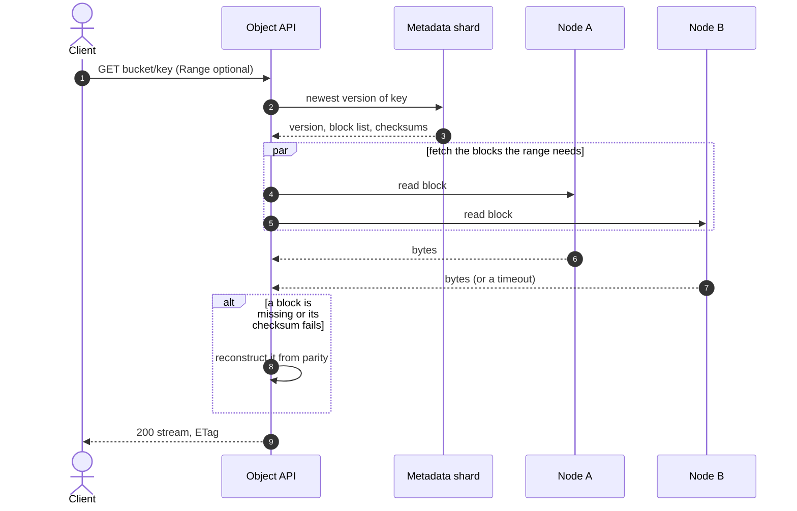
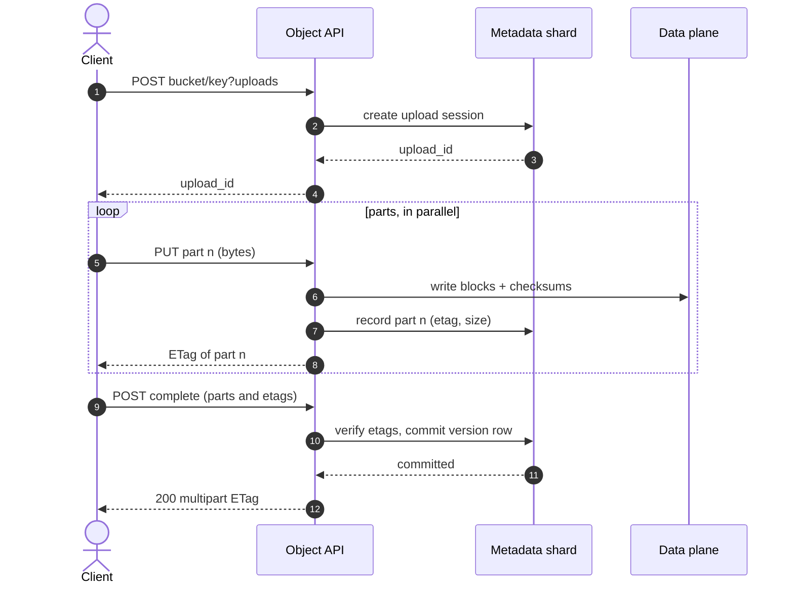
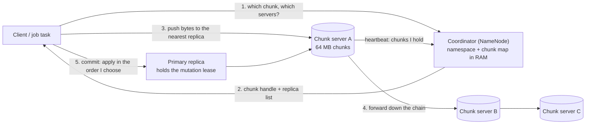
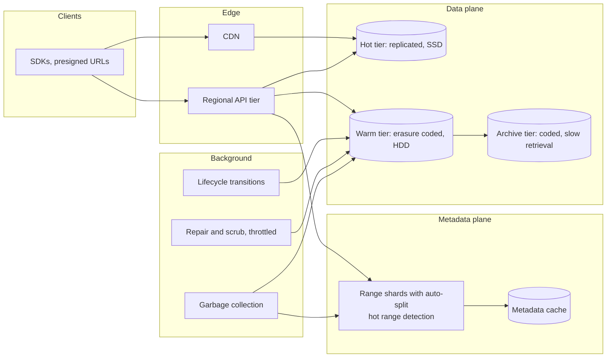

# Design S3 (with a GFS/HDFS variant)

## TL;DR

- An object store is **two systems**: a sharded, transactional **metadata service** mapping `bucket/key` to a version and its blocks, and a dumb, enormous **data service** that stores immutable blocks and never learns what an object is.
- The cruxes an interviewer probes: (1) **metadata versus data**, (2) **durability** through erasure coding, checksums and scrubbing, (3) **multipart upload**, (4) **versioning, deletes and garbage collection**, (5) the **GFS/HDFS variant** with large chunks and a single coordinator.
- The design absorbs 100 TB/day at 3k PUTs/s and 9k GETs/s, stores 36 PB/year at 1.4x overhead instead of 3x, and gets eleven nines from parity plus repair, not from copies.

## Problem statement and clarifying questions

"Design a service that stores arbitrary blobs under a key in a bucket, durably and cheaply, at any scale." The answers below decide the two forks that shape everything: whether objects are **immutable** (they are, which is why the data plane can be dumb) and whether the store must be **strongly consistent** for reads after writes.

| Question | Assumption taken |
|---|---|
| Mutable or immutable? | Immutable: a PUT creates a new version; there is no in-place edit or append. |
| Object sizes? | 1 KB to 5 TB, ~1 MB on average; anything over 100 MB arrives as a multipart upload. |
| Scale? | 100M PUTs/day at ~1 MB, a 3:1 read/write ratio, retained for years. |
| Consistency? | Read-after-write for new objects, strong for overwrites and for listings within a bucket. |
| Durability and availability? | Eleven nines of durability; 99.99% availability for reads, 99.9% for writes. |
| Namespace? | Flat: `/` is a convention that prefix listing exploits, not a directory tree. |
| Versioning and access? | Versioning on, deletes write markers; bucket policies plus presigned URLs, so bytes skip the application tier. |

## Requirements

### Functional

- `PUT`, `GET`, `DELETE` and `HEAD` on `bucket/key`, plus multipart upload for large objects.
- List keys by prefix in lexicographic order, with a continuation token.
- Versioning: every write creates a version, deletes create markers, old versions stay restorable.
- Lifecycle rules (tier after N days, expire after M) and presigned URLs for direct transfer.

### Non-functional

- Durability: eleven nines. No disk, node or rack failure may lose data, and silent corruption must be detected and repaired.
- Scale: 100 TB/day ingested, 36 PB/year, tens of billions of objects.
- Latency: p99 time-to-first-byte < 100 ms for 1 MB. A round trip is ~500 µs and an HDD seek ~2 ms, so a GET is a metadata lookup plus one or two seeks.
- Throughput: 3k PUTs/s and 9k GETs/s peak, 3 GB/s in and 9 GB/s out before the CDN.
- Consistency: strong per object; a completed multipart upload is visible atomically or not at all.

### Out of scope

Cross-region replication mechanics, key management, billing and metering, query-in-place interfaces, and file-system semantics such as rename and append.

## Estimation

Using the [latency and estimation tables](../../cheatsheets/latency-and-estimation.md) (a day is ~10^5 s, peak is 3x average):

| Quantity | Arithmetic | Result |
|---|---|---|
| Write QPS | 100M PUTs/day / 10^5 s | 1k/s average, 3k/s peak |
| Read QPS | 3:1 read ratio, 300M GETs/day / 10^5 s | 3k/s average, 9k/s peak |
| Bandwidth | 1k/s x 1 MB in, 3k/s x 1 MB out | 1 GB/s in and 3 GB/s out average, 3x at peak, against 1.25 GB/s per NIC |
| Storage per year | 100 TB/day x 365 | 36.5 PB/year logical |
| Raw storage per year | 36.5 PB x 3 copies, versus x1.4 with (10,4) coding | 110 PB replicated against 51 PB coded: 59 PB/year of disk saved |
| Storage nodes | 51 PB / 20 TB per node | ~2,550 nodes per year of retention |
| Metadata | 36.5B objects/year x 1 KB per row | ~36 TB/year: its own sharded database, not a table |
| Cache size (80/20 rule) | 20% of 300M daily reads x 1 MB | 60 TB/day of hot bytes: a CDN tier, not RAM |

Two things to say out loud. Erasure coding pays for itself here — 59 PB a year of disk — and **metadata is a separate scaling problem**: at 20 KB per object the data plane shrinks fiftyfold while metadata stays the same size, which is why small objects are the expensive case.

## API design

| Endpoint | Request | Response | Notes |
|---|---|---|---|
| `PUT /{bucket}/{key}` | body, `Content-MD5` | `200` + `ETag`, `x-version-id` | Idempotent by content: the same bytes yield the same ETag, and a body whose MD5 does not match is rejected. |
| `GET /{bucket}/{key}?versionId=` | `Range` header optional | `200`/`206` + body | Range reads are how a 5 TB object is consumed; the default is the newest version. |
| `POST /{bucket}/{key}?uploads`, `PUT ...?partNumber=`, `POST ...?uploadId=` | parts, then `(number, etag)` pairs | `200` + multipart ETag | Initiate, upload parts in any order from any machine, complete. Re-uploading a part is safe: the newest wins. |
| `DELETE /{bucket}/{key}` | — | `204` + `x-version-id` | Writes a delete marker; the bytes go when the version is collected. |
| `GET /{bucket}?prefix=&continuation-token=` | — | `200 {keys[], next_token}` | Lexicographic order with an opaque token, stable while keys are inserted. |
| `POST /{bucket}/{key}?presign` | `{method, expires_in}` | `200 {url}` | A signed URL used directly, so the application tier never carries the bytes. |

## Data model

**Metadata is a database; the data plane only knows blocks.**



Store choices, one sentence each:

- **Metadata** is a sharded transactional store keyed by `(bucket, key)` with `version_id` as the sort key, so a prefix listing is a range scan and a PUT is a single-partition transaction.
- **Partitioning by bucket alone** gives one hot partition per popular bucket — the reason S3 once advised random key prefixes, before it learned to split key ranges automatically.
- **Blocks** are immutable files on plain disks under opaque ids; the data plane has no index, no keys and no transactions, which is why it scales to thousands of nodes.
- **Placement** is computed rather than stored: the block id determines its stripe's nodes, spread across racks. **Lifecycle rules** are small per-bucket rows read only by background jobs.

## High-level design

**v1: a stateless API tier, a sharded metadata service, and a data plane of storage nodes with background repair.**



**Write path: blocks first, metadata last — the commit is one metadata write.**



**Read path: one metadata lookup, then parallel block reads verified on the way out.**



Walk-through: the commit is the metadata write, and it is the only thing that must be transactional. Blocks written before it are invisible garbage the collector sweeps, so a failed PUT leaves no half-object — the client sees an error and the key still points at the previous version. On reads, the metadata lookup is a cached single-partition read and the bytes come from disks in parallel.

## Deep dive: the metadata service versus the data service

The probing question is "where does the index live, and why is it not on the storage nodes?"

| Design | Metadata | Consequence |
|---|---|---|
| One database for keys and bytes | Rows hold blobs | Dies at a few TB; scans drag bytes through the buffer pool |
| Metadata in a store, bytes on nodes | Sharded key-value or relational | The design: two systems scale on their own axes |
| Distributed hash table, no index | Key hashes straight to nodes | No prefix listing, no versions, no atomic overwrite |

Split them because they have opposite shapes. Metadata is small (~1 KB a row), transactional, queried by prefix and updated on every write; the data plane is enormous, immutable and append-only.

The trade you must name is listing. Hashing the whole key spreads load perfectly but scatters `photos/2024/` across every shard, so bucket listings become scatter-gather; range-partitioning keeps a prefix contiguous but hot-spots on sequential keys such as timestamps. Real systems range-partition and split hot ranges automatically, which is why S3 no longer asks you to prefix keys with a random hash.

Two more properties fall out of the split. Because blocks are immutable, the data plane needs no locks, no compaction and no consensus — a storage node is a disk with an RPC front end. And because a block id is meaningless without metadata, a stolen disk is not the data leak a stolen database dump is.

## Deep dive: durability with erasure coding, checksums and scrubbing

The probing question is "eleven nines — where does that number come from, and what do you actually store?"

| Scheme | Overhead | Tolerates | Repair cost | Best for |
|---|---|---|---|---|
| 3 copies | 3.0x | 2 failures | Copy one whole object | Small objects, hot data, simple code |
| (10,4) Reed-Solomon | 1.4x | 4 failures | Read 10 blocks to rebuild 1 | Large, warm objects: the default here |
| (k, k+1) XOR parity | 1.33x at k=3 | 1 failure | Read k blocks | Teaching, and RAID-5 style volumes |

Durability comes from three mechanisms together, and candidates usually name only the first. **Redundancy** (copies or parity) survives losses. **Checksums on every block** turn silent corruption into a detectable error rather than a wrong answer — a disk returning wrong bits is far more common than one that stops. **Scrubbing** reads every block on a schedule and rebuilds what fails, so damage is repaired in hours instead of accumulating until a second failure is fatal. Eleven nines is the arithmetic of "four tolerated failures per stripe" against "repair in hours", not a property of any one copy.

The module uses the smallest interesting code, `k` data blocks plus XOR parity, which makes reconstruction obvious: the missing block is the XOR of the survivors.

```python title="code/hld/multipart_upload.py — the data service"
--8<-- "code/hld/multipart_upload.py:erasure"
```

```text
placement             : obj-id-8 on ['n4', 'n5', 'n1', 'n2'], 3 data + 1 parity
storage overhead      : 1.38x with 3+1 coding, against 3.00x for three copies
one block lost        : read still returns b'a whole new take of the clip'
scrub                 : rebuilt ['obj-id-8'] from parity
bit rot in a block    : checksum mismatch, scrub rebuilt ['obj-id-8']
two blocks lost       : obj-id-8: 2 blocks lost, only one is recoverable
```

Say the cost too: a degraded read must fetch `k` blocks to rebuild one, so a node failure multiplies read traffic across the cluster. That is why hot objects are often replicated, only cold ones coded, and repair throttled.

## Deep dive: multipart upload

The probing question is "a client is uploading a 5 TB file over a flaky connection — what does the protocol look like?" Not one HTTP request: a single stream cannot be retried, parallelised, or survive a proxy timeout.

Multipart splits it into three calls. **Initiate** creates an upload id. **Upload part** writes one numbered part and returns its ETag; parts may arrive in any order from any number of machines, and any part may be re-sent — the newest wins, which makes a retry safe. **Complete** takes the `(part number, ETag)` list, verifies every one, and publishes the object in a single metadata transaction, so others see the whole object or nothing.

**Three calls, many parts, one atomic commit.**



The ETag rule catches people out: a multipart ETag is `md5(concatenated part digests)-<part count>`, not the MD5 of the file, so integrity checks compare part by part. Two more details: every part except the last has a minimum size (5 MB in S3) so an upload cannot create millions of tiny blocks, and an upload never completed keeps its parts forever unless a lifecycle rule aborts it — the classic invisible line on a storage bill.

```python title="code/hld/multipart_upload.py — initiate, upload part, complete"
--8<-- "code/hld/multipart_upload.py:store"
```

!!! tip "Interview tip"
    Say "the commit is the metadata write" early. It explains atomicity (one transaction publishes the object), failure handling (blocks written before the commit are garbage, not a corrupt object) and why the data plane can be dumb — three answers from one sentence.

## Deep dive: versioning, deletes and garbage collection

The probing question is "a user deletes an object — what happens to the bytes?" Nothing, immediately. Deletion here is a metadata operation and reclaiming space is a background one, and keeping them separate is what makes a delete O(1) instead of proportional to the object.

- **A PUT with versioning on** appends a version row; the old version keeps its blocks and stays readable by version id, so overwrites are cheap and undo-able.
- **A DELETE** writes a *delete marker*, a version with no blocks: `GET` returns 404, listings hide the key, and deleting the marker restores the object.
- **Reclamation** happens when a version is expired by a rule or deleted by version id; the collector then removes blocks no version references, making metadata the only source of truth about liveness.
- **Abandoned multipart uploads** are the other garbage source. A rule aborts uploads older than N days; in the demo the sweep aborts two of them and reclaims their two blobs.

```text
put v2 then delete    : 3 versions, newest is a delete marker True, listing []
read the first version: b'the first chunk.the second chunktail'
```

The ordering rule is the interesting part: **never delete a block before the metadata that references it**. Delete metadata first and crash and you leak blocks, which is wasteful but safe. Delete blocks first and crash and you have metadata pointing at nothing, an object that reads as corrupt. Prefer the leak, and keep the collector conservative: sweep only blocks older than the longest in-flight write, or a PUT still finishing loses its blocks underneath it.

!!! warning "Common mistake"
    Treating a delete as "free space now". At scale the collector runs behind, so billing, capacity planning and compliance ("prove the data is gone") all reason about the lag between the delete marker and reclamation. Say how long that lag is, and note that an object-lock policy blocks reclamation entirely.

## Deep dive: the GFS and HDFS variant

The probing question is "how would this change if it were a distributed file system for analytics rather than an object store?" The workload changes: files are huge, written once and appended to, read sequentially by batch jobs, and the clients are a few thousand cooperating machines rather than the internet.

**GFS/HDFS: one coordinator holds the namespace in memory, and clients stream to chunk servers directly.**



Four choices carry the system. **Chunks are 64 MB**, which shrinks the namespace enough to hold in one machine's memory and amortises the seek over a long sequential read; the price is that a small file wastes a chunk's worth of metadata. **One coordinator** owns the namespace and chunk map and is kept off the data path — clients ask once, then talk to chunk servers — so one machine serves thousands of clients, though it stays the availability limit HDFS later patched with a standby NameNode. **Leases** appoint one replica as primary for a chunk and it picks the order concurrent mutations apply in, so replicas agree without consensus per write. **Data flows down a chain** of replicas, nearest first, so the writer's uplink is not multiplied by the replication factor.

The comparison to draw: GFS optimises throughput on huge sequential reads with a relaxed model (a record-append may leave duplicates and padding, and applications cope), while S3 optimises for unbounded independent objects with strong per-object consistency and no file-system semantics. Both refuse to make the data plane clever; they disagree about the metadata plane.

## Scaling, bottlenecks and failure modes

**v2: metadata split by range with automatic splitting, tiered storage, and repair isolated from the request path.**



What breaks first, and what you do about it:

- **A hot metadata range.** Sequential keys (`logs/2024-06-01T...`) land in one shard and no storage capacity helps. Split ranges automatically on load.
- **Small objects.** A billion 10 KB objects cost the same metadata as a billion 10 MB ones but a thousandth of the bytes, so metadata becomes the bill. Pack them into larger blocks (Haystack and f4 do exactly this) and keep an offset in the metadata row.
- **Repair storms.** Losing a node reconstructs every stripe it held, and with (10,4) each rebuild reads ten blocks. Throttle repair, prioritise the most degraded stripes, and spread blocks so no two share a failure domain.
- **Listing a huge bucket.** A billion keys is not a page: `list` is paginated, bounded and never a database index. Anything queried by attribute needs a real index.
- **Correlated failures.** A rack, a power domain or a bad firmware release can take out several blocks of one stripe at once, which is what actually breaks the durability arithmetic. Placement must be failure-domain aware, and rollouts staggered.
- **The CDN, not the store, serves popularity.** One viral object at 100k requests/s would hammer the handful of nodes holding its blocks; cache it at the edge and the origin sees a trickle. Archive tiers, meanwhile, trade minutes or hours of retrieval latency for cost, so a lifecycle transition is a product decision rather than a default.

## Trade-offs summary

| Decision | Chosen | Alternatives | Why |
|---|---|---|---|
| Architecture | Split metadata and data planes | One database, or a pure DHT | Opposite scaling shapes; the data plane stays dumb and cheap |
| Durability | Erasure coding plus scrubbing | 3 copies everywhere | 1.4x instead of 3x saves ~59 PB/year here, at more repair traffic |
| Commit | Single metadata transaction after blocks land | Two-phase across nodes | Atomic publish, and failures leave collectable garbage, not corruption |
| Large uploads | Multipart with per-part ETags | One long PUT | Retry a part, upload in parallel, survive proxy timeouts |
| Deletes | Delete marker plus background reclamation | Erase bytes synchronously | Deletes are O(1) and reversible; space returns later |
| Metadata partitioning | Range with automatic splitting | Hash of the key | Prefix listing stays local; splitting handles the hot-range cost |
| Bytes on the request path | Presigned URLs, direct transfer | Proxy through the API tier | The application tier never carries 3 GB/s |

## Interviewer follow-ups

??? question "How do you get read-after-write consistency?"
    Make the metadata write the commit point and route reads of a key to the same shard: a single-partition read of a transactional store. S3's historical eventual consistency came from caching and replicating that index; once the index became strongly consistent per key, so did the store.

??? question "How do you handle a 5 TB object?"
    Multipart on the way in, `Range` requests on the way out, and blocks small enough (tens of MB) to reconstruct cheaply. Nothing holds the whole object in memory, including the API tier, which streams.

??? question "How would you support append?"
    You would not: objects are immutable, so an append writes a new version. A genuinely append-heavy workload is the signal to reach for a log or a file system such as HDFS — exactly why the GFS variant exists.

??? question "Where does encryption fit?"
    Envelope encryption: a per-object data key encrypts the blocks and a key-management service holds the key that wraps it. The metadata row stores the wrapped key, so rotating the top-level key rewrites metadata, not petabytes.

??? question "What does the scrubber cost?"
    Reading every block on a cycle: 51 PB over 30 days is ~20 GB/s of background reads, throttled and scheduled off-peak. The cycle length is a durability parameter, since a slower scrub leaves corruption undetected for longer.

??? question "How is this different from a CDN?"
    A CDN is a cache with no durability promise, optimised for edge latency; the store is the origin of truth, optimised for durability and cost per byte. The CDN absorbs popularity, the store absorbs the long tail and the responsibility.

## 45-minute pacing

| Minutes | What to say and draw |
|---|---|
| 0-5 | Clarify: immutable objects, flat namespace, versioning on, 100 TB/day, eleven nines. |
| 5-9 | Estimation: 3k PUTs/s and 9k GETs/s peak, 36 PB/year, 1.4x coded against 3x replicated, 36 TB/year of metadata. |
| 9-13 | API (PUT, GET with Range, multipart, list with a token, presigned URLs) and the two data models. |
| 13-22 | v1 diagram; narrate the write path (blocks, then the metadata commit) and the read path (metadata, parallel blocks, verify). |
| 22-38 | Deep dives in order: metadata versus data, erasure coding with scrubbing, multipart upload, deletes and garbage collection. |
| 38-45 | The GFS variant if asked, then bottlenecks (hot ranges, small objects, repair storms) and trade-offs. |

## Related

- [Object, file, search, time-series and graph storage](../fundamentals/storage-systems-zoo.md) — where object storage sits among the other storage families
- [Design Dropbox or Google Drive](cloud-file-storage.md) — chunking, dedup and sync built on top of a store like this one
- [Design YouTube or Netflix](video-streaming.md) — the multipart upload and CDN path in a media pipeline
- [Classic papers digest](../fundamentals/classic-papers-digest.md) — GFS and Bigtable summarised
- [Design a distributed cache](distributed-cache.md) — the tier that keeps hot metadata off the shards
- Primary sources: Ghemawat, Gobioff and Leung, "The Google File System" (SOSP 2003); Muralidhar et al., "f4: Facebook's Warm BLOB Storage System" (OSDI 2014)
