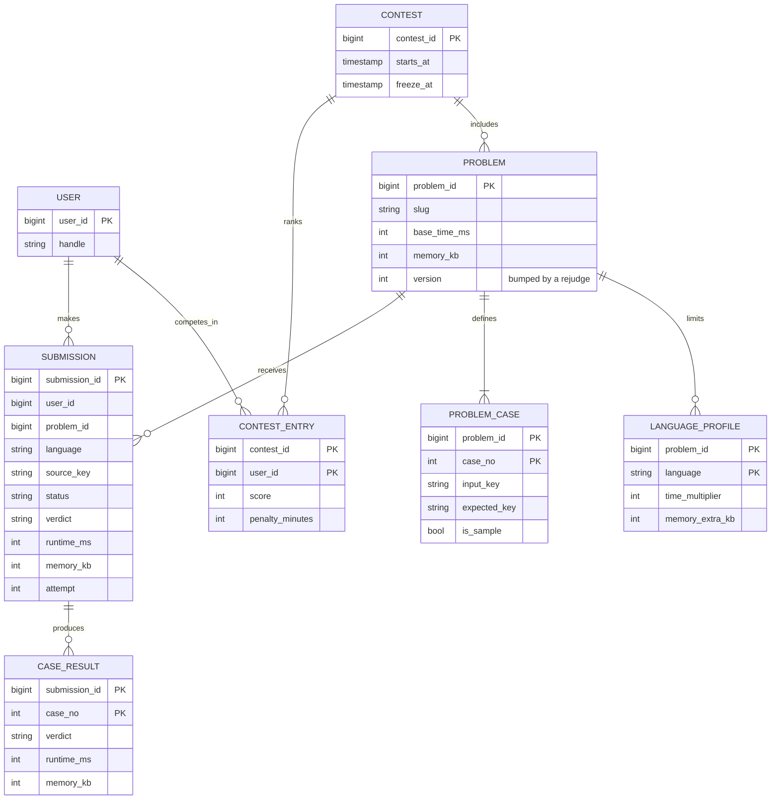
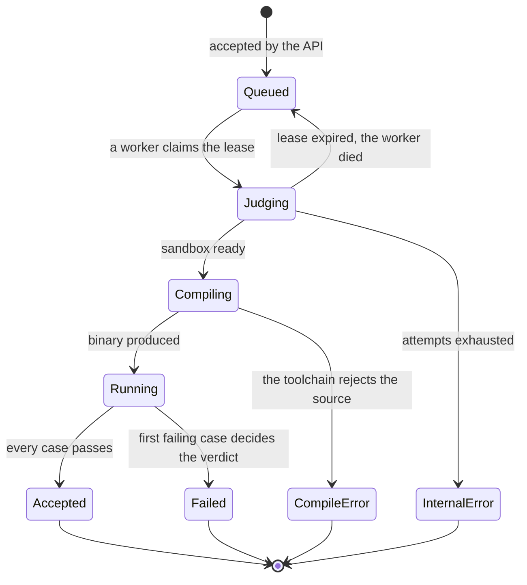
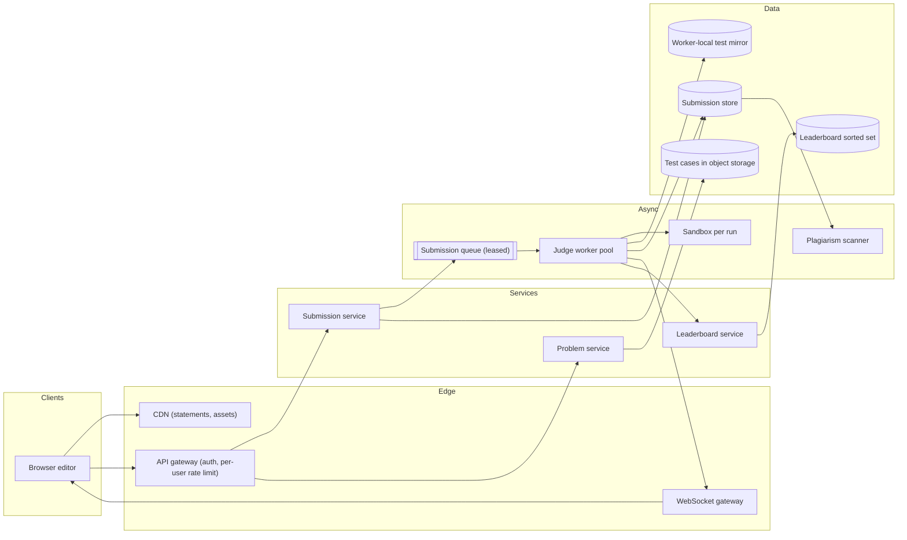
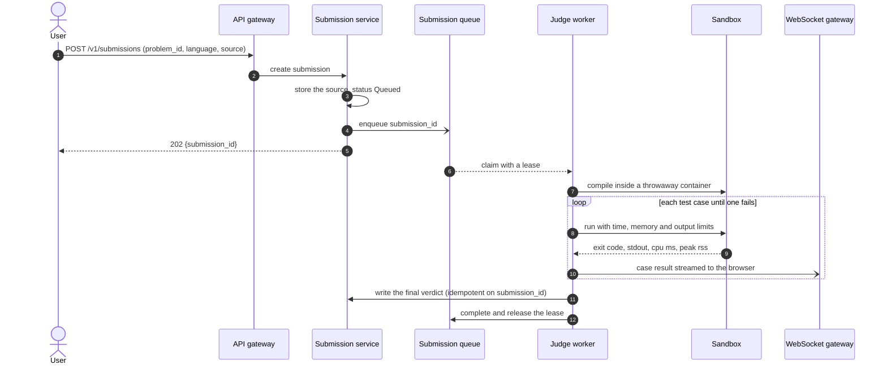
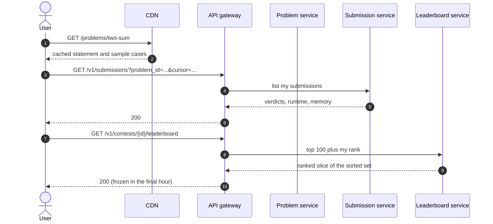
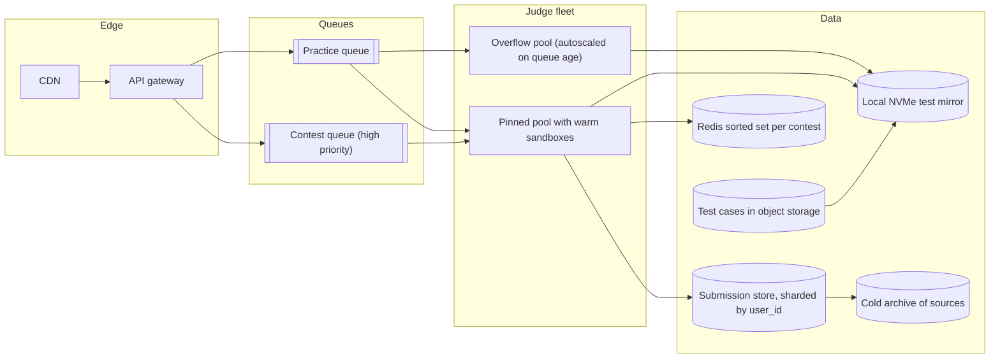

# Design LeetCode (online judge)

## TL;DR

- An online judge is a **job system that runs hostile code**: ~100 submissions/s, each costing a few CPU-seconds, so the fleet is sized in cores (~500 busy cores) rather than in QPS.
- The cruxes an interviewer probes: (1) the **submission queue and worker pool**, (2) the **sandbox** (container, seccomp, cgroups, no network), (3) **test-case storage, streamed results and deterministic verdicts**, (4) **contest mode** with a live leaderboard and plagiarism detection.
- The verdict taxonomy is part of the design, not a detail: `Accepted`, `Wrong Answer`, `Time Limit Exceeded`, `Memory Limit Exceeded`, `Runtime Error`, `Compile Error` — and the precedence between them has to be pinned down.

## Problem statement and clarifying questions

"Design a site where users write code against a problem, submit it, and get a verdict in a few seconds — including during contests where tens of thousands submit at once." Every hard part comes from one fact: you are executing arbitrary code written by strangers, and you promised them a repeatable answer within seconds.

| Question | Assumption taken |
|---|---|
| Scale? | 10M registered users, 2M DAU, ~5 submissions per active user per day. |
| Languages? | About ten, compiled and interpreted, each with its own time-limit multiplier. |
| How are answers checked? | Stdin/stdout against stored expected output, plus special judges for multi-answer problems. |
| How fast must a verdict be? | p50 under 2 s, p95 under 10 s outside contests. |
| Do users see progress? | Yes: per-test-case results streamed as they complete. |
| Contests? | Yes: scheduled, live leaderboard, scoreboard frozen for the last hour. |
| Can a submission see the network or the filesystem? | No network at all, a read-only root and a small writable scratch area. |
| Are test cases secret? | Yes, except the samples on the problem page. |
| What happens if a worker dies mid-judge? | The submission is re-judged; a verdict must never be silently lost. |

## Requirements

### Functional

- Submit source for a problem and language; run against the sample cases ("Run") or the full set ("Submit").
- Stream per-case results and return one final verdict with peak runtime and memory.
- Store submission history per user and per problem, with the failing case revealed only for samples.
- Contest mode: scheduled window, live ranking with penalties, frozen scoreboard, post-contest rejudge.
- Flag suspiciously similar submissions for review.

### Non-functional

- Isolation is the top requirement: untrusted code must not reach the network, other submissions, the host, or the test data of another problem.
- Determinism: the same source, language and test set produce the same verdict. Borderline timing is the enemy of that.
- Latency: p50 verdict < 2 s, p95 < 10 s; contest queue wait p95 < 5 s at ten times normal load.
- Throughput: ~100 submissions/s average, ~300/s peak, ~1,000/s in the first minute of a large contest.
- Durability: a submission accepted with a `202` is judged exactly once *effectively* — at-least-once execution plus an idempotent verdict write.

### Out of scope

The code editor itself, discussion and editorial content, payments, the special-judge authoring tools, and interview-simulation products.

## Estimation

Using the [latency and estimation tables](../../cheatsheets/latency-and-estimation.md) (a day is ~10^5 s, peak is 3x average, an event can be 10x). A submission is ~2 KB of source and runs ~50 test cases.

| Quantity | Arithmetic | Result |
|---|---|---|
| Submission write QPS | 2M DAU x 5 = 10M/day / 10^5 | ~100/s average, ~300/s peak, ~1,000/s at a contest start |
| **Judging cost** | 100/s x 50 cases x 100 ms = 500 CPU-s per second | ~500 busy cores; at 16 cores a node, ~32 nodes, ~64 with headroom |
| Problem-page read QPS | 2M x 30 views = 60M/day / 10^5 | ~600/s average, ~1.8k/s peak, ~95% served by the CDN |
| Test-case storage | 3,000 problems x 50 cases x 200 KB | ~30 GB total — small enough to mirror onto every worker |
| Submission storage/year | 10M/day x 2 KB x 365 | ~7 TB/year, x3 replicas ~21 TB |
| Result bandwidth | 300/s x 1 KB streamed updates | ~300 KB/s — the streaming is free, the CPU is not |
| Problem-page cache | 20% of 60M daily reads x 10 KB | ~120 GB behind the CDN |

The number that decides the architecture is **500 busy cores**. A judge is a CPU-bound batch system wearing a web front end: the API tier is trivial, and every design choice — queueing, autoscaling, pinning, warm sandboxes — exists to keep those cores fed and predictable. The second number is **30 GB of test data**: the whole corpus fits on a worker's local NVMe, so no submission ever waits on object storage.

## API design

| Endpoint | Request | Response | Notes |
|---|---|---|---|
| `POST /v1/submissions` | `{problem_id, language, source, mode}` + header `Idempotency-Key` | `202 {submission_id, status: "Queued"}` | Never blocks on judging. `mode` is `run` (samples only) or `submit` (full set). Per-user rate limit of a few per minute. |
| `GET /v1/submissions/{id}` | — | `200 {status, verdict, cases_passed, runtime_ms, memory_kb, failed_case?}` | The fallback when the WebSocket drops; `failed_case` is only populated for sample cases. |
| `WS /v1/submissions/{id}/stream` | — | `case_result` events, then `verdict` | One message per test case as it completes; the client renders a progress bar. |
| `GET /v1/problems/{slug}` | — | `200 {statement, samples, limits, languages}` | Immutable per version and CDN-cached; secret cases are never in the payload. |
| `GET /v1/contests/{id}/leaderboard?cursor=...` | — | `200 {rows, my_rank, next_cursor}` | Cursor over `(score desc, penalty asc, user_id)`; served from a sorted set and frozen in the final hour. |

`Idempotency-Key` matters more than usual: a user who double-clicks Submit during a contest must not consume two judging slots or two penalty points.

## Data model

**Sources and verdicts are rows; test cases are blobs; the leaderboard is a sorted set.**



**A submission's lifecycle: the states a worker crash has to be safe in.**



Store choices: `SUBMISSION` and `CASE_RESULT` go in a relational store sharded by `user_id` (every user-facing query is "my submissions"); sources and test cases are blobs in object storage keyed by content hash, with the test data mirrored to each worker's local disk; `CONTEST_ENTRY` is materialized into a Redis sorted set for ranking, exactly as in the [leaderboard](leaderboard.md) design.

## High-level design

**v1: a thin API, a leased queue, a pool of judge workers, one throwaway sandbox per run.**



**Write path: accept fast, judge asynchronously, stream each case as it finishes.**



**Read path: statements from the CDN, history from a sharded store, ranking from a sorted set.**



Walk-through: the API tier never runs code and never blocks — it writes a row and enqueues an id. Everything expensive happens in the pool, where the unit of work is one submission and the unit of isolation is one sandbox per run. Results reach the browser twice over: streamed on a WebSocket for responsiveness, and durably in the submission store for the reload.

## Deep dive: the submission queue and the worker pool

The probing question is "a judge worker is OOM-killed halfway through a submission. What does the user see?" The answer must be "a verdict, a few seconds later" — which rules out a fire-and-forget queue.

| Queue model | Crash behaviour | Notes |
|---|---|---|
| In-process thread pool | Submission lost with the process | Fine for a prototype, indefensible in an interview |
| Fire-and-forget topic | Message acknowledged on receipt, then lost | The user's submission is stuck in "Judging" forever |
| Leased queue (claim, lease, complete) | Lease expires, another worker claims it | Chosen: at-least-once with a bounded attempt count |

The queue hands out **leases**: a worker claims a submission, gets exclusive ownership for a lease window, and completes it. If the worker dies, the lease expires and the submission returns to the ready list. After a bounded number of attempts it becomes a dead letter with the `Internal Error` verdict and a page for an engineer — because the alternative, a submission that a poisonous input crashes forever, silently consumes the fleet.

```python title="code/hld/judge_runner.py — the leased submission queue"
--8<-- "code/hld/judge_runner.py:queue"
```

At-least-once execution means the verdict write must be **idempotent on `submission_id`**: judging the same source twice is wasteful but harmless, writing two verdicts is a bug. Two operational details complete the picture. Autoscale on **queue depth and oldest-message age**, not CPU: CPU is pinned at 100% by design, so it tells you nothing, while a rising oldest-message age is exactly the user-visible symptom. And run **separate queues for contests and practice**, so a contest's 1,000/s burst does not sit behind an hour of practice submissions — the same priority argument as in the [job scheduler](job-scheduler.md) design.

## Deep dive: the sandbox

The probing question is "what stops a submission from reading `/etc/passwd`, mining crypto, or calling the internal metadata service?" A container alone is not an answer; the answer is a stack of independent limits.

- **No network.** The container gets an empty network namespace: no interface but loopback. This single control removes data exfiltration, coordinated cheating, and calls to a cloud metadata endpoint at once.
- **cgroups** cap memory, CPU shares and process count. The memory cap is enforced by the kernel's out-of-memory killer, so a runaway allocation dies without touching its neighbours; a pid limit stops a fork bomb.
- **seccomp-bpf** allows only the syscalls a submission legitimately needs and kills anything else. `ptrace`, `mount`, `unshare`, raw sockets and `keyctl` do not belong in a solution to Two Sum.
- **A read-only root filesystem** plus a small writable tmpfs scratch, dropped capabilities, `no_new_privs`, a non-root uid unique per run, and a wall-clock watchdog above the CPU limit so a sleeping process cannot hold a slot.
- **One sandbox per run, never reused.** Reuse leaks state between submissions and turns a wrong answer into a security incident.

```python title="code/hld/judge_runner.py — the limits a sandbox enforces"
--8<-- "code/hld/judge_runner.py:sandbox"
```

Two refinements worth naming. Container escapes are real, so high-risk deployments add a second boundary — gVisor's user-space kernel or a Firecracker microVM per run — accepting tens of milliseconds of extra start-up for a much smaller kernel attack surface. And because a cold container start would dominate a 100 ms test case, workers keep a **pool of pre-warmed sandboxes**, resetting the writable layer between runs rather than creating a namespace from scratch. That is a performance trick, not a security compromise: the process, the uid and the scratch space are still new every time.

## Deep dive: test cases, streaming results and deterministic verdicts

The probing question is "the same code got `Accepted` yesterday and `Time Limit Exceeded` today — why?" Non-determinism in a judge is a product bug, and it has three usual causes: noisy neighbours, output comparison, and verdict precedence.

**Noisy neighbours.** Two submissions sharing a core make timing a lottery. Pin one run to one core, disable bursting, set the limit generously (2–3x a reference solution) and apply a per-language multiplier, since an interpreted language is legitimately several times slower. Measure CPU time, not wall-clock time, for the limit itself, and keep a wall-clock watchdog only as a backstop against sleeping.

**Output comparison.** Byte equality fails correct submissions on a trailing newline; token comparison is the sane default, and problems with several valid answers ship a *special judge* that is itself a sandboxed program reading the input and the contestant's output.

**Verdict precedence.** This is the part candidates skip. A process killed by the out-of-memory killer also exits non-zero, and so does one killed by the watchdog — so if you check the exit code first, every memory-limit failure is reported as a runtime error. Check resource limits first, then the exit code, then the answer:

```python title="code/hld/judge_runner.py — one verdict from many signals"
--8<-- "code/hld/judge_runner.py:judge"
```

Judging **stops at the first failing case**, which saves most of the fleet's work (most failures are early) and keeps secret test data from leaking through timing. Cases stream to the browser as they complete over a WebSocket, while the durable record goes to the submission store — so a reload shows the same thing the stream did. Running the demo shows every verdict in the taxonomy and what the browser received:

```text
sub-correct  Accepted              3/3  streamed=['t1', 't2', 't3']
sub-wrong    Wrong Answer          1/3 at t2  streamed=['t1', 't2']
sub-slow     Time Limit Exceeded   0/3 at t1  streamed=['t1']
sub-hungry   Memory Limit Exceeded 0/3 at t1  streamed=['t1']
sub-crash    Runtime Error         1/3 at t2  streamed=['t1', 't2']
sub-broken   Compile Error         0/3  streamed=[]
worker A claimed sub-correct, queue depth (ready, in flight) = (1, 1)
reclaimed after the lease expired: ['sub-correct']
worker B judged sub-wrong; depth now (1, 0), dead letters []
```

## Deep dive: contest mode

The probing question is "what changes when 50,000 people submit in the same ten minutes?" Three things: load shape, ranking, and trust.

**Load shape.** A contest is a scheduled 10x spike, so pre-scale rather than autoscale — the fleet is warm before the start bell, because scaling out after the spike arrives means the first five minutes are the worst five minutes. Contest submissions ride their own high-priority queue, and practice judging is throttled for the window.

**Ranking.** Score and penalty land in a Redis sorted set keyed by `(score desc, penalty asc)`, updated by the worker on each accepted verdict; the top-100 read is one `ZREVRANGE` and a user's own rank one `ZREVRANK`. The scoreboard **freezes** for the final hour: the service keeps updating the true set and serves a snapshot taken at freeze time, which preserves the drama and, more practically, stops the last hour becoming a scoreboard-scraping arms race.

**Trust.** Two mechanisms. A **rejudge** re-runs every submission of a problem when a test set was wrong or a limit too tight; because judging is deterministic and idempotent, a rejudge is just the same journal of submissions replayed through a bumped `PROBLEM.version`. And **plagiarism detection** runs after the contest: normalize each source (strip comments, rename identifiers, canonicalize whitespace), hash overlapping k-grams and keep a deterministic sample of them (the winnowing scheme behind MOSS), then compare fingerprint sets pairwise within the contest. It flags for humans; it never auto-bans.

## Scaling, bottlenecks and failure modes

**v2: priority queues, a pre-warmed pinned pool plus autoscaled overflow, and test data on local NVMe.**



What breaks first, and what you do about it:

- **The contest start**: 1,000 submissions/s against ~500 cores. The queue absorbs it, the high-priority lane keeps contest latency bounded, and the honest degradation is a visible queue position rather than a timeout.
- **A poison submission** that reliably crashes its worker: bounded attempts, then a dead letter and `Internal Error`. Without the cap it takes down workers indefinitely.
- **A problem with a huge test set**: cases stream from local NVMe, and per-case results let a worker abandon early. Cap total judging time per submission so one problem cannot monopolize a core.
- **Timing flakiness** near the limit: pin cores, use CPU time, keep limits generous, and re-run once at the boundary before reporting `Time Limit Exceeded` — flaky verdicts destroy trust faster than slow ones.
- **A sandbox escape**: assume it will happen. Workers hold no credentials worth stealing, run in their own account and VPC with no route to production data, and are recycled after a bounded number of runs.
- **Losing the leaderboard cache**: rebuild it from `CONTEST_ENTRY` rows, which are the source of truth. The sorted set is a materialized view, never the record.

## Trade-offs summary

| Decision | Chosen | Alternatives | Why |
|---|---|---|---|
| Queue semantics | Leased, at-least-once, bounded attempts | Fire-and-forget; exactly-once | A crashed worker must not lose a verdict; idempotent writes make duplicates harmless |
| Isolation | Container + seccomp + cgroups + no network, one per run | Process-level limits; a shared VM | Independent controls; a single bypass is not a breach |
| Sandbox start-up | Pre-warmed pool, reset between runs | Fresh container per run | A cold start would dominate a 100 ms test case |
| Test data | Object storage, mirrored to worker NVMe | Fetch per submission | 30 GB total; a per-run fetch adds latency and a dependency |
| Verdict on failure | Stop at the first failing case | Run every case | Saves most of the fleet's work and leaks less about secret cases |
| Autoscaling signal | Queue depth and oldest-message age | CPU utilisation | CPU is pinned at 100% by design and says nothing |
| Leaderboard | Redis sorted set, rows as truth | Query the submission store live | O(log n) rank updates at contest write rates |

## Interviewer follow-ups

??? question "Why not exactly-once judging?"
    Because it does not exist across a crash boundary. You get at-least-once execution plus an idempotent verdict write keyed by `submission_id`, which is effectively-once. Re-judging costs CPU; writing two conflicting verdicts costs trust.

??? question "How do you keep test cases secret?"
    They never leave the worker network, never appear in an API response, and a failing verdict names the case only for samples. Timing side channels are limited by stopping at the first failure and by reporting bucketed runtimes.

??? question "A user submits a fork bomb. What happens?"
    The cgroup pid limit refuses the extra processes, the memory cap bounds the damage, and the watchdog kills the run at the wall-clock limit. The verdict is `Runtime Error` and no other submission on the host notices.

??? question "How would you support a problem with multiple valid answers?"
    A special judge: a checker program supplied by the problem author that reads the input and the contestant's output and returns a verdict. Run it in the same sandbox with its own limits — it is untrusted code too, just written by someone you trust more.

??? question "How do you rejudge a problem whose test data was wrong?"
    Bump `PROBLEM.version`, enqueue every affected submission on a low-priority lane, and write new verdicts against the new version so history stays auditable. Determinism is what makes this safe: the same source and the same tests give the same answer.

??? question "Where does the 100 ms per test case go?"
    Almost entirely into the submission's own compute. Sandbox setup is amortised by the warm pool, test data comes off local NVMe at ~50 µs per MB, and the result write is one row. If setup were on the critical path it would be the dominant cost, which is exactly why it is not.

!!! tip "Interview tip"
    Convert the load into cores in the first five minutes: "100 submissions/s x 50 cases x 100 ms is about 500 busy cores." That reframes the problem from a web service into a batch fleet, and every later answer — priority queues, pinning, warm sandboxes, autoscaling on queue age — follows from it.

!!! warning "Common mistake"
    Saying "run it in a Docker container" and moving on. A container is a namespace, not a security boundary: without seccomp, cgroups, dropped capabilities and an empty network namespace it is a convenient way to run a crypto miner. Name the specific controls, and name what each one stops.

## 45-minute pacing

| Minutes | What to say and draw |
|---|---|
| 0–5 | Clarify: ten languages, stdin/stdout judging, secret cases, contests, verdict in seconds. |
| 5–9 | Estimation: 100 submissions/s, 500 busy cores, 30 GB of test data. State that this is a CPU-bound batch system. |
| 9–14 | API (submit, stream, history, leaderboard) and the data model; draw the submission state machine. |
| 14–22 | v1 diagram; narrate accept-then-queue and the worker loop with streamed per-case results. |
| 22–38 | Deep dives: the leased queue and worker pool, the sandbox controls one by one, verdict precedence and determinism. |
| 38–45 | Contest mode (priority lane, frozen scoreboard, rejudge, plagiarism) and the trade-offs table. |

## Related

- [Design a distributed job scheduler](job-scheduler.md) — leases, retries and dead letters for the same class of work
- [Messaging, queues and Kafka internals](../fundamentals/messaging-and-event-streaming.md) — the delivery semantics behind at-least-once judging and priority lanes
- [Security essentials](../fundamentals/security-essentials.md) — the isolation and least-privilege reasoning the sandbox is built on
- [Design a real-time gaming leaderboard](leaderboard.md) — the sorted-set ranking reused for contest scoreboards
- Primary sources: Linux `seccomp` and cgroups v2 kernel documentation, the gVisor design document, Schleimer, Wilkerson and Aiken, "Winnowing: Local Algorithms for Document Fingerprinting" (2003)
