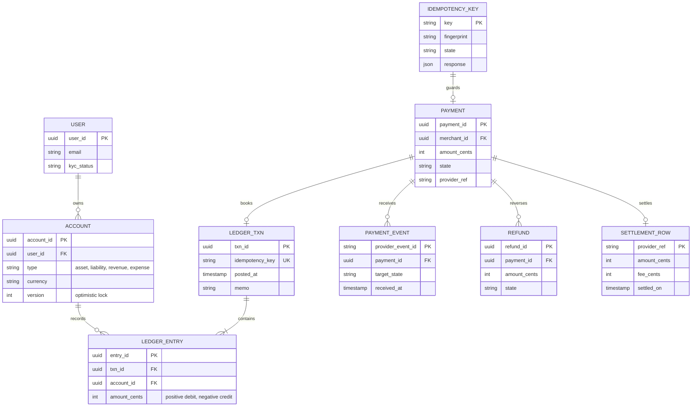
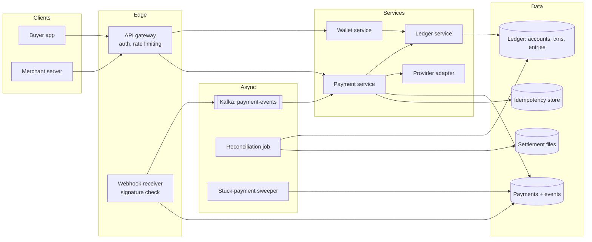
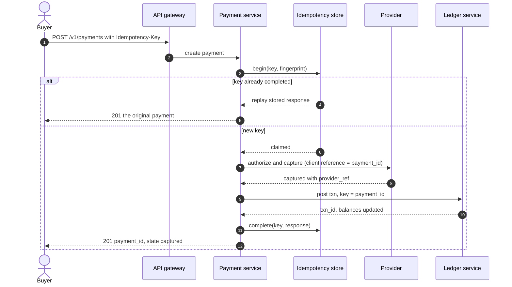
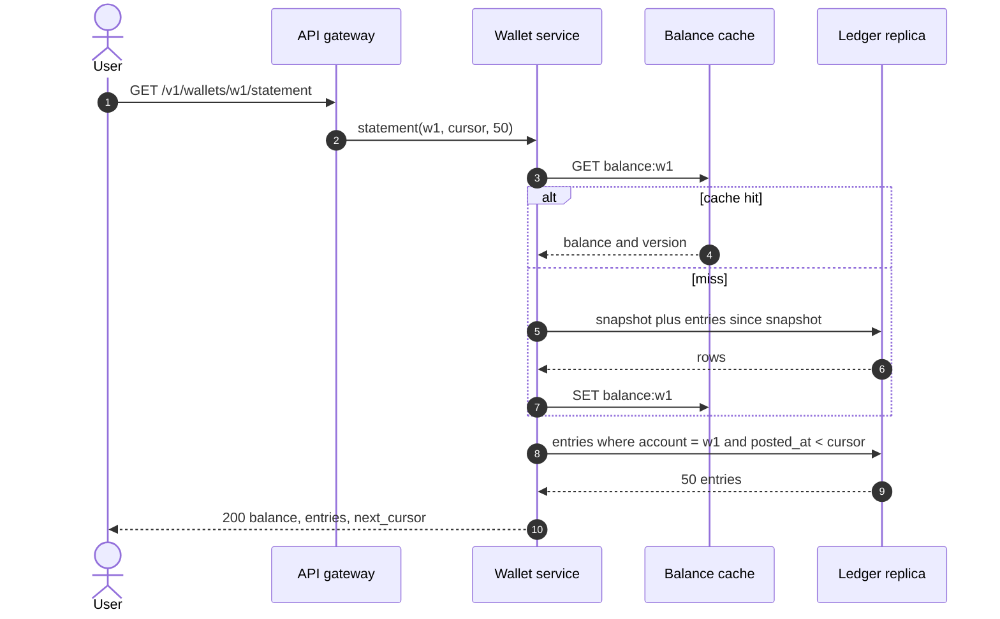
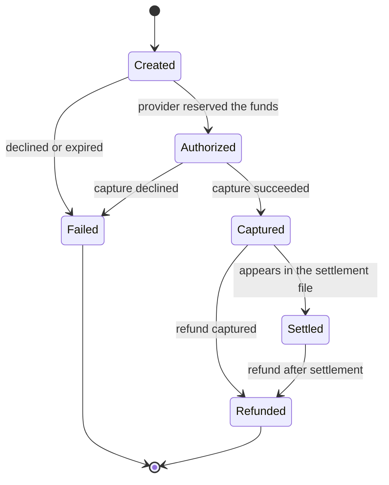
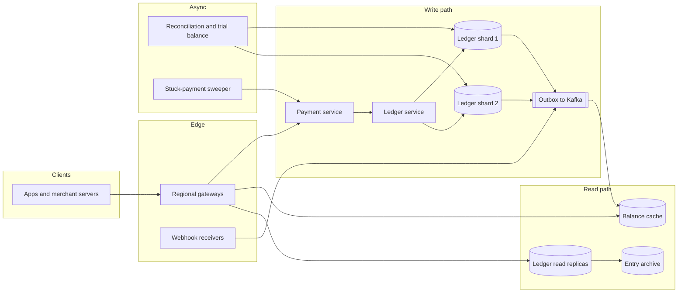

# Design a payment system and digital wallet

## TL;DR

- A payment system is not a throughput problem — 10M payments/day is ~100 writes/s — it is a **correctness problem under retries**: every timeout is a maybe, and money must move exactly once anyway.
- The cruxes an interviewer probes: (1) **idempotency keys** on every money-moving call, (2) a **payment state machine** fed by duplicated and out-of-order provider webhooks, (3) an **immutable double-entry ledger** that always balances, (4) **hot accounts** under contention, (5) **reconciliation** against the provider's settlement file.
- The design keeps card data out of your systems entirely, treats the ledger as the only source of truth, and assumes every external call will be retried.

## Problem statement and clarifying questions

"Design the system that charges a card, credits a merchant, and lets users hold and transfer a wallet balance." Correctness dominates: the interviewer will spend the session on retries, partial failures and what your books say after a crash.

| Question | Assumption taken |
|---|---|
| Do we touch card numbers? | No. The provider tokenises; we store a token, never a PAN. |
| One provider or several? | One primary provider (Stripe-like) behind an adapter, with a second for failover. |
| Do we need a wallet, or only card payments? | Both: a stored balance plus wallet-to-wallet transfers. |
| Scale? | 50M users, 10M payments/day, 5M wallet transfers/day, 250M balance reads/day. |
| Currencies? | Multi-currency accounts, but one transaction never mixes currencies. |
| How fast must a payment be? | p99 < 2 s end to end, dominated by the provider call, not by us. |
| Source of truth for balances? | Our ledger; the provider is authoritative for cash movement. |
| Refunds and chargebacks? | Refunds in scope; chargebacks are a reversal plus a dispute record. |

## Requirements

### Functional

- Create a payment against a tokenised card and capture it.
- Refund a payment fully or partially, and record chargebacks as reversals.
- Hold a wallet balance, top it up from a card, transfer between wallets.
- Serve a balance and a paginated statement per account.
- Ingest provider webhooks and reconcile daily against the settlement file.

### Non-functional

- **Exactly-once money movement** under at-least-once delivery: retries never double-charge.
- **The ledger always balances**: debits equal credits after every write, checked continuously.
- **Scale**: ~100 payment writes/s average, ~300/s peak; ~2.5k balance reads/s, ~7.5k peak.
- **Latency**: our own work p99 < 200 ms; the provider round trip dominates the 2 s budget.
- **Durability**: synchronous replication, point-in-time recovery, and an append-only ledger never updated in place.
- **Availability**: 99.99% for reads; the write path may fail closed, because a payment that did not happen is recoverable and one that happened twice is not.
- **Auditability**: every entry is attributable to a request, an actor and a provider event.

### Out of scope

Card issuing and acquiring, fraud scoring, FX rate sourcing, tax and invoicing, bank-rail payout files, and regulatory reporting.

## Estimation

Using the [latency and estimation tables](../../cheatsheets/latency-and-estimation.md) (a day is ~10^5 s, peak is 3x average):

| Quantity | Arithmetic | Result |
|---|---|---|
| Payment writes | 10M/day / 10^5 | ~100/s average, ~300/s peak |
| Webhooks in | 10M payments x 3 events (authorized, captured, settled) | 30M/day = ~300/s, ~900/s peak |
| Ledger entries | 10M payments x 3 + 5M transfers x 3 | ~45M/day = ~450/s, ~1.4k/s peak |
| Balance reads | 50M users x 5 checks/day | 250M/day = ~2.5k/s, ~7.5k peak |
| Hot-account ceiling | one row per update, held for a ~500 µs round trip | ~2k/s per account before contention bites |
| Ledger storage | 45M entries/day x 200 B x 365 | ~3.3 TB/year, ~10 TB at 3x replication |
| Payment rows | 10M/day x 1 KB x 365 | ~3.7 TB/year |
| Balance cache | 20% of 50M accounts x 100 B | ~1 GB, every hot balance fits one Redis node |
| Settlement file | 10M rows x 100 B | ~1 GB/day, one sequential pass at ~2 GB/s |

Two things to say out loud. **The write rate is small and the invariants are not**: 300 writes/s fits on one primary, so every decision buys correctness, not throughput. And **the only real hot spot is a single account row**: the platform account touched by every payment is where 1.4k/s of ledger writes collide, which is what sub-account fan-out exists to fix.

## API design

| Endpoint | Request | Response | Notes |
|---|---|---|---|
| `POST /v1/payments` | `{amount_cents, currency, card_token, merchant_id}` + `Idempotency-Key` | `201 {payment_id, state}` | The key is mandatory; a retry replays the original response, a different body under the same key is `422`. |
| `GET /v1/payments/{id}` | — | `200 {payment_id, state, events: [...]}` | The event list is the audit trail. |
| `POST /v1/payments/{id}/refunds` | `{amount_cents}` + `Idempotency-Key` | `201 {refund_id, state}` | Partial refunds allowed up to the captured amount. |
| `POST /v1/wallets/{id}/transfers` | `{to_wallet, amount_cents}` + `Idempotency-Key` | `201 {transfer_id, balance}` or `409 {reason: insufficient_funds}` | One ledger transaction; never two updates. |
| `GET /v1/wallets/{id}/statement?limit=50&cursor=...` | — | `200 {entries: [], balance, next_cursor}` | Opaque cursor over `(posted_at, entry_id)`. |
| `POST /v1/webhooks/provider` | Provider event + `Signature` header | `200` within 5 s | Verify the signature, persist the raw event, acknowledge, process asynchronously. |

Two rules worth stating: a money-moving `POST` without an `Idempotency-Key` is rejected outright rather than treated as unique, and the webhook endpoint acknowledges **before** processing, because a provider that times out redelivers.

## Data model

**Payments and events are the story of an intent; the ledger is the story of the money, and only the ledger is authoritative.**



Store choices:

- **Ledger and accounts**: relational with strong transactions, partitioned by `account_id`, sort key `(posted_at, entry_id)`. A transaction and its entries commit together, and `idempotency_key` carries a unique index — the database, not the application, enforces "once".
- **Payments and events**: the same store, partitioned by `payment_id`, with `provider_event_id` unique so a redelivered webhook is a duplicate-key error rather than a second transition.
- **Balance cache**: Redis, `account_id -> (balance, version)`, invalidated by the ledger write and never authoritative; a miss recomputes from a nightly snapshot plus later entries.
- **Settlement files**: object storage, immutable, one per provider per day.
- **Indexes**: `(account_id, posted_at desc)` for statements, `(state, updated_at)` for the stuck-payment sweeper, `(provider_ref)` for reconciliation lookups.

## High-level design

**v1: a payment service that owns intent, a ledger service that owns money, and a webhook path that is entirely asynchronous.**



**Write path: claim the idempotency key, call the provider once, book the ledger transaction, then answer.**



**Read path: a cached balance backed by the ledger, and a statement paged straight off the entry index.**



Note what the write path does *not* do: it never holds a transaction open across the provider call, which sits between two short local transactions. A slow provider costs latency, not locks.

## Deep dive: idempotency for money movement

The probing question is "the client times out after you charged the card and retries — now what?" Every money-moving endpoint takes an `Idempotency-Key`, stored with the request's **fingerprint**, a state and the response.

| Outcome of `begin(key)` | Meaning | Answer |
|---|---|---|
| New | Nobody has used this key | Claim it, run the handler, store the response |
| Replay | Completed earlier | Return the stored response verbatim, run nothing |
| In progress | A twin request is mid-flight | `409`, retry after a moment |
| Mismatch | Same key, different body | `422` — a client bug, never a silent second charge |

The subtlety worth raising unprompted: **the key must reach the provider too**. Sending your `payment_id` as the provider's own idempotency key means a retry that never reached your database still results in one authorization rather than two. Idempotency that stops at your API boundary protects only your own tables.

Two details decide whether this survives crashes. The claim carries a **token**: if the worker holding it dies, another takes over after a timeout and the dead worker's late `complete` is rejected as stale. And the record is written **before** the side effect — otherwise a crash between the charge and the write loses the only evidence that the charge happened.

Keys expire: 24 hours is long enough for client retries and short enough to keep the table small. State the TTL out loud, because "forever" quietly becomes a multi-terabyte table. The reusable machinery lives in [Transactions, 2PC, sagas and idempotency](../fundamentals/transactions-and-distributed-transactions.md).

## Deep dive: the payment state machine and provider webhooks

The probing question is "the `payment_failed` webhook arrives after `payment_captured`. What state is the payment in?" A payment is a **state machine driven by two inputs**: your own synchronous calls and the provider's webhooks, which arrive duplicated, out of order, and sometimes after you already know the answer.

**A payment's lifecycle. Everything to the right of Captured is money that has actually moved.**



Three rules make webhook handling boring, which is the goal. **Deduplicate by the provider's event id**, stored with a unique constraint, so a redelivery is a no-op rather than a second transition. **Rank the states** and ignore any event that does not move the payment forward: an `authorized` event arriving after `captured` carries no information, and a `failed` event after a capture almost always refers to an earlier attempt of the same intent. **Reject genuine impossibilities loudly** — `created` jumping straight to `settled` means your assumptions or the integration are wrong, and swallowing it hides a real bug.

```python title="code/hld/ledger.py — the payment state machine"
--8<-- "code/hld/ledger.py:state_machine"
```

The state that deserves its own name is the *unknown*: a provider call that times out has not failed, so leave the payment where it is and let the sweeper resolve it rather than marking it failed and charging the customer anyway. Verify signatures on every inbound webhook, reject events older than a few minutes to blunt replay attacks, and treat the endpoint as untrusted input — see [Security essentials](../fundamentals/security-essentials.md). Never rely on webhooks alone: a sweeper polls the provider for payments stuck in a non-terminal state, because "the webhook never arrived" is a weekly event, not a rare one.

## Deep dive: the double-entry ledger

The probing question is "where does a balance live?" The wrong answer is a `balance` column you increment. The right answer is that a balance is a **derived sum of immutable entries**, and every transaction touches at least two accounts so that debits equal credits.

| Model | Write | Audit | Fails when |
|---|---|---|---|
| Mutable balance column | One `UPDATE` | None, history is lost | Any bug leaves money nobody can explain |
| Single-entry log | Append a delta | Partial | Nothing forces the other side of the movement to exist |
| Double-entry ledger | Append a balanced transaction | Complete | Never, but reads need a cached balance |

The invariant is one line of code and enormous in the room: **the signed amounts of a transaction's entries sum to zero**, so summing every account is always zero. Money entering the platform debits a provider cash account and credits a wallet; a fee splits one debit into two credits. Nothing is updated in place, so a mistake is fixed by posting its reversal.

```python title="code/hld/ledger.py — the ledger"
--8<-- "code/hld/ledger.py:ledger"
```

Reads are the price. Summing a million entries per balance check is not viable at 7.5k reads/s, so keep a **materialised balance** on the account row inside the same transaction, plus periodic snapshots so a cache miss reads "snapshot plus entries since". That number is a cache of the entries, never the other way round, and a continuous job re-derives it and alerts on drift.

!!! warning "Common mistake"
    Using floating-point for money, or storing a balance without the entries that produced it. Both are unrecoverable in different ways: one loses cents to rounding that nobody can trace, the other loses the ability to answer "why is this number what it is?" Integer minor units and an append-only ledger are non-negotiable.

## Deep dive: wallets, hot accounts and contention

The probing question is "a marketplace's platform account is touched by every one of your 1.4k ledger writes a second — what happens?" Every writer contends on one row, and a row absorbs about one update per lock hold: at a same-datacenter round trip of ~500 µs that is a ceiling near 2k/s, falling as contention adds retries.

Three fixes, in the order you should offer them:

1. **Keep the transaction short.** Never hold a row lock across a provider call. The provider round trip belongs strictly between two local transactions.
2. **Optimistic locking for the ordinary case.** Read the account version, compute, write conditionally on that version; a mismatch means somebody got there first, so re-read and retry with backoff. This is the `expected_versions` check in the snippet, and it beats a pessimistic lock whenever conflicts are rare.
3. **Shard the hot account.** Split it into 16 or 64 numbered sub-accounts, route each write by hashing the payment id, and define the logical balance as their sum. Contention drops by the shard count; reading the true balance means summing shards, which is cheap and cacheable.

For wallet-to-wallet transfers the whole movement is **one ledger transaction**, not a debit followed by a credit — the difference between a system that can lose money in a crash and one that cannot. When the two sides live in different services you run a saga instead: reserve, move, confirm, with a compensating reversal for every step before the pivot. Overdrafts are refused inside the transaction that would create them, so a rejected transfer writes nothing.

## Deep dive: reconciliation against the settlement file

The probing question is "how do you know your ledger matches reality?" You do not, until you check. Every day the provider publishes a settlement file: one row per movement, with the amount they actually paid you and the fee they took. Reconciliation is a diff, and its output must be **three actionable buckets** rather than a single pass/fail.

```python title="code/hld/ledger.py — the reconciliation diff"
--8<-- "code/hld/ledger.py:reconcile"
```

- **Missing in the ledger** — they settled something we never booked. Usually a webhook we dropped or a payment created directly at the provider. Post the missing transaction from the file.
- **Missing at the provider** — we booked a capture they never settled. Either it is still in flight (compare against the file's cut-off) or the capture silently failed and the booking must be reversed.
- **Amount mismatch** — nearly always fees: they netted the fee and we booked gross. Model fees as their own ledger account so the difference is expected and explainable rather than a surprise.

Two operational points. Reconciliation runs against **immutable inputs** — the settlement file and the ledger entries, both append-only — so the job is deterministic and any past day re-runs to the identical answer. And the continuous invariant, trial balance equals zero, runs far more often than daily: a ledger that stops balancing has a bug that gets more expensive every hour.

Running the module walks the flow: a top-up, a retry that replays instead of paying twice, a fee split, an optimistic-lock conflict, a refused overdraft, out-of-order webhooks and the diff.

```text
ann tops up 50.00 USD                -> wallet:ann 50.00 USD
the client retries the same key    -> replayed txn-1, wallet:ann still 50.00 USD
ann sends 12.34 USD to bob, fee 0.25 USD -> ann 37.66 USD, bob 12.09 USD, fees 0.25 USD
a concurrent writer uses version 1  -> rejected: stale account version for ['wallet:ann']; re-read and retry
bob tries to send 999.00           -> rejected: wallet:bob would go to -986.91 USD
trial balance after 2 postings     -> 0 (debits equal credits)
webhooks authorized, captured      -> captured; duplicate=False, late authorize=False, late failure=False
settled arrives before authorized  -> rejected: cannot go created -> settled for pay-2
reconcile 3 payments vs 3 rows     -> matched=1 missing_in_ledger=1 missing_at_provider=1 amount_mismatch=1
  pay-2: ledger 40.00 USD vs provider 39.10 USD -> investigate the fee split
  never settled: ['pay-3']; unknown to us: ['pay-9']
```

## Scaling, bottlenecks and failure modes

**v2: the ledger partitioned by account, hot accounts fanned out into sub-accounts, and every cross-service step driven by an outbox.**



What breaks first, and what you do about it:

- **The hot platform account**, long before raw throughput. Sub-accounts by hash, summed for the logical balance.
- **Cross-shard transactions.** A transfer across shards cannot be one commit, so co-locate an entity's accounts by hashing the owner, or run a saga. Prefer co-location: it removes the problem rather than managing it.
- **Dual writes.** Writing the ledger and publishing an event are two systems; do it as an **outbox** — the event row is written in the same transaction as the ledger entries and relayed afterwards — so a crash between them is impossible.
- **Provider outage.** Fail closed: payments return 503 and clients retry with the same key. Failing over to a second provider mid-payment is the dangerous option, because you cannot know whether the first authorization landed.
- **Webhook storms** after a backlog clears. The receiver only verifies, persists and acknowledges, so the burst hits Kafka rather than the database.
- **Entry-table growth.** Entries are append-only and mostly cold: partition by month, archive after a year, keep snapshots so reconstruction never scans the archive.
- **Consistency**: the ledger is strongly consistent per shard; cached balances lag by a second; payment state converges with the provider through webhooks plus the sweeper.

## Trade-offs summary

| Decision | Chosen | Alternatives | Why |
|---|---|---|---|
| Balances | Double-entry entries + materialised balance | Mutable balance column | Auditable, self-checking, reversible |
| Exactly-once | Idempotency key + unique index | 2PC with the provider | You cannot 2PC with a third party |
| Provider integration | Webhooks + sweeper | Webhooks only, polling only | Webhooks are fast but lossy; polling is reliable but slow |
| Wallet contention | Optimistic lock, then sub-accounts | Pessimistic row lock | Conflicts are rare; retries beat queueing behind a lock |
| Transfers | One ledger transaction | Debit then credit | Two writes can half-fail; one cannot |
| Event publication | Outbox in the same transaction | Publish after commit | Removes the dual-write failure |
| Money type | Integer minor units | Float or decimal string | No rounding surprises, no locale parsing |
| Card data | Provider tokenisation | Store tokens ourselves | Keeps card data out of scope entirely |

## Interviewer follow-ups

??? question "Why not a two-phase commit between your ledger and the card provider?"
    You do not control the provider's transaction manager, and a blocked prepare would hold your ledger rows hostage across a third-party outage. The workable pattern is idempotent operations plus compensations: authorize, capture, reverse if the local side fails.

??? question "A capture succeeds but your process dies before booking the ledger."
    The idempotency record says the key is claimed, and the sweeper finds the payment stuck in a non-terminal state, polls the provider, sees the capture and completes the booking. The provider is authoritative for cash; the sweeper makes agreement eventual.

??? question "How do you handle partial refunds and chargebacks?"
    A refund is a new balanced transaction reversing part of the original, linked by `payment_id`, with its own key and state machine. A chargeback is the same shape plus a dispute record and a debit to a dispute-expense account, so the cost is visible in the books.

??? question "How would you support multiple currencies?"
    One account per currency per user, never mixing currencies inside a transaction. An FX movement is two transactions plus an FX position account that absorbs the spread.

??? question "What does PCI compliance change about the design?"
    Card data never enters your servers: the client posts details straight to the provider and gets a token back, keeping you out of the strictest scope. The rest — key management, encryption, least-privilege ledger access — is ordinary hygiene.

??? question "What is the hardest bug in a system like this?"
    A silent double-book: the same movement recorded twice because two paths reached the ledger with different keys. That is why the key derives from the business intent — the `payment_id` — rather than being generated per attempt.

!!! tip "Interview tip"
    Say the invariant before you draw anything: "debits equal credits after every write, and every money-moving call carries an idempotency key." Those two sentences frame the whole design, and every later question — retries, webhooks, crashes, reconciliation — becomes an application of them.

## 45-minute pacing

| Minutes | What to say and draw |
|---|---|
| 0–5 | Clarify: tokenised cards, one provider, wallet in scope, our ledger is the source of truth. |
| 5–9 | Estimation: ~100 payments/s, ~450 ledger entries/s, 2.5k balance reads/s. Correctness, not scale, is the problem. |
| 9–15 | Data model: accounts, transactions, entries, payments, events, idempotency keys. Say the balance invariant. |
| 15–22 | v1 diagram and the write path: claim key, call provider, book ledger, complete. |
| 22–34 | Deep dives: idempotency and its four outcomes, out-of-order webhooks, the ledger. |
| 34–40 | Hot accounts and contention, then reconciliation and its three buckets. |
| 40–45 | Failure modes (provider outage, dual writes, stuck payments) and the trade-offs table. |

## Related

- [Transactions, 2PC, sagas and idempotency](../fundamentals/transactions-and-distributed-transactions.md) — the idempotency and compensation machinery used throughout
- [Design a payment gateway and digital wallet](../../lld/problems/payment-gateway-wallet.md) — the same domain as an object-oriented design
- [Design Amazon (e-commerce with inventory and flash sales)](ecommerce-platform.md) — the checkout saga that calls this system
- [Security essentials](../fundamentals/security-essentials.md) — webhook signatures, tokenisation and secret handling
- Primary source: the PCI Security Standards Council's PCI DSS requirements for cardholder data scope
