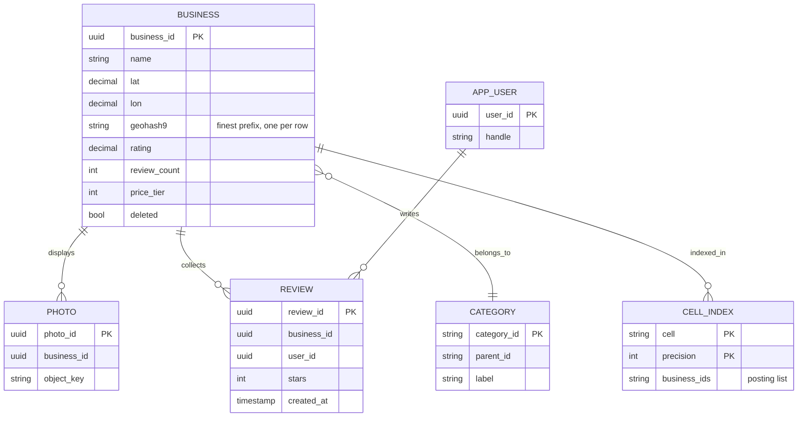
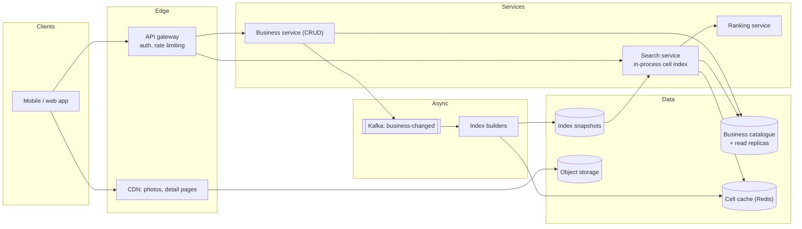
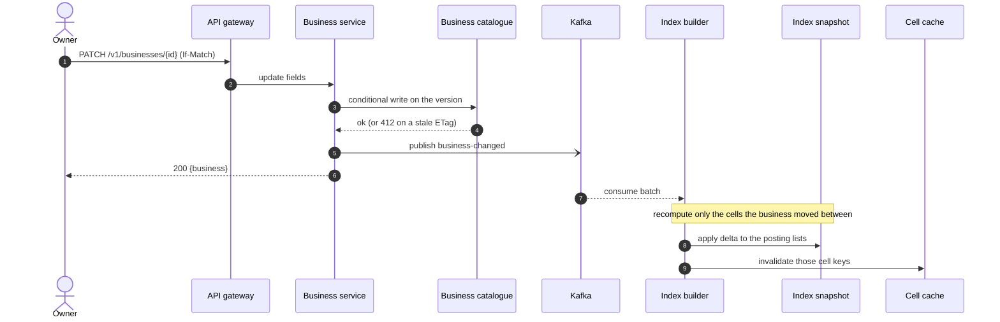
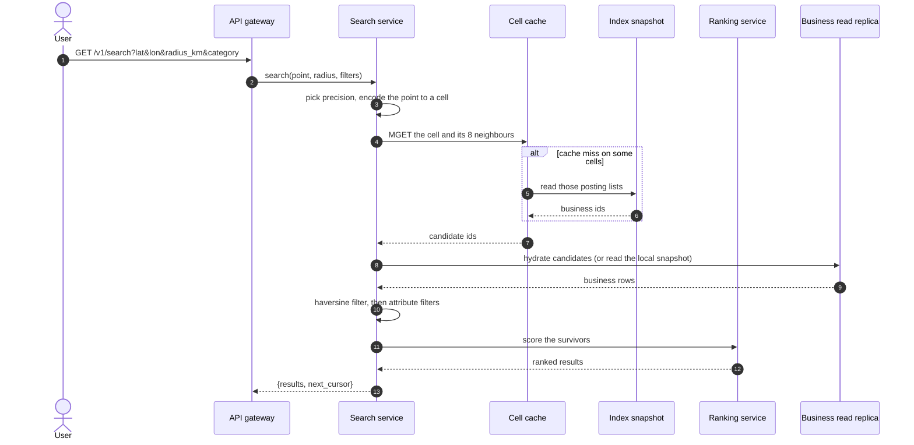
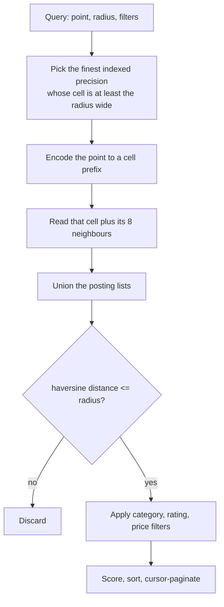
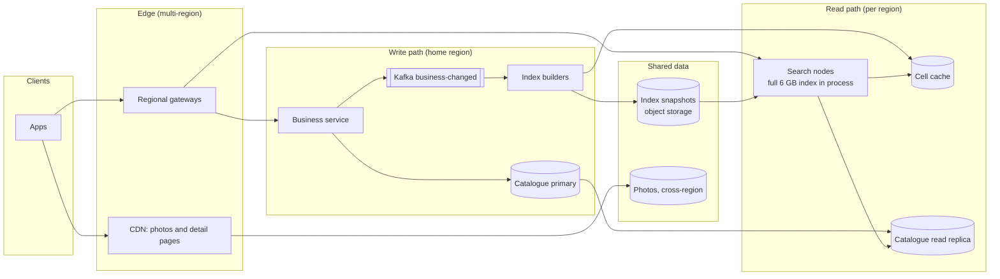

# Design Yelp (proximity service)

## TL;DR

- A proximity service is a **read-heavy, write-rare search problem**: ~4.5k searches/s against a business catalogue that changes a few times a second, so almost every design choice is about caching and replication.
- The cruxes: (1) **index choice** — geohash, quadtree or S2, (2) the **radius search**: cell plus its eight neighbours, then an exact haversine filter, (3) **caching by cell key** and replicating a small index everywhere, (4) keeping **business CRUD off the search path**, (5) **ranking and filtering** after the geometry, never instead of it.
- The whole geo index for 100M places is ~6 GB, so you replicate it rather than shard it, and the interesting engineering is in the read path.

## Problem statement and clarifying questions

"Design the backend for a local search service: users search for businesses near a point, filtered by category, rating and price, and see them ranked with distance." The clarifying answers below decide how much of the design is spatial and how much is plain search.

| Question | Assumption taken |
|---|---|
| Scale: businesses, users, searches? | 100M businesses, 30M DAU, 5 searches per user per day. |
| How often does the catalogue change? | ~100k creates or edits per day: writes are 1,500x rarer than reads. |
| What is a search? | A point, a radius (0.5-20 km), optional filters, and a page of ranked results. |
| Do businesses move? | Almost never. Unlike drivers, a location write is an edit, not a stream. |
| Free-text search too? | Out of scope; assume the query is category-plus-geography, not "best ramen". |
| Result freshness? | A new business appearing within a minute is fine. |
| Radius fixed or user-controlled? | User-controlled, but bucketed into a few sizes so the cache keys stay few. |
| Personalised ranking? | Ranking uses rating, distance and popularity; personalisation is a later stage. |
| Global or single region? | Global, with regional read replicas. |

## Requirements

### Functional

- Search businesses within a radius of a point, filtered by category, minimum rating and price tier.
- Return results ranked by a blend of rating, proximity and popularity, paginated.
- Create, edit and delete businesses (owner and moderation flows); serve business detail pages.
- New and edited businesses become searchable without a full index rebuild.

### Non-functional

- Scale: 100M businesses, 1.5k searches/s average and 4.5k/s at peak.
- Latency: search p99 under 100 ms server-side; a business detail page under 200 ms.
- Availability: 99.99% for search. A stale result is acceptable; an error page is not.
- Consistency: eventual for the index (a minute behind is fine); read-your-writes for an owner editing their own listing.
- Durability: the business catalogue is the system of record and must never be lost. The index is derived and rebuildable.

### Out of scope

Free-text relevance, reviews and photos beyond storage, reservations and ordering, ads, personalised ranking models, and map tile rendering.

## Estimation

Using the [latency and estimation tables](../../cheatsheets/latency-and-estimation.md): a day is ~10^5 s, peak is 3x average, a business row is ~1 KB (the user-profile row size), and a search response is ~10 KB of JSON.

| Quantity | Arithmetic | Result |
|---|---|---|
| Search read QPS | 30M DAU x 5 searches / 10^5 | ~1.5k/s average, ~4.5k/s peak |
| Catalogue write QPS | 100k edits/day / 10^5 | ~1/s average, ~3/s peak |
| Read/write ratio | 1.5k / 1 | **1,500:1** — the reason this is a caching problem |
| Business storage | 100M x 1 KB | 100 GB, ~300 GB at replication factor 3 |
| Geo index size | 100M x 16 B (id + cell) x 4 precisions | **~6.4 GB** — small enough to replicate to every search node |
| Photo storage | 100M x 10 photos x 200 KB | ~200 TB in object storage behind a CDN |
| Search bandwidth | 4.5k/s x 10 KB | ~45 MB/s = ~360 Mbps at the edge |
| Cache size (80/20) | 150M searches/day x 10 KB x 0.2 | 300 GB of responses — but keyed by *cell* it collapses to a hot subset of the 6.4 GB index, a few GB of posting lists |
| Search nodes | 4.5k/s peak / ~1k QPS per node, x2 headroom | ~10 nodes, each holding the full index |

The number to lead with is **6.4 GB**. A 100M-place index fits in one machine's memory, which means you do not shard it for capacity, you replicate it for throughput and latency — the opposite conclusion from most case studies, and the point the interviewer is checking you can reach.

## API design

| Endpoint | Request | Response | Notes |
|---|---|---|---|
| `GET /v1/search` | `?lat&lon&radius_km&category&min_rating&cursor&limit` | `200 {results[], next_cursor}` | Radius snapped to `{0.5, 1, 2, 5, 10, 20}` so cache keys are few. `Cache-Control: 60s`. |
| `GET /v1/businesses/{id}` | — | `200 {business, photos[], rating}` | Served from the read replicas and the CDN; ETag for conditional requests. |
| `POST /v1/businesses` | `{name, lat, lon, category, ...}` + `Idempotency-Key` | `201 {business_id}` | Owner flow; the index catches up asynchronously. |
| `PATCH /v1/businesses/{id}` | `{fields}` + `If-Match: <etag>` | `200 {business}` | Optimistic concurrency: a stale ETag gets `412`, so two moderators cannot clobber each other. |
| `DELETE /v1/businesses/{id}` | — | `204` | Soft delete, filtered on read and swept from the index by the next build. |

Pagination is a cursor over `(score, business_id)`. Offsets are wrong for the usual reason and one extra: the score changes when reviews arrive, so page 2 of an offset query repeats or skips results even without new businesses.

## Data model

**The catalogue is the system of record; the cell index is derived from it.**



- **Business catalogue**: relational, partitioned by `business_id`, with read replicas per region. 100 GB with rare writes is a workload one primary handles comfortably, and the relational model earns its keep for moderation, ownership and category joins.
- **Cell index**: `(precision, cell) -> business ids`, held in memory on every search node and mirrored into a distributed cache. Derived state: rebuild it from the catalogue in minutes.
- **Photos**: object storage plus a CDN; the database stores keys only.
- **Reviews**: their own store, partitioned by `business_id`; the search path uses only the rolled-up `rating` and `review_count`.

Index the finest prefix (`geohash9`) on the business row. Every coarser cell is a prefix of it, so one column supports every precision, and a range scan on `geohash9 LIKE '9q8yy%'` reconstructs any posting list without a second table.

## High-level design

**v1: a search path that touches memory and a cache, and a CRUD path that never touches the search path directly.**



**Write path: an edit is durable immediately and searchable within a minute.**



**Read path: nine cell reads, an exact filter, then ranking.**



The asymmetry is the design. The write path is a durable row plus an event; the read path never queries the catalogue for geometry, only for content it could equally hold in its own snapshot.

## Deep dive: choosing the spatial index

The probing question is "why geohash and not a quadtree?" Answer it with the workload, not with a preference.

| Index | Shape | Strength | Weakness |
|---|---|---|---|
| Geohash prefix | Fixed grid, base32 string | The prefix *is* a cell, so it caches and shards in any key-value store | Uniform cells: Manhattan and the Pacific get the same size; boundary problem |
| Quadtree | Adaptive tree | Dense areas subdivide, so candidate counts stay even | A pointer structure, harder to shard and cache; rebuilds on skew |
| S2 / H3 | Hilbert cells / hexagons | Better locality, uniform neighbour distances | More machinery than a read-mostly catalogue needs |
| PostGIS R-tree | Tree over bounding boxes | One `ST_DWithin` query, no extra service | The database becomes the scaling limit at 1,500:1 reads |

Choose the geohash prefix, and say why: **businesses barely move**, so a fixed grid's weakness — rebalancing under movement — never bites, while its strength, a string key that is simultaneously a cache key, a shard key and a database prefix, is what a read-heavy path wants. A quadtree's adaptive cells are the alternative worth weighing when points move every four seconds — though the [Uber dispatcher](ride-sharing.md) still takes geohash cells, because an index rebuilt from a log every few seconds never pays the rebalancing cost a quadtree saves.

Uniform cells still cause skew: a precision-6 cell in Manhattan may hold 5,000 businesses and one in the desert none. Index at **several precisions at once** and let the query pick the level matching its radius. At 16 B per entry and four levels, 100M businesses cost 6.4 GB, which buys both a 500 m and a 20 km search without either scanning the other's territory.

!!! tip "Interview tip"
    Say the index size early: "100M places at four precisions is about 6 GB, so it fits in memory on every search node." That single number converts the whole conversation from sharding to replication and caching, which is where the real content of this problem lives.

## Deep dive: the radius search

The probing question is the boundary problem: "a cafe 50 m from me is in a different cell — how do you find it?" Two points metres apart can sit in cells that share no prefix, so a single-cell lookup is silently wrong.

**How one query becomes a page of results.**



Two rules make this correct. **Never round the precision up**: a cell must be at least as wide as the radius, or the nine-cell ring stops covering the circle. **Always filter exactly**: cells are rectangles and radii are circles, so the last step is haversine distance, not a bounding box.

```python title="code/hld/geo_search.py — the search"
--8<-- "code/hld/geo_search.py:index"
```

The demo makes the cost and the boundary case visible. A 1 km search runs at precision 5, because geohash cells at even precisions are twice as wide as they are tall and the conservative rule drops a level; the nine cells still yield 9 candidates from 12 places, and 4 survive the exact filter:

```text
12 businesses indexed at precisions 4, 5, 6, 7
search 1 km: precision 5, 9 cells (query + 8 neighbours), 9 candidates of 12, 4 inside the radius
  0.827  0.05 km  4.1 stars  Union Square Espresso
  0.769  0.60 km  4.5 stars  Blue Bottle Mint Plaza
  0.760  0.39 km  3.9 stars  Powell Street Diner
  0.736  0.68 km  4.4 stars  Chinatown Dumplings
same search again: 9/9 posting lists served from cache, hit rate 50%
filter category=coffee rating>=4.4 within 2 km: 2 -> Blue Bottle Mint Plaza, Sightglass Coffee
widen to 20 km: precision drops to 4, still 9 cells, 12 candidates, 11 matches
boundary problem: b13 is 554 m north in cell 9q8zn, not 9q8yy; found by the neighbour scan: True
remove b3: 4 matches, 8/9 cache hits - only the cells it lived in were invalidated
```

If nine cells over-scan a dense city, index one level finer and read a ring of 25 instead: same correctness, tighter coverage, more lookups. That is the knob, and naming it is the point.

## Deep dive: caching and replicating a read-heavy index

At 1,500 reads per write, the design question is not "how do we shard this" but "how few times can we compute the same answer?" There are three cache layers, and each has a different key.

| Layer | Key | Hit rate | Invalidated by |
|---|---|---|---|
| CDN / client | Full request URL, radius snapped to a bucket | High for popular areas | 60 s TTL |
| Cell posting lists | `(precision, cell)` | Very high: every query in a neighbourhood shares it | The index builder, per changed cell |
| Business rows | `business_id` | High | The business service on edit |

The middle layer is the one that matters, because the cell key is **stable and shared**: thousands of distinct searches near the same corner read the same nine keys. Snapping the radius to a few buckets multiplies that again — an arbitrary `radius_km=1.37` would create a unique key per user.

Because the index is 6 GB you replicate it rather than shard it: every search node loads a snapshot at startup and applies the change stream, so a search is a memory lookup with no network hop, and the distributed cache mainly warms new nodes and absorbs misses. Regional replicas then keep the whole read path inside one datacenter — worth ~70 ms per cross-region round trip avoided.

!!! warning "Common mistake"
    Caching the *response* and nothing else. Response caches look great in a demo and collapse in production, because every user's coordinates differ by metres and no two keys ever match. Cache the layer whose key is shared — the cell — and let the per-request work be the cheap part.

## Deep dive: keeping business CRUD off the search path

The probing question is "an owner updates their address — what happens?" A design where the search service writes to the catalogue, or reads it per query, has coupled a 3 writes/s workload to a 4,500 reads/s one.

Three rules keep them apart. **The catalogue is the system of record**, owned by the business service: validation, ownership, moderation and the ETag all live there. **The index is derived**: a change event carries the old and new cells, so the builder applies a delta — remove the id from the old posting lists, add it to the new — and invalidates exactly those keys. Nothing rebuilds globally for one edit. **The search path is read-only**, so it can be scaled, restarted and rolled back without touching data anyone owns.

That split also gives you the operational answers. A bad deploy of the search service loses no data. A corrupted index is repaired by replaying the topic from a snapshot. A moderation action has to be fast, so hiding a fraudulent listing writes a small denylist the search service consults on read, rather than waiting for a build.

Call out the freshness gap: an owner who edits their listing and immediately searches may not see the change. Fix it where it is cheap — the owner's own view reads the catalogue directly, while everyone else gets the index a minute later.

## Deep dive: ranking and filtering

Geometry decides *which* results exist; ranking decides the order; filters remove some. The wrong order is a classic bug: filtering before the distance check evaluates attributes on candidates that were never in range, and ranking before filtering returns a page of 20 with 6 rows in it.

The score in the module is deliberately explainable — half rating, three-tenths proximity, two-tenths popularity, each normalised to 0-1:

- **Rating** alone promotes a 5-star place with 3 reviews above a 4.5-star institution, so popularity (log of review count) damps it.
- **Proximity** is relative to the requested radius, so "nearest" means something different for a 500 m and a 20 km search — which is what users expect.
- **Filters** are attribute predicates applied after the distance test, on a candidate set already reduced from 100M to tens.

Production replaces the weights with a learned model, but the *shape* stays: cheap geometry narrows the field to a few hundred, an expensive scorer ranks only those. Say that out loud — it is the same two-stage pattern as feed ranking, and it is what keeps p99 under 100 ms.

Very selective filters — an uncommon category in a sparse area — invert the economics: nine cells scanned for three matches. If that becomes common, add a secondary index keyed by `(category, cell)` so the posting list arrives pre-filtered. Mention it as a measured optimisation, not a default.

## Scaling, bottlenecks and failure modes

**v2: regional read paths, full index replicas, and a builder that never blocks a write.**



- **A hot cell** downtown is the first real bottleneck: one posting list of 5,000 ids read thousands of times a second. In-process the read costs nothing extra, but the cache entry is large — pre-truncate each cached cell to its top few hundred by score and keep the full list on the search node.
- **Index build lag** after a partner feed of a million listings delays searchability. Partition the topic by cell prefix so builders parallelise, and keep bulk imports on a low-priority topic so one import cannot starve a live edit.
- **A cache stampede** when a popular cell expires: single-flight the miss so one request rebuilds the entry while the rest wait.
- **Catalogue primary loss** stops writes but not searches: the index and caches keep serving, the correct blast radius for a read-heavy service.
- **Snapshot corruption** is the scariest failure because it replicates everywhere. Version snapshots, validate a checksum and a sample of queries before a node accepts one, and keep the previous version for instant rollback.
- **A region failure** routes traffic elsewhere; the index is identical everywhere, so the only cost is cross-region catalogue reads.

## Trade-offs summary

| Decision | Chosen | Alternatives | Why |
|---|---|---|---|
| Spatial index | Geohash prefix, multiple precisions | Quadtree, S2/H3, PostGIS | Businesses do not move; the prefix is also a cache and shard key |
| Index placement | Replicated in-process, 6 GB | Sharded index service | Removes a network hop from every search |
| Radius search | Cell + 8 neighbours, then haversine | Bounding box only, ring of 25 cells | Correct at the boundary, one lookup per neighbour |
| Cache key | `(precision, cell)` | Full response URL | Cell keys are shared across users; URLs are not |
| Radius values | Snapped to 6 buckets | Arbitrary float | Turns a unique key per user into six |
| Index freshness | Async, ~1 minute | Synchronous index write | Keeps a 3 writes/s path from touching a 4.5k reads/s one |
| Owner freshness | Owner reads the catalogue directly | Wait for the index | Read-your-writes for one user, eventual for everyone else |
| Ranking | Explainable weights, after filtering | Learned model in the loop | Two-stage retrieval keeps p99 under 100 ms |

## Interviewer follow-ups

??? question "Why not just use PostGIS with an R-tree and a `ST_DWithin` query?"
    For a smaller catalogue, do exactly that — less machinery, and correct. It stops being the right answer when search QPS outgrows what the primary and its replicas serve, because your query path and your write path now share a failure domain. The migration is gentle: keep PostGIS as the system of record and move the query to a derived cell index.

??? question "How do you handle a very dense area where one cell has thousands of businesses?"
    Index one level finer and read a ring of 25 cells rather than 9, or cap the cached posting list to the top-N by score and keep the full list only where it is cheap to hold. Both are per-region tuning decisions; the important thing is that the *query shape* does not change.

??? question "The user drags the map — do you re-query every frame?"
    No. Snap the viewport centre to a cell at the display precision and re-query only when the cell changes, and debounce for a few hundred milliseconds. Combined with radius bucketing, a user panning across a city issues a handful of cacheable queries rather than sixty unique ones.

??? question "How do you keep 'open now' correct without rebuilding the index?"
    Opening hours are an attribute filter evaluated at read time against the business row, using the business's own timezone. Never bake time-dependent state into an index that a builder refreshes once a minute — you would be invalidating half the world's cells every hour.

??? question "What happens when a business is deleted for fraud?"
    Soft-delete in the catalogue and publish the event, but do not wait for the index. The search service consults a small in-memory denylist of recently suppressed ids on every read, so the listing disappears in seconds; the next index build removes it for good.

??? question "How would you add free-text search on top of this?"
    Put an inverted index next to the cell index and intersect the candidate sets: text retrieval gives a few thousand ids, the geo filter cuts them to a few dozen, the ranker orders the rest. Whichever side is more selective runs first — a query-planning decision, not a fixed pipeline.

## 45-minute pacing

| Minutes | What to say and draw |
|---|---|
| 0-5 | Clarify: 100M businesses, 30M DAU, 5 searches/day, category-and-geography only, one-minute freshness. |
| 5-9 | Estimation: 4.5k searches/s, 3 writes/s, 1,500:1 read ratio, a 6.4 GB index. State that this is replicate-not-shard. |
| 9-14 | API (search with a bucketed radius, business CRUD with ETags) and the data model; note the derived index. |
| 14-24 | v1 diagram; narrate the write path (durable row, event, delta build) and the read path (nine cells, exact filter, rank). |
| 24-38 | Deep dives: index choice, the cell-plus-neighbours search with the boundary problem, cache layers and their keys. |
| 38-43 | Bottlenecks: hot cells, build lag, stampedes, snapshot corruption and rollback. |
| 43-45 | Trade-offs table, and one sentence on how free-text search would attach. |

## Related

- [Geospatial indexing](../fundamentals/geospatial-indexing.md) — geohash encoding, neighbours, the precision table and haversine
- [Design Uber (with a DoorDash variant)](ride-sharing.md) — the same index under a write-heavy workload of moving points
- [Design Nearby Friends](nearby-friends.md) — proximity as a push problem rather than a query
- [Caching and CDNs](../fundamentals/caching-and-cdn.md) — cache keys, single-flight and stampede control used throughout
- Primary source: the S2 Geometry library documentation on cell hierarchies and Hilbert-curve ordering
