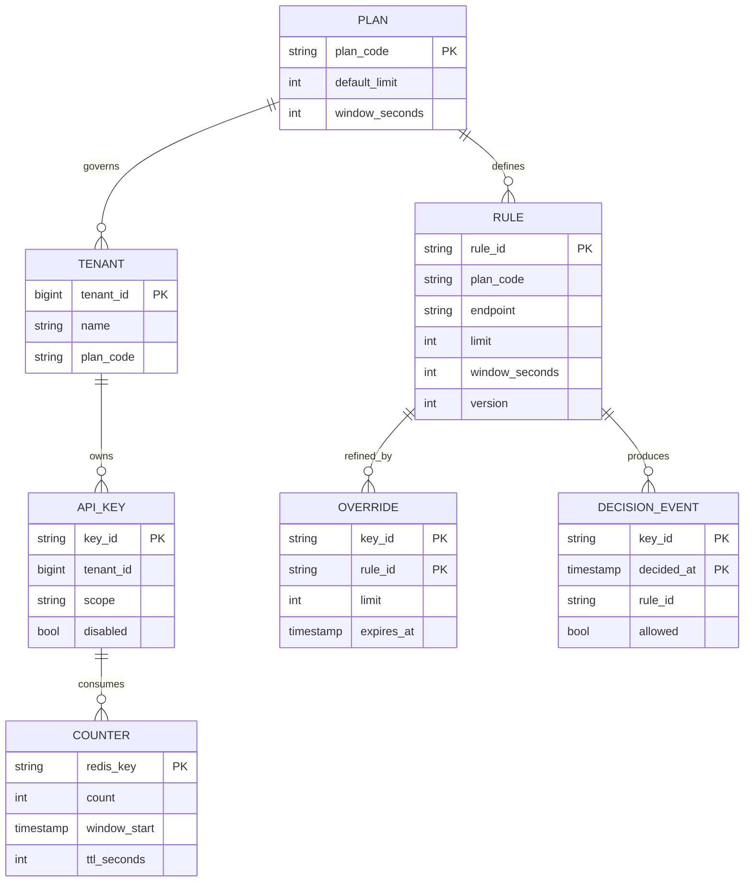
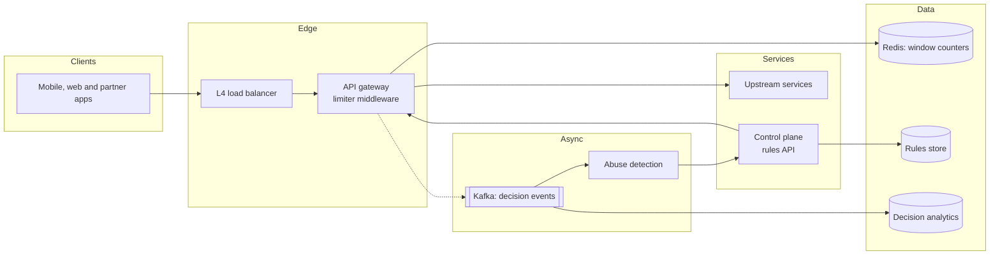
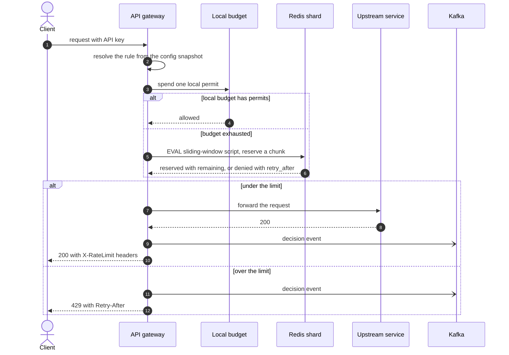
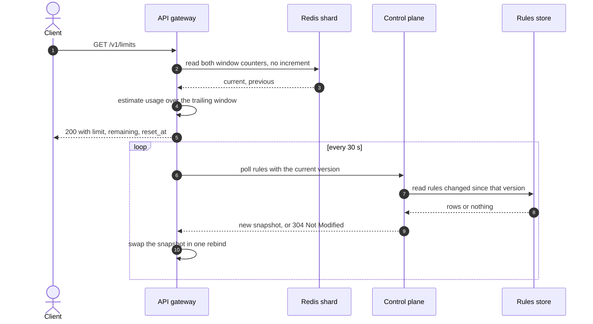
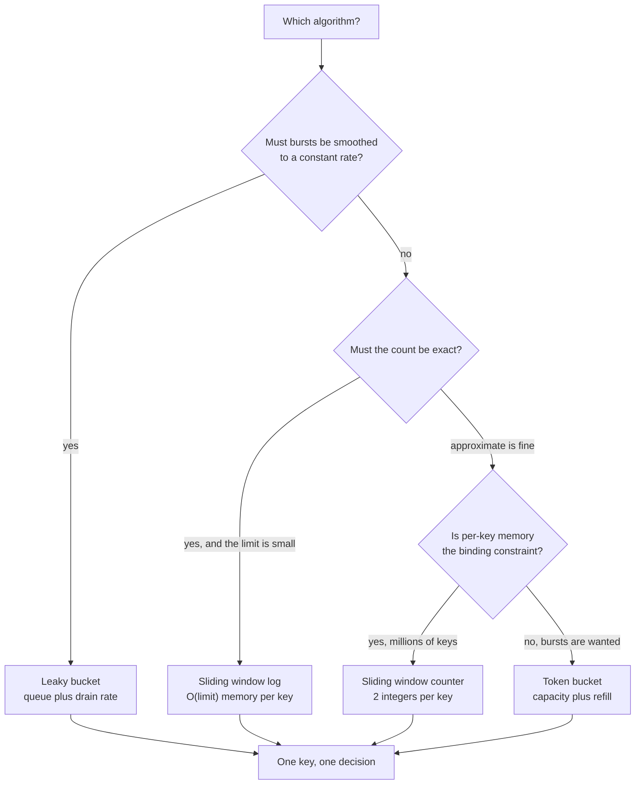
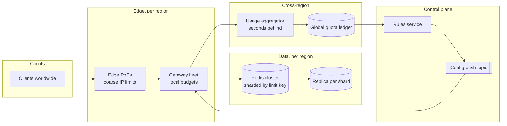

# Design a distributed rate limiter

## TL;DR

- A rate limiter sits **in series with every request**, so its latency and availability add to the whole platform's. That drives every decision: one atomic round trip, a local budget in front of it, fail-open when the counter store is unreachable.
- The cruxes an interviewer probes: (1) **which algorithm** (memory against accuracy), (2) **where it runs** — gateway, sidecar or library, (3) the **distributed counter**: Redis atomicity, the read-then-write race, local-then-global budgets, (4) rules and **hot reload**, (5) **multi-region** drift.
- The design decides in one atomic Redis script, serves most requests from a per-node budget, and reloads rules without a restart.

## Problem statement and clarifying questions

"Design the rate limiter for our public API: it must stop any single customer from consuming more than their share, return a clean 429, and work across a fleet of gateway nodes in several regions." A limiter is infrastructure, so pin down the failure behaviour and the accuracy tolerance early — those two answers decide the design.

| Question | Assumption taken |
|---|---|
| Traffic volume? | 5B API requests/day: ~50k/s average, ~150k/s peak, all needing a decision. |
| What identifies a caller? | API key first, then user id, then client IP for unauthenticated routes. |
| One limit or many? | Many: per plan, per endpoint, per key, with per-customer overrides. |
| How exact must the limit be? | Approximate within a few percent; charging is a separate system. |
| Added latency budget? | Under 1 ms at p99 for the limiter itself. |
| What if the counter store is down? | Fail open, alarm loudly, fall back to a coarse per-node limit. |
| Client feedback? | 429 with `Retry-After` and `X-RateLimit-*` on every response. |
| Do limits change at runtime? | Yes — new rules take effect within a minute, without a deploy. |
| Multiple regions? | Three. A caller may hit any of them within one window. |

## Requirements

### Functional

- Decide allow or deny for every request against the rules matching its key, plan and endpoint.
- Return `429` with `Retry-After`, plus `X-RateLimit-Limit`, `-Remaining` and `-Reset` on every response.
- Support per-plan defaults, per-endpoint rules and per-customer overrides with an expiry.
- Reload rules without restarting a node; expose the current version for auditing.
- Emit a decision stream for abuse detection and customer dashboards.

### Non-functional

- Scale: ~150k decisions/s at peak across three regions, a few million keys active per window.
- Latency: under 1 ms p99 added. A same-datacenter round trip is ~500 µs, so a limiter that talks to Redis on every request has spent half the budget; a local check is a ~100 ns memory reference.
- Availability: 99.99%. The limiter multiplies with everything behind it — two 99.9% services in series give 99.8% — so it must degrade rather than fail.
- Accuracy: over-admitting by a few percent is fine; under-admitting a paying customer is not.
- Consistency: counters are eventually consistent across regions; within a region a decision is atomic.

### Out of scope

Billing and metered quotas, WAF and bot detection, network-layer DDoS scrubbing, per-request authorisation.

## Estimation

Using the [latency and estimation tables](../../cheatsheets/latency-and-estimation.md): a day is ~10^5 s, peak is 3x average, Redis does ~100k ops/s per instance, a memory reference is ~100 ns, a same-datacenter round trip ~500 µs.

| Quantity | Arithmetic | Result |
|---|---|---|
| Decision QPS (writes) | 5B / 10^5 | ~50k/s average, ~150k/s peak |
| Quota-status reads | 1% of clients poll `GET /v1/limits` | under 1k/s — negligible |
| Redis ops, no local tier | 150k/s / ~100k ops/s per instance | 2 shards minimum, 4 with headroom |
| Redis ops, chunk of 20 | 150k/s / 20 | ~7.5k/s — one shard plus replicas |
| Counters, sliding window counter | 5M active keys x 2 counters x ~50 B | ~500 MB per region |
| Counters, sliding window log | 5M keys x 1,000 timestamps x 8 B | ~40 GB — 80x more |
| Rules snapshot | ~5k rules x 200 B | ~1 MB per gateway process |
| Decision stream | 1% rejections x 150k/s x 200 B | ~300 KB/s = ~26 GB/day, ~9 TB/year |
| Added latency, local hit | a memory reference plus an uncontended lock | ~100 ns + ~17 ns |
| Added latency, Redis hit | one same-datacenter round trip | ~500 µs, paid by 1 request in 20 |

Say two things out loud: the **80x memory difference** between an exact log and an approximate counter, and the availability multiplication — a limiter with three nines in front of a service with four takes the platform to three. Both push the same way: keep the shared state tiny, and keep most requests away from it.

## API design

The data plane has no API of its own — it is middleware. What needs endpoints is the control plane and the client's view of its quota.

| Endpoint | Request | Response | Notes |
|---|---|---|---|
| any proxied request | — | `200` or `429` + `X-RateLimit-*` | `Retry-After` in seconds on a 429; headers are advisory, not a retry contract. |
| `GET /v1/limits` | — | `200 {limits: [{scope, limit, remaining, reset_at}]}` | The caller's own view; reads counters, never increments. |
| `PUT /v1/rules/{rule_id}` | `{plan, endpoint, limit, window_seconds}` + `If-Match` | `200 {rule_id, version}` | `If-Match` on the version makes concurrent edits safe; a blind write gets `412`. |
| `POST /v1/overrides` | `{key_id, rule_id, limit, expires_at}` + `Idempotency-Key` | `201 {override_id}` | Per-customer exceptions always carry an expiry. |
| `GET /v1/rules?limit=100&cursor=...` | — | `200 {rules: [...], next_cursor, version}` | Cursor-paginated; gateways poll with the version, `304` when unchanged. |

Two contract notes. Rule writes are **conditional**, not idempotent-by-key: two operators editing one limit must not overwrite each other. And `X-RateLimit-Remaining` is a hint — with a local budget it is a per-node figure, and implying otherwise invites support tickets.

## Data model

**Rules are small, durable and read constantly; counters are large, ephemeral and read once.**



- **RULE, OVERRIDE, PLAN, API_KEY**: a small relational store. Thousands of rows, edited by humans, read by a poller — the one place where transactions and constraints earn their keep. Index `RULE` on `(plan_code, endpoint)`.
- **COUNTER**: Redis, keyed `{scope}:{key}:{window_index}` with a TTL of two windows, so expiry is the garbage collector. Sharded by the limit key, which is also what pins one hot customer to one shard.
- **DECISION_EVENT**: Kafka partitioned by `key_id`, landing in a columnar store; never on the request path, and sampled for allows.
- **The rules snapshot** lives in every gateway process as an immutable mapping — the only cache in the design, refreshed by pull rather than invalidation.

## High-level design

**v1: limiter middleware inside the gateway, one Redis per region for counters, a control plane for rules.**



**Write path: the decision that spends a permit.**



**Read path: the caller's quota view, and the rules poll that keeps every node in step.**



The shape to notice: the hot path is a rule lookup in local memory plus, once every `chunk` requests, one Redis script. Everything else — rules, analytics, abuse detection — runs on a slower loop that no request waits for.

## Deep dive: choosing the algorithm

"Which algorithm, and what does it cost per key?" Five candidates; the trade is memory against accuracy against burst behaviour.

| Algorithm | State per key | Bursts | Accuracy | Cost |
|---|---|---|---|---|
| Fixed window | 1 counter | 2x at the boundary | Poor at edges | One `INCR` |
| Sliding window log | `limit` timestamps | Exact | Exact | O(limit) memory |
| Sliding window counter | 2 counters | Smooth | ~1% error | Two reads, one write |
| Token bucket | level, timestamp | Burst up to capacity | Exact | Two fields |
| Leaky bucket | depth, timestamp | Constant rate | Exact | Two fields, adds delay |

Choose the **sliding window counter** for a public API. It removes the boundary burst that makes fixed windows embarrassing to explain, it costs two integers per key rather than a thousand timestamps, and its error only shows when the previous window's traffic was extremely unevenly spread. The estimate is `previous * overlap + current`, where `overlap` is how much of the previous window still lies inside the trailing one.

Keep **token bucket** for anything where a burst is a feature — a mobile client syncing on launch, a batch importer — and **sliding window log** for small, security-sensitive limits such as five failed logins per hour. [Rate limiting](../fundamentals/rate-limiting.md) implements all five behind one protocol.

**How the choice falls out.**



!!! warning "Common mistake"
    Naming an algorithm and stopping. The interviewer wants the *cost* attached: "the log is exact but costs `limit` timestamps per key, 40 GB at our key count, so I take the counter's 1% error and 500 MB." Numbers turn a memorised list into a decision.

## Deep dive: where the limiter runs

"Where in the request path does this code execute?" Three placements, and they are not exclusive.

| Placement | Latency | Blast radius | Fits |
|---|---|---|---|
| Gateway middleware | A hop already in the path | Everything behind it | Public APIs, per-customer plans |
| Service-mesh sidecar | Local, ~100 µs | One service | Internal service-to-service limits |
| In-process library | Nanoseconds, no hop | One process | The fail-open fallback |

Put the customer-facing limiter in the **gateway**, because that is where identity already lives: it has authenticated the API key, so it knows the plan, the tenant and the endpoint without another lookup. It also fails in a place operators understand and can bypass.

Add the other two as layers, not alternatives. A **sidecar or mesh policy** protects one service from internal callers the gateway cannot see. An **in-process limiter** is the last line: a fixed cap per node with no dependencies, which runs when Redis is unreachable. Each layer answers a different question — is this customer over their plan, is this service overwhelmed, is this process about to fall over?

Two details worth raising. The limiter runs **before** authentication for IP-based limits and **after** it for key-based ones, so most gateways make two passes. And the edge PoP carries a coarse IP limit of its own, because the cheapest request to reject is one that never crosses the network. See [Load balancing, reverse proxies and API gateways](../fundamentals/load-balancing-and-api-gateway.md).

## Deep dive: the distributed counter

The crux. Fifty gateway nodes share one counter per key; the interviewer wants to know what happens when two decide at the same instant.

The naive implementation reads the counters, decides, then increments — two round trips. Every node that reads before any of them writes sees the same room and admits. With eight gateways and a limit of five, all eight pass. The fix is to make check-and-increment **one operation**: a Lua script, which Redis runs to completion on its single-threaded event loop.

```python title="code/hld/distributed_rate_limiter.py — the counter and its Lua-atomic script"
--8<-- "code/hld/distributed_rate_limiter.py:sliding_window"
```

The module simulates Redis with a lock so both versions run side by side: `eval` holds it for the whole script, `mget` and `incr` do not.

```python title="code/hld/distributed_rate_limiter.py — local budget in front of the global counter"
--8<-- "code/hld/distributed_rate_limiter.py:two_tier"
```

The second piece is **local-then-global**. Talking to Redis on every request costs a ~500 µs round trip and 150k ops/s of load. Instead a node reserves a chunk of permits in one call and serves them from memory, cutting round trips by the size of the chunk. The accuracy cost points the safe way: a reservation a node never spends is lost when the window rolls over, so the effective limit is slightly *under* the configured one, never over it. The cooldown matters as much — after a refusal the node stops asking until `retry_after` elapses, because a limiter that retries on every rejected request sends *more* traffic to Redis under attack than at rest.

`uv run python -m hld.distributed_rate_limiter` shows both effects:

```text
limit 5/s, 7 requests at t=0: 5 allowed, 2 rejected
  429 payload: {'X-RateLimit-Limit': '5', 'X-RateLimit-Remaining': '0', 'Retry-After': '1'}
boundary burst, 5 requests at t=0.5/1.0/1.5/2.0: 0.5->5 1.0->0 1.5->2 2.0->3  (a fixed window would pass 5 at t=1.0)
8 gateways, read-then-write: 8 allowed for a limit of 5 -- the race
8 gateways, one atomic script: 5 allowed -- exactly the limit
two-tier, chunk 50: 2000/2000 allowed using 40 Redis round trips (40 commands) instead of 2000
rules v1: free=5/s, unknown scope falls back to 60/min
hot reload -> v2: free=20/s, no restart and no lock on the read path
```

Two numbers carry the deep dive: eight against five, and forty round trips against two thousand.

## Deep dive: rules and hot reload

"An operator raises a customer's limit. How long until every node honours it, and what breaks in between?" Rules are configuration, and configuration on the hot path of every request must be read without a lock and changed without a restart.

Each gateway polls the control plane every 30 seconds with the version it holds and gets a `304` when nothing changed — a few hundred bytes per poll, and a new rule reaches the fleet inside a minute. A config topic every node subscribes to cuts that to seconds; keep the poll as the fallback, because a node that missed a push must still converge.

The reload itself must be **atomic from a reader's point of view**. Build the whole new snapshot as an immutable mapping, then rebind one reference. A request in flight sees either the entire old configuration or the entire new one, never a half-applied change where the limit rose but the window did not.

```python title="code/hld/distributed_rate_limiter.py — a snapshot swap with lock-free readers"
--8<-- "code/hld/distributed_rate_limiter.py:rules"
```

Three operational rules go with it. **Version every snapshot** and log the version with each decision, so "why was this rejected at 14:02?" is answerable. **Validate before publishing** — a limit of zero silently blocks a customer, so reject it at the API. And **stage risky changes** in shadow mode, counting what a rule *would* have rejected. That habit prevents most rate-limiter incidents.

## Deep dive: multi-region and eventual accuracy

"A customer with a 1,000/minute limit sends traffic to all three regions. What is their real limit?" Be honest: it depends on what you choose, and every option is a compromise.

| Approach | Effective limit | Added latency | Notes |
|---|---|---|---|
| Independent per-region counters | Up to 3x the limit | None | Simple, predictable, generous |
| Split the budget by region | The limit, unevenly used | None | An idle region wastes its share |
| One global counter, home region | The limit | ~70 ms cross-region | Unacceptable on the hot path |
| Local counters, async merge | The limit within seconds | None on the hot path | The standard answer |

Take the last one. Each region limits against its own counter while an aggregator merges regional usage every few seconds; when a customer's global usage approaches the limit, the control plane tightens the regional budgets. You trade a few seconds of over-admission for keeping a cross-region call off every request — at a 1,000/minute limit, a few dozen extra requests that no capacity plan cares about.

Say the quiet part out loud: routing already makes per-region limits mostly correct, because a customer's traffic lands in one region until something fails over. The case that matters is the hour after a failover, when everyone's traffic moves at once — exactly when you least want to be strict, and exactly when a statically split budget strands two-thirds of itself in idle regions.

## Scaling, bottlenecks and failure modes

**v2: regional Redis clusters, budgets pushed from a control plane, and a cross-region usage aggregator off the hot path.**



What breaks first, and what you do:

- **Redis is unreachable.** Fail open onto the in-process fallback and alarm. Failing closed turns a cache outage into a total outage. Fail *closed* only where the limit protects something that cannot absorb the load, such as a login endpoint.
- **One customer becomes a hot key.** Their key hashes to one shard, which saturates. The local budget absorbs most of it; beyond that, shard the key into `key:0..n`, each node picking one and the limit divided by `n`.
- **A gateway node dies holding reservations.** Those permits are lost until the window rolls: with a chunk of 20 against a limit of 1,000, under 2% of the budget. That is why chunks stay small.
- **Thundering herd after a window rolls.** Every node's budget expires at the same instant and they all hit Redis together. Jitter the local expiry by a few percent per node.
- **Clock skew between gateways.** Boundaries come from local clocks, so a node minutes ahead uses the wrong bucket. Compute the boundary inside the Redis script, where there is one clock, and monitor NTP drift.
- **The control plane is down.** Nodes keep serving the last snapshot they hold; configuration is in memory precisely so this outage is invisible to traffic.

## Trade-offs summary

| Decision | Chosen | Alternatives | Why |
|---|---|---|---|
| Algorithm | Sliding window counter | Fixed window, log, token bucket | No boundary burst, two integers per key, ~1% error |
| Atomicity | One Lua script per decision | Read then write, `WATCH` | Read-then-write over-admits by the number of racing nodes |
| Round trips | Chunked local reservation | Redis on every request | 20x fewer round trips; errs under the limit, never over |
| Placement | Gateway, plus sidecar and in-process | Gateway only | Each layer answers a different question |
| Failure mode | Fail open with a local fallback | Fail closed | The limiter multiplies with everything behind it |
| Rules | Polled snapshot, atomic swap | A lookup per request | No lock on the read path; survives a control-plane outage |
| Multi-region | Regional counters, async merge | One global counter | A ~70 ms hop cannot sit on every request |

## Interviewer follow-ups

??? question "Why not `INCR` with `EXPIRE` and be done?"
    Because they are two commands. If a node crashes between them the key never expires and the customer is limited forever. Do both inside one script — the same class of bug as the read-then-write race, with a longer fuse.

??? question "What do the headers say when a local budget is in play?"
    The node's local remaining, and say so in the documentation. A global figure costs a round trip per response, defeating the local tier. Clients treat the headers as a hint and honour `Retry-After`, the only value you can promise.

??? question "How do you rate-limit unauthenticated traffic?"
    By IP at the edge, coarsely, knowing an IP is a poor identity: carrier NAT puts thousands of users behind one address and attackers rotate addresses cheaply. Pair it with a global limit on the endpoint itself, and put expensive work behind a challenge.

??? question "A customer says they are limited below their plan. How do you debug it?"
    The decision stream, keyed by their API key with the rule id and rules version on every event: which rule fired, which version was in force, on which node. Without that logging the question has no answer.

??? question "How is this different from a load shedder or a circuit breaker?"
    A rate limiter enforces a contract per caller and is fair by design. A load shedder drops traffic when the *system* is unhealthy, whoever sent it. A circuit breaker protects a caller from a failing dependency. Shed load first, limit per key second, breakers behind both. Queueing instead of rejecting is a fourth option, and only fits leaky-bucket shaping: on a public API it turns a fast 429 into a slow timeout.

??? question "How do you test a limiter before it goes live?"
    Shadow mode: evaluate every rule and record the verdict without acting on it, then compare the projected 429 rate against a day of real traffic. Add a deterministic test with a fake clock and a barrier that forces the read-then-write interleaving.

!!! tip "Interview tip"
    Lead with the sentence "this component is in series with every request, so its availability multiplies with the platform's". Everything else — the atomic script, the local budget, fail-open — follows from it, and you have shown you are thinking about the system rather than reciting token-bucket mechanics.

## 45-minute pacing

| Minutes | What to say and draw |
|---|---|
| 0-5 | Clarify: 150k decisions/s peak, per-key and per-endpoint rules, approximate is fine, fail open, three regions. |
| 5-10 | Estimation: 50k/s average, 150k peak, 500 MB of counters against 40 GB for a log, and the availability multiplication. |
| 10-14 | Rules and counters as two very different stores; the 429 contract and `X-RateLimit-*`. |
| 14-22 | v1 diagram; narrate the decision path (rule lookup, local budget, Redis script) and the rules poll. |
| 22-34 | Deep dives: algorithm cost per key, the atomic script and the race, then local-then-global. |
| 34-40 | Placement layers, hot reload with the snapshot swap, multi-region reconciliation. |
| 40-45 | Failure modes (Redis down, hot key, herd after a roll) and the trade-offs table. |

## Related

- [Rate limiting](../fundamentals/rate-limiting.md) — the five algorithms behind one protocol
- [Design a rate limiter (LLD)](../../lld/problems/rate-limiter-lld.md) — the same problem in an object-oriented round
- [Load balancing, reverse proxies and API gateways](../fundamentals/load-balancing-and-api-gateway.md) — where the middleware runs
- [API design for HLD rounds](../fundamentals/api-design.md) — the 429 contract, headers, pagination
- [Resilience patterns](../fundamentals/resilience-patterns.md) — load shedding and circuit breakers
- Primary sources: RFC 6585 section 4 (429 Too Many Requests); Redis documentation on Lua script atomicity
