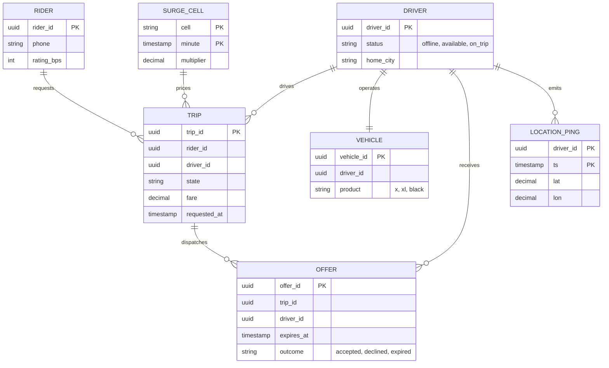
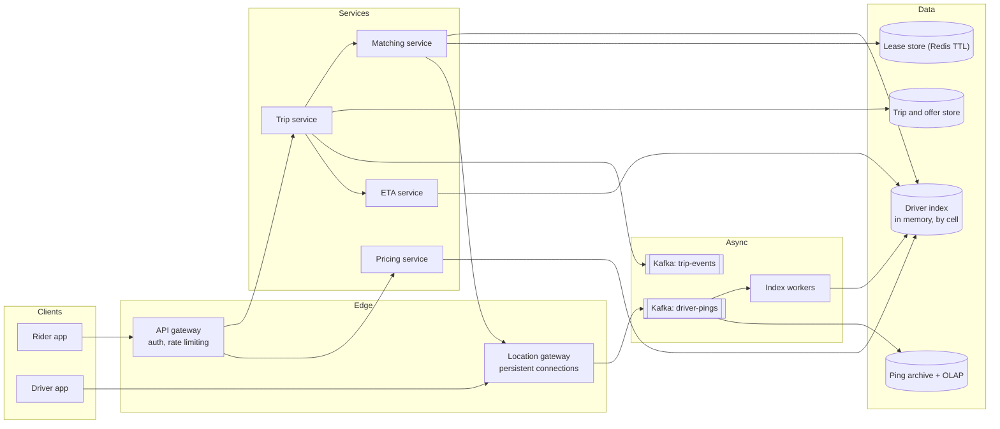
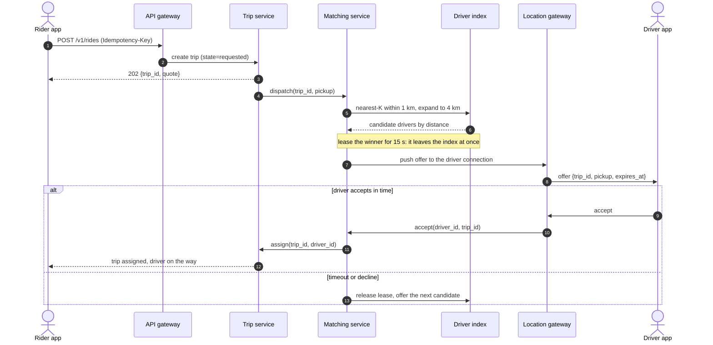
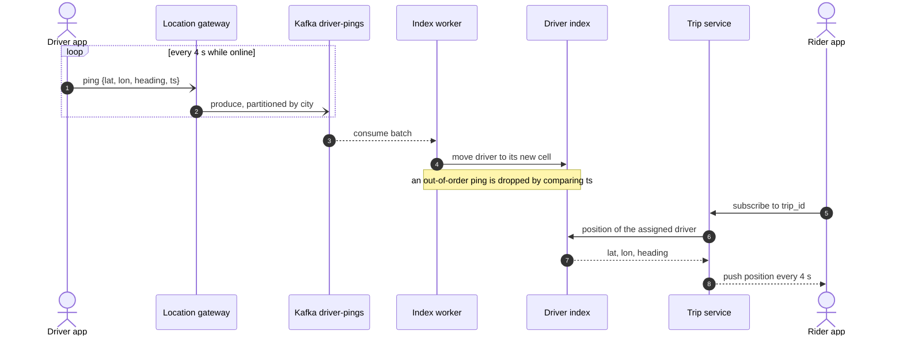
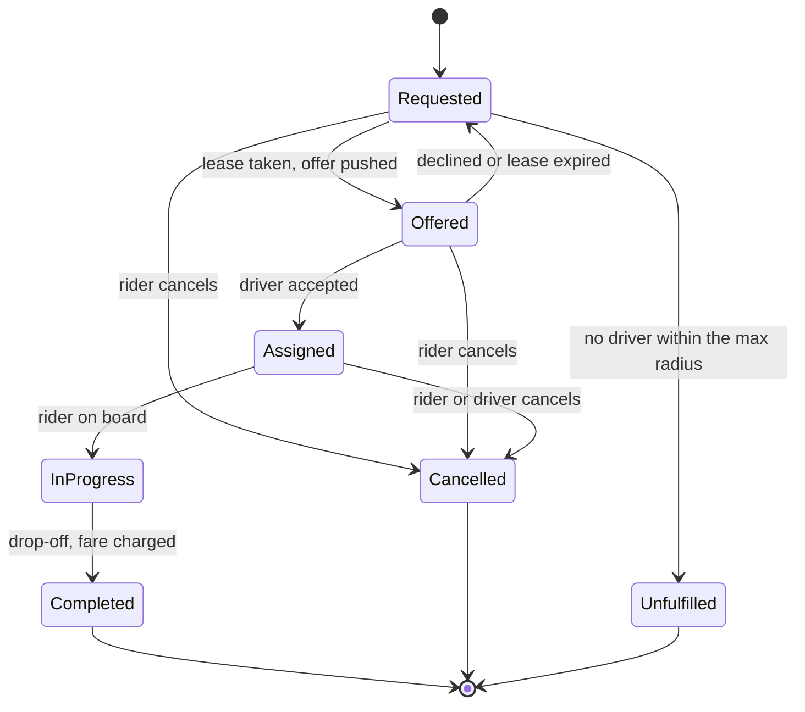
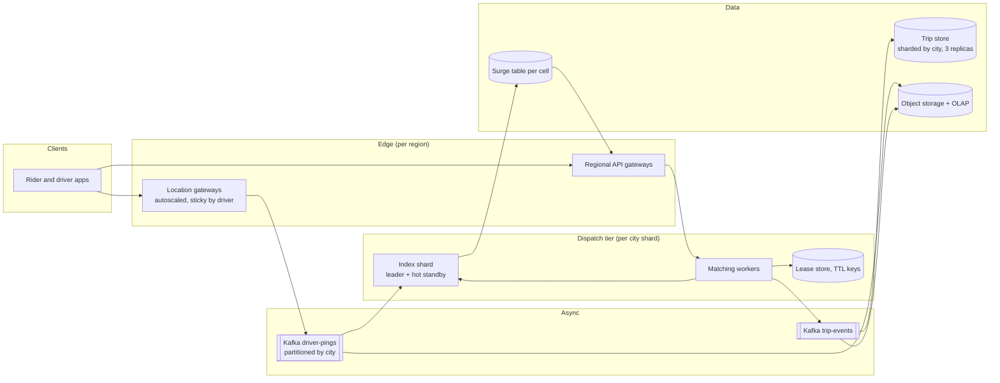

# Design Uber (with a DoorDash variant)

## TL;DR

- Ride-hailing is a **write-heavy location problem wrapped around a tiny matching problem**: 375k pings/s feed an in-memory geo index that answers only ~150 searches/s.
- The cruxes: (1) **location ingestion** with no database in the hot path, (2) **matching** with nearest-K, radius expansion and a **driver lease** so nobody is dispatched twice, (3) the **trip state machine** and its retry loop, (4) **per-cell surge**, (5) the **DoorDash variant**, where the restaurant owns the clock.
- Every online driver fits in ~150 MB of RAM, the durable stores stay off the ping path, and the system degrades by widening the radius rather than failing.

## Problem statement and clarifying questions

"Design the backend for a ride-hailing service: drivers stream their location, riders request a ride from a pickup point, the system matches them, and both sides track the trip." The answers below decide whether you need a spatial database at all — spoiler: you do not.

| Question | Assumption taken |
|---|---|
| Scale: rides, drivers? | 5M rides/day, 500k drivers online on average, 1.5M at peak. |
| How often do drivers report location? | Every 4 seconds while online, over a persistent connection. |
| Match on distance or road ETA? | Shortlist by distance, re-rank the shortlist by road ETA. |
| Can a driver hold two offers at once? | Never. One outstanding offer per driver is a hard invariant. |
| What if a driver ignores the offer? | It expires after 15 s and moves to the next candidate. |
| Are driver positions strongly consistent? | No. A car 4 s stale is fine; a busy driver being matched is not. |
| One region or global? | Global, but no trip crosses a region, so shard by city. |
| Can the price move during the request? | No. The quote is signed for 120 s. |

## Requirements

### Functional

- Drivers go online, stream location, accept or decline offers, and drive a trip to completion.
- Riders request a ride, see a quote, watch the assigned driver approach, and can cancel.
- Each request matches exactly one nearby available driver, and re-dispatches on decline or timeout.
- Prices reflect local supply and demand; trips are stored for receipts and support.

### Non-functional

- Scale: 1.5M concurrent driver connections at peak, 375k pings/s, 150 ride requests/s.
- Latency: dispatch under 2 s p99 (the rider is watching a spinner); ping accepted under 100 ms p99.
- Availability: 99.99% on the request-a-ride path. Ingestion may shed load; matching may not.
- Consistency: strong for the lease and the trip state machine; eventual for positions and prices.
- Durability: every trip and fare is durable. Raw pings are not — losing a second is invisible.

### Out of scope

Routing and map data (assume an ETA service), payments and payouts, fraud, driver onboarding, pooled rides, and rider-facing recommendations.

## Estimation

Using the [latency and estimation tables](../../cheatsheets/latency-and-estimation.md): a day is ~10^5 s, peak is 3x average, and a ping (driver id, coordinate pair, heading, timestamp) is ~100 B — the small end of the chat-message range.

| Quantity | Arithmetic | Result |
|---|---|---|
| Location write QPS | 1.5M drivers at peak / 4 s per ping | ~375k pings/s peak, ~125k/s average |
| Ping bandwidth | 375k/s x 100 B | ~37 MB/s, which one Kafka broker absorbs (~100 MB/s in) |
| Raw ping storage | 125k/s x 10^5 s x 100 B | ~1.25 TB/day, ~450 TB/year — so you never keep it raw |
| Ride request QPS | 5M rides/day / 10^5 | ~50/s average, ~150/s peak |
| Geo-index reads | 150 dispatches/s x 2 offers x 25 cells | ~7.5k cell reads/s, well under one Redis node (~100k ops/s) |
| Live driver index | 1.5M drivers x 100 B | **~150 MB** — live supply fits in one server's RAM |
| Trip storage | 5M/day x 1 KB x 365 | ~1.8 TB/year, ~5.5 TB/year at replication factor 3 |
| Rider map reads | 5M rides x 20 refreshes / 10^5 | ~1k/s average, ~3k/s peak |

Two things to say out loud. The ratio is inverted compared with a feed — **2,500 location writes per ride request** — which is why pings never touch a database. And the index that answers matching is **150 MB**, so everything hard about matching is concurrency, not size.

## API design

| Endpoint | Request | Response | Notes |
|---|---|---|---|
| `WS /v1/drivers/stream` | frames `{lat, lon, heading, ts}` every 4 s | pushes `offer`, `cancel`, `ping` | One connection per driver; frames older than the applied one are dropped. |
| `POST /v1/rides` | `{pickup, dropoff, product}` + `Idempotency-Key` | `202 {trip_id, state, quote}` | Returns in `requested`; the match arrives on the rider stream. A retry with the same key returns the same trip. |
| `POST /v1/offers/{id}/accept` | `{driver_id}` | `200 {trip_id}` or `409` | The `409` is the interesting case: the lease expired and the trip moved on. |
| `GET /v1/trips/{id}` | — | `200 {state, driver, eta_s, position}` | `Cache-Control: 2s`; the live position also arrives over the rider stream. |
| `POST /v1/trips/{id}/cancel` | `{reason}` | `200 {state, fee}` | Idempotent by state: cancelling a cancelled trip returns the same body. |
| `GET /v1/quotes?pickup=...` | — | `200 {fare, surge, expires_at}` | Signed and valid for 120 s, so the price cannot move under the rider. |

Pagination appears only on trip history, where an opaque cursor over `(started_at, trip_id)` keeps pages stable as new trips arrive.

## Data model

**The durable stores hold trips and offers; live positions are in memory and rebuildable.**



- **Trips**: wide-column, partitioned by `city_id`, clustered by `trip_id`, with a global secondary index on `rider_id`. Every query names a city or an id.
- **Offers**: same store, partitioned by `trip_id`. The audit trail of dispatch: who was asked, in what order, and what they did.
- **Driver lease**: a key-value store with expiry (`SET driver:{id} trip:{id} NX PX 15000`). The TTL *is* the offer timeout.
- **Live positions**: an in-memory index keyed by geohash cell, sharded by city, fed from a partitioned log. It is a cache: replay 30 s of the ping topic and it is whole.
- **Ping archive**: the raw topic tiered into object storage and downsampled into an OLAP store. Nothing on the request path reads it.

## High-level design

**v1: a location pipeline that never touches a database, and a matching service that owns the leases.**



**Write path: a ride request becomes a lease, an offer and then a trip.**



**Read path: pings flow one way into the index, and out to the rider watching the car.**



The ping path is fire-and-forget from the phone to a log; the only synchronous work is a memory write. Dispatch touches no spatial database: it reads a hash map and writes one key with a TTL. The trip store is written on state changes only — a few rows per ride, not per second.

## Deep dive: location ingestion at 375k pings a second

The probing question is "where does a location update go?" Answering "an `UPDATE` on the drivers table" proposes 375k writes/s against a primary that does 5k-20k writes/s.

| Option | Cost per ping | Breaks when |
|---|---|---|
| HTTP POST per ping | A request through the app tier at ~1k QPS per node | 375 app servers just to accept pings |
| Persistent connection, then a log | One frame, one batched produce | Deploy churn; needs sticky routing |
| UDP datagrams to a collector | Cheapest on mobile networks | No delivery guarantee, no back-pressure, carrier NATs |
| Straight into a spatial database | An index write and a WAL flush per ping | Immediately |

Take the middle option: a persistent connection amortises TLS across thousands of pings, the gateway is a dumb proxy holding ~10k connections per node, and Kafka turns a bursty fan-in into a replayable stream partitioned by city. Index workers consume it and mutate memory. Drop out-of-order pings by timestamp — reordering a moving car is worse than losing a frame.

The index is the geohash bucket map from [Geospatial indexing](../fundamentals/geospatial-indexing.md): the cell prefix is the key, the driver ids inside it are the value. Pick the precision so a cell holds tens of drivers, not thousands. Precision 5 is ~4 km across — right for a suburban radius, far too coarse for Manhattan at rush hour, where you index one level finer.

If index workers fall behind, positions go stale and matches get slightly worse while the system keeps taking rides. Put pings in the database and a lag spike takes dispatch down with it.

!!! tip "Interview tip"
    Lead with the ratio: "2,500 location writes per ride request, and the live index is only 150 MB." That sentence shows you know the pings are the scaling problem and the matching is not, which is exactly what the question tests.

## Deep dive: matching without double dispatch

The probing question is "two riders request a car on the same corner in the same millisecond — what stops both being offered the same driver?" The answer is a **lease**, taken at offer time, not accept time.

| Approach | Safe? | Cost | Notes |
|---|---|---|---|
| Check availability on accept | No | Cheap | Both riders get an offer; one gets a `409` after 15 s |
| Optimistic version on the driver row | Yes | A conditional write per accept | Still shows a doomed offer, wasting the timeout |
| Lease at offer time (chosen) | Yes | One `SET NX PX` per offer | The driver leaves the index the moment they are offered |
| Single-threaded dispatcher per city | Yes | Serialises all matching | Simple, but a throughput ceiling and a failure domain |

The lease gives you the timeout for free: its TTL *is* the offer window, so a crashed matcher cannot strand a driver. Pair it with candidate exclusion — a driver who declined is not asked twice — and with **radius expansion**: 1 km, then 2 km, then 4 km. Record which radius matched: a city where every match needs 4 km has a supply problem, not a latency problem.

The mechanism fits in one module built on the shared geohash index:

```python title="code/hld/dispatch_matching.py — the dispatcher"
--8<-- "code/hld/dispatch_matching.py:service"
```

Running it shows the invariant directly: the leased driver vanishes from the candidate list, the expired lease is reaped and re-offered, and a pickup with no supply inside 4 km ends `unfulfilled`.

```text
driver index: geohash precision 5 (3.9 km x 4.9 km cells)
5 drivers online; inside the 1 km start radius of the pickup: d_ann 0.01 km | d_bob 0.40 km
trip-1 offered to d_ann (0.01 km), lease for 15 s
  a rider requesting the same corner now sees ['d_bob']: a leased driver is never offered twice
offer timed out for ['d_ann']: trip-1 is offered again
d_bob accepted offer 2: trip-1 is assigned within 1 km
trip-2 in thin supply: d_ann at 3.21 km, found after expanding 1 km -> 4 km
trip-3 50 km away: unfulfilled after 0 offers, nobody inside 4 km
pickup cell: 3 requests against 0 dispatchable drivers -> surge x3.0
trip-1 is completed; dispatchable near the pickup again: ['d_bob']
```

One refinement to mention: shortlist by straight-line distance, then re-rank by **road ETA**. Distance is wrong across a river; routing every driver in a 4 km radius is wrong for cost. Nearest-K then rank K, with K around 3 to 10, is the compromise.

## Deep dive: the trip state machine

The probing question is usually a cancel: "the rider cancels while the driver is two minutes away — what happens?" Draw the machine and the answer is mechanical.

**A trip's lifecycle, including the retry loop a naive design omits.**



Three decisions the diagram forces. **The retry loop** `Offered -> Requested -> Offered` is where most dispatch logic lives; without it one distracted driver kills the request. **Terminal states are terminal**: a completed trip cannot be cancelled. And **every transition moves exactly one resource** — entering `Offered` takes a lease, leaving it releases one, and the terminal states return the driver to the index.

```python title="code/hld/dispatch_matching.py — states and transitions"
--8<-- "code/hld/dispatch_matching.py:models"
```

Guard trip updates with a compare-and-set on the current state, so a duplicated accept and a simultaneous cancel cannot both win. The `OFFER` rows are the audit trail: when a rider complains about a four-minute wait, they say whether it was thin supply or three drivers ignoring their phones.

!!! warning "Common mistake"
    Designing the happy path and calling it a state machine. Interviewers reach straight for the concurrent cancel, the accept that lands just after the timeout, and the phone that loses signal mid-trip. If your states have no `Unfulfilled` and no way back from `Offered`, you have designed a system that hangs.

## Deep dive: surge pricing per cell

The probing question is "how do you compute surge, and how often?" It is a supply-and-demand ratio, and the decision is granularity in space and time.

| Granularity | Signal | Problem |
|---|---|---|
| Per city, per hour | Useless | Averages away the concert that just ended |
| Per cell, per minute (chosen) | Good | Cliff edges at cell boundaries |
| Per driver, continuous | Best | Unexplainable to riders and to regulators |

Compute it in the tier that already holds the index, from two counters per cell: requests in the last minute, and dispatchable drivers now. Both are there already — the argument for computing surge from the *same cell key the dispatcher searches*, not a separate pipeline that drifts out of step with real supply.

Three details that show maturity. **Smooth the edges**: blend a cell's multiplier with its neighbours, so a rider does not pay 2.4x for standing on the wrong side of a street. **Cap it**: an uncapped ratio at 3 a.m. with one driver online produces a number nobody pays. **Lock the quote** at the surge that applied when it was issued, or the fare moves while the rider decides.

Surge is also the load-shedding lever: raising the price beats queueing requests that will never match, which is why `unfulfilled` is a real state and not an infinite retry.

## Deep dive: the DoorDash variant

Ride-hailing is a two-sided marketplace with one clock. Food delivery adds a third side, the restaurant, whose clock you do not control. The geo index, nearest-K, radius expansion, the lease and the shape of the state machine survive unchanged. What changes:

- **Dispatch becomes scheduling, not search.** You do not want the nearest courier now; you want one who arrives when the food is ready. Estimate `prep_time + travel_to_restaurant` and delay dispatch until `now + travel` reaches `ready_at`. Too early and the courier waits, the largest cost in the model; too late and the food is cold.
- **Prep time is a prediction**, learned per restaurant per hour and corrected by the store tablet's "order ready" signal. Model it as a distribution and dispatch against the p70, so you are late rarely rather than early always.
- **Batching.** A courier carrying two orders halves the cost per delivery when pickups and drop-offs are close. Matching becomes a small assignment problem: hold requests a few seconds, then match a batch of orders to a batch of couriers under a bounded detour.
- **The state machine grows a parallel track.** The order runs `placed -> preparing -> ready` while the delivery runs `unassigned -> assigned -> at_store -> picked_up -> delivered`. They join at pickup, and either side can fail alone.

The [Design a food delivery system (Swiggy, Zomato, DoorDash)](../../lld/problems/food-delivery.md) page takes this domain down to classes. In an HLD round, name the structural difference — the third party's clock — and derive the rest from it.

## Scaling, bottlenecks and failure modes

**v2: sharded by city, index replicas per shard, and the archive split off the hot path.**



- **The location gateways** break first: 1.5M connections at ~10k per node is 150 nodes, and every deploy reconnects all of them. Stagger restarts, add reconnect jitter, buffer pings across the gap.
- **A hot city shard** during a citywide event takes all the pings and dispatches. Split shards by geohash prefix rather than by city, and keep a hot standby on the same partitions.
- **A hot cell**: a stadium exit throws thousands of requests at one counter. Shard it by suffix and merge on read; let surge shed the excess.
- **Index shard loss**: rebuild from the ping topic. At 4-second pings, 30 seconds of replay restores the whole picture — which is why the index is a cache, not a store of record.
- **Kafka lag** means stale positions and slightly worse matches. That is the correct degradation; alert on consumer lag, not ping rate.
- **The ETA service** sits inside dispatch. Wrap it in a circuit breaker with a straight-line fallback: a worse match beats no match.

## Trade-offs summary

| Decision | Chosen | Alternatives | Why |
|---|---|---|---|
| Location transport | Persistent connection, then a log | HTTP per ping, UDP | Amortises TLS, gives back-pressure and replay |
| Live driver storage | In-memory cell index, rebuildable | Spatial database, Redis GEO | 375k writes/s, and the index is 150 MB |
| Spatial index | Geohash cells, precision per city | Quadtree, S2, H3 | Prefix keys shard and cache trivially |
| Double dispatch | Lease taken at offer time | Check-on-accept, optimistic version | The driver leaves the candidate set at once |
| Offer timeout | 15 s TTL on the lease | Application timer | A crashed matcher cannot strand a driver |
| Match ranking | Nearest-K, re-ranked by road ETA | ETA for every candidate | Bounds routing cost, fixes the river problem |
| Trip consistency | Compare-and-set on state | Last write wins | Accept and cancel must not both succeed |
| Ping durability | Stream, tiered to object storage | A durable write per ping | 450 TB/year raw that nothing reads live |

## Interviewer follow-ups

??? question "Why not use PostGIS or Redis GEO and be done with it?"
    For the *query* they are fine — Redis GEO is a sorted set of geohash scores and answers nearest-K happily. The write rate is the problem: 375k updates/s against a single-threaded Redis instance (~100k ops/s) needs sharding anyway, and once you shard by city you have rebuilt this design with an extra hop.

??? question "How do you pick the geohash precision, and what about H3?"
    Target tens of drivers per cell. Precision 5 is ~4 km across, which suits a suburban radius; dense downtowns index one level finer. H3's hexagons give uniform neighbour distances and avoid cells growing thin near the poles — that matters more for coverage analytics than for a 4 km search. Either is defensible; failing to justify the cell size is not.

??? question "A driver accepts 50 ms after the lease expired. What does the API return?"
    `409`, and the driver app says "too slow" rather than showing a trip. The lease is the single source of truth; never resolve this by comparing clocks across services. If it happens often, the timeout is too tight or the offer push too slow.

??? question "Where does exactly-once actually matter?"
    Two places: the ride request (an `Idempotency-Key` so a retried POST cannot create two trips) and the fare charge. Everything else is idempotent by construction — a repeated ping overwrites a position, a repeated accept hits the same lease, a repeated transition fails the compare-and-set.

??? question "How do you keep a driver's location private?"
    Only the matched rider sees a precise position, and only for the trip. The pre-match map shows aggregated supply, not individuals. The archive is pseudonymised, retention-limited and on a separate path, so analytics cannot read live positions.

??? question "How would you roll out a new matching algorithm?"
    Shadow it: run it on live requests and log what it *would* have offered, without dispatching. Then canary one city at a time against marketplace guardrails — time to match, unfulfilled rate, acceptance rate, cost per trip — not just latency and errors.

## 45-minute pacing

| Minutes | What to say and draw |
|---|---|
| 0-5 | Clarify: 5M rides/day, 1.5M drivers at peak, 4-second pings, one offer per driver, distance then ETA. |
| 5-9 | Estimation: 375k pings/s, 150 requests/s, a 150 MB live index. State the 2,500:1 ratio. |
| 9-14 | APIs and data model; say "trips are durable, positions are a rebuildable cache". |
| 14-24 | v1 diagram; narrate the ping path (gateway, log, index worker) and the dispatch path (nearest-K, lease, offer, accept). |
| 24-38 | Deep dives in order: ingestion and index choice, the lease and double dispatch, the trip state machine; surge if the interviewer bites. |
| 38-43 | Bottlenecks: gateway churn, hot city shard, hot cell, index rebuild from the log, ETA fallback. |
| 43-45 | The DoorDash variant in three sentences — third clock, prep-time dispatch, batching — then trade-offs. |

## Related

- [Geospatial indexing](../fundamentals/geospatial-indexing.md) — the cells, neighbours and haversine filter the driver index is built from
- [Design Yelp (proximity service)](proximity-service.md) — the same index, read-heavy and mostly static
- [Design Uber (LLD) with driver matching](../../lld/problems/ride-sharing-lld.md) — this domain as classes, states and interfaces
- [Design a food delivery system (Swiggy, Zomato, DoorDash)](../../lld/problems/food-delivery.md) — the three-sided variant in detail
- [Messaging, queues and Kafka internals](../fundamentals/messaging-and-event-streaming.md) — why the ping topic is partitioned and replayable
- Primary source: Uber Engineering, "H3: Uber's Hexagonal Hierarchical Spatial Index" (2018)
