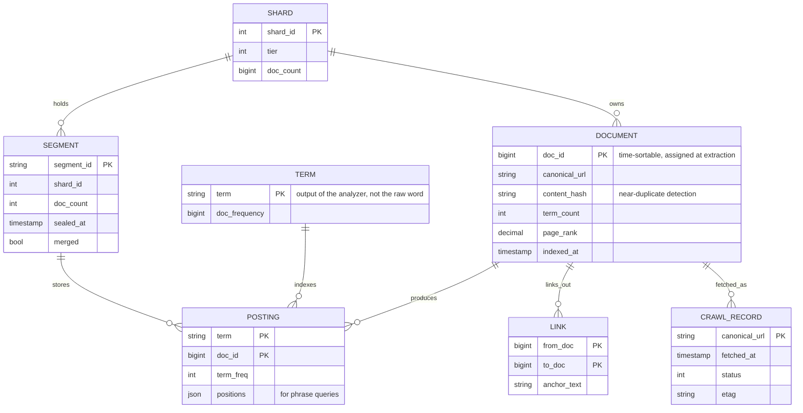
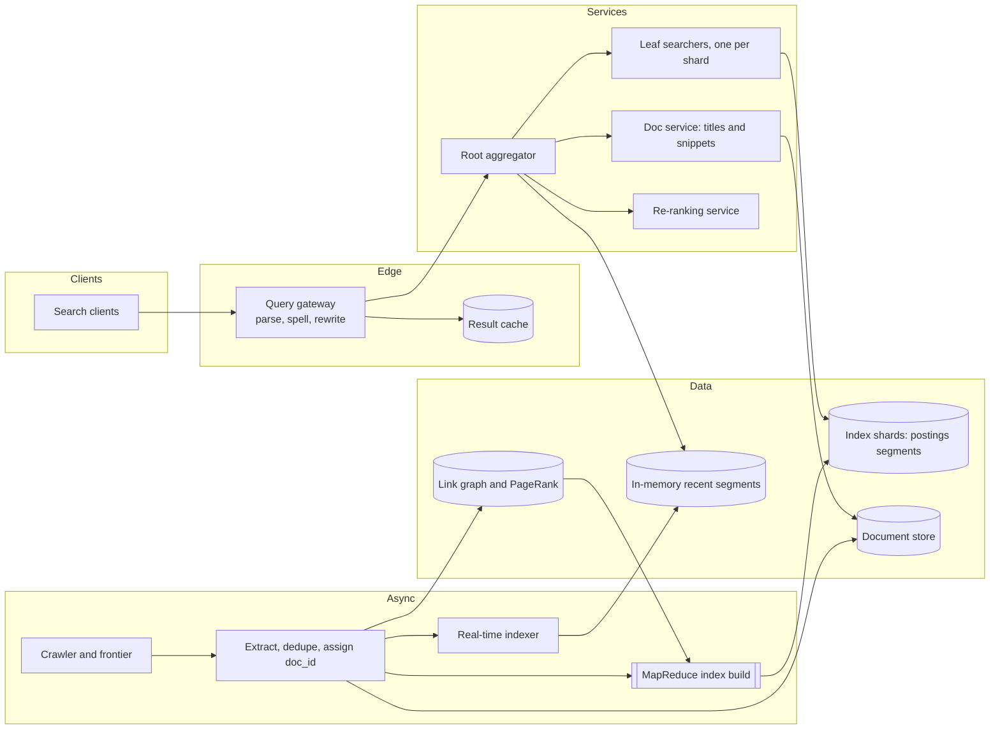
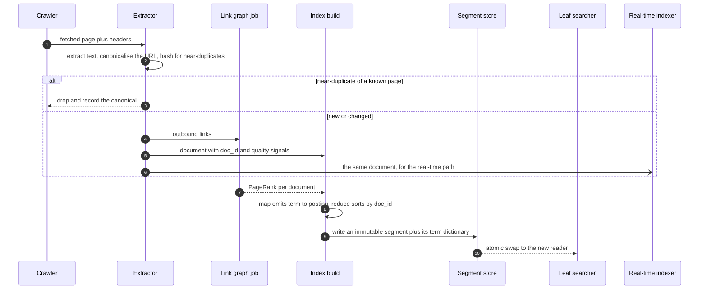
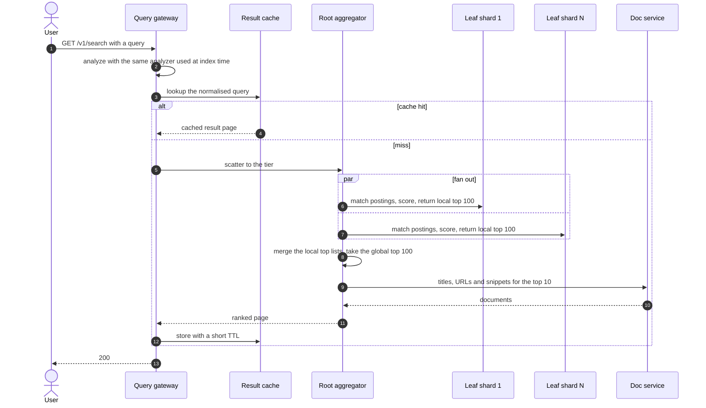
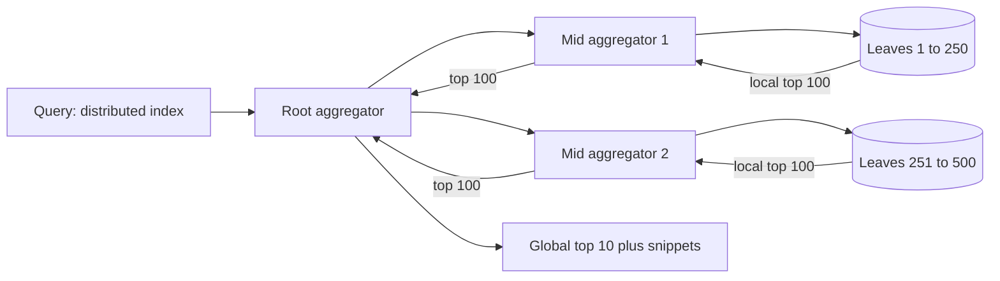
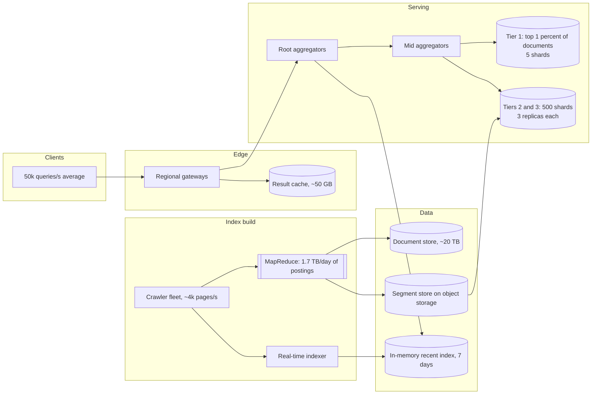

# Design a search engine (with Twitter real-time search)

## TL;DR

- Web search is **two systems joined by an immutable artifact**: an offline pipeline that turns crawled pages into inverted-index segments, and an online tier that scatters a query across those segments and merges the top K.
- The cruxes: (1) the **crawl-to-index pipeline** and why it is a MapReduce, (2) sharding **by document versus by term**, (3) **scatter-gather** serving, the top-K merge and its tail latency, (4) **ranking** — BM25, PageRank, freshness, (5) the **real-time variant**, where nothing is ranked at all.
- Every query touches every shard in a tier, so the design is dominated by fan-out width and by what you can avoid asking.

## Problem statement and clarifying questions

"Design a search engine: crawl the web, index it, and return ten relevant results in under 300 ms." The whole design falls out of two answers — how many documents, and how fresh the index must be — because those decide the shard count and whether an offline pipeline is enough.

| Question | Assumption taken |
|---|---|
| Corpus size? | 10B documents, refreshed on average every 30 days. |
| Query volume? | 5B queries/day: ~50k/s average, ~150k/s peak. |
| Latency target? | p99 under 300 ms end to end, including snippet generation. |
| Result quality bar? | Ten relevant results on page one; recall beyond rank 1,000 does not matter. |
| Query syntax? | Free text with implicit AND, plus phrases and a few operators. No regular expressions. |
| How fresh? | Days for the general web, seconds for news and social — hence a separate real-time path. |
| Is the crawler in scope? | Only its interface. Fetching, politeness and the frontier are a [separate design](web-crawler.md). |
| Personalisation? | Out of scope; ranking is query and document only. |

## Requirements

### Functional

- Ingest extracted documents from the crawl pipeline and build inverted-index segments.
- Serve a ranked page for a free-text query, with title, URL and a query-dependent snippet.
- Support boolean AND, phrase match and bounded pagination.
- Remove a document on request (takedown, `noindex`, a robots change) without rebuilding the index.
- Serve a reverse-chronological result set for recent documents.

### Non-functional

- Scale: 10B documents, ~10^13 postings, 150k queries/s at peak.
- Latency: p99 under 300 ms for the ranked page, under 100 ms for the real-time path.
- Freshness: general web within days; real-time documents searchable within 10 s.
- Availability: 99.9% for serving. Degrade to fewer shards or a stale index rather than fail.
- Durability: the index is derived and rebuildable; the document store is the system of record.
- Cost: serving dominates, so the number of shards a query touches is a first-class variable.

### Out of scope

Crawling politeness and the frontier, spam and adversarial SEO defences, personalisation, typeahead ([separate design](typeahead.md)), and the learned ranking model itself.

## Estimation

From the [latency and estimation tables](../../cheatsheets/latency-and-estimation.md): a day is ~10^5 s, peak is 3x average, a same-datacenter round trip is ~500 us, and an SSD does ~100k random IOPS.

| Quantity | Arithmetic | Result |
|---|---|---|
| Crawl rate | 10B docs / 30-day refresh | ~333M/day = ~4k pages/s, ~12k/s peak |
| Postings | 10B docs x ~1,000 terms | ~10^13 postings |
| Index size | 10^13 x ~5 B compressed (delta-encoded doc id plus term frequency) | ~50 TB |
| Document store | 10B x 2 KB of extracted text, title and metadata | ~20 TB, ~210 TB for both at replication factor 3 |
| New postings/day | 333M docs x 1,000 terms x 5 B | ~1.7 TB/day of segment writes (50 TB spread over the 30-day refresh) |
| Shards | 50 TB / ~100 GB per serving node | ~500 shards, x3 replicas = ~1,500 nodes |
| Query QPS | 5B/day / 10^5 | ~50k/s average, ~150k/s peak |
| Shard requests | 150k/s x 500 shards | **75M/s — the number that forces tiering and caching** |
| Result cache | Head queries are Zipf: ~10M distinct queries x 5 KB result page | ~50 GB, absorbing 30-40% of traffic |
| Egress | 150k/s x 5 KB | ~750 MB/s = 6 Gbps |

The line to say out loud: **75M shard requests per second is not a number you can build, so most of the design is about not asking**. Two levers do the work. A **result cache** removes the head of the Zipf distribution. **Index tiers** put the highest-quality 1% of documents (100M docs, ~500 GB, five shards) in front, so a query that finds ten good results there never touches the other 495 shards, and only queries that come up short fall through to the full corpus.

## API design

| Endpoint | Request | Response | Notes |
|---|---|---|---|
| `GET /v1/search?q=...&start=0&num=10` | Free text plus paging | `200 {results: [{url, title, snippet, score}], total_estimate, next_cursor}` | `start` capped at 1,000. Deep pages are re-sliced from a cached candidate set, never re-scattered. `total_estimate` is explicitly an estimate. |
| `GET /v1/realtime?q=...&since_id=...` | Free text plus a cursor | `200 {results, max_id}` | Reverse-chronological. `since_id` is a time-sortable document id, so polling is cheap. |
| `POST /v1/index/documents` (internal) | Batch of extracted documents | `202 {accepted, rejected}` | Called by the pipeline. Idempotent by `(canonical_url, content_hash)`: a re-crawl with unchanged content is a no-op. |
| `DELETE /v1/index/documents/{doc_id}` (internal) | — | `204` | Tombstone. The document disappears from results immediately and from disk at the next merge. |

## Data model

**Documents and postings are separate stores: one is the source of truth, the other is a derived, rebuildable index.**



- **Postings** live in immutable segment files: a term dictionary (a finite-state transducer or a sorted block index) pointing into delta-encoded postings blocks. Partition key `shard_id`, sort key `(term, doc_id)`.
- **Documents** live in a key-value store keyed by `doc_id`, co-located with the shard that indexes them, so snippet generation is a local read.
- **The link graph** is a separate batch store; PageRank is recomputed periodically and joined into the document record as one number.
- **`content_hash`** is what stops the index filling with the same article on forty domains.

## High-level design

**v1: an offline pipeline produces immutable segments; an online tier scatters queries across them.**



**Write path: crawl, extract, deduplicate, build segments, swap them in atomically.**



**Read path: cache, scatter, merge, hydrate.**



The one rule that ties both paths together: **the analyzer must be identical at index time and query time**. Lowercasing, stop words and stemming are part of the index format, not of the query parser. Change the stemmer and every existing segment is wrong until it is rebuilt.

## Deep dive: the crawl-to-index pipeline

"How do you turn a billion crawled pages into an inverted index?" The answer is the original MapReduce example, and it is worth saying why the shape fits.

**Map** reads a document and emits `(term, posting)` for every term it contains. **Shuffle** groups by term — the expensive step, and the only one that moves data across the network. **Reduce** receives all postings for one term, sorts them by `doc_id`, delta-encodes and writes them into a segment. The output is written once and never modified.

Immutability is the load-bearing property. A segment is built, sealed and swapped in atomically, so readers never take a lock, a rebuild can run beside the live index, and a failed build affects nothing. Deletes are tombstones; edits are a delete plus a new document in a newer segment; both are physically resolved at merge time.

```python title="code/hld/ranked_search.py — immutable segments"
--8<-- "code/hld/ranked_search.py:segment"
```

Three details worth raising unprompted:

- **Document ids are assigned at extraction**, and making them time-sortable buys the real-time path for free: "newest first" is "highest id first", a walk from the end of a postings list rather than a sort.
- **Near-duplicate detection belongs before indexing.** A content hash catches exact copies, SimHash catches boilerplate reprints. Skip it and you pay storage, ranking and serving for the same article forty times.
- **Full rebuild versus incremental.** Incremental segments keep freshness low but multiply segment count; a periodic full rebuild restores a compact layout and is the migration path when the analyzer changes. Run both.

## Deep dive: sharding by document versus by term

This is the question the interviewer is waiting for, and there is a clear answer with a clear reason.

| | Partition by document | Partition by term |
|---|---|---|
| What a shard holds | A slice of the corpus, complete postings for its own documents | All postings for a subset of terms, across the whole corpus |
| Single-term query | Every shard, each returning its local top K | One shard answers completely |
| Two-term AND | Every shard intersects locally | One shard must ship a whole postings list to another to intersect |
| Load balance | Even: documents hash uniformly | Terrible: term frequency is Zipf, so the shard holding "the" is enormous |
| Adding documents | Append to one shard | Touches every shard that holds any of the document's terms |
| Failure of one shard | Slightly worse results | Every query containing those terms is broken |

**Partition by document.** The fatal problem with term partitioning is the intersection: a postings list for a common term is hundreds of megabytes, and a two-term query would move it per request. Document partitioning keeps intersections local and pays a broadcast instead — bounded, parallel, and it degrades gracefully, because losing a shard costs a slice of recall rather than a class of queries.

**How the fan-out is actually organised.**



A root fanning out to 500 leaves directly would spend its time on connection handling and wait for the slowest of 500 responses. A tree keeps each node's fan-out around 20, and every level merges before passing results up, so the payload shrinks as it rises.

## Deep dive: scatter-gather, top-K merge and tail latency

The merge itself is short. Each leaf returns its local top K; the global top K is a subset of their union, because a document in the global top K cannot rank below K inside its own shard. So the root does a k-way merge over N sorted lists and keeps the first K.

```python title="code/hld/ranked_search.py — the scatter-gather merge"
--8<-- "code/hld/ranked_search.py:scatter"
```

Two things make it harder than it looks.

**Scores are not comparable across shards.** BM25's inverse document frequency depends on corpus-wide document frequency, and each shard only knows its own. With millions of documents per shard the estimates converge and the error is invisible; with small or skewed shards it is not. The fixes are a pre-pass that broadcasts global term statistics, or periodically distributing a global dictionary. The module makes the divergence visible:

```text
scatter-gather top 4: [101, 106, 105, 102]   one shard: [101, 105, 102, 106]
the orders differ because each shard scores with its own df and average length
```

**Tail latency dominates.** Waiting for 500 leaves gives a p99 equal to the *maximum* of 500 samples, so a leaf at p99 = 50 ms makes almost every query slow. Three answers: hedge by sending to two replicas and taking the first response; give the root a hard deadline and return a partial result; and bound each leaf's work with early termination — walk postings ordered by a static quality score and stop once the top K cannot change (WAND, block-max).

The last lever is **two-phase retrieval**: cheap scoring over thousands of candidates per shard, then an expensive learned model over the ~100 that survive the merge. Snippets are generated last, for ten documents only.

## Deep dive: ranking with BM25, PageRank and freshness

"Why not just TF-IDF?" Because raw term frequency grows without limit: a page repeating "cheap flights" two hundred times outranks the airline. BM25 fixes both halves — it saturates term frequency towards `k1 + 1`, and it normalises by how much longer the document is than the corpus average, so a long page gets no free credit for containing more words.

```python title="code/hld/ranked_search.py — BM25 and the ranking blend"
--8<-- "code/hld/ranked_search.py:bm25"
```

Text similarity alone is not enough: the query does not tell you which of ten thousand matching pages is trustworthy. That is what a **query-independent** signal is for. PageRank models a random surfer following links, converging to a stationary probability per page in a few dozen iterations over the link graph; it is computed offline, stored as one number, and multiplies the text score so a trusted page lifts on every query it matches. **Freshness** is added rather than multiplied, so recency can surface a page that barely matches when the query is about something that happened an hour ago.

```text
search 'index' (doc 101 uses the term once, doc 105 repeats it six times):
  doc 101  final 1.449  text 0.762  (solo-s1)
  doc 105  final 1.281  text 1.220  (solo-s1)
  doc 102  final 1.109  text 0.693  (solo-s1)
  doc 106  final 0.995  text 0.663  (solo-s1)
saturation caps stuffing at 1.6x, not 6x; PageRank 0.9 vs 0.05 then puts 101 first
```

That is the honest version: BM25 *bounds* what stuffing buys — six repeats are worth 1.6x, not 6x — but the quality signal settles the order. No single signal is a ranking; production systems learn the blend from click data, with anchor text, click-through rate, spam scores and language joining the same feature vector.

## Deep dive: the real-time variant (Earlybird)

"Now index tweets: 150M a day, searchable within ten seconds." Almost nothing above survives.

| | Web search | Real-time search |
|---|---|---|
| Index freshness | Days; segments built offline | Seconds; documents appended in memory |
| Storage | Segments on disk, 50 TB | Recent documents in RAM, older ones dropped |
| Postings order | By document id ascending, for intersection | By document id **descending**, so the newest match is first |
| Ranking | BM25 plus PageRank plus a learned model | Often none: reverse chronological, with a cheap engagement filter |
| Query termination | Score everything that matches, take top K | Walk until you have K, then stop |

The design collapses to: a write-optimised in-memory index over the last few days, postings kept newest-first, and an early exit. Because ids are time-sortable, "newest match" is "first posting", so a query for a rare term costs a handful of list steps and a query for a common term stops after K.

```python title="code/hld/ranked_search.py — refresh, merge and the reverse-chronological path"
--8<-- "code/hld/ranked_search.py:shard"
```

```text
new document visible before refresh: False
visible after refresh: True, segments=2
recent('index') newest first: [999, 106, 105]
tombstoned doc 105 of 9; merge keeps 8 in 1 segment
```

The sizing is friendly: 150M tweets/day at ~20 indexed terms each is ~3B postings/day, ~15 GB/day at the same 5 B per posting, so seven days is ~100 GB and fits in RAM across a handful of machines. The two operational levers are the **refresh interval** — how long a document waits in the buffer before becoming visible, the "near" in near-real-time — and the **merge policy**, since every unmerged segment is another postings list per query.

## Scaling, bottlenecks and failure modes

**v2: tiered serving behind a result cache, a tree of aggregators, and a real-time index beside the batch one.**



- **Fan-out width.** Every query touching 500 shards is the cost driver. Tiering, caching and a deadline on the root are the three levers; adding shards makes latency worse, not better, so shards grow in *size* until a node is full before they grow in *count*.
- **Segment sprawl.** Frequent refreshes multiply segments and query cost grows linearly with them. Run a tiered merge policy and alert on segments per shard.
- **Index build failure.** The pipeline is idempotent and the segments are immutable, so a failed build is re-run; serving continues on the previous segment set. Never swap in a segment set that has not passed a quality gate — a bad index is worse than a stale one.
- **Shard loss.** With three replicas, promote. If a whole shard is unavailable, serve without it and mark results partial: losing 1/500 of the corpus is invisible to almost every query.
- **Deep pagination.** `start=990` cannot mean "re-scatter and skip 990": cap the depth and slice the cached candidate set.

## Trade-offs summary

| Decision | Chosen | Alternatives | Why |
|---|---|---|---|
| Partitioning | By document | By term | Term partitioning ships whole postings lists across the network to intersect |
| Segment lifecycle | Immutable, merged in the background | In-place updates | Lock-free readers, atomic swap, tombstone deletes |
| Fan-out | Tree of aggregators | Flat root to 500 leaves | Bounded fan-out per node and the payload shrinks as it rises |
| Scoring | BM25 plus quality plus freshness | Raw TF-IDF | TF-IDF has unbounded term frequency and no notion of trust |
| Term statistics | Per shard, converged by size | Broadcast global statistics | Cheaper, and the error vanishes with millions of documents per shard |
| Freshness | Batch index plus a separate real-time index | One index for both | Opposite access patterns: intersection versus early-exit recency |
| Deep pages | Capped and served from a cached candidate set | Re-scatter per page | Re-scattering pays the full fan-out for traffic nobody reads |

## Interviewer follow-ups

??? question "How do you support phrase queries?"
    Store term positions in the postings. A phrase match intersects the documents, then checks that the positions of consecutive terms differ by one. Positions roughly double index size, which is why some engines keep a separate positional index consulted only for the small candidate set that survives the first pass.

??? question "How does a document disappear immediately after a takedown?"
    Tombstone it. A deleted-document bitmap per segment is consulted while scoring, so the document vanishes from results at once; the bytes go away at the next merge. The same mechanism handles a page that adds `noindex` or a robots rule that changes.

??? question "Why not use a relational database with a full-text index?"
    For one shard of a moderate corpus, do — the design is identical in miniature. It fails at 10B documents because you need control over segment layout, merge policy, scoring and early termination, and because a query planner will not scatter-gather across 500 shards for you.

??? question "Two shards return the same score. Which document wins?"
    Break the tie on a stable key — document id — at the merge. Without a deterministic tie-break, page one and page two disagree about the boundary document and the user sees a duplicate or a gap.

??? question "How would you change the analyzer without breaking search?"
    You cannot change it in place: existing segments encode the old tokens. Build a parallel index with the new analyzer, serve both behind a flag, compare result quality on a query sample, then cut over and drop the old segments. It is a data migration, not a config change.

??? question "How would you rank when the query has no good text match?"
    Fall through the tiers, relax AND to OR, then rewrite the query — spelling correction, synonyms, dropping the rarest term. Report low confidence rather than returning ten irrelevant pages, and let the real-time path answer if the query looks like news.

!!! tip "Interview tip"
    Draw the boundary between the offline pipeline and the online tier in your first minute, and name the immutable segment as the interface between them. Every later question — freshness, deletes, ranking changes, rebuilds — resolves to "which side of that boundary does this happen on", and you will sound like you have run one of these.

!!! warning "Common mistake"
    Designing the inverted index and stopping. The index is the easy half. The interview lives in the serving tier: which shard scheme, how wide the fan-out, how the top-K merge stays correct when shards score differently, and what you return when one shard is slow. If you have not said "every query touches every shard", you have not reached the hard part.

## 45-minute pacing

| Minutes | What to say and draw |
|---|---|
| 0-5 | Clarify: 10B documents, 50k queries/s, p99 300 ms, days of freshness for the web and seconds for real time, crawler out of scope. |
| 5-10 | Estimation: 10^13 postings, ~50 TB index, ~500 shards, 150k QPS x 500 = 75M shard requests/s. That number frames everything. |
| 10-15 | API and data model: documents versus postings, immutable segments, the analyzer contract. |
| 15-24 | v1 diagram; narrate the build path (map, shuffle, reduce, seal, swap) and the query path (cache, scatter, merge, hydrate). |
| 24-36 | Deep dives: document versus term partitioning with the reason; scatter-gather, top-K merge, tail latency and two-phase retrieval. |
| 36-41 | Ranking: BM25 saturation, PageRank as a query-independent signal, freshness, and where a learned model sits. |
| 41-45 | The real-time variant in two minutes, then bottlenecks and the trade-offs table. |

## Related

- [Design a web crawler](web-crawler.md) — the upstream system that fills this pipeline
- [Object, file, search, time-series and graph storage](../fundamentals/storage-systems-zoo.md) — where a search index sits among the storage families
- [Batch and stream processing](../fundamentals/batch-and-stream-processing.md) — the MapReduce build and the streaming real-time path
- [Design Stack Overflow](../../lld/problems/stack-overflow.md) — the same retrieval ideas at object-design scale
- [Design typeahead autocomplete](typeahead.md) — the prefix problem that sits in front of the query box
- Primary sources: Dean and Ghemawat, "MapReduce" (OSDI 2004); Brin and Page, "The Anatomy of a Large-Scale Hypertextual Web Search Engine" (1998); Busch et al., "Earlybird: Real-Time Search at Twitter" (ICDE 2012)
