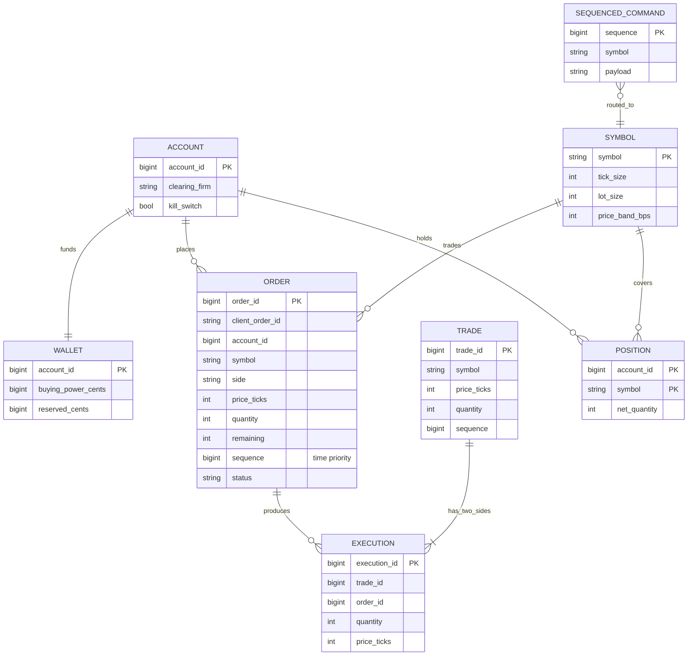
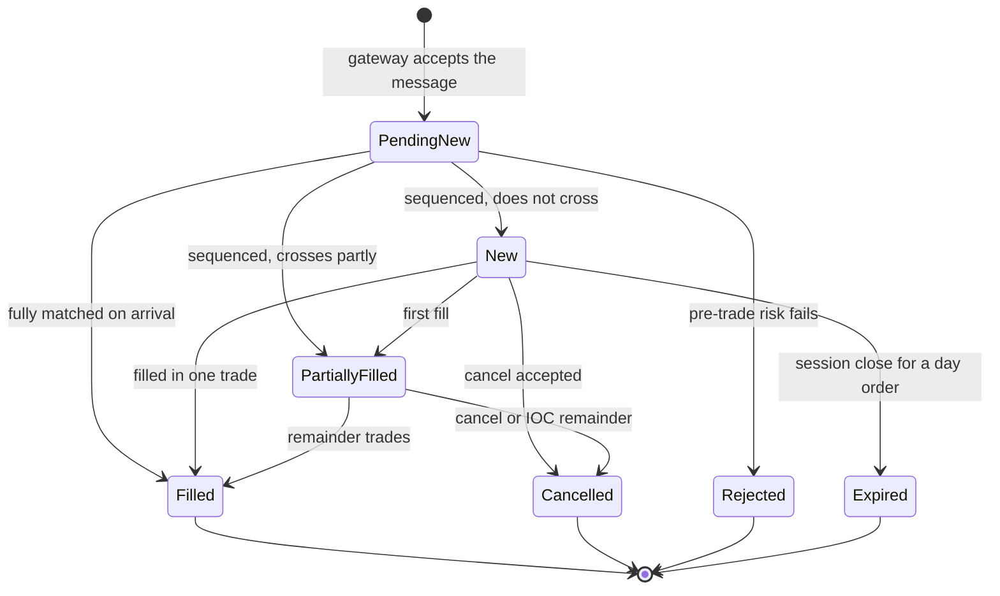
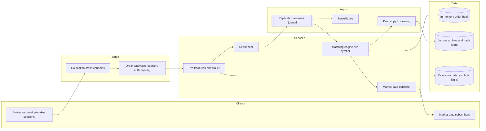
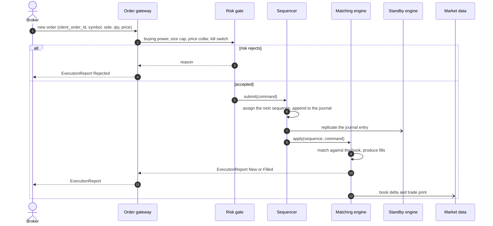
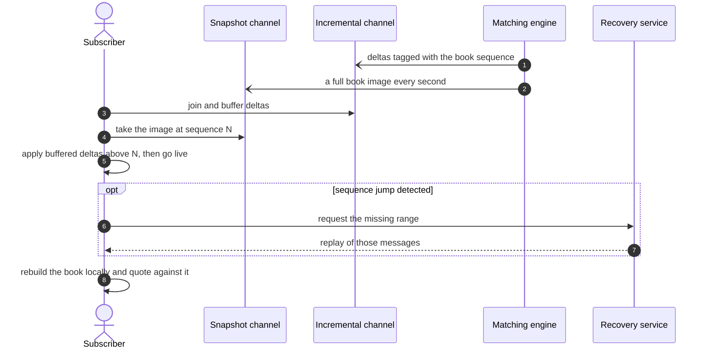
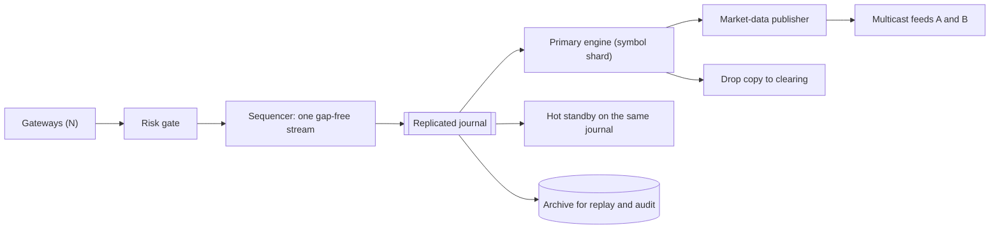
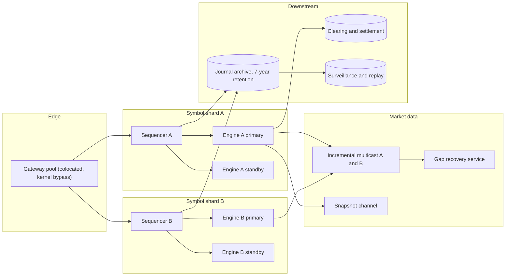

# Design a stock exchange

## TL;DR

- An exchange is a **deterministic state machine per symbol**: a sequencer stamps every command with a gap-free number, one single-threaded matching engine applies them in that order, and a hot standby fed by the same journal can take over without losing a trade.
- The cruxes an interviewer probes: (1) the **limit order book** with price-time priority and partial fills, (2) the **sequencer and deterministic replay**, (3) **market-data fan-out**, (4) **pre-trade risk checks and the wallet**.
- Everything is in memory. Matching a marketable order is ~2 µs of memory work against a 500 µs network round trip, which is why the differentiator is the network path, not the algorithm.

## Problem statement and clarifying questions

"Design the exchange itself: brokers send orders, the exchange matches them fairly and publishes the resulting prices to the world." Fairness here is a *mechanical* property — same price, earlier order wins — and it must survive a machine failure mid-session. That is the whole design: a total order over inputs, a deterministic function over that order, and a replicated log so the function can be re-run.

| Question | Assumption taken |
|---|---|
| Which order types? | Limit and market, with GTC and IOC time-in-force. Stops and icebergs are a later layer. |
| Continuous trading or auctions? | Continuous double auction during the session; opening and closing auctions noted, not designed. |
| Scale? | 8,000 symbols, ~500M order messages per 6.5-hour session, ~50M trades. |
| Latency target? | p99 tick-to-trade under 100 µs inside the exchange, excluding the client's network. |
| Who are the market-data consumers? | ~5,000 colocated subscribers on a multicast feed, plus slower public feeds. |
| Does the exchange hold customer money? | It checks buying power against a clearing wallet; settlement is the clearing house's job. |
| What must never happen? | A trade that violates price-time priority, a lost fill, or two engines matching the same symbol. |
| Regulatory retention? | Every inbound message and every execution kept for 7 years and replayable. |

## Requirements

### Functional

- Accept new, cancel and cancel-replace orders over a session-based protocol (FIX or a binary equivalent).
- Match continuously with **price-time priority**; support partial fills; market and IOC orders never rest.
- Publish an incremental market-data feed plus periodic full snapshots, both sequence-numbered.
- Run pre-trade risk on every order: buying power, maximum size, price collar, per-account kill switch.
- Send execution reports to the submitting broker and a drop copy to clearing.

### Non-functional

- Determinism first: the same journal replayed on any machine produces byte-identical trades.
- Latency: p99 tick-to-trade < 100 µs, and low *jitter* matters more than the mean — a p99.9 of 5 ms is a worse product than a slower but flat engine.
- Throughput: ~22k order messages/s average, ~200k/s in the first seconds of the session.
- Durability: an order acknowledged to a broker is in the replicated journal; nothing is acknowledged before it is.
- Availability: 99.99% during the session; failover to a hot standby in under a second, with no gap in the sequence.

### Out of scope

Clearing and settlement, custody, listings and corporate actions, the auction algorithms, smart order routing across venues, and the broker side (see the [stock brokerage](../../lld/problems/stock-brokerage.md) problem).

## Estimation

Using the [latency and estimation tables](../../cheatsheets/latency-and-estimation.md). A session is 6.5 h x 3,600 = ~2.3 x 10^4 s, and there are ~250 sessions a year. A binary order or market-data message is ~100 B.

| Quantity | Arithmetic | Result |
|---|---|---|
| Order write QPS | 500M messages / 2.3 x 10^4 s | ~22k/s average, ~200k/s at the open (a 10x event peak) |
| Trades | 10% of 500M = 50M/session | ~2.2k/s average, ~20k/s peak |
| Market-data read fan-out | 22k book updates/s x 5,000 subscribers | 110M msg/s unicast, **22k/s on multicast** |
| Market-data bandwidth | 22k/s x 100 B | 2.2 MB/s multicast; unicast would be 11 GB/s = 88 Gbps |
| Journal storage/year | 500M x 100 B = 50 GB/session x 250 | ~13 TB/year, x3 replicas ~38 TB, 7-year retention ~90 TB |
| In-memory book ("cache") | 8,000 symbols x 10k resting orders x 100 B | ~8 GB — the whole market fits in RAM on one server |
| Matching cost | ~20 memory references x 100 ns | ~2 µs, against a 500 µs same-datacenter round trip |

Two numbers decide the architecture. The book is **8 GB**, so there is no database on the hot path — the state of the market is a data structure, and durability is the journal behind it. And matching costs **2 µs against a 500 µs round trip**: the engine is 0.4% of the latency a client sees, so effort goes into colocation, kernel bypass and jitter, not into a cleverer algorithm.

## API design

| Endpoint | Request | Response | Notes |
|---|---|---|---|
| `POST /v1/orders` | `{client_order_id, symbol, side, quantity, price, tif}` | `202 {order_id, sequence}` | `client_order_id` is the idempotency key, unique per account per session; a resend returns the original acknowledgement. |
| `DELETE /v1/orders/{client_order_id}` | — | `202 {sequence}` | Cancel is a sequenced command like any other; "too late to cancel" is a normal outcome, not an error. |
| `POST /v1/orders/{client_order_id}/replace` | `{quantity, price}` | `202 {new_order_id, sequence}` | A price change or size increase **loses time priority**; only a size decrease keeps the queue position. |
| `GET /v1/book/{symbol}?depth=10` | — | `200 {bids, asks, sequence}` | A snapshot tagged with the sequence it reflects, so a client can splice incrementals onto it. |
| `GET /v1/recovery?from=<seq>&to=<seq>` | — | `200 {messages}` | Bounded gap fill for a subscriber that dropped multicast packets. |

Two protocol notes worth saying. Market data is a **sequence-numbered stream, not a paginated resource**: you take a snapshot at sequence N, buffer the incrementals, and replay everything above N. And every response the exchange sends is an execution report carrying the same sequence, so a broker can reconcile its own view against the exchange's ordering without asking for state.

## Data model

**The order book is memory; the durable objects are the journal, the executions and the positions.**



**An order's lifecycle, and every state an execution report can carry.**



Store choices: `SEQUENCED_COMMAND` is an append-only replicated log (the source of truth, partitioned by symbol shard); `TRADE` and `EXECUTION` go to a relational store for clearing and to an object-storage archive for the 7-year retention; `WALLET` and `POSITION` live in memory next to the risk gate and are checkpointed, because a risk check that needs a database round trip has already blown the latency budget.

## High-level design

**v1: gateways, one risk gate, one sequencer per symbol shard, one engine, one publisher.**



**Write path: risk, then sequence, then match — and nothing is acknowledged before it is replicated.**



**Read path: market data is a snapshot plus a numbered stream, and gaps are recovered, not tolerated.**



Walk-through: risk runs *before* sequencing so a rejected order never consumes a sequence number and never reaches the engine. The sequencer's append is the durability point — the broker's acknowledgement follows replication, not matching. The engine is a pure function of the journal, so market data, drop copies and surveillance are all derived views that can be rebuilt.

## Deep dive: the matching engine and the limit order book

The probing question is "what data structure is the book, and what happens when a 120-share buy meets a 50-share and a 100-share offer?" The answer must cover both priority rules and partial fills.

| Book structure | Best price | Insert | Cancel | Notes |
|---|---|---|---|---|
| Sorted list of orders | O(1) | O(n) | O(n) | Fine for a toy, hopeless at 200k msg/s |
| Balanced tree keyed by price | O(log n) | O(log n) | O(log n) | Good for sparse, wide books |
| Heap of price levels + FIFO per level | O(1) peek | O(log L) new level, O(1) same level | O(1) lazy | Chosen: L (levels) is far smaller than n (orders) |
| Array indexed by tick | O(1) | O(1) | O(1) | Fastest, but needs a bounded, dense price range |

Take the heap of price levels with a FIFO queue inside each level: price priority is the heap, time priority is the queue, and both are exactly the guarantee the market rules demand. Cancels are **lazy** — flag the order and let the matching loop walk past it — which makes cancel O(1), and cancels outnumber fills roughly ten to one.

```python title="code/hld/matching_engine.py — the book and the matching loop"
--8<-- "code/hld/matching_engine.py:book"
```

Three semantics to state explicitly. A trade prints at the **resting** order's price, so price improvement goes to the aggressor: a buy limit at 10.10 hitting an offer at 10.05 trades at 10.05. A partial fill decrements `remaining` on both sides — the maker stays at the front of its queue with its original time priority, and the taker keeps sweeping. And a market or IOC order that cannot be fully filled has its remainder **cancelled, never rested**.

### Why one thread is the fast choice

The engine is single-threaded per symbol and holds no lock. Locking a book across threads costs a mutex (17 ns) plus cache-line ping-pong on every level, and it destroys determinism, which is the property the whole fault-tolerance story depends on. One thread on one core with the book in L3 does ~20 memory references per order — about 2 µs — while the network round trip to the client is 500 µs. Scaling is horizontal by **symbol**, not by thread: symbols are independent state machines, so 8,000 of them spread over a handful of engine processes.

## Deep dive: the sequencer and deterministic replay

The probing question is "your matching engine's machine dies mid-session. What did you lose?" The answer has to be "nothing", and the mechanism is the same one that makes the exchange auditable.

**Every input passes through one sequencer; everything downstream is a replay of its journal.**



The sequencer is the only place in the system where concurrency exists: many gateway threads call it, it takes one lock, assigns the next integer and appends. Everything after it is single-threaded by construction. Two rules make replay exact:

- **No wall clocks in the engine.** Time priority is *sequence* priority. A clock read is non-deterministic and clocks are not monotonic across machines — see [time, clocks and ordering](../fundamentals/time-and-ordering.md). Timestamps are stamped by the sequencer and travel *inside* the command.
- **No non-deterministic ids.** A trade id is derived from the sequence number and the fill index, so a replayed engine produces identical trade ids, not merely equivalent trades.

```python title="code/hld/matching_engine.py — sequencer, risk gate and replay"
--8<-- "code/hld/matching_engine.py:engine"
```

The demo sweeps two price levels and then replays the journal into a standby:

```text
book: bids=[('10.00', 40)]
      asks=[('10.05', 50), ('10.10', 100)]
aggressive buy 120 @ 10.10 sweeps two price levels:
  ACME-4-1  50 @ 10.05
  ACME-4-2  70 @ 10.10
  s2 is partially_filled with 30 left of 100
market sell 60 walks down the bids and cancels what it cannot fill:
  ACME-5-1  40 @ 10.00
  s3 is cancelled after filling 40 of 60
replayed 5 commands into a standby engine
  trades identical: True
  book identical:   True
```

Failover works because the standby consumes the same journal and is therefore in the same state. A leader election over the journal (Raft-style, see [consensus and coordination](../fundamentals/consensus-and-coordination.md)) promotes it at the last replicated sequence; gateways resend anything unacknowledged, deduplicated by `client_order_id`. The same journal replayed offline is what surveillance and the regulator use to reconstruct any millisecond of the session.

## Deep dive: market-data fan-out

The probing question is "5,000 subscribers all want every book update — how?" The estimation table already answered it: unicast is 5,000 x 22k = 110M messages/s and ~88 Gbps; multicast is 22k messages/s on one wire, and the network does the copying.

| Approach | Cost at 5,000 subscribers | Fairness | Recovery |
|---|---|---|---|
| Per-subscriber TCP | 110M msg/s, ~88 Gbps, and the last subscriber served is later than the first | Poor: serialization order is an advantage | Built into TCP |
| UDP multicast, A and B feeds | 22k msg/s on the wire | Every listener receives the same packet at the same time | Application-level: sequence numbers plus a recovery channel |
| Conflated feed (top of book, snapshots) | Tiny | Good enough for retail | Not needed |

Colocated professionals get **UDP multicast** on two independent feeds (A and B) carrying identical messages down different network paths; a subscriber arbitrates between them and only asks the recovery service for a range it lost on both. Fairness is not a nicety here — if you unicast, the subscriber your publisher writes to first has a real, measurable edge, and that is a regulatory problem.

Everyone else gets a conflated feed: top of book plus periodic snapshots, published from the same deltas but throttled. The public website, brokers' apps and retail feeds all read the conflated stream, so the expensive path stays small. Sequence numbers are per symbol shard, and the snapshot channel carries the sequence its image reflects — that pairing is what lets a subscriber join mid-session, as the read-path diagram shows.

## Deep dive: pre-trade risk and the wallet

The probing question is "where do you check that the account can afford the order, and what does that cost you?" The answer defines the exchange's obligations: an exchange that matches an order it should have rejected has created a trade someone must still settle.

Risk runs in the gateway path, **before** the sequencer, on in-memory state:

- **Buying power**: the wallet holds `buying_power` and `reserved`; a buy reserves `price x quantity` and releases the remainder when the order is filled or cancelled. Reservations are per account, so the check is a single in-memory read-modify-write, not a database transaction.
- **Fat-finger caps**: maximum order quantity and maximum notional per order. This is the check that stops the famous "sold 610,000 shares at 1 yen" class of accident.
- **Price collars**: reject a limit price outside a band around the last trade (say ±10%). It protects the account and it protects the book from a single order sweeping thirty price levels.
- **Kill switch**: a per-account flag that rejects everything. Every clearing firm demands one, and it must work in one sequenced command, not a config deploy.

```python title="code/hld/matching_engine.py — the order, status and trade objects the gate validates"
--8<-- "code/hld/matching_engine.py:models"
```

Two design points an interviewer looks for. First, a rejection must be **deterministic**: the engine records the order as `Rejected` with a reason rather than raising, so replay produces the same rejection — a risk check that behaves differently on the standby breaks replay. Second, structural validation (quantity > 0, a known symbol, a tick-aligned price) belongs in the gateway *before* sequencing, so garbage never consumes a sequence number; state-dependent checks belong where the state lives.

## Scaling, bottlenecks and failure modes

**v2: symbol shards, each with its own sequencer, primary and hot standby, feeding shared multicast.**



What breaks first, and what you do about it:

- **The open**: 200k messages/s in the first seconds, ten times the average. The gateways shed load per session with a rate limit and a queue depth cap, because the one thing you cannot do is let a queue grow until latency becomes unbounded — brokers would rather be rejected than filled ten seconds late.
- **A hot symbol**: one symbol can be 5% of the day's messages. Symbol shards must be rebalanceable *between* sessions (a symbol's state machine cannot move mid-session without a stop-the-world hand-off), so sharding is by symbol, never by hash of order id.
- **Sequencer failure**: the sequencer is a single point of ordering by design. It is also replicated; failover promotes a standby at the last replicated sequence, and gateways resend unacknowledged commands, deduplicated by `client_order_id`.
- **Garbage collection and jitter**: a 5 ms pause in the engine is worse than a 50 µs slowdown everywhere. Pre-allocate, avoid per-order allocation on the hot path, pin threads to cores, and measure p99.9 rather than the mean.
- **Multicast loss**: subscribers detect a sequence jump and request a bounded range. The recovery service is deliberately rate-limited so a storm of recovery requests after a network blip cannot become the outage.

## Trade-offs summary

| Decision | Chosen | Alternatives | Why |
|---|---|---|---|
| Concurrency | Single thread per symbol, no locks | Lock-per-price-level, parallel matching | Determinism plus cache locality; the network dominates anyway |
| Book structure | Heap of price levels + FIFO queues | Sorted list; tree; dense array | O(1) best price, O(1) same-level insert, O(1) lazy cancel |
| Fault tolerance | Sequenced journal + hot standby replay | Database transactions per order | Microsecond budget; a replay is also the audit trail |
| Ordering source | Sequence numbers | Wall-clock timestamps | Clocks are not monotonic across machines and break replay |
| Market data | UDP multicast A/B + recovery channel | Per-subscriber TCP | 5,000x less traffic and equal delivery to every listener |
| Risk placement | In-memory, before the sequencer | In the broker; after matching | A matched order is an obligation; you cannot un-trade it |
| Sharding key | Symbol | Order id hash; account | A symbol is one state machine; splitting it splits the book |

## Interviewer follow-ups

??? question "Why is a single-threaded engine not a bottleneck?"
    Because 200k messages/s at ~2 µs each is 40% of one core, and the state fits in cache. Parallelism buys nothing when the work is a handful of memory references, and it costs determinism. Capacity comes from running many symbol shards, each its own single-threaded engine.

??? question "What exactly is replicated before you acknowledge an order?"
    The sequenced command, to a quorum of journal replicas. Not the fill — the fill is a deterministic consequence. That distinction is what keeps the acknowledgement path short: one append, not a transaction over the book.

??? question "Two orders arrive at the same nanosecond on two gateways. Who wins?"
    Whoever the sequencer stamps first. There is no tie: a total order exists precisely because one component assigns it. Fairness then becomes a *network* problem, which is why colocation offers equal-length cables to every rack.

??? question "How does a cancel-replace interact with time priority?"
    Increasing size or changing price loses the queue position — the order is cancelled and a new one is sequenced. Reducing size keeps it. Say this out loud: it is the rule brokers care most about and it falls straight out of the FIFO-per-price-level structure.

??? question "How do you test that the engine is deterministic?"
    Record a session's journal, replay it on a clean engine and diff the trade stream byte for byte — the property test in `test_matching_engine.py` does exactly that over 300 seeded random commands. In production the standby is a continuous version of the same test.

??? question "Where would you use consensus, and where would you not?"
    For journal replication and for electing the engine primary — a split brain matching the same symbol twice is the worst failure in this system. Not on the order path itself: a consensus round trip is tens of microseconds you cannot spend per order, so you batch it into the journal append instead.

!!! tip "Interview tip"
    Say "the exchange is a deterministic state machine and the sequencer is the only source of order" in the first two minutes. Every later answer — failover, audit, market data, fairness — becomes a corollary of that one sentence, and you will sound like you have run one rather than read about one.

!!! warning "Common mistake"
    Reaching for a database or a distributed lock to hold the order book. Both blow the latency budget by three orders of magnitude and neither buys durability that the journal does not already give you. The book is memory; the log is the truth.

## 45-minute pacing

| Minutes | What to say and draw |
|---|---|
| 0–5 | Clarify: limit and market orders, continuous trading, 8,000 symbols, 500M messages a session, determinism as the hard requirement. |
| 5–9 | Estimation: 22k msg/s, 200k at the open, 8 GB book in RAM, 2 µs matching against a 500 µs round trip. |
| 9–14 | API and the order state machine; call out cancel-replace and time priority. |
| 14–22 | v1 diagram; narrate risk, then sequencer, then engine, then market data. Stress that risk runs before sequencing. |
| 22–38 | Deep dives: the book structure and partial fills, the sequencer and replay, multicast market data. |
| 38–45 | Failure modes (the open, hot symbols, sequencer failover, jitter) and the trade-offs table. |

## Related

- [Design a stock brokerage system](../../lld/problems/stock-brokerage.md) — the other side of the wire: portfolios, orders and the broker's own state machine
- [Consensus and coordination](../fundamentals/consensus-and-coordination.md) — journal replication and electing an engine primary without split brain
- [Messaging, queues and Kafka internals](../fundamentals/messaging-and-event-streaming.md) — the replicated log the sequencer writes to, and why partitions map to symbol shards
- [Time, clocks and ordering](../fundamentals/time-and-ordering.md) — why time priority is sequence priority and clocks stay out of the engine
- Primary sources: the LMAX Disruptor technical paper (2011), Nasdaq ITCH and OUCH protocol specifications, the FIX protocol specification
