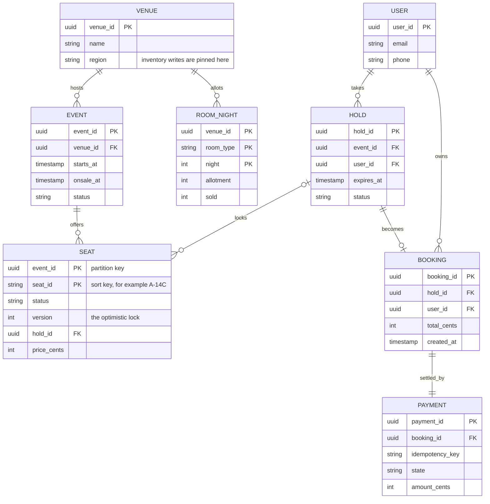
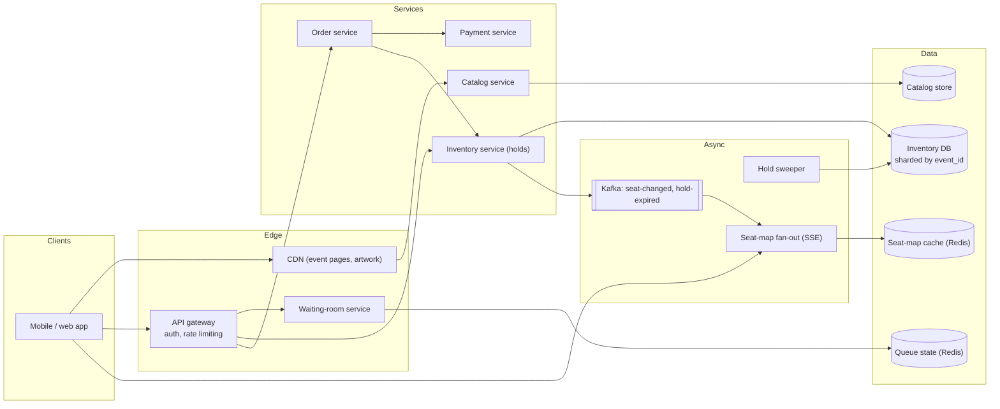
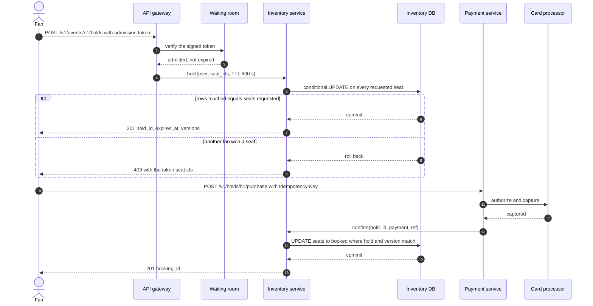
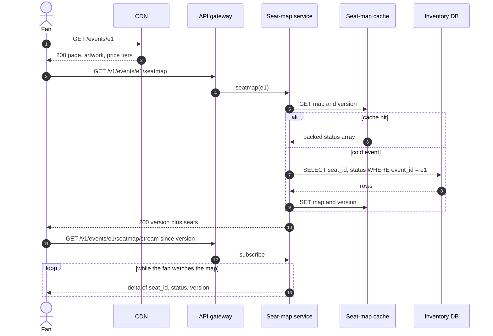
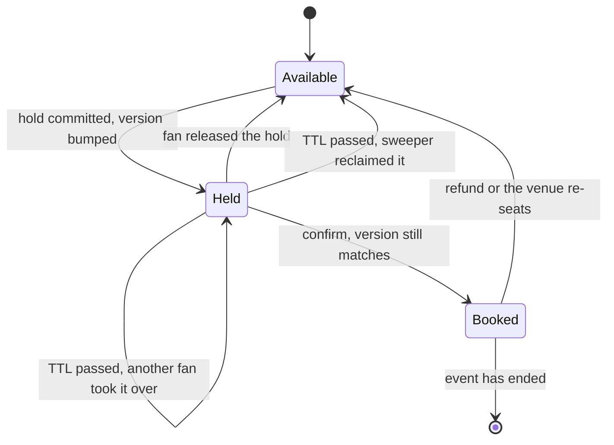
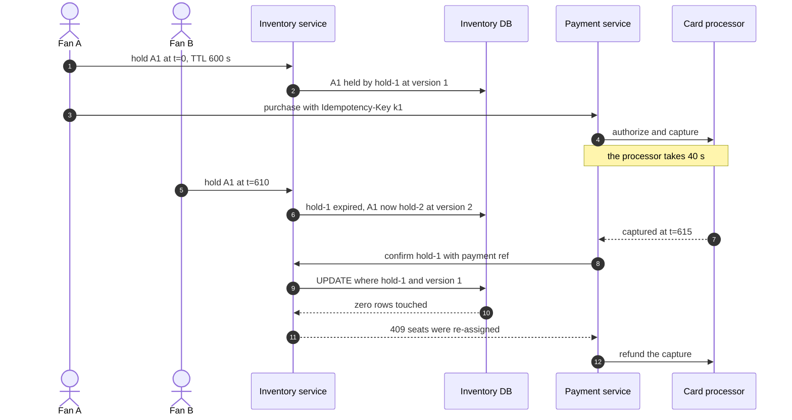
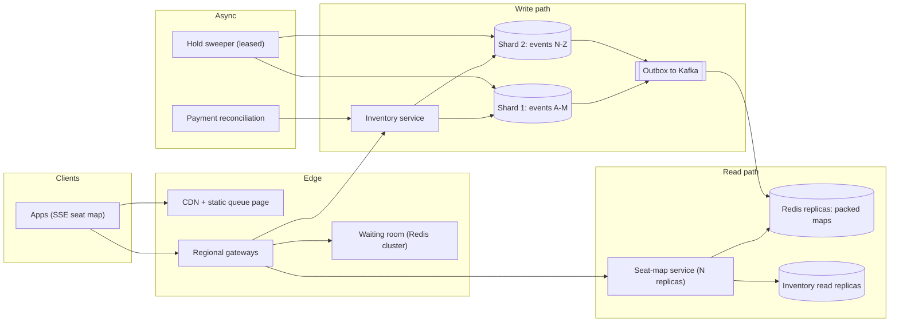

# Design Ticketmaster (with a hotel-booking variant)

## TL;DR

- Ticketing is a **contended-inventory** problem, not a throughput problem: 2M tickets a day is ~20 writes/s, but two minutes of a stadium on-sale bring 2M fans fighting over 60k rows.
- The cruxes an interviewer probes: (1) **holding a seat** with a TTL and an optimistic lock rather than a lock held across a payment, (2) a **virtual waiting room** that turns a spike into a rate you chose, (3) the **live seat map** as a cached projection, (4) the **payment/hold-expiry race**, (5) the **hotel variant**.
- Inventory shards by `event_id`, fans are admitted at ~2k/s, and think-time holds no lock.

## Problem statement and clarifying questions

"Fans browse events, pick seats on a map, hold them while they pay, and end up with a ticket — and a hot on-sale brings millions of people in the same minute." The system is small in bytes and vicious in contention, so clarify the *shape* of the contention rather than scale.

| Question | Assumption taken |
|---|---|
| Named seats (14C) or general admission? | Named seats; the pool is the hotel variant. |
| Can we ever oversell? | Never for concerts; hotels deliberately sell over capacity. |
| How long does a fan get to pay? | A 10-minute hold, extended only by explicit user action. |
| May the seat map be stale? | Yes, by a second or two. The hold call is the only truth. |
| Is fairness required at an on-sale? | Yes: first-come-first-served by arrival, with bot filtering. |
| Scale? | 50M monthly users, 500k events/year, 2M tickets/day, 2M concurrent fans at peak. |
| Do we process cards ourselves? | No — a third party captures; we take webhooks. |

## Requirements

### Functional

- Browse events and view a seat map with per-seat status and price.
- Hold seats atomically for a bounded time; release them explicitly.
- Pay for a hold, receive a booking, retry the payment safely.
- Watch the map change as other fans take and release seats.
- Queue for an on-sale, be admitted in order, and cancel a booking.

### Non-functional

- **No overselling, ever**: one seat, at most one booking, so seat state is strongly consistent within a shard.
- **Scale**: 2M tickets/day (~20 writes/s average, ~60/s peak), 2M concurrent fans, ~200k map reads/s.
- **Latency**: map p99 < 300 ms, hold p99 < 500 ms. A same-datacenter round trip is ~500 µs, so the budget is queueing, not the write.
- **Availability**: 99.99% browsing (52.6 minutes/year), 99.95% booking (4.38 hours/year) — failing closed beats double-selling.
- **Durability**: a booking and its payment are replicated three ways before the 201.
- **Fairness**: queue position is fixed on arrival; refreshing cannot improve it.

### Out of scope

Resale, dynamic pricing, fraud scoring beyond bot filtering, ticket delivery, seating-chart authoring, recommendations.

## Estimation

Using the [latency and estimation tables](../../cheatsheets/latency-and-estimation.md) (a day is ~10^5 s, peak is 3x average):

| Quantity | Arithmetic | Result |
|---|---|---|
| Ticket writes | 2M tickets/day / 10^5 | ~20/s average, ~60/s peak |
| On-sale arrivals | 2M fans in 2 minutes = 2M / 120 | ~17k joins/s at the queue |
| Admission rate | holds stay under one primary's 5k–20k writes/s, so admit ~2k/s | queue drains in ~17 minutes |
| Map reads (steady) | 20M event views/day / 10^5 | ~200/s average, ~600/s peak |
| Map reads (on-sale) | 1M waiting clients x 1 refresh / 5 s | ~200k/s, above one Redis node's ~100k ops/s |
| Full-map bandwidth | 200k/s x 20 KB (20k seats x 1 B status) | 4 GB/s = 32 Gbps — untenable |
| Delta bandwidth | 200k/s x 200 B per change | 40 MB/s, easy on a 10 Gbps NIC |
| Order storage | 2M/day x 1 KB x 365 | 730 GB/year, ~2.2 TB at 3x replication |
| Hot map cache | 10k live on-sales x 20 KB packed map | ~200 MB, the hot set fits in memory |

Say two things out loud. **The write volume is trivial and the contention is not**: 60 writes/s fits on a laptop, 2M fans aiming at 60k rows does not. And **the read fan-out costs the money**: 32 Gbps versus 40 MB/s is a 100x difference decided by one choice.

## API design

| Endpoint | Request | Response | Notes |
|---|---|---|---|
| `POST /v1/events/{id}/queue` | — | `200 {position, ahead_of_you, poll_after_ms}` | Idempotent: rejoining returns the same position. |
| `GET /v1/events/{id}/seatmap?since={version}` | — | `200 {version, seats: [{seat_id, status, price_cents}]}` | `since` returns only changes; cached, may be a second stale. |
| `GET /v1/events/{id}/seatmap/stream?since={version}` | — | `text/event-stream` of deltas | The client reconnects with the last version it saw. |
| `POST /v1/events/{id}/holds` | `{seat_ids: []}` + `Idempotency-Key` + `X-Admission-Token` | `201 {hold_id, seat_ids, expires_at, versions}` or `409 {taken: []}` | All-or-nothing; a retry with the same key returns the same hold. |
| `DELETE /v1/holds/{hold_id}` | — | `204` | Idempotent; releasing an expired hold is a no-op. |
| `POST /v1/holds/{hold_id}/purchase` | `{payment_method_token}` + `Idempotency-Key` | `201 {booking_id, payment_ref}` or `409 {reason: hold_expired}` | The only endpoint that moves money; retries replay the booking. |
| `GET /v1/users/me/bookings?limit=20&cursor=...` | — | `200 {bookings: [], next_cursor}` | Opaque cursor over `(created_at, booking_id)`, never an offset. |

`user_id` comes from the token, never the body, and every 4xx names the failed seat ids so the client greys them out.

## Data model

**One table holds the truth about seats; the hotel variant swaps `SEAT` for `ROOM_NIGHT`.**



Store choices:

- **Inventory** (`SEAT`, `HOLD`, `BOOKING`): relational, partition key `event_id`, sort key `seat_id`, so every hold and confirm is a **single-partition transaction** — the most important schema decision here.
- **Indexes**: `(event_id, status)` for map rebuilds, `(expires_at)` for the sweeper, `(user_id, created_at desc)` for the bookings cursor, unique on `PAYMENT.idempotency_key`.
- **Catalog** (`EVENT`, `VENUE`, prices): read-mostly, replicated everywhere, CDN-fronted.
- **Seat-map cache**: Redis, one packed byte array per event plus a monotonic `version`.
- **Queue state**: a Redis sorted set per on-sale, scored by arrival ticket.

## High-level design

**v1: a queue in front of the booking tier, one inventory shard per event, and a cached seat map fed by change events.**



**Write path: verify admission, take the seats in one conditional update, then pay and confirm against the captured version.**



**Read path: a static page from the CDN, a packed seat map from cache, then a stream of deltas.**



Once an event is warm the read path never touches the inventory primary and the write path never holds a lock while a human types. The two meet only at the change events the inventory service emits.

## Deep dive: holding a seat without overselling

The probing question is a version of "two fans click 14C in the same millisecond — who gets it, and how do you *know*?"

| Mechanism | How it works | Breaks when |
|---|---|---|
| Optimistic lock (version column) | `UPDATE seat SET status='held', hold_id=?, version=version+1 WHERE seat_id=? AND version=?`, committed only if the row count matches | Contention is extreme: losers retry and one hot seat starves a fan |
| Pessimistic lock (`SELECT ... FOR UPDATE`) | Lock the rows for the transaction's length | The transaction spans a payment: pool exhaustion, lock waits, deadlocks |
| Distributed lock in Redis | `SET seat:x NX PX 600000` per seat | Truth and lock live apart, so a failover hands out a seat twice without fencing tokens |
| Counter decrement | One `remaining` counter per price tier | There is no seat 14C, so it cannot express named seats |

Choose the **optimistic lock plus a TTL, in the database of record**. A hold is *data*, not a lock: the row records who holds the seat and until when, the transaction commits immediately, and ten minutes of think-time consume no database resources. Redis stays a cache and a queue, never the arbiter.

Three details separate a good answer from a great one. **Multi-seat holds are all-or-nothing**: one statement over N rows, committed only if it touched exactly N, seat ids ordered so overlapping orders cannot deadlock. **Expiry is lazy first, swept second**: a seat past its TTL is takeable on the next read, so a stalled sweeper never freezes inventory. **The version is the receipt** that makes the payment race decidable.

**A seat's lifecycle — note that expiry has two paths into `Available`, one lazy and one swept.**



`hold()` is the multi-row conditional update, `confirm()` the version-checked one, and `seat_map()` shows an expired hold as free with no sweeper run:

```python title="code/hld/seat_hold.py — inventory"
--8<-- "code/hld/seat_hold.py:inventory"
```

## Deep dive: the virtual waiting room

The probing question is "the on-sale opens and 2M people press buy — what stops the database falling over?" Rate limiting alone is wrong: a 429 to 1.99M fans is a fairness disaster and they all retry a second later, so the load never drops.

A waiting room turns a spike into a **rate you chose**. Fans land on a static, CDN-served queue page; a lightweight service assigns each a monotonically increasing ticket in a Redis sorted set and returns their position; a token issuer admits the head of the queue at whatever rate the booking tier absorbs, handing out short-lived **signed admission tokens**. The booking tier verifies signature, expiry and the bound `user_id` and `event_id` locally — no lookup, no shared state on the hot path. Arrive without a live token and you get a 403.

The admission rate is an estimation question, and answering it with arithmetic is the point: one primary sustains 5k–20k writes/s and a hold is a handful of row updates, so admitting ~2k fans/s keeps the write path near a tenth of capacity even when every fan takes four seats. A 2M-deep queue drains in ~17 minutes. Publish the position and an estimated wait so clients back off instead of polling.

The queue also buys **bot mitigation**, **fair ordering** and a **kill switch**: set admission to zero and the site degrades to read-only browsing rather than errors. Keep the token TTL longer than a hold plus a payment.

```python title="code/hld/seat_hold.py — waiting room"
--8<-- "code/hld/seat_hold.py:waiting_room"
```

!!! tip "Interview tip"
    Open with the ratio: "steady state is 20 writes a second and an on-sale is 2M people in two minutes, so the design is about turning a spike into a chosen rate and never holding a lock across a human." That sentence says you already know which problem is real.

## Deep dive: payment, idempotency and the hold-expiry race

The probing question is precise: "the hold expires at t=600 and the capture webhook lands at t=615 — what does the fan own?" There are three answers and you must name all three.

1. **Nobody took the seats.** The rows still carry `hold_id` and the captured version, so confirm inside a short grace window (30 seconds) and the fan gets their tickets. Refunding here is a self-inflicted support ticket.
2. **Somebody took the seats.** The conditional update touches zero rows because `hold_id` or `version` moved. Fail the confirm, void or refund the capture, and tell the fan. Without the version check you would silently overwrite the new holder.
3. **The confirm is retried.** Providers retry webhooks, so `confirm` is idempotent: a second call for an already-confirmed hold returns the same booking.

**The race, drawn end to end.**



Two rules keep this sane. **Authorize first, capture on confirm**: an authorization is cheap to void and a capture expensive to refund, so moving the irreversible step *after* the version check removes most of case 2. And **one idempotency key per intent**, stored under a unique constraint next to the payment, so a retried purchase returns the original booking instead of a second charge. Webhook ordering is not guaranteed — `payment_failed` can arrive after `payment_succeeded` — so record the provider's event id and the transition it implies rather than applying the last message you saw. Keys, sagas and compensations get the full treatment in [Transactions, 2PC, sagas and idempotency](../fundamentals/transactions-and-distributed-transactions.md).

## Deep dive: the live seat map and the read path

The probing question is "200k people stare at the same seat map — how is it live without melting the primary?" The answer: the map is a **derived projection**, never consulted to make a decision.

Every committed hold, release and confirm emits a `seat-changed` event carrying `(event_id, seat_id, status, version)`. A fan-out service applies these to a packed per-event array in Redis — one status byte per seat, so a 20k-seat arena is 20 KB and 10k on-sales fit in ~200 MB. Clients fetch the map once, subscribe over server-sent events with the last version they saw, and replay from it on reconnect. The estimation table justifies it: 200k readers pulling 20 KB maps is 4 GB/s, the same readers taking 200-byte deltas is 40 MB/s.

SSE beats WebSockets here: the traffic is one-directional and rides ordinary HTTP, so proxies, CDNs and reconnect-with-`Last-Event-ID` work for free. One Redis node does ~100k ops/s, so 200k reads/s means replicas plus an in-process cache per seat-map server, refreshed from the event stream rather than by re-reading Redis.

State the consistency contract explicitly: the map is **at most a couple of seconds stale**, the hold endpoint is **authoritative**, and the UI treats a 409 as normal. Making the map strongly consistent serialises 200k readers behind the write path and buys nothing — even a perfect map is stale by the time it reaches a phone.

!!! warning "Common mistake"
    Holding a transaction — or worse, a `SELECT ... FOR UPDATE` — open for the ten minutes a fan spends entering card details. It works for two users in a demo and destroys the connection pool the moment a real on-sale starts. A hold is a row with an expiry, not a lock.

## Deep dive: the hotel variant (date-range inventory)

The probing question is "now design Airbnb or Marriott instead." Queues, idempotency and the payment race are unchanged; the **inventory shape** is not. There is no seat 14C — a guest wants *any* deluxe room for three nights — so inventory becomes a counter per `(room_type, night)` and a stay is a **range** that must succeed on every night or none.

| Inventory shape | Reservation | Suits |
|---|---|---|
| Named seat, status + version | Conditional update on N seat rows | Concerts, cinemas, seat-selection flights |
| Fungible pool: one row per `(room_type, night)` with `sold` and `allotment` | `UPDATE ... SET sold = sold + 1 WHERE night BETWEEN ? AND ? AND sold < allotment`, committed only if it touched exactly `nights` rows | Hotel chains, car rental, meeting rooms |
| Named unit over a range | Exclusion constraint on `(unit_id, tsrange)`: the database refuses overlaps | Airbnb listings, a specific villa |

The middle row is the one the snippet implements. Overlapping ranges are the concurrency trap: stays over nights 11–13 and 12–14 collide on night 12 only, so the check is per-night and the write atomic across the range. Update nights in ascending order and overlapping stays cannot deadlock.

**Overbooking** is a business decision the schema should express, not a bug to prevent: hotels sell 105–115% of capacity because a predictable share of guests no-show, so `allotment = rooms x (1 + overbook_pct)` per night and ticketing sets it to zero. Cancellation decrements `sold`, which is why cancellations must be idempotent: applying one twice invents capacity that does not exist.

```python title="code/hld/seat_hold.py — hotel variant"
--8<-- "code/hld/seat_hold.py:hotel"
```

Running the module walks the flow — admission tokens, an all-or-nothing hold, a late confirm inside the grace window, a late confirm that loses the version check, a hotel range reservation:

```text
waiting room: admitted ['ann', 'bob'], 2 still waiting
cat holds A1 without a token        -> rejected: cat is not admitted
ann holds A1,A2                     -> hold-1, versions {'A1': 1, 'A2': 1}, 600 s TTL
bob holds A2,A3                     -> rejected: not available: ['A2'] (all or nothing, A3 untouched)
ann pays, confirm hold-1           -> bk-1, seats ['A1', 'A2'] booked
bob holds A3, 601 s pass            -> seat map {'A1': 'booked', 'A2': 'booked', 'A3': 'available', 'A4': 'available'}
bob pays late, inside 30 s grace    -> bk-2: nobody took A3, version check passed
cat holds A4, 601 s pass, dan holds A4 -> hold-4 took it over (version 2)
cat pays late, confirm hold-3      -> rejected: seats re-assigned after the hold expired: ['A4']: refund pay_3
700 s later, sweeper                -> released 1 hold, free seats: 1
hotel deluxe: 2 rooms, 50% overbooking -> allotment 3 per night
  g1 10-12, g2 11-13, g3 12-14 ok; g4 11-12 -> rejected: deluxe full on nights [12]; night 11 stays at 2
  g1 cancels, g4 retries               -> stay-4, night 12 sold 3
```

## Scaling, bottlenecks and failure modes

**v2: inventory sharded by event, the read path served from replicas and cache, and a leased sweeper.**



What breaks first, and what you do about it:

- **The hot shard's primary.** Sharding by `event_id` deliberately concentrates an on-sale on one partition, because that keeps multi-seat holds local. The admission rate holds it inside the 5k–20k writes/s envelope; if it still saturates, sub-shard a mega-event by seat block (`event_id, section`) and accept that cross-section orders become sagas.
- **Retry storms.** A 409 carries a jittered `Retry-After` and the client must not auto-retry the same seat, or every rejection adds load to the hottest row.
- **Queue state loss.** A Redis failover drops positions, so persist the ticket number inside the signed token: token holders keep their place.
- **Sweeper failure.** A degradation, not an outage: lazy expiry frees seats on the next read, so the effect is a lagging map and stalled metrics.
- **Card processor outage.** Holds stay held to their TTL and purchases return 503; never confirm before the capture.
- **Region failure.** Inventory writes are single-writer, pinned to the venue's region; losing it makes the event unbookable until failover — the right trade against double-selling across regions.
- **Consistency**: seats strongly consistent within a shard, the map within seconds, the catalog within minutes, bookings reconciled daily.

## Trade-offs summary

| Decision | Chosen | Alternatives | Why |
|---|---|---|---|
| Concurrency control | Optimistic lock + TTL hold | `SELECT ... FOR UPDATE`, Redis lock | No lock survives think-time; truth stays in one place |
| Spike control | Waiting room with signed tokens | Rate limiting, autoscaling | Converts a spike into a chosen rate |
| Hold expiry | Lazy takeover + sweeper | Sweeper only | Inventory frees itself even if the sweeper is down |
| Seat map | Packed array + SSE deltas | Query the primary per request | 32 Gbps of full maps versus 40 MB/s of deltas |
| Sharding | By `event_id` | By `seat_id` hash | Makes a multi-seat hold single-partition |
| Payment order | Authorize, capture on confirm | Capture up front | Voiding is cheap, refunding is not |
| Late confirm | Grace window + version check | Hard cut-off at the TTL | Refunding a fan whose seats nobody took is a wound |
| Hotel inventory | Counter per room-type-night | A row per room | Guests buy a room type, not room 412 |

## Interviewer follow-ups

??? question "Why not just use SELECT ... FOR UPDATE? It is one line."
    Because the lock would be held for the length of the payment. Row locks live inside a transaction, a transaction pins a connection, and a few hundred fans typing card numbers exhaust the pool. `FOR UPDATE` fits the microsecond critical section inside confirm, not a ten-minute hold.

??? question "How do you stop bots from taking every seat?"
    Layered: challenges on the queue page before any inventory code, admission tokens bound to an authenticated user, per-user and per-instrument hold caps, and post-purchase risk scoring. The queue makes the attack expensive: bots must wait too.

??? question "Two fans want four seats each from an overlapping block. Deadlock risk?"
    Not if every transaction touches seats in a deterministic order: they serialise instead of deadlocking, and the loser gets a 409 naming the contested seats.

??? question "What does the reconciliation job compare?"
    Yesterday's bookings against the processor's settlement file, in three buckets: captured with no booking (refund), booking with no capture (chase), and amount mismatches — all produced by the race above.

??? question "How would you add general admission on top of named seats?"
    A counter per tier: `UPDATE tier SET sold = sold + ? WHERE tier_id = ? AND sold + ? <= capacity` — the hotel model with one night, behind the same hold API.

??? question "How do you handle a cancelled or rescheduled event?"
    Mark the event cancelled, stop admitting, and emit one refund command per booking with its own idempotency key. Seats return to `Available` for a reschedule and the map rebuilds itself.

## 45-minute pacing

| Minutes | What to say and draw |
|---|---|
| 0–5 | Clarify: named seats, never oversell, 10-minute hold, stale map, fairness, third-party cards. |
| 5–9 | Estimation: 20 writes/s steady versus 2M fans in 2 minutes, 200k map reads/s, 32 Gbps versus 40 MB/s. Contention, not throughput. |
| 9–14 | Data model and API: `SEAT` with `status` and `version` sharded by `event_id`. |
| 14–22 | v1 diagram and the write path: "a hold is a row with an expiry, not a lock", plus the all-or-nothing update. |
| 22–36 | Deep dives: optimistic hold and seat lifecycle, the waiting room, the payment/expiry race. |
| 36–42 | Live seat map over SSE, then the hotel variant: room-night counters, ranges, overbooking. |
| 42–45 | Failure modes (hot shard, retry storms, region pinning) and trade-offs. |

## Related

- [Transactions, 2PC, sagas and idempotency](../fundamentals/transactions-and-distributed-transactions.md) — the isolation levels and idempotency keys this design leans on
- [Design a movie ticket booking system (BookMyShow)](../../lld/problems/movie-ticket-booking.md) — the same seat hold as an object-oriented design
- [Design a hotel management system](../../lld/problems/hotel-management.md) — the date-range variant in detail
- [Design a payment system and digital wallet](payment-system.md) — the payment state machine and reconciliation
- [Mock HLD interview: Ticketmaster](../../mocks/mock-hld-ticketmaster.md) — this design as a 45-minute transcript
- Primary source: PostgreSQL documentation on transaction isolation and locking clauses
