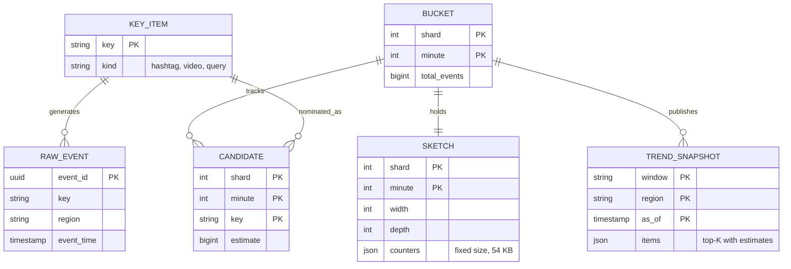
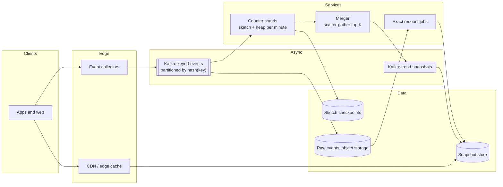
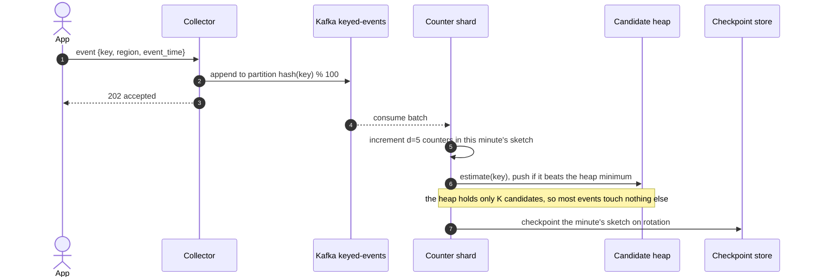
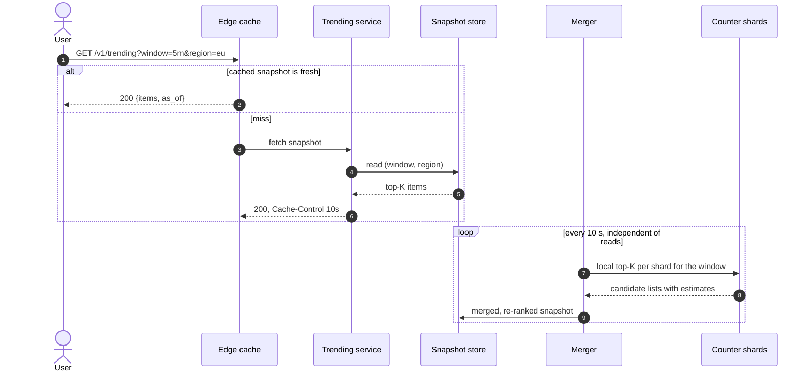
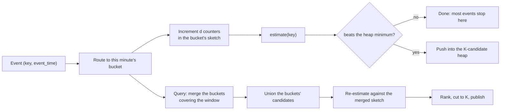
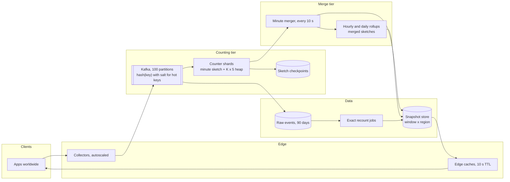

# Design a Top-K heavy hitters service

## TL;DR

- Top-K is a **counting problem with a memory constraint**: 300k events/s over 500M distinct keys, and the answer is a list of ten strings.
- The cruxes: (1) **exact counters versus a sketch plus a heap**, (2) **windowing** — per-minute buckets merged into 1-hour and 24-hour views rather than one counter per window length, (3) **partitioning by key hash** with a scatter-gather **merge of shard-local top-K**, (4) a **fast approximate path** beside a **slow exact path**, (5) **serving**, where the whole answer is one cacheable list.
- The sketch is O(1) in memory per bucket regardless of key count, which is the entire reason this design exists.

## Problem statement and clarifying questions

"Design a service that returns the top K items by frequency over a recent window: trending hashtags, most-played videos, most-searched queries." Almost every candidate reaches for a hash map and a heap; the interview begins when you ask what happens at 500M distinct keys.

| Question | Assumption taken |
|---|---|
| What is being counted, and how many events? | 10B events/day: views, plays, searches. ~100k/s average, ~300k/s peak. |
| How many distinct keys? | ~500M per day, heavily skewed: a Zipf-like head and a very long tail. |
| Which windows? | Last 5 minutes, last hour, last 24 hours. Not arbitrary ranges. |
| How large is K? | 10 to 100 items served; a few hundred tracked per shard. |
| How exact must it be? | Approximate is fine for a trending panel; an exact path exists for audits and abuse review. |
| How fresh? | Under a minute. A trending list that lags by 10 minutes is not trending. |
| Are queries personalised or regional? | Regional (a few hundred regions), not per user. |
| Can a key be adversarial? | Yes — bots inflate hashtags, so counting must be per-user-deduplicated upstream. |
| Retention of the counts? | Minute buckets for a day, hourly rollups for 90 days. |

## Requirements

### Functional

- Ingest a keyed event stream and maintain frequency estimates per key per time bucket.
- Serve the top K keys for the last 5 minutes, hour and day, globally and per region.
- Support an exact recount over a bounded window for audit, abuse review and disputes.
- Expose the estimate alongside the rank, so consumers can see how close the race is.

### Non-functional

- Scale: 300k events/s at peak, 500M distinct keys/day, ~15k trending-panel reads/s.
- Latency: an event visible in the trending list within 60 s; a top-K query under 100 ms.
- Memory: bounded per shard and independent of the number of distinct keys.
- Accuracy: the served top-10 should match the exact top-10 essentially always; counts may overcount by a bounded error.
- Availability: 99.9%. A stale trending list is fine; an error is not.

### Out of scope

Bot and spam filtering (assume an upstream filter), personalisation and ranking beyond raw frequency, the raw event pipeline itself, and the UI.

## Estimation

Using the [latency and estimation tables](../../cheatsheets/latency-and-estimation.md): a day is ~10^5 s, peak is 3x average, an event is ~100 B (the small end of the chat-message range), and a Count-Min Sketch of width `w = e/eps` and depth `d = ln(1/delta)` costs `4 x w x d` bytes.

| Quantity | Arithmetic | Result |
|---|---|---|
| Ingest QPS | 10B events/day / 10^5 | ~100k/s average, ~300k/s peak |
| Ingest bandwidth | 300k/s x 100 B | ~30 MB/s — one Kafka broker's worth (~100 MB/s in) |
| Shards | 300k/s peak / ~10k events/s per node, x2 headroom | ~60 nodes; round up to 100 partitions |
| Sketch per bucket | eps=0.001, delta=0.01 gives w=2,719, d=5; 13,595 x 4 B | **~54 KB** — a constant, whatever the key count |
| Sketch fleet memory | 100 shards x 1,440 minute buckets x 54 KB | ~7.6 GB for a full day of minute resolution |
| Exact alternative | 5M distinct keys/minute x 24 B x 1,440 minutes | ~173 GB/day, and it grows with the key count |
| Overcount bound | eps x N, with N ~60k events per shard-minute | at most ~60 — invisible next to a heavy hitter's thousands |
| Trending read QPS | 100M DAU x 5 panel views / 10^5 | ~5k/s average, ~15k/s peak |
| Origin QPS after caching | one list per (window, region), 10 s TTL | **under 1/s** — the CDN absorbs the read path entirely |

Two numbers carry the design. **54 KB per bucket, independent of key count** is why a sketch beats a map: the exact structure is 20x larger today and grows with every new hashtag, while the sketch does not. And **under 1 request/s at the origin** is why the read path is not interesting: the answer is one short list, so cache it and move on.

## API design

| Endpoint | Request | Response | Notes |
|---|---|---|---|
| `POST /v1/events` | `{key, region, event_time, user_hash}` (batched) | `202 {accepted}` | Fire-and-forget; the collector appends to the log partitioned by `hash(key)`. |
| `GET /v1/trending` | `?window=5m\|1h\|24h&region=&k=10` | `200 {items:[{key, estimate, rank}], as_of, approximate}` | `Cache-Control: 10s`. `window` is an enum, not a free range — that is what makes it cacheable. |
| `GET /v1/keys/{key}/count` | `?window=1h` | `200 {estimate, error_bound, as_of}` | Returns the bound explicitly: an estimate without its error is a lie. |
| `POST /v1/recounts` | `{from, to, keys[], reason}` | `202 {job_id}` | The exact path: replays raw events for a bounded range. |
| `GET /v1/recounts/{job_id}` | — | `200 {status, results[]}` | Poll; exact recounts take minutes, not milliseconds. |

Two API decisions are worth defending out loud. Fixed window sizes keep the cache key space at `windows x regions x k` — a few thousand entries — instead of unbounded. And returning `error_bound` next to `estimate` lets a caller decide whether the gap between rank 9 and rank 10 is real.

## Data model

**Nothing here stores a row per key. The counting structures are fixed-size, and only the published lists are durable.**



- **Sketches and candidate heaps** live in the aggregator's memory, checkpointed to a key-value store so a restart does not lose a minute. They are fixed-size blobs keyed by `(shard, minute)`.
- **Snapshots** — the published top-K per window per region — go to a small key-value store and then a cache. This is the only thing the read path touches.
- **Raw events** land in object storage, partitioned by hour, purely so the exact path has something to replay.
- **Hourly and daily rollups** are merged sketches, not re-counted streams: merging 60 minute sketches is cheaper than reading 60 minutes of events, and the result is identical.

## High-level design

**v1: a partitioned log, shard-local sketches, a merger that publishes snapshots, and a cache in front.**



**Write path: one event touches five counters and, occasionally, a heap.**



**Read path: merge shard lists once per window, then serve everything from cache.**



The loop at the bottom is the trick: **publishing is decoupled from querying**. The merge runs on a timer at a fixed cost no matter how many users are watching, and the read path is a cache lookup.

## Deep dive: exact counters versus a sketch and a heap

The probing question is "why not a hash map and a heap?" Because a hash map is O(distinct keys) and distinct keys is the number you cannot control.

| Approach | Memory | Accuracy | When it is right |
|---|---|---|---|
| Hash map + heap | O(distinct keys): ~12 GB for one day-long map, ~173 GB at minute resolution | Exact | Bounded key spaces, or a single machine's worth of keys |
| Sorted set in Redis | O(distinct keys) plus index overhead | Exact, with ranks | Leaderboards where the key set is users, not content |
| Count-Min Sketch + heap (chosen) | O(1) per bucket: 54 KB | Overcounts by at most `eps x N` | Unbounded, skewed key spaces |
| Space-Saving / Misra-Gries | O(K/eps) counters | Exact for true heavy hitters | Fewer knobs, harder to merge across shards |
| Sampling | O(sample size) | Noisy in the tail | Cheap first cut, poor for close races |

Take the sketch, and be precise about what you are buying. A Count-Min Sketch is `d` rows of `w` counters; adding a key increments one counter per row and estimating takes the minimum of those counters. Collisions can only add, so **the estimate never undercounts** — it overcounts by at most `eps x N` with probability `1 - delta`. For a heavy hitter with thousands of events, an error of 60 changes nothing; for a key with three events, the estimate is meaningless, which is fine because you never serve it.

The heap is the other half. The sketch can estimate any key but cannot enumerate keys, so you keep a min-heap of the K largest estimates seen: a new key enters when its estimate beats the heap minimum, evicting the smallest. That pairing — a sketch for counts, a heap for identity — is the standard answer, and the [Probabilistic data structures](../fundamentals/probabilistic-data-structures.md) page derives the sizing.

!!! tip "Interview tip"
    Lead with the memory statement: "the sketch is 54 KB per bucket whether there are a thousand keys or a billion." Then add the honest caveat — it overcounts, never undercounts, by at most `eps x N`. Stating the error direction is what separates someone who has used a sketch from someone who has read about one.

## Deep dive: windowing without a counter per window

The probing question is "you need 5-minute, 1-hour and 24-hour lists — do you keep three of everything?" No: keep **one bucket per minute** and merge.

**Counting, tracking and merging, in the order an event meets them.**



Sketches of the same shape merge by adding counters, so a 1-hour view is the sum of 60 minute sketches and a 24-hour view is the sum of 1,440 — or, cheaper, of 24 pre-merged hourly sketches. Candidates come from the union of the buckets' heaps, then get re-estimated against the merged sketch, which is what keeps the counts right even though each heap only saw one minute.

```python title="code/hld/topk_cms.py — buckets, merging and the shard merge"
--8<-- "code/hld/topk_cms.py:windowed"
```

Running it over a skewed stream with one topic that only spikes in the last five minutes shows exactly what "trending" means — a key's rank in a short window versus its rank in a long one:

```text
4 shards x 30 one-minute buckets; each bucket is a 2,719 x 5 sketch (53 KB)
120 buckets hold 6.2 MB for 4,084 distinct keys and 62,500 events
top-5 over the whole 30 minutes (merged across shards):
  k0           estimate= 9,572  exact= 9,572
  k1           estimate= 4,392  exact= 4,392
  k2           estimate= 2,750  exact= 2,750
  k_breaking   estimate= 2,500  exact= 2,500
  k3           estimate= 2,076  exact= 2,076
top-5 over the last 5 minutes: ['k_breaking', 'k0', 'k1', 'k2', 'k3']
  k_breaking ranks #1 over 5 minutes but only #4 over 30: that gap is 'trending'
approximate vs exact top-10: 10/10 keys agree; the sketch may overcount by at most eps*N = 63
```

Retention falls out of the same structure: keep 1,440 minute buckets for a day, then discard the minutes and keep the hourly merges. Memory is a function of how many buckets you retain, never of how many keys pass through them.

## Deep dive: sharding and the scatter-gather merge

The probing question is "one machine cannot see 300k events/s — how do you split it?" Partition the log by `hash(key)` so every occurrence of a key reaches the same shard, and the shard's counter for that key is local and complete.

That choice has three consequences worth naming.

**The merge becomes a union, not a sum.** With hash partitioning a key lives on exactly one shard, so combining shard lists is concatenate-and-re-rank. Keep the summing merge anyway — it is the same code, and it stays correct if you ever partition round-robin for load reasons.

**The merge is approximate at the boundary.** A key that ranks 11th on every shard while the served K is 10 can be globally top-10 and never appear in any local list. The fix is cheap: have each shard track `K x 3` to `K x 10` candidates and cut to K only at the merger. The module's demo does exactly this — shards report their top 20, the merger publishes 5.

**Hot keys break the balance.** A single hashtag can be several percent of all traffic, so its partition runs hot. Unlike a stateful aggregation, a sketch tolerates a fix: send hot keys to `hash(key, salt)` across several partitions and sum the shards at merge time — the summing merge above is already correct for that. Detect which keys need salting with the same service, one level up.

```python title="code/hld/topk_cms.py — shard routing and the merge"
--8<-- "code/hld/topk_cms.py:merge"
```

Sizing: 100 partitions at ~10k events/s each, one consumer per partition, and a merger that runs every 10 seconds pulling 100 lists of a few hundred entries — a few tens of thousands of items to re-rank, which is microseconds of work.

## Deep dive: the fast path, the slow path and serving

The probing question is "an advertiser or a journalist says your trending list is wrong — how do you check?" With a second path that does not share the first one's approximations.

| Path | Latency | Memory | Accuracy | Used for |
|---|---|---|---|---|
| Fast: sketches + heaps | Seconds | 54 KB per bucket | Overcounts by `eps x N` | The trending panel |
| Slow: replay raw events | Minutes | Bounded by the range | Exact | Audits, abuse review, disputes |

The slow path is a batch job that reads the raw partitions for a bounded range and counts with a hash map. It is affordable precisely because it is bounded — nobody asks for an exact 90-day recount, they ask about one hour and a handful of keys. Run it on a schedule for the previous day as well, and alert when the served top-10 and the exact top-10 disagree: that alert catches sketch misconfiguration, skew and upstream filter bugs long before a user does.

Serving is the least interesting part of the system, which is itself the point. The answer is a list of K strings and numbers — a couple of kilobytes — identical for everyone in a region. Publish it on a timer, put it behind a cache with a 10-second TTL, and 15k reads/s become under one origin request per second. Return `as_of` so clients can show the age, and keep the previous snapshot as a fallback so a merger outage freezes the list rather than emptying it.

!!! warning "Common mistake"
    Recomputing the top-K per request. It looks harmless with one user and collapses at 15k reads/s, because each request would scatter to 100 shards. Decouple publishing from querying: the merge runs on a timer at a fixed cost, and reads never leave the cache.

## Scaling, bottlenecks and failure modes

**v2: salted hot keys, checkpointed shards, pre-merged rollups and a cached snapshot path.**



- **A hot key** is the first thing that breaks: one partition at 5x the others. Salt it across partitions and sum at the merger; detect new hot keys from the previous window's own output.
- **A shard restart** loses the in-memory sketch for the current minute unless you checkpoint. Checkpoint the sketch blob every few seconds — it is 54 KB — and replay the partition from the last committed offset.
- **Merger failure** freezes the published snapshot. That is the right degradation: serve the last good list with an older `as_of` rather than an empty one, and alert on snapshot age, not on merger uptime.
- **Sketch saturation**: if `eps x N` grows past the gap between rank K and rank K+1, the ordering gets noisy. Monitor that gap; when it narrows, shrink `eps` (a wider sketch) for the windows that need it — the 24-hour view has far more events than the 5-minute one and may want a different shape.
- **Clock skew and late events** put counts in the wrong bucket. Bucket by event time with a watermark, exactly as in [Design an ad click aggregation system](ad-click-aggregation.md), and let late events land in the batch path.
- **A region failure** costs nothing: shards are stateless-ish (rebuildable from the log), and the snapshot store is small enough to replicate everywhere.

## Trade-offs summary

| Decision | Chosen | Alternatives | Why |
|---|---|---|---|
| Counting structure | Count-Min Sketch + min-heap | Hash map, Redis sorted set, Space-Saving | O(1) memory per bucket, merges across time and shards |
| Error direction | Overcount, never undercount | Undercounting sketches | A missed heavy hitter is worse than an inflated count |
| Windowing | Per-minute buckets, merged on demand | One counter set per window length | Any window from one set of buckets; retention is bucket count |
| Rollups | Merge sketches | Re-count from raw events | Merging 60 blobs beats reading a minute of events |
| Partitioning | `hash(key)`, salted for hot keys | Round robin | Complete local counts, at the price of skew you then manage |
| Shard candidate size | Track K x 3 to K x 10, cut at the merger | Track exactly K | Fixes the merge boundary for the cost of a bigger heap |
| Serving | Timer-published snapshot behind a cache | Query-time scatter-gather | Fixed publish cost, sub-1/s origin load |
| Exactness | Fast approximate + bounded exact recount | One exact pipeline | Exactness on demand, not on every event |

## Interviewer follow-ups

??? question "Why is a Bloom filter the wrong tool here?"
    A Bloom filter answers membership, not frequency, and its error is a false *positive* — it can claim a key it never saw. Top-K needs counts and ranks. The counting cousin is the Count-Min Sketch, whose error is a bounded overcount; a counting Bloom filter would work but is strictly larger for the same guarantee.

??? question "How do you pick eps and delta?"
    Work backwards from the gap you need to resolve. If rank 10 and rank 11 typically differ by 1,000 events in a window of 60k, an error budget of a few hundred is safe: `eps = 300/60,000 = 0.005`, `w = e/eps ~ 544`. Then set `delta` for confidence: `d = ln(1/delta)`, so `delta = 0.01` gives 5 rows. Sketches are so cheap that in practice you over-provision — 54 KB buys `eps = 0.001`.

??? question "What if two keys are genuinely tied for tenth place?"
    Break ties deterministically (by key) so the list is stable between publishes, and expose `estimate` and `error_bound` so a caller can see the race is within the noise. A trending list that reshuffles its tail every 10 seconds looks broken even when it is correct.

??? question "How do you stop bots from trending a hashtag?"
    Deduplicate upstream: count distinct users per key, not raw events, by feeding a per-key HyperLogLog alongside the sketch, or by dropping repeat events from the same user hash within a window. Both are cheap; neither belongs in the sketch itself, and saying so shows you know where the abstraction boundary sits.

??? question "Could you use Redis sorted sets instead?"
    For a bounded key space, yes — that is exactly the [Design a real-time gaming leaderboard](leaderboard.md) design, and `ZINCRBY` plus `ZREVRANGE` is hard to beat. It breaks here because the set would hold 500M members per window and every distinct key costs memory, which is the constraint the sketch removes.

??? question "How does this relate to typeahead's popular-query lists?"
    Same shape: a heavy-hitter stream feeding a cached top-K per prefix. [Design typeahead autocomplete](typeahead.md) attaches the counting to a trie node instead of a global list, and its freshness requirement is looser, so it can rebuild offline. The counting machinery is identical.

## 45-minute pacing

| Minutes | What to say and draw |
|---|---|
| 0-5 | Clarify: 10B events/day, 500M distinct keys, three fixed windows, approximate serving with an exact audit path. |
| 5-9 | Estimation: 300k events/s, 54 KB per bucket versus 173 GB/day exact, sub-1/s origin reads after caching. |
| 9-14 | API (batched ingest, `window` as an enum, `estimate` with `error_bound`) and what is actually stored. |
| 14-24 | v1 diagram; narrate the write path (five counter increments plus a heap check) and the timer-driven publish. |
| 24-38 | Deep dives: sketch versus map, per-minute buckets merged into any window, sharding and the scatter-gather merge. |
| 38-43 | Hot keys, checkpointing, sketch saturation, and the exact recount path. |
| 43-45 | Trade-offs table and the one-line answer on why a Bloom filter does not apply. |

## Related

- [Probabilistic data structures](../fundamentals/probabilistic-data-structures.md) — the Count-Min Sketch, its error bounds and the CMS-plus-heap pairing
- [Design an ad click aggregation system](ad-click-aggregation.md) — the same stream shape with billing-grade exactness requirements
- [Design typeahead autocomplete](typeahead.md) — top-K per prefix rather than one global list
- [Design a real-time gaming leaderboard](leaderboard.md) — exact ranks over a bounded key space, where sorted sets win
- Primary source: Cormode and Muthukrishnan, "An Improved Data Stream Summary: The Count-Min Sketch and its Applications" (2005)
