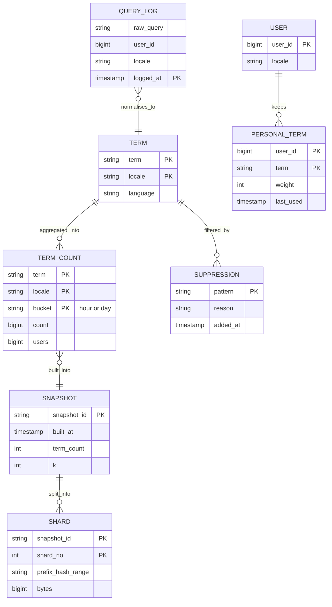
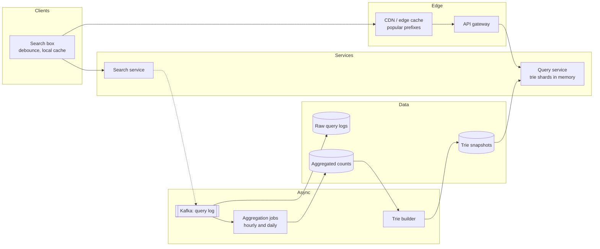
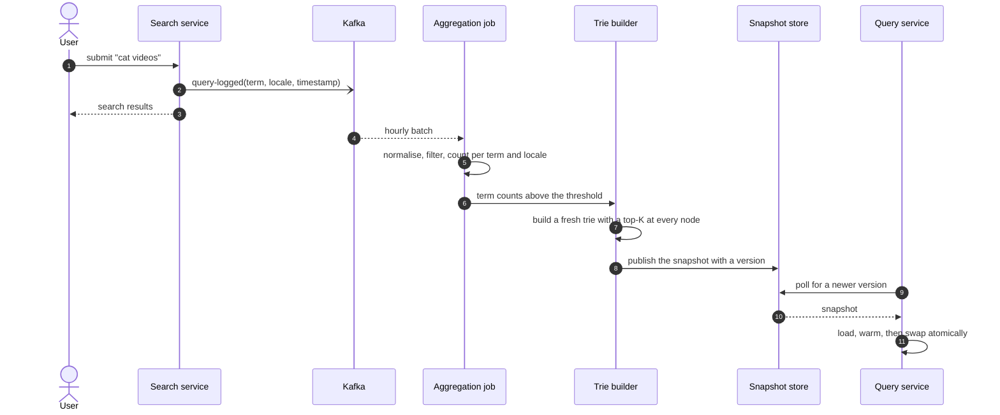
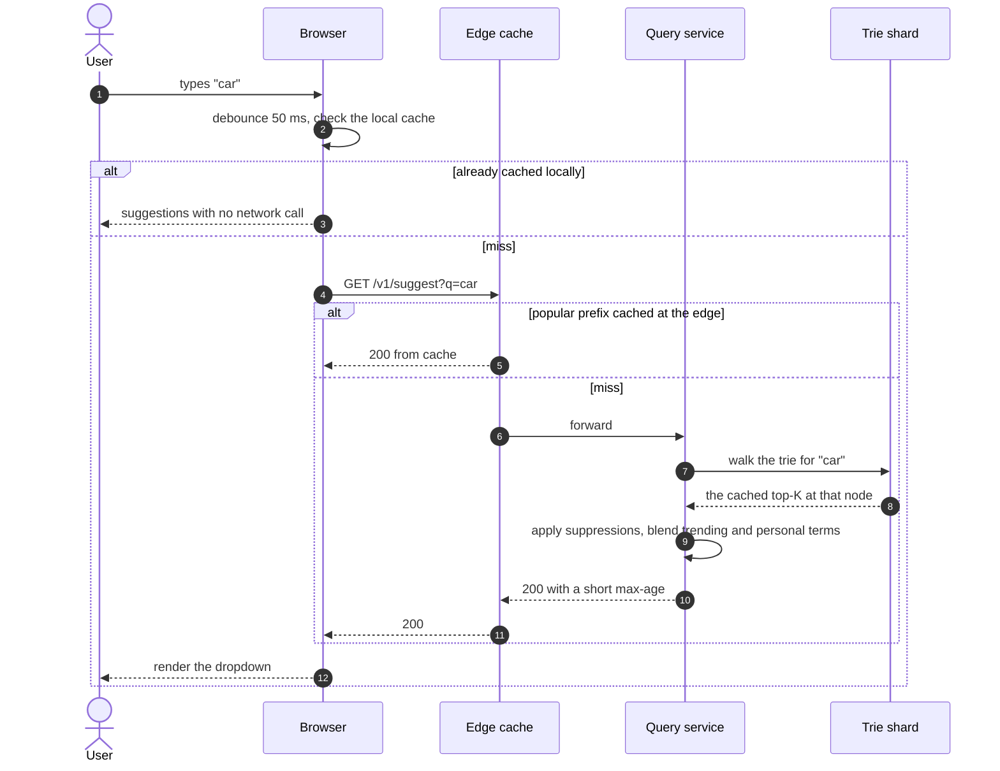
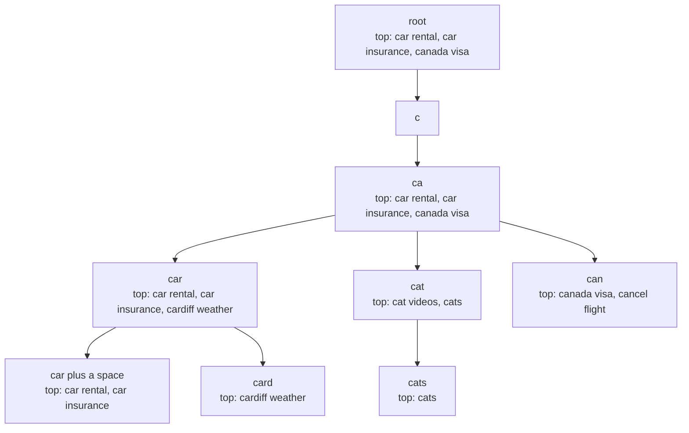
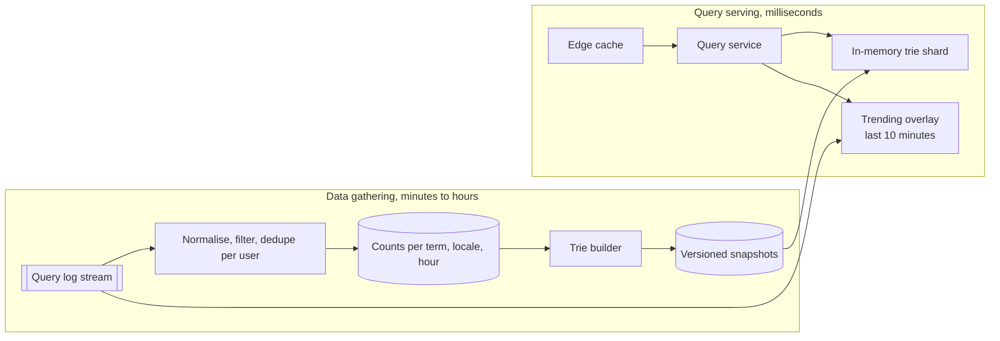
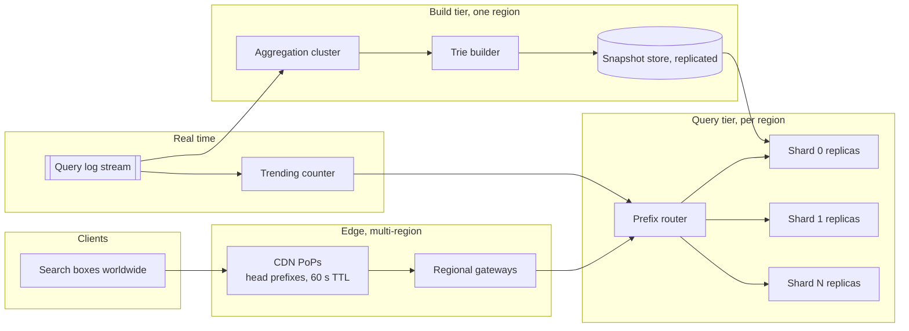

# Design typeahead autocomplete

## TL;DR

- Typeahead is a **precomputation problem disguised as a search problem**. Ranking cannot happen while the user types, so every prefix's answer is computed offline and cached at the trie node that represents it. A query is a walk and a return.
- The cruxes an interviewer probes: (1) the **trie with a cached top-K per node**, (2) the **offline pipeline** that turns query logs into that trie, (3) **sharding by prefix**, (4) the **latency budget** across browser, edge and service, (5) filtering, personalisation and real-time **trending**.
- The design holds ~10M terms in ~15 GB of trie, rebuilt hourly, sharded eight ways, with a trending overlay merged at read time.

## Problem statement and clarifying questions

"Design the suggestion dropdown under a search box: as the user types, show the most likely completions of what they have typed." The trap is treating it as search. It is not — it is a lookup of a precomputed answer, and the engineering is in how that answer gets computed and how it reaches memory near the user.

| Question | Assumption taken |
|---|---|
| Scale? | 100M DAU x 10 searches/day = 1B searches; ~5 suggestion requests each. |
| Prefix only, or middle-of-string? | Prefix only. Middle-of-string needs an inverted index. |
| How many suggestions? | Top 5 per prefix, ranked by past popularity. |
| How fresh must they be? | Hourly for the corpus; trending terms need minutes. |
| Personalised? | A light overlay of the user's recent searches, blended at read time. |
| Typo tolerance? | Out of scope for v1; noted as an extension. |
| Locales and languages? | The corpus is partitioned by locale, and rankings never cross. |
| Latency target? | The dropdown must feel instant: p99 under 100 ms end to end. |
| Who supplies the corpus? | Our own query logs, filtered for spam and unsafe terms. |

## Requirements

### Functional

- `GET /suggest?q={prefix}` returns the top 5 completions of the prefix for the caller's locale.
- Suggestions are ranked by popularity, with recent searches and trending terms blended in.
- Unsafe, spammy and legally suppressed terms never appear, whatever their popularity.
- The corpus refreshes at least hourly; a trending term can appear within minutes.

### Non-functional

- Scale: ~58k suggestion QPS average, ~175k/s peak; ~10M terms per locale group.
- Latency: p99 under 100 ms as the user perceives it, of which the service gets 10 ms. A trie walk is a few dozen memory references at ~100 ns each; the network dominates.
- Availability: 99.9%. A missing dropdown degrades the experience but does not break search, so this tier is cheaper than the search path it decorates.
- Consistency: eventual by design. Two users may see different suggestions during a rollout, and nobody notices.
- Correctness: the suppression list is enforced on every path, including the trending overlay.

### Out of scope

Full-text search and result ranking, spelling correction, query understanding, ads in the dropdown, voice input.

## Estimation

Using the [latency and estimation tables](../../cheatsheets/latency-and-estimation.md): a day is ~10^5 s, peak is 3x average, a memory reference is ~100 ns, a same-datacenter round trip is ~500 µs and a cross-region one is ~70 ms.

| Quantity | Arithmetic | Result |
|---|---|---|
| Search QPS (write path) | 1B / 10^5 x 1.15 | ~12k logged searches/s |
| Suggestion QPS (read path) | 1B x 5 / 10^5 x 1.15 | ~58k/s average, ~175k/s peak |
| Raw log volume | 1B x 500 B per log line | ~500 GB/day, ~180 TB/year before compaction |
| Aggregated counts | 10M terms x ~40 B | ~400 MB per locale group |
| Trie size | 10M terms x 20 chars, ~1 node per char after sharing, ~150 B/node | ~15 GB — one server's RAM |
| Response bandwidth | 175k/s x 1 KB JSON | ~175 MB/s = ~1.4 Gbps, ~60% absorbed at the edge |
| Edge cache, 80/20 rule | 20% of 5B daily reads x 1 KB | ~1 TB/day of hot bytes — see below |
| Edge cache, distinct prefixes | top 1M prefixes x 1 KB | ~1 GB, small enough for every PoP |
| Serving nodes | 175k/s / ~10k QPS per node x 1.5 | ~27 nodes: 8 shards x 4 replicas |

Two things to say out loud. **The trie fits in memory** — 15 GB is nothing next to 64-512 GB per server — so sharding is for throughput and blast radius, not capacity. And the 80/20 rule again counts reads rather than distinct keys: the *head of the prefix distribution* is about a gigabyte, which is why a modest edge cache absorbs most traffic.

## API design

| Endpoint | Request | Response | Notes |
|---|---|---|---|
| `GET /v1/suggest?q=car&locale=en-GB&limit=5` | — | `200 {prefix, suggestions: [{term, score}], snapshot}` | The only hot endpoint. `Cache-Control: public, max-age=60` from two characters up. |
| `GET /v1/suggest?q=c` | — | `200` from the edge only | One-character prefixes come from a preloaded list; they scatter across every shard otherwise. |
| `POST /v1/feedback` | `{prefix, chosen_term, position}` | `202` | Which suggestion was clicked; feeds ranking, fire and forget. |
| `POST /v1/suppressions` | `{pattern, reason}` + `Idempotency-Key` | `201 {pattern}` | Operator endpoint. Applies at read time immediately, and to the next snapshot. |
| `GET /v1/snapshots/current` | — | `200 {snapshot_id, built_at, term_count}` | What each serving node holds; the first thing you check in an incident. |

No pagination anywhere: a dropdown shows five rows and there is no page two. Shared responses carry no personal data — the personal overlay is merged client-side or in an authenticated, uncacheable variant, so one user's history can never leak into a shared cache entry.

## Data model

**Logs are huge and transient, counts are small, and the served artefact is an immutable snapshot.**



- **QUERY_LOG**: append-only files in object storage, partitioned by hour and locale, 90-day retention. Never queried online.
- **TERM_COUNT**: a columnar warehouse table, one row per term, locale and hour. Hourly rows roll up into daily ones; the builder reads a weighted blend.
- **SNAPSHOT and SHARD**: immutable files in object storage, versioned and checksummed. Serving nodes pull them; nothing mutates a live trie on disk.
- **SUPPRESSION**: a small durable table replicated into every serving process, because a takedown must apply to suggestions built before it existed.
- **PERSONAL_TERM**: a key-value store keyed by user, capped at a few hundred entries with LRU eviction. Small, private, never part of a shared cache entry.

## High-level design

**v1: an offline pipeline that builds a trie, and a query tier that only reads it.**



**Write path: a submitted search becomes tomorrow's suggestion.**



**Read path: a keystroke, answered as close to the user as possible.**



Two loops at completely different speeds: a build loop measured in hours and a serve loop measured in milliseconds. Everything expensive happens in the first; the second only walks pointers.

## Deep dive: a cached top-K at every node

"The user has typed `car`. How do you find the five best completions without scanning?" You do not find them — you look them up. Every trie node stores the finished answer for its own prefix, so the read path does no ranking, no sorting, no traversal.



The cost moves to the write side. Changing one term's weight repairs the cached list at every node along that term's path — O(len(term) x k log k), a few hundred operations for a twenty-character query. Storing the list at every node roughly triples the trie's memory, and 15 GB tripled is still one server.

Two alternatives get raised and both lose. Keeping terms only at terminal nodes and scanning the subtree turns a keystroke into work proportional to the corpus — millions of terms under `c`. A sorted array with binary search finds the prefix range in O(log n) but still ranks whatever it finds, on every keystroke, for every user.

```python title="code/hld/trie_topk.py — the trie and its cached lists"
--8<-- "code/hld/trie_topk.py:trie"
```

One choice deserves to be stated as a decision, not an accident: `bump` is **increase-only**. A weight that only rises can never evict an entry that would then have to be replaced from the subtree, so the repair stays on the path. Demotions — a term marked as spam, a fading trend — break that invariant, so they go through a full rebuild. That line between the online path and the offline pipeline is what separates a designed system from a pile of optimisations.

```text
built 12 terms into 120 nodes, k=3
  suggest('') -> car rental 9000, car insurance 7500, canada visa 6100
  suggest('ca') -> car rental 9000, car insurance 7500, canada visa 6100
  suggest('car') -> car rental 9000, car insurance 7500, cardiff weather 4200
  suggest('car ') -> car rental 9000, car insurance 7500
  suggest('zz') -> (no match)
a trending burst of +20000 on 'cat videos' repairs 11 cached lists in place:
  suggest('ca') -> cat videos 23100, car rental 9000, car insurance 7500
  suggest('cat') -> cat videos 23100, cats 2400
sharded over 4 tries by the first 2 characters:
  suggest('car') -> ['car rental', 'car insurance', 'cardiff weather']  (1 shard touched)
  suggest('c')   -> ['car rental', 'car insurance', 'canada visa']  (4 shards touched, so cache it)
8 threads x 500 bumps: query 0=800, query 1=800, query 2=800
```

## Deep dive: the data-gathering pipeline

"Where do the weights come from?" From the logs the search service already writes, put through four stages before they reach a trie.



**Normalise**: lower-case, collapse whitespace, strip meaningless punctuation, tag the locale. **Filter**: drop terms below a frequency floor (a term searched twice is noise), anything matching the suppression list, and queries that look like injected URLs or personal data. **Deduplicate per user** before counting, so one person hammering a query cannot make it a suggestion — count *distinct users*, not events. **Aggregate** into hourly buckets and roll them into days; the builder reads a weighted blend, and weighting recent hours higher gives recency without a separate mechanism.

The builder produces an **immutable, versioned snapshot**. Serving nodes pull it, build the trie in a spare heap, warm it with a replay of live traffic, and only then swap the pointer — an atomic rebind, so no request ever sees a half-built trie. Roll one replica at a time and compare its suggestion distribution against the previous snapshot; a build that suddenly drops 10% of terms is a broken upstream job, and catching it here is far cheaper than catching it in the dropdown.

Cold start is the part candidates forget: a new product has no query logs. Seed the corpus from what you already have — the catalogue, category names, an editorial list — and let real traffic take over within days. Say so unprompted; it shows you have thought about launch day, not only steady state.

## Deep dive: sharding the trie

15 GB fits on one machine, so sharding is about **throughput and blast radius**, not capacity. Three ways to split it, one obvious answer.

| Scheme | Fan-out | Balance | Problem |
|---|---|---|---|
| Range by first letter | 1 | Terrible | English piles traffic onto `s` and `c` |
| Hash of the whole term | Every shard | Perfect | A prefix's completions scatter everywhere |
| Hash of the first 2-3 characters | 1 | Good | Prefixes shorter than the key must scatter |

Hash the first two or three characters. Every completion of a prefix then lives on one shard, so a query is a single lookup, and hashing rather than ranging keeps `s` from becoming hot. Balance is good because the two-character prefix space — thousands of live combinations — averages out.

```python title="code/hld/trie_topk.py — one trie per prefix shard"
--8<-- "code/hld/trie_topk.py:sharding"
```

The exception proves the design: a one-character prefix cannot be routed, so it fans out to every shard and merges. That is expensive and entirely predictable, since there are only a few dozen first characters per locale. Precompute those answers and pin them at the edge and in every process — the first keystroke never reaches a shard.

Replicate each shard four ways behind a router. Replicas are read-only and identical, so they scale linearly, restart in seconds by pulling a snapshot, and lose nothing when one dies. Losing a whole shard means one slice of the alphabet has no suggestions, degrading to an empty dropdown rather than an error.

## Deep dive: the latency budget

"Under 100 ms" is a budget, so spend it explicitly. A cross-region round trip is ~70 ms and eats it on its own, which is why the design pushes work outward in four layers.

- **The browser** debounces 50 ms after the last keystroke and caches every response it has seen. A user typing `c`, `ca`, `car` makes fewer requests than keystrokes, and backspacing to `ca` costs nothing. This layer removes more traffic than any server-side cache.
- **The connection**. Keep it warm over HTTP/2 or HTTP/3: a fresh TLS handshake is two round trips and blows the budget before a byte of payload moves.
- **The edge**. Popular prefixes are a tiny set — the top million responses are about a gigabyte — so a PoP with a 60-second TTL serves most requests at ~10 ms instead of ~70 ms, and the short TTL keeps trending terms visible. See [Caching and CDNs](../fundamentals/caching-and-cdn.md).
- **The service**. What is left is a same-datacenter round trip (~500 µs) plus a trie walk of a few dozen memory references at ~100 ns each. Its own work is microseconds; the p99 is dominated by garbage collection pauses and connection queuing, which is what you actually tune.

!!! tip "Interview tip"
    Say the budget out loud as a subtraction: "100 ms perceived, minus 50 ms of debounce, minus ~10 ms to the nearest PoP, leaves the service tens of milliseconds — so the trie walk is free and my problem is network placement, not algorithms." That reframes the whole discussion and shows you know where the time actually goes.

## Deep dive: filtering, personalisation and trending

Three overlays sit between the cached list and the response, each with a rule.

**Filtering** is not only a build-time job. Suppressions must apply at read time too, because a takedown cannot wait an hour for the next snapshot. Keep the list small and in memory, apply it after the trie lookup, and over-fetch — ask the node for `2k` entries so filtering a few still leaves five. Filter the trending overlay through the same list; unsafe terms trend exactly when you least want them shown.

**Personalisation** is a light blend, not a separate index. Take the user's few hundred recent searches, keep those matching the prefix, merge them in with a boost. Two consequences: the response is now personal, so it cannot be cached at the edge — serve it from an uncacheable variant and keep the anonymous one shared. And the merge happens *after* the global lookup, so a personalisation outage degrades to generic suggestions rather than nothing.

**Trending** cannot wait for the pipeline. Run a streaming counter over the last few minutes of the log — a Count-Min Sketch plus a heap, the machinery in [Design a Top-K heavy hitters service](top-k-heavy-hitters.md) — and keep a small overlay trie of spiking terms, merged at read time with a decay factor. It stays small: a breaking-news term set is thousands of entries, not millions.

!!! warning "Common mistake"
    Having the query service scan the trie subtree to rank completions on each request. That is the design the cached top-K exists to avoid: the subtree under `c` is millions of terms, and no downstream cache rescues a read path that does work proportional to the corpus.

## Scaling, bottlenecks and failure modes

**v2: sharded read-only replicas per region, one global build tier, and a trending stream that bypasses it.**



What breaks first, and what you do:

- **A bad snapshot ships.** The worst failure here, because it is silent: suggestions get subtly worse and nobody pages. Gate every build on automated checks — term count, overlap with the previous snapshot, a set of golden prefixes — and keep the previous snapshot on disk so a rollback is a pointer swap.
- **Memory spikes during a swap.** Loading a new trie beside the live one doubles the footprint. Size nodes for two tries, or swap shard by shard.
- **A hot shard.** Two-character hashing balances well, but a viral term concentrates traffic. The edge cache absorbs it; beyond that, add replicas to that shard alone, which is cheap because replicas are read-only.
- **The pipeline falls behind.** Suggestions go stale, invisibly, for hours. Alert on snapshot age rather than job success: a job that succeeds while producing nothing is the failure you will actually meet.
- **A region loses its query tier.** Fail the dropdown open — no suggestions rather than an error — and let the search box work normally. Designing it to fail that way is what earns typeahead a cheaper availability target.
- **Locale skew.** Corpora differ by orders of magnitude between locales. Shard per locale group so a small market's terms are not crowded out of every node's top-K.

## Trade-offs summary

| Decision | Chosen | Alternatives | Why |
|---|---|---|---|
| Data structure | Trie with a cached top-K per node | Subtree scan, sorted array | The read path does zero ranking work |
| Freshness | Hourly snapshot plus trending overlay | Continuous live updates | Rebuilds allow demotions; the overlay covers minutes |
| Update model | Increase-only online, rebuild otherwise | Full incremental updates | Keeps the repair on the path, not the subtree |
| Sharding | Hash of the first 2-3 characters | Range by letter, hash of term | One shard per query, and no hot `s` |
| Short prefixes | Precomputed, pinned at the edge | Scatter-gather every time | A few dozen answers against a full fan-out |
| Personalisation | Read-time blend, uncacheable variant | Per-user index | Cheap, degrades to generic, keeps the cache shared |
| Failure mode | Empty dropdown | Error, or retry loops | Typeahead decorates search; it must never break it |

## Interviewer follow-ups

??? question "How would you support matching in the middle of a term?"
    Index suffixes as well as prefixes, each pointing back at the full term. Memory grows with the average term length, so cap it at the top few million terms. If you need real substring search you have left typeahead and arrived at an inverted index.

??? question "How do you handle typos?"
    Two layers. Cheap: a fuzzy walk allowing one edit, bounded so it cannot explode. Better: mine the logs for corrections users already make — a query followed seconds later by a similar query and a click is a labelled typo — and add those pairs as aliases.

??? question "Why not keep the whole thing in Redis or a database?"
    A prefix query becomes a range scan plus a sort — the ranking work the cached top-K removes — and it puts a network hop inside a loop over keystrokes. Redis suits the *trending overlay*; the corpus belongs in process memory.

??? question "How do you keep one user from poisoning the suggestions?"
    Count distinct users per term rather than events, apply a frequency floor, and require a term to persist across several hourly buckets before it enters a snapshot.

??? question "A term needs to disappear right now for legal reasons."
    It goes into the suppression list, replicated to every serving process within seconds and applied *after* the trie lookup, so it takes effect without a rebuild; the next snapshot removes it from the corpus entirely.

??? question "How do you measure whether the suggestions are any good?"
    Suggestion click-through rate, the position of the chosen suggestion, and the share of searches completed from the dropdown rather than typed out. Watch the sessions that are shown suggestions and ignore all of them — that number moves when a snapshot goes wrong.

??? question "What changes for Chinese, Japanese or Korean input?"
    A keystroke is no longer a character of the term: users type romanised input that an IME converts, so index both the term and its romanisation and match whichever the client sends. Trie depth drops sharply, making the top-K cache more valuable per node.

## 45-minute pacing

| Minutes | What to say and draw |
|---|---|
| 0-5 | Clarify: prefix only, top 5, hourly corpus with minute-fresh trending, p99 under 100 ms, per locale. |
| 5-10 | Estimation: 175k QPS peak, 15 GB of trie, ~1 GB of hot prefixes. The trie fits in memory. |
| 10-14 | The one endpoint and its cacheability; logs, counts and immutable snapshots. |
| 14-22 | v1 diagram; the two loops — build in hours, serve in milliseconds — with both sequence diagrams. |
| 22-33 | Deep dives: the cached top-K per node with the trie sketch, then the gathering pipeline. |
| 33-40 | Prefix sharding and the short-prefix exception; the latency budget as a subtraction. |
| 40-45 | Filtering, personalisation and trending; failure modes, led by the silent bad snapshot. |

## Related

- [Caching and CDNs](../fundamentals/caching-and-cdn.md) — the edge and browser layers that absorb the traffic
- [Design a Top-K heavy hitters service](top-k-heavy-hitters.md) — the sketch and heap behind the trending overlay
- [Batch and stream processing](../fundamentals/batch-and-stream-processing.md) — the hourly build and the streaming counter
- [Partitioning, sharding and consistent hashing](../fundamentals/partitioning-and-consistent-hashing.md) — why prefixes are hashed
- [Back-of-envelope estimation](../fundamentals/estimation.md) — the method behind the estimation table
- Primary source: Fredkin, "Trie memory" (1960), the original description of the structure
