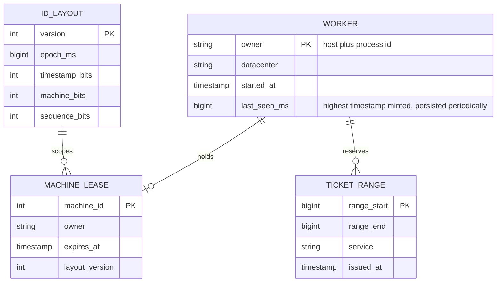
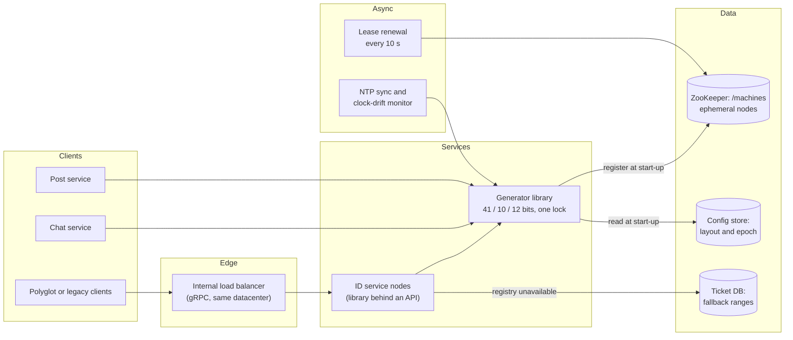
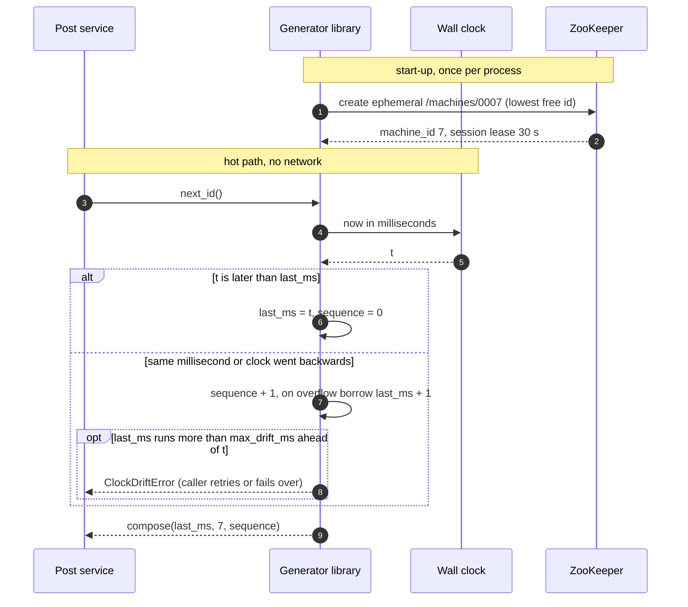
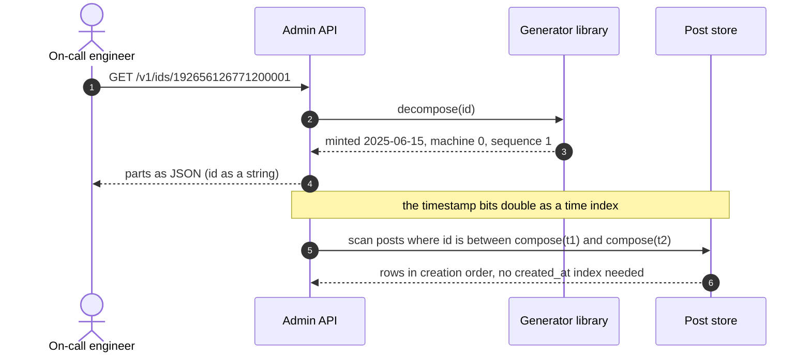
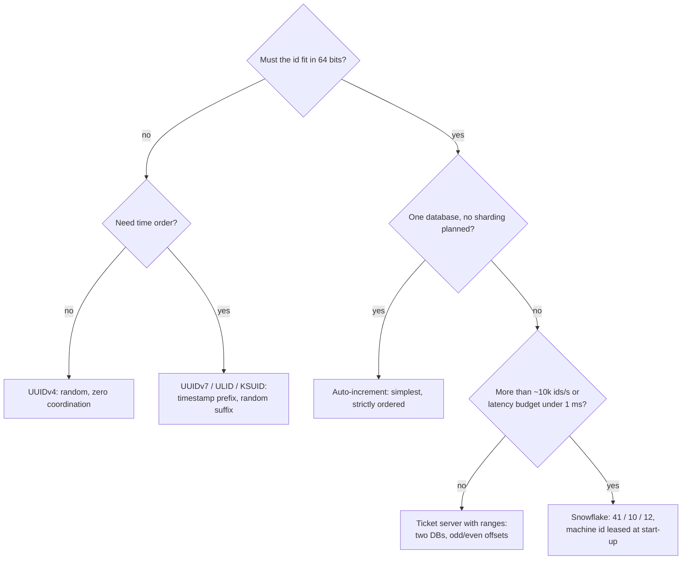
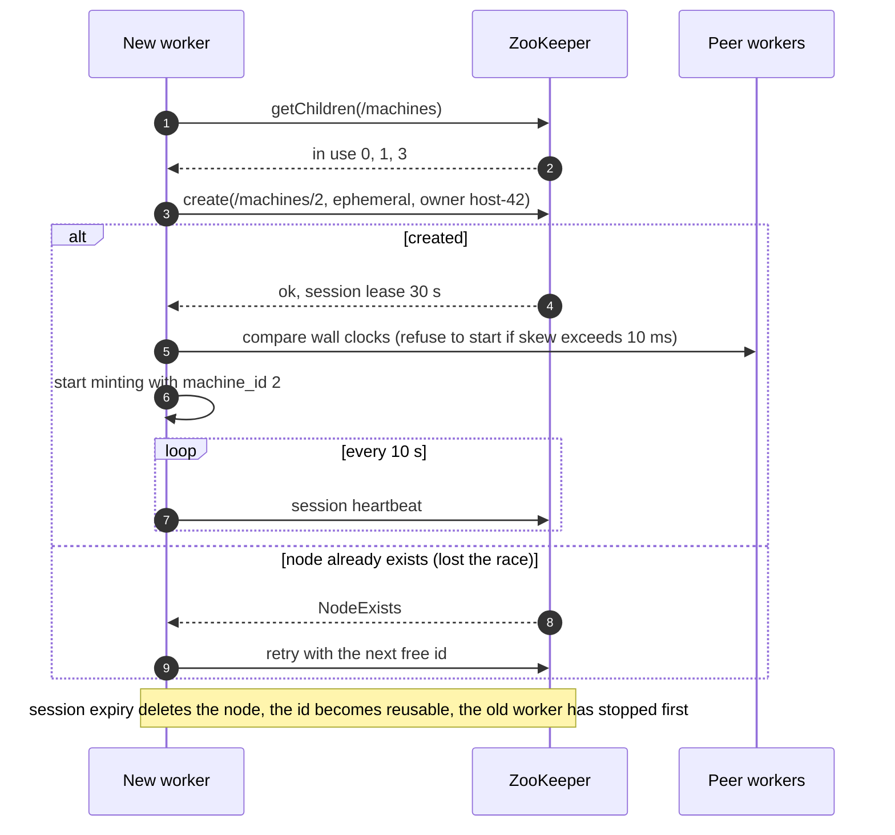
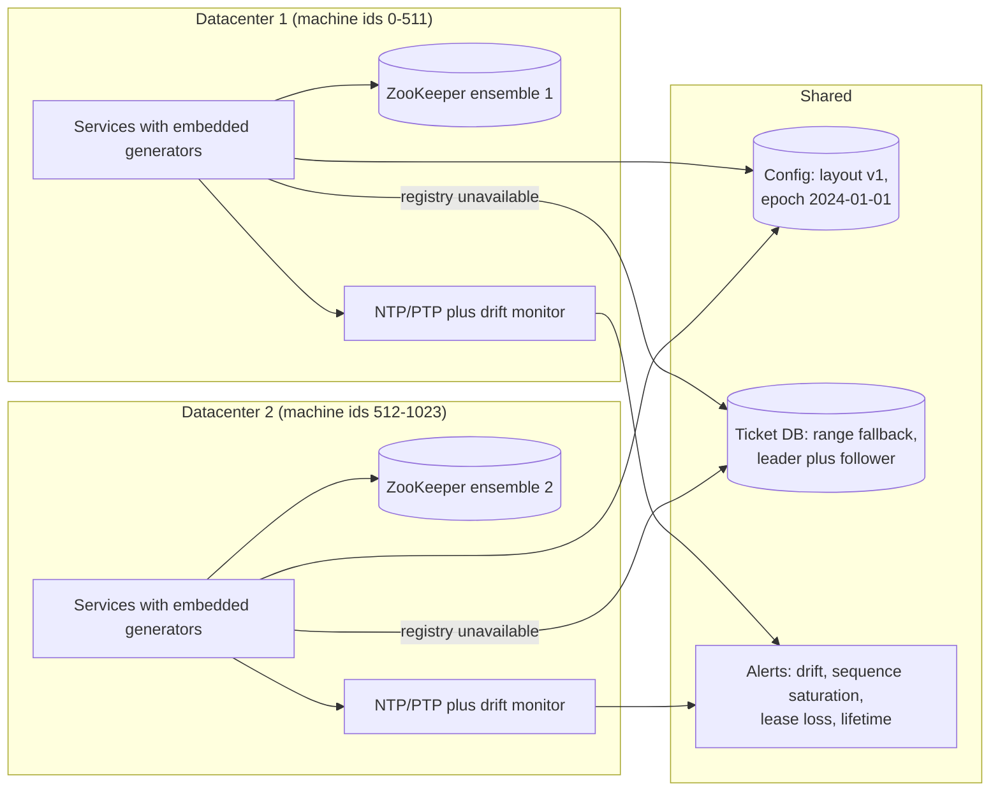

# Design a distributed unique ID generator

## TL;DR

- The ask is **64-bit, unique, roughly time-ordered ids at ~100k/s**, minted by hundreds of processes without talking to each other. The answer is a Snowflake layout: 41 bits of milliseconds since a custom epoch, 10 bits of machine id, 12 bits of per-millisecond sequence.
- Coordination happens **once per process start** (lease a machine id from ZooKeeper), never per id. Minting is a lock, a clock read and two shifts: well under a microsecond.
- The cruxes an interviewer probes: (1) why 64 bits and why k-sortable, (2) UUID vs auto-increment vs ticket server vs Snowflake, (3) **what happens when the clock goes backwards**, (4) machine-id assignment and sequence overflow, (5) when a 128-bit ULID, KSUID or UUIDv7 is the better answer.

## Problem statement and clarifying questions

"Design a service that hands out unique ids for posts, messages and orders across our fleet. Ids must fit in a database `bigint`, sort roughly by creation time, and must never collide — even during failovers and clock trouble." The clarifying answers decide whether you can avoid a central sequencer at all; pin them down before drawing.

| Question | Assumption taken |
|---|---|
| Must ids be numeric and 64-bit? | Yes: they are primary keys in relational and wide-column stores, and 128-bit keys double every index. |
| Strictly ordered or roughly ordered? | Roughly (k-sortable): ids minted later are larger, except within a few milliseconds across machines. |
| Throughput? | ~100k ids/s platform-wide at peak; a single hot service may need 4k/ms for a moment. |
| Latency budget? | In-process minting under 1 ms p99; a network call only for polyglot clients. |
| Fleet size? | Up to ~1,000 minting processes across two or three datacenters. |
| May ids leak information? | Creation time and machine are fine for internal ids; not for public tokens (deep dive 5). |
| Coordination allowed? | At start-up, yes; on the hot path, no — a coordinator outage must not stop minting. |
| Lifetime? | Decades: the layout must not run out of timestamp bits in our lifetime. |
| Multi-datacenter? | Yes, each datacenter mints independently; no cross-region call per id. |

## Requirements

### Functional

- `next_id()` returns a unique positive 64-bit integer; the same library is embedded in every service, with a thin gRPC/HTTP service for clients that cannot embed it.
- Ids are k-sortable: sorting by id is sorting by creation time to within clock skew.
- `decompose(id)` returns the creation time, machine and sequence for debugging and for time-range partitioning in the database.
- A worker obtains a machine id automatically at start-up and releases it on shutdown or crash.

### Non-functional

- Uniqueness is absolute: no duplicate under restarts, clock steps, leader failovers or two workers starting at the same instant.
- Throughput: 100k ids/s platform-wide; ~4M ids/s per worker ceiling (4,096 per ms); no shared counter on the hot path.
- Latency: p99 under 1 ms in-process (a mutex is ~17 ns, a clock read is cheaper than a memory reference); p99 under 5 ms for the service form, which is one ~500 µs same-datacenter round trip plus queueing.
- Availability: 99.99% for minting — the only external dependency (the machine-id registry) is off the hot path.
- Lifetime: at least 50 years of timestamps from the custom epoch.

### Out of scope

Cryptographic unguessability, human-friendly short codes (see [Design a URL shortener](url-shortener.md)), strict global ordering (that is a consensus problem), and idempotency of the callers that store the ids.

## Estimation

Using the [latency and estimation tables](../../cheatsheets/latency-and-estimation.md) (a day is ~10^5 s, a year ~3 x 10^7 s, peak = 3x average):

| Quantity | Arithmetic | Result |
|---|---|---|
| Mint rate (write QPS) | posts peak ~5k/s + chat messages peak ~70k/s + orders, uploads, events; round up | ~100k ids/s peak, ~35k/s average |
| Per-machine ceiling | 4,096 sequence values per ms x 1,000 ms | ~4M ids/s per machine; 1,024 machines = ~4B/s in theory |
| Read QPS (decompose, admin lookups) | on-call and tooling only | negligible, well under 1k/s |
| Storage per year (key bytes) | 35k/s x 3 x 10^7 s = ~10^12 ids/year x 8 B | ~8 TB/year of primary-key bytes across all tables; 16 TB with 16 B UUIDs, before secondary indexes and x3 replication |
| Bandwidth (service form only) | 100k/s x ~50 B (id as a JSON string plus envelope) | ~5 MB/s = 40 Mbps — irrelevant; the library form sends nothing |
| Cache size (range buffer, ticket-server fallback) | 1,000 clients x 1,000 pre-fetched ids x 8 B | 8 MB in total — a per-client buffer, not a cache tier |
| Timestamp lifetime | 2^41 ms / (3.15 x 10^10 ms per year) | ~69 years from the custom epoch |
| Coordination load | 1,024 workers x 1 lease renewal per 10 s | ~100 tiny writes/s to ZooKeeper |

Say out loud what the table proves: **the generator stores nothing and sends nothing**; its only scarce resources are bits and the correctness of a clock. That is why the design conversation is about the bit budget and the clock, not about servers.

## API design

| Endpoint | Request | Response | Notes |
|---|---|---|---|
| library `next_id()` | — | `int` | The primary interface; no network, no allocation beyond the integer. |
| `POST /v1/ids?count=100` | — | `200 {ids: ["192656126771200000", ...]}` | Ids are **strings in JSON**: JavaScript numbers lose precision above 2^53. `count` is capped at 1,000 (a quarter of one millisecond's sequence). |
| `GET /v1/ids/{id}` | — | `200 {created_at, machine_id, sequence}` | Decompose for debugging; read-only and cacheable. |
| `POST /v1/ranges` | `{service, count}` | `200 {start, end}` | Ticket-server fallback: a contiguous range from a database counter, used only when a worker cannot lease a machine id. |
| `GET /v1/machines` | — | `200 {leases: [{machine_id, owner, expires_at}]}` | Admin view of the registry. |

Idempotency is deliberately absent: ids are fungible, so a retried `POST /v1/ids` simply burns a few ids, which is cheaper than deduplicating. Pagination is not needed; `count` bounds every response.

## Data model

**The registry and the fallback counter are the only persistent state; ids themselves are never stored by the generator.**



Store choices, with the sentence to say for each:

- **MACHINE_LEASE**: ephemeral nodes in ZooKeeper or leases in etcd — a consensus-backed store with session expiry, because the one property you need is "exactly one live owner per id". A thousand 100-byte records; size is irrelevant, linearizability is everything.
- **ID_LAYOUT**: the config store, versioned and read once at start-up. Every worker pins the version it minted with; changing the layout is a deliberate migration, never a rolling config push.
- **TICKET_RANGE**: one row per range in a single-leader relational database (`UPDATE counter SET next = next + 1000 RETURNING next`), replicated to a follower. It is the fallback path, so its ~5k-20k writes/s ceiling does not matter.
- **WORKER.last_seen_ms**: persisted every second so a restarted worker can refuse to mint until the wall clock is past the last timestamp it issued (deep dive 3).

## High-level design

**v1: a library embedded in every service, a thin ID service for polyglot clients, and ZooKeeper off the hot path.**



**Write path (minting): one registration per process, then ids without any network call.**



**Read path: the same bits serve debugging and time-range queries in the store.**



Walk-through: the expensive, consensus-backed operation (leasing a machine id) happens when a process starts and is amortised over millions of ids. After that every id is a mutex, a clock read and integer arithmetic, which is why throughput is bounded by the sequence bits rather than by any server. The read path shows the payoff of putting time in the high bits: a primary key range scan is a time-range query.

## Deep dive: the requirements and the bit budget

The probing question is "why 64 bits, and why does order matter?" Three properties drive everything: **unique** (a duplicate post id is data corruption), **64-bit** (a `bigint` key is 8 bytes in every index and every foreign key; a UUID is 16), and **k-sortable** (a B-tree receiving ascending keys appends to the rightmost page; random keys split pages all over the tree and thrash the cache — and sorting by id gives you creation order for free).

The layout is a budget you spend deliberately:

| Field | Bits | Range | Why this many |
|---|---|---|---|
| Sign | 1 | always 0 | keeps the id a positive signed `bigint` in Java, Postgres and MySQL |
| Timestamp, ms since a custom epoch | 41 | 2^41 ms = ~69 years | counting from 1970 would already have spent most of the budget; a 2024 epoch lasts until the 2090s |
| Machine id | 10 | 1,024 workers (Twitter split it 5 datacenter + 5 worker bits) | enough for a fleet; no two live workers may share a value |
| Sequence | 12 | 4,096 per ms per worker | ~4M ids/s per worker, far above the ~1k-10k QPS one app server handles |

The dials you can mention: a fleet of 10,000 workers takes 3 bits from the sequence (512/ms is still 500k/s per worker); Instagram minted inside each Postgres shard with 41 time bits, 13 shard-id bits and 10 sequence bits, so an id also tells you which shard holds the row; a second-resolution timestamp (KSUID style) buys 1,000x more lifetime at the cost of ordering granularity.

The arithmetic lives in `Layout`; `compose` and `decompose` are the shifts that the interviewer will ask you to write on the board:

```python title="code/hld/snowflake.py — the bit layout"
--8<-- "code/hld/snowflake.py:layout"
```

What to say about the custom epoch: it is a constant baked into every worker and stored in `ID_LAYOUT`; changing it later changes the meaning of every existing id, so you version the layout and never reinterpret old ids.

## Deep dive: UUID vs auto-increment vs ticket server vs Snowflake

The interviewer wants you to reject the simple options for concrete reasons, not by reflex:

| Option | Size | Time order | Coordination per id | Throughput | Where it breaks |
|---|---|---|---|---|---|
| UUIDv4 | 128-bit random | none | none | unlimited | 16 B keys in every index; random inserts fragment B-trees; unreadable in logs |
| DB auto-increment | 64-bit | strict | one leader write | one primary, ~5k-20k writes/s | single point of failure; failover can re-issue or skip ranges |
| Ticket server (Flickr) | 64-bit | roughly, per server | one round trip per id or per range | one hot row; ranges of 1,000 lift it | two servers with odd/even offsets for availability; ranges lost on restart leave gaps |
| Snowflake | 64-bit | k-sortable to the ms | none (machine id leased at start-up) | ~4M/s per worker | clock steps, machine-id reuse, 69-year lifetime |
| UUIDv7, ULID, KSUID | 128-160-bit | ms or s | none | unlimited | 2x the key bytes; see deep dive 5 |

The choice is Snowflake because it is the only 64-bit option with no per-id coordination. Auto-increment is fine for a single-database product and you should say so; it stops being fine the day you shard, because two shards' sequences collide unless you pre-partition them with step and offset, which is a ticket server by another name. Ticket servers solve uniqueness but put a ~500 µs round trip and a single hot row on the write path; pre-fetching ranges hides the latency but trades it for gaps and for ids that no longer encode time.

**Choosing an id scheme: the questions in the order to ask them.**



## Deep dive: clock skew and the backwards clock

"What happens when NTP steps the clock back 200 ms on a worker that just minted 3,000 ids?" is the question that separates candidates who have run this from those who have read about it. A naive generator uses the wall clock as the timestamp field and resets the sequence when the clock changes. After a backwards step it revisits milliseconds it already used with a fresh sequence, and the first id it mints is a duplicate of one it minted 200 ms ago.

The clock moves backwards more often than people expect: NTP *steps* instead of slewing when the offset exceeds its threshold, virtual machines jump after live migration, leap seconds are smeared differently across clouds, and operators fix clocks by hand. Clock skew *between* machines is a separate, milder problem: it only blurs the ordering of ids minted on different workers, it never causes duplicates, because the machine bits differ.

The guard has two layers. First, the generator keeps its own **logical millisecond** that never moves backwards; the wall clock can only pull it forward. Within the same logical millisecond it increments the sequence, and on overflow it *borrows* the next millisecond rather than spinning, so a frozen or lagging clock never blocks minting. Second, the distance between the logical and the wall clock is bounded: beyond `max_drift_ms` the generator raises and the caller retries on another worker. A small step is absorbed silently; a large one becomes an incident instead of a duplicate.

```python title="code/hld/snowflake.py — the generator with the drift guard"
--8<-- "code/hld/snowflake.py:generator"
```

The demo exercises a frozen clock, a 3 ms step and a 50 ms step:

```text
layout: 41/10/12 bits, 1024 machines, 4096 ids/ms/machine, 69 years of timestamps
registry: worker-a -> machine 0, worker-b -> machine 1, worker-a restarts -> machine 0
  id=192656126771200000 -> 2025-06-15T15:06:40.000Z machine=0 seq=0
  id=192656126771200001 -> 2025-06-15T15:06:40.000Z machine=0 seq=1
  id=192656126771200002 -> 2025-06-15T15:06:40.000Z machine=0 seq=2
burst: 5000 ids in one frozen ms -> unique=True, sorted=True, borrowed 1 ms (last id sits at +1 ms, seq 903)
clock steps back 3 ms: next id still increasing=True
clock steps back 50 ms: ClockDriftError: logical clock would be 54 ms ahead of the wall clock (limit 5 ms); refusing to mint
lease expiry: worker-a renewed, worker-b did not; after 31 s machine 1 is held by None and worker-c gets machine 1
worker-b renew -> InvalidStateError: worker-b no longer holds machine id 1; stop minting
```

The layer the code does not show is **restarts**: the logical clock lives in memory, so a process that crashes and restarts 100 ms after a backwards step starts from the wall clock again. Persist the highest timestamp minted (every second is enough) and refuse to start until the wall clock is past it, or store it in the lease node so the registry enforces it. Twitter's original implementation also compared its clock with its peers at start-up and refused to join if it was too far off.

## Deep dive: machine-id assignment and sequence overflow

Two live workers with the same machine id produce duplicates the moment their clocks agree, so the assignment must guarantee **exactly one live holder per id**. The options:

| Option | Pros | Cons |
|---|---|---|
| Static configuration (ordinal of a stateful pod) | no dependency | a scaled or recreated fleet reuses ordinals; manual for bare metal |
| Derived from the IP address (low 10 bits) | no dependency | collisions across subnets; NAT and IPv6 make it guesswork |
| Lease from ZooKeeper or etcd | exactly-one-holder by construction; reclaimed on crash | a coordination dependency at start-up; needs fencing on lease loss |
| Row in a database | familiar | a crashed worker never releases its row without a separate reaper |

The lease wins: the registry is consensus-backed, the ephemeral node vanishes when the session dies, and the id returns to the pool. The rule that makes it safe is the same as for any lease: **a worker that cannot renew must stop minting before the lease expires**, because the next owner may appear the instant it does. Lease length is the dial between availability (a long lease rides out a registry outage) and recovery time (a dead worker's id stays blocked for the whole lease).

**Registration: lowest free id, ephemeral node, heartbeat, and what happens on a lost race.**



Sequence overflow is the other half of this crux. 4,096 ids per millisecond per worker is ~4M/s, so reaching it means either a benchmark or a single process minting for the whole platform. Production Snowflake spins until the next millisecond; our implementation borrows it, which keeps latency flat and is bounded by the same drift guard. Either way, treat sequence saturation as a capacity signal — spread minting across more workers rather than stealing bits from the machine id.

```python title="code/hld/snowflake.py — the machine-id lease"
--8<-- "code/hld/snowflake.py:registry"
```

## Deep dive: ULID, KSUID and UUIDv7

When the 64-bit constraint is lifted — client-generated ids, offline-first apps, ids that must not reveal volume — a timestamp-prefixed 128-bit id gives you ordering without any coordination, not even at start-up:

| Scheme | Bits | Time part | Random part | Text form | Notes |
|---|---|---|---|---|---|
| Snowflake | 64 | 41 bits, ms | none (machine + sequence) | 18-19 decimal digits | needs machine ids; reveals rate via the sequence |
| UUIDv7 (RFC 9562) | 128 | 48 bits, ms | 74 bits | 36-char UUID | standard; native in recent databases and languages |
| ULID | 128 | 48 bits, ms | 80 bits | 26-char Crockford base32 | lexicographically sortable as text; monotonic variant increments within a ms |
| KSUID | 160 | 32 bits, s | 128 bits | 27-char base62 | second resolution; 128 random bits make it safe to generate anywhere |

How to choose in the room: Snowflake when the key must be 8 bytes and you control the fleet; UUIDv7 when the database and drivers already support it and you want zero infrastructure; ULID or KSUID when ids are created on clients and must be unguessable. All three 128-bit schemes keep B-tree locality because the high bits are time; what they cost is the doubled key size in every index and foreign key, which at 10^12 ids per year is another ~8 TB of key bytes. None of them are sortable across machines beyond clock skew either — "k-sortable" is the honest word for all of them.

## Scaling, bottlenecks and failure modes

**v2: independent minting per datacenter, datacenter bits inside the machine id, and a monitored clock.**



What breaks first, and what you do about it:

- **A hot worker saturating 4,096/ms**: the drift budget fills, `ClockDriftError` fires, and the alert tells you to spread minting. This is the only throughput limit in the system and it is per process, so it scales with the fleet.
- **Registry outage**: existing workers keep minting until their leases expire (choose 5-10 minute leases with 10 s renewals), new workers cannot register and fall back to database ranges; an ensemble per datacenter keeps the blast radius local.
- **Clock step on one worker**: absorbed up to `max_drift_ms`; beyond it the worker refuses to mint and is drained. Monitor `borrowed_ms` and the wall-versus-logical gap as first-class metrics.
- **Time-sorted keys create a hot partition** in range-partitioned stores: every insert lands in the newest range. Hash the id for partition choice (or partition by a different key) and keep the time order inside the partition; see [Partitioning, sharding and consistent hashing](../fundamentals/partitioning-and-consistent-hashing.md).
- **Cross-datacenter ordering**: ids from two regions interleave only to within their clock skew; if a product feature needs true order, it needs a single sequencer for that stream, which is the consensus conversation.
- **Precision loss in clients**: a 64-bit id in a JSON number silently rounds in JavaScript; every API returns ids as strings.
- **Lifetime**: with a 2024 epoch the timestamp field lasts until the 2090s; the alert for "80% of the timestamp range used" is cheap insurance.

## Trade-offs summary

| Decision | Chosen | Alternatives | Why |
|---|---|---|---|
| Id width | 64-bit Snowflake | UUIDv4, UUIDv7/ULID/KSUID | 8-byte keys and k-sortable order; 128 bits only when coordination must be zero |
| Bit split | 41 / 10 / 12 | 41 / 13 / 10 (Instagram), second-resolution time | 1,024 workers and 4,096/ms cover a large fleet; easy to re-split for a known shape |
| Sequence overflow | borrow the next millisecond, bounded by a drift budget | spin until the next millisecond | flat latency, testable with a fake clock, same safety bound as the clock guard |
| Backwards clock | logical clock plus `max_drift_ms`, then refuse | throw immediately, sleep the skew | absorbs NTP jitter, turns a big step into an incident, never duplicates |
| Machine id | ZooKeeper/etcd lease, lowest free id | static config, IP-derived | exactly one live holder by construction; crashed workers are reclaimed |
| Delivery | embedded library first, thin service second | service only | removes the ~500 µs round trip and the service from the availability equation |
| Public exposure | ids as JSON strings | JSON numbers | 2^53 precision limit in JavaScript |

## Interviewer follow-ups

??? question "Why not just use UUIDv4 everywhere?"
    Three costs: 16 bytes in every index and foreign key instead of 8, random inserts that split B-tree pages across the whole tree (page cache misses on every insert), and no time order, so you need a separate `created_at` index for "latest first". If 128 bits are acceptable, UUIDv7 fixes the second and third problems and is the modern default.

??? question "How do you cope with JavaScript clients?"
    Numbers in JavaScript are IEEE doubles with 53 bits of integer precision; a Snowflake id above 2^53 gets rounded. Return ids as strings (`id_str`) in every API and treat the numeric form as internal only.

??? question "What if two workers end up with the same machine id?"
    Duplicates as soon as their clocks agree on a millisecond. Prevention is the lease: ephemeral node, heartbeat, stop minting before the lease expires. Detection is the primary key in the store, which should be the last line of defence rather than the first — and an alert on primary-key violations is how you learn a worker ignored its lost lease.

??? question "How do you get past 4,096 ids per millisecond?"
    You do not try: that is ~4M/s on one process, more than any app server can usefully consume. Add workers, which is what the machine-id bits are for. If one process truly needs more, take bits from the machine field (fewer workers) or batch ids per request.

??? question "Can you make the ids strictly ordered across machines?"
    Not with independent clocks. k-sortable means "ordered to within clock skew, typically a few milliseconds". Strict global order needs a single sequencer per stream — a leader with a log, which is consensus territory and caps you at that leader's throughput.

??? question "What does Instagram do differently, and why?"
    Ids are minted inside each Postgres shard by a PL/pgSQL function: 41 time bits, 13 bits of logical shard id, 10 bits of per-shard sequence. The shard id inside the key means any service can route a read by id without a lookup table, at the cost of 1,024 ids/ms per shard and a database round trip per insert (which they were paying anyway).

??? question "How does this behave across two datacenters with independent clocks?"
    Split the machine bits so each datacenter owns a range, run a registry per datacenter, and accept that ids from different regions interleave within the inter-region clock skew. Uniqueness is unaffected because the machine bits differ; only the cross-region order is approximate.

!!! tip "Interview tip"
    Open with the three properties and the budget in one breath: "unique, 64-bit, k-sortable; I will spend 41 bits on milliseconds, 10 on the machine, 12 on a sequence, and the only coordination is leasing the machine id at start-up." Then go straight to the clock, because that is where the interviewer is heading.

!!! warning "Common mistake"
    Trusting the wall clock. A generator that resets its sequence whenever the clock value changes mints duplicates after the first NTP step backwards, and a restarted process forgets the last millisecond it used. Say "logical clock that never goes backwards, bounded drift, persist the high-water mark" before you are asked.

## 45-minute pacing

| Minutes | What to say and draw |
|---|---|
| 0-5 | Clarify: 64-bit, k-sortable, ~100k ids/s, no coordination on the hot path, multi-datacenter, decades of lifetime. |
| 5-9 | Estimation: 100k/s is nothing per machine (4,096/ms each); 8 TB/year of key bytes at 8 B; 69 years from a custom epoch; ZooKeeper sees ~100 writes/s. |
| 9-15 | Options table: reject UUIDv4 (size, locality), auto-increment (single leader), ticket server (round trip per id); pick Snowflake and draw the bit table. |
| 15-24 | v1 diagram: library plus thin service; write path (register once, then lock, clock, shifts); read path (decompose, time-range scans). |
| 24-38 | Deep dives: backwards clock and the drift guard, machine-id lease with fencing and the registration sequence, sequence overflow; ULID/KSUID/UUIDv7 if asked about 128 bits. |
| 38-45 | Failure modes (registry outage, hot partition from time-sorted keys, JavaScript precision) and the trade-offs table. |

## Related

- [Design a URL shortener](url-shortener.md) — turns these ids into 7-11 character codes with base62
- [Consensus and coordination](../fundamentals/consensus-and-coordination.md) — why the machine-id lease needs ZooKeeper or etcd, and what fencing means
- [Time, clocks and ordering](../fundamentals/time-and-ordering.md) — NTP, skew, and why "k-sortable" is the honest claim
- [Partitioning, sharding and consistent hashing](../fundamentals/partitioning-and-consistent-hashing.md) — hot partitions from time-ordered keys
- [Design a news feed](news-feed.md) — a consumer of time-sortable post ids
- Primary sources: Twitter Engineering, "Announcing Snowflake" (2010) and the open-source `twitter-archive/snowflake` repository; RFC 9562, "Universally Unique IDentifiers (UUIDs)" (UUIDv7); Instagram Engineering, "Sharding & IDs at Instagram"
