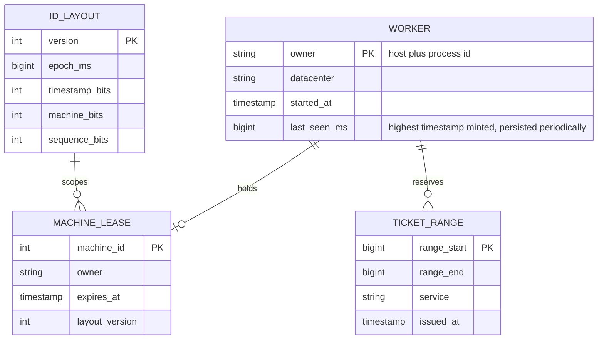
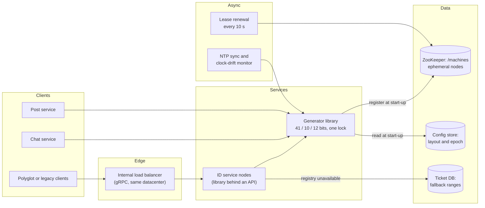
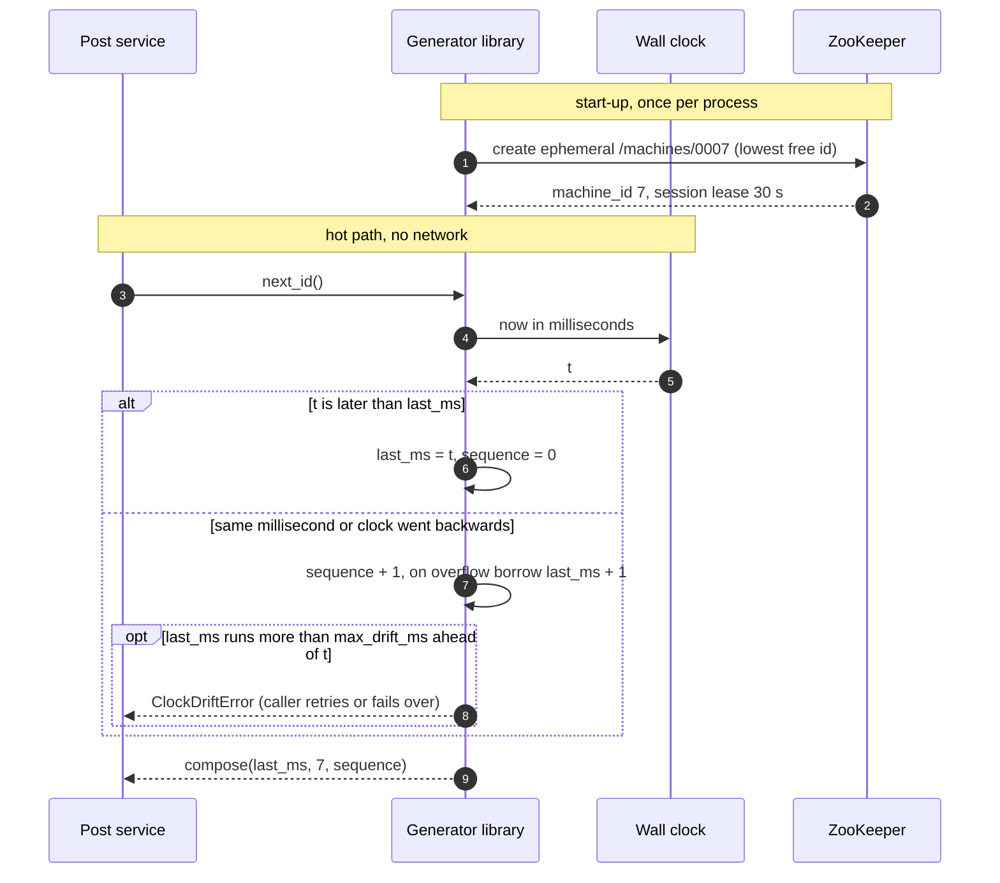
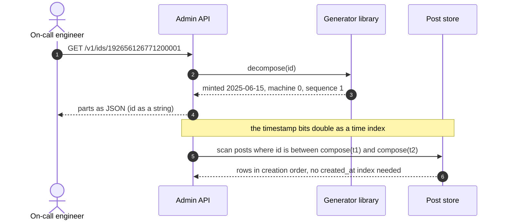
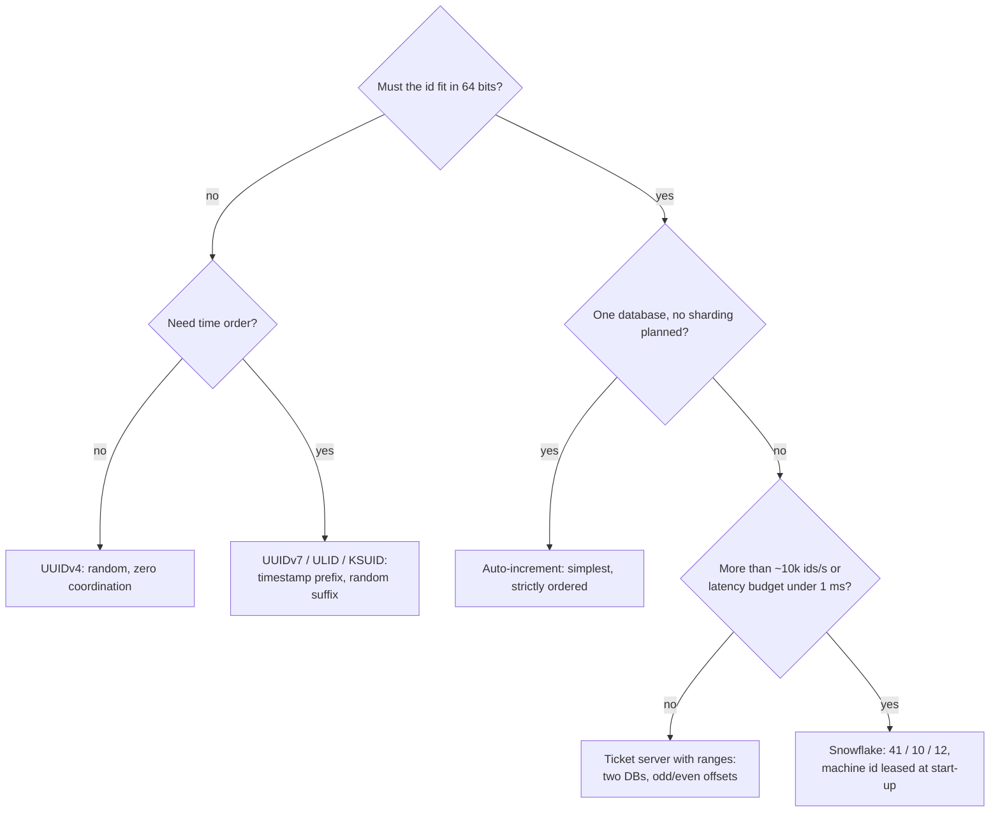
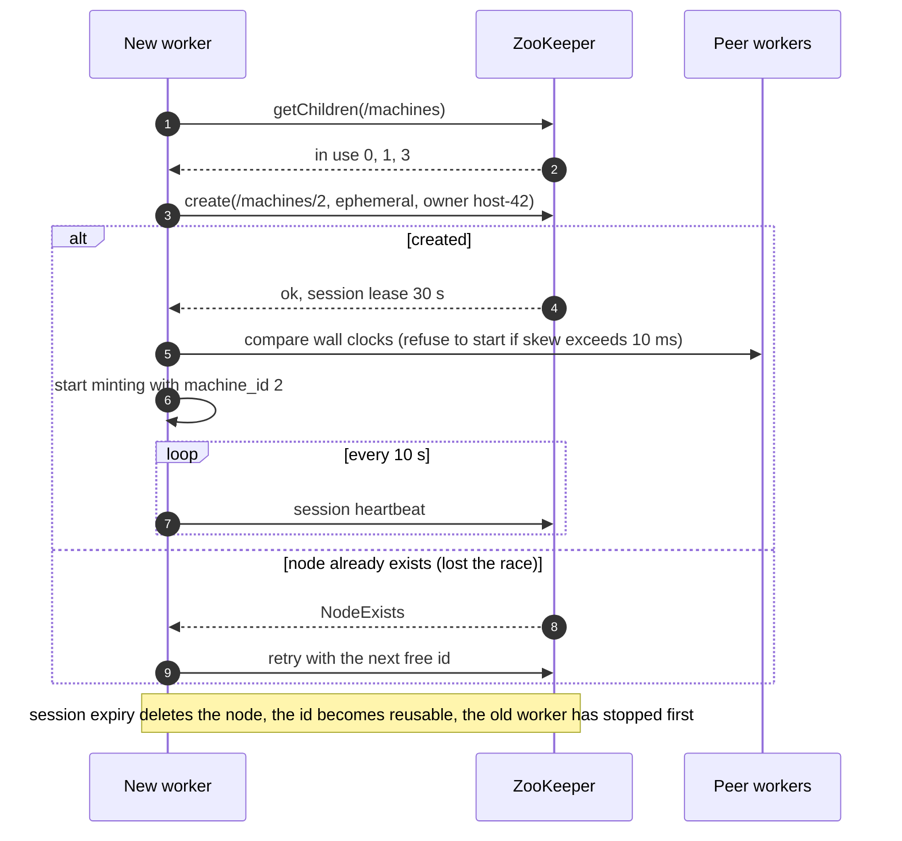
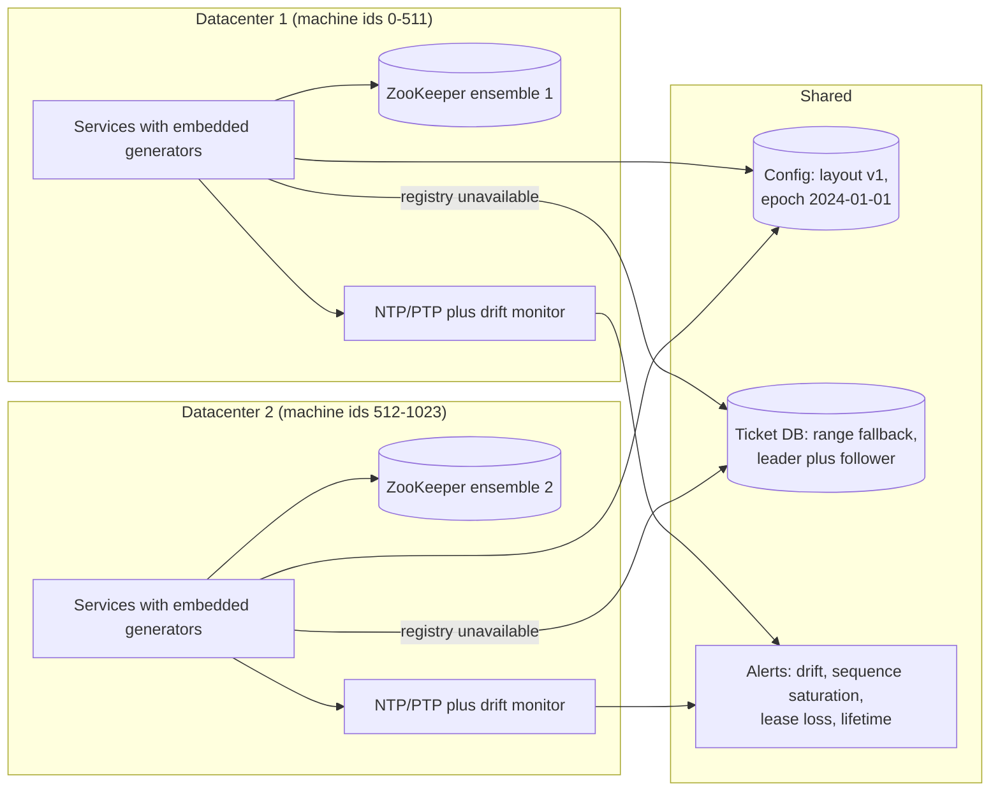

# Design a distributed unique ID generator

## TL;DR

- The ask is **64-bit, unique, roughly time-ordered ids at ~100k/s**, minted by hundreds of processes without talking to each other. The answer is a Snowflake layout: 41 bits of milliseconds since a custom epoch, 10 of machine id, 12 of per-millisecond sequence.
- Coordination happens **once per process start** — lease a machine id from ZooKeeper — never per id. Minting is a lock, a clock read and two shifts, under a microsecond.
- The cruxes an interviewer probes: (1) why 64 bits and why k-sortable, (2) UUID vs auto-increment vs ticket server vs Snowflake, (3) **what happens when the clock goes backwards**, (4) machine-id assignment and sequence overflow, (5) when a 128-bit ULID, KSUID or UUIDv7 wins.

## Problem statement and clarifying questions

"Design a service that hands out unique ids for posts, messages and orders across our fleet. Ids must fit in a `bigint`, sort roughly by creation time, and never collide — even during failovers and clock trouble." The answers decide whether you can avoid a central sequencer at all.

| Question | Assumption taken |
|---|---|
| Must ids be numeric and 64-bit? | Yes: they are primary keys everywhere, and 128-bit keys double every index. |
| Strictly ordered or roughly ordered? | Roughly (k-sortable): later ids are larger, except within a few ms across machines. |
| Throughput? | ~100k ids/s platform-wide at peak; a hot service may need 4k/ms briefly. |
| Latency budget? | In-process minting under 1 ms p99; a network call only for polyglot clients. |
| Fleet size? | Up to ~1,000 minting processes across two or three datacenters. |
| May ids leak information? | Creation time and machine are fine internally, not for public tokens (deep dive 5). |
| Coordination allowed? | At start-up yes, on the hot path no — a coordinator outage must not stop minting. |
| Lifetime? | Decades: the layout must not run out of timestamp bits in our lifetime. |
| Multi-datacenter? | Yes, each mints independently; no cross-region call per id. |

## Requirements

### Functional

- `next_id()` returns a unique positive 64-bit integer, from a library embedded in every service plus a thin gRPC/HTTP service for clients that cannot embed it.
- Ids are k-sortable: sorting by id sorts by creation time to within clock skew.
- `decompose(id)` returns creation time, machine and sequence for debugging and time-range partitioning.
- A worker leases a machine id at start-up and releases it on shutdown or crash.

### Non-functional

- Uniqueness is absolute: no duplicate under restarts, clock steps, failovers or simultaneous starts.
- Throughput: 100k ids/s platform-wide; ~4M/s per worker (4,096 per ms); no shared counter on the hot path.
- Latency: p99 under 1 ms in-process (a mutex is ~17 ns); under 5 ms for the service form, one ~500 µs round trip plus queueing.
- Availability: 99.99% for minting — the machine-id registry, its only dependency, is off the hot path.
- Lifetime: at least 50 years of timestamps from the custom epoch.

### Out of scope

Cryptographic unguessability, short human-friendly codes ([URL shortener](url-shortener.md)), strict global ordering (a consensus problem), and caller-side idempotency.

## Estimation

Using the [latency and estimation tables](../../cheatsheets/latency-and-estimation.md) (a day is ~10^5 s, a year ~3 x 10^7 s, peak = 3x average):

| Quantity | Arithmetic | Result |
|---|---|---|
| Mint rate (write QPS) | posts ~5k/s + chat ~70k/s + orders, uploads, events | ~100k ids/s peak, ~35k/s average |
| Per-machine ceiling | 4,096 sequence values per ms x 1,000 ms | ~4M ids/s per machine; 1,024 machines = ~4B/s in theory |
| Read QPS (decompose, admin) | on-call and tooling only | negligible, well under 1k/s |
| Storage per year (key bytes) | 35k/s x 3 x 10^7 s = ~10^12 ids/year x 8 B | ~8 TB/year of key bytes; 16 TB with 16 B UUIDs, before indexes and replication |
| Bandwidth (service form only) | 100k/s x ~50 B per JSON envelope | ~5 MB/s = 40 Mbps; the library form sends nothing |
| Cache size (ticket-range buffer) | 1,000 clients x 1,000 pre-fetched ids x 8 B | 8 MB total — a per-client buffer, no cache tier |
| Timestamp lifetime | 2^41 ms / (3.15 x 10^10 ms per year) | ~69 years from the custom epoch |
| Coordination load | 1,024 workers x 1 lease renewal per 10 s | ~100 tiny writes/s to ZooKeeper |

Say what the table proves: **the generator stores nothing and sends nothing**; its scarce resources are bits and the correctness of a clock. That is why the conversation is about the bit budget, not servers.

## API design

| Endpoint | Request | Response | Notes |
|---|---|---|---|
| library `next_id()` | — | `int` | The primary interface; no network, no allocation. |
| `POST /v1/ids?count=100` | — | `200 {ids: ["192656126771200000", ...]}` | Ids are **strings in JSON**: JavaScript numbers lose precision above 2^53. `count` caps at 1,000. |
| `GET /v1/ids/{id}` | — | `200 {created_at, machine_id, sequence}` | Decompose for debugging; read-only and cacheable. |
| `POST /v1/ranges` | `{service, count}` | `200 {start, end}` | Ticket-server fallback: a contiguous range from a database counter, only when a worker cannot lease a machine id. |
| `GET /v1/machines` | — | `200 {leases: [{machine_id, owner, expires_at}]}` | Admin view of the registry. |

Idempotency is deliberately absent: ids are fungible, so a retried `POST /v1/ids` burns a few, which beats deduplicating. `count` bounds every response, so no pagination.

## Data model

**The registry and the fallback counter are the only persistent state; the generator never stores ids.**



Store choices, one sentence each:

- **MACHINE_LEASE**: ephemeral nodes in ZooKeeper or leases in etcd — consensus-backed with session expiry, because the property you need is "exactly one live owner per id". Size is irrelevant, linearizability is everything.
- **ID_LAYOUT**: the config store, versioned and read once at start-up. Every worker pins the version it minted with; a layout change is a deliberate migration, never a rolling config push.
- **TICKET_RANGE**: one row per range in a single-leader database (`UPDATE counter SET next = next + 1000 RETURNING next`) — the fallback path, so its ~5k-20k writes/s ceiling does not matter.
- **WORKER.last_seen_ms**: persisted every second so a restarted worker refuses to mint until the wall clock passes the last timestamp it issued (deep dive 3).

## High-level design

**v1: a library embedded in every service, a thin ID service for polyglot clients, ZooKeeper off the hot path.**



**Write path (minting): one registration per process, then ids with no network call.**



**Read path: the same bits serve debugging and time-range queries.**



Walk-through: leasing a machine id — the one consensus-backed operation — happens once per process start and is amortised over millions of ids. Every id after that is a mutex, a clock read and integer arithmetic, so throughput is bounded by the sequence bits, not by a server. The read path shows the payoff of time in the high bits: a primary-key range scan *is* a time-range query.

## Deep dive: the requirements and the bit budget

The probing question is "why 64 bits, and why does order matter?" **64-bit** because a `bigint` key is 8 bytes in every index where a UUID is 16; **k-sortable** because a B-tree fed ascending keys appends to the rightmost page while random keys split pages across the tree — and sorting by id then gives creation order for free.

The layout is a budget you spend deliberately:

| Field | Bits | Range | Why this many |
|---|---|---|---|
| Sign | 1 | always 0 | keeps the id positive in Java, Postgres and MySQL |
| Timestamp, ms since a custom epoch | 41 | 2^41 ms = ~69 years | 1970 would already have spent most of the budget; a 2024 epoch lasts into the 2090s |
| Machine id | 10 | 1,024 workers (Twitter split it 5 datacenter + 5 worker) | enough for a fleet; no two live workers share a value |
| Sequence | 12 | 4,096 per ms per worker | ~4M ids/s per worker, far above the ~1k-10k QPS an app server handles |

The dials to mention: 8,000 workers takes 3 bits from the sequence (13 machine bits, and 512/ms is still 500k/s per worker); a second-resolution timestamp buys 1,000x the lifetime at the cost of ordering granularity.

`compose` and `decompose` are the shifts an interviewer will ask you to write on the board:

```python title="code/hld/snowflake.py — the bit layout"
--8<-- "code/hld/snowflake.py:layout"
```

The custom epoch is a constant baked into every worker and stored in `ID_LAYOUT`; changing it changes the meaning of every existing id, so version the layout and never reinterpret old ids.

## Deep dive: UUID vs auto-increment vs ticket server vs Snowflake

Reject the simple options for concrete reasons, not by reflex:

| Option | Size | Time order | Coordination per id | Throughput | Where it breaks |
|---|---|---|---|---|---|
| UUIDv4 | 128-bit random | none | none | unlimited | 16 B keys in every index; random inserts fragment B-trees; unreadable in logs |
| DB auto-increment | 64-bit | strict | one leader write | one primary, ~5k-20k writes/s | single point of failure; failover can re-issue or skip ranges |
| Ticket server (Flickr) | 64-bit | roughly, per server | one round trip per id or range | one hot row; ranges of 1,000 lift it | odd/even offsets for availability; ranges lost on restart leave gaps |
| Snowflake | 64-bit | k-sortable to the ms | none (machine id leased at start-up) | ~4M/s per worker | clock steps, machine-id reuse, 69-year lifetime |
| UUIDv7, ULID, KSUID | 128-160-bit | ms or s | none | unlimited | 2x the key bytes; see deep dive 5 |

Snowflake wins because it is the only 64-bit option with no per-id coordination. Auto-increment is fine for a single-database product — say so — but stops being fine the day you shard, since two shards' sequences collide unless you pre-partition them with step and offset, a ticket server by another name. Ticket servers put a ~500 µs round trip and a hot row on the write path; pre-fetched ranges trade that for gaps and ids that no longer encode time.

**Choosing an id scheme: the questions in the order to ask them.**



## Deep dive: clock skew and the backwards clock

"What happens when NTP steps the clock back 200 ms on a worker that just minted 3,000 ids?" separates candidates who have run this from those who have read about it. A naive generator takes the timestamp from the wall clock and resets the sequence when it changes; after a backwards step it revisits milliseconds it already used, and its first new id duplicates one minted 200 ms ago.

Backwards steps are common — NTP steps rather than slews past its threshold, VMs jump after live migration, leap seconds are smeared differently across clouds ([time and ordering](../fundamentals/time-and-ordering.md)). Skew *between* machines is milder: it blurs cross-worker ordering but never duplicates, because the machine bits differ.

The guard has two layers. The generator keeps its own **logical millisecond**, which the wall clock can only pull forward; within one logical millisecond it increments the sequence, and on overflow it *borrows* the next millisecond rather than spinning, so a frozen clock never blocks minting. Second, the gap between logical and wall clock is bounded: beyond `max_drift_ms` the generator raises and the caller retries elsewhere. A small step is absorbed silently, a large one becomes an incident instead of a duplicate.

```python title="code/hld/snowflake.py — the generator with the drift guard"
--8<-- "code/hld/snowflake.py:generator"
```

The demo exercises a frozen clock and 3 ms and 50 ms steps:

```text
layout: 41/10/12 bits, 1024 machines, 4096 ids/ms/machine, 69 years of timestamps
registry: worker-a -> machine 0, worker-b -> machine 1, worker-a restarts -> machine 0
  id=192656126771200000 -> 2025-06-15T15:06:40.000Z machine=0 seq=0
  id=192656126771200001 -> 2025-06-15T15:06:40.000Z machine=0 seq=1
  id=192656126771200002 -> 2025-06-15T15:06:40.000Z machine=0 seq=2
burst: 5000 ids in one frozen ms -> unique=True, sorted=True, borrowed 1 ms (last id sits at +1 ms, seq 903)
clock steps back 3 ms: next id still increasing=True
clock steps back 50 ms: ClockDriftError: logical clock would be 54 ms ahead of the wall clock (limit 5 ms); refusing to mint
lease expiry: worker-a renewed, worker-b did not; after 31 s machine 1 is held by None and worker-c gets machine 1
worker-b renew -> InvalidStateError: worker-b no longer holds machine id 1; stop minting
```

The layer the code does not show is **restarts**: the logical clock lives in memory, so a process that restarts after a backwards step starts from the wall clock again. Persist the highest timestamp minted (once a second is enough) and refuse to start until the wall clock passes it. Twitter's implementation also compared clocks with its peers at start-up and refused to join if it was too far off.

## Deep dive: machine-id assignment and sequence overflow

Two live workers sharing a machine id duplicate the moment their clocks agree, so assignment must guarantee **exactly one live holder per id**:

| Option | Pros | Cons |
|---|---|---|
| Static configuration (ordinal of a stateful pod) | no dependency | a scaled or recreated fleet reuses ordinals; manual for bare metal |
| Derived from the IP address (low 10 bits) | no dependency | collisions across subnets; NAT and IPv6 make it guesswork |
| Lease from ZooKeeper or etcd | exactly-one-holder by construction; reclaimed on crash | a start-up dependency; needs fencing on lease loss |
| Row in a database | familiar | a crashed worker never releases its row without a reaper |

The lease wins: the registry is consensus-backed, the ephemeral node vanishes with the session, and the id returns to the pool. The safety rule is every lease's rule — **a worker that cannot renew must stop minting before the lease expires**, because the next owner may appear the instant it does. Lease length trades riding out a registry outage against blocking a dead worker's id.

**Registration: lowest free id, ephemeral node, heartbeat, and what happens on a lost race.**



Sequence overflow is the other half. 4,096 ids per millisecond is ~4M/s, so reaching it means a benchmark or one process minting for the whole platform. Production Snowflake spins until the next millisecond; this implementation borrows it, keeping latency flat under the same drift bound. Treat saturation as a capacity signal — add workers rather than steal machine-id bits.

```python title="code/hld/snowflake.py — the machine-id lease"
--8<-- "code/hld/snowflake.py:registry"
```

## Deep dive: ULID, KSUID and UUIDv7

Lift the 64-bit constraint — client-generated ids, offline-first apps, ids that must not reveal volume — and a timestamp-prefixed 128-bit id gives ordering with no coordination at all:

| Scheme | Bits | Time part | Random part | Text form | Notes |
|---|---|---|---|---|---|
| Snowflake | 64 | 41 bits, ms | none (machine + sequence) | 18-19 decimal digits | needs machine ids; reveals rate via the sequence |
| UUIDv7 (RFC 9562) | 128 | 48 bits, ms | 74 bits | 36-char UUID | standard; native in recent databases and languages |
| ULID | 128 | 48 bits, ms | 80 bits | 26-char Crockford base32 | lexicographically sortable as text; monotonic variant increments within a ms |
| KSUID | 160 | 32 bits, s | 128 bits | 27-char base62 | second resolution; 128 random bits make it safe to generate anywhere |

How to choose in the room: Snowflake when the key must be 8 bytes and you control the fleet; UUIDv7 when the database and drivers already support it and you want zero infrastructure; ULID or KSUID when ids are created on clients and must be unguessable. All three keep B-tree locality because the high bits are time; the cost is doubled keys everywhere, another ~8 TB/year. None sorts across machines beyond clock skew — "k-sortable" is the honest word for all of them.

## Scaling, bottlenecks and failure modes

**v2: independent minting per datacenter, datacenter bits inside the machine id, and a monitored clock.**



What breaks first, and what you do about it:

- **A hot worker saturating 4,096/ms**: the drift budget fills, `ClockDriftError` fires, and the alert says to spread minting. It is the only throughput limit here, and it is per process, so it scales with the fleet.
- **Registry outage**: existing workers mint until their leases expire (5-10 minute leases, 10 s renewals); new workers cannot register and fall back to database ranges. An ensemble per datacenter keeps the blast radius local.
- **Clock step on one worker**: absorbed up to `max_drift_ms`, beyond which the worker refuses to mint and is drained. Monitor `borrowed_ms` and the wall-versus-logical gap as first-class metrics.
- **Time-sorted keys create a hot partition** in range-partitioned stores: every insert lands in the newest range. Hash the id for partition choice, keep time order inside it ([partitioning](../fundamentals/partitioning-and-consistent-hashing.md)).
- **Cross-datacenter ordering**: ids from two regions interleave within their clock skew; true order for a stream needs a single sequencer.
- **Precision loss in clients**: a 64-bit id in a JSON number silently rounds in JavaScript, so every API returns ids as strings.
- **Lifetime**: a 2024 epoch lasts into the 2090s; an alert at 80% of the timestamp range is cheap insurance.

## Trade-offs summary

| Decision | Chosen | Alternatives | Why |
|---|---|---|---|
| Id width | 64-bit Snowflake | UUIDv4, UUIDv7/ULID/KSUID | 8-byte keys and k-sortable order; 128 bits only when coordination must be zero |
| Bit split | 41 / 10 / 12 | 41 / 13 / 10 (Instagram), second-resolution time | 1,024 workers and 4,096/ms cover a large fleet |
| Sequence overflow | borrow the next millisecond, bounded by the drift budget | spin until the next millisecond | flat latency, testable with a fake clock |
| Backwards clock | logical clock plus `max_drift_ms`, then refuse | throw immediately, sleep the skew | absorbs NTP jitter, turns a big step into an incident, never duplicates |
| Machine id | ZooKeeper/etcd lease, lowest free id | static config, IP-derived | exactly one live holder; crashed workers are reclaimed |
| Delivery | embedded library first, thin service second | service only | removes the ~500 µs round trip from the availability equation |
| Public exposure | ids as JSON strings | JSON numbers | 2^53 precision limit in JavaScript |

## Interviewer follow-ups

??? question "Why not just use UUIDv4 everywhere?"
    Three costs: 16-byte keys instead of 8 everywhere, random inserts that split B-tree pages across the whole tree, and no time order, so "latest first" needs a `created_at` index. UUIDv7 fixes the last two if 128 bits are acceptable.

??? question "What if two workers end up with the same machine id?"
    Duplicates as soon as their clocks agree on a millisecond. Prevention is the lease — ephemeral node, heartbeat, stop minting before it expires. Detection is the primary key; an alert on constraint violations catches a worker that ignored a lost lease.

??? question "How do you get past 4,096 ids per millisecond?"
    You do not try: that is ~4M/s on one process, more than any app server usefully consumes. Add workers — that is what the machine-id bits are for — or, if one process truly needs more, take bits from the machine field.

??? question "Can you make the ids strictly ordered across machines?"
    Not with independent clocks. k-sortable means "ordered to within clock skew, typically a few milliseconds". Strict global order needs one sequencer per stream, a leader with a log, capped at that leader's throughput.

??? question "What does Instagram do differently, and why?"
    Ids are minted inside each Postgres shard by a PL/pgSQL function: 41 time bits, 13 of logical shard id, 10 of per-shard sequence. The shard id in the key routes a read with no lookup table, at 1,024 ids/ms per shard.

??? question "How does this behave across two datacenters with independent clocks?"
    Split the machine bits so each datacenter owns a range and run a registry per datacenter. Uniqueness is unaffected because the machine bits differ; only cross-region order is approximate, to within the inter-region skew.

!!! tip "Interview tip"
    Open with the properties and the budget in one breath: "unique, 64-bit, k-sortable; 41 bits of milliseconds, 10 of machine, 12 of sequence, and the only coordination is leasing the machine id at start-up." Then go straight to the clock, which is where the interviewer is heading.

!!! warning "Common mistake"
    Trusting the wall clock. A generator that resets its sequence whenever the clock changes mints duplicates after the first backwards NTP step, and a restarted process forgets the last millisecond it used. Say "logical clock that never goes backwards, bounded drift, persist the high-water mark" before you are asked.

## 45-minute pacing

| Minutes | What to say and draw |
|---|---|
| 0-5 | Clarify: 64-bit, k-sortable, ~100k ids/s, no coordination on the hot path, multi-datacenter, decades of lifetime. |
| 5-9 | Estimation: 100k/s is nothing per machine (4,096/ms each); 8 TB/year of key bytes; 69 years of epoch; ~100 writes/s to ZooKeeper. |
| 9-15 | Options table: reject UUIDv4 (size, locality), auto-increment (single leader), ticket server (round trip); pick Snowflake, draw the bit table. |
| 15-24 | v1 diagram: library plus thin service; write path (register once, then lock, clock, shifts); read path (decompose, time-range scans). |
| 24-38 | Deep dives: backwards clock and drift guard, machine-id lease with fencing, sequence overflow; ULID/KSUID/UUIDv7 if 128 bits come up. |
| 38-45 | Failure modes (registry outage, hot partition from time-sorted keys, JavaScript precision) and the trade-offs table. |

## Related

- [Design a URL shortener](url-shortener.md) — turns these ids into 7-11 character base62 codes
- [Consensus and coordination](../fundamentals/consensus-and-coordination.md) — why the machine-id lease needs ZooKeeper or etcd, and what fencing means
- [Time, clocks and ordering](../fundamentals/time-and-ordering.md) — NTP, skew, and why "k-sortable" is the honest claim
- [Partitioning, sharding and consistent hashing](../fundamentals/partitioning-and-consistent-hashing.md) — hot partitions from time-ordered keys
- [Design a news feed](news-feed.md) — a consumer of time-sortable post ids
- Primary sources: Twitter Engineering, "Announcing Snowflake" (2010); RFC 9562 (UUIDv7); Instagram Engineering, "Sharding & IDs at Instagram"
