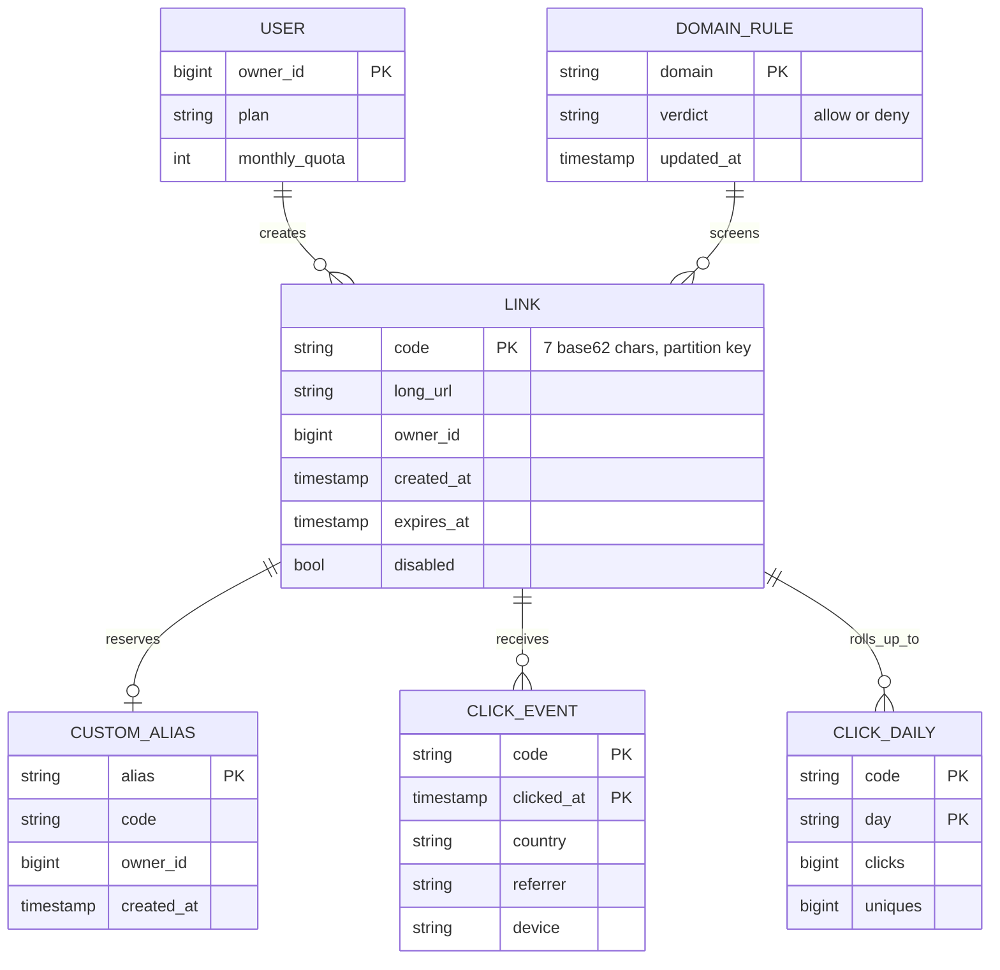
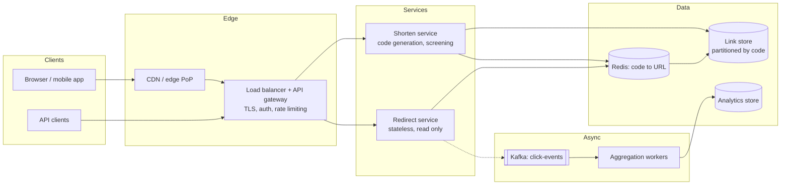
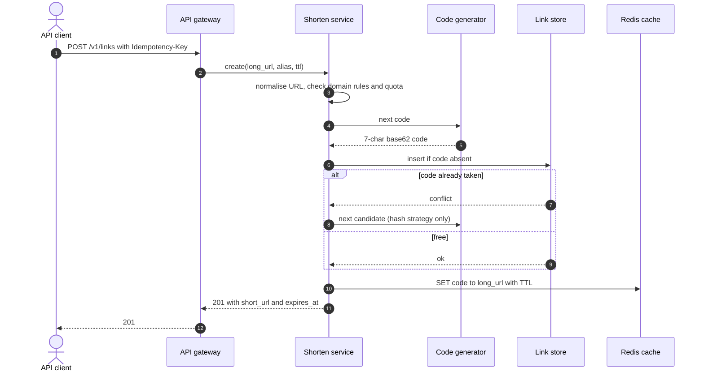
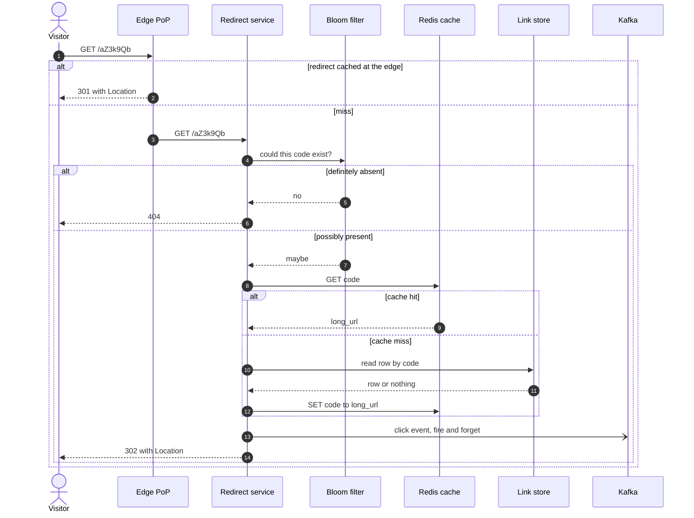
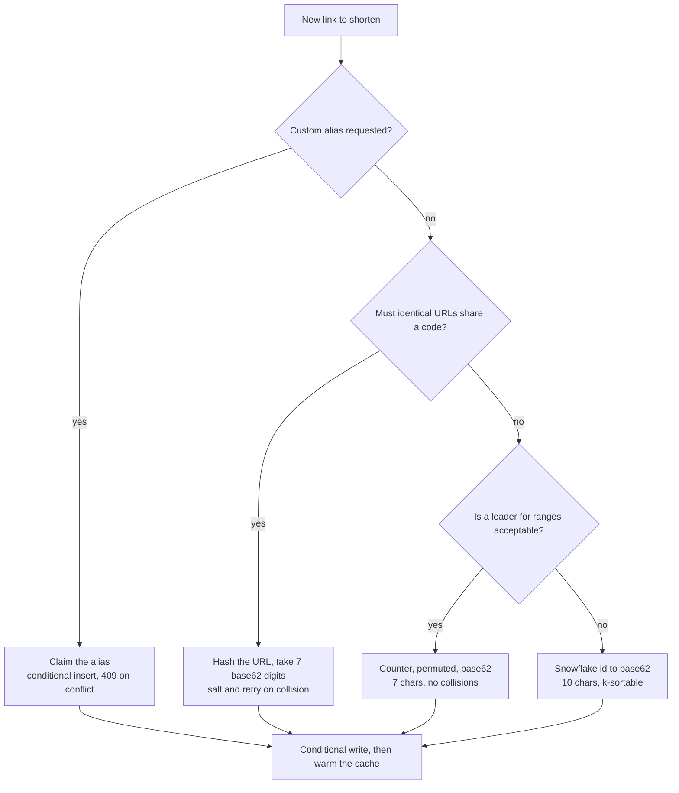
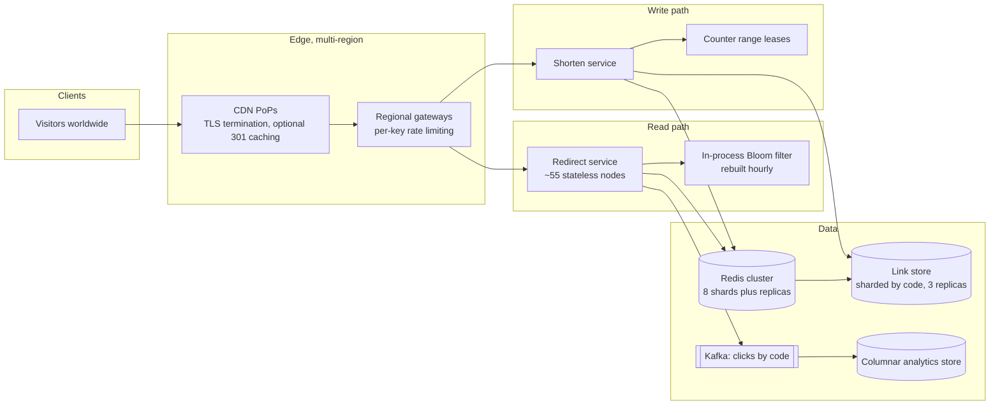

# Design a URL shortener

## TL;DR

- The canonical **read-heavy key-value problem**: ~1.2k writes/s against ~120k redirects/s, one ~500 B row per link, no joins. The effort goes into the read path and into how you mint seven characters.
- The cruxes an interviewer probes: (1) **code generation** — counter plus base62, Snowflake, or hash with retry, (2) **301 vs 302**, (3) a cache-aside read path with a **Bloom filter** in front of the misses, (4) aliases, expiry and abuse, (5) click analytics that never touch the redirect.
- It runs on a few hundred gigabytes of Redis, a wide-column link store partitioned by code, and a Kafka-fed analytics pipeline.

## Problem statement and clarifying questions

"Design a service like TinyURL or Bitly: a user submits a long URL, gets a short one, and anyone who follows it lands on the original." The interesting decisions hide in the requirements, not the topology — code length, whether identical URLs share a code, and whether analytics is the product.

| Question | Assumption taken |
|---|---|
| New links per day, retained how long? | 100M/day, kept 10 years unless an expiry is set. |
| Read-to-write ratio? | 100:1 — a link is followed about a hundred times over its life. |
| How short is short? | 7 base62 characters: fits in a tweet, readable over the phone. |
| Must the same URL map to the same code? | No. Two customers shortening one URL want separate analytics. |
| Custom aliases and expiry? | Aliases for paid accounts, first come first served; optional TTL. |
| Are codes secret? | No, but not enumerable: `code+1` must not reveal another link. |
| Click analytics? | Per day, by country and referrer; fresh within a minute. |
| Latency and availability? | Redirect p99 under 100 ms; 99.99% availability. |

## Requirements

### Functional

- `POST /links` shortens a URL and returns a 7-character code, optionally with a custom alias and a TTL.
- `GET /{code}` redirects the visitor, or returns 404 for an unknown code and 410 for an expired one.
- Owners list, disable and delete their links, and read per-day click counts by country and referrer.
- Malicious URLs are screened at creation and can be disabled retroactively.

### Non-functional

- Scale: 100M new links/day (~1.2k writes/s, ~3.5k peak), 10B redirects/day (~120k reads/s, ~360k peak), ~180 TB over ten years.
- Latency: redirect p99 under 100 ms server-side — a cache hit plus a ~500 µs round trip leaves three orders of magnitude of headroom. Creation p99 under 300 ms.
- Availability: 99.99% for redirects, 52.6 minutes a year. A dead redirect breaks every link ever printed.
- Consistency: read-your-writes for the creator, eventual for everyone else, including click counts.
- Durability: replication factor 3; never a cache-only write.

### Out of scope

Link previews, QR rendering, A/B redirect rules, and the billing system behind the paid plans.

## Estimation

Using the [latency and estimation tables](../../cheatsheets/latency-and-estimation.md): a day is ~10^5 s (multiply the QPS by 1.15 when precision matters), peak is 3x average, a link row is ~500 B.

| Quantity | Arithmetic | Result |
|---|---|---|
| Write QPS | 100M / 10^5 x 1.15 | ~1.2k/s average, ~3.5k/s peak |
| Read QPS | 1.2k/s x 100 | ~120k/s average, ~360k/s peak |
| Code space | 62^7 = 3.5 x 10^12 vs 3.65 x 10^10 links per decade | ~96 years of runway |
| Storage | 100M x 500 B = 50 GB/day, x 365 x 10 | ~180 TB; ~550 TB raw at replication factor 3 |
| Redirect bandwidth | 120k/s x 500 B of headers | ~60 MB/s = ~0.5 Gbps, ~1.5 Gbps peak |
| Cache size, 80/20 rule | 20% of 10B daily reads x 500 B | ~1 TB/day of hot *bytes* — see below |
| Cache size, distinct keys | 7 days x 100M links x 500 B | ~350 GB: ~6 nodes at 64 GB |
| Redirect nodes | 360k/s / ~10k QPS per node x 1.5 | ~55 stateless nodes |
| Redis shards | 360k/s / ~100k ops/s per instance | 4 minimum; run 8 plus replicas |

Two numbers to say out loud. **62^7 is 3.5 trillion**: seven characters buys a century of headroom, 62^6 under two years. And the 80/20 rule's terabyte a day is nonsense as a memory size — it counts reads, not distinct rows, so size the cache by working set.

## API design

| Endpoint | Request | Response | Notes |
|---|---|---|---|
| `POST /v1/links` | `{long_url, alias?, expires_at?}` + `Idempotency-Key` | `201 {code, short_url, expires_at}` | A retry with the same key returns the same code; `alias` gives `409` when taken. |
| `GET /{code}` | — | `302` with `Location`, `404`, or `410` | The only unauthenticated endpoint, and the one that decides your availability. `Cache-Control` is explicit. |
| `GET /v1/links?limit=50&cursor=...` | — | `200 {links: [...], next_cursor}` | Owner's links, newest first; the opaque cursor encodes `(created_at, code)`. |
| `DELETE /v1/links/{code}` | — | `204` | Idempotent: disables the row and evicts the cache entry. The code is never recycled. |
| `GET /v1/links/{code}/stats?from=&to=` | — | `200 {series: [{day, clicks, uniques}], by_country}` | From the daily roll-up, not raw events. |

Two contract details to state unprompted: creation is idempotent **by key, not by URL**, because two customers want separate analytics for one target; and lists are cursor-paginated, since a page number over a growing list shows duplicates.

## Data model

**One row per link, keyed by the code; clicks live in a separate append-only store and a daily roll-up.**



- **LINK**: a wide-column or key-value store (DynamoDB, Cassandra), partition key `code`, no sort key. Every read is a single-key lookup and a random-looking code spreads writes evenly — which is why the permuted counter of deep dive 1 matters for the *database*, not only for security. A global secondary index on `(owner_id, created_at)` serves the owner's list view.
- **CUSTOM_ALIAS**: a separate table keyed by `alias`, so claiming one is a conditional insert in a single partition. It points at a code rather than duplicating the URL.
- **CLICK_EVENT**: append-only, partitioned by `code`, clustered by `clicked_at`, TTL 90 days — for reprocessing, not serving. **CLICK_DAILY** is the served roll-up, small enough to cache. **DOMAIN_RULE** is replicated into every shorten-service process, refreshed every minute.

## High-level design

**v1: a stateless redirect tier in front of a cache, a shorten service that owns code generation, analytics behind a queue.**



**Write path: mint a code, claim it with a conditional write, warm the cache, acknowledge.**



**Read path: reject impossible codes, hit the cache, fall back to the store, emit the click asynchronously.**



The redirect service holds no state beyond an in-process Bloom filter, so you scale it by adding nodes. The write path is the only place needing coordination, and there it is one conditional insert. Nothing on the read path waits for analytics: a dropped click event costs a count, not a redirect.

## Deep dive: generating the short code

"Where does `aZ3k9Qb` come from, and how do you know nobody else has it?" Three real answers.

| Strategy | Length | Collisions | Coordination | Dedup | Weakness |
|---|---|---|---|---|---|
| Counter to base62 | 7 chars | Impossible | A leader hands out ranges | No | Enumerable unless permuted |
| Snowflake to base62 | 10-11 chars | Impossible | Machine id at start-up | No | Longer; leaks creation time |
| Hash of the URL | 7 chars | Certain at scale | None | Free | Writes are conditional and may retry |

Pick the **permuted counter**. Each node leases a range of a million ids from a single-leader store, so coordination costs one round trip per million links, and the counter passes through a small Feistel permutation before base62 encoding. A Feistel network is a bijection, so you keep the "collisions are impossible" property while `code+1` reveals nothing, and codes land uniformly across the keyspace, which stops the database developing a hot partition on today's writes. Reach for **hashing** when identical URLs must collapse to one row, and for **Snowflake** when the service already mints ids — see [Design a distributed unique ID generator](unique-id-generator.md).

**How the choice falls out of two questions.**



Base62 is four lines of arithmetic; base32 is what you switch to when codes must survive being read aloud.

```python title="code/hld/base62.py — the codec"
--8<-- "code/hld/base62.py:codec"
```

All three share one write path: propose a candidate, claim it conditionally, retry only when a *different* URL owns the code. That last condition is what makes hashing idempotent for free.

```python title="code/hld/base62.py — three ways to mint a code"
--8<-- "code/hld/base62.py:strategies"
```

`uv run python -m hld.base62` prints the properties you will be asked to justify:

```text
code space: 62^7 = 3,521,614,606,208 codes = ~96 years at 100M/day
base62 round trip:
                    0 -> 0000000 -> 0
                   61 -> 000000z -> 61
                   62 -> 0000010 -> 62
    3,521,614,606,207 -> zzzzzzz -> 3,521,614,606,207
counter codes: consecutive counters, unrelated codes (Feistel permutation)
  counter 1 -> AcyX2Yu   (attempts=1)
  counter 2 -> HCXEAUe   (attempts=1)
  counter 3 -> 7ICBMl4   (attempts=1)
  the permutation is reversible: unscramble(scramble(7)) = 7
snowflake codes: ['EEMl9I7Mfo', 'EEMl9I7Mfp', 'EEMl9I7Mfq'] -- 10 chars, sorted=True
hash codes deduplicate: RjsNgKl == RjsNgKl in 1 attempt
1-char code space (62 codes), 30 links: 9 needed a retry, 22 collisions, worst case 7 attempts
8 threads x 100 links: 800 distinct codes, 800 rows
```

The second-to-last line is the birthday bound made visible: 30 links in 62 codes and a third need a retry. The same effect appears at 10^11 links in a 3.5 x 10^12 space — survivable, but exactly the cost the counter avoids.

## Deep dive: 301 versus 302

"Which redirect status do you return, and what does it cost you?" It looks like trivia; it is a product decision.

| Status | Browser behaviour | Effect here |
|---|---|---|
| 301 Moved Permanently | Cached indefinitely; the second click never reaches you | Cheapest reads, but you lose the click and can never change the target |
| 302 Found | Re-requested unless `Cache-Control` says otherwise | Every click is measurable and revocable, and you pay for every click |
| 307 / 308 | Method-preserving twins of 302 / 301 | Only for non-GET short links |

Default to **302 with an explicit `Cache-Control: private, max-age=0`**. Analytics is the product, links must be revocable when a target turns out to be malware, and campaign links legitimately change destination. The cost is the entire reason the read path is engineered: 302 turns 10B clicks a day into 10B requests you serve.

Offer 301 per link where the trade pays: physical media, machine-to-machine traffic, paid tiers that opt out of analytics. The browser and CDN then absorb the repeats. The middle ground is a 302 with a 30-60 s `max-age`: a link shared to millions collapses into one origin request per client per minute, while revocation still lands within a minute. State the trade — **every second of `max-age` is a second in which a disabled link still works.**

!!! warning "Common mistake"
    Answering "301, because it is cacheable and therefore faster" and moving on. The interviewer is checking whether you noticed that caching the redirect destroys the click stream and makes revocation impossible. Name the trade, pick 302 as the default, offer 301 as an opt-in.

## Deep dive: serving 360k redirects a second

The read path has one job: turn seven characters into a `Location` header without touching a disk.

**Cache-aside on Redis.** The service reads `code`; on a miss it reads the store, writes the value back with a TTL, and returns. Traffic skews hard toward recent and viral links, so assume a 95%+ hit rate and track it as an SLI. A miss costs a ~500 µs round trip plus a single-key read, far inside the budget. Warm the cache on write, so a link that goes viral seconds after creation never sees a cold miss.

**A Bloom filter for codes that do not exist.** Scanners walk the keyspace and expired links keep receiving traffic; each such read is a guaranteed cache miss and a wasted database lookup. An in-process Bloom filter answers "definitely not present" in nanoseconds and returns 404 immediately. At a 1% false-positive rate it needs about 10 bits per key, so 10^11 links would need ~125 GB — too much for one process, which is why you filter only the live set or shard the filter alongside the cache. False positives merely fall through to the cache and false negatives cannot happen: that asymmetry is what makes the filter safe. [Probabilistic data structures](../fundamentals/probabilistic-data-structures.md) has the sizing arithmetic.

**Negative caching** finishes the job: cache the 404 for a minute so a code the filter waves through does not hit the database on every retry. Above it all sits the CDN, which terminates TLS near the visitor and takes a ~70 ms cross-region round trip out of the p99. See [Caching and CDNs](../fundamentals/caching-and-cdn.md).

!!! tip "Interview tip"
    Open with the ratio: "reads are a hundred times writes, every read is a single-key lookup, and the row never changes — so this is a cache problem with a database attached." That framing buys the minutes you want for code generation instead of schema design.

## Deep dive: aliases, expiry and abuse

**Custom aliases** are a second keyspace with the same claim mechanism: a conditional insert into `CUSTOM_ALIAS`, `409` when taken. Three rules keep them manageable. Reserve your own route names (`api`, `login`, `stats`) and a denylist of offensive strings before the first alias is claimed. Generate codes from a disjoint region of the space — a length or prefix aliases may not use — so the two can never collide. And never recycle a released alias: printed links outlive accounts.

**Expiry** is a TTL column, not a delete: the redirect service checks `expires_at` and returns 410, while a low-priority sweeper removes rows in off-peak batches. Two subtleties. The cache entry must take the *shorter* of the link TTL and the cache TTL, or an expired link keeps redirecting until the entry ages out. And a code must never be recycled, or a stale printed link silently points at a stranger's URL.

**Abuse** is the requirement candidates forget, and it is what gets a shortener blocked by browsers. Screen at creation against a domain denylist and a reputation service; re-check asynchronously afterwards, because attackers shorten a benign URL and then repoint the target; rate-limit creation per account and per IP. Disabling must be instant: set `disabled`, delete the cache key, invalidate the edges. Because the read path is cache-first, revocation is only as fast as your slowest TTL — the concrete reason the default `max-age` is seconds.

## Deep dive: click analytics off the hot path

"How do you count 10B clicks a day without slowing the redirect?" You do not count anything in the redirect: it emits an event and returns.

The redirect service produces one small event per click — code, timestamp, country from the edge, referrer, user-agent class — to a Kafka topic partitioned by `code`, without waiting for the acknowledgement. Losing a batch during a broker failover loses counts, an acceptable trade when the counter is a dashboard. If clicks are *billed*, flip it: produce synchronously with acknowledgements from all in-sync replicas and accept the added redirect latency.

Downstream, a stream job aggregates per code and per minute, then rolls minutes into days to write `CLICK_DAILY`. Consumers are idempotent per `(code, minute)` so a replay cannot double-count. Unique visitors use HyperLogLog sketches instead of stored visitor ids: a sketch per `(code, day)` is a couple of kilobytes, merges across shards, and keeps no personal data.

Two failure modes to name. A **viral link** makes one Kafka partition hot, because the partition key is the code; salt the key with a per-node suffix and merge in the aggregator. And under **backpressure** the dashboard lags while the redirect path does not — the queue absorbs the spike, and the user sees a stale number rather than a broken link.

## Scaling, bottlenecks and failure modes

**v2: multi-region edges, a sharded cache with replicas, a link store partitioned by code.**



What breaks first, and what you do:

- **A viral link becomes a hot key.** One code can carry a large share of the 360k/s, and Redis puts it on one node. Cache the top few thousand codes in an in-process LRU with a one-second TTL.
- **A Redis shard dies.** That slice falls through to the link store, whose read capacity is far lower. Keep a replica per shard and guard the fall-through with single-flight.
- **Hot partitions in the link store.** Only if codes are sequential; permuted or hashed codes spread writes by construction.
- **The counter leader is unavailable.** Nodes keep minting from the range they hold, so the outage is invisible until one exhausts a million ids. Lease the next range at 20% remaining, not at zero.
- **A region fails.** Redirects are read-only and rows are replicated cross-region, so any region serves them; creation fails over with a few seconds of write unavailability. Replication is asynchronous, so route the creator's own reads to the region that accepted the write.

## Trade-offs summary

| Decision | Chosen | Alternatives | Why |
|---|---|---|---|
| Code generation | Counter, permuted, base62 | Hash with retry, Snowflake, UUID | 7 chars, no collisions, unguessable, uniform keys |
| Code length | 7 characters | 6, 8, variable | 62^7 is ~96 years; 62^6 lasts under two |
| Redirect status | 302 with short max-age | 301, 307 | Keeps analytics and revocation; 301 is an opt-out |
| Link store | Wide-column keyed by code | Relational, Redis only | Single-key reads, no joins, linear scale-out |
| Read path | Cache-aside plus Bloom filter | Read-through only | Misses are common and must not reach the store |
| Expiry | TTL column plus lazy sweep | Immediate delete | 100M deletes/day is a batch job |
| Click counting | Async Kafka, fire and forget | Synchronous increment | The redirect never waits on analytics |

## Interviewer follow-ups

??? question "Why not use a UUID or the auto-increment id directly?"
    A UUID in base62 is 22 characters, too long for the product. A raw auto-increment id is short enough but sequential: anyone can enumerate every link, and new rows all land on one partition. The permutation fixes both without giving up the collision guarantee.

??? question "How would you turn this into a Pastebin?"
    Everything above storage is unchanged. The payload moves: a paste goes into object storage under a key derived from the code, and the row holds the object key and content type. The read path serves content through the CDN rather than a `Location` header, so here you genuinely want long-lived caching of immutable objects.

??? question "A customer says your click counts are lower than their server logs."
    Three causes, in order of likelihood: browser prefetching inflates their logs, bots are filtered from your counts, and any link served as 301 or cached at the edge produces clicks you never see. Give them the counting definition and a raw-event export.

??? question "How do you migrate to 8-character codes when the space fills?"
    Nothing needs migrating: lookups are exact-match on a variable-length key, so old codes keep working and you raise the length for new links only. Check the three places that assumed a fixed width — validation regexes, column widths, and the Bloom filter's key set.

??? question "Where is strong consistency actually required?"
    Only in claiming a code or an alias, which is a single-partition conditional write and therefore linearizable in every store. Everything else is eventually consistent.

??? question "How do you rate-limit creation without punishing bulk customers?"
    Limit per API key rather than per IP, publish the limits in `X-RateLimit-*` headers, and give paid tiers a batch endpoint that creates a thousand links against one quota charge.

??? question "What is your SLI set?"
    Redirect availability and p99 latency measured at the edge, not the origin; cache hit rate as a leading indicator; creation success rate; and analytics freshness from click to roll-up. Only the first two carry the 99.99% target.

## 45-minute pacing

| Minutes | What to say and draw |
|---|---|
| 0-5 | Clarify: 100M links/day, 100:1 reads, 7 characters, aliases and analytics yes, codes not enumerable. |
| 5-10 | Estimation: 1.2k writes/s, 120k reads/s (360k peak), 180 TB, ~350 GB working set, 62^7 is ~96 years. |
| 10-15 | API (create with idempotency key, redirect, stats) and the data model: one row keyed by code. |
| 15-22 | v1 diagram; narrate the write path (mint, conditional insert, warm cache) and the read path (filter, cache, store, event). |
| 22-35 | Deep dives: code generation with the decision tree, 301 vs 302, cache plus Bloom filter. |
| 35-41 | Aliases, expiry and abuse; click analytics with the hot-partition caveat. |
| 41-45 | Bottlenecks (hot key, shard loss, counter leader) and the trade-offs table. |

## Related

- [Design a distributed unique ID generator](unique-id-generator.md) — the Snowflake behind one code strategy
- [Caching and CDNs](../fundamentals/caching-and-cdn.md) — cache-aside, negative caching, edge TTLs
- [Probabilistic data structures](../fundamentals/probabilistic-data-structures.md) — sizing the Bloom filter
- [Back-of-envelope estimation](../fundamentals/estimation.md) — the method behind the table above
- [Partitioning, sharding and consistent hashing](../fundamentals/partitioning-and-consistent-hashing.md) — codes as partition keys
- Primary sources: RFC 9110 sections 15.4.2 and 15.4.3 (301 and 302 semantics); Bloom, "Space/time trade-offs in hash coding with allowable errors" (1970)
