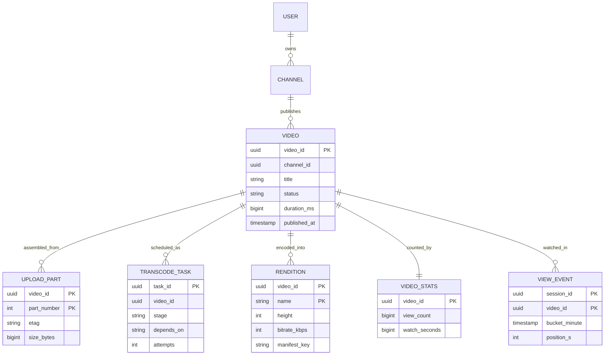
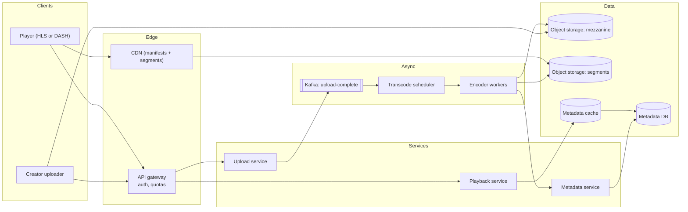
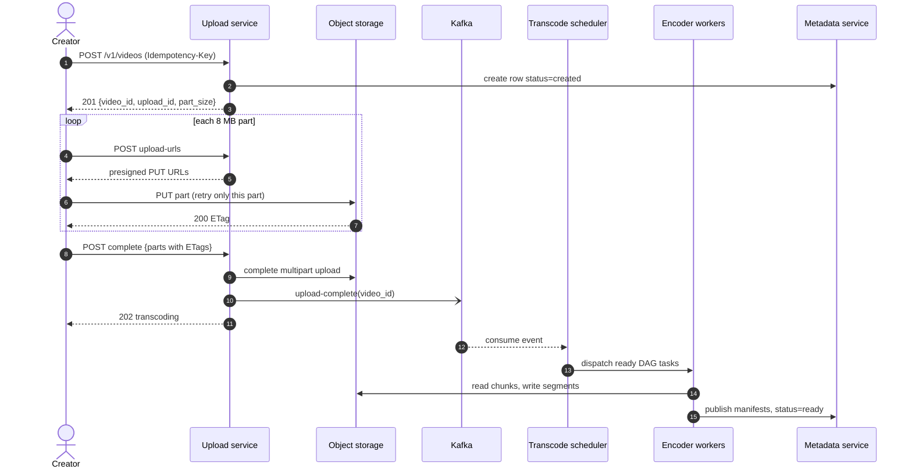
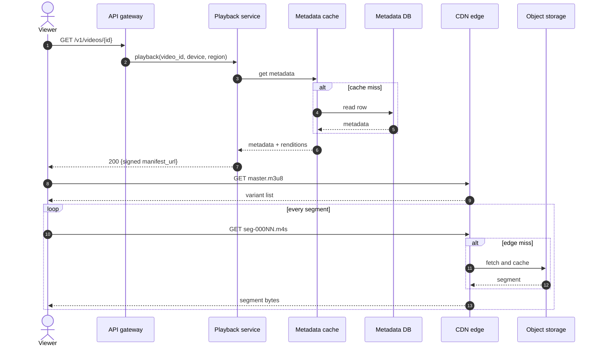
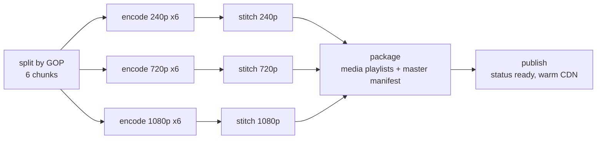
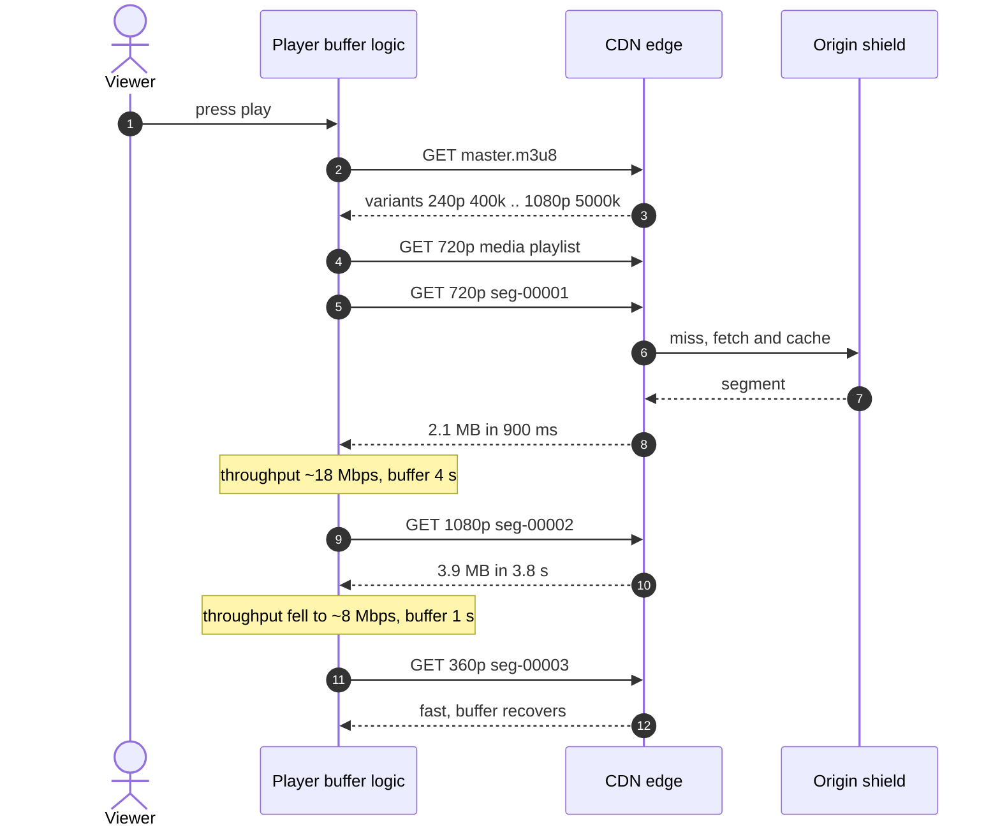
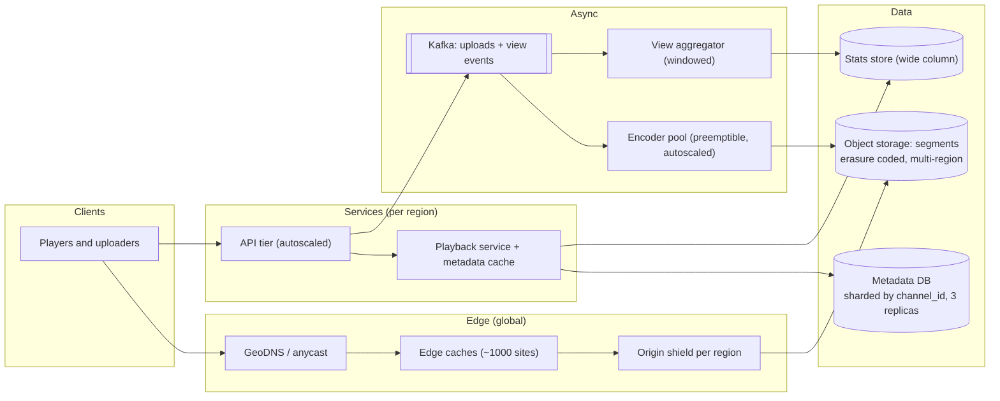

# Design YouTube or Netflix

## TL;DR

- Video on demand is **three loosely coupled systems**: an upload path that only moves bytes, an offline pipeline that turns a mezzanine file into a ladder of segments, and a playback path that is almost entirely CDN.
- The cruxes an interviewer probes: (1) **resumable multipart upload** straight to object storage, (2) the **transcoding DAG** and why segments make it parallel, (3) **adaptive bitrate** with HLS/DASH manifests, (4) **CDN strategy** for the head versus the long tail.
- Lead with the bandwidth number: ~1.5M concurrent streams at 3 Mbps is ~4.5 Tbps, which no origin serves.

## Problem statement and clarifying questions

"Design a system where creators upload videos and viewers watch them on phones, browsers and TVs." The Netflix variant swaps user uploads for a curated studio catalogue, which removes the upload spike but keeps everything else. Pin these down first.

| Question | Assumption taken |
|---|---|
| Uploads or a curated catalogue? | User uploads (YouTube); the Netflix variant is called out where it differs. |
| Scale: viewers, creators, watch time? | 100M DAU, 5M creators of whom 10% upload one video a day, 5 views and 5 watched minutes per viewer per day. |
| Average video length and source quality? | 4 minutes, 1080p at ~10 Mbps, so ~300 MB per upload. |
| Live streaming? | No. Live is a different latency tier. |
| How fast must a video be watchable after upload? | 90% playable within 10 minutes; large 4K files may take an hour. |
| Which devices and networks? | Everything from a 500 kbps phone to a 4K TV, so adaptive bitrate is mandatory. |
| Encoding budget assumption? | One CPU core encodes roughly one second of 1080p video per second, so a 4-second segment costs ~4 core-seconds. |
| Do view counts have to be exact and instant? | No. Eventually consistent within minutes. |

## Requirements

### Functional

- Upload a video of up to 10 GB, resumable across network drops.
- Transcode into a bitrate ladder and publish HLS and DASH manifests.
- Play from any device, adapting quality to the measured network.
- Browse metadata: title, channel, thumbnails, view count.
- Delete or unlist a video, and take one down on a copyright claim.

### Non-functional

- Scale: 500k uploads/day, 500M views/day, ~1.5M concurrent streams average and ~4.5M at peak.
- Playback start p99 under 1 second on a warm edge; rebuffering under 0.5% of watch time.
- Availability: 99.99% for playback (52.6 minutes a year), 99.9% for upload and transcoding, which are asynchronous and retryable.
- Durability: an accepted upload is never lost. Object storage with erasure coding; the mezzanine is kept until the ladder is verified.
- Consistency: metadata is eventually consistent, except that a creator sees their own upload and edits immediately (read-your-writes).

### Out of scope

Live streaming, recommendation ranking, ads, comments, DRM key servers, subtitle generation, peer-assisted delivery.

## Estimation

Using the [latency and estimation tables](../../cheatsheets/latency-and-estimation.md) (a day is ~10^5 s, peak is 3x average, 1 minute of 1080p is ~75 MB):

| Quantity | Arithmetic | Result |
|---|---|---|
| Uploads/day | 5M creators x 10% x 1 video | 500k/day = ~5/s, ~15/s peak |
| Raw ingest | 500k x 300 MB | 150 TB/day of mezzanine files |
| Ladder output | 5 rungs ~ 2x the 1080p rendition = ~600 MB | 300 TB/day, ~110 PB/year |
| Encode tasks | 500k x 4 min x 60 / 4 s segments x 5 rungs | 150M/day = ~1.7k/s |
| Encoder fleet | 1.7k tasks/s x 4 core-seconds | ~7k cores steady, 3x for bursts |
| View QPS (API) | 500M views / 10^5 | ~5k/s, ~15k/s peak |
| Segment GETs | 500M x 75 segments (5 min at 4 s) / 10^5 | ~375k/s, ~1.1M/s peak |
| Origin QPS | 375k/s x 5% edge miss | ~19k/s, ~56k/s peak |
| Concurrent streams | 500M x 5 min x 60 s / 10^5 | ~1.5M, ~4.5M peak |
| Egress bandwidth | 1.5M streams x 3 Mbps average rung | ~4.5 Tbps, ~13.5 Tbps peak |
| Edge cache per site | 10% of a ~550 PB catalogue over ~1,000 sites | ~55 TB: 3-6 boxes at 20 TB disk |

Two things to say out loud. **Egress is the cost model**: 4.5 Tbps cannot come from an origin, so 95%+ must be served by edges and the design question becomes what those edges hold. **Transcoding is 300x the upload rate in tasks** (5 uploads/s become 1.7k encode tasks/s), which is why it is a queue-fed DAG and never a synchronous call.

## API design

| Endpoint | Request | Response | Notes |
|---|---|---|---|
| `POST /v1/videos` | `{title, size_bytes, content_type}` + `Idempotency-Key` | `201 {video_id, upload_id, part_size}` | Row in state `created`; a retry with the same key returns the same `upload_id`. |
| `POST /v1/videos/{id}/upload-urls` | `{part_numbers: [1..N]}` | `200 {urls: [{part_number, url, expires_at}]}` | Short-lived presigned PUT URLs; bytes never touch the API tier. |
| `POST /v1/videos/{id}/complete` | `{parts: [{part_number, etag}]}` | `202 {status: "transcoding"}` | Storage validates the ETags; the transcode job is enqueued, not run. |
| `GET /v1/videos/{id}` | — | `200 {metadata, status, manifest_url, thumbnails[]}` | `status` is `transcoding`, `partial` or `ready`. Edge-cached 60 s. |
| `GET /v1/videos?channel=x&limit=20&cursor=...` | — | `200 {videos: [...], next_cursor}` | Opaque cursor over `(published_at, video_id)`; never an offset. |
| `POST /v1/views` | `{video_id, session_id, position_s}` | `204` | 30 s heartbeat, at-least-once; the aggregator deduplicates on `session_id`. |

Manifests and segments never touch this API: `manifest_url` points at the CDN with a signed, expiring query string.

## Data model

**Metadata is small and relational; segments are objects whose keys are derived by convention, not rows in a table.**



Store choices, with the one sentence to say for each:

- **Video, channel, rendition**: a relational store sharded by `channel_id` — the queries are small, joined, and read-your-writes for creators. Sort key `published_at desc` for the channel page; a global secondary index on `video_id` for direct lookups.
- **Transcode tasks**: the same store, partitioned by `video_id`, indexed on `(status, updated_at)` so the scheduler can sweep stuck tasks. The queue is Kafka; the table is the audit trail.
- **Segments and manifests**: object storage, key `videos/{video_id}/{rendition}/seg-{n:05d}.m4s`. No row per segment: 150M new segments a day is write amplification for data the manifest already indexes.
- **View events**: a wide-column store partitioned by `(video_id, bucket_minute)`, rolled up asynchronously into `VIDEO_STATS`.

## High-level design

**v1: bytes go straight to object storage, the pipeline is queue-fed, playback is CDN-first.**



**Write path: the API hands out URLs, the client moves the bytes, the pipeline runs later.**



**Read path: one metadata call, then the player talks only to the CDN.**



Walk-through: the upload service never sees a video byte, so it scales like any 1k-QPS JSON service. Kafka decouples the pipeline, so a transcoding backlog delays publication but never rejects an upload. On the read side exactly one request reaches your infrastructure per session; every megabyte after that is the CDN's problem.

## Deep dive: resumable multipart upload with presigned URLs

The probing question is "what happens when a creator's 8 GB upload dies at 90% on hotel Wi-Fi?" If bytes flow through your API tier the answer is "it starts again", and that tier also needs 150 TB/day of ingress it has no other use for.

| Approach | Ingress path | Resume granularity | Cost |
|---|---|---|---|
| Single `POST` through the API | API tier | None: restart the file | API tier sized for video bytes |
| Chunked upload through the API | API tier | One chunk | Same ingress, plus reassembly state |
| Presigned multipart direct to object storage | Client to storage | One part | API tier stays a metadata service |
| Resumable session URL | Client to storage | Byte offset | Simplest client, no parallelism |

Choose **presigned multipart**. The client asks for URLs for parts 1..N of 8 MB each, uploads them in parallel over 4-6 connections, and keeps the returned ETags. A dropped connection re-uploads one 8 MB part, not 8 GB. `complete` posts the ordered ETag list, storage assembles the object server-side, and a mismatch fails the call so the client re-uploads only the offending parts.

Three details worth volunteering. **Part size is a trade-off**: too small and you pay per-request overhead plus a huge ETag list, too large and a retry is expensive; 8-16 MB is the usual band, raised for large files so N stays in the hundreds. **Presigned URLs are capability tokens** — scope them to one key, one method and a 15-minute expiry. **Abandoned uploads leak**: an unfinished multipart upload holds storage forever, so add a lifecycle rule that aborts uploads older than 7 days.

The ETag mechanics in code are in [Design S3 (with a GFS/HDFS variant)](object-storage.md).

!!! tip "Interview tip"
    Say "the API tier never touches video bytes" in the first two minutes. It reframes the whole design: your services become small JSON services, and the hard problems move to the pipeline and the CDN where they belong.

## Deep dive: the transcoding DAG

The probing question is "a 4-minute upload has to become five renditions in under 10 minutes — how?" Encoding serially takes about as long as the video plays, times the number of rungs. Parallelism is the only lever, and it comes from **cutting the source on GOP boundaries**: every chunk starts with a keyframe, so no encoder needs a frame from another chunk.

| Structure | Latency, 4-min video | Failure blast radius | Complexity |
|---|---|---|---|
| One encode job per rendition | Minutes, serial per rung | Whole rendition restarts | Trivial |
| Segment-parallel fixed stages | Seconds to a minute | One segment retries | Needs a scheduler |
| Segment-parallel DAG with retries | Same, plus partial publication | One task dead-letters, siblings survive | Highest, and correct |

The DAG is one `split`, `segments x renditions` independent `encode` tasks, one `stitch` per rendition, one `package` writing the playlists and master manifest, and one `publish`.

**A 6-segment, 3-rung job: the wide middle is what buys the latency.**



The scheduler dispatches only tasks whose dependencies finished, retries in place (a preempted spot instance is the common failure), and dead-letters a task that exhausts its attempts, marking its descendants skipped so the run terminates instead of hanging:

```python title="code/hld/transcoding_dag.py — the scheduler"
--8<-- "code/hld/transcoding_dag.py:scheduler"
```

The demo prints the number that justifies the structure — the critical path is the floor, workers buy the rest:

```text
upload vid-42: 6 segments x 3 renditions = 24 tasks
serial cost 23.6s | critical path 4.2s: split -> encode:1080p:000 -> stitch:1080p -> package -> publish
   1 workers -> makespan  23.6s (1.0x)
   4 workers -> makespan   7.6s (3.1x)
  24 workers -> makespan   4.2s (5.6x)
  retry: encode:720p:002 attempt 1 failed (spot instance preempted)
run: 24/24 done, peak parallelism 4, ok=True
degraded run: dead letters ['encode:1080p:000']
  skipped ['package', 'publish', 'stitch:1080p']
  20 tasks still succeeded: publish the ladder that survived
```

Two production notes. **Publish the low rungs first**: encode 360p before 1080p and mark the video `partial` as soon as one rendition is packaged. **Run encodes on preemptible capacity**: a task is 4 core-seconds of pure function, so losing a machine costs one retry — exactly the property the DAG buys you.

## Deep dive: adaptive bitrate with HLS and DASH

The probing question is "the viewer walks from Wi-Fi into a lift — what does the player do?" The answer is that the server does nothing: it published a **ladder**, and the player chooses.

A master manifest lists variants with their bandwidth and resolution; each variant points to a media playlist listing 2-6 second segments. HLS and DASH differ in syntax (`.m3u8` versus MPD XML) but not in shape, and with fMP4/CMAF both point at the *same* segment files, so you encode once and package twice. Segment length is the trade-off: shorter segments switch and start faster but add per-request overhead and hurt compression, because every segment opens with an expensive keyframe. Four seconds is the usual compromise; live pushes it to two or below.

**The player measures, then switches — nothing is negotiated with the server.**



The rules a player follows, and that you should name: start at a conservative middle rung so playback begins fast; switch **down** immediately when the buffer drops below a threshold, because a rebuffer is far worse than a soft picture; switch **up** slowly, only after several segments arrive comfortably faster than real time, so one lucky segment does not start a flapping ladder. Modern players blend throughput estimates with a buffer-occupancy rule for that reason.

What this forces on your design: every rung must be **segment-aligned and keyframe-aligned**, or a mid-stream switch glitches — that alignment is a direct consequence of the GOP split above. Manifests get a 60 s TTL; segments are immutable and get a one-year TTL.

## Deep dive: CDN strategy for the head and the long tail

The probing question is "you have 4.5 Tbps of egress and a 550 PB catalogue — what does an edge site hold?" Video traffic is brutally skewed: a small fraction of titles is most of the bytes; the tail is enormous but individually cold.

| Content class | Share of bytes | Strategy | Origin load |
|---|---|---|---|
| Head: trending and new releases | Most of the traffic | Pushed to every edge before release | Zero at play time |
| Torso: steady catalogue | Moderate | Pull-through, long TTL, origin shield | Occasional |
| Tail: old or niche uploads | Small share, huge footprint | Pull-through, short TTL, evict fast | Every cold play |

Netflix's Open Connect is the extreme head strategy: appliances sit inside ISP networks and the popular catalogue is **pushed to them overnight**, when the network is idle, from per-region popularity prediction. The bytes are inside the ISP before anyone presses play, so peak-hour traffic never crosses a transit link. YouTube cannot do that for everything — 500k unpredictable uploads a day — so it pre-warms what trending signals suggest and pulls the rest.

The mechanisms to name:

- **Origin shield**: one mid-tier cache per region that all edges miss into, so a cold viral video causes one origin fetch instead of one per edge. Without it, a miss on 1,000 edges is 1,000x amplification against object storage.
- **Immutable keys and long TTLs**: segments never change, so `Cache-Control: max-age=31536000, immutable`. Re-encodes get a new key rather than an invalidation.
- **Per-rendition popularity**: a popular title's 240p rung is tiny and worth keeping everywhere; its 4K rung may only be worth caching where the devices are.
- **Tiered eviction**: LRU at the edge is fine, but pin the pre-warmed head so tail traffic cannot evict it.

The escape hatch when an edge saturates is worth saying: cap the ladder. Serving 720p instead of 1080p halves egress instantly and beats rebuffering.

!!! warning "Common mistake"
    Drawing a CDN box, saying "the CDN handles it", and moving on. The interviewer wants the cache-miss story: what happens on the first play of a video that just went viral in a region with no copy. If you cannot say "origin shield, single-flight, then pre-warm", the box is decoration.

## Scaling, bottlenecks and failure modes

**v2: regional pipelines, a tiered CDN, sharded metadata and a separate counting path.**



What breaks first, and what you do about it:

- **A viral video with no edge copy.** Thousands of edges miss at once; the origin shield plus single-flight coalescing collapses that into one origin read, and the popularity signal pushes the title into the pre-warm set within minutes.
- **Transcoding backlog** after a spike of long 4K uploads. Kafka absorbs it and the pool autoscales; the queue is priority-ordered, short videos and low rungs first, so most creators still see 10-minute publication.
- **A whole encoder region lost.** Tasks are idempotent pure functions keyed by `(video_id, rendition, segment)`, so another region replays them; the only cost is latency.
- **Hot metadata rows.** A trending video's row is read millions of times a minute. Edge-cache it for 60 s; view counts come from the stats store, not the video row, so the two hot paths do not contend.
- **View counting under load.** Heartbeats are at-least-once, so the aggregator deduplicates on `session_id` within a one-minute window. A count two minutes stale is invisible; one that double-counts retries is a bug creators will find.
- **Safety and copyright.** Uploads run a fingerprint match and a classifier before `publish` flips status to `ready`. Takedown is a metadata flip plus a CDN purge by key prefix, which is why keys are namespaced per video.
- **Cost.** Storing every rung of the tail forever is the second bill after egress. Re-encode cold titles to a cheaper codec, drop unused top rungs, archive the mezzanine once the ladder is verified.

## Trade-offs summary

| Decision | Chosen | Alternatives | Why |
|---|---|---|---|
| Upload path | Presigned multipart direct to storage | Proxy through the API tier | Keeps 150 TB/day of ingress out of your services; per-part retries |
| Transcoding | Segment-parallel DAG on preemptible workers | One job per rendition | Turns 24 s of serial work into a 4.2 s critical path; a lost machine costs one task |
| Publication | Low rungs first, status `partial` | Wait for the full ladder | Viewers start watching minutes earlier |
| Delivery format | CMAF segments, packaged as HLS and DASH | Separate encodes per format | One set of bytes, two manifests; halves storage and cache footprint |
| Segment length | 4 seconds | 2 s or 10 s | Balances start-up latency, switch speed and keyframe overhead |
| CDN | Pre-warm the head, pull the tail, shield everywhere | Pure pull, or pre-warm everything | The tail is too big to push and too cold to matter |
| Segment index | Manifest only, keys by convention | A row per segment | 150M rows a day for data the manifest already describes |

## Interviewer follow-ups

??? question "Why not transcode on the fly, per request?"
    You would encode the same popular video millions of times and the first frame would wait on an encoder. Just-in-time *packaging* (repackaging pre-encoded renditions into another container on demand) is real and worth mentioning; just-in-time *encoding* only pays for cold tail content where storing every rung costs more than the rare encode.

??? question "How do you pick the rungs of the ladder?"
    Start fixed (240p, 360p, 480p, 720p, 1080p) because it is predictable and cacheable. Then mention per-title encoding: analyse content complexity and give a cartoon a lower bitrate than a sports clip at the same resolution, saving a large fraction of bytes at equal quality. The cost is that per-title ladders are less uniform and harder to reason about.

??? question "Two uploads of the same file — do you encode it twice?"
    No. Hash the mezzanine at `complete` time; on a match, point the new `VIDEO` row at the existing renditions and skip the DAG. Re-uploads are common enough to pay for it.

??? question "How do you stop people from downloading and re-hosting the segments?"
    Signed CDN URLs with a short expiry bound to a session, plus token authentication at the edge. For paid catalogues, add DRM: segments are encrypted and the key comes from a licence server after an entitlement check. Only premium content justifies the cost.

??? question "How would this change for Netflix instead of YouTube?"
    Ingest becomes a curated pipeline with hours of budget per title, so you can afford much more expensive encodes and per-title ladders. Publication is scheduled, which makes pre-warming exact: you know a week ahead what will be popular. Upload spikes and abuse handling largely disappear.

??? question "Where would you accept eventual consistency, and where not?"
    Everywhere except three places: the multipart ETag list, the transcode task state machine (a task must not re-run as if it were a first attempt), and creator read-your-writes on their own metadata.

## 45-minute pacing

| Minutes | What to say and draw |
|---|---|
| 0-5 | Clarify: uploads not live, 100M DAU, 500k uploads/day, adaptive bitrate mandatory, 10-minute publication target. |
| 5-9 | Estimation: 150 TB/day ingest, 1.7k encode tasks/s, 375k segment GETs/s, ~4.5 Tbps egress. Say that egress drives the design. |
| 9-14 | API (create, presigned parts, complete, playback) and the data model; say "segments are objects, not rows". |
| 14-24 | v1 diagram; narrate the write path (URLs out, bytes direct, Kafka, DAG) and the read path (one metadata call, then CDN only). |
| 24-40 | Deep dives: transcoding DAG with the critical-path number, adaptive bitrate and segment alignment, CDN head versus tail with the origin shield; multipart resumability if it has not come up. |
| 40-45 | Bottlenecks (viral cold start, transcode backlog, hot rows), ladder-capping as degradation, trade-offs table. |

## Related

- [Caching and CDNs](../fundamentals/caching-and-cdn.md) — origin shield, TTLs and single-flight
- [Design S3 (with a GFS/HDFS variant)](object-storage.md) — multipart upload and erasure coding
- [Design Twitch (live streaming with live comments)](live-streaming-and-comments.md) — the same segments, seconds of latency budget
- [Batch and stream processing](../fundamentals/batch-and-stream-processing.md) — windowed aggregation for view counts
- [Messaging, queues and Kafka internals](../fundamentals/messaging-and-event-streaming.md) — how the transcode queue absorbs a backlog
- Primary sources: HLS (RFC 8216), MPEG-DASH (ISO/IEC 23009-1), Netflix Open Connect overview
