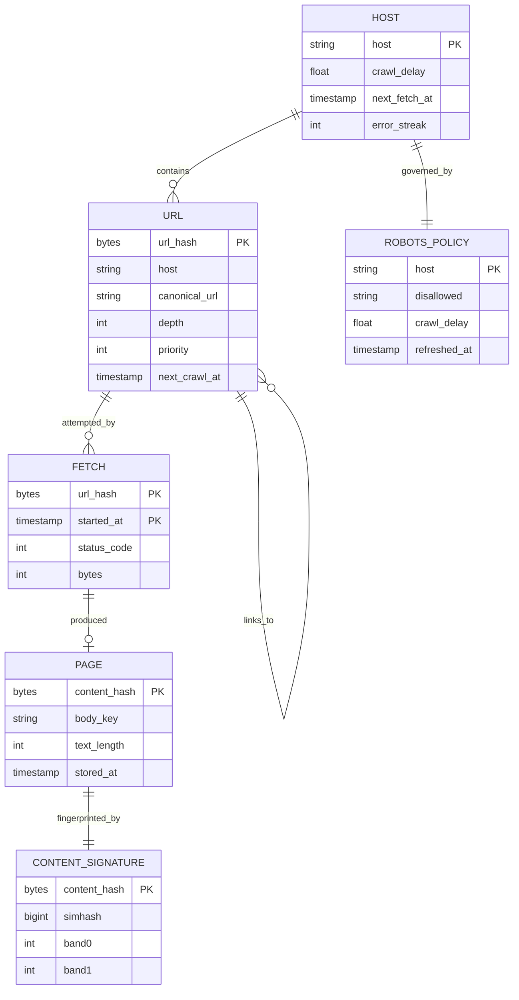
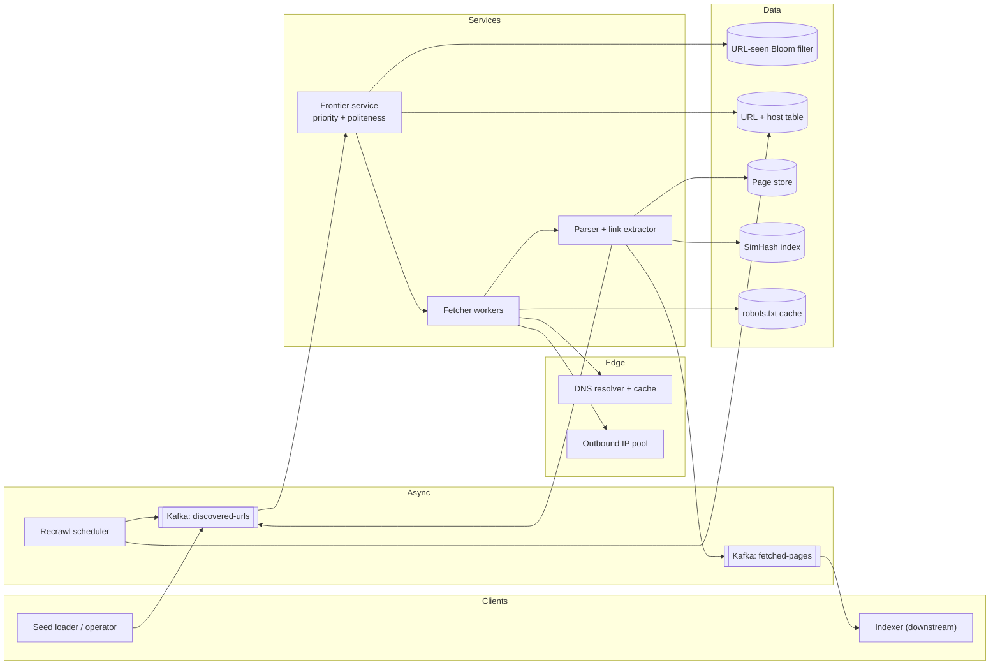
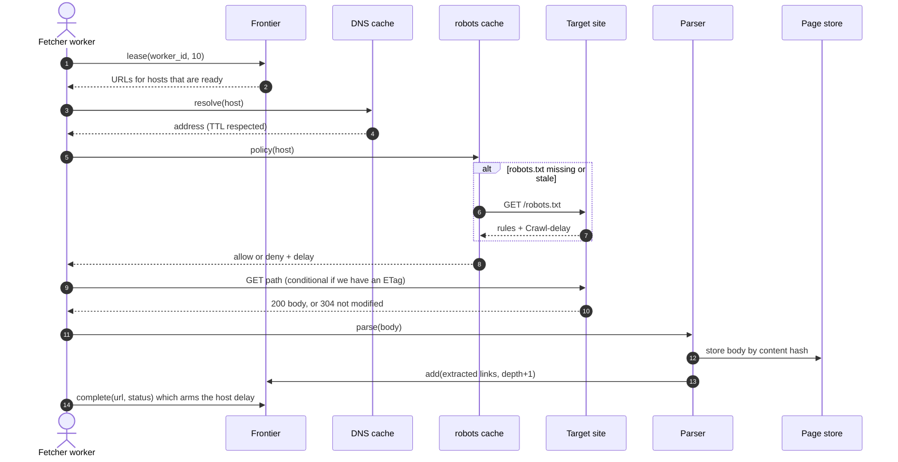
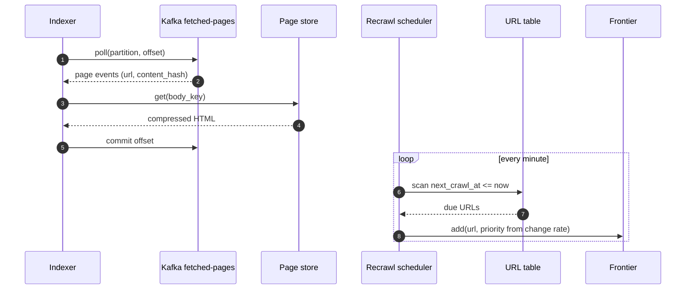
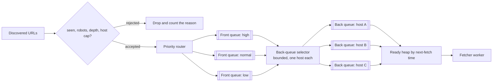
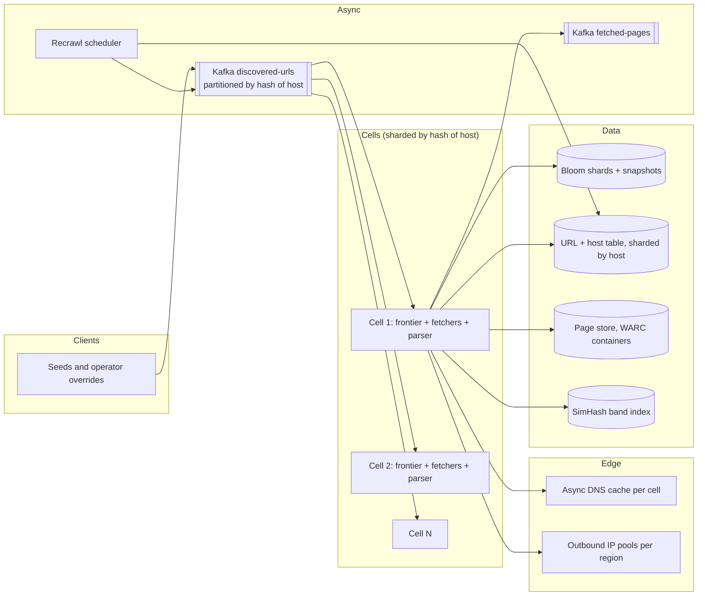

# Design a web crawler

## TL;DR

- A crawler is a **scheduling problem in a networking costume**: fetching is easy, deciding *what to fetch next without hurting anyone* is the design.
- The cruxes an interviewer probes: (1) the **URL frontier** with priority front queues and per-host back queues, (2) **two-level dedup** — a Bloom filter over canonical URLs, a SimHash over content, (3) **robots.txt, DNS and traps**, (4) **partitioning by host** and **recrawl scheduling**.
- The number that drives everything: at one request per second per host, 400 pages/s needs 400 distinct hosts in flight. Politeness is a capacity constraint, not a courtesy.

## Problem statement and clarifying questions

"Crawl the public web: start from seeds, fetch pages, extract links, store the content for an indexer, and keep coming back as pages change." The interviewer is watching whether you treat politeness and duplication as first-class or bolt them on at minute 40.

| Question | Assumption taken |
|---|---|
| Scale and time budget? | 1B pages a month, sustained, not a one-off crawl. |
| What is stored? | Raw compressed HTML plus extracted text and links; the indexer is separate. |
| Average page size and link count? | ~100 KB of HTML, ~25 KB compressed, ~100 outbound links of which ~10% are new. |
| How long does one fetch take? | ~500 ms: DNS, TCP, TLS and the request are several round trips at up to ~150 ms each. |
| Politeness policy? | One in-flight request per host and a 1 s minimum gap, or `Crawl-delay` when it is larger. |
| Do we render JavaScript? | No. HTML only; a headless-rendering tier is a follow-up. |
| How fresh must pages be? | Adaptive: minutes for news home pages, months for static archives. |
| Is content deduplication required? | Yes. Near-duplicates are most of the web. |
| Can the crawl be interrupted? | Yes, and it must resume without re-fetching what it already has. |

## Requirements

### Functional

- Accept seed URLs with a priority; discover and enqueue links found on fetched pages.
- Obey `robots.txt` per host, including `Disallow` prefixes and `Crawl-delay`.
- Fetch, store the raw body, extract links and text, and publish a page event downstream.
- Detect duplicate URLs and near-duplicate content before storing.
- Recrawl each URL on a schedule derived from how often it actually changes.

### Non-functional

- Throughput: 1B pages/month sustained, ~400 pages/s average and ~1.2k/s at peak.
- Politeness: never more than one concurrent connection per host, never faster than the host's stated delay. A hard constraint, not an SLO.
- Durability: the frontier survives a restart; a crash re-fetches at most a lease's worth of URLs.
- Availability: 99.9% is plenty — a crawler that pauses for ten minutes loses only time.
- Consistency: eventual everywhere. The one strict rule is at-most-one-worker-per-host.

### Out of scope

Ranking and index building, JavaScript rendering, spam classification, authenticated content, non-HTML media pipelines.

## Estimation

Using the [latency and estimation tables](../../cheatsheets/latency-and-estimation.md) (a month is ~2.5 x 10^6 s, peak is 3x average, a Bloom filter costs ~9.6 bits per item at a 1% false-positive rate):

| Quantity | Arithmetic | Result |
|---|---|---|
| Crawl rate | 1B / 2.5 x 10^6 s | ~400 pages/s, ~1.2k/s peak |
| In-flight fetches | 400/s x 0.5 s per fetch | ~200 sockets (Little's law) |
| Distinct hosts in flight | 400/s at 1 request/s/host | 400+ hosts, so hosts must be sharded |
| Ingress bandwidth | 400/s x 100 KB | 40 MB/s = ~320 Mbps |
| Page storage | 1B x 25 KB compressed | 25 TB/month, ~300 TB/year (x3: ~900 TB) |
| URLs discovered | 400/s x 100 links | 40k/s seen, ~4k/s new after dedup |
| URL-seen Bloom filter | 10B URLs x 9.6 bits | ~12 GB, shardable over 4-8 nodes |
| Exact URL set instead | 10B x 64 B canonical URL | ~640 GB: 50x, for a guarantee you do not need |
| SimHash index | 1B docs x 8 B x 4 bands | ~32 GB plus key overhead |
| Fetcher nodes | 200 sockets, ~1k QPS per node, x2 headroom | a handful; parsing is the CPU cost, not fetching |

Two things to say out loud. **Politeness sets your parallelism**: you cannot buy throughput with more threads, only with more distinct hosts, which is why the frontier is host-partitioned. And **the Bloom filter is the design**: 12 GB versus 640 GB for the same job, at the price of occasionally dropping a page you have never seen — which nobody will notice.

## API design

The crawler is infrastructure, but it still has an internal contract worth naming.

| Endpoint | Request | Response | Notes |
|---|---|---|---|
| `POST /v1/seeds` | `{urls: [...], priority}` + `Idempotency-Key` | `202 {accepted, rejected}` | Rejections carry a reason: seen, robots, depth, host cap. |
| `POST /v1/frontier/lease` | `{worker_id, max_urls}` | `200 {urls: [{url, host, depth, lease_expires_at}]}` | A lease, not a pop: a dead worker's URLs come back. |
| `POST /v1/frontier/complete` | `{url, status_code, fetched_at, content_hash}` | `204` | Idempotent by `url`; arms the host's next-fetch time. |
| `GET /v1/pages/{url_hash}` | — | `200 {url, fetched_at, content_hash, body_key}` | The body lives in object storage; this returns its key. |
| `GET /v1/urls?host=x&status=y&limit=100&cursor=...` | — | `200 {urls: [...], next_cursor}` | Operator view; opaque cursor over `(host, url_hash)`. |
| `PUT /v1/policies/{host}` | `{crawl_delay, disallowed[], max_urls}` | `204` | Manual override when a site operator complains. |

`lease` is the interesting one: leasing rather than popping is what makes at-most-one-worker-per-host survivable, because a dead worker's lease expires and both the URL and the host return.

## Data model

**Everything is keyed by host, because politeness, partitioning and `robots.txt` all are.**



Store choices, with the one sentence to say for each:

- **URL and HOST**: a wide-column store partitioned by `host`, clustered by `url_hash`. One shard owns a host, which makes "one worker per host" a local invariant instead of a distributed lock.
- **Frontier queues**: a partitioned log (Kafka) keyed by `hash(host)`, so every URL for a host lands in one partition and the consumer owning that partition owns that host. The in-memory front and back queues live inside that consumer; the log is the durable backing store.
- **Pages**: object storage keyed by `content_hash`, which deduplicates byte-identical pages for free. Pack them into WARC-style containers; a billion tiny objects is a metadata bill, not a design.
- **URL-seen filter**: sharded in-memory Bloom filters, snapshotted to object storage so a restart reloads instead of re-crawling.
- **SimHash index**: a key-value store keyed by `(band_index, band_value)` returning candidate content hashes.

## High-level design

**v1: a frontier in the middle, fetchers on one side, a parser and stores on the other.**



**Write path: one turn of the crawl loop, from lease to the links it discovers.**



**Read path: the indexer drains pages while the scheduler decides what to revisit.**



Walk-through: the fetcher is deliberately dumb — lease, resolve, check robots, GET, hand off. Every decision that could hurt a website lives in the frontier; every decision that costs CPU lives in the parser. The two Kafka topics make the loop restartable: `discovered-urls` is the frontier's write-ahead log, and `fetched-pages` lets the indexer fall behind without slowing the crawl.

## Deep dive: the URL frontier

The probing question is "you have ten thousand threads and one small website — what stops you taking it down?" The answer must be structural. A shared priority queue plus a "please sleep between requests" convention fails the moment two workers pop URLs for the same host.

| Design | Politeness guarantee | Priority | Weakness |
|---|---|---|---|
| One global priority queue | None; workers race for a host | Exact | Becomes a denial-of-service tool |
| Queue per host, round robin | Structural | None | Millions of queues, no importance |
| Priority queue + per-host lock | Structural if honoured | Exact | A distributed lock on the hot path |
| Mercator: front queues + per-host back queues | Structural | Approximate | Two levels to reason about |

Take **Mercator**. Front queues hold URLs by priority. A bounded number of back queues each hold URLs for exactly one host, and a min-heap of `(next_fetch_at, host)` decides who is served next. A worker pops the heap, so it is *incapable* of picking a busy host; when a back queue drains, the selector refills it from the front queues with a new host.

**Priority decides who gets a back queue; the ready heap decides who goes next.**



The whole mechanism is one class. `add` filters, `next_url` takes the host off the heap and marks it busy, `complete` re-arms it one delay later:

```python title="code/hld/crawler_frontier.py — the frontier"
--8<-- "code/hld/crawler_frontier.py:frontier"
```

Two things to volunteer. The back-queue count is bounded (roughly three per worker thread), so **priority only matters at promotion time** — high-priority URLs win the scarce back queues. And strict priority starves the low queue, so production picks the front queue by a weighted lottery; say that before the interviewer does. The demo drives the frontier with a fake clock, so the politeness gaps are visible:

```text
seeded 6: queued=3 hosts=2 rejected seen=1 robots=1 depth=1
t= 0.0  GET https://news.example/?a=1&b=2  (p3, next fetch of this host in 1.0s)
t= 0.0  GET https://shop.example/deals  (p1, next fetch of this host in 2.0s)
t= 1.0  GET https://news.example/politics  (p3, next fetch of this host in 1.0s)
t= 1.0  frontier empty
simhash same article, new footer hamming= 2 duplicate_of=https://news.example/story
simhash unrelated page           hamming=39 duplicate_of=None
```

## Deep dive: two levels of deduplication

The probing question is "the web has 10B URLs and most pages exist under several — how do you not crawl everything ten times?" Two different duplicates, two different answers.

**Have I queued this URL before?** First canonicalise: lowercase the scheme and host, drop the default port and fragment, sort query parameters, resolve the empty path to `/`. Without that step `Example.com/a?b=1&c=2` and `example.com/a?c=2&b=1` are two pages. Then ask a Bloom filter: ~12 GB at 10B URLs against ~640 GB for an exact set, and the 1% false-positive rate means occasionally skipping a page you have never seen. There are no false negatives, so the error is always in the safe direction.

**Have I already stored this content?** Byte-identical pages collapse on their content hash for free. The interesting case is *near*-duplicates: the same article under a print URL, a different navigation bar, a tracking parameter. A cryptographic hash is useless here by design. **SimHash** is not: each text shingle votes on all 64 bits, the sign of each column becomes the output bit, and similar documents land within a small Hamming distance of each other.

| Method | Finds | Cost per document | Fits when |
|---|---|---|---|
| Exact content hash | Byte-identical only | 32 B | Mirrors, re-fetches |
| Shingle set + Jaccard | Anything, exactly | Kilobytes | Offline analysis |
| MinHash signatures | Near-duplicates | ~100 B | Tunable similarity needed |
| SimHash, 64-bit | Near-duplicates within ~3 bits | 8 B | Web scale, streaming |

Comparing one page against a billion stored hashes is the obvious problem. Split the 64 bits into four 16-bit bands: by the pigeonhole principle two hashes within a Hamming distance of 3 must agree exactly on at least one band, so an index keyed by `(band_index, band_value)` turns a billion comparisons into four bucket lookups. The threshold is the knob: 3 of 64 is the classic value, and documents under a few hundred tokens are noisy enough to skip rather than mis-classify.

!!! tip "Interview tip"
    Name the two dedup layers separately and in this order: "canonicalise plus a Bloom filter for URLs, SimHash with banded lookup for content". Candidates who only mention one have usually only thought about one of the two failure modes.

## Deep dive: robots.txt, DNS and traps

The probing question is "what stops your crawler being blocked within a day?" Three defences, all cheap, all easy to forget.

**`robots.txt`.** Fetch it once per host, cache it for a day, and treat a fetch failure conservatively — a 5xx on `robots.txt` means back off, not crawl freely. Honour `Disallow` prefixes and `Crawl-delay`, taking the maximum of that delay and your own floor: you may crawl slower than a site asks, never faster. Send a real `User-Agent` with a contact URL, so an annoyed operator emails you instead of blocking your address range.

**DNS.** A resolution costs tens of milliseconds and a naive crawler does one per fetch, which makes the resolver both your bottleneck and an unwilling participant. Cache by host, honour the record TTL, and use an asynchronous resolver — the classic bug is a blocking `getaddrinfo` that serialises a whole worker pool behind one slow domain.

**Traps.** The web contains infinite spaces: calendars generating a next month forever, session IDs in paths, faceted search with every filter combination. Four bounds handle almost all of it:

- **Depth limit** from the seed, typically 4-6 hops. Content that matters is rarely deeper.
- **URL cap per host**, so one generator cannot consume the whole frontier.
- **Canonicalisation that strips junk parameters** (`utm_*`, session IDs), collapsing combinatorial explosions before the Bloom filter sees them.
- **Content-based cut-off**: if the last N pages from a host were all SimHash near-duplicates, stop expanding that subtree. This catches the traps the URL rules miss.

Add an error budget per host: after a streak of timeouts or 5xx, exponentially lengthen that host's delay and eventually park it. Hammering a host while it recovers is exactly how a crawler earns a permanent block.

!!! warning "Common mistake"
    Treating politeness as a `sleep(1)` inside the fetch loop. With N workers that is N requests per second to the same host, and the sleep does nothing except hide the bug. The guarantee has to come from the data structure: one back queue per host, popped by one worker at a time.

## Deep dive: partitioning by host and recrawl scheduling

The probing question is "how do you split this across a hundred machines without losing politeness?" Partition by `hash(host)`. Every URL for `example.com` routes to the same crawler cell, so that cell's frontier enforces one-in-flight-per-host with an in-process lock instead of a distributed one. Cells are stateless apart from their queues, which are backed by Kafka partitions, so a restart resumes from committed offsets.

Two failure modes to name. **Hot hosts**: a site with a million URLs sits in one partition and crawls at one page per second, which is 11 days. Accept it or split by subdomain where the site allows. **Rebalancing**: a consumer-group rebalance can briefly let two cells think they own a host, so `next_fetch_at` lives in the shared URL table and is checked before fetching, not only in memory.

Freshness is the other half of the job, and it is where a mediocre answer stops. A single recrawl interval is always wrong: it wastes bandwidth on archives and serves stale news. Estimate a **per-URL change rate** from that URL's own history — how often consecutive fetches produced a different content hash — and set `next_crawl_at` from it, clamped to something like 10 minutes to 90 days. Then make the recrawl cheap:

- Send `If-Modified-Since` and `If-None-Match`; a `304 Not Modified` costs one round trip and no bytes, and is a strong signal to lengthen the interval.
- Weight priority by importance as well as change rate, so a popular weekly page outranks an obscure hourly one.
- Treat sitemaps and feeds as free change notifications where hosts publish them.

## Scaling, bottlenecks and failure modes

**v2: crawler cells sharded by host, a checkpointed dedup tier and a separate recrawl loop.**



What breaks first, and what you do about it:

- **The frontier grows without bound.** 40k URLs discovered per second against 400 fetched is 100:1; even at 10% new the queue outgrows memory in hours. Front queues spill to the Kafka log with only the head resident, and the per-host cap plus depth limit bound the growth.
- **Bloom filter saturation.** A filter sized for 10B URLs behaves badly at 30B: the false-positive rate climbs and you silently stop crawling. Monitor the fill ratio and roll over to a new generation rather than letting one filter fill.
- **A worker dies mid-fetch.** Its lease expires, the URL returns to the frontier and the sweeper re-arms the host. Without leases, that host is parked forever.
- **One slow host stalls a cell.** Cap in-flight time per fetch, use an async resolver and non-blocking sockets, and give each host an error budget that lengthens its delay after failures.
- **Kafka rebalance duplicates work.** Fetches become at-least-once, which is fine because storage is keyed by content hash; the `next_fetch_at` check keeps politeness intact.
- **Trap discovered late.** A per-host near-duplicate ratio above a threshold caps that host automatically and alerts an operator.
- **Cost.** Storage, not egress: 300 TB/year of compressed HTML plus versions. Keep the latest version plus a sampled history, and let the indexer read extracted text rather than raw HTML.

## Trade-offs summary

| Decision | Chosen | Alternatives | Why |
|---|---|---|---|
| Frontier structure | Mercator front and back queues | Global priority queue, queue per host | Politeness becomes structural, not conventional |
| URL dedup | Bloom filter over canonical URLs | Exact set, database lookup | 12 GB versus 640 GB; errors land in the safe direction |
| Content dedup | 64-bit SimHash with 16-bit bands | MinHash, exact shingles | 8 B per document, four-bucket candidate lookup |
| Partitioning | By `hash(host)` | By URL hash, by depth | Keeps one-in-flight-per-host an in-process invariant |
| Dispatch | Lease with expiry | Pop from a queue | A dead worker must not park a host or lose a URL |
| Recrawl | Per-URL change-rate estimate | One fixed interval | Avoids stale news and wasted archive fetches |
| Page storage | Content-hash keys, packed containers | One object per fetch | Free byte-level dedup; no billion tiny objects |

## Interviewer follow-ups

??? question "Why a Bloom filter rather than checking the database?"
    At 40k discovered URLs per second, a database round trip per URL is 40k QPS of pure filtering, and 90% of the answers are "yes, seen". The filter answers in memory in microseconds and only the survivors touch the store, which stays the authority for anything that must be exact.

??? question "What happens when the Bloom filter says 'seen' but it never was?"
    You skip that URL forever. At 1% that is a page in a hundred, invisible against a crawl that cannot reach most of the web anyway. If it mattered, keep a second exact check for high-priority hosts only.

??? question "How do you crawl a site with a million pages politely?"
    You do not, quickly: at 1 request/s that is 11 days. Negotiate — large sites publish sitemaps, feeds or bulk exports, and some grant a known crawler a higher rate. Otherwise prioritise within the host so the important pages come first, not last.

??? question "How would you add JavaScript rendering?"
    A second tier: the parser flags pages whose content is script-generated, and those URLs go to a headless-browser pool with its own queue and much lower throughput. Never render everything — a render costs orders of magnitude more than a fetch, so spend it on a selected fraction.

??? question "How do you keep the crawl focused instead of drifting into junk?"
    Priority is a score, not a constant: seed distance, host reputation, historical content quality and inbound links all feed it, and low-scoring hosts get a small per-host cap. A topical crawler is the same idea with relevance prediction in the score.

??? question "How do you resume after a total shutdown?"
    Kafka offsets, the Bloom snapshots and the URL table. Cells reload their filter shard, resume from committed offsets, and the recrawl scheduler backfills anything whose `next_crawl_at` passed while the crawler was down. Nothing needs a full re-crawl.

## 45-minute pacing

| Minutes | What to say and draw |
|---|---|
| 0-5 | Clarify: 1B pages/month, HTML only, politeness policy, recrawl and dedup required. |
| 5-9 | Estimation: 400 pages/s, 200 in-flight fetches, 400 distinct hosts minimum, 12 GB Bloom filter. Say that politeness sets parallelism. |
| 9-14 | The internal API (lease, complete) and the host-keyed data model. |
| 14-24 | v1 diagram; narrate the crawl loop (lease, DNS, robots, GET, parse, enqueue) and the downstream drain. |
| 24-40 | Deep dives: front and back queues, the two dedup layers, robots and traps; partitioning and recrawl if time allows. |
| 40-45 | Bottlenecks (frontier growth, Bloom saturation, dead workers, hot hosts) and trade-offs. |

## Related

- [Probabilistic data structures](../fundamentals/probabilistic-data-structures.md) — the Bloom filter sizing used above
- [Design a search engine (with Twitter real-time search)](search-engine.md) — what consumes these pages
- [Messaging, queues and Kafka internals](../fundamentals/messaging-and-event-streaming.md) — partitioned logs and rebalances
- [Design a distributed job scheduler](job-scheduler.md) — leases and the sweeper pattern
- Primary sources: Heydon and Najork, "Mercator: A Scalable, Extensible Web Crawler" (1999); Manku, Jain and Das Sarma, "Detecting Near-Duplicates for Web Crawling" (2007); RFC 9309
