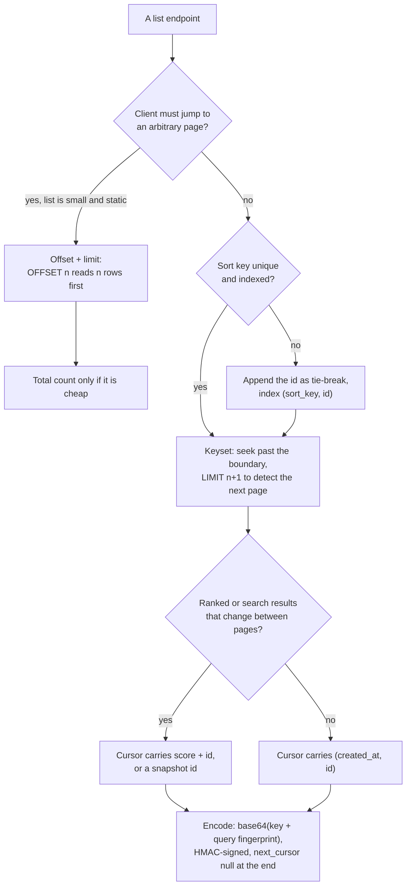
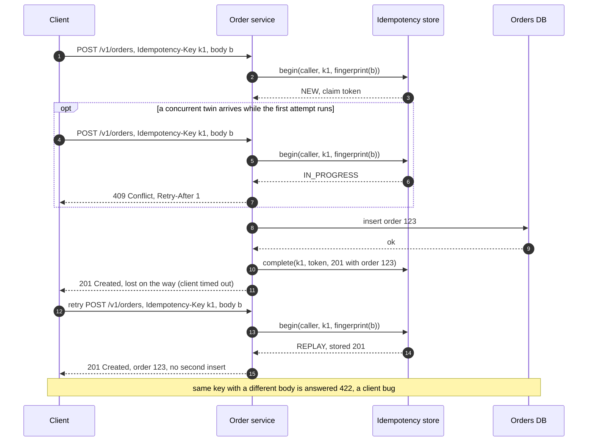
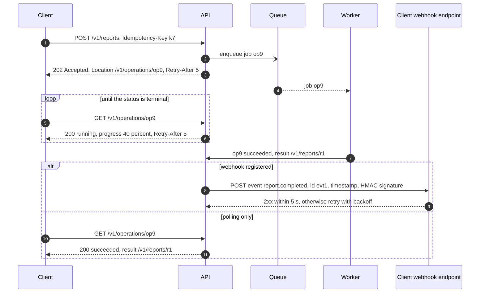

# API design for HLD rounds

## TL;DR

- Minutes 9-14 of the round fix the contract the rest of the design serves: nouns, verbs, status codes, and the two things interviewers always probe — an `Idempotency-Key` on writes and an opaque `cursor` on lists.
- Lists page by keyset behind an opaque cursor; retryable writes carry an idempotency key; errors share one envelope; a 429 says when to retry.
- Long work returns 202 and an operation to poll, or a signed webhook; gRPC inside, REST at the edge, GraphQL only where clients shape the response.

## Core concepts

The interviewer is not grading HTTP trivia. They are checking that the contract can carry the load you just estimated and survive the retries, duplicates and partial failures you will discuss in the deep dives. Write three to five endpoints in two minutes, then spend the rest on pagination, idempotency, errors and versioning.

### Resources, verbs and status codes

Model nouns, not actions: `/v1/orders`, `/v1/orders/{id}`, `/v1/orders/{id}/items`. Collections are plural, ids are opaque rather than guessable counters, nesting stops at one level, and anything that wants to be a verb becomes a sub-resource or a state change — `POST /v1/orders/{id}/cancellation`, not `POST /cancelOrder`. The verbs carry semantics the whole infrastructure understands: GET is safe and cacheable, PUT and DELETE are idempotent by definition, PATCH is a partial update, POST is neither safe nor idempotent until you make it so. Status codes are the same kind of contract: 200 read or update, 201 with a `Location` header for a creation, 202 accepted but not done, 204 deleted; 400 malformed, 401 unauthenticated, 403 forbidden, 404 missing, 409 conflicts with current state, 422 well-formed but breaks a rule, 429 rate limited; 500 your bug, 503 a dependency down. Clients, gateways and dashboards branch on these numbers, so a 200 wrapping `{"error": ...}` breaks retries, caching and alerting at once.

### Versioning: path or header

Version only to break a client: a removed or renamed field, a changed type, changed semantics. Adding optional fields is not a break, provided the contract tells clients to ignore unknown keys. A path version (`/v1/orders`) is visible in every log, cacheable by URL and routable at the gateway; a header version (`Accept: application/vnd.shop.v2+json`) keeps URLs stable and follows HTTP content negotiation, at the price of being invisible to proxies and to whoever is debugging with curl. Choose the path, run at most two major versions, and announce retirement with `Deprecation` and `Sunset` headers so clients can see the clock.

### Pagination: offset, keyset and opaque cursors

`?page=50&limit=20` becomes `OFFSET 980 LIMIT 20`: the database reads and discards 980 rows to return 20, page 5,000 reads 100,000, and a row inserted between two requests shifts everything by one, so the reader sees a duplicate or misses an item. Offset paging suits small, static lists where a client must jump to page N, and nothing else.

Keyset (seek) pagination remembers where the last page ended: `WHERE (created_at, id) < (?, ?) ORDER BY created_at DESC, id DESC LIMIT 21`. With an index on `(created_at, id)` that is one seek and 21 rows whatever the page number, and an insert after the boundary cannot move what lies before it. The sort key must be total, which is why the id joins the timestamp: several orders per millisecond would otherwise be skipped or repeated at a boundary. Fetch `limit + 1` rows; the extra row proves a next page exists without a `COUNT(*)`.

Expose the boundary as an opaque cursor: base64 of the key (`created_at|id`) plus a fingerprint of the filter and sort it belongs to, HMAC-signed so nobody edits it. Opacity lets you change the key later, stops clients from forging positions, and rejects a cursor replayed against another filter. Return `next_cursor: null` on the last page and never promise a total count on a hot path. [Design a news feed](../case-studies/news-feed.md) uses exactly this shape: `GET /v1/feed?cursor=&limit=20`.

**Choose the pagination scheme from the access pattern, then decide what the cursor carries.**



### Filtering and sorting

Filters are query parameters mapped to indexed columns: `GET /v1/orders?customer_id=42&status=shipped&sort=-created_at`. Allow sorting only on fields indexed together with the tie-break id, because a keyset page on an unindexed sort is a full scan, and reject unknown fields with a 400 that names them instead of silently ignoring them. Put the filter and sort into the cursor's fingerprint so a client cannot change the filter halfway through a walk. A search with many optional predicates may be a `POST /v1/orders/search` with a body; document that it is safe and cache it yourself.

### Idempotency keys on POST

A client that times out on `POST /v1/orders` cannot know whether the order exists; it either retries and creates a duplicate or gives up and loses the sale. The fix is a client-generated `Idempotency-Key` header, one UUID per logical operation, that the server stores with a fingerprint of the request and the response it produced. A retry with the same key and body replays the stored response; the same key with a different body is a client bug, answered 422; a key whose first attempt is still running gets 409, so two concurrent twins cannot both create. Scope keys per caller so tenants cannot collide, and expire them after a retention window, 24 hours being the common contract. PUT and DELETE need no key because their definitions make a repeat harmless. [Transactions, 2PC, sagas and idempotency](transactions-and-distributed-transactions.md) builds the store.

**A retried POST with an Idempotency-Key: a concurrent twin is refused, the lost response is replayed, nothing is created twice.**



### The error envelope

Every error has one shape, so clients write one handler: `{"error": {"code": "ORDER_NOT_CANCELLABLE", "message": "...", "details": [...], "request_id": "..."}}`, or RFC 9457's `application/problem+json` with `type`, `title`, `status` and `detail`. The stable part is the machine-readable `code`, which clients branch on; the message is for humans and may change. Include the request id so a support ticket can be traced through the logs, field-level details for validation failures, and never a stack trace or an internal hostname. Pair every code with the status it travels in.

### 429, Retry-After and X-RateLimit headers

A rejection must say so in a way that stops the retry storm: status 429, `Retry-After` in seconds, and `X-RateLimit-Limit`, `X-RateLimit-Remaining` and `X-RateLimit-Reset` on every response so well-behaved clients slow down before they are cut off. A 503 with `Retry-After` is the same contract for an overloaded backend. Clients honour the header with exponential backoff and jitter; without it, a thousand clients retrying once a second turn one breach into a sustained 1k QPS, an entire app server's worth of capacity. [Rate limiting](rate-limiting.md) covers the algorithms behind the numbers.

### Long-running operations: 202 and poll, or webhook

A request that takes longer than a client should wait — a transcode, a report, a bulk import — must not hold the connection. Return `202 Accepted` with an operation resource, `GET /v1/operations/{id}`, whose body carries a status (pending, running, succeeded, failed), progress and, on success, the result's location. The client polls at the interval you suggest in `Retry-After`, and the operation document is cheap to serve from a cache. Polling costs empty reads — 100k pending operations polled every 5 s is 20k QPS of "still running" — so for server-to-server integrations offer a webhook: the client registers a URL and you POST the completion event to it. Offer both: browsers and phones poll, partners subscribe.

**Long-running work: 202 with an operation to poll; a registered webhook replaces the polling for server-to-server clients.**



### Webhooks: retries, signatures, ordering

A webhook is your server calling theirs, so every failure mode of a client is now yours. Deliver at least once: retry with exponential backoff and jitter for hours, then park the event in a dead-letter list the customer can replay from a dashboard. Because delivery is at least once, every event carries a unique id and receivers must deduplicate, which the contract states. Sign every payload — HMAC-SHA256 over timestamp and body with a per-endpoint secret, sent in a header, verified with a constant-time comparison and a five-minute tolerance against replay. Never promise ordering across retries; carry a sequence number or the resource's version so a receiver can drop stale events, or send thin events that tell them to fetch the current state. Receivers acknowledge fast and process asynchronously.

### gRPC and protobuf

Between services, typed RPC beats hand-written JSON: the `.proto` file is the contract, generated stubs remove a class of bugs, binary payloads are smaller and cheaper to parse than JSON, and HTTP/2 brings multiplexing plus client, server and bidirectional streaming. Evolution follows protobuf's rules — add fields with new numbers and defaults, never renumber or retype, reserve removed numbers. The costs: browsers need a gRPC-Web proxy or a REST gateway, payloads are opaque to curl and proxies, and URL-based caching is gone. [Networking for system design](networking-essentials.md) prices the transport.

### GraphQL trade-offs

GraphQL hands the client a query language over a typed schema: one request fetches exactly the fields several screens need, which removes mobile round trips and over-fetching. The cost moves to the server: an unbounded query can fan out into hundreds of database calls (the N+1 problem, answered with per-request batching loaders), HTTP caching by URL stops working because everything is a POST to one endpoint, and the gateway needs depth and cost limits plus persisted queries. Choose it as an aggregation layer for client-driven UIs, not as the protocol between services.

### Gateway policies

The gateway holds the cross-cutting rules once instead of in every service: TLS termination, authentication and the caller identity it forwards, per-caller rate limits and quotas, request size and timeout caps, CORS, compression, and routing `/v1` and `/v2` to different deployments. Business rules stay out. Price the hop — one more ~500 µs round trip inside the datacenter — against changing any of those policies without a service deploy. [Load balancing, reverse proxies and API gateways](load-balancing-and-api-gateway.md) covers placement.

### Batch endpoints

When a client needs 100 orders by id, 100 GETs cost 100 round trips: 100 x 500 µs = 50 ms inside a datacenter, 100 x 70 ms = 7 s from a phone across the US. Offer `GET /v1/orders?ids=1,2,...` capped at 100 ids, or `POST /v1/orders:batchGet` when the list outgrows a URL. Batch writes return per-item results, one status and error per entry, because partial failure is the normal case and a single 400 for the whole batch forces the client to retry everything. Bound every batch and make batch writes idempotent per item.

## Trade-offs

| Style | Contract | Payload | Browsers and proxies | Caching | Streaming | Evolution | Use it for |
|---|---|---|---|---|---|---|---|
| REST + JSON | Conventions, OpenAPI optional | Text, self-describing, largest | Native everywhere, curl-debuggable | By URL at CDN, gateway, browser | SSE or chunked responses | Additive fields, path versions | Public APIs, the edge |
| gRPC + protobuf | `.proto` file, generated stubs | Binary, compact, fast to parse | Needs gRPC-Web or a gateway | None by URL | Client, server, bidirectional | Field numbers, reserved ids | Service to service |
| GraphQL | Typed schema, client picks fields | JSON shaped per query | Works, but one POST endpoint | Persisted queries only | Subscriptions over WebSocket | Deprecate fields, no versions | Client-driven UIs, aggregation |

Default to REST with JSON at the edge: every client, proxy, CDN and debugger already speaks it, GET responses cache by URL, and the conventions above make the contract predictable for people who have never read your docs. Move to gRPC between services once you have more than a handful of them and a call graph where payload size, parse cost and a typed contract pay for themselves; keep a REST or gRPC-Web gateway for anything a browser calls. Reach for GraphQL when many client screens want different shapes of the same data and the mobile team is paying in round trips — 150 ms each between California and the Netherlands — and accept that you now own a query planner, per-request batching, cost limits and a cache that no longer keys by URL. Whatever the style, the asynchronous half of the contract is the same: a 202 with an operation to poll for work that outlives a request, signed at-least-once webhooks for partners, and idempotency keys wherever a client might retry. Pick one style per boundary and say why; three styles inside one service tier is the mark of a system nobody designed.

## Python implementation

The cursor is the sort key of the last row plus a fingerprint of the query, encoded as `base64url(payload).base64url(hmac)`; `decode` rejects anything the server did not sign:

```python title="code/hld/cursor_pagination.py — opaque, signed cursor"
--8<-- "code/hld/cursor_pagination.py:cursor"
```

`OrderTable` keeps rows sorted by `(created_at, id)` with one list per customer as a composite index; `page_by_keyset` is one `bisect` and a slice of `limit + 1` rows, `page_by_offset` is the naive scan kept for comparison, and `_lock` guards the lists so pages stay consistent under concurrent inserts:

```python title="code/hld/cursor_pagination.py — keyset and offset pages"
--8<-- "code/hld/cursor_pagination.py:table"
```

`walk_keyset` and `walk_offset` page through the whole table and add up what the engine had to read; the demo inserts a row between pages:

```python title="code/hld/cursor_pagination.py — walking every page"
--8<-- "code/hld/cursor_pagination.py:walk"
```

`uv run python -m hld.cursor_pagination` prints:

```text
table: 10,000 orders, 3 per second, newest first by (created_at, id)
keyset page 1: ord-10000 .. ord-09981, 21 rows examined
  next_cursor = WzE3MDAwMDMzMjcwMDAsIm9yZC0w... (68 chars, base64url payload + HMAC tag)
a new order ord-10001 arrives before page 2 is requested
keyset page 2: ord-09980 .. ord-09961  (continues after ord-09981: no repeat, no skip)
offset page 2: ord-09981 .. ord-09962  (repeats ord-09981: every row shifted by one)
offset 9,000: 9,020 rows examined to return 20
full walk, keyset: 501 pages, 10,501 rows examined, 0 duplicates
full walk, offset: 501 pages, 2,515,001 rows examined, 0 duplicates
filter customer_id=ann: ord-10001, ord-09999, ... (21 rows examined through the per-customer index)
ann's cursor without the filter -> 400 cursor belongs to a different query
cursor with one edited character -> 400 cursor signature mismatch
page number sent as a cursor -> 400 malformed cursor
```

Both walks return the same rows, but offset examined 2,515,001 against keyset's 10,501 — about 240x — and the last three lines are the 400s a client gets for a cursor from another query, an edited cursor and a page number.

## In the interview

Write the endpoints as a table in minute nine and state the conventions once: "Resources are plural nouns under `/v1`; every write a client might retry takes an `Idempotency-Key`; every list returns an opaque keyset `next_cursor`; errors share one envelope with a machine-readable code; the gateway answers 429 with `Retry-After`." That sentence answers most follow-ups before they are asked, and the table is what you point at for the rest of the round.

Phrases that signal depth: "offset reads and discards, keyset seeks"; "the idempotency key is scoped per caller and stored with a fingerprint of the body"; "202 plus an operation resource, and a signed webhook for partners".

??? question "Why an opaque cursor rather than `?after_id=123`?"
    `after_id` works until the sort changes or the key becomes compound, and then every client breaks. An opaque cursor hides the key, carries the filter fingerprint, and is signed so nobody pages through another tenant's data by editing it.

??? question "How does the server tell a legitimate retry from a duplicate order?"
    By the `Idempotency-Key`: same key and body is a retry and replays the stored response; same key with a different body is a client bug (422); a new key is a new order. Without the header there is no way to tell, which is why it is mandatory on POST.

??? question "A webhook receiver was down for an hour. What do they see when it comes back?"
    Your retries with backoff, possibly out of order and duplicated, each with an event id and a signature. They deduplicate by id, verify the signature within the timestamp tolerance, and apply events by version or fetch the current state. Events that exhausted their retries wait in a dead-letter list for replay.

??? question "When would you put GraphQL in this design?"
    Only in front of client-facing aggregation: several screens reading different shapes of the same entities, with a mobile team paying for round trips. Then with depth and cost limits, persisted queries and batching loaders. Never between services.

??? question "How do you version a breaking change to `/v1/orders`?"
    Ship `/v2/orders` alongside, route both at the gateway, mark v1 with `Deprecation` and `Sunset` headers, measure v1 traffic per client, and remove it after the announced window. Additive changes never need a version.

!!! tip "Interview tip"
    Put `Idempotency-Key` and `cursor` in the endpoint table before anyone asks. Interviewers read the API step in seconds, and those two words tell them you have handled retries and pagination in production; their absence is the first "what if" they will reach for.

## Common mistakes

- **Verbs in URLs and 200 for everything**: `POST /getOrders` returning `200 {"error": ...}` defeats caching, retries and alerting. Fix: nouns, HTTP verbs, real status codes.
- **Offset pagination on a live list**: duplicates and skips as rows arrive, and `OFFSET 100000` reads 100,000 rows. Fix: keyset behind an opaque cursor, `limit + 1` to detect the end.
- **A raw sort key as the cursor**: `?after=2024-05-01T10:00:00Z` skips rows that share the timestamp and breaks when the sort changes. Fix: a compound key with the id, encoded and signed.
- **Retries without idempotency keys**: the client's timeout becomes a second charge or a second order. Fix: a mandatory `Idempotency-Key` on POST, stored with a fingerprint and the response.
- **Webhooks without signatures or dedup**: anyone can post a fake "payment succeeded", and retries double-apply. Fix: HMAC with a timestamp, unique event ids, at-least-once stated in the contract.

!!! warning "Common mistake"
    Holding the connection open for work that outlives a request: a 30-second transcode behind `POST /v1/videos` ties up an app-server thread per upload, times out at the load balancer, and the client retries the whole upload. Return 202 with an operation resource, suggest the poll interval with `Retry-After`, and offer a webhook for server-to-server callers.

## Self-check

??? question "What does `OFFSET 980 LIMIT 20` cost, and what replaces it?"
    The engine reads 1,000 rows and discards 980. Keyset: `WHERE (created_at, id) < (?, ?) ORDER BY created_at DESC, id DESC LIMIT 21`, one index seek whatever the page.

??? question "Why does the cursor carry the id as well as the timestamp?"
    Timestamps collide; the id makes the key total, so a boundary between two rows with the same timestamp is unambiguous and nothing is skipped or repeated.

??? question "Which status codes answer an idempotency-key retry, a twin in flight, and a key reused with a different body?"
    The stored response (usually 201) for the retry, 409 for the twin, 422 for the mismatch.

??? question "What must a 429 response carry, and why?"
    `Retry-After` plus the `X-RateLimit-*` headers, so clients back off with jitter at the time you choose instead of retrying every second and turning one breach into sustained load.

??? question "Name three properties of a production webhook."
    At-least-once delivery with backoff and a dead-letter replay, an HMAC signature over timestamp and body, and unique event ids with a version or sequence so receivers deduplicate and drop stale events.

## Related

- [Networking for system design](networking-essentials.md) — round-trip costs, HTTP/2, REST vs gRPC vs GraphQL on the wire
- [Rate limiting](rate-limiting.md) — the algorithms behind 429 and its headers
- [Transactions, 2PC, sagas and idempotency](transactions-and-distributed-transactions.md) — the idempotency store and effectively-once processing
- [Interfaces, contracts and service APIs in LLD](../../lld/fundamentals/interfaces-and-contracts.md) — the same contracts at class level
- [Load balancing, reverse proxies and API gateways](load-balancing-and-api-gateway.md) — where gateway policies run
- [Security essentials](security-essentials.md) — authentication, API keys and signed requests
- IETF RFC 9110, "HTTP Semantics" (2022) — methods, status codes, Retry-After
- IETF RFC 9457, "Problem Details for HTTP APIs" (2023)
- IETF HTTPAPI working group, "The Idempotency-Key HTTP Header Field" (Internet-Draft)
