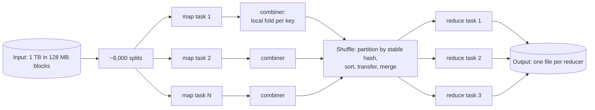
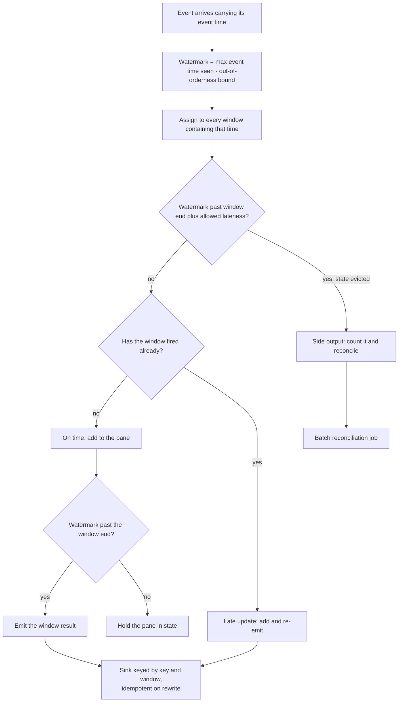
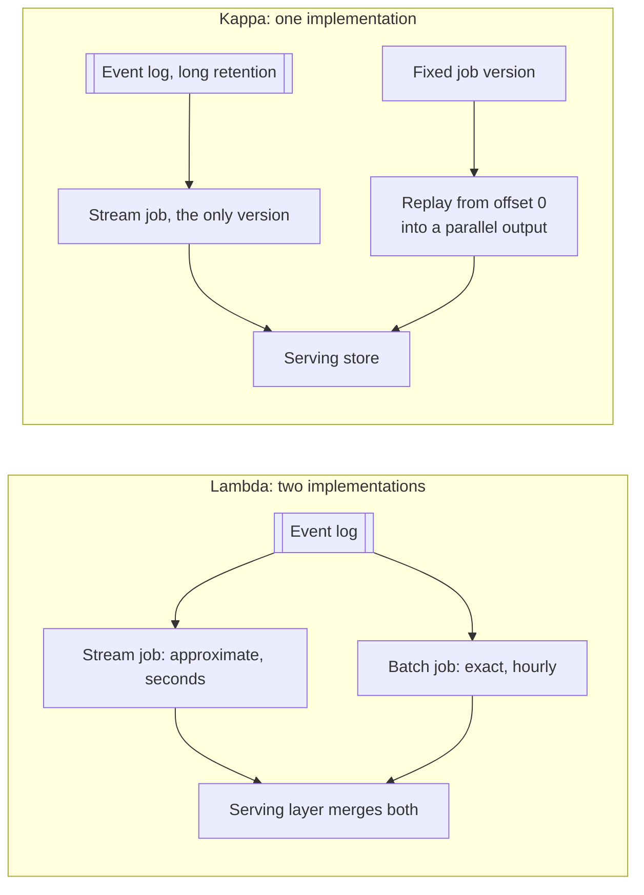

# Batch and stream processing

## TL;DR

- Batch reprocesses a bounded dataset exactly; streaming computes continuously on an unbounded one and must decide what "now" means.
- The two hard parts are the shuffle in batch and event time in streaming; almost every other detail follows from them.
- Windows plus watermarks turn an unbounded stream into finite answers, and a late-data policy decides what happens to what arrives after.
- Interviewers reach for it whenever a design says "aggregate", "count", "top-K" or "hourly report".

## Core concepts

### MapReduce: map, shuffle, reduce

MapReduce made distributed computation boring, which was the point. Input is cut into splits (one HDFS block, 128 MB) and one **map** task per split emits key-value pairs; the framework **shuffles** them so every pair with the same key reaches the same **reduce** task, sorted; each reducer folds the values for its keys. Word count is canonical: map emits `(word, 1)`, reduce sums.

A 1 TB input in 128 MB splits is ~8,000 map tasks, so 200 workers run ~40 waves and a failed or slow task costs one split, not one worker's share of the file. That is the recovery model: a map task is a pure function of its split, so a lost one is re-run and duplicate output discarded.

The shuffle is the cost. Every pair crosses the network, so the levers are the **combiner** (run the reducer inside the map task first: the demo below collapses 6,120 emitted pairs into 736, 88% less network) and the **partitioner** (which reducer owns a key). Partitioning must use a stable hash, because map tasks run in different processes and every one must route a key identically. The failure mode is reducer skew: one hot key sends its entire partition to one reducer, and that reducer defines the job's runtime.

**Splits fan out, the shuffle is the only all-to-all step, reducers fan in.**



### Spark: a DAG of stages, in memory

MapReduce writes to disk between every job, so a ten-pass algorithm reads the input ten times. Spark keeps the working set in memory and expresses a program as a DAG of transformations that it splits into **stages** at shuffle boundaries. Within a stage everything is pipelined; a stage boundary is a shuffle. The rule of thumb follows: a job with fewer shuffles is a job that finishes.

The gain is the memory-versus-disk gap: one megabyte read sequentially costs ~3 µs from memory and ~1 ms from a spinning disk, so a 1 TB pass is ~3 seconds against ~17 minutes, and iterative work multiplies that. Recovery uses lineage rather than replication: Spark remembers how each partition was derived and recomputes lost ones from their parents, which is cheap only when the DAG is short — hence checkpointing long lineages.

### Event time versus processing time

The essential streaming question is which clock you count by. **Event time** is when the thing happened, stamped by the producer; **processing time** is when your operator saw it. They diverge constantly: mobile clients buffer offline, a rebalance pauses a consumer, a backlog replays an hour of events in a minute. Count by processing time and a replay gives different numbers than the live run — one input, two answers.

The price of event time is that you never know when a window is complete. A **watermark** is the engine's declaration that no event older than `max event time seen - bound` will arrive. It is derived from the data, never from the wall clock, which is why replay is deterministic. The bound is the whole trade: 5 seconds of allowed out-of-orderness adds 5 seconds of latency to every window and still lets a phone that was offline for an hour arrive too late.

### Windows: tumbling, sliding, session

A window turns an unbounded stream into finite answers. **Tumbling** windows are fixed and non-overlapping, so each event lands in exactly one and the counts partition the stream — the default for per-minute metrics. **Sliding** windows overlap: a 5-minute window every minute puts each event in 5 panes, so state and output are 5x. **Session** windows have no fixed edges; they group events per key until a gap of inactivity closes them, which is what "one user visit" means.

Choose the smallest window that answers the question, and remember that state is per key per window: 1M active keys x 5 panes x 100 B of accumulator is 500 MB of live state before you have stored a single event.

### Late data

Events after the watermark are late, and there are exactly three things you can do. **Drop** them (cheapest, correct only if you measure how many). Keep the window open for an **allowed lateness** and re-emit a revised result, which forces the sink to be idempotent on `(key, window)`. Or route them to a **side output** for a reconciliation job. Allowed lateness is a state decision, not a correctness one: an extra hour of lateness holds every window's state an extra hour.

**One event, one verdict: on time, a late revision, or the side output.**



### State, joins, checkpointing and exactly-once

Anything beyond a filter is stateful: counters, windows, deduplication sets, join buffers. Flink and Kafka Streams keep that state local (RocksDB on the task's own disk) and make it durable with periodic **checkpoints** — a consistent snapshot of every operator's state plus the source offsets it corresponds to. On failure the job restores the snapshot and rewinds the source to those offsets, so the checkpoint interval is your recovery window: checkpoint every 30 seconds and a crash reprocesses up to 30 seconds.

That is also what "exactly-once" means, and it is worth saying precisely in the room: delivery is at-least-once, and the *effect* is once because state and offsets commit together and the sink either participates in the transaction (Kafka's transactional producer) or is idempotent on a key. Streaming joins add the state question again: a stream-stream join must buffer both sides for the join window (two hours of both streams is two hours of memory), while a stream-table join keeps the table as local state updated from a compacted topic and is far cheaper — which is why enrichment is usually modelled that way.

### Lambda versus kappa, ETL versus ELT

Lambda architecture runs a streaming path for fresh approximate answers and a batch path for exact ones, merged at serving time. It works, and it costs two implementations of the same business logic that must agree. Kappa keeps one implementation: retain the log long enough that reprocessing means replaying it into a parallel output and swapping. Kappa is the default now, with one honest exception — if the correction genuinely needs data the stream never saw (a late billing feed, a manual restatement), a reconciliation batch job is not an anti-pattern.

**Two code paths that must agree, or one code path replayed from the log.**



The same argument in the warehouse is ETL versus ELT. ETL transforms before loading, so the warehouse holds only modelled tables and a schema change means a backfill through the pipeline. ELT loads raw and transforms inside the warehouse with SQL, so raw data stays available and a fixed transformation is a re-run over data you already have. Cheap columnar storage made ELT the default; ETL survives where the transformation strips data you must not store, such as personal fields.

## Trade-offs

| Dimension | Batch (MapReduce, Spark) | Streaming (Flink, Kafka Streams) |
|---|---|---|
| Input | Bounded, complete | Unbounded, never complete |
| Latency | Minutes to hours | Milliseconds to seconds |
| Completeness | Exact: all data is present | Approximate until the watermark passes |
| Recovery | Re-run the task | Restore a checkpoint, rewind offsets |
| State | Implicit in the shuffle | Explicit, local, checkpointed |
| Reprocessing | Natural: run it again | Replay the log from an offset |
| Failure cost | A wave of tasks | Up to one checkpoint interval |
| Best at | Backfills, training sets, reports | Alerts, dashboards, counters, fraud |

Ask when the answer is needed and how exact it must be. Anything a human reads tomorrow morning is batch — do not build a streaming pipeline for a daily report. Anything driving an alert, a rate limit, a live counter or a fraud decision is streaming, and its accuracy is bounded by the watermark you chose. In between sit micro-batches (Spark Structured Streaming): seconds of latency with batch's operational simplicity, usually the right first answer when someone says "real time" but means "within a minute". Prefer one implementation: build the stream job, retain the log, replay to correct. Add a batch reconciliation path only for a known gap, as a repair job rather than a second source of truth. Windows follow the same discipline: tumbling unless the question genuinely overlaps.

## Python implementation

`make_splits` cuts the input into map tasks and `partition_of` routes keys with a stable hash, since map tasks run in separate processes and must agree on where a key belongs:

```python title="code/hld/mapreduce.py — splits, mapper and partitioner"
--8<-- "code/hld/mapreduce.py:splits"
```

`MapReduceJob.run` performs map, combine, shuffle and reduce, and runs the map phase in a process pool when asked — with identical output either way, which is what makes re-running a failed task safe:

```python title="code/hld/mapreduce.py — the job"
--8<-- "code/hld/mapreduce.py:job"
```

Running `uv run python -m hld.mapreduce`:

```text
input: 400 lines cut into 8 splits of ~50 lines
map emitted 6,120 pairs; shuffled 6,120 without a combiner, 736 with one (88% less network)
4 worker processes give the same answer: True
92 distinct words over 3 reducers: r0=33 keys r1=32 keys r2=27 keys
top 8: the=640 a=480 is=240 job=160 shuffle=160 so=160 and=120 event=120
'shuffle' -> reducer 2, 'window' -> reducer 2
one hot key added: reducer loads [2920, 1800, 1600], peak/mean=1.39 - this is reducer skew
```

`WindowAssigner` covers tumbling and sliding with one rule, so an event in a sliding window simply lands in `size / slide` panes:

```python title="code/hld/stream_windows.py — windows"
--8<-- "code/hld/stream_windows.py:windows"
```

`WindowedAggregator` derives the watermark from the largest event time seen, classifies every event against it, fires windows the watermark has passed and evicts their state when the lateness expires:

```python title="code/hld/stream_windows.py — watermark, firing and late data"
--8<-- "code/hld/stream_windows.py:aggregator"
```

Running `uv run python -m hld.stream_windows`:

```text
ad clicks, 60 s tumbling windows, 5 s out-of-orderness bound, 30 s allowed lateness
  t=   10 ad-1  watermark=    5  on_time
  t=   20 ad-2  watermark=   15  on_time
  t=   35 ad-1  watermark=   30  on_time
  t=   55 ad-1  watermark=   50  on_time
  t=   70 ad-2  watermark=   65  on_time
  fire: ad-1 [0, 60) total=3 events=3 revision=0 final=False
  fire: ad-2 [0, 60) total=1 events=1 revision=0 final=False
late event t=50 ad-1 -> late_update
  refire: ad-1 [0, 60) total=4 events=4 revision=1 final=False
t=95 ad-1 -> on_time, watermark=90
  poll: nothing ready
  window [0, 60) is now closed and evicted; open panes: 2
very late event t=45 ad-1 -> dropped
  side output holds 1 event(s), not silently discarded

sliding 300 s window every 60 s: one event at t=310 lands in 5 windows [60, 360) [120, 420) [180, 480) [240, 540) [300, 600)
the tumbling equivalent stores 1 pane: [300, 600)
```

Note the revision counter: window `[0, 60)` is written twice with different totals. Any sink behind this must be idempotent on `(key, window)` or the late update becomes a double count.

## In the interview

Introduce it when a requirement says "count" or "report": "clicks land on a partitioned log; a Flink job aggregates per-ad, per-minute windows on event time with a 5-second watermark and a minute of allowed lateness, writing to an OLAP store keyed by ad and minute so a revision overwrites rather than adds. Anything later goes to a side topic and a nightly reconciliation."

Phrases that signal depth: "the watermark is derived from the data, so a replay reproduces the run"; "exactly-once is at-least-once plus an idempotent sink"; "the shuffle is the cost, so combine before it".

??? question "Event time or processing time, and what does the choice cost?"
    Event time for anything that must be reproducible or correct: the watermark comes from the data, so a replay gives the same numbers. It costs latency (the out-of-orderness bound) and state (windows stay open). Processing time suits cheap operational monitoring only.

??? question "An event arrives an hour late. What happens?"
    Within the allowed lateness the window reopens and re-emits a revised result, so the sink must be idempotent per window. Beyond it the state is gone: side output, a metric, and a batch reconciliation. Silently dropping it is the one wrong answer.

??? question "What does exactly-once actually mean here?"
    Delivery stays at-least-once. The effect is once because operator state and source offsets commit in the same checkpoint, and the sink either joins that transaction or deduplicates on a key. Say it that way and the follow-up answers itself.

??? question "Your reduce phase has one task running ten times as long as the rest."
    Reducer skew from a hot key. Fixes in order: add a combiner; salt the key into `k` sub-keys and run a second small aggregation; or split the heavy key out. A map-side join avoids the shuffle entirely when one side is small enough to broadcast.

??? question "Lambda or kappa for a click-aggregation pipeline?"
    Kappa: one stream job, a log retained long enough to replay, reprocessing by replaying into a parallel output before swapping. Add a batch job only for a named gap, such as a late billing feed, and treat it as reconciliation rather than a second implementation.

!!! tip "Interview tip"
    Say "event time" and name a watermark bound in your first sentence about aggregation. It is the fastest way to show that a streaming count is a claim about completeness, not a number, and it sets up every follow-up about late data.

## Common mistakes

- **Counting by processing time**: numbers change on replay or when a consumer lags, and nobody can reconcile the report. Fix: event time with a watermark; processing time only for operational metrics.
- **No late-data policy**: events after the watermark vanish and the totals are quietly wrong. Fix: pick drop, allowed lateness or side output, and emit a metric either way.
- **A non-idempotent sink under revisions**: a re-emitted window adds instead of replacing, so revised counts double. Fix: key the sink by `(key, window)` and upsert.
- **Sliding windows by reflex**: a 5-minute window every 10 seconds is 30 panes per event. Fix: tumbling unless the question really overlaps.
- **Ignoring the shuffle**: several wide dependencies move the dataset across the network repeatedly. Fix: combine early, broadcast small sides, count the stage boundaries.

!!! warning "Common mistake"
    Promising "exactly-once" as though the framework provides it end to end. It holds inside the job — state and offsets commit together — and stops at the boundary: a plain HTTP call or an `INSERT` from a stream operator will happen again after a restart. Say "effectively-once: at-least-once delivery plus a transactional or idempotent sink", then name the dedup key. Candidates who skip that get taken apart on the follow-up.

## Self-check

??? question "Why does a combiner help, and when is it not allowed?"
    It applies the reduce function inside the map task, so far fewer pairs cross the network. It is valid only when the operation is associative and commutative: sum and max are fine, average is not unless you emit `(sum, count)` pairs.

??? question "What exactly is a watermark, and where does its value come from?"
    A claim that no event earlier than `max event time seen - bound` will arrive. The value comes from the data, not the clock, which is why replaying the same log produces the same windows and results.

??? question "How much state does a 5-minute window sliding every minute hold?"
    Five panes per key at once against one for the tumbling equivalent: 5x state and 5x emitted results. With 1M active keys and a 100 B accumulator that is ~500 MB live.

??? question "What is the recovery cost of a checkpoint interval?"
    On failure the job restores the last checkpoint and rewinds the source to its offsets, reprocessing up to one interval of data. Shorter intervals mean faster recovery and more overhead.

??? question "Why is kappa usually preferred over lambda?"
    Lambda implements the same business logic twice, in two engines, and any divergence shows up as two answers to one question. Kappa keeps one implementation and gets reprocessing from log replay.

## Related

- [Messaging, queues and Kafka internals](messaging-and-event-streaming.md) — the log these jobs read, offsets and delivery semantics
- [Design an ad click aggregation system](../case-studies/ad-click-aggregation.md) — windows, watermarks and dedup end to end
- [Design a metrics monitoring and alerting system](../case-studies/metrics-monitoring.md) — the same pipeline for metrics
- [Classic papers digest](classic-papers-digest.md) — the MapReduce and Kafka papers in brief
- Dean and Ghemawat, "MapReduce: Simplified Data Processing on Large Clusters" (OSDI 2004)
- Akidau et al., "The Dataflow Model" (VLDB 2015)
- Carbone et al., "Lightweight Asynchronous Snapshots for Distributed Dataflows" (2015)
