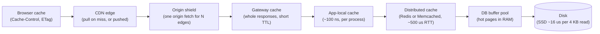
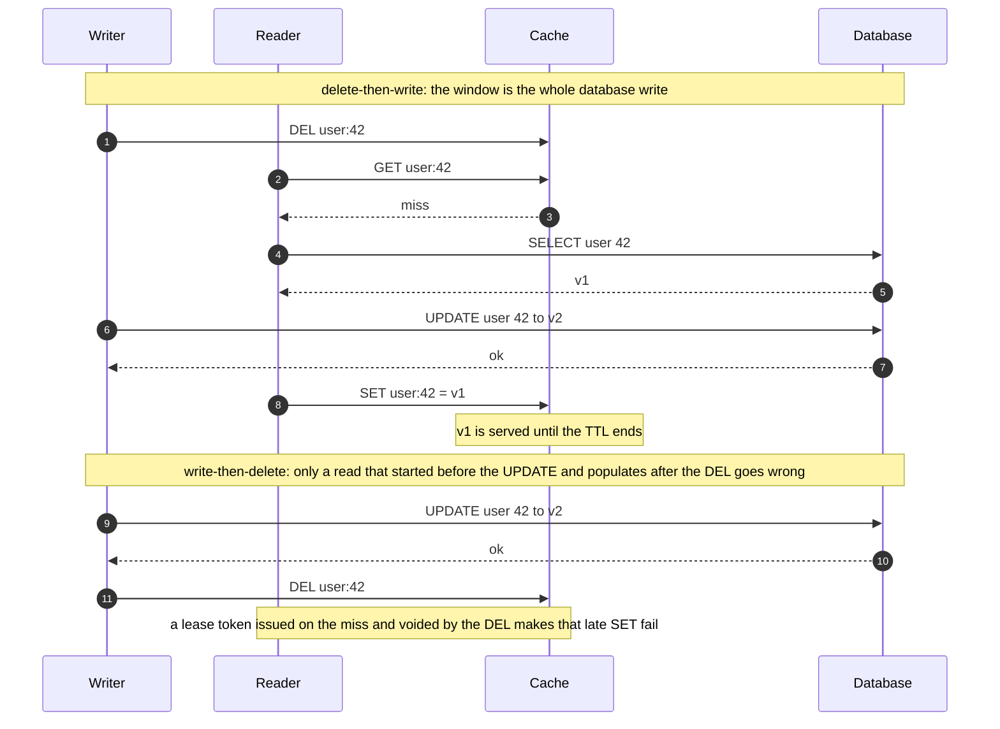
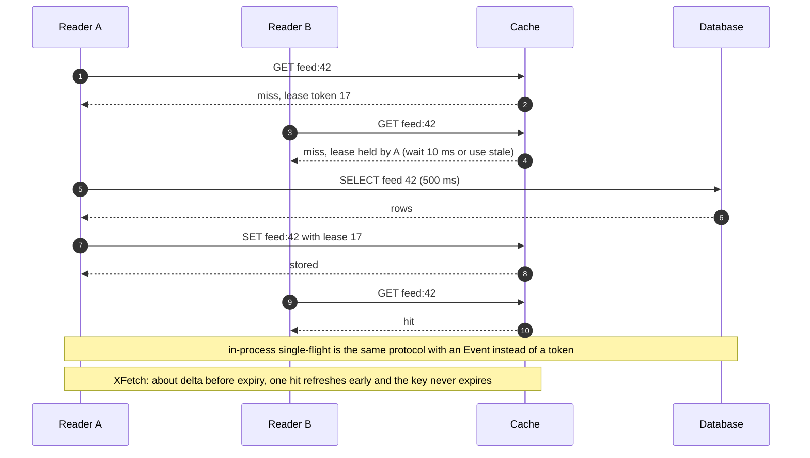

# Caching and CDNs

## TL;DR

- A cache trades staleness for latency and load: a hit costs a ~500 µs round trip or a ~100 ns memory read, and the database never sees it.
- The decisions: where the cache sits, how it fills (cache-aside vs write-through), how entries leave (LRU, TTL, delete), and what happens when many readers miss at once.
- Interviewers probe sizing and hit ratio, the write race that leaves stale data, and the stampede when a hot key expires.

## Core concepts

Caches work because access is skewed: a few keys take most reads. A Twitter-like system serves ~175k timeline reads/s (500k at peak) against a primary good for ~50k indexed reads/s: without a cache the read path is impossible, with one the question is which misses you can afford.

### Where to cache

Every layer between the user and the disk can hold a copy; the closer it is, the cheaper the hit and the harder the invalidation.

**The cache hierarchy, with the cost of a hit at each layer.**



- **Browser and CDN** hold static and semi-static responses; headers decide the lifetime, and a cross-ocean round trip is ~150 ms, so a nearby edge saves that on every request.
- **App-local (in-process)**: a dict in each instance, ~100 ns per hit, but N instances hold N copies that cannot be invalidated together; use it for config, feature flags and the hottest keys with short TTLs.
- **Distributed cache**: Redis or Memcached shared by every instance, one ~500 µs round trip per hit, a single copy to invalidate, partitioned by consistent hashing as in [Partitioning, sharding and consistent hashing](partitioning-and-consistent-hashing.md).
- **DB buffer pool**: the database's own page cache; a cold primary reads from SSD at ~16 µs per page.

### Read and write strategies

- **Cache-aside** (lazy loading): the application reads the cache, on a miss reads the database and populates; writes go to the database, then *delete* the key. Only requested data is cached and the cache can die without losing data, but every miss pays both round trips and a write leaves a stale window.
- **Read-through**: the cache (or a library in front of it) loads on a miss itself. Same data flow, one place for loader logic and stampede protection; `CachedLoader` below is read-through.
- **Write-through**: each write updates the cache and the database synchronously. Reads of recently written data always hit, at the price of write latency and of caching data nobody reads; pair it with a TTL.
- **Write-back** (write-behind): write to the cache, flush to the database later, in batches. The fastest writes and the only pattern that absorbs a write burst — view counters, like counts — but a cache failure loses the unflushed writes unless they also sit in a log.
- **Write-around**: write to the database only; the next read populates. For write-once, read-rarely data such as logs and audit rows, so they never evict useful entries.

### Eviction and expiry

When full, the cache must choose a victim. **LRU** drops the entry untouched the longest and suits recency-skewed traffic; a one-off scan of many keys flushes it, which segmented LRU and ARC resist. **LFU** keeps the most frequently used entries and survives scans, but needs a decaying counter or yesterday's hit stays forever (Redis's LFU uses a decaying logarithmic counter). **FIFO** ignores access entirely and is only cheap. Redis approximates both by sampling a few keys per eviction instead of keeping a list, good enough under Zipfian access. **TTL** is not an eviction policy but a staleness bound: every entry should carry one even when you also delete explicitly, because deletes get lost. Jitter TTLs by a few percent so entries warmed together do not expire together.

### Invalidation and the cache-database race

Invalidate by deleting, not by writing the new value into the cache: two concurrent writers can reach the cache in the opposite order from the database, leaving the older value cached; two deletes cannot. Even with deletes, cache-aside has a race whose size depends on the order.

**Delete-then-write leaves a wide stale window; write-then-delete leaves a narrow one.**



Write to the database first and delete afterwards; the remaining window is one read straddling the write, so keep a TTL as the backstop. To close it, use **leases** (Memcached at Facebook): a miss hands the reader a token, a delete voids outstanding tokens, and a populate with a void token is refused. Alternatives: a delayed second delete, or invalidation from the database change log, ordered after commits.

### Stampedes, thundering herds and hot keys

A **stampede** is a popular key expiring: if that key takes 1k reads/s and the recompute takes 500 ms, 500 identical queries hit the database before the first one populates. Two defences stack:

- **Single-flight (request coalescing)**: the first miss loads, concurrent misses for the same key wait for its result; across processes the cache's lease token plays the same role.
- **Probabilistic early expiration** (XFetch): on each hit, refresh with probability `exp(-(remaining) / (delta x beta))`, where `delta` is the measured recompute time; one reader recomputes roughly `delta` before expiry and the key never goes stale. The demo measures 0.7% of requests refreshing 10 s out, 61% at 1 s.

**Two readers miss at once; a lease lets one load and the other reuse the result.**



A **thundering herd** is the same failure for a whole node: a cache shard restarts cold and every key it held misses at once — 1/8 of 175k reads/s is ~22k QPS of extra database load. Warm replicas, a traffic ramp for a cold node and database headroom for the spike are the answers. A **hot key** is the opposite problem: one key beyond a shard's ~100k ops/s. Replicate it as `key#0..k-1` over k shards and read a random copy, or put the hottest keys in the app-local cache with a TTL of seconds.

### Redis vs Memcached

Memcached is a multithreaded string cache: ~200k+ ops/s per node, a slab allocator, no persistence, no replication, scaled entirely by client-side consistent hashing. Redis is single-threaded for commands at ~100k ops/s per instance (more with pipelining) and brings data structures (hashes, sorted sets, lists, streams), atomic operations and Lua scripts, optional persistence, replication and cluster mode. Pick Memcached for a pure large blob cache on big multicore boxes; pick Redis when you need atomic counters, leaderboards, queues or a cache that survives a restart.

### CDNs: pull vs push, headers, origin shield

A **pull** CDN fetches an object from your origin on the first miss at each edge and caches it for the TTL in `Cache-Control: s-maxage`; a **push** CDN receives objects you upload ahead of demand, for large predictable releases such as video catalogues and game patches. Headers carry the policy: `max-age` for browsers, `s-maxage` for shared caches, `immutable` with a content hash in the filename for assets that never change, `ETag` with `If-None-Match` for cheap revalidation, `stale-while-revalidate` to serve during a refresh, `Vary` to keep the cache key honest, and `private` or `no-store` for per-user responses. An **origin shield** is one mid-tier cache between the edges and the origin: with 200 edges, a new object costs 200 origin fetches without it and one with it, and it coalesces the edges' simultaneous misses.

### Hit-ratio math and sizing

Effective read latency is `h x t_hit + (1 - h) x t_miss`; with a remote hit at ~0.5 ms and a miss at ~1 ms plus the query, the average stays near the hit cost until misses reach a few percent. The database sees `(1 - h) x QPS`, so the number to watch is the *miss* rate: at 175k reads/s, 90% hits leave 17.5k QPS for the database, 99% leave 1.75k, and going from 98% to 99% halves the load. Size with the 80/20 rule — 20% of daily reads x object size; 100M reads/day x 1 KB x 0.2 = 20 GB, one Redis box — then measure: the demo's Zipfian stream gives 67% hits with 10% of the keys cached and 76% with 20%, lower than a static top-k estimate because first touches always miss.

## Trade-offs

| Strategy | Read miss cost | Write cost | Stale window | Data loss risk | Good for |
|---|---|---|---|---|---|
| Cache-aside | Cache RTT + DB read + populate | DB write + delete | One read straddling the write | None | General reads, the default |
| Read-through | Same, inside the library | DB write + delete | Same as cache-aside | None | Centralised loader and stampede control |
| Write-through | Rare misses for written data | Cache + DB, synchronous | None for writes through the cache | None | Read-after-write paths |
| Write-back | Rare | Cache only, flushed later | None | Unflushed writes on a cache crash | Counters, write bursts |
| Write-around | Full miss on first read | DB only | None | None | Write-once, read-rarely data |

Start with cache-aside and a TTL: it caches only what is read, survives a cache outage, and its failure modes are the ones above. Move the loader into a read-through wrapper as soon as more than one code path reads the same keys, because single-flight and early refresh belong in one place. Add write-through where a user must see their own write immediately, such as a profile edit followed by a profile read, and accept the extra write latency only there. Reserve write-back for data whose loss you can tolerate or reconstruct — view counts, presence, analytics — and put a log in front of it otherwise. Use write-around for data that would otherwise pollute the cache. Whatever the pattern, state the TTL, the invalidation trigger and the stampede defence in the same breath; a cache without all three is a staleness bug waiting for traffic.

## Python implementation

`_Node` is an entry in a circular doubly linked list with a sentinel, so no neighbour is ever `None`; `CacheStats` carries the counters:

```python title="code/hld/lru_cache.py — list node and stats"
--8<-- "code/hld/lru_cache.py:node"
```

`LRUCache` pairs the dict with that list: `get` and `put` unlink and re-insert at the front, a full `put` drops the back, and expiry is checked lazily against the injected clock:

```python title="code/hld/lru_cache.py — the cache"
--8<-- "code/hld/lru_cache.py:cache"
```

`zipf_keys` and `simulate_hit_ratio` replay a skewed key stream through a given capacity:

```python title="code/hld/lru_cache.py — hit-ratio simulation"
--8<-- "code/hld/lru_cache.py:simulation"
```

`uv run python -m hld.lru_cache` prints:

```text
put a, b, c            : order (MRU first) = ['c', 'b', 'a']
get a                  : order = ['a', 'c', 'b']
put d (full)           : order = ['d', 'a', 'c']  evicted b, the LRU entry
put e ttl=10, +10 s    : get e -> None; order = ['d', 'a']
stats                  : hits=1 misses=1 evictions=2 expirations=1 hit ratio=50%
zipf(1.0) stream       : 10,000 keys, 50,000 requests
  cache  1% of keys (  100 entries): hit ratio 39.0%
  cache  5% of keys (  500 entries): hit ratio 58.2%
  cache 10% of keys (1,000 entries): hit ratio 66.9%
  cache 20% of keys (2,000 entries): hit ratio 75.7%
```

`should_refresh_early` is the XFetch test; `_Entry` stores the measured recompute time it needs:

```python title="code/hld/cache_stampede.py — probabilistic early expiration"
--8<-- "code/hld/cache_stampede.py:xfetch"
```

`CachedLoader` is read-through over the LRU: the first miss leads and parks concurrent callers on an `Event`; a hit may trigger an early refresh; a failed load releases the waiters and the next one leads:

```python title="code/hld/cache_stampede.py — single-flight loader"
--8<-- "code/hld/cache_stampede.py:loader"
```

`uv run python -m hld.cache_stampede` prints:

```text
32 concurrent readers, one cold key
  plain cache-aside : 32 database loads, one per reader
  single-flight     : 1 database load, 31 readers reused it
XFetch early refresh, recompute delta=2 s, beta=1, 10,000 draws each
  10.0 s before expiry:  0.7% of requests refresh (theory 0.7%)
   5.0 s before expiry:  8.5% of requests refresh (theory 8.2%)
   2.0 s before expiry: 36.5% of requests refresh (theory 36.8%)
   1.0 s before expiry: 60.8% of requests refresh (theory 60.7%)
   0.5 s before expiry: 77.6% of requests refresh (theory 77.9%)
one hot key at 100 QPS for 30 s, ttl=10 s, recompute 0.5 s
  single-flight only    : loads=3 misses=3 (every expiry makes a reader wait 0.5 s)
  + early expiration    : loads=4 misses=1 early_refreshes=3 (after warm-up nobody waits)
```

## In the interview

Introduce the cache with its arithmetic: "Reads are ~175k QPS against a primary good for ~50k, so a cache-aside Redis tier keyed by user id, 60 s TTL, deleted on write; at 95% hits the database sees ~9k QPS." Then volunteer the stampede plan.

Phrases that signal depth: "the miss rate is the number: 98% to 99% halves the database load"; "write-then-delete with a TTL backstop, leases if the race matters"; "single-flight plus probabilistic early expiration for hot keys".

??? question "On a write, do you update the cached value or delete it?"
    Delete. Two writers can reach the cache in the opposite order from the database and leave the older value; deletes commute. The exception is write-through for read-your-own-write paths.

??? question "A cache shard dies. What happens to the database?"
    Every key on that shard misses at once: 1/8 of 175k reads/s is ~22k QPS on the primary. Warm replicas that fail over, consistent hashing so only that shard's keys move, a ramp for a cold node, database headroom for the spike.

??? question "How big should the cache be?"
    Start from the 80/20 rule: 20% of daily reads x object size, 100M reads/day x 1 KB x 0.2 = 20 GB. Then measure hit ratio against capacity on a real trace and stop where the curve flattens.

??? question "How do you keep the cache consistent with the database?"
    You bound staleness rather than eliminate it: write-then-delete, a TTL backstop, leases or change-log invalidation for the read-populate race, write-through only where a user must read their own write.

??? question "Why is a stampede worse than the miss rate suggests?"
    Misses are correlated: a key at 1k reads/s that takes 500 ms to recompute sends 500 identical queries to the database when it expires. Single-flight makes it one; early expiration makes it zero visible misses.

!!! tip "Interview tip"
    Name three things with every cache: the TTL, the invalidation trigger and the stampede defence. "We cache it in Redis" says nothing; "60 s TTL, deleted on write, single-flight on miss" is a design.

## Common mistakes

- **No TTL because "we delete on write"**: deletes get lost and the stale value lives forever. Fix: every entry carries a TTL; deletes only shorten it.
- **Writing the new value into the cache on write**: concurrent writers reorder and the older value stays. Fix: delete; the next read populates.
- **One TTL for keys warmed at the same moment**: they expire together and the database takes the full load. Fix: jitter TTLs, early refresh for hot keys.
- **Write-back for data you cannot lose**: the cache crashes with the unflushed writes. Fix: a durable log in front, or write-through.
- **Caching per-user or huge responses at a shared layer**: hit ratio near zero, useful entries evicted. Fix: write-around, `private` and `Vary` headers, measure per key class.

!!! warning "Common mistake"
    Sizing the database for the cached load only. A cold restart, a cache-flushing deploy or a shard failure sends the raw read rate to the primary, and ~50k reads/s does not survive 175k. Keep headroom for a cold cache and ramp traffic into a cold node.

## Self-check

??? question "Why does LRU need both a dict and a doubly linked list?"
    The dict finds the node in O(1); the list reorders in O(1) because a node knows its neighbours, so moving it to the front and dropping the back need no search.

??? question "Which is worse, delete-then-write or write-then-delete, and why?"
    Delete-then-write: a reader can miss, read the old row and repopulate during the whole database write. Write-then-delete fails only when a read that started before the write populates after the delete.

??? question "Hit ratio goes from 98% to 99%. What happens to database load?"
    It halves: 2% of reads became 1%. At 175k QPS that is 3.5k to 1.75k.

??? question "What does an origin shield save?"
    With 200 edges a new object costs 200 origin fetches without it and one with it; simultaneous edge misses coalesce into that one.

??? question "In XFetch, what does beta change?"
    How early the refresh happens: probability `exp(-remaining / (delta x beta))`, so beta above 1 refreshes earlier at the cost of extra recomputes; below 1 risks an expiry.

## Related

- [Design a distributed cache](../case-studies/distributed-cache.md) — the tier end to end; reuses both modules
- [Design an in-memory cache (LRU, LFU, TTL)](../../lld/problems/in-memory-cache.md) — pluggable eviction
- [Partitioning, sharding and consistent hashing](partitioning-and-consistent-hashing.md) — how keys map to cache shards
- [Design a news feed](../case-studies/news-feed.md) — a cache-first read path
- [Back-of-envelope estimation](estimation.md) — the sizing arithmetic
- Nishtala et al., "Scaling Memcache at Facebook" (NSDI 2013)
- Vattani, Chierichetti and Lowenstein, "Optimal Probabilistic Cache Stampede Prevention" (VLDB 2015)
- RFC 9111, "HTTP Caching"
