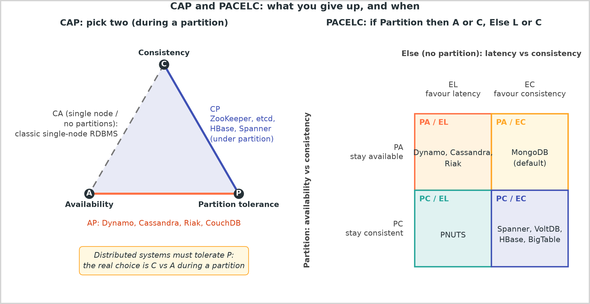
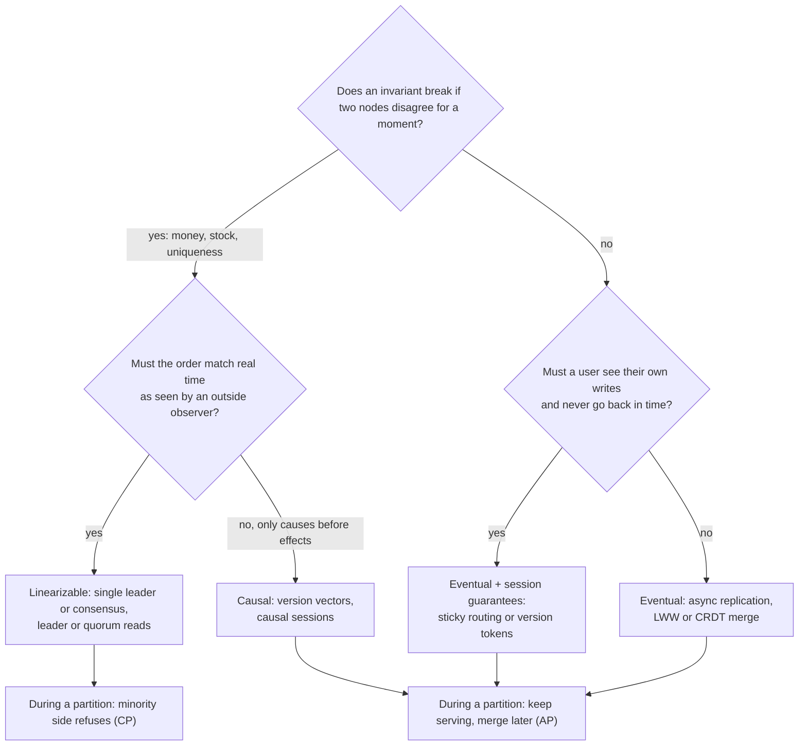
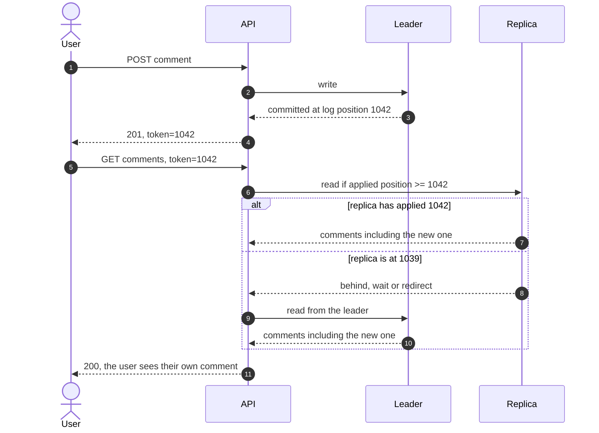

# CAP, PACELC and consistency models

## TL;DR

- Partitions happen, so CAP is one question: during a partition, does this component refuse requests (CP) or serve possibly stale data (AP)?
- PACELC adds the question you face every day: with no partition, do you pay latency for consistency or accept staleness for speed?
- Consistency is a spectrum, linearizable to eventual, and session guarantees cover most user-facing needs cheaply.
- Interviewers expect a per-component choice with the invariant, the mechanism and the cost named.

## Core concepts

### CAP, stated correctly

The CAP theorem (Brewer 2000, proved by Gilbert and Lynch 2002) uses three precise words. Consistency means linearizability: every read returns the latest completed write, as if there were one copy. Availability means every request to a non-failed node gets a non-error response, however long that takes. Partition tolerance means the system keeps operating while the network drops messages between nodes. The theorem says that while a partition is in progress you cannot have both C and A for the same data: a node cut off from the others either answers from what it has (A, possibly stale) or refuses (C).

Three consequences follow. Partition tolerance is not a choice: any system on more than one machine will see partitions, so "CA" describes a single node or a system that stops entirely when the network splits. The C-versus-A choice applies only during a partition; the rest of the time a system can offer both, at a latency cost. And the choice is per operation, not per product: Cassandra with `QUORUM` reads and writes refuses when a quorum is unreachable, with `ONE` it serves whatever the local node has. Say "this component is CP for writes" rather than "we use a CP database".

### PACELC: the trade-off when nothing is broken

Partitions are rare; replication latency is every request. Abadi's PACELC says: if there is a Partition, trade Availability against Consistency; Else, trade Latency against Consistency. A system that waits for a remote replica before acknowledging a write pays that round trip every time, ~500 µs within a datacenter and ~70 ms between US regions, 140x more; one that acknowledges locally and replicates later answers fast and serves stale reads in between.

{ width="800" }

The four corners of the figure cover the common systems. PA/EL: Dynamo, Cassandra and Riak keep serving through a partition (sloppy quorums, hinted handoff) and replicate asynchronously in normal operation. PA/EC: MongoDB's default reads from the primary and is consistent while the cluster is healthy, but a primary cut off from the majority keeps accepting writes until it steps down, and those writes are rolled back. PC/EL: Yahoo's PNUTS reads from the nearest replica for latency yet refuses writes to a record whose owner is unreachable. PC/EC: Spanner, VoltDB, HBase and BigTable refuse rather than diverge and pay coordination latency on every write.

### The consistency spectrum

Models differ in which orderings a reader may observe. **Linearizable**: every operation appears to take effect at one instant between its call and its response, and that order matches real time; once any client sees a write, every later read sees it. This is the model of a single leader with synchronous replication or a consensus group, and it costs a majority round trip per write plus leader or quorum reads. **Sequential**: all nodes see the same order, consistent with each client's program order, but not necessarily real time, so a client may read a value the leader already overwrote. **Causal**: operations related by happens-before are seen in order everywhere, concurrent ones may be seen in either order; it is the strongest model a system can provide while staying available under partition, which is why version vectors and causal sessions matter. **Eventual**: if writes stop, replicas converge, with no promise about what reads return meanwhile; conflicts need a rule (last-writer-wins, version vectors with merge, CRDTs).

**Choosing a model: what breaks if two nodes disagree for a moment?**

### Session guarantees: read-your-writes and monotonic reads

Most products do not need every reader to agree; they need one user's experience to make sense. Terry's session guarantees name the four: read-your-writes (a user sees their own comment), monotonic reads (a refresh never shows an older state), monotonic writes (a user's writes apply in order) and writes-follow-reads (a reply lands after the post it answers). They are cheap because they bind one session, not the whole system. Two mechanisms deliver them. Sticky routing sends a session to the leader for a short window after a write, or always to the same replica, so its view never regresses. Version tokens are more robust: the leader returns the log position of the write, the client carries it, and a replica serves the read only once it has applied that position, otherwise it waits or forwards to the leader. Asynchronous replicas lag milliseconds in a quiet datacenter and seconds under load, so the token is what stops a user from posting and seeing nothing.

**Read-your-writes across a lagging replica with a version token.**

### Where real systems sit

| System | Normal operation | During a partition | Mechanism | Typical use |
|---|---|---|---|---|
| ZooKeeper | Linearizable writes, reads may lag unless preceded by `sync` | Minority side stops serving (CP) | Zab, leader plus quorum | Leader election, locks, config |
| etcd | Linearizable reads and writes by default | Minority side refuses (CP) | Raft | Kubernetes state, leases |
| Spanner | External consistency: linearizable and serializable | Refuses without a quorum (PC/EC) | Paxos groups plus TrueTime | Global transactions |
| Dynamo-style store | Eventual, tunable N/W/R | Keeps serving, sloppy quorum (PA/EL) | Vector clocks, hinted handoff, read repair | Carts, sessions, profiles |
| Cassandra | Per operation: `ONE` to `QUORUM` to `ALL` | Serves at `ONE`, refuses at `QUORUM` without a quorum | Last-writer-wins by timestamp, Paxos for lightweight transactions | Time series, feeds, logs |
| Redis | Linearizable per instance, asynchronous replicas | Failover may lose acknowledged writes | Single-threaded node, Sentinel or Cluster | Cache, counters, rate limits |

Two traps hide in the table. ZooKeeper's reads are served by whichever server the client talks to, so a client can read a stale value right after another client's write unless it calls `sync` first; its ordering promise is per client, not real time. Redis is linearizable on one node because every command runs on one thread, but its replication is asynchronous, so a failover promotes a replica that may be missing the last writes the old leader acknowledged.

### Stating a per-component consistency choice

One sentence per component, four slots: the component, the model, the invariant or user expectation that demands it, the mechanism, and the cost. "Inventory decrement is linearizable per SKU, because overselling is an invariant violation; a single leader per shard applies a conditional update; during a partition the minority side refuses, so a flash sale degrades to errors rather than oversells." "The cart is eventually consistent and always writable, because a lost add-to-cart is worse than a duplicate; per-user keys merge on read." "Product pages are eventual with a 60 s cache TTL, because a stale price for a minute costs nothing." "Order history is read-your-writes, because a user who just paid must see the order; reads carry the write's log position." Interviewers hear the invariant first, and that is what they grade.

## Trade-offs

| Model | Write latency | Availability under partition | What a reader can observe | Cost to build | Use when |
|---|---|---|---|---|---|
| Linearizable | Majority round trip: ~0.5 ms in-DC, ~70 ms cross-region | Minority side refuses | The latest write, always | Consensus or single leader with synchronous replication | Money, stock, unique names, leader election |
| Sequential | Same write path, local reads | Minority refuses writes | A consistent but possibly old prefix | Ordered log, local reads | Configuration, coordination reads |
| Causal | Local write plus metadata | Keeps serving | Effects never before their causes | Version vectors, dependency tracking | Comments and replies, collaborative state |
| Eventual + session | Local write, ~0.5 ms | Keeps serving | Own writes, never backwards | Sticky routing or version tokens | Profiles, feeds, order history |
| Eventual | Local write, ~0.5 ms | Keeps serving | Anything not yet converged | Async replication, merge rule | Caches, counters, carts, analytics |

Start from the invariant, not the database. If two replicas disagreeing for a second can create money, sell stock twice or hand out the same username, that path is linearizable and you pay the round trip; keep the set of such paths small, because each one ties its availability to a quorum. If a user must see their own effects, session guarantees give you that for the price of a token, without making every reader wait. Everything else is eventual by default: it is the fastest, most available option and most data tolerates it. Then decide partition behaviour per path, and say it out loud: the inventory path refuses, the cart path serves. Cross-region deployments sharpen the decision: a linearizable write that spans regions costs ~70 ms per round trip, 140x an in-datacenter one, so systems that need global linearizability (Spanner) accept that latency and everyone else keeps consistency regional and replicates asynchronously across regions.

## In the interview

When you place a data store on the diagram, state its consistency in the same sentence: "inventory on a single-leader PostgreSQL shard per SKU, linearizable decrements; catalog reads from replicas and a CDN, eventual." Then name the partition behaviour of the strongly consistent path, because that is the CAP question in disguise.

Phrases that signal depth: "CP or AP is a per-operation choice during a partition, and PACELC is the everyday trade-off"; "read-your-writes with a version token, so the replica waits instead of lying"; "causal is the strongest model that stays available under partition".

??? question "Is your system CP or AP?"
    Per path. Inventory and payments are CP: a minority partition refuses writes rather than oversell. Cart, catalog and feeds are AP: they keep serving and converge. The honest answer names the operations, not the product.

??? question "What does CAP say about a system with no partition?"
    Nothing. It only constrains behaviour during a partition. The everyday trade-off is PACELC's latency versus consistency: wait for replicas and be consistent, or acknowledge locally and serve stale reads.

??? question "A user posts a comment and refreshes, and it is gone. What happened and what do you do?"
    The read hit an asynchronous replica behind the leader. Give the session read-your-writes: route reads to the leader briefly after a write, or return the write's log position and have the replica serve only once it has applied it.

??? question "Cassandra with W=2, R=2, N=3. Is that linearizable?"
    Not strictly. Overlapping quorums make a read see the latest acknowledged write in the common case, but sloppy quorums, hinted handoff and last-writer-wins timestamps break it under failures. For true compare-and-set use its lightweight transactions, which run Paxos.

??? question "Why is MongoDB PA/EC in PACELC but still classed as strongly consistent by many?"
    Healthy, it reads from the primary, so reads see the latest write (EC). Partitioned, a minority primary keeps accepting writes until it steps down and those writes are rolled back (PA). Majority write and read concerns close that gap at a latency cost.

!!! tip "Interview tip"
    Never answer "CP" or "AP" for the whole design. Pick the one or two paths that hold an invariant, make those linearizable and say what they do during a partition, and declare everything else eventual with the session guarantee the user needs. That is the answer a senior engineer gives.

## Common mistakes

- **Treating partition tolerance as optional**: "we chose CA". A distributed system will partition; CA means it stops. Fix: say which of C or A each path keeps during a partition.
- **Confusing CAP's C with ACID's C**: one is linearizability, the other is invariants holding at commit. Fix: use "linearizable" when you mean the CAP property.
- **Calling a product CP or AP**: Cassandra at `QUORUM` refuses, at `ONE` serves. Fix: state the consistency level per operation.
- **Asking for linearizability everywhere**: every write then waits for a quorum and every path dies with the minority. Fix: reserve it for invariants, give users session guarantees, default to eventual.
- **Reading from a replica right after a write**: the user sees their own write vanish. Fix: read-your-writes via sticky routing or a version token.

!!! warning "Common mistake"
    Assuming "strongly consistent" reads come free once the database is strongly consistent. ZooKeeper serves reads locally and can return stale data unless the client calls `sync`; a Redis failover can drop acknowledged writes; a quorum read in Cassandra is not linearizable under hinted handoff. Know the read path of the store you name, not just its marketing.

## Self-check

??? question "State the CAP theorem in one sentence, correctly."
    During a network partition, a replicated system cannot give every request a response and keep every read linearizable; outside partitions it can have both, at a latency cost.

??? question "What does the E in PACELC stand for and why does it matter more day to day?"
    Else: when there is no partition, the trade-off is latency versus consistency. Partitions are rare; the replication round trip is paid on every consistent write.

??? question "Order these from strongest to weakest: causal, eventual, linearizable, sequential."
    Linearizable, sequential, causal, eventual. Linearizable adds real-time order; sequential keeps a single global order; causal keeps only happens-before; eventual promises convergence.

??? question "Which session guarantee stops a refresh from showing an older feed?"
    Monotonic reads: a session never observes a state older than one it has already seen, via sticky routing to one replica or a last-seen version token.

??? question "Why is causal consistency special under partition?"
    It is the strongest model a system can offer while staying available during a partition; anything stronger requires coordination that a cut-off node cannot complete.

## Related

- [Replication](replication.md)
- [Consensus and coordination](consensus-and-coordination.md)
- [Consistency, replication and isolation tables](../../cheatsheets/consistency-and-replication-tradeoffs.md)
- [Design a Dynamo-style key-value store](../case-studies/key-value-store.md)
- [Time, clocks and ordering](time-and-ordering.md)
- Gilbert and Lynch, "Brewer's Conjecture and the Feasibility of Consistent, Available, Partition-Tolerant Web Services" (SIGACT News 2002)
- Abadi, "Consistency Tradeoffs in Modern Distributed Database System Design" (IEEE Computer 2012)
- Terry et al., "Session Guarantees for Weakly Consistent Replicated Data" (PDIS 1994)
