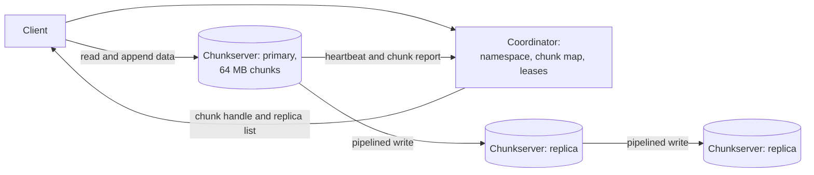
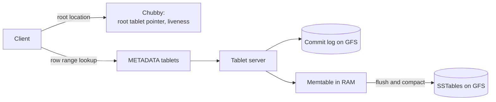
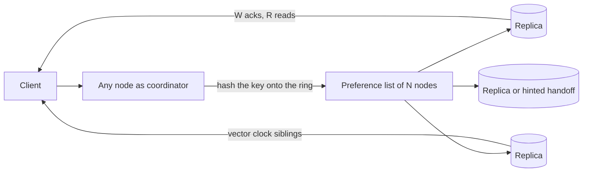
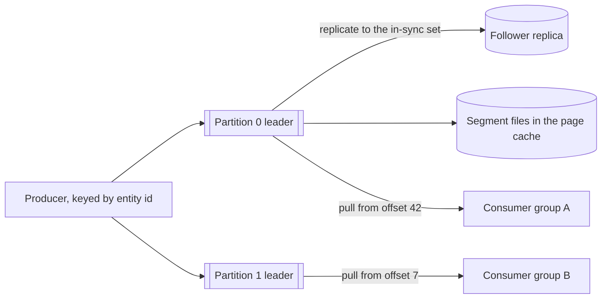
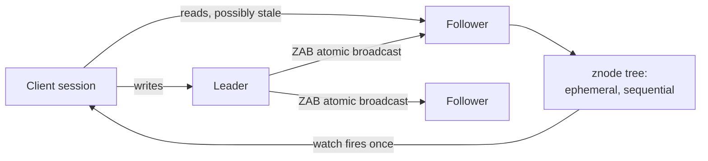
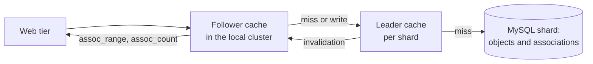

# Classic papers digest

## TL;DR

- Almost every system design answer recombines thirteen papers; knowing which one you are quoting is what makes an answer sound senior.
- Cite the *idea*, not the title: "coordinator plus dumb data nodes, like GFS" beats a bibliography.
- The recurring moves: keep metadata off the data path, make the log the primitive, pick consistency per component.
- Interviewers use these as vocabulary, so a wrong attribution costs more than saying nothing.

## Core concepts

### GFS (2003)

**Problem.** Thousands of commodity disks, failure as the normal case, files that are huge and mostly appended.
**Key idea.** One coordinator holds the namespace and chunk map in memory; 64 MB chunks live in triplicate on chunkservers; the coordinator grants a lease and stays off the data path.
**Takeaways.** Keep metadata off the data path so one node can serve a cluster. Choose a chunk size that lets metadata fit in RAM — at 64 MB, a 1 PB cluster is ~16M chunk records. Weaken the API (record append, duplicates allowed) rather than strengthening the implementation.
**In interviews.** The GFS or HDFS variant of the object-storage question, and every "is your coordinator a bottleneck?" follow-up.

**GFS: control plane answers where, data flows straight to the chunkservers.**

### MapReduce (2004)

**Problem.** Ordinary engineers needed to process petabytes without writing distributed code.
**Key idea.** Two pure functions, `map` and `reduce`, with the framework owning partitioning, shuffle, scheduling, retries and stragglers. Because the functions are deterministic, a failed task is simply re-run.
**Takeaways.** A restricted programming model buys automatic fault tolerance. Move computation to the data. Speculative execution beats waiting on the slowest worker.
**In interviews.** Offline pipelines — inverted index, click aggregation, recommendations — and the moment to say "this is batch, so latency is minutes".

### Bigtable (2006)

**Problem.** Semi-structured data at web scale, with range scans, cheaper than a relational database.
**Key idea.** A sparse, sorted map keyed by row, column (`family:qualifier`) and timestamp, split into **tablets** by contiguous row ranges. Writes go to a commit log and a memtable, flushed to immutable SSTables and merged by compaction; Chubby holds the root location and tablet-server liveness.
**Takeaways.** Sorted row keys make range scans cheap, so key design is the whole design. LSM storage turns random writes into sequential ones. Layering on GFS and Chubby means Bigtable owns no replication of its own.
**In interviews.** Anything wide-column — time series, messages by conversation, feeds — plus the LSM versus B-tree deep dive.

**Bigtable: a location hierarchy, then LSM writes on top of a distributed file system.**

### Dynamo (2007)

**Problem.** A shopping cart that must accept writes during a partition, because a rejected add-to-cart is lost revenue.
**Key idea.** Availability first: consistent hashing with virtual nodes, a preference list of N replicas, tunable quorums `W + R > N`, vector clocks for conflict detection, sloppy quorums with hinted handoff, and Merkle-tree anti-entropy afterwards.
**Takeaways.** Always-writable is a product decision, paid for with conflict resolution in the client. Tunable N, W and R lets one store serve several consistency needs. Gossip and hinted handoff make membership a background concern, not an outage.
**In interviews.** The key-value store question end to end, and the "what happens during a partition?" probe.

**Dynamo: any node coordinates, N replicas answer, the client resolves siblings.**

### Cassandra (2009)

**Problem.** Facebook's inbox search needed Bigtable's data model with Dynamo's availability, across datacenters.
**Key idea.** Dynamo's ring and gossip underneath, Bigtable's column families and LSM storage on top, with consistency chosen per query (ONE, QUORUM, LOCAL_QUORUM) and replica placement aware of racks and datacenters.
**Takeaways.** Consistency is a per-request knob, not a per-system property. Query-first modelling: partition key and clustering columns come from the read you must serve. Multi-datacenter replication is a placement strategy, not a bolt-on.
**In interviews.** The default for write-heavy, time-ordered data — and the place to say "LOCAL_QUORUM, so a 70 ms cross-region round trip stays off the write path".

### Kafka (2011)

**Problem.** LinkedIn's activity and metrics feeds needed one pipeline instead of point-to-point integrations, at a throughput message brokers could not reach.
**Key idea.** The log is the primitive. Topics split into partitions; each partition is an append-only segmented file; consumers pull and own their offsets; ordering holds per partition only; replication is a leader plus an in-sync replica set.
**Takeaways.** Sequential I/O and the page cache beat clever in-memory structures — a broker sustains ~100 MB/s in. Retention plus consumer-owned offsets turns a queue into replayable history. Per-key ordering is enough for almost everything and far cheaper than a total order.
**In interviews.** Any queue, event-driven or streaming design, and the delivery-semantics discussion after it.

**Kafka: keyed partitions, replicated to an in-sync set, read at a consumer-owned offset.**

### ZooKeeper (2010)

**Problem.** Every distributed system was re-implementing leader election and configuration, each with its own bugs.
**Key idea.** A small replicated tree of znodes with a wait-free API: ephemeral nodes tied to a session, sequential nodes, one-shot watches. Writes go through the ZAB atomic broadcast; reads are local and may be stale unless you sync.
**Takeaways.** Coordination primitives belong in a service, not in every application. Ephemeral nodes turn liveness into a data-model feature. Read-local, write-through-consensus is the standard shape.
**In interviews.** Leader election, service discovery, shard assignment, locks — and the discipline to say "coordination only, never the request path" ([Consensus and coordination](consensus-and-coordination.md)).

**ZooKeeper: writes take the majority path, reads take the local one.**

### Spanner (2012)

**Problem.** A globally distributed database that still offers SQL, real transactions and consistent snapshot reads.
**Key idea.** Data splits into ranges, each replicated by its own Paxos group; two-phase commit runs across groups; and **TrueTime** exposes clock uncertainty as an interval, so a commit waits out the ambiguity and produces externally consistent timestamps.
**Takeaways.** Clock uncertainty can be engineered down and *made explicit* rather than assumed away. One consensus group per range is how you scale strong consistency. Read-only transactions at a timestamp need no locks.
**In interviews.** The counter-example to "CAP says choose AP", and the reference for multi-region strong consistency ([Time, clocks and ordering](time-and-ordering.md)).

### Raft (2014)

**Problem.** Paxos is correct and nearly unimplementable, so systems shipped subtly wrong consensus.
**Key idea.** Decompose consensus into leader election, log replication and safety; terms as a logical clock, randomized election timeouts to break symmetry, and a leader that never overwrites its own log.
**Takeaways.** Understandability is a legitimate design goal with a reliability payoff. Randomization solves the split-vote livelock. A leader-based log is the practical shape of consensus.
**In interviews.** Name it when you need exactly one writer, then move on — they want "3 or 5 nodes, one election, about 200 ms", not the proof.

### Chubby (2006)

**Problem.** Google needed a coarse-grained lock service and a place to keep small, critical configuration.
**Key idea.** A five-replica Paxos-backed file system with sessions, leases, whole-file reads and writes, and aggressive client caching kept coherent by invalidations.
**Takeaways.** Most systems want a *lock service*, not a consensus library. Client-side caching with invalidation is what lets a consensus-backed store survive read traffic. Coarse-grained locks — held for hours, not milliseconds — are the ones worth centralising.
**In interviews.** The ancestor of ZooKeeper and etcd; cite it when arguing for leases plus fencing tokens.

### Scaling Memcache at Facebook (2013)

**Problem.** A huge cache tier fronting sharded MySQL, without stampedes or stale writes.
**Key idea.** Operational engineering rather than a new algorithm: **leases** so exactly one client refills a missed key and stale sets are rejected, regional pools, cold-cluster warm-up, batched multi-get, and invalidation driven by the database's replication stream.
**Takeaways.** At scale the cache tier's failure modes — stampedes, incast congestion, stale sets — dominate the design. Leases solve thundering herd with one token. Invalidate from the write path of record, not from scattered application code.
**In interviews.** The best source for cache-consistency and stampede questions, and evidence you know more than "cache-aside".

### TAO (2013)

**Problem.** The social graph is read-dominated, and a generic key-value cache cannot express "the friends of this user".
**Key idea.** A graph-aware cache: objects and typed, timestamped associations with an API of `assoc_range` and `assoc_count`, served by follower caches in each cluster, backed by per-shard leader caches that own writes and push invalidations, over sharded MySQL.
**Takeaways.** Shape the cache around the query, not the row. A leader cache per shard serialises writes and fans out invalidations. Read-after-write for the writer is a cheap, targeted guarantee.
**In interviews.** News feed, social graph, follower queries — the answer to "how do you cache a graph?".

**TAO: follower caches per cluster, one leader cache per shard, MySQL behind it.**

### Dapper (2010)

**Problem.** One user request touches hundreds of services; nobody could say where the latency went.
**Key idea.** Propagate a trace id and span ids in-band through every RPC, sample aggressively, and collect spans out of band into a queryable store.
**Takeaways.** Low overhead is what makes tracing survive in production, and sampling is how you get it. Instrumentation belongs in shared RPC libraries, not each service. A trace is the only artifact that explains a p99 across service boundaries.
**In interviews.** The observability section of every design; the ancestor of OpenTelemetry and Zipkin.

## Trade-offs

| Paper | Consistency | Partitioning | Replication | The idea to steal |
|---|---|---|---|---|
| GFS | Relaxed, append-oriented | 64 MB chunks, central map | 3 chunk copies | Metadata off the data path |
| Bigtable | Strong per row | Ordered row ranges | Delegated to GFS | LSM plus a lock service |
| Dynamo | Eventual, tunable N/W/R | Consistent hashing ring | N replicas, hinted handoff | Always writable, resolve later |
| Cassandra | Chosen per query | Ring plus clustering columns | Per-datacenter placement | Query-first modelling |
| Kafka | Ordered per partition | Partitions by key | Leader plus in-sync set | The log as a primitive |
| ZooKeeper | Linearizable writes | None, one small tree | ZAB majority | Coordination, not storage |
| Spanner | Externally consistent | Ranges, a Paxos group each | Paxos plus TrueTime | Make uncertainty explicit |

Read the table as a menu of positions, not a ranking. The consistency column is really one question — how much coordination will I pay for on the write path — and the systems differ mostly in their answer. Dynamo and Cassandra pay nothing and hand the cost to the client as siblings; Bigtable and Kafka pay for a single writer per unit (tablet, partition) and get cheap ordering inside it; ZooKeeper and Spanner pay a majority round trip per write and get linearizability.

So do not pick one paper. Take Bigtable's storage engine, Kafka's log for the write path, ZooKeeper for the shard map, Dynamo's ring if the fleet is elastic, TAO's shape for the read path — then say which component gets which guarantee. Interviewers score mixing these deliberately far higher than reciting any one.

## In the interview

Use a paper as shorthand, never as a citation: "This is essentially GFS — one metadata service that hands out locations, data flowing straight to storage nodes — because the metadata fits in memory and I want it off the read path."

Phrases that signal depth: "always-writable was a product decision at Amazon, not a technical one"; "Kafka's contribution is that the log itself is the abstraction".

??? question "Which paper would you cite for a write-heavy time-series store, and why?"
    Bigtable for the engine — LSM turns random writes into sequential ones and sorted row keys make range scans over a time window cheap — and Cassandra for the deployment shape, because tunable consistency keeps writes local.

??? question "Dynamo and Spanner disagree. Which is right?"
    Both, for different products. Dynamo optimises for a cart that must never reject a write and can tolerate merging; Spanner optimises for money, where a wrong read is worse than a slow one. State which side your design sits on.

??? question "What is the single most reusable idea in GFS?"
    Separating the control plane from the data plane. The coordinator answers "where", clients then talk to storage nodes directly, so one modest machine serves a very large cluster. The same split appears in HDFS and every object store.

??? question "Why did Facebook build TAO instead of using memcache?"
    Generic key-value caching cannot express graph queries: a friends list is a range over edges, and invalidating it by key means invalidating everything. TAO caches objects and associations, and a leader cache per shard drives invalidations.

??? question "Where does Raft actually appear in a design?"
    Wherever exactly one thing must be true cluster-wide: the shard map, the leader lease, the controller. It is on the metadata path at 3 or 5 nodes, usually as etcd rather than a library you wrote.

!!! tip "Interview tip"
    Name the mechanism, then the paper, then stop. "Hinted handoff, like Dynamo" is a signal; two minutes of paper summary is a stall, and interviewers read it as filling time rather than designing.

## Common mistakes

- **Reciting instead of applying**: a paper summary with no connection to the problem on the whiteboard. Fix: name the mechanism you are borrowing and the constraint that makes it fit.
- **Misattributing an idea**: crediting consistent hashing to Cassandra or vector clocks to Kafka. Fix: when unsure, describe the mechanism without the name — nobody penalises that.
- **Copying a paper's constants**: 64 MB chunks and 3 replicas suited 2003 disks and Google's workload. Fix: derive your numbers from your access pattern.
- **Assuming a paper describes today's system**: Bigtable, Dynamo and Kafka have all changed since publication — Kafka replaced its ZooKeeper dependency. Fix: say "as published".

!!! warning "Common mistake"
    Quoting Dynamo's availability story while designing something that moves money. "Always writable, resolve later" means two concurrent writes both survive and someone merges them — fine for a cart, a disaster for a balance. Match the paper's failure model to your product's, not just its scale.

## Self-check

??? question "What do GFS, Bigtable and Kafka have in common structurally?"
    A single writer per unit of data — chunk, tablet, partition — with replication underneath. That makes ordering cheap inside the unit and lets the system scale by adding units.

??? question "Why does Bigtable need Chubby at all?"
    For the things that must be unique: the root tablet's location, tablet-server liveness through ephemeral files, schema metadata. Coordination is small and rare, so it sits outside the data path.

??? question "What problem do leases solve in the Memcache paper?"
    Thundering herd and stale sets. A miss hands one client a lease to refill the key while the rest wait briefly, and a set carrying an invalidated lease is rejected, so a slow refill cannot overwrite a newer value.

??? question "Why does Dapper sample instead of tracing everything?"
    Because overhead decides whether tracing stays enabled in production, and a small fraction of requests is statistically sufficient for latency distributions.

??? question "Which paper justifies a per-key consistency choice?"
    Cassandra: consistency as a per-query level (ONE, QUORUM, LOCAL_QUORUM) is the clearest published argument that one system can serve several guarantees, chosen by the caller.

## Related

- [Design a Dynamo-style key-value store](../case-studies/key-value-store.md) — Dynamo applied
- [Design a distributed message queue](../case-studies/distributed-message-queue.md) — Kafka as a design
- [Design S3 (with a GFS/HDFS variant)](../case-studies/object-storage.md) — GFS in an answer
- [Consensus and coordination](consensus-and-coordination.md) — Raft, Chubby and ZooKeeper
- [Time, clocks and ordering](time-and-ordering.md) — TrueTime and vector clocks
- Ghemawat, Gobioff and Leung, "The Google File System" (SOSP 2003)
- DeCandia et al., "Dynamo: Amazon's Highly Available Key-value Store" (SOSP 2007)
- Corbett et al., "Spanner: Google's Globally-Distributed Database" (OSDI 2012)
