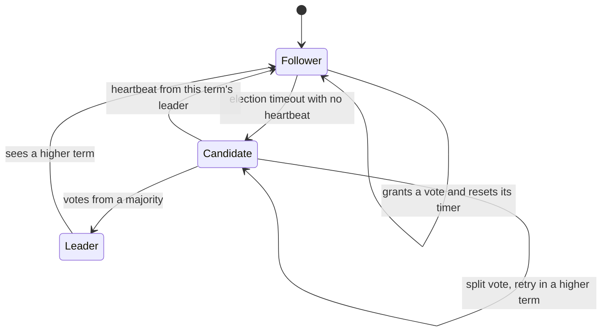
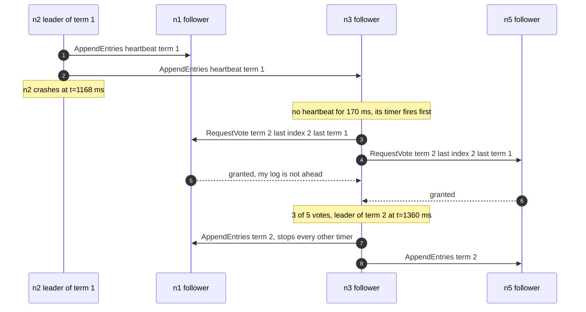
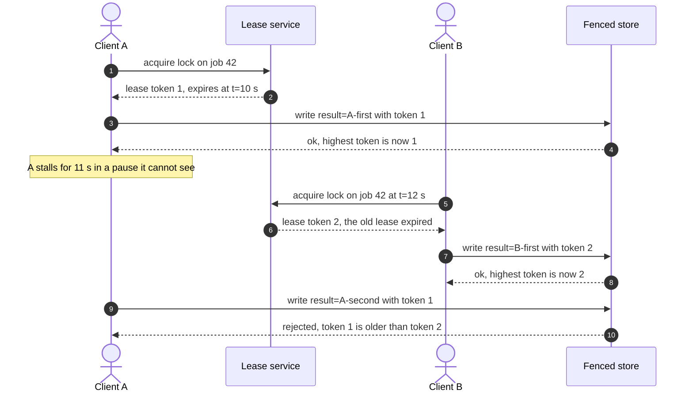

# Consensus and coordination

## TL;DR

- Consensus is how nodes agree on one ordered log despite crashes and partitions; leader election, atomic broadcast and configuration all reduce to it.
- Raft is the algorithm to name: terms, randomized timeouts, majority votes, log replication, commit on a majority.
- Coordination costs a majority round trip — 500 µs inside a datacenter, 70 ms across US regions — so keep it off the hot path.
- A distributed lock without a fencing token is not mutual exclusion, whatever its TTL says.

## Core concepts

### What consensus buys you

Consensus gets nodes to decide on one value when any may crash and any message may be delayed. You rarely want one value; you want a replicated log — atomic broadcast — which is consensus run once per slot. Three uses are worth naming: **leader election**, so a failover leaves one writer per shard; **total order**, the log a linearizable store is built from; and **configuration**, the shard map and live node set that are fatal to disagree about.

A group is 3 or 5 nodes: 2f+1 tolerates f failures because any two majorities intersect. It is not a database — one group commits at a majority round trip plus a durable append, 500 µs inside a datacenter, so it sustains a few thousand commits/s, the order of one relational primary's 5k-20k writes/s. Systems needing more shard across many groups (Spanner runs one per range) or keep consensus off the data path, as [Replication](replication.md) describes.

### FLP, and why timeouts are the escape hatch

FLP says that in a purely asynchronous system no deterministic algorithm solves consensus if even one node may crash, for the reason you should say out loud: you cannot distinguish a crashed node from a slow one. Systems escape with a failure detector built from timeouts, plus randomness so symmetric candidates do not deadlock — termination becomes overwhelmingly likely, not guaranteed.

The price is liveness, never safety: the minority side of a partition stops accepting writes until it reaches a majority again, but never returns a wrong answer — the CP corner of [CAP, PACELC and consistency models](cap-pacelc-and-consistency-models.md). Quantify the outage: with 150-300 ms election timeouts a crash costs one timeout plus one round of votes, and the simulation below replaces the leader 192 ms later (1,360 ms - 1,168 ms). Ten failovers a day is 10 x 0.2 s x 365 = 730 s, 12 minutes a year — inside the 52.6 minutes a 99.99% target allows.

### Paxos in one paragraph, Raft in the rest

Single-decree Paxos: a proposer picks an ever-increasing ballot number and asks a majority to promise to ignore lower ballots; if any acceptor already accepted a value, the proposer must re-propose that one. Two majorities intersect, so at most one value is chosen. Multi-Paxos amortizes the promise phase with a stable leader. In the room: "Paxos is the proof, Raft is the implementation."

A Raft **term** is a logical clock: each begins with an election and has at most one leader. Every message carries a term, and a node seeing a higher one becomes a follower — which is how stale leaders retire.

**A follower that stops hearing heartbeats becomes a candidate; a higher term always demotes.**



Two rules carry the safety argument. **One vote per term, and only for a candidate at least as up to date as you** — last log term, then last index. A committed entry sits on a majority and a winner needs a majority, so the sets share a voter who refuses a candidate missing that entry. **A leader never edits its own log; it makes followers match** — `AppendEntries` names the preceding entry's index and term, and a follower that disagrees rejects it until the leader backs up far enough. One trap: the commit index may only advance to a majority-held entry of the leader's *own* term (Figure 8).

**A leader crash costs one election timeout plus one round of votes.**



### ZooKeeper and etcd: what you actually run

You rarely implement Raft; you run a small, strongly consistent store beside your system and use it for coordination, not data. ZooKeeper gives you a tree of **znodes** of up to 1 MB. **Ephemeral** znodes vanish when the client's session ends, which makes them a liveness signal; **sequential** znodes get a monotonically increasing suffix; **watches** are one-shot and carry no payload, so you re-arm and re-read after every fire. etcd is the same ideas over a flat keyspace: a global revision, TTL **leases**, and watches that resume *from a revision*.

Three idioms. **Leader election**: each contender creates an ephemeral sequential znode, lowest sequence wins, and each loser watches only its predecessor — watching the parent wakes all N on every change. **Membership**: the children of one parent are the live set. **Configuration**: one znode plus a watch.

Watch the budget: every write goes through atomic broadcast, so five nodes handle thousands of writes/s, not hundreds of thousands. Per-request counters belong in a [partitioned log](messaging-and-event-streaming.md).

### Leases, fencing tokens and the Redlock debate

A distributed lock has to be a **lease**: mutual exclusion with an expiry, because the holder may die holding it. Expiry alone is not safe — a stop-the-world garbage collection, a virtual machine migration or a blocked disk can stop a holder past its lease, and it wakes with no idea time passed, still holding an object that says it owns a resource the service has since given away.

The fix is not a longer TTL; no TTL bounds a pause you do not control. It is a **fencing token**: the service stamps every grant with a number that only increases (ZooKeeper's zxid, etcd's revision, a counter below), the holder sends it with every write, and *the resource* rejects any token below the highest it has accepted.

**The fenced store rejects the woken-up client; an unfenced one takes its write and loses the newer one.**



That is the Redlock argument. Redlock takes a TTL lock on a majority of N independent Redis nodes; Kleppmann's objection is that its safety rests on wall-clock timing across machines that pause and clocks that jump, and that it issues no fencing token. Antirez's reply is that Redlock is safe under its stated timing model, and that the fencing objection applies to any lock service, since a monotonic token has to come from somewhere. The framing that survives both is the one to say in the room: if the lock is an *efficiency* optimisation, one Redis key is enough; if it is a *correctness* mechanism, you want a lease from a consensus store plus a fencing check at the resource.

### Failure detection: heartbeats, gossip, phi-accrual

You never detect failure, only unresponsiveness. The threshold is a bet both ways: too short and a slow node triggers a spurious election, too long and you sit in a preventable outage.

- **Heartbeats with a fixed timeout**, what Raft uses. Inside a datacenter a round trip is 500 µs, so a 100 ms threshold leaves ~200 round trips of slack; across US regions, at 70 ms a round trip, the same threshold is a false-positive generator. Randomize, and keep the interval well under the timeout.
- **Gossip.** Each node exchanges membership state with a few random peers, so suspicion spreads in a logarithmic number of rounds and nobody probes all N. Cassandra, Dynamo and Consul use it at thousands of nodes; it converges in seconds — fine for membership, useless for failover.
- **Phi-accrual.** Output a suspicion value derived from recent heartbeat intervals and let each caller pick a threshold, so a slower network raises latency without raising suspicion.

Wire the detector to the lease: the takeover threshold must exceed the TTL, or two nodes hold the same resource.

## Trade-offs

| Mechanism | Safe when the holder pauses | Failover | Write cost | Fencing token | Operational cost |
|---|---|---|---|---|---|
| Embedded Raft group | Yes | Election, ~200 ms | Majority hop, ~500 µs | Log index | You own it |
| ZooKeeper ensemble | If checked downstream | Session timeout | Majority hop | zxid | 3-5 nodes |
| etcd | If checked downstream | Lease TTL | Majority hop | Revision | 3-5 nodes |
| Database advisory lock | While the transaction lives | Connection loss | 5k-20k writes/s | Row version | None extra |
| Redis lock, NX with TTL | No | TTL expiry | ~100k ops/s | None | Trivial |
| Gossip membership | Not a lock | Seconds | Nothing | None | Low |

Start by asking what breaks if two nodes act at once. If the answer is "we do the work twice and waste money", one Redis key with NX and a TTL is enough. If it is "we corrupt data or double-charge a customer", you need a lease from a consistent store plus a check at the resource — and you should say "fencing token" before the interviewer does.

Prefer coordination you already run: with PostgreSQL, an advisory lock costs one primary round trip at 5k-20k writes/s and no new cluster. Reach for ZooKeeper or etcd when you need ephemeral membership, watches or a leader across processes that share no database. Own a Raft library only when consensus is the product: a metadata service, a store with one group per range. Across regions, know the bill — US east to west pays 70 ms per commit instead of 500 µs, 140x — so put the majority where the writes are.

## Python implementation

`RaftNode` follows the paper's server rules. This is the election path: randomized timer, term bump, the up-to-date check voters apply, and the majority count that promotes.

```python title="code/hld/raft_election.py — elections"
--8<-- "code/hld/raft_election.py:election"
```

`AppendEntries` doubles as the heartbeat, its consistency check backs the leader up one entry at a time until the logs meet, and `_advance_commit_index` refuses an entry from an earlier term.

```python title="code/hld/raft_election.py — log replication and commit index"
--8<-- "code/hld/raft_election.py:replication"
```

`RaftCluster` is the simulated network: one seeded `random.Random` for every timeout and delay, a `FakeClock` for every reading. A run is a pure function of seed and fault schedule, so the tests assert Election Safety over twenty randomized schedules and get the same verdict each time.

```python title="code/hld/raft_election.py — the simulated cluster"
--8<-- "code/hld/raft_election.py:cluster"
```

`uv run python -m hld.raft_election` prints:

```text
5 nodes, election timeout 150-300 ms, heartbeat every 50 ms, latency 5-15 ms, seed 42
t=  156 ms  n2 election timeout, candidate in term 1
t=  168 ms  n2 wins term 1 with votes from n1, n2, n5
t= 1168 ms  n2 still leads term 1: 80 heartbeats sent, 0 vote requests (timers kept being reset)
t= 1168 ms  n2 crashes
t= 1338 ms  n3 election timeout, candidate in term 2
t= 1360 ms  n3 wins term 2 with votes from n1, n3, n5
t= 1360 ms  n2 restarts as follower in term 1
t= 1560 ms  x=1, x=2 submitted to n3: committed on 5/5 nodes, n2 caught up after its restart
t= 1560 ms  partition {n2, n3} | {n1, n4, n5}
t= 1733 ms  n1 election timeout, candidate in term 3
t= 1753 ms  n1 wins term 3 with votes from n1, n4, n5
t= 1953 ms  n3 (term 2) accepted x=3 at index 3, commit index still 2: 2/5 replicas; n1 (term 3) committed y=1
t= 1953 ms  partition healed
t= 1962 ms  n3 steps down, follower in term 3
t= 2253 ms  5/5 logs equal ['x=1', 'x=2', 'y=1'], committed on 5/5; x=3 is gone
leaders per term: {1: ['n2'], 2: ['n3'], 3: ['n1']}; election safety holds: True
identical 200 ms timeouts instead: no leader after 2,000 ms, 10 terms of split votes
```

The stale leader `n3` accepted `x=3` and never committed it — 2 of 5 is not a majority. The last line is the control: identical timeouts make every node campaign at once, so ten terms pass with no leader at all.

The lock service stamps each lease with a counter that never repeats; `renew` extends only a lease the caller still holds.

```python title="code/hld/fencing_lock.py — leases"
--8<-- "code/hld/fencing_lock.py:lease"
```

The store is where safety is enforced: it keeps the highest token per key and rejects anything older. `check_tokens=False` drops the check, so the demo replays the scenario both ways.

```python title="code/hld/fencing_lock.py — the fenced store"
--8<-- "code/hld/fencing_lock.py:store"
```

`uv run python -m hld.fencing_lock` prints:

```text
lease lock with ttl 10 s; clients A and B; one fenced store
[fenced] t= 0 s  A acquires job:42 -> token 1, expires t=10 s; A writes result=A-first (token 1) ok
[fenced] t= 1 s  B tries job:42 -> busy
[fenced] t=12 s  A has been paused for 11 s; lease expired, B acquires -> token 2; B writes result=B-first ok
[fenced] t=13 s  A wakes up, lease.remaining=-3 s, writes result=A-second with token 1 -> rejected (write to 'result' with token 1 rejected: token 2 already seen)
[fenced]        store: result=B-first (token 2)
[unfenced] t= 0 s  A acquires job:42 -> token 3, expires t=10 s; A writes result=A-first (token 3) ok
[unfenced] t= 1 s  B tries job:42 -> busy
[unfenced] t=12 s  A has been paused for 11 s; lease expired, B acquires -> token 4; B writes result=B-first ok
[unfenced] t=13 s  A wakes up, lease.remaining=-3 s, writes result=A-second with token 3 -> accepted
[unfenced]        store: result=A-second (token 3)
C acquires -> token 5 (tokens are never reused); renew at t=19 s -> expires t=29 s; release -> True; stale release -> False
```

Same lock service, same pause; only the store differs.

## In the interview

Introduce it where it is needed, not as a topic. When you draw a component that must have exactly one writer, price it in the same breath: "Only one scheduler may dispatch a job, so I elect a leader through etcd with a 10 s lease, and every dispatch carries its revision as a fencing token the run table checks."

Phrases that signal depth: "two majorities always intersect, which is where safety comes from"; "the lock is the efficiency optimization, the fencing token is the correctness mechanism".

??? question "Why 3 or 5 nodes, and why not 4?"
    Four nodes need a majority of three, so they survive one failure — the same as three — while making every commit wait for one more fsync. Even sizes buy latency, not availability.

??? question "Your Raft leader is in region A and half the clients are in region B."
    Every write from B pays the 70 ms cross-region round trip plus the leader's own majority hop. Move the leader to the writes, shard by region, or serve B follower reads.

??? question "A client holds a lock, pauses for 30 s and wakes. What stops it corrupting data?"
    Nothing in the lock — its lease expired, someone else took over, and it cannot tell. The fencing token does: the store rejects any token below the highest it has seen.

??? question "How do you elect a leader with ZooKeeper without a herd?"
    Each contender creates an ephemeral sequential znode and the lowest sequence leads; every other watches only the znode below its own, so a departure wakes one process.

??? question "Where would you use gossip instead of a consensus group?"
    Where the answer may be eventually consistent and N is large: membership, node health, the ring version in a Dynamo-style store. It needs no majority, but gives no unique leader.

!!! tip "Interview tip"
    Say what you are *not* coordinating. "Consensus is on the metadata path only — the shard map and the leader lease — and the data path never talks to etcd" shows you treat coordination as a throughput ceiling, and pre-empts the question about that cluster being slow.

## Common mistakes

- **Coordinating per request**: every request takes a lock or reads configuration from ZooKeeper, so throughput is capped by an ensemble doing thousands of writes/s. Fix: cache it with a watch.
- **Believing a TTL is mutual exclusion**: "the lock expires after 30 s, so only one worker runs" becomes two workers the first time a pause outlasts the lease. Fix: a fencing token checked at the resource.
- **Even-sized or oversized groups**: 4 nodes tolerate the same single failure as 3 and commit more slowly. Fix: 3 or 5, and add groups rather than members.
- **Identical election timeouts**: every follower campaigns at once and splits the vote forever — ten terms, no leader, 2,000 ms in the demo. Fix: randomize over a wide range.
- **Leader reads with no lease check**: a partitioned leader still answers from memory. Fix: renew a read lease.

!!! warning "Common mistake"
    Committing an entry because a majority stores it, without checking it belongs to the current term. That is Figure 8 of the Raft paper: a later leader can still overwrite it, so a client was told its write was durable when it was not.

## Self-check

??? question "Why can a leader not commit a previous term's entry that a majority holds?"
    The election restriction only protects entries already committed, so counting replicas is not enough — a future leader could still overwrite it. One current-term commit breaks the circularity.

??? question "What does the election restriction rule out?"
    A candidate missing a committed entry winning. That entry sits on a majority, a winner needs a majority, and the shared node refuses a candidate whose log is behind.

??? question "Your lock service is correct and your data is still corrupted. Where do you look?"
    At the resource. A correct lease can still be followed by an unfenced write from a client paused past its expiry. Check that storage verifies a token on *every* write path.

??? question "Why does a 5-node etcd cluster make a poor work queue?"
    Every enqueue and dequeue is a majority round trip plus a durable append: thousands per second at best. A partitioned log does the same at ~100 MB/s per broker.

??? question "Heartbeats say a node is down but it is only slow. What breaks?"
    You elect a new leader while the old one still believes it leads, so writes are rejected or duplicated until it sees the higher term. A phi-accrual detector avoids that.

## Related

- [Replication](replication.md) — quorums and failover
- [Time, clocks and ordering](time-and-ordering.md) — why terms and tokens beat timestamps
- [Design a distributed job scheduler](../case-studies/job-scheduler.md) — fencing on a dispatch path
- [Design a distributed unique ID generator](../case-studies/unique-id-generator.md) — coordination at machine-ID assignment
- [CAP, PACELC and consistency models](cap-pacelc-and-consistency-models.md) — what the minority gives up
- Ongaro and Ousterhout, "In Search of an Understandable Consensus Algorithm" (USENIX ATC 2014)
- Burrows, "The Chubby Lock Service for Loosely-Coupled Distributed Systems" (OSDI 2006)
- Fischer, Lynch and Paterson, "Impossibility of Distributed Consensus with One Faulty Process" (JACM 1985)
