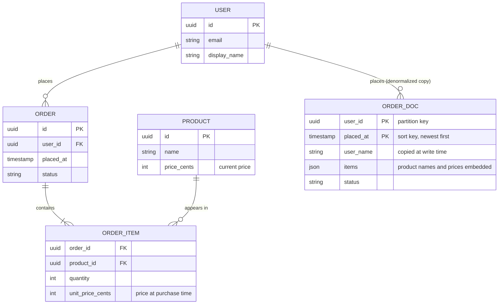
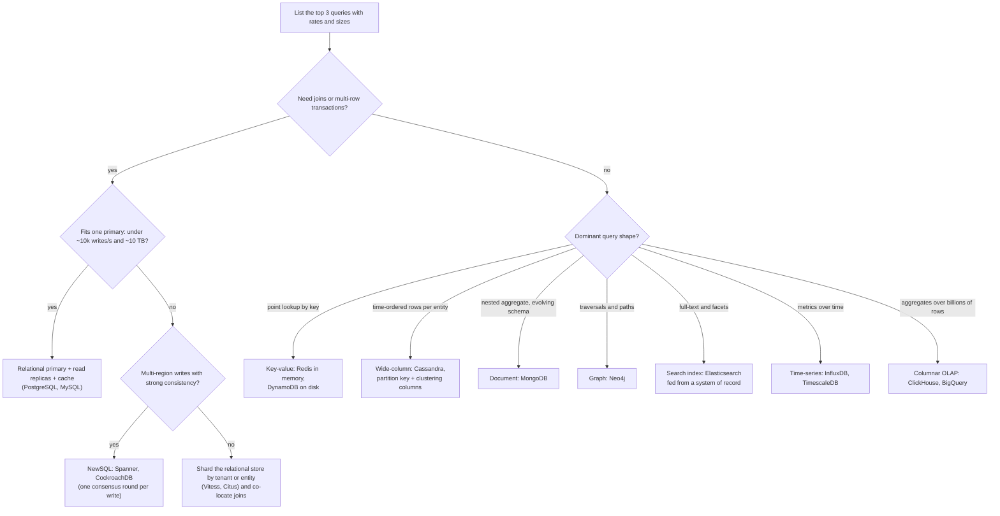

# Choosing a database

## TL;DR

- The store follows the top three queries, the consistency the product needs and the year-three write rate and data size; the product name comes last.
- Relational is the default: joins, indexes and ACID on one primary at ~5k-20k writes/s and 2-20 TB cover most products for years.
- NoSQL families trade joins and cross-row transactions for a partition key that scales linearly; model the queries first.
- Interviewers probe why this store, what you gave up, and how the schema serves the hot paths.

## Core concepts

A database choice is an access-pattern choice. Write down the top queries with their rates, then answer four questions: the query shape (point, range, join, aggregate, full-text, traversal), the consistency the product needs, the data and write volume in year three, and how the schema will change. Every store below is a different answer to those four questions.

### The relational model: normalize for writes, denormalize for reads

Relational tables hold one fact in one place: a product's name lives in `product`, and an order refers to it by id. Updates are cheap and cannot disagree with themselves; reads pay with joins. Denormalization copies data to where reads need it: an `order_doc` with the product name and price embedded is one lookup instead of a three-table join, and it also records the price at purchase time, which the normalized form loses on a price change. The cost moves to writes: copy a user's display name into their 10,000 posts and a rename is 10,000 row updates, 0.5-2 s of a primary's entire 5k-20k writes/s budget, so copies are refreshed asynchronously or avoided (store the id, join at read time, cache the result). Rule: normalize the system of record; denormalize read models you can rebuild from it.

**Same orders, two shapes: normalized rows that join, and a per-user document keyed for the hot read.**

### ACID and isolation levels, precisely

Atomicity: a transaction's writes all commit or none do, implemented with the WAL and undo records. Consistency: the database keeps the invariants you declared (constraints, foreign keys); the rest is your application's job, which makes C the weakest letter. Isolation: concurrent transactions do not see each other's half-done work, to a degree set by the isolation level. Durability: a committed write survives a crash, which means a WAL fsync on the leader, not a copy on a follower (see [Replication](replication.md)).

Isolation levels are where candidates lose precision. Read committed (the PostgreSQL, Oracle and SQL Server default) prevents dirty reads, but a row re-read inside the same transaction may have changed. Repeatable read stops that for rows already read; the SQL standard still allows phantoms, new rows that match a re-run predicate. Snapshot isolation, which is what PostgreSQL's `REPEATABLE READ` and MySQL InnoDB's default consistent reads actually provide, serves the whole transaction from one snapshot, so phantoms disappear too, but write skew remains: two doctors each read "two on call" and both go off call. Only serializable prevents write skew, by locking (InnoDB turns reads into locking reads) or by detecting dangerous dependency cycles and aborting one transaction (PostgreSQL's serializable snapshot isolation).

### Indexes and the cost of a join at scale

A B-tree index turns a scan into a handful of page reads: a table of 10M rows x 1 KB is 10 GB, a sequential scan at ~2 GB/s from SSD takes ~5 s, while an index lookup is 3-4 page reads, 4 x 16 µs = 64 µs cold and microseconds once the upper levels sit in memory. Every index is paid for on every write (one more page to update, so a table with six indexes does roughly seven page writes per insert) and in space. A composite index serves queries that use a left prefix of its columns: `(user_id, created_at)` serves "this user's latest" and "this user", not "everything since yesterday". A covering index carries every column the query reads, so the table itself is never touched.

On one machine a join is cheap: an index nested-loop join over two indexed tables costs a few memory-resident page reads per row. Across shards the same join becomes a network problem. "Latest 20 posts from my 500 followees" with posts sharded by author is 500 lookups: 500 x 500 µs = 250 ms serially, and in parallel the latency of the slowest of 500 calls. That is why sharded systems co-locate rows that join, or denormalize, instead of joining ([Partitioning, sharding and consistent hashing](partitioning-and-consistent-hashing.md)).

### The NoSQL families

| Family | Data model | One product | Built for | What you give up |
|---|---|---|---|---|
| Key-value | opaque value by key | Redis (~100k ops/s per instance, in memory) | sessions, caches, counters, rate limits | range queries, secondary lookups |
| Wide-column | partition key, clustered rows, sparse columns | Cassandra (~5k-10k writes/s per node, linear scale-out) | time-ordered rows per entity: messages, events, sensor data | joins, ad hoc queries, multi-partition transactions |
| Document | nested JSON documents | MongoDB | catalogues, profiles, content with varying shape | cross-document joins; multi-document transactions exist but are not the idiom |
| Graph | nodes and edges with properties | Neo4j | traversals: friends of friends, fraud rings, dependencies | horizontal write scale, bulk analytics |
| Time-series | timestamped points per series | InfluxDB, TimescaleDB, Prometheus | metrics: 1M points/s at 16 B raw, ~1.4 B compressed | updates, relational queries |
| Search | inverted index over text | Elasticsearch (~5k-10k docs/s indexing per node) | full-text, facets, log analytics | being the system of record; transactions |

Key-value and wide-column stores scale by the partition key: the key picks a node, so adding nodes adds throughput linearly. Document stores keep an aggregate together so a read needs no join; graph stores answer path questions that would be recursive self-joins in SQL; time-series and search engines are specialised indexes that sit beside a system of record rather than replacing it.

### Query-first modeling: Cassandra and DynamoDB

In a wide-column store you design the table for the query, not for the entity. Cassandra's primary key has a partition key, which hashes to a node, and clustering columns, which sort rows inside the partition: `messages_by_conversation (conversation_id, sent_at DESC, message_id)` answers "latest messages in one conversation" with one partition read, already in order. A second query, messages by sender, is a second table written in the same batch. Keep partitions bounded: at 1 KB per message a partition of 100k messages is 100 MB, so a busy conversation buckets by month, `((conversation_id, month), sent_at)`. Compare-and-set needs a lightweight transaction, a Paxos round per write.

DynamoDB single-table design overloads one table's partition key and sort key: `PK=USER#42, SK=PROFILE` and `PK=USER#42, SK=ORDER#2024-05-01#...` make "user and their recent orders" one query on one partition. Other access paths become global secondary indexes, which are updated asynchronously and read eventually consistent. Capacity is per partition, 1k WCU and 3k RCU, so one hot key hits that ceiling however large the table is; spread it with a write-sharded suffix and fan in on read.

### NewSQL: SQL and transactions across machines

NewSQL systems keep SQL and serializable transactions while sharding automatically: Spanner splits tables into ranges replicated by Paxos groups; CockroachDB does the same with Raft and speaks the PostgreSQL wire protocol. Every write is a consensus round, so a commit costs at least one round trip between replicas: ~500 µs inside a region, ~70 ms for a US east-west quorum, which is why multi-region deployments place each range's leader near its writers. Spanner's TrueTime bounds clock uncertainty so commits are externally consistent across regions; CockroachDB uses hybrid logical clocks and serializable isolation by default. Choose NewSQL when you need relational semantics beyond one primary and can pay consensus latency per write. Monotonic primary keys still make a hot range.

### Polyglot persistence

Real systems run several stores: PostgreSQL for orders, Redis for sessions and hot counters, Elasticsearch for search, object storage for media, a columnar warehouse for analytics. Each added store brings a synchronisation pipeline (change data capture from the system of record into the derived stores), a consistency gap (the search index trails the order table by the pipeline's delay) and an operational surface to back up, upgrade and secure. Rule: one system of record; derived stores are rebuildable from it and added only when a measured access pattern needs them.

### The decision flow

Walk the tree once with your top queries. Most interview systems land in the first branch: a relational primary with replicas and a cache covers ~10^4 writes/s and terabytes. What pushes you out is a write rate above ~10k/s, data beyond one box's 2-20 TB, multi-region writes, or a query shape (full-text, traversal, rollups) that relational indexes serve badly.

**From the dominant query shape and the scale to a family; the product comes last.**

## Trade-offs

| Store | Query flexibility | Transactions | Write scale | Consistency you get | Typical use |
|---|---|---|---|---|---|
| Relational (PostgreSQL, MySQL) | joins, ad hoc SQL, many indexes | ACID on one node | one primary, ~5k-20k writes/s; sharding is manual | strong on the primary; replicas lag | systems of record, ledgers, inventory |
| NewSQL (Spanner, CockroachDB) | SQL | ACID, serializable across shards | horizontal, consensus per write | strong; external consistency on Spanner | global inventory, payments beyond one box |
| Key-value (Redis, DynamoDB) | by key only | single key | linear with nodes | tunable; Redis in memory | caches, sessions, counters |
| Wide-column (Cassandra) | partition key plus clustering range | single partition; batches, lightweight transactions | linear, ~5k-10k writes/s per node | tunable per request (ONE, QUORUM, ALL) | messages, events, IoT, feeds |
| Document (MongoDB) | by id and indexed fields | single document; multi-document at extra cost | sharded by a chosen key | tunable read and write concerns | catalogues, profiles, CMS |
| Graph (Neo4j) | traversals, paths | ACID on one node | vertical; read replicas | strong | relationships, fraud, recommendations |
| Search (Elasticsearch) | full-text, facets, aggregations | none | sharded | near real time after refresh | search and log analytics beside a source of truth |

Start relational unless a number says otherwise. One primary with read replicas and a cache serves ~10k writes/s and 50k+ indexed reads/s; a URL shortener at 1.2k writes/s and a chat backend at 23k messages/s sit on opposite sides of that line, and the chat's messages belong in a wide-column store keyed by conversation. Choose key-value when access is by key and the data is small and hot: sessions, rate-limit counters, the cache tier itself. Choose wide-column when writes are time-ordered per entity, arrive faster than one primary can take them, and you can name every query up front. Choose document when an aggregate is read and written as a unit and its shape varies by record. Choose graph only when the questions are paths; friends of friends is a graph query, a friends list is not. Treat search and time-series stores as indexes fed from the system of record. Reach for NewSQL when you need SQL, cross-shard transactions and strong consistency at once and accept a consensus round per write. Whatever you pick, say the number that ruled out the simpler option; that sentence is what the interviewer is listening for.

## In the interview

Introduce the data tier with the queries, the sizing number and the store in one breath: "The hot queries are place order, my recent orders and stock per product; they need a transaction across orders and inventory, so a relational primary with read replicas. At ~1.2k writes/s we are 10x under one primary, so no sharding in year one. Media goes to object storage, search to Elasticsearch fed by CDC."

Phrases that signal depth: "one system of record, everything else derived and rebuildable"; "model the query, then the table"; "read committed stops dirty reads, but this check-then-write needs serializable because of write skew".

??? question "Why not use Cassandra or MongoDB for everything and never worry about scale?"
    Because you pay for scale you do not need with the queries you do: no joins, single-partition transactions, one table per query. At ~1k writes/s a relational primary has 10x headroom and gives ad hoc queries, constraints and serializable transactions for free.

??? question "Your orders table reaches 30k writes/s. What changes?"
    That is above one primary's ~5k-20k writes/s. In order: remove writes (batch, queue, drop unused indexes), then shard by `customer_id` so an order and its items co-locate, then NewSQL if you need cross-shard transactions. Reports and cross-shard joins move to a derived store.

??? question "How would you model a chat's messages in Cassandra?"
    `messages_by_conversation` with partition key `(conversation_id, month)` and clustering `(sent_at DESC, message_id)`: the hot read is one partition in order, writes spread by conversation, and the month bucket keeps a partition under ~100 MB at 1 KB per message. Other views are separate tables written in the same batch.

??? question "When is NewSQL the wrong answer?"
    When the product does not need cross-shard transactions or strong consistency across regions: you pay a consensus round per write, ~70 ms for a US east-west quorum, for a guarantee nobody uses. Also when access is by key at very high rates, where a wide-column store is simpler.

??? question "The search index lags the order table by a few seconds. Does it matter?"
    Only where the product reads its own write: a user who creates a listing and searches for it. Serve the user's own items from the system of record, or render the new item from the write response, and let everything else be eventually consistent.

!!! tip "Interview tip"
    Always say the number that rules out the default. "A relational primary takes ~5k-20k writes/s; we need 1.7k average, 5k peak, so one primary plus replicas, and I will revisit at 10x" tells the interviewer you chose rather than guessed.

## Common mistakes

- **"NoSQL because it scales" at 1k writes/s**: you give up joins, constraints and transactions for headroom you will not use for years. Fix: size the write rate and data first; default to relational under ~10k writes/s.
- **Joining across shards on the hot path**: 500 x 500 µs = 250 ms serially, the slowest shard's p99 in parallel. Fix: co-locate rows that join under one shard key, or denormalize a read model.
- **Quoting isolation levels loosely**: claiming read committed prevents lost updates, or that repeatable read prevents write skew. Fix: name the anomaly, then the level that prevents it; check-then-write invariants need serializable or an explicit lock.
- **Unbounded partitions**: a wide-column partition keyed only by `conversation_id` grows without limit and becomes a hot partition. Fix: add a time bucket to the partition key.
- **Polyglot sprawl**: five stores, no declared system of record, no pipeline to rebuild the derived ones. Fix: one source of truth, CDC into the rest, a rebuild procedure you have run.

!!! warning "Common mistake"
    Naming the product before the queries. "We'll use MongoDB" with no access patterns on the board loses the data-modeling part of the round, because every follow-up ("how do you get a user's orders?", "how do you keep stock consistent?") now exposes a choice you cannot defend.

## Self-check

??? question "Which isolation level prevents write skew, and why is snapshot isolation not enough?"
    Serializable. Under snapshot isolation both transactions read the same stale premise and commit disjoint writes that together break the invariant.

??? question "What does a secondary index cost on a write-heavy table?"
    One extra page write per index per insert and the space of another sorted copy of the indexed columns; six indexes make roughly seven page writes per insert.

??? question "What are Cassandra's partition key and clustering columns for?"
    The partition key hashes to a node and bounds the unit of locality; clustering columns sort rows within the partition so the dominant range query is one ordered partition read.

??? question "Why do DynamoDB hot keys not benefit from a larger table?"
    Capacity is per partition, 1k WCU and 3k RCU; a single key lives on one partition, so only spreading the key across suffixes raises its ceiling.

??? question "What does every additional store in a polyglot design cost?"
    A synchronisation pipeline from the system of record, a consistency gap equal to its delay, and an operational surface: backups, upgrades, access control, on-call knowledge.

## Related

- [Database selection matrix](../../cheatsheets/database-selection-matrix.md) — the same decision as a lookup table
- [Storage engines and indexing](storage-engines-and-indexing.md) — what the index and the write cost on disk
- [Replication](replication.md) — read replicas, lag and quorums
- [Partitioning, sharding and consistent hashing](partitioning-and-consistent-hashing.md) — the partition key and hot keys
- [Transactions, 2PC, sagas and idempotency](transactions-and-distributed-transactions.md) — when one transaction spans stores
- Codd, "A Relational Model of Data for Large Shared Data Banks" (CACM 1970)
- Corbett et al., "Spanner: Google's Globally-Distributed Database" (OSDI 2012)
- Amazon DynamoDB Developer Guide, "Best practices for designing and architecting with DynamoDB"
