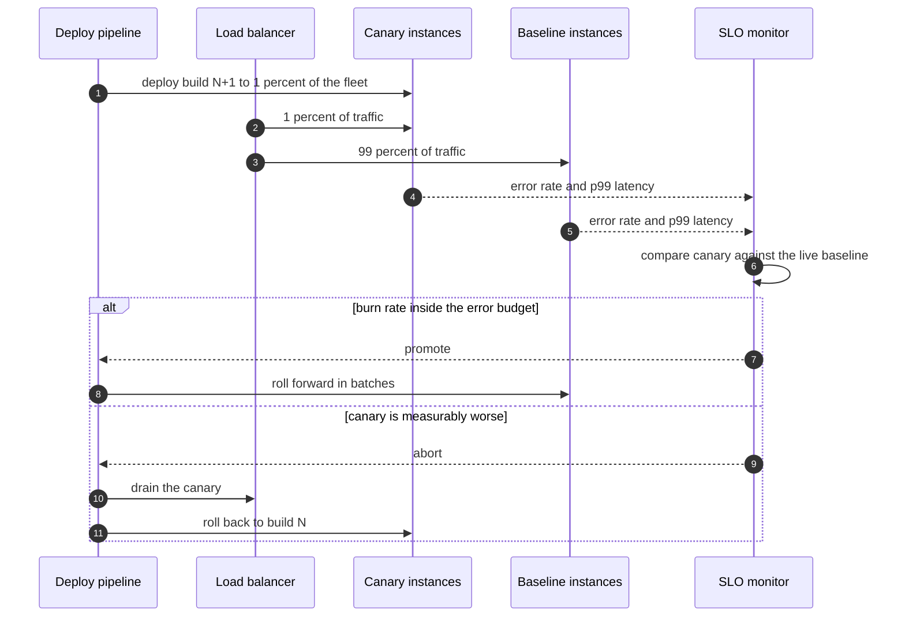

# Deployments, feature flags and data migrations

## TL;DR

- Deploying code and changing data are different problems: code rolls back in seconds, data does not.
- Every schema change is expand, migrate, contract — three releases, each safe on its own, never one.
- Separate deploy from release with a flag, so the risky moment is a config flip you can undo instantly.
- Interviewers ask "how do you ship this?" to see whether you have ever migrated a live table.

## Core concepts

### Rolling, blue-green and canary

**Rolling** replaces instances in batches: cheapest, no extra capacity beyond one batch, and both versions serve traffic at once for the length of the roll — so the new code must tolerate the old code's data and messages. Rollback is another roll, which takes as long as the deploy did.

**Blue-green** runs a whole second environment and flips the load balancer. Rollback is instant because the old fleet is still warm, at the price of double capacity during the switch and a hard problem with shared state: one database serving both colours must accept both schemas, which puts you back in expand-and-contract.

**Canary** sends a slice of traffic to the new build and compares it against the baseline on the metrics that matter — error rate, p99 latency, saturation — before promoting. Size the slice by how fast you need to *see* a regression, not by caution. At 100M requests/day (~1.2k QPS) a 1% canary takes ~12 QPS, so a rare error path needs tens of minutes to produce a signal; 5% at 60 QPS gets you there in minutes. Compare against a concurrently running baseline, never against yesterday.

**A canary is a decision loop, not a deployment step.**

Tie the abort to the error budget from [Observability, SLOs and error budgets](observability-and-slos.md). A 99.9% monthly target allows 43.8 minutes of badness; a release that takes 10 minutes to detect and 2 to roll back spends 12 of them — a quarter of the month on one deploy. That arithmetic, not taste, is what justifies automated canary analysis.

### Feature flags: separating deploy from release

A deploy puts code on machines; a release exposes behaviour to users. A flag separates them, so the risky moment is a configuration change with a sub-second undo rather than a fleet-wide rollout. Flags also enable percentage rollouts, per-tenant enablement, kill switches for expensive code paths, and the dual-write phase below.

Flags are debt. Each one doubles the paths through a function, and two interacting flags give four combinations you are probably not testing. Treat every flag as having an owner and an expiry, delete it in the release after it reaches 100%, and keep permanent operational switches (kill switches, load shedding) in a separate, clearly named category so nobody deletes them. Evaluate flags locally from a cached snapshot with a safe default: a flag service on the request path is a new single point of failure, and it fails at the worst moment.

### Expand and contract schema migrations

The rule that prevents almost every migration outage: **never change a column, add a new one**. Any schema change becomes three deployments.

1. **Expand.** Add the new column or table, nullable, with no constraint and a default that does not rewrite the table. Old code ignores it.
2. **Migrate.** Deploy code that writes both old and new, backfill history, verify, then move reads to the new field.
3. **Contract.** Deploy code that no longer touches the old field, then drop it — one release later, so a rollback in between is still possible.

Order matters in both directions: adding is safe before the code that uses it, removing is safe only after the last code that touched it is gone. Renames are the classic trap — a rename is an expand, a dual write and a contract, never an `ALTER`. On MySQL and PostgreSQL, know which operations take a long lock: adding a nullable column is instant on both, adding a non-null default rewrites the table on older MySQL, and creating an index needs `CONCURRENTLY` on PostgreSQL or a tool like gh-ost on MySQL. Set a short `lock_timeout` and retry rather than letting one migration queue every connection behind it.

### Dual write, backfill, verify, cut over

Moving data — new column, new table, new store, new shard layout — is one pipeline whatever the destination.

**Every phase is reversible until contract; that is the point of the shape.**

```mermaid
flowchart LR
    m_expand["1. Expand<br/>add the new column or store"] --> m_dual["2. Dual write<br/>write old and new behind a flag"]
    m_dual --> m_back["3. Backfill<br/>batched, rate-limited, resumable"]
    m_back --> m_verify["4. Verify<br/>counts, checksums, shadow reads"]
    m_verify -->|"mismatch"| m_back
    m_verify -->|"clean"| m_read["5. Read cutover<br/>read new, keep writing old"]
    m_read --> m_soak["6. Soak<br/>one release, rollback is a flag flip"]
    m_soak --> m_contract["7. Contract<br/>stop writing old, then drop it"]
```

Two phases decide whether this works. The **backfill** must be batched by primary key, rate-limited and resumable from a checkpoint, because it competes with production for the same write budget: a 1B-row table backfilled at 5k rows/s — the low end of a single primary's 5k-20k writes/s — takes 1e9 / 5e3 = 200,000 s, about 2.3 days, and doubling the rate to finish in a day may be exactly what pushes the primary over. Run it as a job you can pause.

The **verification** must be more than a row count. Compare counts per range, checksum a sample of rows, and run **shadow reads**: serve from the old store, read the new one in parallel, and emit a mismatch metric without affecting the response. Cut over only when the mismatch rate has been zero for long enough to cover your slowest write path. Dual writes are not atomic — one store can accept and the other fail — so either write through a transactional outbox or change-data-capture stream ([Transactions, 2PC, sagas and idempotency](transactions-and-distributed-transactions.md)), or accept drift and let the backfill sweep repair it.

### Zero-downtime resharding

Resharding is the same pipeline with routing added. If the key-to-shard mapping is a ring or a directory, only the moved ranges travel ([Partitioning, sharding and consistent hashing](partitioning-and-consistent-hashing.md)); with `hash mod N` almost every key moves, which is why the scheme is chosen before there is data.

The mechanics: mark the range **moving** in the routing table so the old owner forwards or double-writes; copy a snapshot; tail the change log to catch writes made during the copy; when the lag is small, briefly reject or queue writes for that range only, apply the tail, flip ownership, resume. The pause is per range and measured in the hundreds of milliseconds, not a maintenance window. Rate-limit the copy — an unthrottled move slows the source, the source looks unhealthy, and failure detection starts a second migration on top of the first.

### Rollback strategies

Rank your undo options by how fast and how safe they are: flip a flag (seconds, no data risk), roll back the build (minutes, safe only if the schema is still compatible), restore from a backup (hours, and you lose writes). Design so the first option covers most incidents.

Three rules make rollback real. Keep code **backward compatible for one release** in both directions, so version N and N+1 can read each other's data — that is what makes rolling deploys and instant rollbacks legal. Never make an irreversible data change in the same release as the code that depends on it. And rehearse: a rollback path that has never been executed is a hypothesis. Some changes genuinely cannot be rolled back — a dropped column, a consumed queue, an email sent — so identify them explicitly and gate them behind their own flag and their own release.

### Configuration management

Configuration is code with worse tooling and no tests, and it causes a large share of outages because it deploys instantly to everything. Version it, review it, and roll it out the way you roll out code: canary a subset of hosts, watch the same metrics, and keep the previous version one command away.

Distinguish three kinds. **Build-time config** ships with the artifact and is immutable — safest. **Runtime config** (flags, limits, routing) changes without a deploy and needs staged rollout and an audit trail. **Secrets** live in a manager with rotation and short-lived credentials, never in the repository or the image. Validate schema and bounds at load time and refuse to start on a bad value; a typo in a connection limit should fail one canary host, not silently cap the fleet.

## Trade-offs

| Strategy | Extra capacity | Time to detect | Time to roll back | Both versions live | Best for |
|---|---|---|---|---|---|
| Rolling | One batch | Whole roll | Another roll | Yes | Default for stateless services |
| Blue-green | 2x during the flip | After the flip | Instant | Briefly | Big, risky cutovers |
| Canary | One small group | Minutes, measured | Drain the canary | Yes | High-traffic services with good metrics |
| Feature flag | None | Per cohort | Seconds | Yes, in one binary | Behaviour changes, dual writes |
| Expand and contract | None | Per release | Previous release | Yes, by design | Every schema change |

Default to rolling for stateless services and add a canary once traffic is high enough for a small slice to give a signal in minutes — below roughly 1.2k QPS a 1% canary is too quiet to be useful, so canary a whole zone instead. Blue-green earns its double capacity when the change is large and correlated, such as a runtime or framework upgrade, and is worst where state is shared: two colours on one database still need a compatible schema.

Feature flags are the highest-leverage of the four because they decouple the deploy from the release, but they are the easiest to accumulate; budget the deletion in the same sprint as the rollout. For anything touching data, the choice is not really a choice: expand and contract, with dual write and verification, is the only shape that stays reversible at every step. The real decision is how long you soak between phases, and that is set by your slowest client — a mobile app with a two-week upgrade tail means the old field must survive two weeks, not one release.

## In the interview

Bring it up unprompted when your design changes a data model: "This adds a column to a live table, so it is three releases — expand nullable, dual write plus a rate-limited backfill with shadow reads, then contract — and reads flip behind a flag so rollback is instant."

Phrases that signal depth: "deploy and release are separate events"; "the backfill competes with production for the same write budget"; "code stays backward compatible for one release in both directions".

??? question "How do you rename a column on a table with a billion rows and no downtime?"
    Never with an `ALTER`. Add the new column nullable, write both, backfill in batches from a checkpoint, verify with counts and checksums, flip reads behind a flag, soak a release, then drop the old column in the release after that.

??? question "Your canary looks fine and production breaks at 100%. What did the canary miss?"
    Anything proportional to scale or to a cohort: a cache hit rate that only degrades under full load, a lock that contends at 100x the traffic, a downstream quota, a customer segment absent from the slice. Canary by cohort as well as by percentage.

??? question "Dual writes are drifting between the two stores. What do you do?"
    Stop treating dual write as the source of truth: write to one store transactionally with an outbox row, or run change-data-capture off its log. Keep the sweeping backfill running to repair drifted rows, and do not cut over until the mismatch metric has been zero.

??? question "What makes a rollback impossible, and how do you plan for it?"
    Anything that destroys or externalises state: dropped columns, deleted rows, consumed messages, sent emails, charged cards. Give each its own flag and its own release, and write down the manual recovery procedure before shipping.

??? question "How would you move one noisy tenant to its own shard while it serves traffic?"
    Mark the tenant moving in the routing directory so writes are forwarded, copy a snapshot, tail the change log until the lag is small, briefly queue that tenant's writes, apply the tail, flip the entry. Only that entry changed, so nobody else notices.

!!! tip "Interview tip"
    Say which release does what. "Release 1 adds the column, release 2 dual-writes and backfills, release 3 drops the old one" takes ten seconds and separates candidates who have migrated live data from candidates who have read about it.

## Common mistakes

- **One release for schema and code**: the deploy is half-rolled when a query hits an instance whose schema does not match, so errors depend on which host answered. Fix: expand first, use it second, contract third.
- **A backfill with no throttle or checkpoint**: it saturates the primary's write budget, latency spikes, and a restart begins from row one. Fix: batch by primary key, rate-limit, checkpoint, make it pausable.
- **Cutting over on a row count**: counts match while values do not, because the dual write dropped a field. Fix: checksums plus shadow reads with a mismatch metric that must be zero.
- **Immortal flags**: hundreds of stale flags and untested combinations. Fix: an owner and an expiry per flag, deleted in the next release, with permanent kill switches kept separate.
- **Config that deploys everywhere at once**: one bad value reaches the whole fleet in seconds. Fix: version it, validate on load, roll it out to a canary group first.

!!! warning "Common mistake"
    Dropping the old column in the same release that stops writing it. The moment you need to roll back — and that is exactly when you will — the previous build reads a column that no longer exists, so your undo makes the outage worse. Contract is always a separate, later release.

## Self-check

??? question "Why must expand and contract be three deployments rather than two?"
    Because rollback has to be legal at every point. After expand, both versions work; after the migrate release they still do, because the old field is still written. Only then is dropping it safe.

??? question "What does a canary compare against, and why not last week?"
    A baseline group running the previous build on the same traffic at the same moment. A historical window mixes in the daily curve and other deploys, so you cannot attribute a difference to the build.

??? question "How long should you dual-write before cutting over reads?"
    Long enough for the backfill to finish, verification to be clean, and the slowest write path to be covered — batch jobs, retries, clients that sync late. A nightly job makes one night the minimum unit.

??? question "Which rollback is fastest and why is it not always available?"
    A flag flip: it changes no data and takes seconds. It only works while the old path is still in the binary and still compatible with the data written since — which is why irreversible changes get their own release.

??? question "What breaks when you reshard with an unthrottled copy?"
    The copy competes with production I/O, the source slows, failure detection marks it unhealthy, and rebalancing moves more data onto already-loaded neighbours. Rate-limit the copy and gate automatic movement.

## Related

- [Partitioning, sharding and consistent hashing](partitioning-and-consistent-hashing.md) — what moves when the key map changes
- [Replication](replication.md) — why two versions must read each other's data
- [Observability, SLOs and error budgets](observability-and-slos.md) — the signal a canary is judged on
- [Transactions, 2PC, sagas and idempotency](transactions-and-distributed-transactions.md) — outbox and change-data-capture instead of dual writes
- Beyer et al., "Site Reliability Engineering" (O'Reilly 2016), on canarying and error budgets
- Fowler, "BlueGreenDeployment" (2010)
- GitHub Engineering, "gh-ost: online schema migrations for MySQL" (2016)
