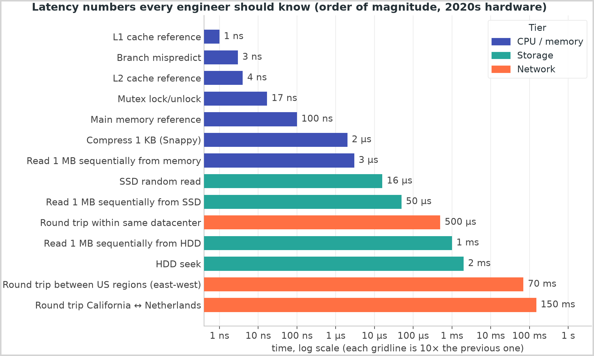
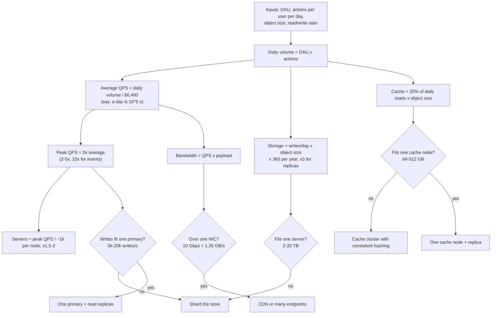

# Back-of-envelope estimation

## TL;DR

- Estimation exists to change the design: four numbers (write QPS, read QPS, storage per year, bandwidth or cache size) decide whether you need a cache, shards, a queue or a CDN.
- Memorise orders of magnitude, not digits: a day is 10^5 s, peak is 3x average, memory to SSD to disk to network is 100 ns, 100 µs, 10 ms, 100 ms.
- Round aggressively, show the arithmetic out loud, and state the decision each number drives in the same breath.

## Core concepts

The estimation step is four minutes long and interviewers grade two things: sound arithmetic and knowing what the results mean. Nobody cares whether the feed does 173k or 175k reads a second; they care that you said "100x the write rate, so precompute feeds and cache the post store". Every constant below comes from the [Latency numbers and estimation tables](../../cheatsheets/latency-and-estimation.md).

### The latency ladder

{ width="800" }

The rungs to know by heart: L1 reference 1 ns, main memory 100 ns, SSD random read 16 µs, 1 MB sequential from SSD 50 µs, same-datacenter round trip 500 µs, HDD seek 2 ms, US coast to coast 70 ms, California to the Netherlands and back 150 ms. Three consequences follow. Memory is ~1,000x faster than SSD for random access and ~100,000x faster than HDD, so a hot path served from disk has already lost. Every network call costs at least ~500 µs, so a read path through a gateway, a service, a cache and a database is ~2 ms of network before any work, and a 200 ms p99 budget affords two cross-region hops or a few hundred in-datacenter ones. Sequential beats random by orders of magnitude on every medium — ~300 GB/s from memory, ~2 GB/s from SSD, ~100-200 MB/s from HDD — which is why logs, LSM trees and Kafka are append-only.

### Powers of two and object sizes

2^10 is 1,024, which you call a thousand; 2^20 a million (1 MB), 2^30 a billion (1 GB), 2^40 a trillion (1 TB). The gap between the binary and decimal reading is 2.4% per step and ~10% at a terabyte, well inside estimation error: use powers of two for memory, powers of ten for storage and network, and never convert in the room. Field sizes: an `int` is 4 B, a `long` or timestamp 8 B, a UUID 16 B (36 characters as text), an ASCII character 1 B. Object sizes to carry: a 280-character tweet is ~300 B of text and ~1 KB once ids, timestamps and counters are stored with it; a user profile row ~1 KB; a chat message 100 B-1 KB; a JSON API response 1-10 KB; a thumbnail 20-50 KB; a compressed photo 200 KB-2 MB; one minute of 1080p video at ~10 Mbps is 10 Mbps x 60 s / 8 = ~75 MB, so say 50-100 MB, and 4K is ~350 MB; a raw metric point is 16 B and ~1.4 B after Gorilla-style compression.

### Availability: nines to downtime

| Availability | Downtime per year | Per month |
|---|---|---|
| 99% | 3.65 days | 7.3 hours |
| 99.9% | 8.76 hours | 43.8 minutes |
| 99.95% | 4.38 hours | 21.9 minutes |
| 99.99% | 52.6 minutes | 4.38 minutes |
| 99.999% | 5.26 minutes | 26.3 seconds |

The formula is (1 - availability) x 31.5M seconds a year. Dependencies in series multiply: two 99.9% services give 99.8%, and a request that touches five of them is 0.999^5 = 99.5%, or 1.8 days a year, which is why a chain of three-nines microservices cannot reach four nines. Redundancy in parallel compounds the other way: two independent 99.9% replicas give 1 - 0.001 x 0.001 = 99.9999%. When the prompt says 99.99%, the answer is redundancy inside every tier, not better components.

### From DAU to QPS, storage, bandwidth and servers

**The estimation procedure: every number feeds a threshold, and the threshold decides a piece of the design.**



Daily volume is DAU times actions per user per day; divide by 86,400 for average QPS — call a day 10^5 seconds — so 1M requests a day is ~12/s, 100M is ~1.2k/s and 10B is ~120k/s. Peak is 2-5x average: 3x unless the prompt says otherwise, 10x for event-driven systems (ticket sales, a live final). Reads come from writes through the ratio: ~10:1 for social, ~100:1 for a URL shortener, ~1:1 for chat. Storage per year is writes per day times object size times 365, x3 for raw disk with replication. Bandwidth is QPS times payload: 10k QPS x 10 KB = 100 MB/s = 0.8 Gbps, under one 10 Gbps NIC (1.25 GB/s). Cache size follows the 80/20 rule, 20% of a day's reads times object size: 100M reads x 1 KB x 0.2 = 20 GB. Server count is peak QPS over per-node capacity with 1.5-2x headroom; the capacities to carry are ~1k QPS for a stateless app server doing real work (10k+ for trivial work or a proxy), ~10k-100k for an Nginx-class load balancer, ~100k ops/s for a single Redis, 5k-20k writes/s and 50k+ indexed reads/s for one relational primary.

### Worked examples: Twitter, YouTube, URL shortener

| System | Given | Arithmetic | Result and the decision it drives |
|---|---|---|---|
| Twitter-like writes | 300M DAU x 0.5 tweets/day | 150M / 86,400 | ~1.7k tweets/s, peak ~5k: fits one relational primary; writes are not the problem |
| Twitter-like reads | 300M DAU x 50 timeline reads/day | 15B / 86,400 | ~175k reads/s, peak ~500k: 100x the writes, so precompute feeds; 500k / 1k per node = 500 app servers before headroom, so a cache serves most reads |
| Twitter-like storage | 150M x 1 KB text; 10% carry 1 MB media | 150 GB/day x 365; 15M x 1 MB | ~55 TB/year of text, sharded within the first year; 15 TB/day of media to object storage and a CDN, never the database |
| YouTube uploads | 5M DAU x 10% upload 1 video/day x 300 MB | 500k x 300 MB | 150 TB/day raw, multiplied by transcoding; 500k / 86,400 = ~5.8 uploads/s x 300 MB = ~1.7 GB/s of ingress, more than one 10 Gbps NIC, so clients upload straight to object storage via presigned URLs |
| URL shortener writes | 100M new URLs/day | 100M / 86,400 | ~1.2k writes/s, peak ~3.5k: one primary or any key-value store |
| URL shortener reads | 100:1 read ratio | 1.2k x 100 | ~120k reads/s, above one Redis instance's ~100k ops/s: at least two cache shards with replicas |
| URL shortener storage | 100M/day x 500 B x 365 x 10 years | 50 GB/day x 3,650 | ~180 TB, ~550 TB with 3 replicas: beyond one 2-20 TB server, so partition by key hash from day one |
| URL shortener cache | 20% of 10B reads x 500 B | 2B x 500 B | ~1 TB/day of hot data, beyond one node: hold the hottest few GB and accept misses on the tail |

Name the shape out loud. Twitter is a ratio problem: 100:1 reads to writes and a 200x fan-out multiplier decide the architecture before a box is drawn. YouTube is a bytes problem: the QPS is tiny and every decision comes from bandwidth and storage. The URL shortener is a hot-key problem: the cache cannot hold a day's reads, so the question is which few GB it should hold.

## Trade-offs

| Level of precision | Time in the room | Error against reality | What it decides well | Use when |
|---|---|---|---|---|
| Order of magnitude only (powers of ten) | ~1 min | 3-10x | Whether something is a problem at all | Sanity checks during requirements |
| Two significant figures, rounded constants (this page) | ~4 min | ~20%, dominated by the inputs | Cache or no cache, shard or no shard, node counts | The estimation step of every round |
| Spreadsheet-grade, exact constants | 10+ min | ~5% on guessed inputs | Nothing beyond the row above | Capacity planning at work, never in an interview |
| Anchoring on a comparable system's public numbers | ~1 min | Depends on memory | Plausibility of your own result | A cross-check, not a substitute |

Two significant figures with rounded constants is the default because it is the coarsest level that still separates the decisions: 1.7k writes/s versus 17k decides whether one primary suffices; 20 GB versus 2 TB of cache decides one node versus a cluster. Anything finer is false precision, because the inputs — DAU, actions per user, object size — were assumptions you made two minutes ago with a 2x error bar of their own. Drop to order of magnitude when sanity-checking a requirement ("10B reads a day is 100k a second, so this needs a cache") or when a result is so far from a threshold that the digits cannot change the answer. Go finer only when a number lands near a threshold — 4.8k writes/s against a 5k primary — and say so: "this is close, so I will assume it exceeds one primary within a year and shard now".

## Python implementation

`Estimator` is a frozen value object for one traffic class: build it from daily volume or DAU, derive the read side with a ratio, and read off the cheatsheet's five numbers:

```python title="code/hld/estimation.py — the Estimator"
--8<-- "code/hld/estimation.py:estimator"
```

The availability helpers turn nines into downtime and show why series dependencies lose a nine while parallel replicas gain three:

```python title="code/hld/estimation.py — nines"
--8<-- "code/hld/estimation.py:availability"
```

The formatters print at most three significant figures in the unit that keeps the mantissa below 1,000. `uv run python -m hld.estimation` prints:

```text
a day is 86,400 s (say 10^5); peak = 3x average

Twitter-like feed: 300M DAU x 0.5 posts = 150M posts/day, x 50 reads = 15B reads/day
  writes   1,736/s avg, 5,208/s peak
  reads    173,611/s avg, 520,833/s peak, 3.47 GB/s of feed pages
  text     150 GB/day, 54.8 TB/year, 164 TB/year with 3 replicas
  media    10% x 1 MB = 15 TB/day
  servers  782 app servers at 1,000 QPS and 1.5x headroom; 79 if a cache makes reads trivial

YouTube uploads: 5M DAU x 10% x 1 video = 500k videos/day x 300 MB
  ingest   5.8 uploads/s avg, 1.74 GB/s in, 5.21 GB/s at peak
  storage  150 TB/day raw, 54.8 PB/year before transcoding multiplies it

URL shortener: 100M new URLs/day, 100:1 reads, 500 B per record
  writes   1,157/s avg, 3,472/s peak
  reads    115,741/s avg, 347,222/s peak
  storage  182 TB over 10 years, 548 TB with 3 replicas
  cache    20% of 10B reads x 500 B = 1 TB of hot data per day (hold the hottest few GB)

availability: 99.9% = 8.76 hours/year; 99.99% = 52.6 minutes/year; 99.999% = 5.26 minutes/year
two 99.9% services in series = 99.8%; in parallel = 99.9999%
```

The demo prints the unrounded arithmetic; the tests assert that each figure lands within 5% of the cheatsheet's spoken version (1,736/s is "~1.7k/s", 520,833/s is "~500k/s"), the rounding you use out loud.

## In the interview

Start by naming the inputs and their source: "From the requirements: 300M DAU, half a post per user per day, 50 feed reads, 1 KB per post, 10% with 1 MB of media. A day is 10^5 seconds and peak is 3x." Then the four numbers — writes, reads, storage, then bandwidth or cache — each finished with its decision.

Phrases that signal depth: "that is 100x the write rate, so the design is read-optimised"; "this lands near the single-primary limit, so I will shard now rather than in a year"; "the QPS is trivial, the bytes are the problem".

??? question "Your cache estimate is 1 TB a day of hot data. Do you buy 1 TB of Redis?"
    No. The 80/20 rule bounds the hot set, but access is Zipfian: the hottest few GB of short URLs take most of the hits. Start with two to four 64 GB nodes, measure the hit ratio, and grow until another node stops raising it.

??? question "The interviewer changes the DAU from 300M to 30M. What changes in your design?"
    Everything divides by 10: ~170 writes/s, ~17k reads/s, 5.5 TB/year. One primary with read replicas holds the posts for years, one Redis node absorbs the reads, and the celebrity path can wait. Say which boxes disappear, not just the numbers.

??? question "Why 3x for peak, and when is it wrong?"
    Traffic follows people being awake, so the busiest hour is a few times the average; 3x is the middle of the 2-5x range. It is wrong for event-driven systems — a ticket sale or a live final can be 10x or more — and for batch loads whose peak is a scheduled job. Ask what drives the traffic before picking the factor.

??? question "How do you estimate the number of servers for a 500k QPS read path?"
    Peak over per-node capacity with headroom: 500k / ~1k QPS per app server x 1.5 is ~750 servers if every read does real work, ~75 if a cache makes it trivial and a node does 10k. The answer is the cache, not the 750 servers.

??? question "How much storage does 150 TB a day of video need after a year, and where does it go?"
    150 TB x 365 is ~55 PB raw, and transcoding to several resolutions multiplies it: object storage with erasure coding, cold tiers for old videos, and a CDN in front so storage reads are a fraction of views.

!!! tip "Interview tip"
    Write the four numbers in a corner of the board and keep them there. Every deep dive should point back at one of them — "we said 500k reads a second, so a single node fails here" — which makes the estimation the foundation of the design rather than a ritual.

## Common mistakes

- **Digits instead of decisions**: a precise table of QPS with no sentence about what it changes, so the interviewer cannot tell whether you understood the numbers. Fix: end every number with "so...".
- **Forgetting peak**: sizing for the average and discovering at minute 35 that the 3x peak breaks the single primary. Fix: peak in the same breath as average, always.
- **Storing bytes you should not store**: 15 TB/day of media in the database, or a day's reads in a cache. Fix: route by size — bytes to object storage and a CDN, hot keys to the cache, rows to the database.
- **Mixing units**: bits and bytes, per second and per day, 2^30 and 10^9 in one line. Fix: write the unit on every number and convert once, out loud.

!!! warning "Common mistake"
    Skipping the estimation because "the numbers are obvious" and designing a sharded, cached, multi-region system for 10M requests a day — 120 a second, which one server handles with room to spare. Overbuilding is as visible as underbuilding: the numbers justify every box, and without them the interviewer reads each box as a guess.

## Self-check

??? question "A service handles 50M requests a day with 10 KB responses. Average QPS, peak QPS and bandwidth?"
    50M / 10^5 = ~500/s average, ~1.5k/s at a 3x peak; 500 x 10 KB = 5 MB/s average, 15 MB/s at peak, far under one NIC.

??? question "How much disk does 2B chat messages a day at 100 B each use in a year, with three replicas?"
    2B x 100 B = 200 GB/day; x 365 = ~73 TB/year; x3 = ~220 TB of raw disk, so a sharded store from the start.

??? question "Two services at 99.95% in series: what availability, and how much downtime a year?"
    0.9995 x 0.9995 = 99.9%, which is 8.76 hours a year: the pair's downtime is double either service's 4.38 hours.

??? question "Why is a same-datacenter round trip the number to remember from the latency ladder?"
    It prices every hop at ~500 µs and turns a diagram into a latency budget: four hops are 2 ms before any work; a cross-region hop adds 70-150 ms.

??? question "What do you cache for a system with 10B reads a day of 500 B objects?"
    The 80/20 rule gives 10B x 0.2 x 500 B = 1 TB a day, too much for one node, so hold the hottest few GB, rely on Zipfian access for the hit ratio, and measure the rest.

## Related

- [Latency numbers and estimation tables](../../cheatsheets/latency-and-estimation.md) — every constant on this page, in one place
- [The 45-minute HLD framework](interview-framework.md) — where the four minutes of estimation sit in the round
- [Caching and CDNs](caching-and-cdn.md) — turning the 80/20 rule into a cache design
- [Partitioning, sharding and consistent hashing](partitioning-and-consistent-hashing.md) — what to do when storage exceeds one server
- Jeff Dean, "Numbers Everyone Should Know" (Stanford CS295 talk, 2010)
- Colin Scott, "Latency Numbers Every Programmer Should Know" (interactive, updated yearly)
- Brendan Gregg, *Systems Performance* (2nd ed., 2020), chapter 2 latency tables
