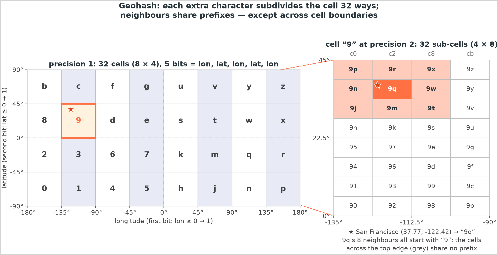
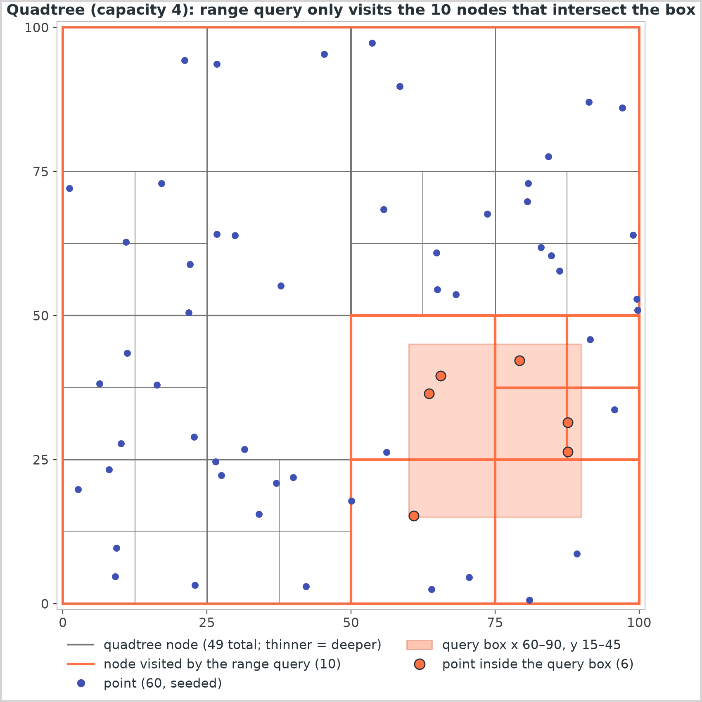
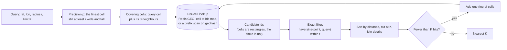
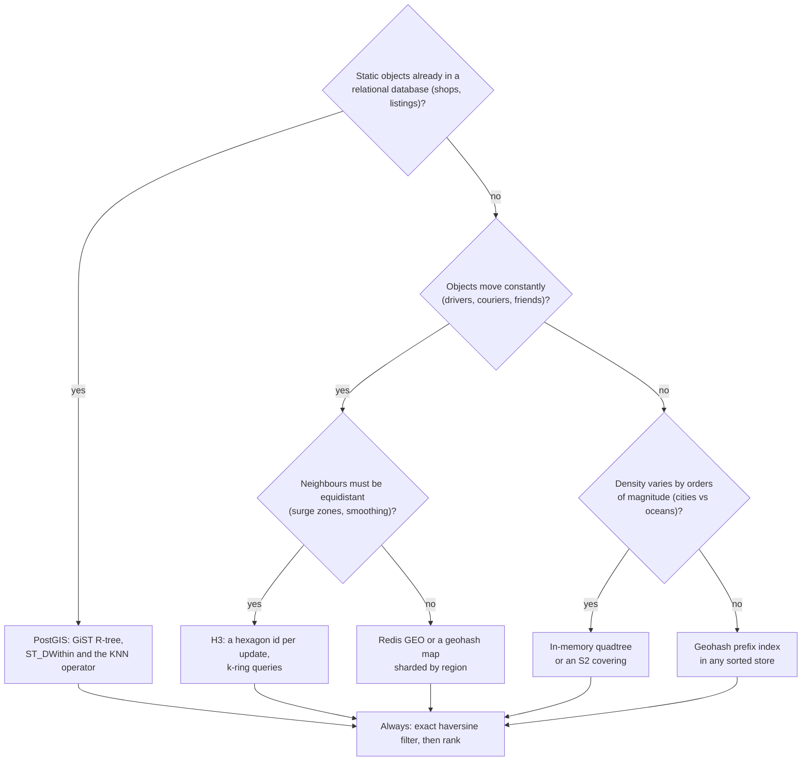

# Geospatial indexing

## TL;DR

- An ordinary index sorts one dimension; "within 2 km" has two, so geospatial indexes flatten the map into cells or boxes that a sorted index can scan.
- Every proximity query is one pattern: cover the radius with cells, fetch candidates, filter by exact haversine distance, rank.
- Geohash for key-value stores, a quadtree for skewed density in memory, PostGIS for static relational data, H3 when neighbours must be equidistant.
- Expect it in Yelp, Uber and Nearby Friends: "find the nearest drivers" arrives within five minutes.

## Core concepts

Location breaks the assumption behind every index you have used: that keys sort. A B-tree on `(lat, lon)` scans a latitude band and checks longitude row by row, so a 2 km search in San Francisco reads every point in a band that crosses the whole Bay Area. The schemes below all do one thing: turn two coordinates into one sortable key, or into a tree whose boxes prune the search.

### Latitude, longitude and haversine

Latitude runs -90 to 90 degrees, longitude -180 to 180. A degree of latitude is ~111 km everywhere (40,000 km of circumference / 360); a degree of longitude shrinks with the cosine of the latitude: 111 km at the equator, 88 km in San Francisco, 56 km at 60 degrees north. Treating degrees as a flat plane therefore stretches east-west distances by 1/cos(lat), 27% at San Francisco, and breaks at the antimeridian, where 179.9 and -179.9 are 0.2 x 111 = 22 km apart, not 40,000. The haversine formula returns the great-circle distance with a handful of trigonometric calls (San Francisco to New York: 4,129 km). The code below uses it as the exact filter; a planar approximation is tolerable only inside a city-sized window.

### Bounding-box queries

The index-friendly question is a rectangle: `lat BETWEEN a AND b AND lon BETWEEN c AND d`. With a B-tree on latitude the database scans the whole band and filters longitude afterwards: a band holding 500k rows costs 500k / 50k indexed reads/s = 10 s on one primary. A composite index on `(lat, lon)` does not help, because longitude is sorted only *within equal latitudes*. A circle of radius r fits in the box `lat +/- r/111 km`, `lon +/- r/(111 km x cos(lat))`, so every scheme below first finds the box's candidates and then applies haversine: the box is the approximation, the filter restores exactness.

### Geohash: base32 cells, the precision table, neighbours and the boundary problem

A geohash interleaves bisections of longitude and latitude, longitude first: the first bit says "east of 0 degrees", the second "north of 0", the third "east of the midpoint of what is left", and so on. Every five bits become one base32 character (digits and letters without a, i, l, o), so each extra character splits a cell 32 ways and a prefix *is* a cell: `9q8yy` is the cell containing San Francisco, and everything in `9q8yyk` lies inside it. The figure shows two levels: cell `9` covers a quarter of North America; `9q`, one of its 32 sub-cells, holds the city.

{ width="800" }

The precision table follows from the bit counts instead of memory: precision p carries 5p bits, ceil(5p/2) for longitude and floor(5p/2) for latitude, so a cell is 40,000 km / 2^lon_bits wide and 20,000 km / 2^lat_bits tall.

| Precision | Cell at the equator (width x height) | Resolves |
|---|---|---|
| 1 | 5,004 km x 5,004 km | a continent |
| 2 | 1,251 km x 625 km | a country |
| 3 | 156 km x 156 km | a region |
| 4 | 39 km x 20 km | a metro area |
| 5 | 4.9 km x 4.9 km | a district |
| 6 | 1.2 km x 611 m | a neighbourhood |
| 7 | 153 m x 153 m | a street |
| 8 | 38 m x 19 m | a building |
| 9 | 4.8 m x 4.8 m | a parking space |

Odd precisions give square cells, even ones are twice as wide as tall, and width shrinks by cos(latitude): a precision-5 cell is 3.9 km wide in San Francisco. Precision 6 tiles the planet with 32^6 = 2^30, about a billion cells, so a cell id is a cheap key in any store.

Two properties carry the design. Prefix sharing makes "the points in this cell" a prefix scan on any sorted index (`geohash LIKE '9q8yy%'`, or a sorted set keyed by geohash). The boundary problem is the catch: two points 22 m apart on either side of the 45th parallel encode as `c20bh2` and `9rbzur`, sharing no character, because a bisection line runs between them. Nearness implies a shared prefix in one direction only, so every proximity query reads the query cell *and its eight neighbours*. Neighbours are arithmetic: cells at one precision have the same size in degrees, so stepping the cell centre by one width or height and re-encoding yields the adjacent cell, wrapping longitude at the antimeridian and returning nothing beyond a pole.

### Quadtree

A quadtree is the adaptive alternative: a square that splits into four quadrants whenever an insert would push a leaf past its capacity, recursively. Dense areas get deep and empty areas stay shallow, so a city and the ocean beside it cost what they contain, not a grid's worth of empty cells. A range query descends only into nodes whose box intersects the query rectangle: in the figure, 60 points at capacity 4 build 49 nodes, and the box x 60-90, y 15-45 visits 10 of them to find its 6 points, where a scan would test all 60.

{ width="800" }

Nearest-neighbour search reuses the boxes with a priority queue: push the root, pop the closest item, expand nodes into children keyed by the distance to their box and leaves into points keyed by exact distance; the k-th point popped is the k-th nearest, because everything still queued is farther. Sizing is easy: 200M businesses at 8 B per coordinate plus an 8 B id is 200M x 24 B = 4.8 GB, inside one server's 64-512 GB, so the tree is built in memory at startup and replicated as a read-only service. The costs are the rebuild, a lock or copy-on-write for updates, and the lack of a stable cell id to store or shard by, which is why moving objects usually get a grid and static ones a tree.

### R-trees

An R-tree is the balanced, disk-friendly tree of bounding rectangles behind PostGIS's GiST indexes and the spatial indexes of MySQL and SQLite: each node stores the smallest rectangle enclosing its children, leaves hold objects with their extents, and an insert picks the subtree whose rectangle grows least. Rectangles overlap, so a search may follow several paths, but it is the only family here that indexes shapes (roads, delivery zones, polygons) rather than points. Name it when the data are geometries or already live in a relational database.

### S2 and H3

Both fix the flaws of a lat/lon grid. S2 (Google) projects the sphere onto the six faces of a cube, subdivides each face as a quadtree for 30 levels and orders the leaves along a Hilbert curve, so a 64-bit cell id's numeric neighbours are spatial neighbours far more often than with geohash's Z-order, and cells at one level have near-uniform size with no polar distortion. Its region coverer expresses any shape as a few cells of mixed levels, which is how Google Maps and MongoDB's 2dsphere index turn "inside this polygon" into id range scans. H3 (Uber) tiles the globe with hexagons at 16 resolutions (12 pentagons are unavoidable): every neighbour of a hexagon is the same distance away, so a k-ring is a near-circle, which is what surge pricing, supply-demand smoothing and ETA buckets want, where a square grid's diagonal neighbours sit 41% farther than its edge neighbours. H3's hierarchy is approximate (a child is not exactly inside its parent), so it is an aggregation grid more than a storage key.

### Redis GEO and PostGIS

Redis GEO stores members in a sorted set whose score is a 52-bit geohash integer: `GEOADD drivers lon lat id` is one sorted-set insert, and `GEOSEARCH ... BYRADIUS 2 km` computes the covering cells, scans their score ranges and applies the exact distance before returning, inside one ~100k ops/s instance. A fleet of 100k online drivers reporting every 4 s is 100k / 4 = 25k writes/s, a quarter of one instance, but one key lives on one shard, so key the sets by city or region and query the regions the radius touches. PostGIS adds a `geography` column with a GiST (R-tree) index: `ST_DWithin(location, point, 2000)` uses the index for the box and the exact check for the circle, and the `<->` operator returns k nearest neighbours through the index. One primary serves 50k+ indexed reads/s and read replicas add more; it is the right home for businesses, listings and polygons, and the wrong one for 25k location updates a second.

### The proximity query pattern

Whatever the index, the query is: choose the finest precision whose cell is at least the radius, so the query cell plus its eight neighbours contain the whole circle (a 2 km search in San Francisco picks precision 5, 3.9 km x 4.9 km cells); fetch the candidates of those 9 cells; keep the ones within the radius by haversine; sort by distance and cut at the limit. A fixed-precision index works the same way with more cells: rings = ceil(r / cell size), 81 cells for 2 km at precision 6. Either way the candidate set is a few cells, never the table. Two refinements matter in practice: when the first ring returns fewer than K results, widen by one ring rather than jumping to the city; and store the cell id with each moving object, so a move is "remove from the old cell, add to the new" and a move that stays inside its cell touches nothing.

**Cover the radius with cells, fetch candidates, filter exactly, then rank.**



**Pick the index from what moves and what is queried.**



## Trade-offs

| Index | Cells | Adapts to density | Neighbours | Moving objects | Shapes | Typical home |
|---|---|---|---|---|---|---|
| Geohash | Rectangles, 2:1 at even precisions | No | 8 by arithmetic; boundary problem | Cheap: re-encode, move one key | No | Key-value stores, Redis GEO, prefix indexes |
| Quadtree | Squares split on demand | Yes | Tree walk | Delete and reinsert under a lock | Points only | In-memory service, rebuilt from a snapshot |
| R-tree | Bounding rectangles | Yes | Overlapping paths | Moderate | Yes | PostGIS, MySQL, SQLite |
| S2 | Near-uniform squares on a cube, Hilbert-ordered | Mixed-level coverings | Cell id arithmetic | Cheap | Via coverings | Google Maps, MongoDB 2dsphere |
| H3 | Hexagons (12 pentagons) | 16 resolutions | Equidistant k-ring | Cheap | Approximate | Uber analytics, surge, ETA buckets |

Choose from the write rate and the shape of the data. Static points that already sit in a relational database belong in PostGIS: one index, exact results, polygons when you need them, and 50k+ indexed reads/s on one primary before you add replicas. Objects that move every few seconds want a cell key you can overwrite cheaply: a geohash or Redis GEO set keyed by region absorbs 25k updates/s on a quarter of one instance, and the boundary problem is handled by reading nine cells. When density is wildly uneven and the set fits in memory, a quadtree answers range and nearest-K queries with a handful of node visits and no empty cells; its price is a rebuild on restart and a lock on updates, so pair it with a periodic snapshot and treat it as a read-mostly service. Reach for S2 when you need polygons over a spherical grid at global scale, and for H3 when the question is about neighbourhoods rather than points: surge pricing, demand heatmaps and anything that compares a cell with its ring. Whatever you pick, the exact distance filter is not optional: the index narrows, it never decides.

## Python implementation

`encode` bisects longitude and latitude alternately and packs five bits per base32 character; `bounds` replays the bits to recover the cell and `decode` returns its centre:

```python title="code/hld/geohash.py — encode, bounds, decode"
--8<-- "code/hld/geohash.py:encode"
```

`adjacent` steps one cell in any of eight directions, `cell_size_km` derives the precision table, `precision_for_radius_km` turns a search radius into a precision and `cells_covering` lists the cells a radius needs at a fixed precision:

```python title="code/hld/geohash.py — neighbours, cell sizes, coverings"
--8<-- "code/hld/geohash.py:neighbors"
```

`haversine_km` is the exact filter every scheme ends with:

```python title="code/hld/geohash.py — haversine"
--8<-- "code/hld/geohash.py:haversine"
```

`GeoIndex` is the query pattern itself: a cell-to-ids map and an id-to-point map under one lock, candidates from the covering cells, haversine, sort, limit. The Uber and Yelp case studies build on it:

```python title="code/hld/geohash.py — the proximity index"
--8<-- "code/hld/geohash.py:index"
```

`uv run python -m hld.geohash` prints:

```text
encode(37.7749, -122.4194) by precision: 9 | 9q | 9q8 | 9q8y | 9q8yy | 9q8yyk | 9q8yyk8 | 9q8yyk8y
decode('9q8yy') = (37.7710, -122.4097); the cell is 3.9 km x 4.9 km, so the error is at most half of that
precision table, width x height at the equator (width shrinks by cos(lat): x0.79 at SF):
  1: 5,004 km x 5,004 km     5: 4.9 km x 4.9 km
  2: 1,251 km x 625 km       6: 1.2 km x 611 m
  3: 156 km x 156 km         7: 153 m x 153 m
  4: 39 km x 20 km           8: 38.2 m x 19.1 m
neighbours of 9q8yy: N=9q8zn, NE=9q8zp, E=9q8yz, SE=9q8yx, S=9q8yw, SW=9q8yt, W=9q8yv, NW=9q8zj
boundary problem: c20bh2 and 9rbzur are 22 m apart and share no prefix
search 2 km around Union Square: precision 5 (3.9 km x 4.9 km cells), 9 cells, 3 of 7 places are candidates
   0.4 km  Powell St station
   1.5 km  Ferry Building
   1.6 km  Coit Tower
  never read (outside the 9 cells): Golden Gate Bridge (7 km), Oakland, Jack London Sq (11 km), Berkeley campus (16 km), Palo Alto (45 km)
```

The quadtree starts with its geometry: `Rect` distinguishes half-open node boxes from closed query boxes and computes the distance from a point to a box, which the nearest-neighbour search orders its heap by:

```python title="code/hld/quadtree.py — points and boxes"
--8<-- "code/hld/quadtree.py:geometry"
```

`QuadTree.insert` splits a full leaf on the way down, `query` prunes by box intersection and reports how many nodes it visited, and `nearest` runs a best-first search over one heap that holds nodes and points alike:

```python title="code/hld/quadtree.py — insert, range query, nearest K"
--8<-- "code/hld/quadtree.py:quadtree"
```

`uv run python -m hld.quadtree` prints:

```text
60 seeded points in a 100 x 100 box, capacity 4: 49 nodes, depth 3
range query x 60-90, y 15-45: 6 points, 10 of 49 nodes visited (a scan would test all 60 points)
  (60.9, 15.3), (63.6, 36.5), (65.5, 39.6), (79.2, 42.2), (87.6, 26.3), (87.6, 31.5)
nearest 3 to (50, 50):
  p17  (37.9, 55.2) at 13.2
  p7   (65.0, 54.5) at 15.6
  p27  (64.8, 60.9) at 18.4
200 more points inside a 2 x 2 patch around (10, 10): 217 nodes, depth 10; only that branch got deeper
same range query elsewhere: 6 points, 10 nodes visited; the patch itself: 201 points, 151 nodes visited
nearest to (10, 10): c10 (dense branch, still a heap walk)
```

The first two lines are the figure; the last three show the adaptivity: 200 points in a 2 x 2 patch deepen one branch to depth 10 and leave the range query elsewhere at the same 10 node visits.

## In the interview

Say where coordinates live and how they are queried in one breath, when you reach the data model: "Drivers publish a location every 4 s; each goes into a Redis GEO set keyed by city. Matching asks for drivers within 2 km: the query cell plus its eight neighbours, an exact distance filter, the nearest K." That sentence covers the index, the sharding, the boundary problem and the ranking before anyone asks.

Phrases that signal depth: "the cell plus its eight neighbours, because of the boundary problem"; "precision from the radius: the finest cell still wider than r"; "the index returns candidates, haversine returns answers".

??? question "Why not index latitude and longitude as two ordinary columns?"
    A B-tree sorts by one key. An index on `(lat, lon)` scans every row in the latitude band and filters longitude afterwards, so a 2 km query pays for the whole band, 10 s for 500k rows at 50k indexed reads/s. Geohash, quadtrees and R-trees exist to make both dimensions prune at once.

??? question "A driver sits on a cell boundary. Do you miss them?"
    Not if you read the eight neighbours: two points 22 m apart can encode as `c20bh2` and `9rbzur`, so the covering always includes the adjacent cells and the haversine filter removes the extras. Geohash neighbours are arithmetic on the cell centre, so the extra cost is eight more key lookups.

??? question "The first ring returns three drivers but the rider wants ten. What now?"
    Widen by one ring at the same precision (25 cells, then 49) or drop one precision level and repeat; the exact filter keeps the results correct. A quadtree answers this natively with a best-first nearest-K search, which is why dispatchers that need "nearest ten" often keep one in memory per city.

??? question "How do you shard a global proximity index?"
    By region: a geohash prefix or a city id is the partition key, so a query touches one shard unless the radius crosses a border, in which case it fans out to two and merges. Keep hot cities on their own shards and use finer cells there; a single Redis key would cap the product at one ~100k ops/s instance.

??? question "Drivers move every few seconds. How do you keep the index fresh without thrashing it?"
    `GEOADD` is an upsert, one sorted-set write per update, and 100k drivers every 4 s is 25k writes/s. Store the current cell with the driver so an update that stays inside the cell is a no-op on the index, and attach a TTL so a driver that stops reporting disappears from results.

!!! tip "Interview tip"
    Derive one cell size aloud instead of quoting a table: "precision 6 is 15 longitude bits, 40,000 km / 2^15 = 1.2 km wide". It proves you understand the encoding, and the interviewer stops testing whether you memorised it.

## Common mistakes

- **Reading only the query cell**: results vanish for users near a cell edge. Fix: cell plus eight neighbours, always, then the exact filter.
- **Euclidean distance on degrees**: east-west distances are inflated by 1/cos(lat), 27% in San Francisco, and the antimeridian becomes a 40,000 km gap. Fix: haversine for the filter, a planar approximation only inside a city-sized window.
- **A precision chosen without the radius**: precision 8 for a 2 km search covers the circle with thousands of 38 m x 19 m cells; precision 3 reads a 156 km region. Fix: the finest precision whose cell is at least r, or rings = ceil(r / cell).
- **Moving objects in PostGIS or a per-update quadtree rebuild**: 25k location updates a second against a GiST index on one primary. Fix: a cell key in Redis or an in-memory grid, with the relational store for static attributes.
- **One global key**: every driver on the planet in one Redis sorted set, so one ~100k ops/s instance is the ceiling. Fix: key by region and fan out only when the radius crosses a border.

!!! warning "Common mistake"
    Returning the cells' contents as the answer. Cells are rectangles and the circle is not: the nine cells around a 2 km query at precision 5 cover 9 x 3.9 x 4.9 = 172 km², fourteen times the 12.6 km² circle, so without the haversine pass most of what you return is outside the radius and the ranking is wrong. The index narrows; the distance decides.

## Self-check

??? question "How large is a precision-6 geohash cell, and how many are there?"
    15 longitude bits and 15 latitude bits: 40,000 km / 2^15 = 1.2 km wide, 20,000 km / 2^15 = 611 m tall at the equator; 32^6 = 2^30, about a billion cells.

??? question "Why are even-precision cells twice as wide as they are tall?"
    Bits alternate longitude first, so even precisions split both axes the same number of times, and longitude spans 360 degrees against latitude's 180. Odd precisions give longitude one extra split and square cells.

??? question "What is the pruning rule in a quadtree range query?"
    Descend into a node only if its box intersects the query rectangle; at a leaf, test its points. In the figure that is 10 of 49 nodes for 6 of 60 points.

??? question "Why does Uber use hexagons for surge pricing?"
    Every neighbour of a hexagon is the same distance away, so a k-ring is a near-circle and smoothing across neighbours treats them equally; on a square grid diagonal neighbours are 41% farther than edge neighbours.

??? question "What does Redis store when you call GEOADD?"
    A sorted-set member whose score is a 52-bit interleaved geohash of the coordinates; a radius search scans the score ranges of the covering cells and filters by exact distance before replying.

## Related

- [Design Yelp (proximity service)](../case-studies/proximity-service.md) — static businesses, read-heavy, the geohash index end to end
- [Design Uber (with a DoorDash variant)](../case-studies/ride-sharing.md) — moving drivers, Redis GEO keyed by city, nearest-K matching
- [Design Nearby Friends](../case-studies/nearby-friends.md) — location updates over WebSockets and a pub/sub fan-out per cell
- [Partitioning, sharding and consistent hashing](partitioning-and-consistent-hashing.md) — regions and cell prefixes as partition keys
- [Storage engines and indexing](storage-engines-and-indexing.md) — why a composite B-tree cannot prune two dimensions
- Finkel and Bentley, "Quad Trees: A Data Structure for Retrieval on Composite Keys" (Acta Informatica, 1974)
- Guttman, "R-trees: A Dynamic Index Structure for Spatial Searching" (SIGMOD 1984)
- Uber Engineering, "H3: Uber's Hexagonal Hierarchical Spatial Index" (2018)
