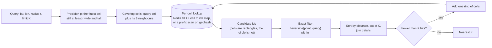
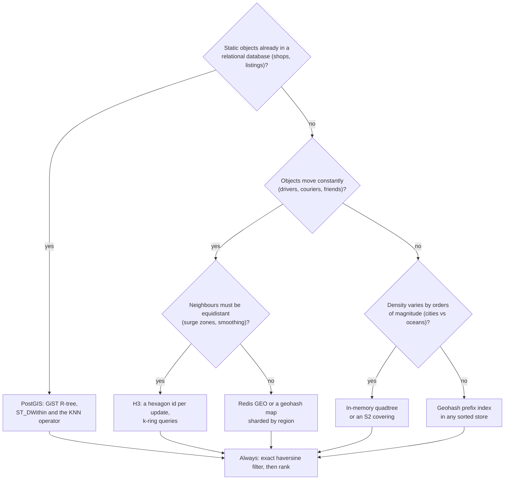

# Geospatial indexing

## TL;DR

- An ordinary index sorts one dimension; "within 2 km" has two, so geospatial indexes flatten the map into cells or boxes a sorted index can scan.
- Every proximity query is one pattern: cover the radius with cells, fetch candidates, filter by exact haversine distance, rank.
- Geohash for key-value stores, an in-memory quadtree for skewed density, PostGIS for static relational data, H3 when neighbours must be equidistant.
- Expect it in Yelp, Uber and Nearby Friends within five minutes.

## Core concepts

Every scheme below does one thing: turn two coordinates into one sortable key, or into a tree whose boxes prune the search.

### Latitude, longitude and haversine

A degree of latitude is ~111 km everywhere (40,000 km of circumference / 360); a degree of longitude shrinks with the cosine of the latitude: 111 km at the equator, 88 km in San Francisco, 56 km at 60 degrees north. Treating degrees as a flat plane therefore stretches east-west distances by 1/cos(lat), 27% at San Francisco, and breaks at the antimeridian, where 179.9 and -179.9 are 0.2 x 111 = 22 km apart, not 40,000. Haversine returns the great-circle distance in a handful of trigonometric calls (San Francisco to New York: 4,129 km) and is the exact filter every scheme below ends with.

### Bounding-box queries

The index-friendly question is a rectangle: `lat BETWEEN a AND b AND lon BETWEEN c AND d`. A B-tree on latitude scans the whole band and filters longitude afterwards — 500k rows at 50k indexed reads/s is 10 s on one primary — and a composite index on `(lat, lon)` does not help: longitude is sorted only *within equal latitudes*. A circle of radius r fits the box `lat +/- r/111 km`, `lon +/- r/(111 km x cos(lat))`: every scheme below narrows to the box, then applies haversine.

### Geohash: base32 cells, the precision table, neighbours and the boundary problem

A geohash interleaves bisections of longitude and latitude, longitude first: bit 1 is "east of 0 degrees", bit 2 "north of 0", bit 3 "east of the midpoint of what is left". Every five bits become one base32 character (digits and letters without a, i, l, o), so each extra character splits a cell 32 ways and a prefix *is* a cell: everything in `9q8yyk` lies inside `9q8yy`, the cell containing San Francisco.

{ width="800" }

Derive the precision table rather than memorising it: precision p carries 5p bits, ceil(5p/2) for longitude and floor(5p/2) for latitude, so a cell is 40,000 km / 2^lon_bits wide and 20,000 km / 2^lat_bits tall.

| Precision | Cell at the equator (width x height) | Resolves |
|---|---|---|
| 1 | 5,004 km x 5,004 km | a continent |
| 2 | 1,251 km x 625 km | a country |
| 3 | 156 km x 156 km | a region |
| 4 | 39 km x 20 km | a metro area |
| 5 | 4.9 km x 4.9 km | a district |
| 6 | 1.2 km x 611 m | a neighbourhood |
| 7 | 153 m x 153 m | a street |
| 8 | 38 m x 19 m | a building |
| 9 | 4.8 m x 4.8 m | a parking space |

Odd precisions give square cells, even ones are twice as wide as tall, and width shrinks by cos(latitude): precision 5 is 3.9 km wide in San Francisco. Precision 6 tiles the planet with 32^6 = 2^30 cells — a cheap key in any store.

Two properties carry the design. Prefix sharing makes "the points in this cell" a prefix scan on any sorted index (`geohash LIKE '9q8yy%'`). The boundary problem is the catch: two points 22 m apart across the 45th parallel encode as `c20bh2` and `9rbzur`, sharing no character, because a bisection line runs between them. A shared prefix implies nearness, not the reverse, so every proximity query reads the query cell *and its eight neighbours*. Neighbours are arithmetic — cells at one precision are equal in degrees, so step the centre by one width or height and re-encode, wrapping at the antimeridian.

### Quadtree

A quadtree is the adaptive alternative: a square that recursively splits into four quadrants whenever an insert would push a leaf past its capacity. Dense areas get deep and empty ones stay shallow, so a city and the ocean beside it cost what they contain, not a grid's worth of empty cells. A range query descends only into nodes whose box intersects the query rectangle: in the figure, 60 points at capacity 4 build 49 nodes and a query box visits 10 of them for its 6 points.

{ width="800" }

Nearest-neighbour search reuses the boxes with a priority queue: pop the closest item, expanding nodes into children keyed by the distance to their box and leaves into points keyed by exact distance; the k-th point popped is the k-th nearest, because everything still queued is farther. Sizing is easy: 200M businesses x 24 B (two 8 B coordinates and an 8 B id) = 4.8 GB, inside one server's 64-512 GB, so build it in memory at startup and replicate it as a read-only service. Its costs: the rebuild, a lock or copy-on-write for updates, and no stable cell id to store or shard by — which is why moving objects get a grid and static ones a tree.

### R-trees

An R-tree is the balanced, disk-friendly tree of bounding rectangles behind PostGIS's GiST indexes and the spatial indexes of MySQL and SQLite: each node holds the smallest rectangle enclosing its children and an insert picks the subtree whose rectangle grows least. Rectangles overlap, so a search may follow several paths — the price of being the only family here that indexes shapes (roads, delivery zones, polygons) rather than points.

### S2 and H3

Both fix a lat/lon grid's flaws. S2 (Google) projects the sphere onto the six faces of a cube, subdivides each face as a quadtree for 30 levels and orders the leaves along a Hilbert curve, so a 64-bit cell id's numeric neighbours are usually spatial neighbours, unlike geohash's Z-order, and cells at one level are near-uniform with no polar distortion. Its region coverer expresses any shape as a few mixed-level cells, turning "inside this polygon" into id range scans (Google Maps, MongoDB's 2dsphere). H3 (Uber) tiles the globe with hexagons at 16 resolutions (12 pentagons are unavoidable): every neighbour is equidistant, so a k-ring is a near-circle, where a square grid's diagonals sit 41% farther than its edges. Its hierarchy is approximate — a child is not exactly inside its parent — so it is an aggregation grid, not a storage key.

### Redis GEO and PostGIS

Redis GEO stores members in a sorted set scored by a 52-bit geohash integer: `GEOADD drivers lon lat id` is one sorted-set insert and `GEOSEARCH ... BYRADIUS 2 km` runs the whole pattern below, inside one ~100k ops/s instance. 100k online drivers reporting every 4 s is 100k / 4 = 25k writes/s, a quarter of that — but one key lives on one shard, so key the sets by city and query the regions the radius touches. PostGIS adds a `geography` column with a GiST (R-tree) index: `ST_DWithin(location, point, 2000)` uses the index for the box and an exact check for the circle, and `<->` returns k nearest neighbours. One primary serves 50k+ indexed reads/s before replicas: the right home for businesses, listings and polygons, the wrong one for 25k location updates a second.

### The proximity query pattern

Whatever the index, the pattern is the flowchart below: the candidate set is always a few cells, never the table. Two things it cannot show: a fixed-precision index widens rather than choosing a precision (rings = ceil(r / cell size), 81 cells for 2 km at precision 6), and storing each moving object's current cell id makes a move "remove from the old cell, add to the new" — free when it stays put.

**Cover the radius with cells, fetch candidates, filter exactly, then rank.**



**Pick the index from what moves and what is queried.**



## Trade-offs

| Index | Cells | Adapts to density | Neighbours | Moving objects | Shapes | Typical home |
|---|---|---|---|---|---|---|
| Geohash | Rectangles, 2:1 at even precisions | No | 8 by arithmetic; boundary problem | Cheap: re-encode, move one key | No | Key-value stores, Redis GEO, prefix indexes |
| Quadtree | Squares split on demand | Yes | Tree walk | Delete and reinsert under a lock | Points only | In-memory service, rebuilt from a snapshot |
| R-tree | Bounding rectangles | Yes | Overlapping paths | Moderate | Yes | PostGIS, MySQL, SQLite |
| S2 | Near-uniform squares on a cube, Hilbert-ordered | Mixed-level coverings | Cell id arithmetic | Cheap | Via coverings | Google Maps, MongoDB 2dsphere |
| H3 | Hexagons (12 pentagons) | 16 resolutions | Equidistant k-ring | Cheap | Approximate | Uber analytics, surge, ETA buckets |

Choose from the write rate and the shape of the data. Static points already in a relational database belong in PostGIS: one index, exact results, polygons when you need them. Objects that move every few seconds want a cell key you can overwrite cheaply — a geohash or a Redis GEO set keyed by region — plus nine cells to defuse the boundary problem. When density is wildly uneven and the set fits in memory, a quadtree answers range and nearest-K queries in a handful of node visits with no empty cells, paid for with a rebuild on restart and a lock on updates: snapshot it periodically, treat it as read-mostly. Reach for S2 for polygons over a spherical grid at global scale, and for H3 when the question is about neighbourhoods rather than points. Whatever you pick, the exact distance filter is not optional: the index narrows, it never decides.

## Python implementation

`encode` bisects longitude and latitude alternately, five bits per base32 character; `bounds` replays those bits and `decode` returns the cell centre:

```python title="code/hld/geohash.py — encode, bounds, decode"
--8<-- "code/hld/geohash.py:encode"
```

`adjacent` steps one cell in any of eight directions; `cell_size_km`, `precision_for_radius_km` and `cells_covering` turn radii into precisions and coverings:

```python title="code/hld/geohash.py — neighbours, cell sizes, coverings"
--8<-- "code/hld/geohash.py:neighbors"
```

`haversine_km` is the exact filter:

```python title="code/hld/geohash.py — haversine"
--8<-- "code/hld/geohash.py:haversine"
```

`GeoIndex` is the query pattern itself: cell-to-ids and id-to-point maps under one lock, then candidates, haversine, sort, limit:

```python title="code/hld/geohash.py — the proximity index"
--8<-- "code/hld/geohash.py:index"
```

`uv run python -m hld.geohash` prints:

```text
encode(37.7749, -122.4194) by precision: 9 | 9q | 9q8 | 9q8y | 9q8yy | 9q8yyk | 9q8yyk8 | 9q8yyk8y
decode('9q8yy') = (37.7710, -122.4097); the cell is 3.9 km x 4.9 km, so the error is at most half of that
precision table, width x height at the equator (width shrinks by cos(lat): x0.79 at SF):
  1: 5,004 km x 5,004 km     5: 4.9 km x 4.9 km
  2: 1,251 km x 625 km       6: 1.2 km x 611 m
  3: 156 km x 156 km         7: 153 m x 153 m
  4: 39 km x 20 km           8: 38.2 m x 19.1 m
neighbours of 9q8yy: N=9q8zn, NE=9q8zp, E=9q8yz, SE=9q8yx, S=9q8yw, SW=9q8yt, W=9q8yv, NW=9q8zj
boundary problem: c20bh2 and 9rbzur are 22 m apart and share no prefix
search 2 km around Union Square: precision 5 (3.9 km x 4.9 km cells), 9 cells, 3 of 7 places are candidates
   0.4 km  Powell St station
   1.5 km  Ferry Building
   1.6 km  Coit Tower
  never read (outside the 9 cells): Golden Gate Bridge (7 km), Oakland, Jack London Sq (11 km), Berkeley campus (16 km), Palo Alto (45 km)
```

`Rect` distinguishes half-open node boxes from closed query boxes and measures point-to-box distance, which `nearest` orders its heap by:

```python title="code/hld/quadtree.py — points and boxes"
--8<-- "code/hld/quadtree.py:geometry"
```

`QuadTree.insert` splits a full leaf on the way down, `query` prunes by box intersection and counts nodes visited, and `nearest` is a best-first search over one heap of nodes and points:

```python title="code/hld/quadtree.py — insert, range query, nearest K"
--8<-- "code/hld/quadtree.py:quadtree"
```

`uv run python -m hld.quadtree` prints:

```text
60 seeded points in a 100 x 100 box, capacity 4: 49 nodes, depth 3
range query x 60-90, y 15-45: 6 points, 10 of 49 nodes visited (a scan would test all 60 points)
  (60.9, 15.3), (63.6, 36.5), (65.5, 39.6), (79.2, 42.2), (87.6, 26.3), (87.6, 31.5)
nearest 3 to (50, 50):
  p17  (37.9, 55.2) at 13.2
  p7   (65.0, 54.5) at 15.6
  p27  (64.8, 60.9) at 18.4
200 more points inside a 2 x 2 patch around (10, 10): 217 nodes, depth 10; only that branch got deeper
same range query elsewhere: 6 points, 10 nodes visited; the patch itself: 201 points, 151 nodes visited
nearest to (10, 10): c10 (dense branch, still a heap walk)
```

## In the interview

Say where coordinates live and how they are queried when you reach the data model: "Drivers publish a location every 4 s into a Redis GEO set keyed by city. Matching asks for drivers within 2 km: the query cell plus its eight neighbours, an exact distance filter, the nearest K." That covers index, sharding, the boundary problem and ranking in one sentence.

Phrases that signal depth: "the cell plus its eight neighbours, because of the boundary problem"; "precision from the radius"; "the index returns candidates, haversine returns answers".

??? question "Why not index latitude and longitude as two ordinary columns?"
    A B-tree sorts one key. An index on `(lat, lon)` scans the whole latitude band and filters longitude afterwards: 10 s for 500k rows at 50k indexed reads/s. Cells and boxes prune both dimensions at once.

??? question "A driver sits on a cell boundary. Do you miss them?"
    No: the covering is the query cell plus its eight neighbours, arithmetic on the cell centre, so the extra cost is eight key lookups and haversine drops what falls outside the radius.

??? question "The first ring returns three drivers but the rider wants ten. What now?"
    Widen by one ring at the same precision (25 cells, then 49) rather than jumping to the city; the exact filter keeps results correct. A quadtree does nearest-K natively.

??? question "How do you shard a global proximity index?"
    By region: a geohash prefix or city id is the partition key, so a query touches one shard unless the radius crosses a border and fans out to two. Hot cities get their own shard, with finer cells.

??? question "Drivers move every few seconds. How do you keep the index fresh without thrashing it?"
    `GEOADD` is an upsert, one write per update: 100k drivers every 4 s is 25k writes/s. Store the driver's current cell so an update inside it is a no-op, and set a TTL so a silent driver disappears.

!!! tip "Interview tip"
    Derive one cell size aloud instead of quoting a table: "precision 6 is 15 longitude bits, 40,000 km / 2^15 = 1.2 km wide". It shows you understand the encoding, not the table.

## Common mistakes

- **Reading only the query cell**: results vanish for users near a cell edge. Fix: cell plus eight neighbours, then the exact filter.
- **Euclidean distance on degrees**: east-west distances inflate by 1/cos(lat), 27% in San Francisco, and the antimeridian becomes a 40,000 km gap. Fix: haversine, planar only inside a city-sized window.
- **A precision chosen without the radius**: precision 8 needs thousands of 38 m x 19 m cells for a 2 km circle; precision 3 reads a 156 km region. Fix: the finest precision whose cell is at least r.
- **The wrong home for moving objects**: 25k updates/s against a GiST index on one primary, or every driver on the planet in one Redis sorted set capped at ~100k ops/s. Fix: a cell key in Redis or an in-memory grid keyed by region, with the relational store for static attributes.

!!! warning "Common mistake"
    Returning the cells' contents as the answer. Cells are rectangles and the circle is not: nine cells around a 2 km query at precision 5 cover 9 x 3.9 x 4.9 = 172 km², fourteen times the 12.6 km² circle, so most of what you return is outside the radius. The index narrows; the distance decides.

## Self-check

??? question "How large is a precision-6 geohash cell, and how many are there?"
    15 bits each way: 40,000 km / 2^15 = 1.2 km wide and 20,000 km / 2^15 = 611 m tall at the equator; 32^6 = 2^30 cells.

??? question "Why are even-precision cells twice as wide as they are tall?"
    Bits alternate longitude first, so an even precision splits both axes equally while longitude spans 360 degrees against latitude's 180. An odd precision gives longitude one extra split, squaring the cell.

??? question "What is the pruning rule in a quadtree range query?"
    Descend into a node only if its box intersects the query rectangle; at a leaf, test its points. Everything outside is skipped.

??? question "Why does Uber use hexagons for surge pricing?"
    Every neighbour of a hexagon is equidistant, so a k-ring is a near-circle and smoothing treats neighbours equally; square-grid diagonals are 41% farther.

??? question "What does Redis store when you call GEOADD?"
    A sorted-set member scored by a 52-bit interleaved geohash; a radius search scans the covering cells' score ranges and filters by exact distance.

## Related

- [Design Yelp (proximity service)](../case-studies/proximity-service.md) — the geohash index end to end
- [Design Uber (with a DoorDash variant)](../case-studies/ride-sharing.md) — moving drivers, Redis GEO keyed by city
- [Design Nearby Friends](../case-studies/nearby-friends.md) — a pub/sub fan-out per cell
- [Partitioning, sharding and consistent hashing](partitioning-and-consistent-hashing.md) — cell prefixes as partition keys
- [Storage engines and indexing](storage-engines-and-indexing.md) — why a composite B-tree cannot prune two dimensions
- Finkel and Bentley, "Quad Trees: A Data Structure for Retrieval on Composite Keys" (Acta Informatica, 1974)
- Guttman, "R-trees: A Dynamic Index Structure for Spatial Searching" (SIGMOD 1984)
- Uber Engineering, "H3: Uber's Hexagonal Hierarchical Spatial Index" (2018)
