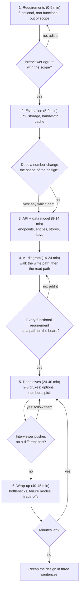
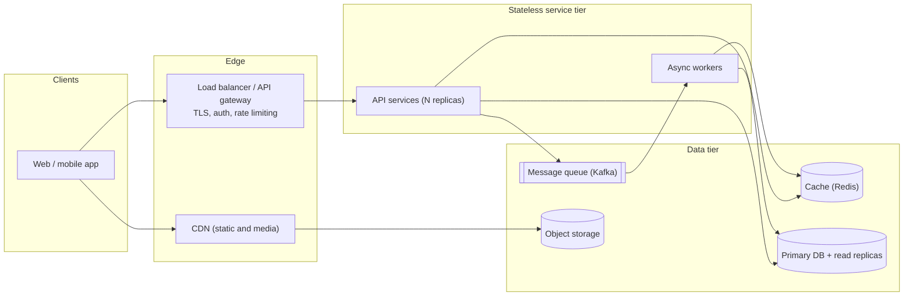

# The 45-minute HLD framework

## TL;DR

- The round rewards a complete, justified design delivered on time, not the cleverest component: v1 on the board by minute 24, then the two or three decisions that matter.
- Six steps on a clock: requirements (0-5), estimation (5-9), API and data model (9-14), high-level design (14-24), deep dives (24-40), wrap-up (40-45).
- You drive: state an assumption, confirm it in one sentence, move on, and name your own cruxes before the interviewer does.

## Core concepts

A system design round is 45 minutes, perhaps 38 of them usable. Interviewers grade against a rubric — requirements, estimation, the design, depth on the hard parts, communication — and 20 minutes on requirements scores zero on three of the five rows however good they were. The framework below is a clock first and a checklist second; every case study in this handbook follows the same six steps and ends with the same pacing table, so after five runs it is reflex.

### The six steps on a clock

**Each step produces an artifact the next step consumes; the loops are where you check in with the interviewer.**

This pacing table is the canonical one; each case study repeats it with its own content.

| Minutes | Step | You produce | You say |
|---|---|---|---|
| 0-5 | Requirements | 3-5 functional bullets, the non-functional numbers, an out-of-scope list | "I will design for X and Y; Z is out of scope." |
| 5-9 | Estimation | Write QPS, read QPS, storage per year, one of bandwidth or cache size | "Reads are 100x writes, so the design is read-optimised." |
| 9-14 | API + data model | 3-5 endpoints, the entities with their keys, one store per entity | "Partitioned by user_id because the hot query is per user." |
| 14-24 | High-level design | The v1 diagram; write path and read path narrated end to end | "Let me trace one write, then one read." |
| 24-40 | Deep dives | 2-3 cruxes, each with options, numbers and a pick | "The hard part is X; here are two ways and why I take the second." |
| 40-45 | Wrap-up | What breaks first at 10x, single points of failure, the trade-off table | "If I had another week I would change..." |

### Requirements: functional, non-functional, out of scope

Functional requirements are the three to five verbs the system must support — publish a post, follow a user, read the feed. Ask for the top use cases, pick the core and push the rest out of scope out loud; an unspoken omission looks like an oversight, a spoken one looks like judgement. Non-functional requirements are numbers, and you leave this step with all of them: scale (DAU, actions per user per day, read/write ratio), latency (a p99 target per operation), consistency (strong where money or inventory moves, eventual where a feed may lag seconds), durability (is a lost write acceptable?) and availability. Say availability as downtime: 99.9% is 8.76 hours a year, 99.99% is 52.6 minutes, and the second rules out any design with a single primary you fail over by hand.

Ask only about things that change the design: ranked or chronological, exactly-once delivery or not, a read/write ratio of 10:1 or 1:1. Everything else you assume, state and move on — "I will assume 300M DAU and 0.5 posts per user per day; stop me if that is off." An interviewer who wants different numbers will say so.

### Estimation that earns its four minutes

Estimation exists to change the design, not to fill a table. For a Twitter-like feed: 300M DAU x 0.5 posts = 150M posts/day, which over a day of ~10^5 s is ~1.7k writes/s, ~5k/s at a 3x peak; 300M x 50 feed reads = 15B reads/day, ~175k/s average and ~500k/s peak; 150M x 1 KB = 150 GB/day of text, ~55 TB/year. Say the decision each number drives in the same breath: 500k reads/s at ~1k QPS per stateless app server is 500 nodes before headroom, so a cache must absorb most reads; 55 TB/year exceeds a single server's 2-20 TB within a year, so the post store is sharded from day one; 1.7k writes/s fits a single relational primary (5k-20k writes/s), so the write path is not the problem. Four numbers, four sentences, then stop; [Back-of-envelope estimation](estimation.md) has the method and the worked examples.

### API and data model

Write three to five endpoints as resource nouns with HTTP verbs: `POST /v1/posts`, `GET /v1/feed?cursor=&limit=20`, `POST /v1/users/{id}/follow`. Put the two things interviewers probe into the signatures: an `Idempotency-Key` header on every write a client might retry, and an opaque cursor rather than a page number on every list. Then the entities, each with its primary key, its store and one sentence of justification — posts in a wide-column store partitioned by `post_id`, the follow graph as adjacency lists keyed by `user_id`, the feed cache in Redis. Name the partition key for anything that will not fit on one machine; skip the column list, the interviewer wants keys and access paths. [API design for HLD rounds](api-design.md) covers the conventions in depth.

### The v1 diagram every case study extends

**Baseline architecture: every case study starts from this skeleton and adds its own services, queues and stores.**

Draw it left to right in the order data flows, then narrate one write and one read end to end, pricing each hop: a same-datacenter round trip is ~500 µs, so a read through the gateway, a service, a cache and a database is ~2 ms of network before any work. Label the busiest arrows with their QPS. Then run the functional list against the board: a requirement without a path is a gap the interviewer will find. The skeleton is deliberately boring; the marks are in what you add to it and why.

### Deep dives: two or three cruxes

A crux is a decision where the obvious choice breaks at the stated scale: fan-out for a feed (one post to 50M followers), connection management and ordering for chat, ID generation for a URL shortener, double-charging for payments. Pick two or three, announce them — "the hard parts are A and B; A first" — and give each five to eight minutes in one shape: options, the number that separates them, your pick, how it fails. A deep dive without a number is an opinion. If the interviewer steers you elsewhere, follow at once; they are telling you where the marks are.

### Trade-offs, bottlenecks, failure modes and the wrap-up

Spend the last five minutes on three questions: what breaks first at 10x, which box is a single point of failure, where consistency is weakest. Answer each with the next fix, not a redesign. Then a trade-off summary — one row per decision: chosen, alternative, why — and a three-sentence recap. Leave one minute; an interviewer with a question they never got to ask remembers the question, not your design.

### The SDE2 bar and the senior bar

At SDE2 the bar is a complete, working, justified design you drove from requirements to wrap-up: correct estimation, standard components used for the right reasons, at least one crux handled with real depth, no gaps in the functional list. At senior it adds alternatives with their costs, a migration path from v1 to v2, operations (deployment, on-call, cost per request) and the willingness to challenge the prompt. An SDE2 who volunteers one alternative and its cost at a crux signals the next level without risking the first.

### Driving the room: whiteboard hygiene and pushback

Keep the requirements list in one corner and tick it off; number the steps; draw data flow left to right; strike through instead of erasing so the interviewer can see your path. When you are pushed — "what if one user has 50M followers?" — restate the concern, give the number, offer two options and pick one. Never defend a choice you cannot quantify; conceding in one sentence and fixing the design reads as seniority, arguing reads as fragility. Silence from the interviewer means continue; interruption means follow.

## Trade-offs

| Approach to the 45 minutes | Time risk | Coverage by minute 24 | Depth signal | Fits when |
|---|---|---|---|---|
| Breadth first, then 2-3 deep dives (this framework) | Low | Complete v1 | Strong if the cruxes are the right ones | Almost every prompt |
| Crux first, basics later | High | API and data model often skipped | Very strong on one topic, thin elsewhere | The interviewer says "assume the basics, go deep" |
| Interviewer-led, answer what is asked | Medium | Patchy | Depends on the interviewer | Rounds run as a conversation |
| Bottom-up from the schema | High | Data model strong, flows and scale weak | Weak unless the prompt is data-centric | Analytics and storage prompts |

Breadth first is the default because the rubric is breadth-first: every row is graded and a zero on any of them costs more than brilliance on another gains. Its weakness is that the deep dives come late, so a slow first half reaches minute 30 with a v1 and nothing else; the fix is to timebox the first four steps hard and to announce the cruxes as you finish the v1. Go crux-first only when the interviewer asks for it, and even then write the functional list and the four numbers in two minutes so they anchor the discussion. Let the interviewer lead when they clearly want to; some rounds are a conversation about one component, and fighting for your agenda costs communication points. Bottom-up from the schema suits prompts that are really about data (a metrics store, a warehouse) and fails where the flows are the problem: if you are on your third table and have not drawn a request path, stop and draw one.

## In the interview

Open by restating the prompt in one sentence and asking for the two answers that change the design; then announce the plan — "five minutes on requirements and numbers, a v1 by about minute twenty, then the hard parts" — so the interviewer knows depth is coming and does not pull you into it early.

Phrases that signal depth: "the number that decides this is..."; "that is out of scope for the v1, and here is where it would plug in"; "I would choose A, and the cost of A over B is...".

??? question "The interviewer keeps asking clarifying questions of their own and you are at minute 12 with no numbers. What now?"
    Say it: "Let me assume 100M DAU and a 100:1 read ratio so we can move on; correct me if that is off." Then do the four numbers in two minutes. Naming the time problem and fixing it scores on communication; drifting loses three rubric rows.

??? question "You realise at minute 30 that your data model cannot serve one of the functional requirements. Do you hide it?"
    No. Point at it, say what is missing, add the index or the denormalised table, and move on. The interviewer sees the gap either way; finding it yourself is the best outcome left at minute 30.

??? question "How do you choose which two cruxes to deep dive when the system has five?"
    Rank by the number that breaks the obvious design: the biggest ratio (fan-out at 200x, reads at 100x) and the hardest correctness requirement (exactly-once payment, message ordering). Name all five, pick two, offer the rest if time allows.

??? question "The interviewer says your estimation is wrong by 10x. How do you respond?"
    Redo the arithmetic out loud from the disputed assumption, then say which parts of the design change at the new number and which do not: 10x more reads may add cache nodes and leave the write path untouched. Knowing the sensitivity is worth more than the original number.

??? question "What does a senior-level answer contain that an SDE2 answer does not?"
    Alternatives with costs, a migration path, and operations: how the v1 becomes the v2 without downtime, what the on-call page looks like, what a request costs.

!!! tip "Interview tip"
    Announce your cruxes when you finish the v1: "The hard parts are fan-out and the feed cache; I will take fan-out first." It turns the interviewer's "what about..." into a confirmation of your plan instead of a hole in it.

## Common mistakes

- **Designing before the numbers**: the first box is a microservice and the first number arrives at minute 25. It costs the estimation row and usually the design row, because the cache and the shards were guesses. Fix: no boxes before the four numbers.
- **Boiling the ocean in requirements**: ten functional requirements, none out of scope, and a v1 that has to serve all of them. Fix: three to five verbs, the rest named and parked.
- **A diagram with no paths**: twelve boxes, arrows everywhere, and no narrated write or read. Fix: trace one write and one read end to end before adding anything else.
- **Deep dives without a decision**: listing fan-out on write and fan-out on read and stopping. Fix: options, the number, the pick, the failure mode, every time.
- **Arguing with pushback**: defending a choice with adjectives after the interviewer gave a counter-example. Fix: restate, quantify, offer two options, pick, move on.

!!! warning "Common mistake"
    Running out of time with the v1 unfinished. A complete, plain design with two good deep dives beats a clever half-design, because the rubric grades every step and an unfinished board scores zero on the steps you never reached. Check the clock at minutes 5, 9, 14 and 24 and cut whatever is running over.

## Self-check

??? question "What must you have on the board by minute 24, and why that minute?"
    Requirements with numbers, the four estimates, endpoints and entities, and a narrated v1. That leaves 16 minutes for deep dives, where the depth marks are, plus a five-minute wrap-up.

??? question "Which questions do you ask the interviewer, and which do you assume?"
    Ask the ones that change the design: ranked or chronological, delivery guarantees, read/write ratio, consistency for money. Assume the rest, say the assumption out loud and invite correction.

??? question "How does 99.99% availability change a design compared with 99.9%?"
    52.6 minutes of downtime a year instead of 8.76 hours: no manual failover, no primary without a hot standby, no deploy that takes the service down. Redundancy on every tier, not just the database.

??? question "What is the shape of a good deep dive?"
    Options, the number that separates them, the pick, and how the pick fails. Five to eight minutes each, two or three of them, announced in advance.

??? question "What separates the SDE2 bar from the senior bar in this round?"
    SDE2: a complete, working, justified design you drove end to end. Senior: alternatives with costs, a migration path, operational concerns and a willingness to challenge the prompt.

## Related

- [Back-of-envelope estimation](estimation.md) — the four numbers in four minutes
- [API design for HLD rounds](api-design.md) — endpoints, cursors and idempotency keys for step 3
- [HLD round checklist](../../cheatsheets/hld-checklist.md) — the must-say phrases and artifacts per step
- [From one server to millions of users](scaling-primer.md) — where the baseline architecture comes from
- [Design a news feed](../case-studies/news-feed.md) — the framework applied end to end
