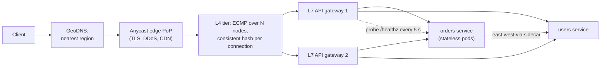
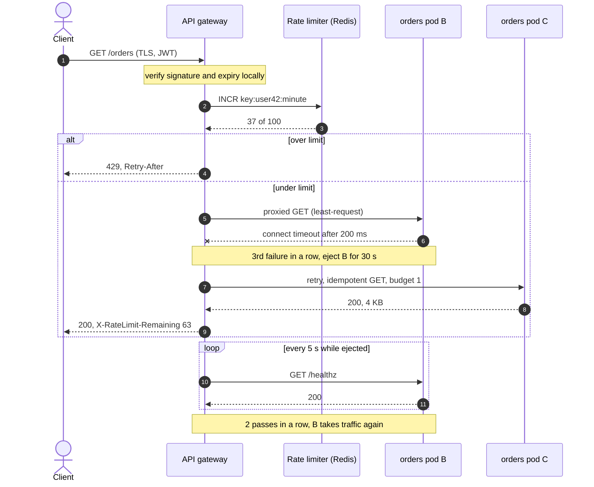

# Load balancing, reverse proxies and API gateways

## TL;DR

- A load balancer spreads requests over interchangeable instances and hides the failing ones; it is what makes "add more servers" a valid scaling answer.
- L4 balances connections by IP and port and is fast; L7 reads HTTP and can route, retry, authenticate and rate-limit per request at a CPU cost.
- Interviewers probe the algorithm, failure detection, why sessions are not sticky, and how the balancer avoids being the single point of failure.

## Core concepts

The "LB" box earns its place only if you can say what layer it works at, how it picks a backend, how it learns a backend is dead, and what happens when it dies itself. An app server sustains ~1k QPS and an L7 proxy ~10k-100k QPS, so one proxy fronts 10-100 app servers: the proxy is rarely the bottleneck, its decisions are.

### L4 vs L7

An L4 (transport) balancer sees TCP and UDP: it picks a backend per *connection* from the 5-tuple (source and destination IP and port, protocol) and never reads the payload. It is cheap and protocol-agnostic and allows direct server return, where the backend answers the client directly — the right shape for video egress. Its blind spot is the request: it cannot route by path or header, cannot retry, and pins every stream of a multiplexed HTTP/2 connection to one backend.

An L7 (application) balancer terminates the connection and usually TLS, parses HTTP, and chooses a backend per *request*: route `/api/v2/orders` to the orders service, send 5% to a canary, retry an idempotent GET elsewhere. It pays with CPU and an extra hop. Production stacks layer them: DNS or anycast picks a region, an L4 tier spreads connections over L7 proxies, which route to services.

**Request path from client to service instance, with redundancy at each layer.**



### Balancing algorithms

- **Round robin** hands each request to the next backend. It assumes equal machines and equal requests; a slow backend still gets its full share.
- **Weighted round robin** gives a 2x machine 2x the turns. Use the *smooth* variant: weights 5:1:1 should produce `A A B A C A A`, not `A A A A A B C`, a five-request burst on A every cycle.
- **Least connections** picks the backend with the fewest in-flight requests, so slow requests and slow machines attract less work. With many balancers each sees only its own slice; the fix is **power of two choices**: pick two at random, use the less loaded — no coordination, and no herd onto one "least loaded" node. Envoy's least-request is this in P2C form.
- **Least response time** ranks backends by a latency moving average plus in-flight count (Nginx Plus `least_time`, Linkerd's EWMA). Beware the failing backend: one that returns errors in a millisecond looks like the fastest machine and is rewarded with traffic unless errors count as load.
- **IP hash** routes `hash(client_ip) mod N` for affinity without cookies. It breaks twice: a corporate NAT puts thousands of users on one backend, and a change of N remaps most clients.
- **Consistent hashing** maps a key (user id, session, cache key) onto a ring so each key sticks to one instance, and losing an instance moves only its share, about 1/N: a 4-backend pool losing one remaps roughly 3/4 of the keys under mod-N but exactly the dead quarter on a ring. A bounded-load variant caps any backend above the mean and spills to the next node. This is the algorithm for cache locality; details in [Partitioning, sharding and consistent hashing](partitioning-and-consistent-hashing.md).

### Health checks and outlier ejection

An **active** check is a probe on a timer: a TCP connect or `GET /healthz` every few seconds with a short timeout, down after k consecutive failures, up after m consecutive successes (the hysteresis stops flapping). Detection takes interval x threshold: every 5 s with a threshold of 2 means up to 10 s in which 1/N of requests fail. Keep the probe shallow (is the process accepting connections?) rather than deep (can it reach the database?): a deep check turns a database blip into a pool with no healthy instance.

A **passive** check watches real traffic and ejects a backend after consecutive connection errors or 5xx, for a period that grows with each ejection (Envoy's outlier detection; the demo below ejects after 3 failures for 30 s, then 60 s). It reacts within the first few failed requests, but needs two guard rails: a **maximum ejection percentage**, so a bad deploy or a shared-dependency outage cannot eject the whole pool, and a **panic threshold**, under which the balancer ignores health and sends traffic to everyone rather than to the last survivor. Add **connection draining**: a leaving instance finishes in-flight requests first.

### Sticky sessions and why to avoid them

Session affinity (a balancer cookie, or IP hash) routes a client back to the same backend, usually because it holds the session in memory. The price is everything horizontal scaling promised: one heavy user makes a hot backend, a dying backend loses every session it held, scaling in evicts users, a deploy waits for sessions to drain. Move the state out — a session store such as Redis, or a signed token the client carries — so any instance serves any request. Keep affinity only where locality is the point (cache hit rate, WebSockets) and make it a *preference*, never a correctness requirement.

### Global load balancing: GeoDNS and anycast

**GeoDNS** answers with the addresses of the region closest to the *resolver* (EDNS Client Subnet sharpens the guess): cheap, coarse, and failover is bounded by the TTL — with 60 s, clients keep arriving at a dead region for up to a minute, and some resolvers ignore TTLs. **Anycast** announces one IP prefix from every point of presence through BGP, so the network delivers each client to the nearest; failover is BGP reconvergence, seconds, with nothing cached on the client. Its weakness is long-lived connections: a route change mid-connection lands packets on a PoP with no state for them, so anycast fronts stateless edges (DNS, CDN, TLS termination, DDoS absorption) while regions behind it are unicast. The prize: a US east-west round trip is ~70 ms and California to the Netherlands ~150 ms, saved on every round trip served nearby.

### Load balancer high availability

A single balancer caps everything behind it at one machine's availability and bandwidth. Two patterns remove it:

- **Active-passive with a virtual IP (VIP)**: two nodes share one IP through VRRP (keepalived); the standby claims the VIP on heartbeat loss. Failover takes a few heartbeats; in-flight connections break unless connection state is synchronised.
- **Active-active with ECMP**: routers spread flows over N L4 nodes that hash connections consistently (Google's Maglev), so losing a node disturbs only its own flows.

Managed cloud balancers are such fleets internally.

### API gateway duties

An API gateway is an L7 reverse proxy that also owns the cross-cutting edge concerns, so each service does not: **TLS termination** (decrypt once, re-encrypt or mTLS inward); **authentication** (verify the JWT or API key before a ~1k QPS app server spends a thread); **rate limiting** per client against a shared counter; **routing** by host, path and version, including canary weights; **transformation** (REST to gRPC, response aggregation for a mobile client); plus request ids, access logs and retries with a budget. Refuse business logic: once the gateway knows what an order is, every team ships through one choke point.

**One request through the gateway, including a passive ejection and a retry on another instance.**



### Gateway vs reverse proxy vs service-mesh sidecar

A **reverse proxy** (nginx, HAProxy, Envoy) is the generic building block: it accepts connections for servers behind it and adds L7 balancing, TLS, caching and compression. An **API gateway** is a reverse proxy for *north-south* traffic from outside clients, with the API-management duties above. A **service-mesh sidecar** is a proxy beside every instance handling *east-west* calls: mTLS, retries, timeouts, client-side balancing and telemetry, configured centrally. The mesh costs two proxy hops per call and memory per pod. Small fleets get the same behaviour from a shared client library; meshes pay off when dozens of teams in several languages must apply one policy.

## Trade-offs

| Algorithm | Balancer state | Unequal machines | Slow or failing backend | Affinity | When a backend leaves | Typical use |
|---|---|---|---|---|---|---|
| Round robin | A counter | Ignored | Keeps its full share | None | No remap | Homogeneous stateless pools |
| Smooth weighted RR | Score per backend | By weight | Keeps its weighted share | None | No remap | Mixed instance sizes, canaries |
| Least connections / P2C | In-flight per backend | Implicit | Gets less work; a fast-failing one gets more | None | No remap | Variable request cost, many balancers |
| Least response time | Latency EWMA + in-flight | Implicit | Gets less work unless errors look fast | None | No remap | Latency-sensitive, error-aware setups |
| IP hash | None | Ignored | Keeps its clients | By client IP | Most clients remap (mod N) | Legacy affinity; avoid |
| Consistent hash | Ring of N x V points | By weight (points) | Keeps its keys | By key | Only its ~1/N of keys move | Cache locality, session routing |

Choose from the pool, not from habit. Homogeneous stateless instances with uniform requests need only round robin, and its predictability is a feature during incidents. Mixed instance sizes, or a canary that must take 5% of traffic, call for smooth weighted round robin. When request cost varies — search, report generation, fan-out — least connections protects the slow instance and the tail latency; with several balancers in front of the pool, use power of two choices so they do not herd. Reach for consistent hashing only when affinity buys something measurable, usually a cache hit rate, and route on a real key, never the client IP. Least response time is least connections with an extra sensor that must learn that errors are not fast. Whatever you choose, health checks decide the candidate set first; the algorithm only picks among the instances they left in.

## Python implementation

`Backend` carries the health state the balancer keeps per instance; `HealthPolicy` holds the probe and ejection thresholds:

```python title="code/hld/load_balancer.py — backends and health policy"
--8<-- "code/hld/load_balancer.py:backend"
```

Four strategies implement one `Strategy` protocol. `WeightedRoundRobin` is nginx's smooth variant; `ConsistentHash` reuses `HashRing` and rebuilds the ring only when the available set changes, so only a failed backend's keys move:

```python title="code/hld/load_balancer.py — strategies"
--8<-- "code/hld/load_balancer.py:strategies"
```

`Balancer` owns the lock, filters the available backends, applies the strategy and implements both health checks: `lease` counts in-flight requests and reports outcomes (passive), `probe` records probe results with thresholds in both directions (active):

```python title="code/hld/load_balancer.py — the balancer"
--8<-- "code/hld/load_balancer.py:balancer"
```

`uv run python -m hld.load_balancer` prints:

```text
round robin         : A B C A B C A B
smooth weighted 5:1:1: A A B A C A A A A B A C A A
least connections   : active A=3 B=1 C=0 -> C, then B
consistent hash     : 1,000 keys -> A=316 B=334 C=350
B fails 3 requests  : ejected for 30s; available = ['A', 'C']
keys that moved     : 334 of 1,000 = exactly B's 334 (A and C keys stayed)
30 s later          : B is healthy; 1000 of 1,000 keys back on their owner
B fails 3 more      : ejected for 60s (second ejection lasts twice as long)
active probe on C   : 1 failure -> healthy (threshold is 2)
active probe on C   : 2 failures -> unhealthy; available = ['A']
active probe on C   : 2 passes -> healthy; available = ['A', 'C']
A and C ejected too : NoAvailableBackend, answer 503 (no healthy, non-ejected backend in the pool)
```

The last line shows the guard rail this module omits: without a maximum ejection percentage, one outage empties the pool.

## In the interview

Introduce the edge while drawing it: "Clients resolve to the nearest region, hit a redundant L4 tier, then an L7 gateway that terminates TLS, authenticates, rate-limits and routes to stateless instances." Then name the algorithm and the health check, the two follow-ups.

Phrases that signal depth: "least-request with power-of-two choices, so the balancers do not herd"; "outlier ejection with a max ejection percentage and a panic threshold"; "consistent hashing on the user id for cache locality, never IP hash mod N".

??? question "The services keep user sessions in memory. How do you balance them?"
    Short term, cookie affinity as a soft preference, accepting that a dead instance logs its users out. The real answer moves the session to a store or a signed token so every instance is interchangeable.

??? question "How fast does the balancer learn a backend is down?"
    Active probes: interval x threshold, so 5 s x 2 = up to 10 s of 1/N failures. Passive ejection reacts after the first few failed real requests. Run both, and cap the share of the pool passive checks may eject.

??? question "An instance returns 500 in a millisecond. What does least-response-time do?"
    It rewards it: fast errors look like spare capacity and the instance becomes a black hole. Count errors as load and let outlier ejection remove it.

??? question "Rate limiting at the gateway or in the service?"
    Per-client quotas at the gateway: one shared counter, cheap rejection, consistent 429 and Retry-After. Per-operation protection belongs in the service that knows the cost.

??? question "Is the load balancer itself a single point of failure?"
    Only if you draw one. A VIP pair fails over in a few heartbeats; an ECMP tier with consistent hashing of connections loses only one node's flows; a managed cloud balancer is already a fleet.

!!! tip "Interview tip"
    Say what the balancer does when every backend is unhealthy. "Return 503 fast, alert, and keep the panic threshold so we do not route everything to the last survivor" is a sentence most candidates never produce.

## Common mistakes

- **Deep health checks on a shared dependency**: the database stalls, every instance reports unhealthy, the pool empties and a partial outage becomes total. Fix: shallow liveness probes, passive ejection with a maximum ejection percentage.
- **Sticky sessions to hide in-memory state**: hot backends, lost logins on failure, slow deploys. Fix: externalise the session; affinity only as a preference.
- **IP hash for affinity**: NAT puts a whole office on one backend and any pool change remaps most clients. Fix: consistent hashing on a real key, or a cookie.
- **Retrying every failure at the proxy**: a timed-out POST may have succeeded, and a retry storm finishes what the outage started. Fix: idempotent requests only, with a budget ([Resilience patterns](resilience-patterns.md)).
- **Business logic in the gateway**: one team's routing rule becomes everyone's deploy dependency. Fix: the gateway owns cross-cutting concerns only.

!!! warning "Common mistake"
    A single load balancer box on the diagram: everything behind it is capped by one machine's availability and bandwidth, and the interviewer will ask what happens when it dies. Draw a VIP pair or an ECMP tier and name the failover time.

## Self-check

??? question "Which layer can route by URL path, and why does it matter for HTTP/2?"
    L7, because it parses the request. L4 pins every stream of a multiplexed HTTP/2 connection to one backend.

??? question "Why does smooth weighted round robin interleave?"
    `A A A A A B C` is a five-request burst on A every cycle; `A A B A C A A` keeps the ratio without it.

??? question "A 10-instance pool loses one. What fraction of keys changes owner under mod-N versus a ring?"
    Mod-N remaps roughly 9/10 of the keys; a ring moves only the dead instance's 1/10, onto its successors.

??? question "Why is GeoDNS failover slow and anycast failover fast?"
    GeoDNS waits for cached answers to expire (the TTL); anycast failover is BGP reconvergence, seconds, with nothing cached on the client.

??? question "Name five duties of an API gateway and the one thing it must refuse."
    TLS termination, authentication, rate limiting, routing (including canaries), transformation. It must refuse business logic.

## Related

- [Networking for system design](networking-essentials.md) — DNS, TLS and HTTP/2
- [Rate limiting](rate-limiting.md) — the limiter the gateway calls
- [Resilience patterns](resilience-patterns.md) — retries and budgets at the proxy
- [Partitioning, sharding and consistent hashing](partitioning-and-consistent-hashing.md) — the ring behind `ConsistentHash`
- [Security essentials](security-essentials.md) — what the gateway verifies
- Eisenbud et al., "Maglev: A Fast and Reliable Software Network Load Balancer" (NSDI 2016)
- Mitzenmacher, "The Power of Two Choices in Randomized Load Balancing" (IEEE TPDS 2001)
- Envoy proxy documentation, "Outlier detection" and "Load balancing"
