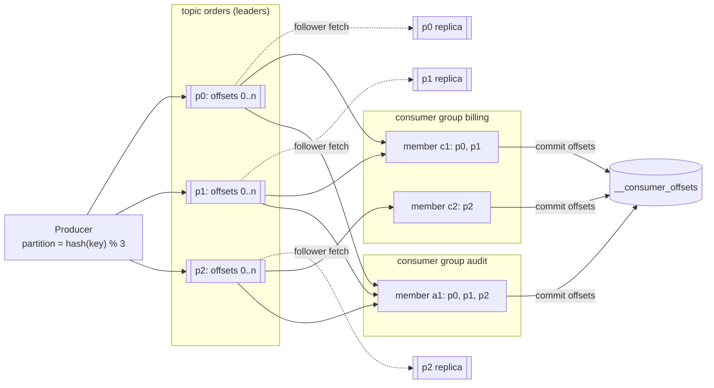
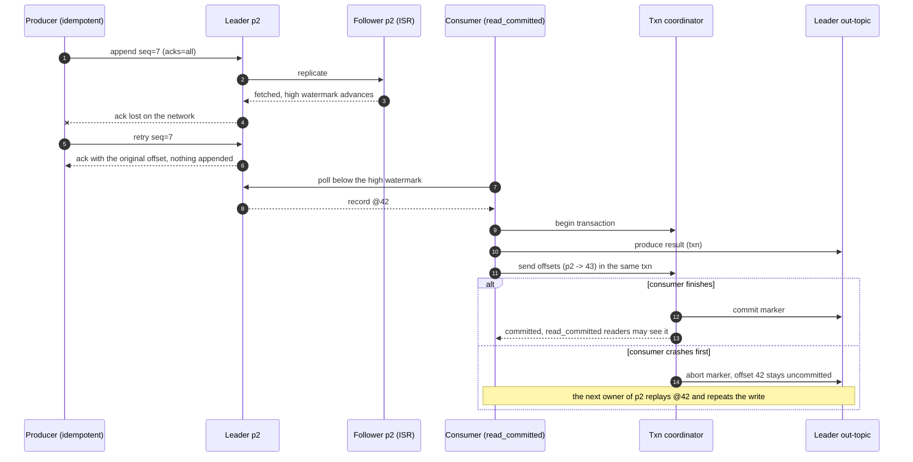
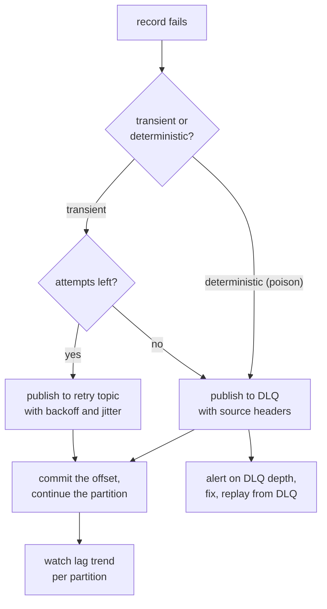

# Messaging, queues and Kafka internals

## TL;DR

- A queue hands each message to one worker and forgets it; pub/sub copies it to every subscriber; a log keeps it in order and lets many consumer groups replay it at their own pace.
- Kafka's unit of ordering, parallelism and replication is the partition: pick the key and the partition count from the ordering need and the consumer count.
- Delivery is at-least-once unless an idempotent producer meets an idempotent or transactional consumer; that pairing is what "exactly-once" means in the room.

## Core concepts

Put a broker between two services when the producer must not wait for the consumer: bursts (a chat system's 70k msg/s peak against a 23k/s average), slow or failing downstreams, fan-out, replay. The price is asynchrony: the caller learns "accepted", not "done", and every consumer must tolerate duplicates.

### Queue vs pub/sub vs log

A **queue** (SQS, a RabbitMQ queue) gives each message to one of several competing workers and deletes it on acknowledgement: easy to scale, no order across workers, no replay. **Pub/sub** (SNS, RabbitMQ exchanges) copies each message to every subscriber; a subscriber that is down misses it unless the broker queues per subscriber. A **log** (Kafka, Pulsar, Kinesis) appends records to partitions, keeps them for a retention period, and lets each consumer group track its own offset, so one topic is a queue for one group, a pub/sub bus across groups, and replayable by a new group. The costs: parallelism is capped at the partition count, and a slow record holds up everything behind it.

The log wins on throughput because it appends at the tail and reads forward: an HDD does ~150 MB/s sequentially but only ~100 random IOPS (100 x 4 KB = 400 KB/s), about 400x less, and Kafka serves reads from the page cache, so one broker sustains ~100 MB/s in and ~1 GB/s out.

### Kafka anatomy: topics, partitions, offsets, consumer groups

A topic is split into partitions, each an ordered, immutable sequence of records with dense offsets. The producer picks `hash(key) % partitions`, or round-robin for unkeyed records. Each partition has one leader broker for all reads and writes, plus followers. A consumer group assigns every partition to exactly one member (extra members idle) and commits offsets to `__consumer_offsets`, a compacted internal topic, so a restarted member resumes where the group stopped.

Size partitions from the consumers: a 70k msg/s peak x 1 KB = 70 MB/s fits one broker's ingest, but at ~1k msg/s per consumer (the app-server figure) you need 70 members, hence at least 70 partitions. Take 2-3x headroom: adding partitions later remaps `hash(key) % N` and breaks per-key order.

**One topic, three partitions, two replicas each, two independent consumer groups.**



### Replication: ISR, acks and the high watermark

With replication factor 3 a partition has a leader and two followers that fetch from it like consumers. The in-sync replica set (ISR) is the leader plus every follower caught up within `replica.lag.time.max.ms`; the high watermark is the highest offset the whole ISR holds, and consumers read only below it, so a failover to an ISR member never exposes a record the new leader lacks. `acks=0` does not wait; `acks=1` waits for the leader's log and loses the record if the leader dies before followers fetch; `acks=all` waits for the whole ISR, gated by `min.insync.replicas`. RF 3 with `min.insync.replicas=2` survives one dead broker without losing acknowledged writes and refuses writes (`NotEnoughReplicas`) with two down: consistency over availability. Keep `unclean.leader.election.enable=false` unless uptime is worth acknowledged data.

`acks=all` adds one same-datacenter round trip, ~0.5 ms per batch, amortised over hundreds of records; across regions it would add ~70 ms, so mirror asynchronously instead of stretching the ISR.

### Retention, compaction and the log start offset

A partition is a chain of segment files. Time retention (`retention.ms`, 7 days by default) or size retention deletes whole segments from the head and advances the log start offset; a consumer whose offset fell below it gets `OffsetOutOfRange` and applies `auto.offset.reset` (`earliest` or `latest`). Capacity is rarely the limit: 100M messages/day x 1 KB = 100 GB/day, x 7 days x RF 3 = 2.1 TB, inside one server's 2-20 TB; you spread partitions for throughput, not space.

Compaction (`cleanup.policy=compact`) keeps the newest record per key without renumbering offsets, so the topic converges on a current-state table; a null value is a tombstone, kept for a grace period so lagging readers see the delete. Changelogs and `__consumer_offsets` are compacted.

### Ordering, keys and rebalances

Ordering holds inside a partition and nowhere else: one key, one partition, one member at a time. Three things break it: retries with several in-flight batches and no idempotence, changing the partition count, and a hot key, which cannot be spread without losing its order; salt it (`tenant#shard`) only for work that needs no order.

A rebalance redistributes partitions when a member joins, leaves, misses heartbeats for `session.timeout.ms` or fails to `poll` within `max.poll.interval.ms`. Eager rebalancing revokes every partition, one member runs the assignor (range, round-robin, sticky) and processing stops until the new generation starts; cooperative rebalancing revokes only partitions that move, and static membership (`group.instance.id`) lets a member restart without a rebalance. Either way the new owner resumes from the last committed offset, so whatever the old owner processed but did not commit runs again. That window is what your consumer must make idempotent.

### Delivery semantics

At-most-once: commit before processing (or `acks=0`) and lose records on a crash. At-least-once: `acks=all` with retries, commit after processing, duplicates from retries and rebalances. Effectively-once is at-least-once plus an idempotent consumer: dedupe on (topic, partition, offset) or a business id with a unique constraint or upsert (see [Transactions, 2PC, sagas and idempotency](transactions-and-distributed-transactions.md)).

Kafka's own exactly-once has two parts. The idempotent producer gets a producer id and numbers records per partition; the leader acknowledges a repeated sequence without appending it and rejects a gap, so retries neither duplicate nor reorder. Transactions add a `transactional.id` mapped to a producer id with an epoch, so a restarted instance fences its zombie predecessor; the transaction coordinator writes commit or abort markers into every partition touched; `sendOffsetsToTransaction` puts the consumer's offsets into the same transaction; and `read_committed` consumers read only up to the last stable offset. That covers loops that stay inside Kafka. The moment a side effect leaves Kafka, you are back to an idempotent sink or a transactional outbox.

**Effectively-once across a lost ack and a crash: idempotent producer, acks=all, transactional consume-process-produce.**



### Retries, DLQ, poison messages, backpressure and lag

Retry transient failures with exponential backoff and jitter. Kafka has no per-message delay, so use retry topics (`orders-retry-1m`, `orders-retry-10m`) whose consumer pauses until a record is due; A poison message fails deterministically (bad schema, deleted account), and retrying it in place blocks its partition: head-of-line blocking. After N attempts publish it to a dead-letter topic with headers (source topic, partition, offset, exception, attempts), commit the offset, move on and alert on DLQ depth.

Backpressure is free with a pull model: consumers set the pace and the log absorbs the burst as lag; producers block when their buffer fills, so shed load upstream.

Lag is end offset minus committed offset per partition, and its trend beats its level. Ingest of 100M messages/day is ~1.2k/s; consumers doing 1k/s fall behind by 200/s, 17M records a day. After a one-hour outage ~4.3M records wait, and a fleet that only matches ingest never drains them: catch-up capacity must exceed arrivals, so scale the group (within the partition count) until lag trends down.

**Handling a failed record without blocking the partition.**



### Fan-out, priority, delay and schemas

Fan-out is Kafka's cheapest feature: a second consumer group reads the same log from the page cache. Priority is Kafka's weakest: none, so run a topic per priority and drain the urgent one first. Delayed delivery is native in Pulsar and SQS (up to 15 minutes), a plugin or TTL trick in RabbitMQ, a scheduler topic in Kafka. A schema registry stores Avro or Protobuf schemas per subject, stamps a schema id on each record and enforces compatibility (backward: upgrade consumers first; forward: upgrade producers first), so a breaking change becomes a new topic instead of an outage.

## Trade-offs

| System | Model | Ordering | Replay | Per-message ack, delay, priority | Fan-out | Best fit |
|---|---|---|---|---|---|---|
| Kafka | partitioned log, pull | per partition | yes, within retention | no, no, no | consumer groups | event streams, changelogs, pipelines |
| RabbitMQ | AMQP broker, push with prefetch | per queue, single consumer | no (deleted on ack) | yes, plugin or TTL, yes | exchanges and bindings | work queues, routing, task lifecycles |
| SQS standard / FIFO | managed queue, pull | none / per message group | no | visibility timeout, yes, no | SNS in front | serverless workers, low-ops queues |
| Pulsar | segmented log on BookKeeper | per partition or per key | yes, tiered storage | yes, native, no | subscriptions per topic | queue and stream in one |
| Redis Streams | in-memory log | per stream | while in memory | yes (pending list), no, no | consumer groups | small queues beside a cache |

Choose the log when consumers are independent, when you may need replay, or when throughput is measured in hundreds of MB/s: events, activity streams, change data capture. Choose RabbitMQ when the unit of work is a task with a lifecycle: per-message acknowledgement, requeue, priorities, TTLs and routing. Choose SQS when you want no operations: visibility timeout instead of ack, dead-letter redrive and delay built in, FIFO queues for order per message group. Pulsar suits a platform team wanting queue and stream semantics on one cluster; Redis Streams is fine beside a cache you already run until the stream must outlive memory. Whatever you pick, the consumer contract is identical: idempotent processing, bounded retries, a dead-letter path and lag monitoring.

## Python implementation

`code/hld/mini_kafka.py` collapses a cluster into one process but keeps the semantics interviews probe. A `Record` is immutable and a `Partition` never renumbers offsets, so reads bisect once compaction or retention have punched holes:

```python title="code/hld/mini_kafka.py — the partitioned log"
--8<-- "code/hld/mini_kafka.py:log"
```

The `Broker` owns topics, committed offsets and the idempotent-producer sequence table: `append` with a producer id acknowledges a repeated sequence with the original record and rejects a gap:

```python title="code/hld/mini_kafka.py — the broker"
--8<-- "code/hld/mini_kafka.py:broker"
```

The `Producer` hashes the key to a partition and numbers its sends; `attempts=3` replays one send, as a client whose acks were lost would:

```python title="code/hld/mini_kafka.py — the producer"
--8<-- "code/hld/mini_kafka.py:producer"
```

`ConsumerGroup` runs the range assignor with an eager rebalance: every membership change revokes all partitions, bumps the generation and restarts each partition from its committed offset, which redelivers a crashed member's uncommitted records:

```python title="code/hld/mini_kafka.py — the consumer group"
--8<-- "code/hld/mini_kafka.py:consumer"
```

`uv run python -m hld.mini_kafka` prints:

```text
p0: bob@0 bob@1
p1: fay@0 fay@1
p2: ann@0 ann@1 ann@2 dan@3 ann@4
idempotent send, 3 attempts: one record p0@2, log 9 -> 10
generation 2: c1=[0, 1] c2=[2]
c1 polls 5, commits {0: 3, 1: 2}
c2 polls 5 (order-0 order-3 order-5 order-6 order-8) and crashes before committing
generation 3: c1=[0, 1, 2] polls 5 again: order-0 order-3 order-5 order-6 order-8
lag before commit {0: 0, 1: 0, 2: 5}, after commit {0: 0, 1: 0, 2: 0}
compact balances: removed 3, kept ann=103@3 bob=104@4 cid=105@5
retention: expired 10, log start [3, 2, 5], new group reads order-10
```

Note c2's five uncommitted records returning to c1 after the rebalance, and compaction keeping one row per key at its original offset.

## In the interview

Introduce the broker with its contract in one breath: "Order events go on a Kafka topic keyed by `order_id`, so each order's events are in order on one partition; consumers are at-least-once and idempotent, and anything that fails three times goes to a dead-letter topic."

Phrases that signal depth: "ordering is per partition, so the key is my ordering domain"; "`acks=all` with `min.insync.replicas=2` on RF 3"; "effectively-once is at-least-once plus an idempotent consumer, so I dedupe on the business id".

??? question "How many partitions would you create for this topic?"
    Peak rate over per-consumer throughput: 70k msg/s at ~1k/s per consumer is 70 members, hence at least 70 partitions; I'd start near 200 because adding partitions later remaps keys.

??? question "A consumer crashes after processing half a batch. What happens?"
    Its partitions are reassigned after the session timeout and the new owner resumes from the last committed offset, so the processed-but-uncommitted half runs again; hence idempotent consumers and committing after processing.

??? question "How do you get exactly-once into a relational database?"
    Kafka transactions only cover Kafka-to-Kafka. I write the row and the consumed offset in one database transaction, or make the write idempotent with a unique event id, then commit the Kafka offset after the database commit.

??? question "One tenant generates 40% of the traffic. Now what?"
    Its key is one partition, so one consumer carries 40% of the load. If its events need order it gets dedicated partitions and a faster consumer; if not, I salt the key (`tenant#0..k`).

??? question "Why not SQS here?"
    SQS wins for a work queue with no operations. I choose Kafka when several teams consume the same events, when I need replay, or when order per key matters at high throughput.

!!! tip "Interview tip"
    Say "at-least-once" before the interviewer does, then immediately name the dedup point: "the consumer dedupes on the event id". Claiming exactly-once without a dedup point loses more credit than never mentioning it.

## Common mistakes

- **Promising topic-level ordering**: consumers see partitions interleaved. Fix: say order is per partition and choose the key to match the entity that needs it.
- **Calling Kafka exactly-once without a dedup point**: retries and rebalances duplicate. Fix: idempotent producer plus idempotent consumer, or Kafka transactions for Kafka-to-Kafka only.
- **Retrying a poison message in place**: the partition stalls and lag climbs for every record behind it. Fix: bounded retries via retry topics, then a DLQ with headers, commit and alert.
- **Auto-commit with asynchronous processing**: the offset is committed on the next poll whether or not the handler finished, which is at-most-once. Fix: commit manually after the work is done.

!!! warning "Common mistake"
    Treating duplicates as a rare corner case. Every retry, rebalance and restart replays records. Design the consumer as idempotent from the first line, or the design fails under its most common event.

## Self-check

??? question "What does `acks=all` guarantee, and what does `min.insync.replicas` add?"
    The leader acknowledges only after every in-sync replica has the record; `min.insync.replicas=2` refuses writes with fewer than two in sync, so an acknowledged record exists on two brokers.

??? question "Why can consumers only read below the high watermark?"
    Records above it may exist only on the leader; if it dies and an ISR follower takes over, they vanish, so consumers must never have seen them.

??? question "How does the idempotent producer prevent duplicates?"
    Each producer has an id and numbers records per partition; the broker keeps the last sequence, acknowledges a repeat without appending it and rejects a gap, so retries cannot reorder.

??? question "A consumer group's lag is flat at 2M records. Is that a problem?"
    Flat lag means consumers match ingest with no headroom: any outage creates a backlog they can never drain. Add capacity until lag trends down.

??? question "When does compaction beat time retention?"
    When the topic is current state per key (balances, profiles, offsets): the latest value is kept and a new reader rebuilds state without the whole history.

## Related

- [Design a distributed message queue](../case-studies/distributed-message-queue.md) — the broker end to end
- [Queue and stream selection](../../cheatsheets/messaging-selection.md) — Kafka, RabbitMQ, SQS, Pulsar side by side
- [Transactions, 2PC, sagas and idempotency](transactions-and-distributed-transactions.md) — idempotency keys and the outbox
- [Batch and stream processing](batch-and-stream-processing.md) — what consumes the log
- Kreps, Narkhede and Rao, "Kafka: a Distributed Messaging System for Log Processing" (NetDB 2011)
- Apache Kafka documentation, "Design" and "Message Delivery Semantics"
- KIP-98, "Exactly Once Delivery and Transactional Messaging"
