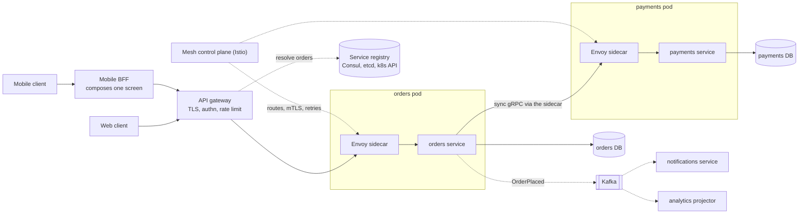
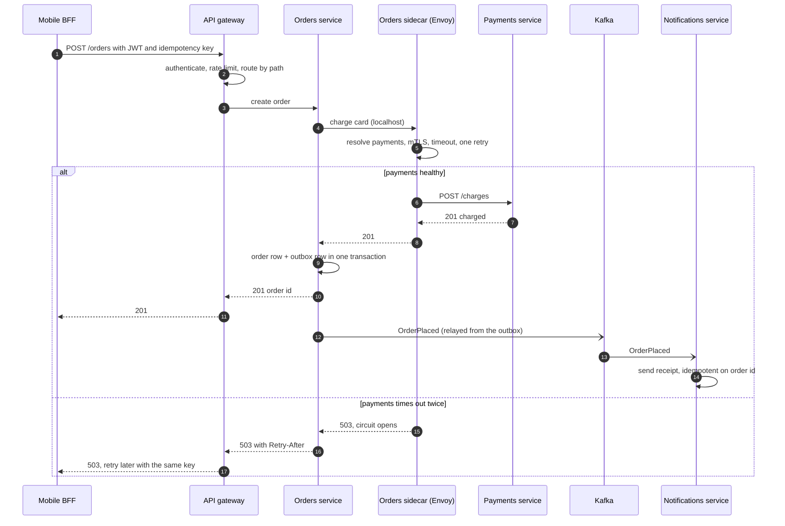
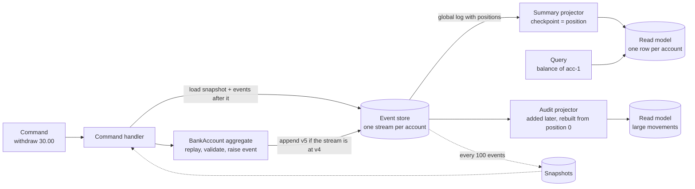

# Monolith, microservices, CQRS and event sourcing

## TL;DR

- An architecture style is a decision about deployable units and data ownership; split along team boundaries only when independent deployment pays for the network, operations and consistency problems it creates.
- Microservices need discovery, a gateway, timeouts and tracing to work, and database-per-service to be worth it; skip that last step and you own a distributed monolith.
- CQRS separates the write model from query-shaped read models; event sourcing stores the events that produced the state, so you can replay, audit and build new read models later.

## Core concepts

Every style answers one question: how many deployable units, and which unit owns which data. Discovery, gateways, meshes, sagas and CQRS are the bill for answering "more than one".

### Monolith, modular monolith, microservices

A monolith is one deployable on one database: calls are in-process (a memory reference is ~100 ns against ~500 µs for a same-datacenter round trip, 5,000x), a business operation is one transaction, and it scales horizontally behind a load balancer for years. It stops scaling when the team does: fifty engineers merging into one release, deploys blocked by the slowest team, one library upgrade for everyone. A modular monolith keeps the single deployable but enforces boundaries inside it — packages with public interfaces, a schema per module, no cross-module table access — and gets most of the ownership benefit with none of the network. Microservices make each module a separately deployed service that owns its data and talks over the network.

Split for a concrete pressure: teams blocking each other's deploys, a component with a different scaling profile (video transcoding beside a CRUD API), a blast-radius or compliance boundary (payments under PCI), a different release cadence. Conway's law says the system mirrors the organisation's communication structure, so draw team boundaries first and let services follow them. Split on business capability (orders, payments, inventory), never on technical layer: a "validation service" is a network hop with no owner.

**The moving parts a request meets once a monolith has been split.**



### Service discovery

Instances appear and vanish with every deploy and autoscaling event, so an address is a query, not a config value. A registry (Consul, etcd, ZooKeeper, the Kubernetes API) maps a service name to its healthy instances, kept fresh by TTL heartbeats or active health checks. Client-side discovery: the caller's library queries the registry and balances load itself — no extra hop, but a library per language and stale caches that hit dead instances. Server-side: the caller hits a stable virtual IP or load balancer that consults the registry (a Kubernetes Service, an ALB target group) — one extra hop, ~500 µs, nothing to implement in clients. DNS: A or SRV records with short TTLs — simplest and weakest, because resolvers cache and pooled connections never re-resolve. Let the orchestrator or a sidecar register instances: a crashed process cannot deregister itself.

### API gateway vs BFF

The gateway is the single entry point for cross-cutting policy: TLS termination, authentication, rate limiting, routing by path ([Load balancing, reverse proxies and API gateways](load-balancing-and-api-gateway.md)). A backend-for-frontend is a gateway per client type — web, iOS, partner API — owned by the team that builds that client. It composes a screen from several services and shapes the payload, so a mobile home screen costs one round trip instead of five: five serial calls from California to Europe at ~150 ms are 750 ms before any work. Policy in the gateway, client-shaped composition in the BFF, business logic in neither.

### Sidecar and service mesh

A sidecar is a proxy (Envoy) deployed beside every instance; the application talks to localhost and the sidecar does mTLS, discovery, retries, timeouts, circuit breaking, load balancing, metrics and trace-header propagation, identically for every language. A mesh (Istio, Linkerd) adds a control plane that pushes routing rules, canary traffic splits and policies to all sidecars. The price: two proxy hops per call, memory per pod, a platform to operate. It pays past a few dozen services in several languages; five services in one language get the same behaviour from a shared library.

### Sync vs async communication

A synchronous call (REST, gRPC) returns an answer now and couples availability: five services at 99.9% in series are 0.999^5 ~ 99.5% — 0.005 x 8,760 hours is ~44 hours of downtime a year instead of ~9 — with a latency floor of 5 x 0.5 ms = 2.5 ms before any work. Synchronous calls need timeouts, retry budgets and circuit breakers from day one. An asynchronous message through a broker decouples in time: the producer learns "accepted", bursts become lag, and new consumers subscribe without the producer knowing ([Messaging, queues and Kafka internals](messaging-and-event-streaming.md)). It costs eventual consistency, at-least-once duplicates (hence idempotent consumers) and harder debugging (hence correlation ids and tracing, see [Observability, SLOs and error budgets](observability-and-slos.md)). Rule: synchronous for a query this request needs answered (is the card valid), asynchronous for a state change others react to (order placed: notify, reserve, count).

**One order: a synchronous charge through the sidecar, then an event for everyone else.**



### Database-per-service and the distributed monolith

Each service owns its schema; others get its data through its API or events, never its tables. Three consequences: no cross-service joins (denormalise by consuming events, or compose in a BFF); no cross-service transactions (sagas and the transactional outbox, see [Transactions, 2PC, sagas and idempotency](transactions-and-distributed-transactions.md)); no ad-hoc reporting (a read model or a warehouse fed by events).

Skip the data split and you get the distributed monolith, the usual outcome of a migration: services share a schema, a feature needs four pull requests deployed in order, one team's migration breaks another's service, every request crosses six synchronous hops. You pay the network, the operations and the partial failures and get none of the independence. The fix is rarely more services; it is merging back or redrawing boundaries around data ownership.

### CQRS

Command Query Responsibility Segregation separates the model that changes state from the models that answer queries. The write model is small, normalised and enforces invariants; each read model is denormalised for one query — a table per screen, a search index, a cache — and is kept current by consuming the write model's events, so reads lag by the projector's backlog: milliseconds when healthy. The motivation is asymmetry: reads outnumber writes 10:1 in a social product and 100:1 in a URL shortener, and want other indexes, often another store. The costs are two models to keep in sync and a read-your-writes gap: return the new state from the command, or route the writer's next read to the write model. A CRUD admin screen gains nothing from it.

**The write side appends facts; the read side is rebuilt from them.**



### Event sourcing: store, snapshots, projections, replay

Event sourcing stores what happened to an aggregate — `AccountOpened`, `MoneyDeposited` — in an append-only stream and derives state by folding the events; the balance is a computation, not a column. The write path loads the stream, replays it, validates the command against the rebuilt state and appends new events naming the version it expects the stream to be at; if another writer got there first the store refuses (optimistic concurrency) and the command reloads and retries. The store needs a uniqueness constraint on `(stream_id, version)` and a global position for subscribers: a relational table does it; a Kafka topic does not, because it cannot read one aggregate's events without scanning the partition.

Snapshots bound the load cost: every N events (100 in the demo) persist the state at that version, and a load is one snapshot plus the tail. Projections are CQRS read models fed by the global log, each with a checkpoint so redelivery is harmless; a new question — every movement over 50.00 — is a new projector replayed from position 0. Size it: 10M accounts x 50 events a year x ~200 B (an event is a log line) is 100 GB a year, so a decade fits one server's 2-20 TB disk, and a year replays sequentially from SSD at ~2 GB/s in ~50 s plus processing. Replay also buys an audit trail, temporal queries and bug fixes by re-projecting. The costs: events are immutable, so mistakes get compensating events, never edits; schemas evolve, so events are versioned and upcast; privacy deletion needs crypto-shredding (encrypt each user's events with a destroyable key); and the write side answers no ad-hoc queries.

### Strangler fig and serverless

Migrate a monolith by putting a routing facade in front, moving one capability at a time into a new service, shifting its traffic — a percentage, then all — and deleting the code from the monolith until nothing is left. Data is the hard part: the new service must own its tables, which means dual writes or change data capture until cutover. Serverless functions (Lambda, Cloud Functions) are the far end of the spectrum: a function per event, scaled to zero, billed per invocation. They suit bursty, short, stateless work — thumbnails, webhooks, glue — and suffer cold starts, execution-time limits, per-invocation cost at sustained volume and connection-pool pressure on databases.

## Trade-offs

| Style | Deploy unit | Internal call | Data and transactions | Team scaling | Operations | Best fit |
|---|---|---|---|---|---|---|
| Monolith | one | in-process, ~100 ns | one database, ACID | one codebase, merge contention | one service to run | new products, small teams |
| Modular monolith | one, enforced module boundaries | in-process | one database, a schema per module | module ownership per team | one service to run | most teams under ~50 engineers |
| Microservices | one per service | network, ~500 µs plus serialisation | database per service, sagas and outbox | independent deploys per team | discovery, gateway, mesh, tracing, on-call per service | many teams, different scaling profiles |
| Serverless functions | one per function | network or events | managed stores, no long transactions | tiny units, fast iteration | no servers, but limits and cold starts | bursty, short, stateless work |

Start as a modular monolith and say so: one deployable, strict module boundaries, a schema per module, events between modules on an in-process bus. That is one step from microservices — move the module whose team, load or blast radius demands it behind the gateway when the pressure is real. Choose microservices from day one only when the organisation already is one: several teams, separate on-call, separate release trains. When you split, split the data with the code, use synchronous calls for queries and events for state changes, and budget for the platform: discovery, gateway, timeouts, retries, tracing and a mesh or library that gives every service the same defaults. Apply CQRS where one aggregate is read in several shapes at volume — a product page, a timeline, a dashboard — and event sourcing where the history is the product: ledgers, orders, inventory movements, anything an auditor asks about. For plain CRUD a table with an `updated_at` column is the right answer, and the interviewer knows it.

## Python implementation

`code/hld/event_sourcing.py` is a bank account stored as events. Events are frozen dataclasses; `StoredEvent` wraps one with its stream version and its global position:

```python title="code/hld/event_sourcing.py — events"
--8<-- "code/hld/event_sourcing.py:events"
```

`BankAccount` keeps commands and state changes apart: `deposit`, `withdraw` and `close` validate the invariant and raise an event; `_apply` is the only code that mutates state, so `replay` rebuilds an identical aggregate from a snapshot plus the events after it:

```python title="code/hld/event_sourcing.py — the aggregate"
--8<-- "code/hld/event_sourcing.py:aggregate"
```

`EventStore.append` checks the expected version and appends under one lock, which makes the concurrency optimistic rather than hopeful; `AccountRepository` turns that into load-and-save with a snapshot every N events:

```python title="code/hld/event_sourcing.py — store and repository"
--8<-- "code/hld/event_sourcing.py:store"
```

Projections consume the global log with a checkpoint, so redelivered events are skipped and `rebuild` replays history from position 0 for a read model that did not exist when the events were written:

```python title="code/hld/event_sourcing.py — projections"
--8<-- "code/hld/event_sourcing.py:projections"
```

`uv run python -m hld.event_sourcing` prints:

```text
acc-1: 4 events appended, balance 82.50 USD, version 4
stream acc-1: v1=Opened(ann) v2=Deposited(100.00) v3=Withdrawn(30.00) v4=Deposited(12.50)
withdraw 500.00 rejected (insufficient funds: balance 82.50 USD); nothing appended, version 4
optimistic concurrency: stream 'acc-1' is at version 5, expected 4
replay 5 events from scratch: balance 83.50 USD, version 5, same as the live aggregate: True
acc-2 after 121 events: snapshot at v100, load replays 21 events instead of 121
summary projection: 126 events up to position 126: acc-1=83.50 USD, acc-2=120.00 USD
redeliver the last 3 events: 0 applied (the checkpoint skips them)
acc-3: opened, moved 75.00 twice and closed: 4 new events; top balances acc-2=120.00 USD, acc-1=83.50 USD
new audit projection from 130 historical events: acc-1:deposit:100.00 USD acc-3:deposit:75.00 USD acc-3:withdrawal:75.00 USD
```

Note the fourth line: the second writer loaded version 4, so its append names 4 and is refused once the stream is at 5. The audit projection arrives last and still sees the 100.00 deposit from the first line.

## In the interview

Name the style with its reason as you draw the first box: "I'll start as a modular monolith with orders, payments and inventory as modules with their own schemas, and split payments out first because it has its own compliance boundary and load profile."

Phrases that signal depth: "split on business capability along team boundaries, never on technical layer"; "database per service, so cross-service writes are sagas through an outbox"; "the read model is a projection of the events, rebuildable from position zero".

??? question "How do services find each other after a deploy changes every IP?"
    Through a registry fed by the orchestrator, not by the instances. Server-side discovery costs one ~500 µs hop and keeps clients dumb; client-side saves the hop and costs a library per language.

??? question "Two services need to update their databases atomically. What do you do?"
    Nothing atomic exists across them. I write the local change and an outbox row in one transaction, relay the event, and make the consumer idempotent; if the second step can fail for business reasons it is a saga with a compensation.

??? question "Why not use Kafka as the event store?"
    Loading one aggregate means reading its events by key, and a topic can only be scanned by partition; compaction keeps the last value per key, which destroys history. Kafka carries events from the store to the projections; it is not the store.

??? question "A read model shows a stale balance right after a deposit. How do you handle it?"
    Return the new state from the command response, or route the writer's next read to the write model for a short window; I alert on the projector's checkpoint falling behind.

??? question "Your team of six engineers wants twelve microservices. What do you say?"
    That we would ship a distributed monolith: twelve deploys, twelve on-call rotations and six-hop requests for one team's worth of change. Six modules in one deployable, strict boundaries, split when a concrete pressure appears.

!!! tip "Interview tip"
    Volunteer the cost of every box you draw across a network: a 500 µs hop, a failure mode and an owner. Candidates who add services freely look junior; candidates who say "this stays in the monolith until X happens" sound like they have paid for a migration.

## Common mistakes

- **Splitting by technical layer**: a "user service" that every request touches becomes a synchronous dependency of everything. Fix: split by business capability and let each service own its data.
- **Shared database behind "microservices"**: schema changes couple deploys and the network buys nothing. Fix: database per service, with events or APIs for everyone else.
- **Synchronous call chains**: five hops at 99.9% are 99.5% available with a 2.5 ms floor. Fix: events for state changes; timeouts and circuit breakers for calls that must stay synchronous.
- **Editing events**: correcting a stored fact in place breaks every projection that already consumed it. Fix: append a compensating event and replay.
- **CQRS and event sourcing everywhere**: two models and a replay pipeline for an admin CRUD screen. Fix: reserve them for aggregates with many read shapes or an audit requirement.

!!! warning "Common mistake"
    Proposing microservices as the answer to "how would you scale this?" A monolith behind a load balancer scales to ~1k QPS per app server times as many servers as you like; microservices scale teams and blast radius, not throughput. Say what pressure you are splitting for, or do not split.

## Self-check

??? question "What does a modular monolith give you that a monolith does not, and what does it withhold?"
    Enforced ownership boundaries, a schema per module and a clean path to extraction; it withholds independent deployment and per-module scaling, the price of one process.

??? question "Client-side vs server-side discovery: one cost of each?"
    Client-side: a discovery library per language and stale client caches. Server-side: one extra hop, ~500 µs, and a load balancer to keep highly available.

??? question "What does the expected version in an event-store append protect against?"
    Two writers that loaded the same state both appending: the second names a version the stream has passed and is refused, so an invariant checked against stale state is never persisted.

??? question "How does a projection survive at-least-once delivery?"
    It stores the global position of the last event it applied and skips anything at or below it, so a redelivered batch changes nothing.

??? question "Name three symptoms of a distributed monolith."
    A feature needs several repositories deployed in order; services share tables or a schema; most requests traverse a long chain of synchronous calls, so one slow service degrades all of them.

## Related

- [Messaging, queues and Kafka internals](messaging-and-event-streaming.md) — the transport between services and to projections
- [Load balancing, reverse proxies and API gateways](load-balancing-and-api-gateway.md) — gateway duties and health checks
- [Transactions, 2PC, sagas and idempotency](transactions-and-distributed-transactions.md) — sagas and the outbox once data is split
- [Observability, SLOs and error budgets](observability-and-slos.md) — tracing and correlation ids across hops
- [Deployments, feature flags and data migrations](deployment-and-data-migrations.md) — moving data behind the strangler facade
- Conway, "How Do Committees Invent?" (Datamation, 1968)
- Fowler, "Strangler Fig Application" (martinfowler.com, 2004)
- Young, "CQRS Documents" (2010)
