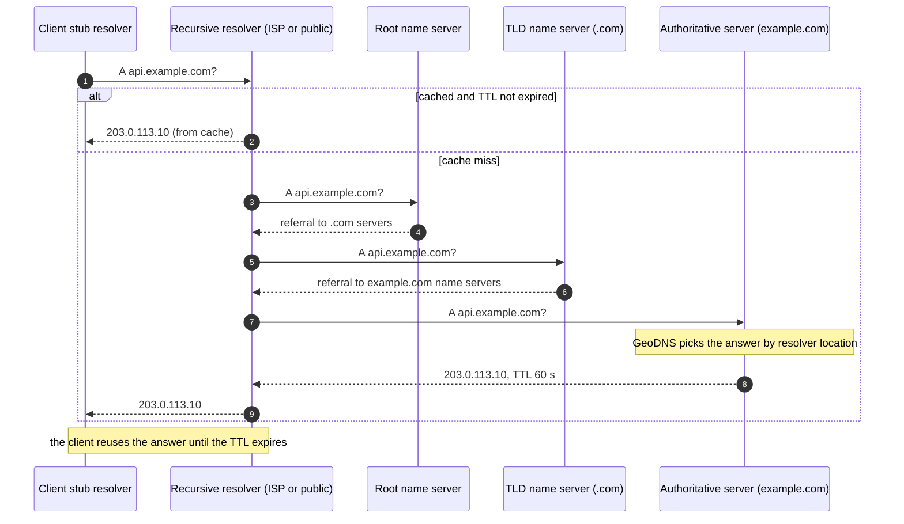
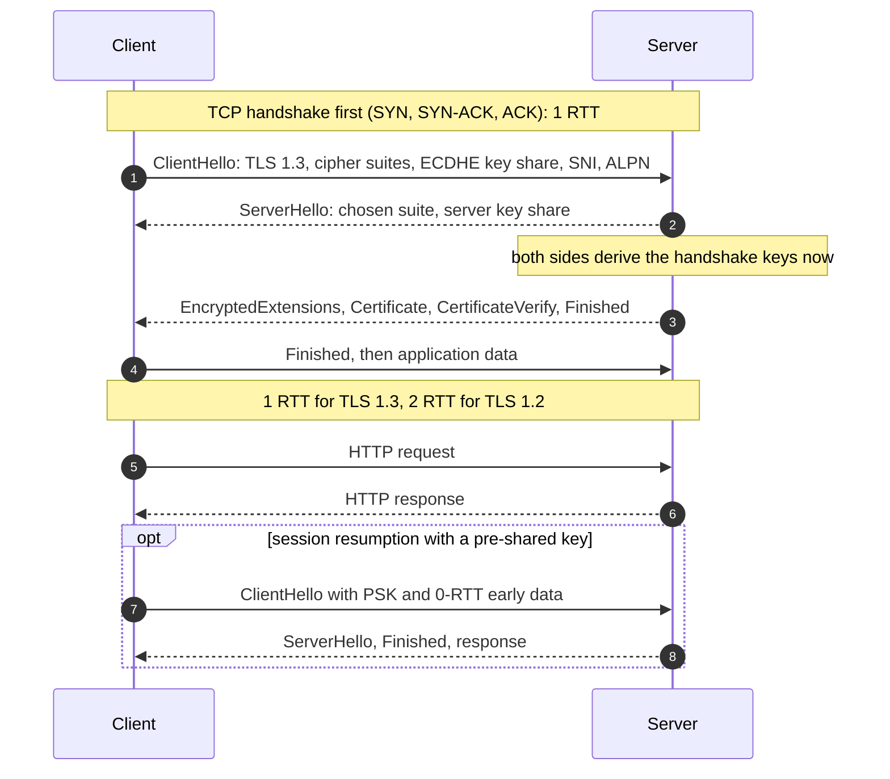
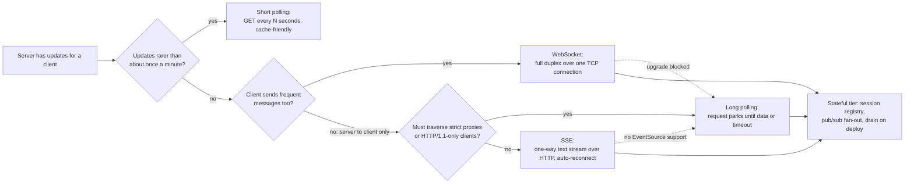

# Networking for system design

## TL;DR

- Every hop is a round trip you can price: ~500 µs in a datacenter, 70 ms across the US, 150 ms California to the Netherlands; setup costs one to three.
- Know what each layer buys: DNS steers, TCP orders, TLS 1.3 secures in one round trip, HTTP/2 multiplexes, QUIC removes head-of-line blocking, pooling amortises it.
- Interviewers probe realtime transports (polling, long polling, SSE, WebSocket) and API styles; choose by direction, latency and what sits in between.

## Core concepts

Networking questions in a design round are latency questions in disguise: how many round trips, where, and what removes them. Keep three numbers in front of you — ~500 µs same-datacenter, ~70 ms US coast-to-coast, ~150 ms California to the Netherlands — and every protocol below becomes a count of those.

### DNS: recursion, TTL, GeoDNS and anycast

**A cold DNS lookup walks root, TLD and authoritative servers; a warm one is a cache hit at the recursive resolver.**

Each referral above is a round trip, so a cold lookup from Europe against US-hosted name servers can cost several hundred milliseconds — which is why resolvers cache aggressively and every record carries a TTL. The TTL is a design knob: 60 seconds moves traffic off a failed region within a minute or two but keeps resolvers coming back; a day makes failover take a day for some clients. GeoDNS returns a different answer per resolver location, steering users to the nearest region; it is approximate, because it sees the resolver, not the user. Anycast announces one IP from many locations and lets routing deliver each packet to the nearest — how public resolvers and CDN edges work, and a way to spread load-balancer traffic across sites without DNS tricks.

### TCP vs UDP: handshakes and head-of-line blocking

TCP gives an ordered, reliable byte stream for the price of a three-way handshake — one round trip before any data — plus congestion control that starts slow and backs off on loss. Its weakness is head-of-line blocking: one lost segment stalls every byte behind it, including bytes of unrelated requests multiplexed on the same connection. UDP is datagrams with no handshake, ordering or retransmission; anything on top is yours to build, which is exactly what QUIC does. Use TCP for almost everything; reach for UDP when a late packet is worthless (voice, video, game state) or you are building a transport with independent streams.

### TLS 1.3: one round trip to a secure channel

**TLS 1.3 completes in one round trip after TCP; resumption can send data in the first flight.**

TLS 1.3 folds key exchange into the first flight: the client guesses the group and sends its share with the ClientHello, so the handshake costs one round trip instead of TLS 1.2's two. Priced California to Amsterdam, a fresh TLS 1.2 connection is TCP plus two TLS round trips, 3 x 150 ms = 450 ms before the first byte; TLS 1.3 is 300 ms; QUIC merges transport and TLS handshakes into one, 150 ms; 0-RTT resumption puts the request in the first packet. The catch with 0-RTT is replay — an attacker can resend the early data — so only idempotent requests may ride on it. SNI tells the server which certificate to present, ALPN negotiates HTTP/2 or HTTP/3 during the handshake, and TLS termination at the load balancer is where these costs are paid, with plaintext or mTLS behind it.

### HTTP/1.1, HTTP/2 and HTTP/3

| | HTTP/1.1 | HTTP/2 | HTTP/3 |
|---|---|---|---|
| Transport | TCP, one request at a time per connection | TCP, many streams on one connection | QUIC over UDP, independent streams |
| Concurrency | Browsers open a handful of connections per host | Multiplexing, header compression, prioritisation | Same, without transport-level head-of-line blocking |
| Head-of-line blocking | Per connection, at the HTTP layer | Removed at HTTP, remains at TCP: one lost packet stalls all streams | Removed: a lost packet stalls only its stream |
| Connection setup | TCP + TLS | TCP + TLS | One handshake, 0-RTT resumption, survives IP changes |
| Use it for | Legacy clients, simple internal calls | The default for browsers and gRPC | Mobile and lossy networks, CDN edges |

HTTP/1.1 keep-alive removes the handshakes but still serialises requests, so browsers open several connections per host for parallelism. HTTP/2's streams all share one TCP connection, so a single lost packet stalls every one of them — worse on a lossy link than HTTP/1.1's separate connections. HTTP/3 identifies a connection by an ID rather than the address tuple, so a phone moving from Wi-Fi to cellular keeps it. In a design: HTTP/2 between services and at the edge, HTTP/3 where you serve mobile users over poor networks.

### REST vs gRPC vs GraphQL

Read these as transports first. REST rides plain HTTP/1.1 or HTTP/2, so it is cacheable by URL, debuggable with curl and understood by every proxy. gRPC requires HTTP/2: binary protobuf frames, streaming in both directions, messages several times smaller and faster to parse than JSON — and a translating proxy whenever a browser must call it, because browsers cannot control HTTP/2 framing. GraphQL is one POST endpoint, which defeats per-URL caching and turns each request into a server-side fan-out that needs a cost limiter. The usual split: REST at the public edge, gRPC between services, GraphQL as a client-facing aggregation layer. [API design for HLD rounds](api-design.md) owns the contract conventions for each.

### Realtime: short polling, long polling, SSE and WebSocket

**Choose the realtime transport by update frequency, direction and what sits between client and server.**

Short polling asks on a timer and is the right answer more often than candidates admit: stateless, cacheable, works everywhere, and its cost is empty responses — 1M clients polling every 5 s is 200k QPS of mostly nothing, ~20 proxy-class nodes at ~10k QPS each. Long polling parks the request until there is data or a timeout, then the client asks again: near-instant delivery through any proxy, at the price of a held connection per client and a reconnect per message. SSE keeps one HTTP response open and streams text events with built-in reconnection and last-event IDs — the simplest push transport, and it multiplexes cleanly over HTTP/2. WebSocket upgrades to a full-duplex binary channel, and the upgrade is what corporate proxies block. Every push transport makes the server stateful, since a connection lives on one node, so scaling needs a session registry (which node holds this user), a pub/sub layer to route a message to the node holding the recipient, heartbeats, and a deploy that drains connections instead of dropping them; [Design a chat system](../case-studies/chat-messenger.md) builds that tier for 50M DAU and ~23k messages/s.

### Connection pooling

Inside a datacenter a new connection per request costs a TCP plus a TLS round trip, 2 x 500 µs = 1 ms, plus the CPU of the key exchange — more than many requests take to execute. Pools keep warm connections to each downstream and hand them out per request, so a hop costs one round trip in steady state. Size them deliberately: 200 app servers with a pool of 50 each is 10,000 connections against a primary that may want a few hundred, which is why a connection proxy (PgBouncer-style) sits in front of a relational primary. Set connect and read timeouts on every pool: a hung connection held forever is how one slow dependency exhausts every caller.

### Serialization and schema evolution

JSON is self-describing text: readable, schemaless, universal, and large and slow to parse next to binary formats. Protobuf is a compiled schema with numbered fields — compact, fast, strongly typed — whose evolution rules make change safe: add fields with new numbers, never reuse or renumber one, keep unknown fields when forwarding. Avro stores the writer's schema beside the data (or in a registry) and resolves reader against writer at read time, which suits event logs whose producers and consumers upgrade separately. The evolution rules are the interview content: a new required field breaks old producers, a removed field breaks old consumers, so keep every change additive, default every field, and put a schema registry in front of any topic more than one team reads.

## Trade-offs

| Transport | Delivery latency | Server cost per client | Direction | Proxies and HTTP/2 | Fallback | Typical use |
|---|---|---|---|---|---|---|
| Short polling | Up to the poll interval | A request every N seconds, mostly empty | Client pull | Works everywhere, cacheable | None needed | Dashboards, order status, anything that changes every minute or slower |
| Long polling | Near instant | One parked connection plus a reconnect per message | Server push, one message at a time | Works everywhere | Is the fallback | Notifications behind strict proxies |
| SSE | Near instant | One open response, cheap | Server to client only | Plain HTTP, multiplexes on HTTP/2 | Long polling | Feeds, tickers, progress, LLM token streams |
| WebSocket | Lowest, binary frames | One upgraded connection with heartbeats | Full duplex | Upgrade can be blocked, one stream per connection | Long polling | Chat, collaborative editing, games, trading |

Start from the slowest transport that meets the latency requirement, because each step up adds server state. If updates arrive every minute or slower, poll: stateless, cacheable at the CDN, and the interviewer will respect the restraint. If the server pushes and the client rarely talks back — feeds, notifications, progress bars, streamed model output — SSE is the default: one open HTTP response, automatic reconnection with a last-event ID, no special proxy handling on HTTP/2. Choose WebSocket only when the client sends as often as it receives or needs binary frames, and say in the same breath how you will scale the stateful tier. Keep long polling as the fallback for both, since corporate proxies still strip upgrades and some clients lack EventSource. For APIs the same restraint applies: REST unless you need gRPC's typed contract and streaming between services, GraphQL only when client-driven field selection is worth a query planner and a cost limiter.

## In the interview

Bring networking in when you draw the first arrow: "clients resolve the gateway through GeoDNS with a 60-second TTL, terminate TLS 1.3 at the load balancer, and talk HTTP/2 to it; inside the datacenter services use gRPC over pooled connections." One sentence places DNS, TLS, HTTP and pooling.

Phrases that signal depth: "that is one more round trip, about 150 ms cross-region"; "HTTP/2 removes head-of-line blocking at the HTTP layer but not at TCP — that is what QUIC fixes"; "0-RTT only for idempotent requests because of replay".

??? question "Why does your chat design use WebSocket instead of SSE?"
    Because clients send as often as they receive, and one full-duplex connection is cheaper than an SSE stream down plus a POST per message up. For notifications only, SSE would win on simplicity and proxy friendliness.

??? question "A WebSocket server holds a user's connection. How does a message from another server reach it?"
    A session registry maps user to node; the sender looks up the recipient's node and publishes to it over pub/sub (one topic per node or user shard). If the recipient is offline the message waits in storage and a push notification goes out.

??? question "How does a short DNS TTL help a regional failover, and what does it cost?"
    Resolvers re-ask after the TTL, so 60 seconds moves most traffic within a minute or two of changing the record. It costs more lookups and still leaves clients that ignore TTLs, which is why a health-checked load balancer or anycast in front fails over faster.

??? question "What breaks if you expose gRPC directly to browsers?"
    Browsers cannot control HTTP/2 framing or trailers, so plain gRPC does not work: you need gRPC-Web through a proxy or a REST/JSON gateway. Most designs keep gRPC internal and put REST or GraphQL at the edge.

??? question "Why not open a new database connection per request?"
    Each costs a TCP and TLS handshake plus authentication, ~1 ms inside a datacenter, and the database caps its connection count. A pool with timeouts amortises setup and bounds load; a connection proxy multiplexes thousands of app connections onto hundreds of database ones.

!!! tip "Interview tip"
    Count round trips out loud whenever you add a hop or a handshake: "that is TCP plus TLS 1.3, two round trips, about 1 ms in the datacenter and 300 ms cross-region". It turns protocol trivia into the latency budget being graded.

## Common mistakes

- **WebSocket for everything**: a dashboard that updates every minute gets a stateful, proxy-hostile connection per viewer. Fix: poll or SSE unless the client sends as often as it receives.
- **Ignoring the stateful tier**: a WebSocket box with no registry, no pub/sub and no draining, so a deploy disconnects every user. Fix: registry, pub/sub routing, heartbeats, graceful drain.
- **Treating HTTP/2 as the end of head-of-line blocking**: it removes it at the HTTP layer; one lost TCP packet still stalls every stream. Fix: name QUIC and HTTP/3 for lossy networks.
- **A long DNS TTL on a record you may need to move**: a day-long TTL turns a regional failover into a day of partial outage. Fix: short TTLs on steering records, anycast or a load balancer for fast failover.
- **Unbounded connections**: no pool limits, no timeouts, so one slow dependency holds every thread. Fix: pools with caps, connect and read timeouts, a connection proxy in front of the database.

!!! warning "Common mistake"
    Proposing 0-RTT resumption for every request to shave a round trip. Early data can be replayed by anyone on the path, so a 0-RTT `POST /payments` can be charged twice; only idempotent requests may ride in the first flight.

## Self-check

??? question "How many round trips does a fresh HTTPS request cost with TLS 1.2, TLS 1.3 and QUIC, and what is that cross-region?"
    TCP plus two TLS round trips for 1.2 (three, ~450 ms at 150 ms each), TCP plus one for 1.3 (two, ~300 ms), one for QUIC (~150 ms); 0-RTT rides in the first flight.

??? question "What does GeoDNS get wrong, and what fixes it?"
    It sees the resolver's location, not the user's, so a user on a distant public resolver lands in the wrong region. Anycast routes by network topology; client-side latency measurement picks the region.

??? question "When is short polling the right realtime transport?"
    When updates arrive every minute or slower, or clients and proxies cannot hold connections: stateless, cacheable, and its only cost is empty responses, which you size like any other QPS.

??? question "What must a design add when it introduces WebSocket?"
    A session registry of which node holds each connection, pub/sub routing between nodes, heartbeats, a long-polling fallback, and a deploy process that drains connections.

??? question "Which protobuf changes are safe, and which break consumers?"
    Safe: adding fields with new numbers and defaults, deprecating fields without reusing their numbers. Breaking: renumbering or reusing a field, changing its type, making a field required.

## Related

- [API design for HLD rounds](api-design.md) — REST conventions, pagination, idempotency, gRPC and GraphQL trade-offs
- [Load balancing, reverse proxies and API gateways](load-balancing-and-api-gateway.md) — where TLS terminates and how L4 and L7 differ
- [Design a chat system](../case-studies/chat-messenger.md) — the WebSocket tier built for 50M DAU
- [Security essentials](security-essentials.md) — certificates, mutual TLS and token transport
- IETF RFC 8446, "The Transport Layer Security (TLS) Protocol Version 1.3" (2018)
- IETF RFC 9000, "QUIC: A UDP-Based Multiplexed and Secure Transport" (2021)
- IETF RFC 9113, "HTTP/2" (2022)
