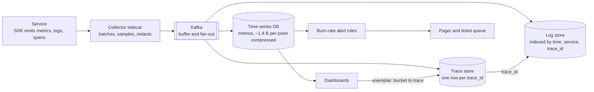
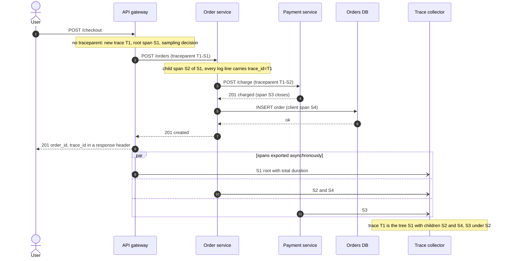
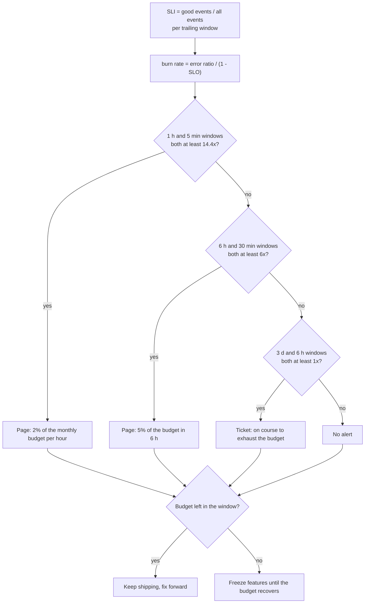

# Observability, SLOs and error budgets

## TL;DR

- Observability is answering questions you did not anticipate from a system's outputs: metrics, logs and traces joined by a trace id.
- Latency is a distribution: report p50 and p99 from histograms, never the mean, and never average percentiles across hosts.
- An SLO is a target on an SLI over a window; the gap to 100% is the error budget, and alerts fire on its burn rate.
- Interviewers raise it at "how do you monitor this?" and whenever a rollout needs a go/no-go signal.

## Core concepts

The strong answer to "how do you know it works?" is three signals joined by one id, a few numbers that describe what users experience, and a rule for when those numbers wake someone.

### Logs, metrics and traces

A metric is a number with a name and labels, sampled on a schedule. Its cost is per series, not per request, so it is the signal you keep complete: 100k hosts x 100 metrics every 10 s is 1M points/s, 16 MB/s raw at 16 B a point, ~1.4 TB/day raw, ~120 GB/day compressed. A log is an event with a payload, and its cost follows traffic: a server at ~1k QPS writing a 1 KB line per request emits 1 MB/s, 86 GB/day. A trace is the tree of timed spans one request left across services; it costs per request too, so it is sampled. Metrics say *that* something is wrong, traces *where*, logs *why*; they combine only through shared ids: the trace id on every log line, version labels on every metric.

**One pipeline per signal, joined by the trace id the edge generated.**



### Structured logging and correlation ids

Write logs as key-value records (`event=order_created order_id=81 latency_ms=38 trace_id=...`), never prose: pipelines index fields and cannot parse sentences. Every line carries timestamp, level, service, version, trace id and span id. The correlation id is generated at the edge when the client sends none, propagated in a header (W3C `traceparent` carries trace id and parent span id, so log correlation and tracing share one mechanism), attached through the request context, and returned in the response so support tickets carry it. Never log secrets.

### Distributed tracing: spans, context propagation, OpenTelemetry

A trace is a tree of spans under one 128-bit trace id; each span has an id, its parent's id, a name, a start time and a duration. In-process the current span rides on the request context; across processes it travels in `traceparent` or in message headers, where the consumer's span links to the producer's instead of nesting under it. Dapper fixed the design everyone copies: instrument the shared RPC and storage libraries once, decide sampling at the root (1 in 1,024 requests for Google's busiest services), collect spans out of band into a store keyed by trace id. OpenTelemetry standardises it: one SDK per language, the OTLP protocol, a collector that batches, samples and routes.

**Trace context crosses every hop in one header; spans are exported off the request path.**



### Metric types and cardinality

A counter only increases and is read as a rate; a gauge is a current value; a histogram counts observations into fixed buckets plus a sum and a count, so hosts can add theirs together; a summary computes quantiles on the client and can never be aggregated. The budget you manage is cardinality: each label combination is a series, and a 40-bucket histogram x 50 endpoints x 5 status classes x 200 hosts is 2M series. An unbounded label (user id, raw URL) creates a series per user and takes the monitoring system down; label only what you group by.

### Percentiles, and why averages lie

Latency is long-tailed and usually bimodal (cache hits and misses, first attempt and retry), so its mean describes no real request: in the demo below, 95% of requests take ~10 ms and 5% take ~400 ms, the mean is 31 ms, and p50 = 10 ms with p99 = 500 ms is the honest summary. Tails matter beyond their share because requests fan out: a page calling 100 backends in parallel is slower than the backend p99 whenever any one call is, which is 1 - 0.99^100 = 63% of pages. So report p50, p99 and p99.9 from histograms, whose bucket edges bound the error (edges growing 1.25x keep every estimate within 25%). And percentiles do not add: the demo's three healthy pools at p99 ~ 20 ms plus a canary pool with 0.2% of the traffic at p99 = 1.7 s average to 443 ms, while merging the histograms gives 22 ms against an exact 21 ms. The same numbers show the reverse trap: a healthy fleet p99 while one pool burns, so slice by version and pool.

### RED and USE

RED describes a service from the request side: Rate, Errors, Duration as percentiles, per endpoint; it is the raw material of SLIs. USE describes a resource: Utilization, Saturation (work waiting: queue depth, pool waiters), Errors, for CPUs, memory, disks, links and pools. Saturation is the early signal: a database at 70% CPU with a growing pool queue is already failing its callers. Google's four golden signals are RED plus saturation.

### SLI, SLO, SLA and the error budget

An SLI is a ratio of good events to all events, measured as close to the user as possible: non-5xx responses / all responses at the load balancer; responses under 300 ms / all responses. An SLO is the target over a window: 99.9% over a rolling 30 days. An SLA is the external contract with penalties, always looser than the SLO that protects it. The error budget is the remainder: 0.1% of requests, or 30 days x 1,440 min x 0.001 = 43.2 min of total outage per window. Budget left means you ship; budget gone means a feature freeze. Two constraints come from the availability table: dependencies in series multiply (two 99.9% services give 99.8%), so a service must be tighter than its callers' promise; and 99.99% leaves 4.38 min a month, less than a human needs to read a page, so four nines means automated mitigation.

### Burn-rate alerts and alert fatigue

A threshold alert ("errors above 1% for 5 minutes") pages for a harmless blip and sleeps through a 0.5% error rate that spends the whole budget. Alert on the budget instead. Burn rate = observed error ratio / budgeted error ratio: 1.0 spends the budget exactly at the window's end, and a burn of B over a window W spends B x W / 30 d of it. Hence the standard policy: 14.4x over 1 h is 14.4 x 1/720 = 2% of the budget, page; 6x over 6 h is 5%, page; 1x over 3 days is 10%, ticket. Each long window is paired with a short one (5 min, 30 min, 6 h) that must also be burning, so the alert clears minutes after the fix: the demo pages 43 minutes into a 2% error incident and clears two minutes after the rollback. Alert fatigue comes from anything else: page on symptoms (the SLI), never on causes (CPU), and send slow burns to tickets.

**Paired windows decide whether anyone is woken; the budget decides whether features ship.**



### Liveness, readiness and health checks

Liveness asks "is the process alive?" and a failure restarts it, so it must be cheap and must not touch dependencies: a liveness check that queries the database turns a database blip into a fleet-wide restart storm. Readiness asks "can this instance take traffic?" and a failure removes it from the load balancer: connections open, caches warm, configuration loaded, and deliberately failing during shutdown so in-flight requests drain. A check every 5 s across 1,000 instances is 200 checks/s: trivial when shallow, real load when each runs a query.

### Dashboards

A dashboard answers "is it my service, and what changed?" in under a minute. Same layout everywhere, top-down: the SLO panel with budget left and burn rate; RED per endpoint with p50, p99 and p99.9 on a log scale; USE for owned resources; deploy and config markers, because most incidents start with a change.

## Trade-offs

| Signal | Cost grows with | Cardinality | Best question | Sampling | Retention |
|---|---|---|---|---|---|
| Metrics | Number of series | Bounded labels only | Is something wrong, since when? | None, every event counted | Months, downsampled |
| Structured logs | Requests x bytes per line | Any field, at index cost | Why did this request fail? | By level and per event | Days to weeks, tiered |
| Traces | Requests x spans | Per-trace attributes | Where did the time go? | Head (1 in N) or tail (slow, failed) | Days |
| Client-side summaries | Number of series | Bounded | One host's quantiles | None | Short, cannot be merged |

Start with metrics: they are the only signal cheap enough to keep complete, they drive SLOs and alerts, and a histogram per endpoint gives a fleet p99. Add traces once a request crosses more than two services, because per-service metrics never reconstruct a path, and accept sampling: 1 in 1,000 at 1k QPS still yields 3,600 traces an hour, and tail sampling keeps the interesting ones. Logs are for specifics (the order id, the validation error, the stack trace): structure them, keep the trace id on every line, and cut volume with levels and sampling before you cut retention. A plain threshold alert suits only binary conditions (certificate expiring, disk full); for anything measured as a ratio, burn-rate rules over paired windows page less and catch more.

## Python implementation

The reference answer needs every raw sample, which a metrics pipeline cannot ship:

```python title="code/hld/percentiles.py — exact percentile"
--8<-- "code/hld/percentiles.py:exact"
```

`Histogram` is the shippable form: exponential edges, a count per bucket, a lock, `merge` that adds counts and `percentile` that interpolates inside the bucket holding the rank:

```python title="code/hld/percentiles.py — bucketed histogram"
--8<-- "code/hld/percentiles.py:histogram"
```

The helpers put the wrong and the right fleet aggregation side by side and generate the demo's bimodal latencies:

```python title="code/hld/percentiles.py — fleet aggregation"
--8<-- "code/hld/percentiles.py:fleet"
```

`uv run python -m hld.percentiles` prints:

```text
one service, 10,000 requests: 95% cache hits near 10 ms, 5% misses near 400 ms
  exact:     mean=30.7 ms  p50=10.2 ms  p90=15.1 ms  p99=500.7 ms  p99.9=680.9 ms
  histogram: mean=30.7 ms  p50=10.3 ms  p90=15.5 ms  p99=503.1 ms  p99.9=722.3 ms  (40 buckets, edges x1.25)
  the mean is a latency almost no request has; p50 and p99 describe both modes

four pools, 100,000 requests; the canary pool has 0.2% of the traffic and a bad deploy:
  us-east  share=40.0%  requests=40,000  p99=    18.2 ms
  us-west  share=35.0%  requests=35,000  p99=    22.4 ms
  eu-west  share=24.8%  requests=24,800  p99=    21.4 ms
  canary   share= 0.2%  requests=   200  p99=  1709.2 ms
  mean of the four p99s:          442.8 ms  <- wrong: percentiles do not average
  p99 of the merged histogram:     22.0 ms  <- right: add bucket counts, then read the percentile
  exact p99 of all requests:       20.9 ms
  the fleet p99 hides the canary entirely: slice percentiles by pool and by version
```

`Slo` turns a target and a window into a budget and converts error ratios into burn rates:

```python title="code/hld/error_budget.py — the SLO"
--8<-- "code/hld/error_budget.py:slo"
```

`BurnRateRule` pairs a long window with a short one; `default_rules` is the 2% / 5% / 10% policy for a 30-day window:

```python title="code/hld/error_budget.py — burn-rate rules"
--8<-- "code/hld/error_budget.py:rules"
```

`BudgetTracker` keeps timestamped good/bad counts from an injected clock and evaluates the rules over any trailing window:

```python title="code/hld/error_budget.py — the tracker"
--8<-- "code/hld/error_budget.py:tracker"
```

`uv run python -m hld.error_budget` prints:

```text
SLO: checkout availability 99.9% over 30 days
  budget: 0.1% of requests = 43.2 min of total outage; at 1,000 QPS that is 2,592,000 failed requests
  burn rate -> budget gone in: 1x 30 d, 2x 15 d, 6x 5 d, 14.4x 50 h, 36x 20 h, 1000x 43.2 min (1000x = total outage)
  page   fast burn long    1 h / short  5 min / burn >= 14.4 -> 2% of the budget at stake
  page   slow burn long    6 h / short 30 min / burn >= 6    -> 5% of the budget at stake
  ticket trickle   long    3 d / short    6 h / burn >= 1    -> 10% of the budget at stake
timeline at 1,000 QPS after 3 steady days at 0.05% errors (burn 0.5x):
  t=  0 min  steady: error ratio 0.05%, burn 0.5x
  t= 60 min  bad deploy: error ratio 2.00%, burn 20x
  t=103 min  PAGE  fast burn: 1 h burn 14.5x, 5 min burn 20.0x
  t=110 min  rolled back: error ratio 0.05%, burn 0.5x
  t=112 min  CLEAR fast burn: 1 h burn 16.7x, 5 min burn 12.2x
  budget used so far: 193,200 failed requests = 7.5%; the 50 bad minutes alone burned 2.3% (= 1.0 of the 43.2 min)
```

## In the interview

Introduce observability while you draw: "Every service exports RED metrics as histograms, logs are structured with the trace id, the gateway starts a trace and samples 1 in 100. The SLO is 99.9% availability over 30 days at the load balancer; we page on a 14.4x burn over one hour."

Phrases that signal depth: "p99 from merged histograms, never an average of percentiles"; "burn-rate alerts with a short window for reset"; "liveness never checks dependencies, readiness fails first during shutdown".

??? question "Your p99 dashboard shows 20 ms but users complain about 2-second pages. Why?"
    An average of per-host p99s or a client-side summary hiding a slow host; an SLI measured at the service rather than the user; or fan-out, where users see the max of many p99s. Fix the aggregation, measure at the edge, slice by version.

??? question "How would you set the SLO for a new service?"
    Measure the SLI for a few weeks, set the SLO slightly below current performance, tighten later. An SLO tighter than a dependency's is a wish; 99.99% leaves 4.38 minutes a month, so it needs automation.

??? question "Why pair a 1-hour window with a 5-minute window?"
    The long window makes the alert significant: 14.4x for an hour is 2% of the budget. The short window makes it current: once the fix lands the 5-minute burn drops and the page clears within minutes.

??? question "How do you trace a request that goes through a queue?"
    Carry the trace context in message headers. The consumer's span links to the producer's rather than nesting under it, because the producer's span ended long before; the queue wait becomes its own segment.

??? question "What does logging every request cost at 10k QPS?"
    At ~1 KB per line, 10 MB/s, 864 GB/day before replication and indexing; hence sampling, histograms plus traces instead of per-request logs, and tiered retention.

!!! tip "Interview tip"
    Put one number on the table before you are asked: "99.9% over 30 days is 43 minutes of budget; a 10-minute total outage spends a quarter of it." It shows you treat reliability as a quantity you spend.

## Common mistakes

- **Averaging percentiles**: a fleet p99 computed as the mean of host p99s. Fix: histograms with shared edges, merge, then read.
- **Alerting on causes**: CPU at 80%, a pod restart, a queue depth page when nobody is hurt and stay silent when users are. Fix: page on SLI burn rate; keep cause metrics for diagnosis.
- **Unbounded labels**: a user id or a parameterised URL as a metric label, one series per user. Fix: label only what you group by.
- **Liveness checks that touch dependencies**: a database hiccup becomes a restart storm. Fix: liveness checks the process, readiness checks dependencies.
- **Logs without a correlation id**: debugging means grepping five services by timestamp. Fix: a trace id from the edge on every line.

!!! warning "Common mistake"
    Reporting mean latency, or writing an SLO on it. The demo's mean of 31 ms hides that 5% of requests take half a second, and "mean under 100 ms" holds while a twentieth of your users wait. State SLIs as ratios of good events (under 300 ms) to all events; report p50, p99 and p99.9.

## Self-check

??? question "What is the difference between an SLI, an SLO and an SLA?"
    The measured ratio of good events; the internal target on it over a window; the external contract with consequences, set looser than the SLO.

??? question "How much budget does a 14.4x burn spend in one hour on a 30-day SLO?"
    14.4 x 1 h / 720 h = 2%: enough to deserve a human, small enough to catch the incident with most of the budget left.

??? question "Why can two histograms be merged but two summaries cannot?"
    Bucket counts add when the edges match; a summary has already collapsed its samples into quantiles, which cannot be combined.

??? question "What should a readiness check verify that a liveness check must not?"
    Dependencies and warm-up, plus a draining state during shutdown; liveness only checks that the process responds, because its failure triggers a restart.

??? question "Why is the sampling decision made at the root of a trace?"
    It must be consistent along the whole request or you get partial trees; the root decides once and records it in the trace flags.

## Related

- [Design a metrics monitoring and alerting system](../case-studies/metrics-monitoring.md) — storage, cardinality and retention
- [Resilience patterns](resilience-patterns.md) — the breakers and retries your dashboards show tripping
- [Back-of-envelope estimation](estimation.md) — the arithmetic behind the budget figures
- [Monolith, microservices, CQRS and event sourcing](microservices-and-architecture-styles.md) — why tracing becomes mandatory across services
- [Deployments, feature flags and data migrations](deployment-and-data-migrations.md) — canaries and rollbacks driven by SLIs
- Beyer et al. (eds.), *The Site Reliability Workbook* (2018), chapter 5, "Alerting on SLOs"
- Sigelman et al., "Dapper, a Large-Scale Distributed Systems Tracing Infrastructure" (Google Technical Report, 2010)
- W3C, "Trace Context" Recommendation (2021)
