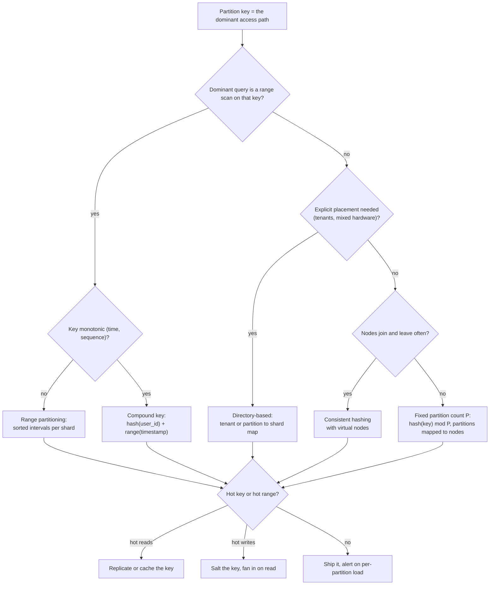
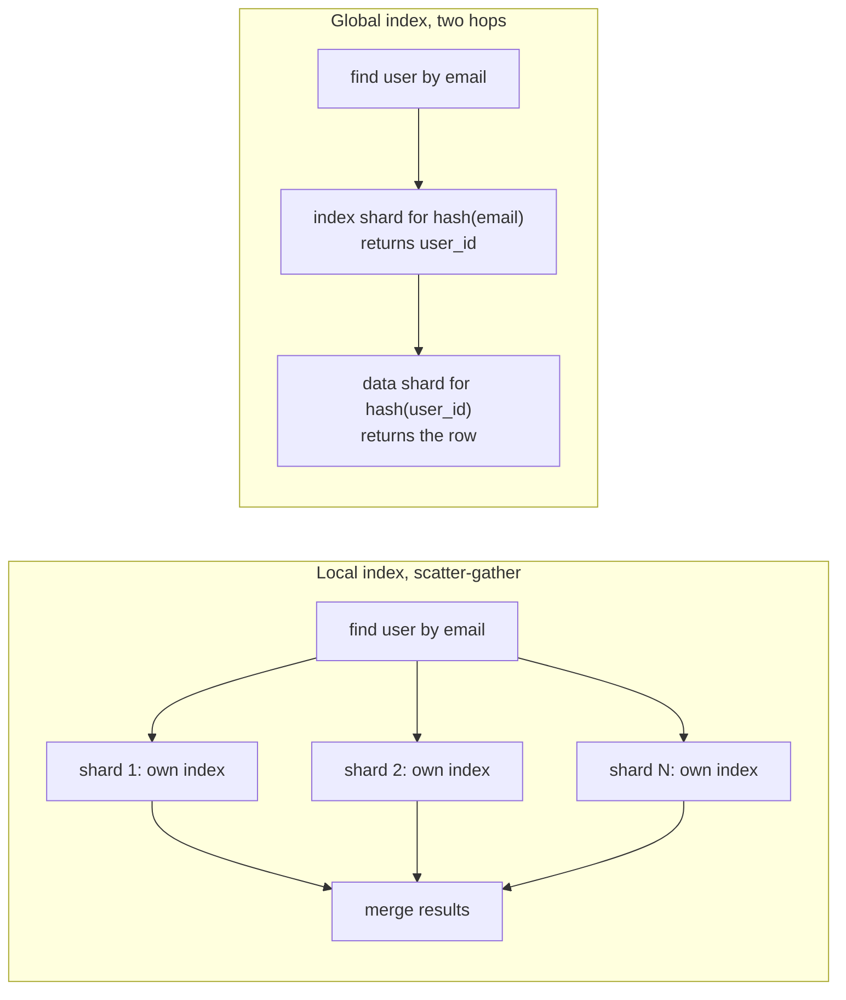
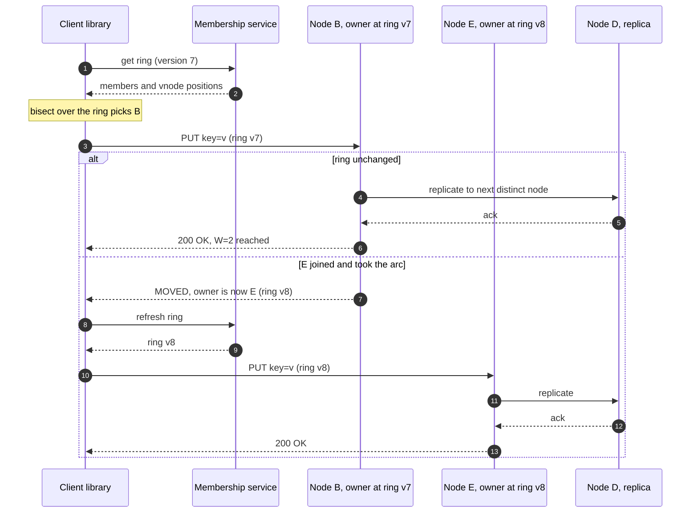

# Partitioning, sharding and consistent hashing

## TL;DR

- Partitioning (sharding) splits a dataset across nodes so no single machine holds all the data or serves all the load; replication copies each partition, and real designs do both.
- The partition key decides everything: it must match the dominant access path, spread load evenly and survive nodes joining and leaving without remapping most keys.
- Interviewers probe the key you chose, your hot-partition plan, how secondary-key lookups are served, and what moves when a node joins.

## Core concepts

You shard when one node can no longer hold the data or absorb the load. A single relational primary sustains ~5k-20k writes/s and a server holds 2-20 TB, so a Twitter-like post store (150M posts/day x 1 KB = 150 GB/day, ~55 TB/year) must partition within its first year on storage alone, before its write rate (1.7k/s average, 5k/s peak) forces it.

### Range vs hash partitioning

Range partitioning gives each partition a contiguous, sorted key interval, so a range scan touches one or a few partitions. Its weakness is correlated keys: a timestamp or auto-increment key sends every insert to the last partition, where at 5k posts/s peak one partition takes 100% of the writes — and a DynamoDB partition is capped at 1k WCU.

Hash partitioning places a key by `hash(key)`, so 5k writes/s over 16 partitions is ~300/s each, at the price of order: a range query becomes a scatter-gather over every partition. The compromise is a compound key — hash the first component to pick the partition, sort by the rest inside it. `(user_id, timestamp)` keeps one user's messages on one partition in time order (Cassandra's clustering columns, DynamoDB's sort key). Design the key so the dominant query is the within-partition kind.

**Follow the dominant query to a scheme, then handle the hot key separately.**



### Hotspots: celebrity keys, skew and salting

Uniform hashing evens out *keys*, not *traffic*. Access is Zipfian: a viral post can draw most of a Twitter-like system's ~500k peak feed reads/s, and one Redis shard serves ~100k ops/s, so that key alone is 5x one shard's capacity however you partition.

- **Hot reads**: replicate the key — an in-process cache, or k suffixed copies (`post:9#0..k-1`) so readers pick one at random and k shards share the load.
- **Hot writes**: salt the key with a random suffix `0..k-1` per write, spreading a counter over k partitions. Reads must fan in and sum k rows, so salt only keys you have measured as hot (a heavy-hitters sketch), never the whole keyspace.

### Secondary indexes: local vs global

A local (document-partitioned) index lives on each shard and covers only that shard's rows. Writes stay on one shard; a lookup by the indexed value (users by email when sharded by `user_id`) scatters to every shard, so its latency is the slowest of N parallel calls — with 100 shards, your p99 is the worst of 100 samples — and its cost is N requests.

A global (term-partitioned) index is itself partitioned by the indexed value: the index shard for `hash(email)` returns the `user_id`, then the data shard returns the row — two hops, ~2 x 500 µs = 1 ms floor. A write now touches the data shard and an index shard, so global indexes are updated asynchronously (as DynamoDB's global secondary indexes are). Rule: write-heavy tables with rare lookups get local indexes; hot lookup paths get global ones and accept the lag.

**Local index: one query fans out to every shard. Global index: two hops.**



### Rebalancing: fixed, dynamic or proportional partitions

Rebalancing should end even, move little and keep serving. Rule out `hash(key) mod N` first: growing from N to N+1 nodes remaps N/(N+1) of the keys — 80% at 4 to 5 — a resharding storm for 25% more capacity. Three schemes avoid it:

- **Fixed number of partitions**, far more than nodes: 1,024 partitions on 8 nodes is 128 each; adding 2 nodes steals ~26 from each old node, so ~205 partitions (20%) move, always whole ones (Elasticsearch shards, Couchbase vBuckets). Pick the count generously; it is fixed for life.
- **Dynamic splitting**: a partition splits past a size threshold and merges when it shrinks (HBase regions, MongoDB chunks). Pre-split new tables, which otherwise start as one partition.
- **Proportional to nodes**: a fixed number of partitions per node — consistent hashing with virtual nodes, below.

### Consistent hashing with virtual nodes

Hash both nodes and keys onto a ring of 2^32 positions; a key belongs to the first node clockwise from its position. Adding a node claims only the arc between its predecessor and itself, so about 1/(N+1) of the keys move, all onto the new node; removing a node moves only its own keys, to its clockwise successor.

{ width="800" }

With one point per node the arcs are random and uneven (the demo below measures a peak-to-mean load of 2.20), and a departing node dumps its whole load on one neighbour. Virtual nodes fix both: each physical node gets V points (`hash("B#0")`, `hash("B#1")`, ...) and owns V small arcs spread around the ring, as node B does in the figure. Imbalance shrinks roughly with 1/sqrt(V) — 1.03 at V=100 in the demo — and a departing node's keys scatter over many successors. The cost is a sorted table of N x V entries: 100 nodes x 200 vnodes = 20,000 points, one `bisect` of ~15 comparisons, ~15 x 100 ns = 1.5 µs against a 500 µs network hop. Use a stable, fast hash (Ketama uses MD5; MurmurHash3 and xxHash are common), never a language's built-in `hash()`, which is salted per process: every client must compute the identical ring.

### Replication on the ring

A key's preference list is the first N *distinct physical* nodes clockwise from it — skip further virtual nodes of a node already chosen and, in production, the same rack. The first is the coordinator, the rest hold replicas, and W writes and R reads among them give the quorums described in [Replication](replication.md). When a node dies, each affected list slides one node clockwise, so the successor takes its writes (hinted handoff).

### Request routing: client, proxy or coordinator

Three places can hold the ring:

- **Smart client**: the client library holds the ring and calls the owner directly — no extra hop, but every client must learn membership changes (config service or gossip) and a stale client hits the wrong node (Cassandra drivers).
- **Routing proxy**: clients talk to a proxy tier (Envoy, twemproxy) that holds the ring: one extra hop, ~500 µs inside a datacenter, and a tier to operate, but only proxies track topology.
- **Any node as coordinator**: the client contacts any node, which forwards to the owner or, Redis-Cluster style, answers `MOVED` with the right address so the client fixes its map.

**Smart-client routing with a stale ring: redirect, refresh, then replicate along the preference list.**



### Resharding and cross-shard queries

Resharding changes the key-to-shard function itself and is a data migration: create the new shards, dual-write (or tail the change log) while backfilling, verify counts and checksums, move reads, move writes, retire the old shards (see [Deployments, feature flags and data migrations](deployment-and-data-migrations.md)). With a ring or a directory only the moved arcs or partitions travel; with mod-N almost everything does, so choose the scheme before you have data.

Queries that omit the partition key pay for it: a scatter-gather fans out to every shard and merges — fine for rare or admin queries, not the hot path. Avoid cross-shard joins by co-locating rows that join (orders sharded by `customer_id`) or by denormalising; avoid cross-shard transactions with entity groups, otherwise you pay for 2PC or sagas ([Transactions, 2PC, sagas and idempotency](transactions-and-distributed-transactions.md)).

### Directory-based sharding

A directory (lookup service) stores an explicit map from key range, partition or tenant to shard. It is the most flexible scheme: move one noisy tenant to dedicated hardware, mark a partition "moving" so the old owner forwards writes mid-migration. The map is small — 10M tenants x ~32 B (16 B UUID, 4 B shard id, overhead) = ~320 MB — so every proxy or client caches it and refreshes on a version bump. The price: the directory sits on every request path and is a single point of failure, so run it on a replicated consistent store (ZooKeeper, etcd, MongoDB's config servers), cache hard, and map partitions, never keys.

## Trade-offs

| Scheme | Range scans | Hot-partition risk | Data moved when a node joins | Routing state | Typical use |
|---|---|---|---|---|---|
| Range partitioning | Cheap | High with monotonic keys | Operator-chosen partitions | Boundary table | HBase, Bigtable, time-series |
| Hash mod N | Scatter-gather | Low for keys only | ~N/(N+1) | Just N | Prototypes only |
| Consistent hashing + vnodes | Scatter-gather | Low; salt hot keys | ~1/(N+1) | N x V sorted points | Cassandra, DynamoDB, Riak, caches |
| Fixed partitions + map | Scatter-gather | Low | Whole partitions, ~1/(N+1) | Partition to node map | Elasticsearch, Couchbase, Kafka |
| Directory per tenant | Within a tenant | Tenant-size dependent | Moved tenants only | Tenant to shard map | Multi-tenant SaaS, Vitess |

Start from the query, not the technology. If the dominant access is "all rows for one entity in time order", hash the entity and sort inside the partition: messages, timelines, orders, metrics. If you need scans across entities, use range partitioning and fight the hot tail with a bucketed prefix. If the fleet is elastic — caches, Dynamo-style stores, session routing — consistent hashing with virtual nodes is the default: nodes join and leave with ~1/N movement and no central map. A fixed partition count with a small map is as good when you control the fleet size, with partition-granular moves and observability. Use a per-tenant directory when tenants differ by orders of magnitude or need isolation. Mod-N is acceptable only when N never changes — hashing into 1,024 *partitions* — never for hashing straight onto *machines*. Whatever you choose, the hot-key answer is separate: replication for reads, salting for writes, a cache for both.

## Python implementation

The ring position is the first 32 bits of a stable hash (the docstring says why `hash()` is the wrong tool):

```python title="code/hld/consistent_hashing.py — ring position"
--8<-- "code/hld/consistent_hashing.py:hashing"
```

`HashRing` keeps an immutable sorted tuple of `(position, node)` pairs, swapped under a lock on membership changes so lookups never block; `get_node` is one `bisect`, `preference_list` walks clockwise collecting distinct physical nodes:

```python title="code/hld/consistent_hashing.py — the ring"
--8<-- "code/hld/consistent_hashing.py:ring"
```

The helpers compare two placements of the same keys; `mod_assignments` is the naive scheme for contrast:

```python title="code/hld/consistent_hashing.py — key movement and load"
--8<-- "code/hld/consistent_hashing.py:stats"
```

`uv run python -m hld.consistent_hashing` prints:

```text
ring: 4 nodes x 100 vnodes = 400 points; 10,000 keys
load, vnodes=1:    A=309 B=124 C=4,077 D=5,490  peak/mean=2.20
load, vnodes=100:  A=2,577 B=2,466 C=2,509 D=2,448  peak/mean=1.03
preference list for user:42 (N=3): ['B', 'A', 'D']
add E, ring:   1,889/10,000 keys moved = 18.9%, 1,889 of them onto E (expected ~1/5 = 20%)
add E, mod N:  7,975/10,000 keys moved = 79.8% (expected ~4/5 = 80%)
remove B:      2,239 keys moved = 22.4%; B held 2,239 (expected ~1/5 = 20%)
preference list for user:42 after: ['E', 'A', 'D']
```

Note the last line: E's point landed between `user:42` and B's, so E became the coordinator and A and D stayed replicas — one copy moved, not three.

## In the interview

When you draw the data tier, name the key and the reason in one sentence: "I'll partition messages by `conversation_id`: the hot query is 'latest messages in one conversation', the hash spreads writes, the time sort key keeps that query on one node."

Phrases that signal depth: "the partition key must match the dominant access path"; "about 1/N movement on a topology change, so a ring or fixed partitions, never mod-N"; "local index on the write path, global index on the lookup path".

??? question "Shard key for a multi-tenant SaaS where one tenant is 30% of the traffic?"
    Shard by `tenant_id` through a directory: the big tenant gets a dedicated shard or a `(tenant_id, bucket)` split, and moving a tenant is a directory update plus a copy.

??? question "A node in your ring dies. What happens to its keys and load?"
    Keys stay readable from their other replicas; new writes go to the next distinct node clockwise, which keeps hints until recovery. Virtual nodes spread that load over many successors.

??? question "Why not hash(key) mod N and reshard in a maintenance window?"
    N to N+1 remaps N/(N+1) of the keys: 80% of the data moves for 25% more capacity and every cache misses at once. Hash into fixed partitions mapped to nodes instead.

??? question "Users are sharded by user_id. How do you serve 'find user by email'?"
    Scatter-gather over every shard's local index (N calls, p99 = the slowest shard), or a global index on `hash(email)` mapping to `user_id`, updated asynchronously: two hops, ~1 ms, brief lag. Login is read-heavy, so global wins.

??? question "How many virtual nodes, and what do they cost?"
    Enough for imbalance within a few percent: one point per node gave a 2.2x peak in the demo, a hundred gave 1.03x. Cost: 20k entries and a 15-step binary search — microseconds.

!!! tip "Interview tip"
    Volunteer the hot-key plan and the 1/N figure before you are asked. Candidates who wait for "what if one user is very popular?" sound like they have never run a sharded system.

## Common mistakes

- **Sharding by a key the queries do not use**: every read is a scatter-gather and p99 is the slowest shard. Fix: derive the key from the top queries; global-index the rest.
- **A monotonic range key**: every insert lands in the last partition. Fix: hash a prefix and keep time as the sort key.
- **Expecting consistent hashing to fix hot keys**: it balances key counts, not traffic. Fix: detect heavy hitters, replicate for reads, salt for writes.
- **Automatic rebalancing on failure detection**: a slow node looks dead, its data moves, the move slows its neighbours, they look dead too. Fix: rate-limit or gate the movement.

!!! warning "Common mistake"
    Hashing keys straight onto machines with `hash(key) mod N`: the first node you add changes the owner of 80% of a 4-node cluster's keys, every cache misses at once and the database takes the full read load. Say "mod N" only with "into a fixed number of partitions" in the same breath.

## Self-check

??? question "What moves when a 10-node ring grows to 11?"
    About 1/11 (~9%) of the keys, all onto the new node; no key moves between existing nodes. Mod-N would move 10/11 (~91%).

??? question "Why does a preference list skip virtual nodes of a node already chosen?"
    Two copies on one machine die together; replicas exist to survive that. Production also skips the same rack or zone.

??? question "When is a local secondary index the right choice?"
    Write-heavy tables with rare secondary lookups: writes stay local and the occasional scatter-gather is affordable.

??? question "Why must every client compute the identical ring?"
    Otherwise two clients write the same key to different nodes. It takes a stable hash (not a per-process salted one) and a deterministic tie-break.

??? question "How do you salt a hot counter, and what does it cost reads?"
    Write to `counter:{post}#{0..k-1}` chosen at random, spreading writes over k partitions; a read sums k rows. Salt only measured hot keys.

## Related

- [Replication](replication.md) — quorums and hinted handoff
- [Design a Dynamo-style key-value store](../case-studies/key-value-store.md) — the ring end to end
- [Design a distributed cache](../case-studies/distributed-cache.md) — client-side vs proxy routing
- [Load balancing, reverse proxies and API gateways](load-balancing-and-api-gateway.md) — sticky routing
- [Transactions, 2PC, sagas and idempotency](transactions-and-distributed-transactions.md) — cross-shard writes
- [Deployments, feature flags and data migrations](deployment-and-data-migrations.md) — resharding as a migration
- Karger et al., "Consistent Hashing and Random Trees" (STOC 1997)
- DeCandia et al., "Dynamo: Amazon's Highly Available Key-value Store" (SOSP 2007)
- Mirrokni, Thorup and Zadimoghaddam, "Consistent Hashing with Bounded Loads" (2016)
